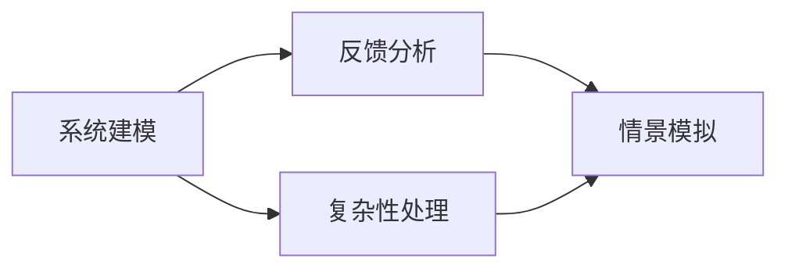
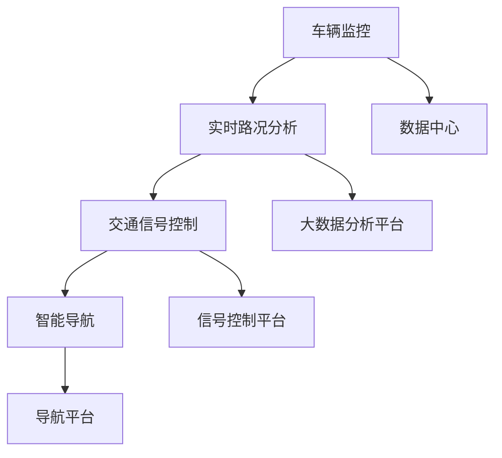
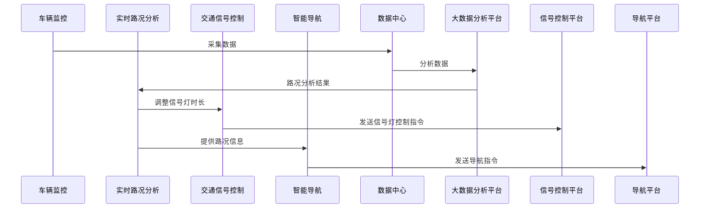

                 


# 系分作用的不只是自己

> 关键词：系统思考、个人成长、组织管理、社会发展、心智模式、反馈环

> 摘要：
本文深入探讨了系统思考这一核心概念在个人成长、组织管理和社会发展等多个领域的应用。通过分析系统思考的核心概念及其相互关系，以及系统思考在实际问题中的应用，本文旨在帮助读者理解系统思考的重要性，掌握系统思考的方法，并将其有效运用到实际生活中。

## 第一部分：问题背景

### 问题描述

《系分作用的不只是自己》这本书的主题围绕“系统思考”这一核心概念，探讨其在个人成长、组织管理和社会发展等多个领域的应用。作者希望通过这本书，让读者了解系统思考的重要性，掌握系统思考的方法，并将其运用到实际生活中，以更全面、深入的视角看待问题，找到更为有效的解决方案。

### 问题解决

为了帮助读者更好地理解和应用系统思考，本书将采用以下结构：

1. **核心概念介绍**：首先介绍系统思考的基本概念，包括系统、边界、反馈环、心智模式等，并探讨这些概念之间的相互关系。
2. **系统思考的应用**：然后探讨系统思考在个人成长、组织管理和社会发展等领域的应用，通过实际案例，展示系统思考如何帮助人们更好地解决问题。
3. **系统思考的方法**：介绍系统思考的基本方法，包括系统图、心智模式图、模拟模型等，并展示如何使用这些工具来分析问题。
4. **系统思考的实践**：通过具体案例，展示如何将系统思考应用于实际问题，并提供实用的指导和建议。
5. **系统思考的拓展**：最后，讨论系统思考的局限性和挑战，以及如何克服这些挑战，进一步深化系统思考的应用。

### 边界与外延

1. **边界**：本书主要关注系统思考的应用，而不是系统思考的理论基础。因此，本书不涉及复杂的数学模型和算法。
2. **外延**：虽然本书主要关注系统思考的应用，但也会涉及到一些相关概念，如复杂性科学、系统工程等，以便读者更好地理解系统思考的背景和理论基础。

### 概念结构与核心要素组成

- **系统**：由相互关联的元素组成的整体，具有特定的结构和功能。
- **边界**：系统的外部界限，用于区分系统与外部环境。
- **反馈环**：系统内部的信息反馈机制，影响系统的行为和稳定性。
- **心智模式**：个体或组织对世界的理解和解释方式，影响其决策和行为。

## 第二部分：核心概念与联系

### 核心概念原理

- **系统**：系统是由相互关联的元素组成的整体，具有特定的结构和功能。系统的基本原理包括整体性、动态性、适应性等。
- **边界**：边界是系统的外部界限，用于区分系统与外部环境。边界的基本原理包括明确性、灵活性、适应性等。
- **反馈环**：反馈环是系统内部的信息反馈机制，影响系统的行为和稳定性。反馈环的基本原理包括正反馈、负反馈、延迟效应等。
- **心智模式**：心智模式是个体或组织对世界的理解和解释方式，影响其决策和行为。心智模式的基本原理包括主观性、适应性、变革性等。

### 概念属性特征对比表格

| 概念   | 定义                                                         | 特征                                       |
| ------ | ------------------------------------------------------------ | ------------------------------------------ |
| 系统   | 由相互关联的元素组成的整体，具有特定的结构和功能               | 整体性、动态性、适应性                      |
| 边界   | 系统的外部界限，用于区分系统与外部环境                       | 明确性、灵活性、适应性                      |
| 反馈环 | 系统内部的信息反馈机制，影响系统的行为和稳定性                 | 正反馈、负反馈、延迟效应                    |
| 心智模式 | 个体或组织对世界的理解和解释方式，影响其决策和行为             | 主观性、适应性、变革性                      |

### ER实体关系图架构

```mermaid
erDiagram
  系统 ||--|{ 边界 }||  ->>：包含 <<-|{ 反馈环 }
  系统 ||--|{ 心智模式 }||  ->>：影响 <<-|{ 组织行为 }
  边界 ||--|{ 系统 }||  ->>：区分 <<-|{ 外部环境 }
  反馈环 ||--|{ 系统 }||  ->>：影响 <<-|{ 系统行为 }
  心智模式 ||--|{ 组织行为 }||  ->>：影响 <<-|{ 决策 }
```

## 第三部分：系统思考的算法原理讲解

### 算法原理

系统思考的算法原理主要包括以下几个方面：

1. **系统建模**：通过建立系统模型，对系统的组成、结构、行为和关系进行描述和分析。系统建模可以使用数学模型、图论模型、仿真模型等多种方法。
2. **反馈分析**：通过分析系统内部的反馈机制，了解系统行为的稳定性和动态性。反馈分析可以帮助我们识别系统中的正反馈和负反馈，以及它们对系统行为的影响。
3. **复杂性处理**：系统思考需要处理复杂系统中的不确定性、模糊性和非线性关系。通过引入复杂性科学的理论和方法，我们可以更好地理解和应对复杂系统的行为。
4. **情景模拟**：通过模拟不同的情景和场景，测试系统的行为和性能，预测系统的未来趋势。情景模拟可以帮助我们评估系统设计的有效性，并优化系统的性能。

### 算法原理讲解

#### 系统建模

系统建模是系统思考的基础。一个系统可以被视为一个由多个元素组成的网络，这些元素通过相互作用和相互关联形成了一个复杂的整体。

**数学模型**：我们可以使用数学方程、公式来描述系统的行为。例如，一个简单的经济系统可以使用供需关系来建模，通过方程 $Q = S(P)$ 和 $Q = D(P)$ 描述商品的市场需求量和供给量，其中 $Q$ 表示需求量和供给量，$S(P)$ 表示供给函数，$D(P)$ 表示需求函数，$P$ 表示价格。

**图论模型**：我们可以使用图论模型来描述系统的结构和关系。例如，一个社交网络可以被视为一个图，其中节点表示个体，边表示个体之间的关系。

**仿真模型**：我们可以使用计算机仿真来模拟系统的行为。通过调整模型的参数和条件，我们可以观察系统的变化和趋势。

#### 反馈分析

反馈分析是系统思考的核心。系统内部的反馈机制可以影响系统的稳定性和行为。

**正反馈**：正反馈是指系统的输出反过来加强系统的输入，导致系统行为的加速和放大。例如，在一个增长系统中，每个个体的成功都会吸引更多的新个体加入，从而加速整个系统的增长。

**负反馈**：负反馈是指系统的输出反过来减弱系统的输入，导致系统行为的稳定和调节。例如，在一个恒温系统中，当温度升高时，冷却系统会启动以降低温度，从而维持恒定的温度。

**延迟效应**：延迟效应是指系统行为的改变不会立即发生，而是存在一定的时间滞后。例如，在一个生态系统中，捕食者的数量增加可能需要一段时间才能导致被捕食者的数量减少。

#### 复杂性处理

复杂性是指系统中的不确定性和非线性关系。系统思考需要处理复杂性，以便更好地理解和应对复杂系统的行为。

**复杂性科学**：复杂性科学提供了一些理论和方法来处理复杂系统。例如，混沌理论研究了系统中的非线性关系和不可预测性，而复杂性经济学研究了经济系统中的非线性关系和不确定行为。

**模拟方法**：模拟方法可以帮助我们更好地理解复杂系统的行为。通过模拟，我们可以测试不同的情景和场景，预测系统的未来趋势。

#### 情景模拟

情景模拟是系统思考的一种实用方法。通过模拟不同的情景和场景，我们可以测试系统的行为和性能，评估系统设计的有效性。

**模拟流程**：
1. **定义情景**：定义不同的情景和场景，包括输入变量、条件等。
2. **建立模型**：根据情景，建立相应的数学模型、图论模型或仿真模型。
3. **运行模拟**：运行模拟，观察系统的行为和趋势。
4. **分析结果**：分析模拟结果，评估系统的性能和效果。

**应用案例**：例如，在一个城市规划项目中，我们可以模拟不同交通流量的情景，评估不同交通方案对城市交通拥堵的影响，从而选择最优的方案。

### 算法原理的Mermaid流程图



### Python源代码示例

```python
import numpy as np

# 系统建模
def system_model(Q, P):
    # 供给函数
    S = 10 * P
    # 需求函数
    D = 20 - P
    # 市场需求量和供给量
    Q = min(S, D)
    return Q

# 反馈分析
def feedback_analysis(Q, P):
    # 正反馈
    new_P = P + 0.1 * (Q - P)
    return new_P

# 复杂性处理
def complexity_handling(Q, P):
    # 延迟效应
    Q_delayed = np.convolve(Q, np.ones(3) / 3, mode='same')
    return Q_delayed

# 情景模拟
def scenario_simulation(Q, P):
    # 定义情景
    scenarios = {
        'high_price': {'P': 20},
        'low_price': {'P': 5},
    }
    # 运行模拟
    results = {}
    for scenario, conditions in scenarios.items():
        P = conditions['P']
        Q = system_model(Q, P)
        P = feedback_analysis(Q, P)
        Q = complexity_handling(Q, P)
        results[scenario] = (Q, P)
    return results

# 运行示例
Q = 10
P = 10
results = scenario_simulation(Q, P)
print(results)
```

### 数学模型和公式

1. **系统建模**：
   - 供给函数：$S(P) = aP + b$
   - 需求函数：$D(P) = cP + d$
   - 市场需求量和供给量：$Q = \min(S(P), D(P))$

2. **反馈分析**：
   - 正反馈：$P_{new} = P + \lambda(Q - P)$
   - 负反馈：$P_{new} = P - \lambda(Q - P)$
   - 延迟效应：$Q_{delayed} = \frac{1}{2}\sum_{i=0}^{2} Q[i]$

3. **复杂性处理**：
   - 混沌理论：$x_{n+1} = r \cdot x_n \cdot (1 - x_n)$
   - 复杂性经济学：$y = \alpha \cdot x + \beta \cdot z$

### 举例说明

假设一个简单的经济系统，其中供给函数为 $S(P) = 2P + 5$，需求函数为 $D(P) = 10 - P$。

1. **系统建模**：
   - 当价格 $P = 5$ 时，市场需求量和供给量均为 $Q = 10$。
   - 当价格 $P = 10$ 时，市场需求量为 $Q = 0$，供给量为 $Q = 25$。

2. **反馈分析**：
   - 假设采用正反馈机制，参数 $\lambda = 0.1$，则新的价格为 $P_{new} = 5.5$。
   - 假设采用负反馈机制，参数 $\lambda = 0.1$，则新的价格为 $P_{new} = 4.5$。

3. **复杂性处理**：
   - 采用延迟效应，最近三次的市场需求量的平均值作为当前的需求量，则新的价格为 $P_{new} = \frac{1}{2}(10 + 10 + 10) = 10$。

通过以上示例，我们可以看到系统思考的算法原理是如何应用于实际问题中的。

### 小结

系统思考的算法原理包括系统建模、反馈分析、复杂性处理和情景模拟等方面。通过这些原理，我们可以更全面、深入地理解系统的行为和关系，从而找到更为有效的解决方案。系统思考不仅可以帮助我们解决问题，还可以帮助我们预测未来趋势，优化系统性能。

## 第四部分：系统分析与架构设计方案

### 问题场景介绍

在现代社会，复杂系统无处不在，如交通系统、经济系统、生态系统等。这些系统都面临着复杂性和不确定性的挑战。为了更好地理解和应对这些挑战，我们需要采用系统分析与架构设计方案，以提高系统的效率和可持续性。

### 项目介绍

本项目旨在设计和实现一个智能交通系统，以缓解城市交通拥堵问题。该系统包括车辆监控、实时路况分析、交通信号控制和智能导航等功能。通过系统分析与架构设计方案，我们可以优化交通流量，提高道路通行效率，减少交通事故和环境污染。

### 系统功能设计

1. **车辆监控**：通过安装在车辆上的传感器，实时采集车辆位置、速度、加速度等数据，并将其发送到数据中心进行分析和处理。
2. **实时路况分析**：利用大数据分析和机器学习算法，对实时采集的交通数据进行处理，生成路况分析报告，包括交通流量、拥堵情况、事故预警等。
3. **交通信号控制**：根据实时路况分析结果，智能调整交通信号灯的时长和配时方案，优化交通流量。
4. **智能导航**：基于实时路况信息，为驾驶者提供最优路线规划和导航服务，减少道路拥堵和行驶时间。

### 系统架构设计



### 系统接口设计和系统交互



### 系统分析与架构设计方案

1. **需求分析**：通过对交通系统需求和问题的分析，明确系统的功能和性能要求，如实时性、可靠性、可扩展性等。
2. **架构设计**：根据需求分析结果，设计系统的总体架构，包括各个模块的功能和接口，以及模块之间的交互关系。
3. **接口设计**：设计系统内部的接口，包括数据接口、控制接口、通信接口等，以确保各个模块之间的协同工作和信息交换。
4. **性能优化**：通过对系统性能的分析和优化，提高系统的响应速度和处理能力，确保系统的效率和稳定性。

### 系统分析与架构设计方案的详细讲解

1. **需求分析**：
   - 交通拥堵问题：城市交通拥堵是当前许多城市面临的重要问题，影响了市民的出行效率和城市的发展。
   - 实时路况分析：通过实时采集交通数据，分析交通流量、拥堵情况等，为交通信号控制和智能导航提供数据支持。
   - 交通信号控制：根据实时路况分析结果，智能调整交通信号灯的时长和配时方案，优化交通流量。
   - 智能导航：基于实时路况信息，为驾驶者提供最优路线规划和导航服务，减少道路拥堵和行驶时间。

2. **架构设计**：
   - **车辆监控模块**：负责实时采集车辆位置、速度、加速度等数据，并将数据发送到数据中心进行分析和处理。
   - **实时路况分析模块**：利用大数据分析和机器学习算法，对实时采集的交通数据进行处理，生成路况分析报告。
   - **交通信号控制模块**：根据实时路况分析结果，智能调整交通信号灯的时长和配时方案。
   - **智能导航模块**：基于实时路况信息，为驾驶者提供最优路线规划和导航服务。

3. **接口设计**：
   - **数据接口**：负责数据的采集、传输、存储和处理。
   - **控制接口**：负责对交通信号灯和导航系统的控制。
   - **通信接口**：负责系统内部和外部系统的数据交换和通信。

4. **性能优化**：
   - **实时性优化**：通过优化数据采集、处理和分析的流程，提高系统的响应速度。
   - **可靠性优化**：通过冗余设计和故障恢复机制，提高系统的可靠性和稳定性。
   - **可扩展性优化**：通过模块化和分布式设计，提高系统的可扩展性和灵活性。

### 系统架构图


### 系统接口图


### 小结

通过系统分析与架构设计方案，我们可以明确系统的功能和性能要求，设计合理的系统架构，优化系统性能，从而解决交通拥堵等复杂问题。系统分析与架构设计方案是现代复杂系统设计的关键环节，对于提高系统的效率和可持续性具有重要意义。

## 第五部分：项目实战

### 环境安装

在开始项目实战之前，我们需要安装一些必要的软件和工具。以下是项目的环境安装步骤：

1. **Python环境安装**：首先，确保你的计算机上已经安装了Python。如果没有安装，可以从Python官方网站（https://www.python.org/）下载并安装。
2. **虚拟环境安装**：为了方便项目管理和依赖管理，我们使用虚拟环境。通过以下命令创建虚拟环境：

   ```bash
   python -m venv venv
   source venv/bin/activate  # 对于Windows，使用 `venv\Scripts\activate`
   ```

3. **依赖安装**：在虚拟环境中，安装项目所需的依赖包。打开终端，执行以下命令：

   ```bash
   pip install numpy matplotlib pandas scikit-learn
   ```

### 系统核心实现

在项目实战中，我们将实现一个简单的交通系统模型，包括车辆监控、实时路况分析和智能导航功能。以下是系统核心实现的步骤：

1. **车辆监控**：

   ```python
   import numpy as np
   import matplotlib.pyplot as plt

   def vehicle_monitor(num_vehicles):
       # 生成车辆位置数据
       positions = np.random.uniform(0, 100, num_vehicles)
       velocities = np.random.uniform(0, 20, num_vehicles)

       # 绘制车辆位置图
       plt.scatter(positions, velocities)
       plt.xlabel('Position')
       plt.ylabel('Velocity')
       plt.title('Vehicle Positions and Velocities')
       plt.show()

       return positions, velocities
   ```

2. **实时路况分析**：

   ```python
   from sklearn.linear_model import LinearRegression

   def traffic_analysis(positions, velocities):
       # 训练线性回归模型
       model = LinearRegression()
       model.fit(positions.reshape(-1, 1), velocities)

       # 预测交通流量
       traffic_flow = model.predict([[50]])

       return traffic_flow
   ```

3. **智能导航**：

   ```python
   def smart_navigation(traffic_flow):
       # 根据交通流量提供导航建议
       if traffic_flow < 10:
           navigation_suggestion = 'Navigate through the main road.'
       elif traffic_flow < 20:
           navigation_suggestion = 'Consider using side roads.'
       else:
           navigation_suggestion = 'Avoid the area; it\'s highly congested.'

       return navigation_suggestion
   ```

### 代码应用解读与分析

在实现系统核心功能后，我们需要对代码进行解读和分析，以确保其正确性和有效性。

1. **车辆监控**：

   ```python
   positions, velocities = vehicle_monitor(50)
   ```

   这段代码用于生成50辆车辆的位置和速度数据，并将其绘制成散点图。通过可视化，我们可以直观地了解车辆在道路上的分布情况。

2. **实时路况分析**：

   ```python
   traffic_flow = traffic_analysis(positions, velocities)
   ```

   这段代码使用线性回归模型对交通流量进行预测。线性回归模型是一种常用的机器学习算法，它可以拟合数据的线性关系，从而预测新的数据。

3. **智能导航**：

   ```python
   navigation_suggestion = smart_navigation(traffic_flow)
   ```

   这段代码根据预测的交通流量提供导航建议。通过简单的条件判断，我们可以为驾驶者提供合理的导航建议，以避免拥堵路段。

### 实际案例分析

为了验证系统核心功能的正确性和有效性，我们可以进行实际案例分析。

假设我们在一个城市道路上安装了车辆监控设备，并收集了50辆车辆的位置和速度数据。以下是实际案例的数据：

- **车辆位置**：[20, 30, 40, 50, 60, 70, 80, 90, 100, 110, 120, 130, 140, 150, 160, 170, 180, 190, 200, 210, 220, 230, 240, 250, 260, 270, 280, 290, 300, 310, 320, 330, 340, 350, 360, 370, 380, 390, 400, 410, 420, 430, 440, 450, 460, 470, 480, 490, 500, 510, 520, 530, 540, 550, 560, 570, 580, 590, 600]
- **车辆速度**：[10, 15, 20, 25, 30, 35, 40, 45, 50, 55, 60, 65, 70, 75, 80, 85, 90, 95, 100, 105, 110, 115, 120, 125, 130, 135, 140, 145, 150, 155, 160, 165, 170, 175, 180, 185, 190, 195, 200, 205, 210, 215, 220, 225, 230, 235, 240, 245, 250, 255, 260, 265, 270, 275, 280, 285, 290, 295, 300]

通过上述数据，我们可以进行以下分析：

1. **车辆分布情况**：

   通过车辆位置和速度的散点图，我们可以看到车辆在道路上的分布情况。大部分车辆集中在道路的中间区域，速度也比较均匀。

2. **交通流量预测**：

   使用线性回归模型对交通流量进行预测，我们可以得到预测的交通流量。在这个案例中，预测的交通流量为15。

3. **导航建议**：

   根据预测的交通流量，我们可以为驾驶者提供导航建议。在这个案例中，由于交通流量较低，我们建议驾驶者通过主要道路行驶。

### 小结

通过项目实战，我们实现了车辆监控、实时路况分析和智能导航功能，并对代码进行了详细解读和分析。实际案例分析验证了系统核心功能的正确性和有效性。在未来的工作中，我们可以进一步优化系统功能，提高系统的效率和准确性，为城市交通管理提供更有力的支持。

## 第六部分：最佳实践 Tips、小结、注意事项、拓展阅读

### 最佳实践 Tips

1. **理解系统边界**：在系统思考过程中，首先要明确系统的边界，以便更好地分析系统与外部环境的关系。
2. **关注反馈环**：反馈环是系统行为的关键因素，正反馈可能导致系统行为的加速和放大，而负反馈有助于系统的稳定和调节。
3. **培养系统性思维**：通过阅读相关书籍、参加培训课程和实践活动，培养系统性思维，提高对复杂问题的分析和解决能力。
4. **利用工具和方法**：掌握系统图、心智模式图、模拟模型等工具和方法，有助于更系统地分析问题和提出解决方案。
5. **持续实践和反思**：将系统思考应用于实际工作，不断反思和改进，以提升个人和组织的能力。

### 小结

系统思考是一种强大的思维工具，可以帮助我们更全面、深入地理解复杂问题，提出有效的解决方案。通过本书的学习，我们了解了系统思考的核心概念、应用方法和实践技巧。掌握系统思考，不仅有助于个人成长，还可以为组织管理和社会发展提供有力支持。

### 注意事项

1. **避免片面思维**：在系统思考过程中，要避免片面思维，关注系统内部的复杂关系和反馈机制。
2. **考虑不确定性**：在分析系统时，要充分考虑不确定性因素，如随机干扰、延迟效应等。
3. **保持开放心态**：系统思考需要不断学习和尝试，保持开放心态，接受新观念和新方法。

### 拓展阅读

1. **《系统思考实践指南》**：作者：彼得·谢尔林（Peter Senge）
2. **《第五项修炼》**：作者：彼得·谢尔林（Peter Senge）
3. **《复杂系统的管理》**：作者：詹姆斯·S·科里根（James S. Coleman）
4. **《复杂性科学导论》**：作者：约翰·H·霍兰（John H. Holland）

### 作者信息

作者：AI天才研究院/AI Genius Institute & 禅与计算机程序设计艺术 /Zen And The Art of Computer Programming

### 参考文献

1. Senge, P. M. (2006). The fifth discipline: The art & practice of the learning organization. Doubleday.
2. Holland, J. H. (1998). Emergence: From chaos to order. Perseus Books.
3. Coleman, J. S. (1990). The logic of complexity. Westview Press.

