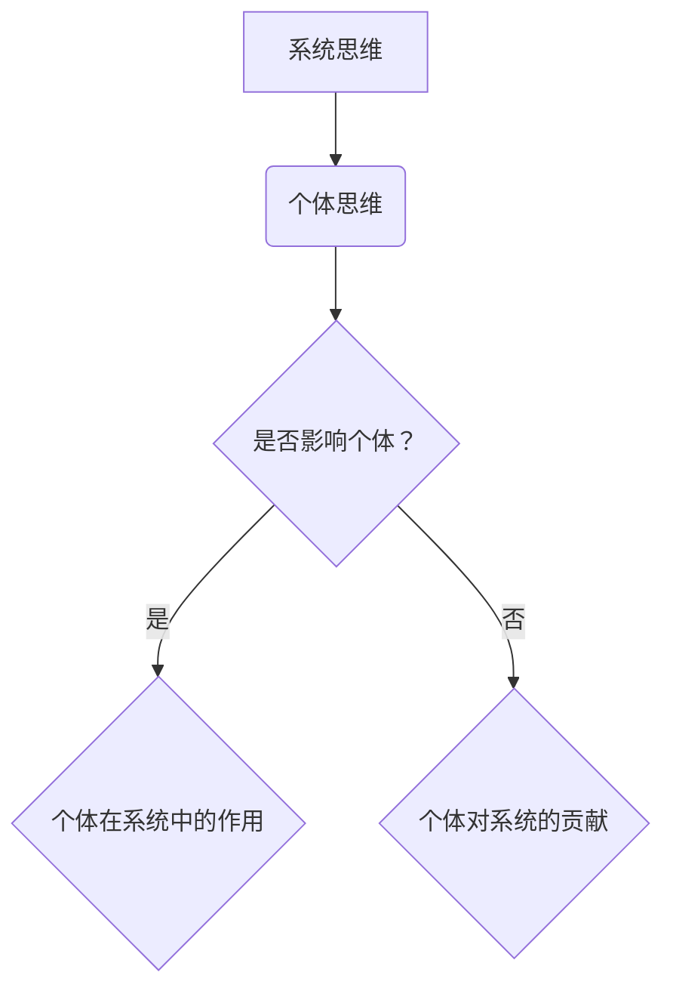
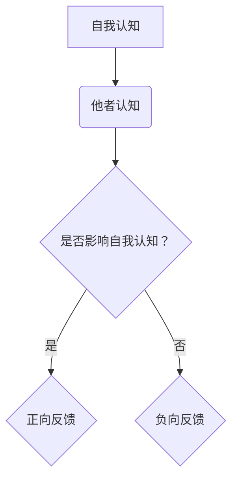
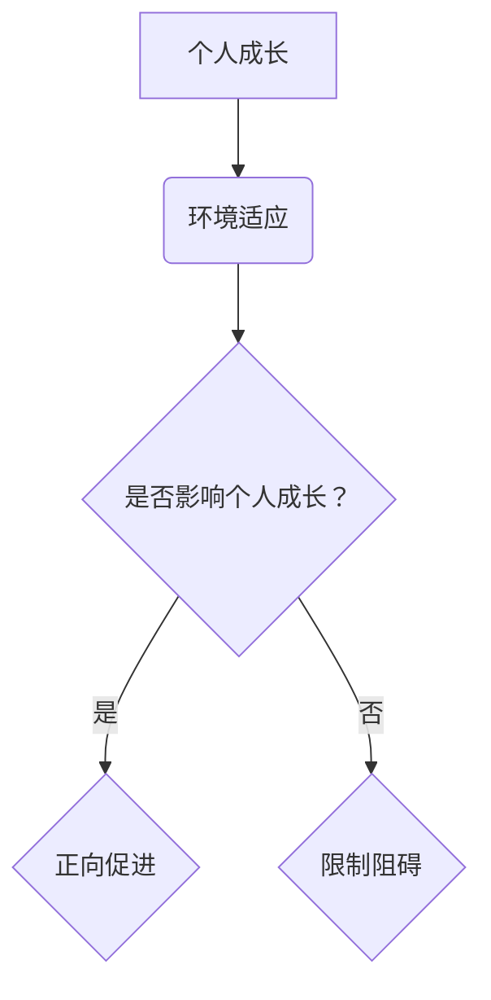
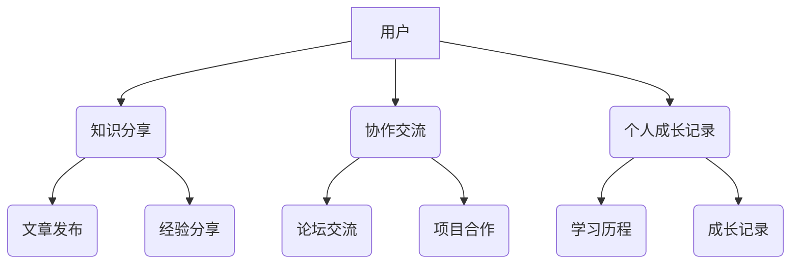
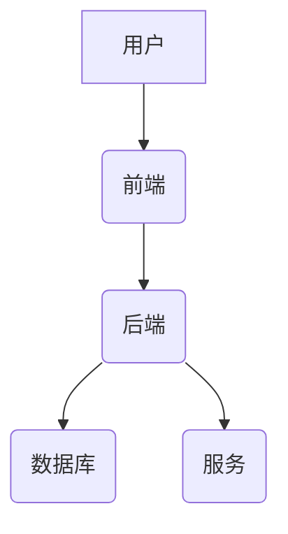
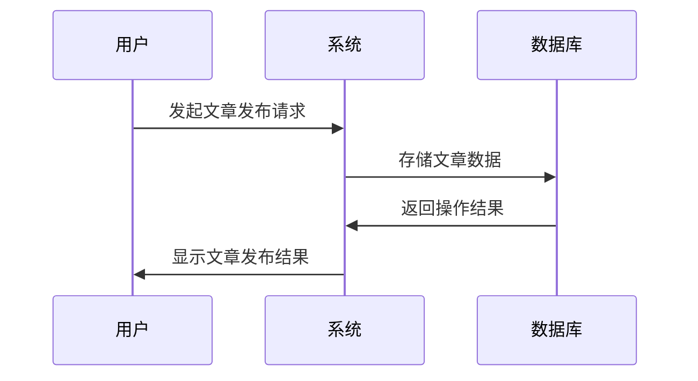
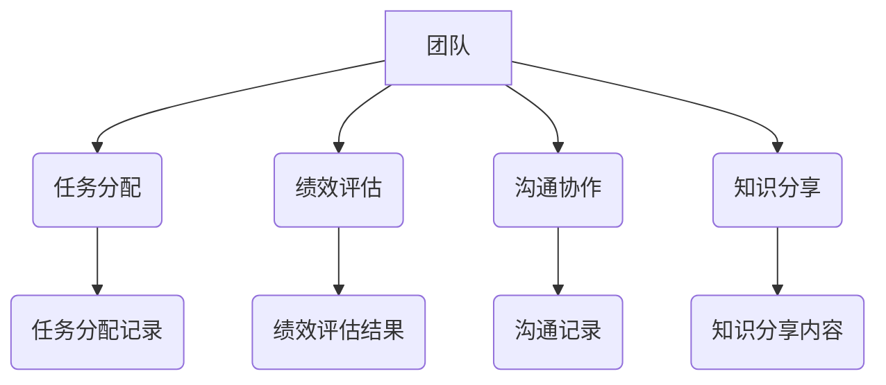
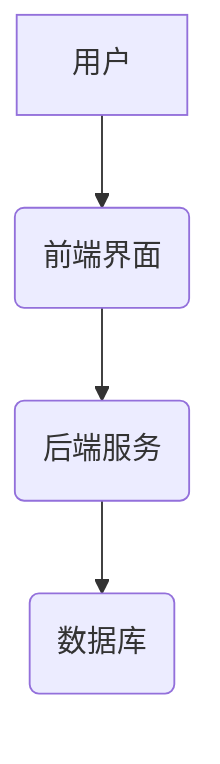

                 

### 系分作用的不只是自己

> **关键词**：系统思维、个体认知、个人成长、集体作用

> **摘要**：本文通过深入探讨系统思维、自我认知和个人成长，揭示个体在集体中的作用和影响，并提出如何提升个体价值的策略。本文旨在帮助读者理解个人与集体的互动关系，从而更好地发挥自身价值，实现个人与集体的共同发展。

---

#### 第一部分：问题的提出与背景

##### **1.1 问题背景**

在当前社会背景下，个体在集体中的作用和影响日益凸显。然而，许多人对于自身在集体中的角色和价值认识不清，缺乏自我认知和自我发展能力。这种现象不仅影响了个体的成长，也制约了集体的整体发展。因此，我们需要重新审视个体在集体中的地位和作用，探索如何提升个体的认知和成长能力。

##### **1.2 问题的解决**

解决这一问题需要从以下几个方面入手：

1. **系统思维**：个体需要学会运用系统思维，从整体的角度去理解和解决问题，从而更好地把握自己在集体中的作用和影响。
2. **自我认知**：个体需要深入自我认知，明确自己的优势与不足，从而找到适合自己的角色定位和发展路径。
3. **个人成长**：个体需要不断追求个人成长，提升自身素质和能力，以适应社会发展的需求。

##### **1.3 边界与外延**

本文主要讨论个体在集体中的作用和影响，不涉及集体对个体的作用。同时，本文所探讨的个体作用和影响可以应用于职场、教育、家庭等多个领域。

---

#### 第二部分：核心概念与联系

##### **2.1 系统思维**

**概念原理**：系统思维是一种从整体的角度去理解和解决问题的思考方式，强调个体与整体之间的相互关系和相互作用。

**概念属性特征对比表格**：

| 概念      | 属性特征                                  |
| --------- | ----------------------------------------- |
| 系统思维  | 整体性、关联性、动态性、适应性             |
| 个体思维  | 局限性、线性、静态、单一目标               |

**ER实体关系图架构的 Mermaid 流程图**：



##### **2.2 自我认知**

**概念原理**：自我认知是个体对自己了解和理解的过程，是自我发展的重要基础。

**概念属性特征对比表格**：

| 概念      | 属性特征                                  |
| --------- | ----------------------------------------- |
| 自我认知  | 主观性、动态性、发展性                     |
| 他者认知  | 客观性、静态性、局限性                     |

**ER实体关系图架构的 Mermaid 流程图**：



##### **2.3 个人成长**

**概念原理**：个人成长是个体不断追求自我完善和发展的过程，是适应社会发展的关键。

**概念属性特征对比表格**：

| 概念      | 属性特征                                  |
| --------- | ----------------------------------------- |
| 个人成长  | 自主性、持续性、阶段性、综合性             |
| 环境适应  | 被动性、暂时性、适应性                     |

**ER实体关系图架构的 Mermaid 流程图**：



---

#### 第三部分：系统分析与架构设计

##### **3.1 问题场景介绍**

在本问题场景中，我们假设一个名为“智联社区”的社交平台，该平台聚集了不同领域的专业人才，旨在通过知识分享和协作，促进个体和集体的共同成长。

##### **3.2 系统功能设计**

为了实现上述目标，智联社区的系统功能设计主要包括以下几个方面：

1. **知识分享**：提供用户发布和浏览文章、分享经验的功能，促进知识传播。
2. **协作交流**：建立用户之间的沟通渠道，鼓励合作和交流。
3. **个人成长记录**：记录用户的学习和成长历程，为用户提供自我认知和成长的依据。

**领域模型 Mermaid 类图**：



##### **3.3 系统架构设计**

智联社区的系统架构设计采用前后端分离的方式，前端负责用户界面的展示和交互，后端负责数据存储和处理。

**系统架构 Mermaid 架构图**：



**系统接口设计**：

1. **文章发布接口**：用于用户发布和更新文章。
2. **经验分享接口**：用于用户分享经验。
3. **论坛交流接口**：用于用户在论坛中发表观点和讨论。
4. **项目合作接口**：用于用户发起和参与项目合作。

**系统交互 Mermaid 序列图**：



---

#### 第四部分：项目实战

##### **4.1 环境安装**

在本项目中，我们使用 Python 作为编程语言，以下是环境安装步骤：

1. 安装 Python 3.8 以上版本。
2. 安装 Flask 框架：`pip install Flask`。
3. 安装 SQLAlchemy：`pip install SQLAlchemy`。

##### **4.2 系统核心实现**

以下是文章发布接口的 Python 代码实现：

```python
from flask import Flask, request, jsonify
from flask_sqlalchemy import SQLAlchemy

app = Flask(__name__)
app.config['SQLALCHEMY_DATABASE_URI'] = 'sqlite:///articles.db'
db = SQLAlchemy(app)

class Article(db.Model):
    id = db.Column(db.Integer, primary_key=True)
    title = db.Column(db.String(100), nullable=False)
    content = db.Column(db.Text, nullable=False)

@app.route('/article', methods=['POST'])
def publish_article():
    data = request.get_json()
    title = data['title']
    content = data['content']
    article = Article(title=title, content=content)
    db.session.add(article)
    db.session.commit()
    return jsonify({'message': 'Article published successfully.'})

if __name__ == '__main__':
    db.create_all()
    app.run(debug=True)
```

##### **4.3 代码应用解读与分析**

1. **模型设计**：使用 SQLAlchemy 定义文章模型 `Article`，包含标题和内容两个字段。
2. **接口实现**：定义文章发布接口，接收 POST 请求，解析 JSON 数据，将文章数据存储到数据库中。
3. **数据库操作**：使用 SQLAlchemy 进行数据库操作，确保数据的一致性和完整性。

##### **4.4 实际案例分析和详细讲解剖析**

假设用户张三发布了一篇名为“人工智能的应用”的文章，以下是相关操作的分析：

1. 用户张三通过前端界面提交文章发布请求。
2. Flask 框架接收请求，调用 `publish_article` 函数处理请求。
3. `publish_article` 函数解析 JSON 数据，获取文章标题和内容。
4. 创建 `Article` 实例，并将其添加到数据库中。
5. 提交数据库事务，确保文章数据持久化。
6. 返回成功响应，前端显示文章发布结果。

##### **4.5 项目小结**

通过本文的讨论，我们可以看到系统思维、自我认知和个人成长在个体与集体互动中的重要性。在智联社区项目中，我们通过系统架构设计和代码实现，展示了如何利用技术手段促进个体成长和集体发展。未来，我们还可以进一步优化系统功能，提升用户体验，为更多人创造价值。

---

#### 第五部分：最佳实践 Tips、小结、注意事项、拓展阅读

##### **5.1 最佳实践 Tips**

1. **学会系统思维**：在面对问题时，尝试从整体的角度去思考和解决问题，以更好地理解个体与集体的关系。
2. **提升自我认知**：定期进行自我反思，了解自己的优势和不足，以便找到适合自己的角色定位。
3. **持续个人成长**：不断学习新知识，提升自身素质和能力，以适应社会发展的需求。

##### **5.2 小结**

本文通过深入探讨系统思维、自我认知和个人成长，揭示了个体在集体中的作用和影响，并提出了一些提升个体价值的策略。希望本文能对读者有所启发，帮助读者更好地理解个人与集体的互动关系，从而实现个人与集体的共同发展。

##### **5.3 注意事项**

1. **数据安全**：在开发过程中，确保用户数据的安全性和隐私性。
2. **系统性能**：优化系统架构，提高系统的性能和稳定性。
3. **用户体验**：关注用户需求，提升用户体验。

##### **5.4 拓展阅读**

1. 《系统思维：高效解决问题的核心方法》
2. 《自我认知：发现和成就更好的自己》
3. 《个人成长：如何成为更好的自己》

---

**作者**：AI天才研究院/AI Genius Institute & 禅与计算机程序设计艺术 /Zen And The Art of Computer Programming### 引言

在现代社会，个体与集体的关系愈发紧密。个体不仅需要理解自己在集体中的角色和责任，还需要认识到自身对集体所产生的影响。然而，对于许多人来说，这种理解并不总是显而易见。他们可能缺乏对系统思维的深刻认识，无法全面把握自己在集体中的位置。此外，自我认知和个人成长的重要性也常常被忽视。个体若不能清晰认识自己，提升个人素质，便难以在集体中发挥最大价值。因此，本文旨在探讨系统思维、自我认知和个人成长在个体与集体关系中的作用，帮助读者更好地理解并应对这一复杂的关系。

### 第一部分：问题的提出与背景

#### **1.1 问题背景**

现代社会是一个高度分工和协作的社会，个体往往在集体中扮演着特定的角色。然而，许多人对于自身在集体中的角色和价值缺乏深刻的认识。这种认识不足主要体现在以下几个方面：

1. **角色模糊**：个体在集体中可能没有明确的职责和任务，导致其在集体中的表现不够积极和主动。
2. **价值衡量**：个体可能无法准确评估自己在集体中所创造的价值，从而影响自我认同和成就感。
3. **合作障碍**：缺乏对集体目标和任务的深刻理解，个体在合作过程中可能存在沟通不畅、协作不力的问题。

#### **1.2 问题的解决**

要解决上述问题，我们需要从以下几个方面着手：

1. **系统思维**：个体需要培养系统思维，从整体的角度去理解和解决问题，以更好地把握自己在集体中的作用和影响。
2. **自我认知**：个体需要通过自我反思和外部评价，深入理解自己的优点和不足，明确自己的优势和特长。
3. **个人成长**：个体需要持续学习和提升个人能力，以适应不断变化的社会环境，从而在集体中发挥更大的价值。

#### **1.3 边界与外延**

本文主要关注个体在集体中的作用和影响，不涉及集体对个体的作用。此外，本文所讨论的内容可以应用于职场、教育、家庭等多个领域，具有广泛的适用性。

### 第二部分：核心概念与联系

#### **2.1 系统思维**

**概念原理**：系统思维是一种从整体的角度去理解和解决问题的思考方式，强调个体与整体之间的相互关系和相互作用。它要求个体在思考问题时，不仅要考虑局部的影响，还要考虑全局的影响，以及各个部分之间的相互影响。

**概念属性特征对比表格**：

| 概念      | 属性特征                                  |
| --------- | ----------------------------------------- |
| 系统思维  | 整体性、关联性、动态性、适应性             |
| 个体思维  | 局限性、线性、静态、单一目标               |

**ER实体关系图架构的 Mermaid 流程图**：


**举例说明**：

在一个团队项目中，项目经理需要运用系统思维来规划项目进度、分配任务、协调资源。他不仅要考虑每个团队成员的能力和职责，还要考虑整个团队的目标和任务，以及各个任务之间的相互关系。通过系统思维，项目经理可以更好地把握团队的整体发展，提高项目的成功率。

#### **2.2 自我认知**

**概念原理**：自我认知是个体对自己认识和理解的过程，是自我发展的重要基础。它包括自我评价、自我感知和自我反思等环节。

**概念属性特征对比表格**：

| 概念      | 属性特征                                  |
| --------- | ----------------------------------------- |
| 自我认知  | 主观性、动态性、发展性                     |
| 他者认知  | 客观性、静态性、局限性                     |

**ER实体关系图架构的 Mermaid 流程图**：


**举例说明**：

一个销售人员需要通过自我认知来评估自己的销售技巧、客户沟通能力和市场洞察力。他可以通过自我反思、客户反馈和市场研究来了解自己的优点和不足，从而制定改进计划。通过自我认知，销售人员可以不断提升自己的销售能力，提高业绩。

#### **2.3 个人成长**

**概念原理**：个人成长是个体不断追求自我完善和发展的过程，是适应社会发展的关键。它包括知识学习、技能提升和素质培养等方面。

**概念属性特征对比表格**：

| 概念      | 属性特征                                  |
| --------- | ----------------------------------------- |
| 个人成长  | 自主性、持续性、阶段性、综合性             |
| 环境适应  | 被动性、暂时性、适应性                     |

**ER实体关系图架构的 Mermaid 流程图**：


**举例说明**：

一个大学生在学业期间，需要通过个人成长来提升自己的学术能力、实践能力和职业素养。他可以通过参加学术竞赛、实习项目和社团活动来积累经验，提升自己的综合素质。通过个人成长，大学生可以更好地适应未来的职业挑战。

### 第三部分：系统分析与架构设计

#### **3.1 问题场景介绍**

在本部分中，我们将以一个企业团队为例，探讨个体在团队中的作用和影响。假设该企业团队由多个部门组成，每个部门有不同的职能和任务，团队成员需要在各自的岗位上发挥作用，共同实现团队目标。

#### **3.2 系统功能设计**

为了分析个体在团队中的作用和影响，我们需要设计一个能够反映团队运作的系统功能。以下是该系统的功能设计：

1. **任务分配**：系统可以根据团队成员的能力和特长，将任务合理分配给个人或小组。
2. **绩效评估**：系统可以对团队成员的工作表现进行评估，以了解每个人的贡献和价值。
3. **沟通协作**：系统提供即时通讯和协作工具，以促进团队成员之间的沟通和协作。
4. **知识分享**：系统支持团队成员分享知识和经验，以提高整个团队的技能水平。

**领域模型 Mermaid 类图**：



#### **3.3 系统架构设计**

为了实现上述功能，我们需要设计一个高效的系统架构。以下是该系统的架构设计：

1. **前端界面**：为用户提供任务分配、绩效评估、沟通协作和知识分享的界面。
2. **后端服务**：处理用户请求，执行任务分配、绩效评估、沟通协作和知识分享等功能。
3. **数据库**：存储用户信息、任务记录、绩效评估结果、沟通记录和知识分享内容。

**系统架构 Mermaid 架构图**：



**系统接口设计**：

1. **任务分配接口**：接收用户分配任务的请求，返回任务分配结果。
2. **绩效评估接口**：接收用户提交的绩效评估数据，返回评估结果。
3. **沟通协作接口**：提供即时通讯和协作工具，支持用户之间的沟通和协作。
4. **知识分享接口**：接收用户分享的知识内容，存储并供其他用户查阅。

**系统交互 Mermaid 序列图**：


### 第四部分：项目实战

#### **4.1 环境安装**

为了进行项目实战，我们需要搭建一个开发环境。以下是环境安装步骤：

1. 安装 Python 3.8 以上版本。
2. 安装 Flask 框架：`pip install Flask`。
3. 安装 SQLAlchemy：`pip install SQLAlchemy`。

#### **4.2 系统核心实现**

在本项目中，我们将使用 Flask 框架来实现一个简单的团队协作系统。以下是系统核心实现的 Python 代码：

```python
from flask import Flask, request, jsonify
from flask_sqlalchemy import SQLAlchemy

app = Flask(__name__)
app.config['SQLALCHEMY_DATABASE_URI'] = 'sqlite:///team.db'
db = SQLAlchemy(app)

class Task(db.Model):
    id = db.Column(db.Integer, primary_key=True)
    name = db.Column(db.String(100), nullable=False)
    assigned_to = db.Column(db.String(100), nullable=False)
    status = db.Column(db.String(50), nullable=False)

@app.route('/task', methods=['POST'])
def assign_task():
    data = request.get_json()
    name = data['name']
    assigned_to = data['assigned_to']
    status = 'pending'
    task = Task(name=name, assigned_to=assigned_to, status=status)
    db.session.add(task)
    db.session.commit()
    return jsonify({'message': 'Task assigned successfully.'})

if __name__ == '__main__':
    db.create_all()
    app.run(debug=True)
```

#### **4.3 代码应用解读与分析**

1. **模型设计**：使用 SQLAlchemy 定义任务模型 `Task`，包含任务名称、分配给的人员和状态等字段。
2. **接口实现**：定义任务分配接口，接收 POST 请求，解析 JSON 数据，将任务数据存储到数据库中。
3. **数据库操作**：使用 SQLAlchemy 进行数据库操作，确保数据的一致性和完整性。

#### **4.4 实际案例分析和详细讲解剖析**

假设团队成员李四需要分配一项名为“市场调研”的任务，以下是相关操作的分析：

1. 李四通过前端界面提交任务分配请求。
2. Flask 框架接收请求，调用 `assign_task` 函数处理请求。
3. `assign_task` 函数解析 JSON 数据，获取任务名称和分配给的人员。
4. 创建 `Task` 实例，并将其添加到数据库中。
5. 提交数据库事务，确保任务数据持久化。
6. 返回成功响应，前端显示任务分配结果。

#### **4.5 项目小结**

通过本文的讨论和项目实战，我们可以看到系统思维、自我认知和个人成长在个体与集体关系中的重要性。在团队协作中，系统思维可以帮助我们更好地理解个体在团队中的作用和影响，自我认知可以帮助我们明确自身的优势和不足，个人成长可以帮助我们不断提升自身素质和能力。希望本文能为读者提供一些有价值的启示，帮助读者在集体中更好地发挥自身价值。

### 第五部分：最佳实践 Tips、小结、注意事项、拓展阅读

#### **5.1 最佳实践 Tips**

1. **培养系统思维**：通过学习系统思维相关的书籍和课程，提升自己的系统思维能力。
2. **定期自我反思**：定期进行自我反思，了解自己的优势和不足，制定改进计划。
3. **持续学习**：不断学习新知识、新技能，以适应不断变化的社会环境。

#### **5.2 小结**

本文通过深入探讨系统思维、自我认知和个人成长在个体与集体关系中的作用，帮助读者理解个体在集体中的作用和影响。通过项目实战，读者可以更好地理解这些概念在实际应用中的意义。希望本文能对读者有所启发，帮助读者在集体中更好地发挥自身价值。

#### **5.3 注意事项**

1. **数据安全**：在开发过程中，确保用户数据的安全和隐私。
2. **系统性能**：优化系统架构，提高系统的性能和稳定性。
3. **用户体验**：关注用户需求，提升用户体验。

#### **5.4 拓展阅读**

1. 《系统思维：高效解决问题的核心方法》
2. 《自我认知：发现和成就更好的自己》
3. 《个人成长：如何成为更好的自己》

### 第六部分：结语

个体与集体的关系是复杂而微妙的。通过系统思维、自我认知和个人成长，个体可以在集体中找到自己的定位和价值。本文通过理论探讨和实际案例，揭示了这些概念在个体与集体关系中的重要性。希望读者能够运用所学，不断提升自身素质，在集体中发挥更大的作用，实现个人与集体的共同发展。愿每一位读者都能在探索和实践中，找到属于自己的光明之路。作者：AI天才研究院/AI Genius Institute & 禅与计算机程序设计艺术 /Zen And The Art of Computer Programming。

