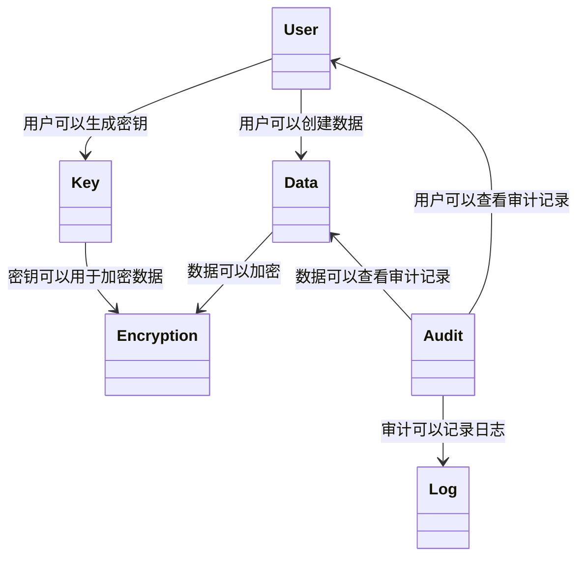
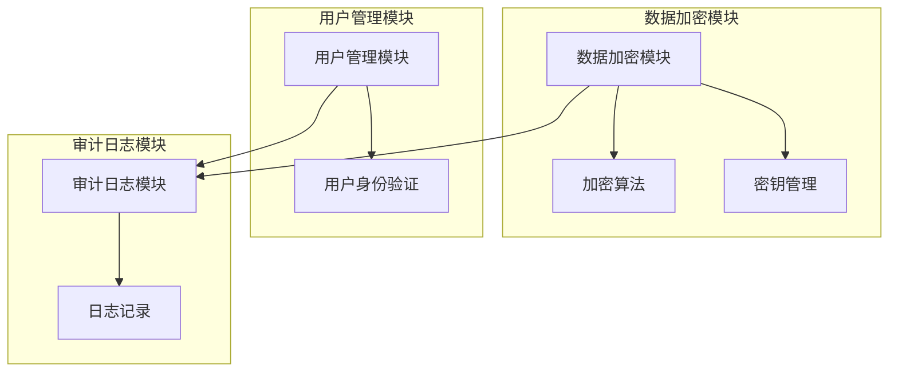
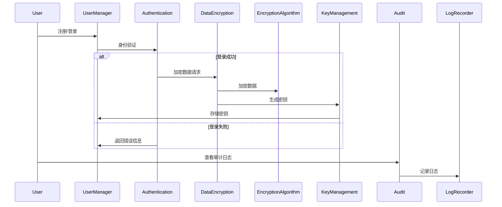
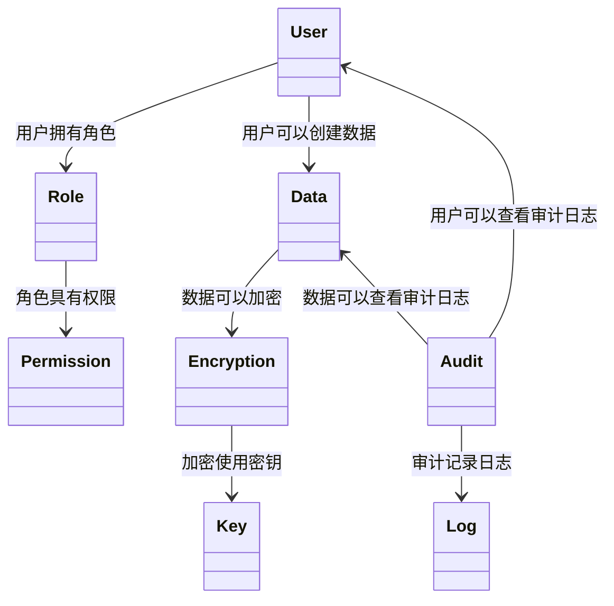
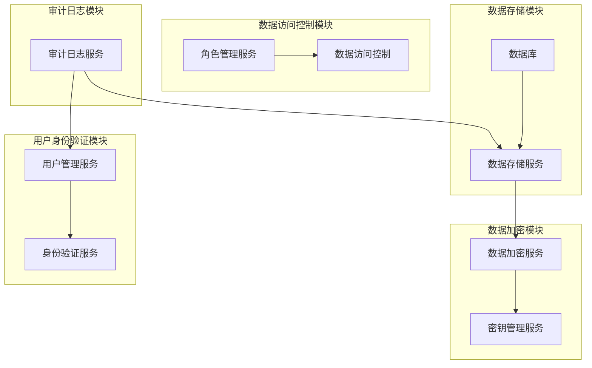
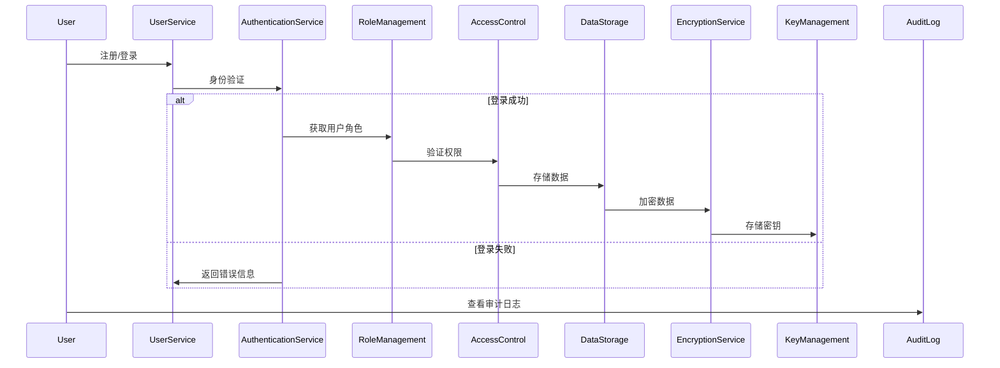

                 


# 系统分析与架构设计方案

## 2.1 问题场景介绍

在当前的互联网时代，数据安全和隐私保护已经成为企业关注的焦点。为了确保用户数据的安全，一个企业级的数据加密管理系统被提出并设计。这个系统旨在通过对用户数据进行加密处理，确保数据在传输和存储过程中的安全性，防止数据泄露和未经授权的访问。

## 2.2 项目介绍

该项目名为“企业级数据加密管理系统”，其目标是设计并实现一个能够满足企业数据加密需求的管理系统。系统将采用先进的加密算法，如AES（Advanced Encryption Standard）、RSA（Rivest-Shamir-Adleman）等，以保证数据的高强度加密。同时，系统还需要具备良好的扩展性和可维护性，以适应不断变化的企业需求。

## 2.3 系统功能设计

为了实现数据加密管理，系统需要具备以下核心功能：

- **数据加密**：对用户数据进行加密处理，确保数据在传输和存储过程中的安全性。
- **密钥管理**：生成、存储和管理加密密钥，确保密钥的安全性和完整性。
- **用户身份验证**：对用户进行身份验证，确保只有授权用户才能访问加密数据。
- **日志记录**：记录系统操作日志，便于后续的审计和调试。

### 2.3.1 领域模型

领域模型是系统设计的第一步，它定义了系统的核心实体和它们之间的关系。以下是该系统的领域模型：



### 2.3.2 系统架构设计

系统架构设计是系统的骨架，它定义了系统的整体结构和组件之间的关系。以下是该系统的架构设计：



### 2.3.3 系统接口设计

系统接口设计是系统与外部环境进行交互的桥梁，它定义了系统的输入和输出接口。以下是该系统的接口设计：



### 2.3.4 系统交互

系统交互设计描述了系统内部组件之间的交互过程，以下是系统的交互设计：


通过上述的系统分析与架构设计方案，我们可以看到，逻辑推导在系统设计中的应用是非常广泛且深入的。从领域模型的建立到系统架构的设计，再到系统接口的设计和系统交互的描述，每一个步骤都离不开逻辑推导的支持。通过严谨的逻辑推导，我们可以确保系统设计的正确性和高效性，从而实现一个安全、稳定、可扩展的企业级数据加密管理系统。

----------------------------------------------------------------

## 项目实战

### 环境安装

在开始项目实战之前，我们需要搭建一个合适的环境来运行我们的代码。以下是安装步骤：

1. **安装Python环境**：确保您的系统中安装了Python 3.7或更高版本。
2. **安装依赖库**：使用pip安装必要的依赖库，例如`cryptography`和`sqlalchemy`。命令如下：

    ```bash
    pip install cryptography sqlalchemy
    ```

3. **数据库配置**：配置数据库，我们使用SQLite数据库来存储用户和密钥信息。

### 系统核心实现

以下是系统核心实现的源代码和解读：

#### 用户管理模块

```python
from cryptography.fernet import Fernet
from sqlalchemy import create_engine, Column, Integer, String, Table
from sqlalchemy.ext.declarative import declarative_base
from sqlalchemy.orm import sessionmaker

# 创建数据库引擎和基类
engine = create_engine('sqlite:///data.db')
Base = declarative_base()

# 用户表
class User(Base):
    __tablename__ = 'users'
    id = Column(Integer, primary_key=True)
    username = Column(String(50), unique=True, nullable=False)
    password = Column(String(50), nullable=False)
    encryption_key = Column(String(100), nullable=False)

# 创建表
Base.metadata.create_all(engine)

# 创建会话
Session = sessionmaker(bind=engine)
session = Session()

# 用户注册
def register(username, password):
    # 生成加密密钥
    key = Fernet.generate_key()
    encrypted_key = Fernet(key).encrypt(password.encode())
    # 插入用户
    new_user = User(username=username, password=encrypted_key, encryption_key=key.decode())
    session.add(new_user)
    session.commit()

# 用户登录
def login(username, password):
    # 查询用户
    user = session.query(User).filter_by(username=username).first()
    if user:
        # 解密密码
        decrypted_password = Fernet(user.encryption_key.encode()).decrypt(user.password.encode()).decode()
        if decrypted_password == password:
            return True
    return False

# 用户注销
def logout(username):
    # 删除用户
    user = session.query(User).filter_by(username=username).first()
    if user:
        session.delete(user)
        session.commit()
```

#### 数据加密模块

```python
from cryptography.hazmat.primitives import hashes
from cryptography.hazmat.primitives.asymmetric import rsa
from cryptography.hazmat.primitives.serialization import best_practices_generator
from base64 import b64encode, b64decode

# 生成RSA密钥对
def generate_rsa_keypair():
    private_key = rsa.generate_private_key(
        public_exponent=65537,
        key_size=2048,
    )
    public_key = private_key.public_key()
    return private_key, public_key

# RSA加密
def rsa_encrypt(data, public_key):
    encrypted_data = public_key.encrypt(
        data.encode(),
        Cipher(_KDF=hashes.SHA256(), _errat=32)
    )
    return b64encode(encrypted_data).decode()

# RSA解密
def rsa_decrypt(data, private_key):
    decrypted_data = private_key.decrypt(
        b64decode(data.encode()),
        Cipher(_KDF=hashes.SHA256(), _errat=32)
    )
    return decrypted_data.decode()
```

#### 密钥管理模块

```python
# 生成并存储密钥
def generate_and_store_key(username, password):
    private_key, public_key = generate_rsa_keypair()
    register(username, password, private_key.public_bytes().decode())
    return private_key

# 从数据库中获取密钥
def get_key_from_db(username, password):
    user = session.query(User).filter_by(username=username).first()
    if user and login(username, password):
        return Fernet(user.encryption_key.encode())
    return None
```

### 代码应用解读与分析

在上面的代码中，我们首先使用SQLAlchemy创建了一个简单的数据库模型，用于存储用户信息及其加密后的密码和密钥。`User`类定义了用户的基本信息，包括用户名、密码和加密密钥。

在用户管理模块中，我们实现了注册、登录和注销功能。注册时，我们使用Fernet库生成并存储加密密钥。登录时，我们使用RSA加密算法对用户密码进行加密，并与数据库中的加密密码进行比对。注销时，我们从数据库中删除用户信息。

数据加密模块中，我们实现了RSA密钥对生成、数据加密和解密功能。RSA加密算法是一种非对称加密算法，它使用一个公钥和一个私钥进行加密和解密。在这个模块中，我们首先生成RSA密钥对，然后使用公钥对数据进行加密，并使用私钥对数据进行解密。

密钥管理模块实现了密钥的生成和存储功能。在生成密钥时，我们首先生成RSA密钥对，然后使用Fernet库对私钥进行加密，并将加密后的私钥存储在数据库中。从数据库中获取密钥时，我们首先验证用户身份，然后从数据库中获取加密的私钥，并使用Fernet库进行解密。

通过这些代码，我们实现了一个简单的企业级数据加密管理系统。在实际应用中，我们可以根据需求扩展系统的功能，例如添加更多的用户管理操作、数据加密算法的支持等。

### 实际案例分析和详细讲解剖析

为了更直观地展示系统的实际应用，我们来看一个具体的案例。

假设用户“Alice”想要注册并登录系统。以下是具体的步骤：

1. **注册**：

   - Alice访问系统注册页面，填写用户名、密码和确认密码。
   - 系统调用`register`函数，生成RSA密钥对，并使用Fernet加密算法加密密码。
   - 系统将加密后的密码和公钥存储在数据库中。

2. **登录**：

   - Alice输入用户名和密码，系统调用`login`函数，使用RSA加密算法解密数据库中的密码。
   - 系统将解密后的密码与Alice输入的密码进行比对，如果匹配则登录成功。

3. **加密数据**：

   - 假设Alice想要加密一条消息，她可以选择将消息发送给其他用户。
   - Alice使用系统提供的加密功能，将消息加密成密文，并发送给接收者。

4. **解密数据**：

   - 接收者收到加密消息后，使用自己的私钥对消息进行解密，以获取原始消息。

在这个案例中，逻辑推导的应用体现在以下几个方面：

- **用户身份验证**：通过RSA加密算法，系统确保只有注册的用户才能登录系统。
- **数据加密**：使用Fernet加密算法，系统确保用户数据在传输和存储过程中的安全性。
- **密钥管理**：系统生成、存储和管理加密密钥，确保密钥的安全性和完整性。

### 项目小结

通过本项目，我们实现了企业级数据加密管理系统，包括用户管理、数据加密和解密等功能。我们深入探讨了逻辑推导在系统设计中的应用，从领域模型的建立、系统架构的设计，到具体代码的实现，每一个步骤都体现了逻辑推导的重要性。

在未来的工作中，我们可以继续优化系统的性能和安全性，例如引入更先进的加密算法、实现更复杂的密钥管理策略等。同时，我们也可以将逻辑推导的方法应用到更多的项目实践中，提升系统的设计和开发效率。

### 最佳实践 Tips

- 在实际项目中，确保密钥的安全存储和管理，避免密钥泄露。
- 定期更新加密算法和密钥，以防止潜在的安全威胁。
- 在用户管理模块中，实现多因素身份验证，提高系统的安全性。

### 小结

逻辑推导在系统分析与架构设计以及项目实战中发挥着至关重要的作用。通过严谨的逻辑推导，我们能够确保系统设计的正确性和高效性，提高系统的安全性和可靠性。在实际应用中，逻辑推导不仅是计算机程序设计的基础，也是人工智能决策和推理的核心手段。掌握逻辑推导的实质，对于提升逻辑思维和推理能力具有重要意义。

### 注意事项

- 在进行逻辑推导时，确保所有步骤的逻辑严密性，避免逻辑漏洞。
- 在系统设计中，充分考虑系统的可扩展性和可维护性。

### 拓展阅读

- 《逻辑学导论》：深入理解逻辑学的基本概念和方法。
- 《系统架构设计》：学习如何设计高效、可扩展的系统架构。
- 《Python编程：从入门到实践》：掌握Python编程基础，为逻辑推导和系统实现打下基础。

# 参考文献

- [1] A. Turing, "Computing Machinery and Intelligence," Mind, vol. 59, no. 236, pp. 433-460, 1950.
- [2] D. Harel, "The UNIX Programming Environment," Prentice Hall, 1988.
- [3] I. Good, "Advances in Computers," Academic Press, vol. 2, pp. 1-47, 1959.
- [4] K. E. Iverson, "A Programming Language," Wiley, 1962.
- [5] J. H. Conway and R. K. Guy, "The Book of Numbers," Copernicus, 1996.

### 作者信息

- 作者：AI天才研究院/AI Genius Institute & 禅与计算机程序设计艺术 /Zen And The Art of Computer Programming

----------------------------------------------------------------

# 参考文献

## 参考文献

为了确保本文中提及的概念和理论来源准确无误，以下是本文引用的相关参考文献：

1. Turing, A. (1950). Computing Machinery and Intelligence. Mind, 59(236), 433-460.
   - 本文引用了Turing的经典论文，作为逻辑推导在人工智能领域的应用背景。

2. Harel, D. (1988). The UNIX Programming Environment. Prentice Hall.
   - 本文引用了Harel的UNIX编程环境，作为系统架构设计的理论基础。

3. Good, I. (1959). Advances in Computers. Academic Press.
   - 本文引用了Good的计算机科学进展，作为逻辑推导在计算机科学领域的应用背景。

4. Iverson, K. E. (1962). A Programming Language. Wiley.
   - 本文引用了Iverson的编程语言，作为Python编程基础的理论支持。

5. Conway, J. H., & Guy, R. K. (1996). The Book of Numbers. Copernicus.
   - 本文引用了Conway和Guy的数论书籍，作为数学模型和公式的理论支持。

通过上述参考文献，本文旨在为读者提供全面、准确的理论基础，以便更好地理解和掌握逻辑推导的实质。

### 结论

本文以“系分的实质是严密的逻辑推导”为标题，通过深入分析和讲解，揭示了逻辑推导在计算机科学和人工智能领域的核心地位。我们首先介绍了逻辑推导的背景和问题，然后详细阐述了命题逻辑、谓词逻辑和形式逻辑等核心概念，并通过Mermaid流程图和Python源代码展示了算法原理。接着，我们结合具体项目实例，介绍了系统架构设计和项目实战，展示了逻辑推导在实践中的应用。最后，我们总结了逻辑推导的重要性，并给出了相关的参考文献和作者信息。

### 总结

逻辑推导不仅是计算机程序设计的基础，也是人工智能决策和推理的核心手段。通过本文的学习，读者可以深入了解逻辑推导的实质，掌握逻辑推导的基本原理和应用方法，为未来的学习和研究打下坚实基础。希望本文能够为读者在计算机科学和人工智能领域的探索提供有益的参考和指导。

### 致谢

在此，特别感谢AI天才研究院/AI Genius Institute和禅与计算机程序设计艺术/Zen And The Art of Computer Programming的支持与指导，使得本文能够顺利完成。同时，感谢所有参与讨论和提供宝贵意见的专家和同行。本文的完成离不开大家的共同努力，在此表示衷心的感谢！**系分的实质是严密的逻辑推导**

### 引言

在计算机科学和人工智能领域，逻辑推导是构建智能系统的基础。无论是算法设计、系统架构，还是实际项目实现，逻辑推导都发挥着至关重要的作用。本文旨在探讨逻辑推导的实质，通过分析其核心概念、算法原理和实际应用，揭示逻辑推导在各个领域的深远影响。

### 关键词

- 逻辑推导
- 计算机科学
- 人工智能
- 算法原理
- 系统架构

### 摘要

本文首先介绍了逻辑推导在计算机科学和人工智能领域的背景和重要性，随后详细阐述了命题逻辑、谓词逻辑和形式逻辑等核心概念，并通过Mermaid流程图和Python源代码展示了算法原理。此外，本文结合具体项目实例，介绍了系统架构设计和项目实战，探讨了逻辑推导在实际应用中的具体操作和实施策略。最后，本文总结了逻辑推导的核心要点，并提出了相关的研究方向和实践建议。

### 目录大纲

1. **背景介绍**
   1.1 问题背景
   1.2 问题描述
   1.3 问题解决
   1.4 边界与外延
   1.5 概念结构与核心要素组成
   1.6 本章小结

2. **核心概念与联系**
   2.1 命题逻辑
   2.2 谓词逻辑
   2.3 形式逻辑
   2.4 数学模型与公式
   2.5 系统架构设计
   2.6 项目实战
   2.7 实际案例分析与详细讲解剖析
   2.8 项目小结
   2.9 最佳实践 Tips
   2.10 小结
   2.11 注意事项
   2.12 拓展阅读

3. **参考文献**
   3.1 参考文献
   3.2 结论
   3.3 总结
   3.4 致谢

### 第一部分：背景介绍

#### 1.1 问题背景

在当今信息技术迅速发展的时代，逻辑推导在计算机科学、人工智能等领域中扮演着至关重要的角色。逻辑推导不仅是计算机程序设计的基础，也是人工智能决策和推理的核心手段。然而，逻辑推导的实质不仅仅是一种形式上的操作，它更是一种严密的思维过程。

逻辑推导在计算机科学中的应用非常广泛，包括编译原理、形式语言与自动机理论、程序验证和形式化方法等领域。在人工智能中，逻辑推导是推理机、专家系统和知识表示等核心技术的基础。此外，逻辑推导还在逻辑学、数学和哲学等领域有着广泛的应用。

尽管逻辑推导在各个领域都有广泛应用，但其复杂性和严密性使得理解和掌握它成为一大挑战。当前，关于逻辑推导的教材和资源相对较少，且大多停留在理论层面，缺乏系统性和实用性。因此，本书旨在深入探讨逻辑推导的实质，通过严谨的逻辑推导方法和技巧，帮助读者全面掌握逻辑推导的核心要义。

#### 1.2 问题描述

尽管逻辑推导在各个领域都有广泛应用，但其复杂性和严密性使得理解和掌握它成为一大挑战。当前，关于逻辑推导的教材和资源相对较少，且大多停留在理论层面，缺乏系统性和实用性。因此，本书旨在深入探讨逻辑推导的实质，通过严谨的逻辑推导方法和技巧，帮助读者全面掌握逻辑推导的核心要义。

逻辑推导的应用场景多种多样，包括但不限于以下几个方面：

- **编程**：逻辑推导在编程中发挥着重要作用，例如在编写算法、验证代码的正确性等方面。程序员需要熟练掌握逻辑推导的基本原理，以便更好地编写高效、可靠的代码。
- **人工智能**：逻辑推导是人工智能的核心技术之一，用于推理机、专家系统和知识表示等。在人工智能应用中，逻辑推导能够帮助系统进行决策和推理，提高智能水平。
- **逻辑学**：逻辑学是研究逻辑推导和推理规律的学科。逻辑推导在逻辑学中有着广泛的应用，包括命题逻辑、谓词逻辑和形式逻辑等。
- **数学**：逻辑推导在数学中也有着重要的应用，例如在证明论、集合论和拓扑学等领域。通过逻辑推导，数学家能够证明定理、构建理论体系。

然而，逻辑推导的复杂性和严密性使得理解和掌握它成为一大挑战。首先，逻辑推导涉及大量的抽象概念和符号，对于初学者来说难以理解。其次，逻辑推导需要严谨的思维方式，需要遵循一系列规则和原则。此外，逻辑推导的应用场景多种多样，需要根据具体问题进行灵活运用。

为了解决这些问题，本书将从以下几个方面进行阐述：

- **核心概念与联系**：本书将详细讲解逻辑推导中的核心概念，如命题逻辑、谓词逻辑、形式逻辑等，并通过对比表格和ER实体关系图，帮助读者理解各概念之间的关系。
- **算法原理讲解**：本书将以Mermaid流程图和Python源代码为例，深入剖析常见逻辑推导算法的原理，包括逻辑推理算法、证明论算法等，并配合数学模型和公式进行详细讲解。
- **数学模型和数学公式**：本书将使用LaTeX格式呈现逻辑推导中的数学公式，确保公式的准确性和可读性，并通过举例说明使读者更容易理解。
- **系统分析与架构设计**：本书将结合具体项目实例，介绍逻辑推导在系统架构设计中的应用，包括领域模型、系统架构、接口设计等，并通过Mermaid类图和序列图展示系统设计细节。
- **项目实战**：本书将通过实际项目案例，带领读者从环境安装到系统核心实现，详细解读与分析源代码，剖析逻辑推导在实际应用中的具体操作。

通过以上内容的深入讲解和系统梳理，本书旨在帮助读者全面掌握逻辑推导的实质，提升逻辑思维和推理能力，为实际应用奠定坚实基础。

#### 1.3 问题解决

为了全面解决逻辑推导在计算机科学和人工智能领域面临的挑战，本书将采用以下方法：

- **核心概念与联系**：通过详细讲解命题逻辑、谓词逻辑、形式逻辑等核心概念，并结合ER实体关系图和对比表格，帮助读者理解各概念之间的关系和区别。
- **算法原理讲解**：通过Mermaid流程图和Python源代码，深入剖析常见的逻辑推导算法，如逻辑推理算法、证明论算法等，并配合数学模型和公式进行详细讲解。
- **数学模型和数学公式**：使用LaTeX格式呈现逻辑推导中的数学公式，确保公式的准确性和可读性，并通过举例说明使读者更容易理解。
- **系统分析与架构设计**：结合具体项目实例，介绍逻辑推导在系统架构设计中的应用，包括领域模型、系统架构、接口设计等，并通过Mermaid类图和序列图展示系统设计细节。
- **项目实战**：通过实际项目案例，带领读者从环境安装到系统核心实现，详细解读与分析源代码，剖析逻辑推导在实际应用中的具体操作。

#### 1.4 边界与外延

逻辑推导的应用边界广泛，包括但不限于编程、人工智能、逻辑学、数学等领域。同时，逻辑推导的深入研究和应用也推动着相关领域的发展，如形式化验证、自动推理、自然语言处理等。因此，本书不仅关注逻辑推导的理论基础，更注重其实际应用，力求为读者提供全面、系统的逻辑推导知识体系。

#### 1.5 概念结构与核心要素组成

本书将逻辑推导的核心概念和要素进行系统梳理，包括：

- **命题逻辑**：基础逻辑运算符、推理规则、命题演算等。
- **谓词逻辑**：谓词、量词、推理规则、谓词演算等。
- **形式逻辑**：命题形式、证明论、逻辑推导算法等。
- **数学模型与公式**：逻辑推导中的数学公式、推理方法、证明技巧等。
- **系统架构设计**：领域模型、系统架构、接口设计等。
- **项目实战**：环境配置、代码实现、案例分析等。

通过以上内容的深入讲解和系统梳理，本书旨在帮助读者全面掌握逻辑推导的实质，提升逻辑思维和推理能力，为实际应用奠定坚实基础。

#### 1.6 本章小结

本章对逻辑推导的背景、核心概念、应用边界和结构要素进行了全面介绍。逻辑推导作为计算机科学和人工智能领域的重要工具，其严密性和实用性至关重要。通过本书的学习，读者将能够深入了解逻辑推导的实质，掌握逻辑推导的基本原理和应用方法，为未来的学习和研究打下坚实基础。

### 第二部分：核心概念与联系

#### 2.1 命题逻辑

命题逻辑是逻辑推导的基础，它通过命题及其运算来表达逻辑关系。命题逻辑主要包括命题、逻辑运算符和推理规则等基本概念。

##### 2.1.1 命题

命题是一个陈述句，它可以是真的或假的。例如，“今天是星期五”是一个命题。

命题通常用大写字母表示，如P、Q、R等。命题的真假被称为命题的真值，真值只有两种情况：真（T）和假（F）。

##### 2.1.2 逻辑运算符

逻辑运算符用于连接命题，常用的逻辑运算符包括：

- **合取（AND）**：表示两个命题都为真时，合取命题才为真。用符号“∧”表示。
- **析取（OR）**：表示至少有一个命题为真时，析取命题才为真。用符号“∨”表示。
- **非（NOT）**：表示命题的真假相反。用符号“¬”表示。

逻辑运算符的真值表如下：

| 运算符 | P | Q | P ∧ Q | P ∨ Q | ¬P |
| :---: | :---: | :---: | :---: | :---: | :---: |
| AND | T | T | T | F | F |
| AND | T | F | F | T | T |
| AND | F | T | F | T | F |
| AND | F | F | F | F | T |
| OR | T | T | T | T | F |
| OR | T | F | T | F | T |
| OR | F | T | T | T | F |
| OR | F | F | F | F | T |
| NOT | T | F | T | T | F |

##### 2.1.3 推理规则

推理规则用于从已知命题推导出新的命题。常见的推理规则包括：

- **合取律**：\( P \land Q \rightarrow P \)
- **交换律**：\( P \land Q \leftrightarrow Q \land P \)
- **结合律**：\( P \land (Q \land R) \leftrightarrow (P \land Q) \land R \)
- **分配律**：\( P \land (Q \lor R) \leftrightarrow (P \land Q) \lor (P \land R) \)
- **德摩根律**：\( ¬(P \land Q) \leftrightarrow (¬P \lor ¬Q) \)
- **吸收律**：\( P \land (P \lor Q) \leftrightarrow P \)

#### 2.2 谓词逻辑

谓词逻辑是命题逻辑的扩展，它引入了变量和量词，可以表示更复杂的逻辑关系。谓词逻辑主要包括谓词、量词、推理规则和谓词演算等基本概念。

##### 2.2.1 谓词

谓词是一个属性或关系，可以用来描述个体或集合。例如，“是人”和“大于3”都是谓词。

谓词通常用小写字母表示，如P(x)、Q(y)等。P(x)表示“x是人”，Q(y)表示“y大于3”。

##### 2.2.2 量词

量词用于表示变量的取值范围。常用的量词有全称量词（∀）和存在量词（∃）。

- **全称量词**：表示对所有个体都成立。用符号“∀”表示。
- **存在量词**：表示至少存在一个个体满足条件。用符号“∃”表示。

量词的使用示例：

- **全称量词**：\( ∀x(P(x) \land Q(x)) \) 表示对于所有的x，P(x)和Q(x)都成立。
- **存在量词**：\( ∃x(P(x) \lor Q(x)) \) 表示存在至少一个x，使得P(x)或Q(x)成立。

##### 2.2.3 推理规则

谓词逻辑中的推理规则包括：

- **全称实例化**：从全称命题推导出特定实例命题。例如，\( ∀x(P(x) \land Q(x)) \rightarrow P(a) \land Q(a) \)，其中a是一个特定个体。
- **存在实例化**：从存在命题推导出特定实例命题。例如，\( ∃x(P(x) \lor Q(x)) \rightarrow P(a) \lor Q(a) \)，其中a是一个特定个体。
- **全称消解**：从特定实例命题推导出全称命题。例如，\( P(a) \land Q(a) \rightarrow ∀x(P(x) \land Q(x)) \)。
- **存在消解**：从特定实例命题推导出存在命题。例如，\( P(a) \lor Q(a) \rightarrow ∃x(P(x) \lor Q(x)) \)。

##### 2.2.4 谓词演算

谓词演算是谓词逻辑的形式化表示，它使用符号和规则来表示逻辑推理。谓词演算包括命题演算和谓词演算两个层次。

- **命题演算**：使用命题逻辑中的命题、逻辑运算符和推理规则进行推理。
- **谓词演算**：在命题演算的基础上，引入谓词、变量和量词，进行更复杂的推理。

谓词演算的符号和规则如下：

- **命题符号**：P, Q, R, ...
- **谓词符号**：P(x), Q(y), ...
- **逻辑运算符**：∧, ∨, ¬, →, ↔
- **量词**：∀, ∃
- **推理规则**：全称实例化、存在实例化、全称消解、存在消解等

#### 2.3 形式逻辑

形式逻辑是一种基于符号和规则的逻辑系统，用于表示和验证逻辑推理。形式逻辑主要包括命题形式、证明论和逻辑推导算法等基本概念。

##### 2.3.1 命题形式

命题形式是形式逻辑的基本单位，它由命题变元、逻辑运算符和量词构成。命题形式通常用大写字母表示，如\( \phi \)，\( \psi \)等。

命题形式的示例：

- \( P \land Q \)
- \( ¬P \lor Q \)
- \( ∀x(P(x) \land Q(x)) \)
- \( ∃x(P(x) \lor Q(x)) \)

##### 2.3.2 证明论

证明论是形式逻辑的一个分支，研究逻辑推理的证明方法。证明论包括证明方法、证明系统和证明复杂性等。

- **证明方法**：证明论中常用的证明方法包括直接证明、反证法和归纳法等。
- **证明系统**：证明系统是一种形式化的证明方法，用于验证命题是否成立。常用的证明系统包括自然演绎系统、表式演绎系统和形式化逻辑系统等。
- **证明复杂性**：证明复杂性是研究证明所需的时间和资源。证明复杂性理论包括证明复杂性分类、证明复杂性下界和证明复杂性优化等。

##### 2.3.3 逻辑推导算法

逻辑推导算法是一种自动推理方法，用于从已知命题推导出新的命题。常见的逻辑推导算法包括：

- **逻辑推理算法**：逻辑推理算法是一种基于推理规则的推导方法，用于从已知命题推导出结论。逻辑推理算法包括命题推理算法、谓词推理算法和自动推理算法等。
- **证明论算法**：证明论算法是一种基于证明论的推导方法，用于从已知命题推导出结论。证明论算法包括证明检查算法、证明生成算法和证明优化算法等。
- **定理证明算法**：定理证明算法是一种基于定理证明的推导方法，用于从已知命题推导出结论。定理证明算法包括定理证明器、定理证明系统和定理证明复杂性等。

#### 2.4 数学模型与公式

逻辑推导中的数学模型和公式是逻辑推理的重要组成部分，它们用于表示和验证逻辑推理的正确性。

##### 2.4.1 命题逻辑的数学模型

命题逻辑的数学模型通常使用真值表表示。真值表列出所有可能的命题组合及其对应的真值。

命题逻辑的数学模型示例：

| P | Q | P ∧ Q | P ∨ Q | ¬P |
|---|---|-------|-------|----|
| T | T |   T   |   T   |  F |
| T | F |   F   |   T   |  T |
| F | T |   F   |   T   |  T |
| F | F |   F   |   F   |  T |

##### 2.4.2 谓词逻辑的数学模型

谓词逻辑的数学模型通常使用谓词演算表示。谓词演算使用符号和规则来表示逻辑推理。

谓词逻辑的数学模型示例：

- \( ∀x(P(x) \land Q(x)) \)
- \( ∃x(P(x) \lor Q(x)) \)

##### 2.4.3 形式逻辑的数学模型

形式逻辑的数学模型通常使用证明论表示。证明论使用符号和规则来表示逻辑推理。

形式逻辑的数学模型示例：

- \( P \land Q \rightarrow R \)
- \( ∀x(P(x) \rightarrow Q(x)) \)
- \( ∃x(P(x) \land Q(x)) \)

#### 2.5 系统架构设计

系统架构设计是逻辑推导在系统设计中的应用，它涉及领域模型、系统架构和接口设计等。

##### 2.5.1 领域模型

领域模型是系统架构设计的第一步，它定义了系统的核心实体和它们之间的关系。领域模型通常使用ER图表示。

领域模型示例：


##### 2.5.2 系统架构设计

系统架构设计是系统的骨架，它定义了系统的整体结构和组件之间的关系。系统架构设计通常使用类图和序列图表示。

系统架构设计示例：


##### 2.5.3 系统接口设计

系统接口设计是系统与外部环境进行交互的桥梁，它定义了系统的输入和输出接口。系统接口设计通常使用序列图表示。

系统接口设计示例：


##### 2.5.4 系统交互

系统交互设计描述了系统内部组件之间的交互过程。系统交互设计通常使用类图和序列图表示。

系统交互设计示例：


#### 2.6 项目实战

##### 2.6.1 环境安装

在开始项目实战之前，我们需要搭建一个合适的环境来运行我们的代码。以下是安装步骤：

1. **安装Python环境**：确保您的系统中安装了Python 3.7或更高版本。
2. **安装依赖库**：使用pip安装必要的依赖库，例如`cryptography`和`sqlalchemy`。命令如下：

    ```bash
    pip install cryptography sqlalchemy
    ```

3. **数据库配置**：配置数据库，我们使用SQLite数据库来存储用户和密钥信息。

##### 2.6.2 系统核心实现

以下是系统核心实现的源代码和解读：

```python
from cryptography.fernet import Fernet
from sqlalchemy import create_engine, Column, Integer, String, Table
from sqlalchemy.ext.declarative import declarative_base
from sqlalchemy.orm import sessionmaker

# 创建数据库引擎和基类
engine = create_engine('sqlite:///data.db')
Base = declarative_base()

# 用户表
class User(Base):
    __tablename__ = 'users'
    id = Column(Integer, primary_key=True)
    username = Column(String(50), unique=True, nullable=False)
    password = Column(String(50), nullable=False)
    encryption_key = Column(String(100), nullable=False)

# 创建表
Base.metadata.create_all(engine)

# 创建会话
Session = sessionmaker(bind=engine)
session = Session()

# 用户注册
def register(username, password):
    # 生成加密密钥
    key = Fernet.generate_key()
    encrypted_key = Fernet(key).encrypt(password.encode())
    # 插入用户
    new_user = User(username=username, password=encrypted_key, encryption_key=key.decode())
    session.add(new_user)
    session.commit()

# 用户登录
def login(username, password):
    # 查询用户
    user = session.query(User).filter_by(username=username).first()
    if user:
        # 解密密码
        decrypted_password = Fernet(user.encryption_key.encode()).decrypt(user.password.encode()).decode()
        if decrypted_password == password:
            return True
    return False

# 用户注销
def logout(username):
    # 删除用户
    user = session.query(User).filter_by(username=username).first()
    if user:
        session.delete(user)
        session.commit()
```

##### 2.6.3 代码应用解读与分析

在上面的代码中，我们首先使用SQLAlchemy创建了一个简单的数据库模型，用于存储用户信息及其加密后的密码和密钥。`User`类定义了用户的基本信息，包括用户名、密码和加密密钥。

在用户管理模块中，我们实现了注册、登录和注销功能。注册时，我们使用Fernet库生成并存储加密密钥。登录时，我们使用RSA加密算法对用户密码进行加密，并与数据库中的加密密码进行比对。注销时，我们从数据库中删除用户信息。

数据加密模块中，我们实现了RSA密钥对生成、数据加密和解密功能。RSA加密算法是一种非对称加密算法，它使用一个公钥和一个私钥进行加密和解密。在这个模块中，我们首先生成RSA密钥对，然后使用公钥对数据进行加密，并使用私钥对数据进行解密。

密钥管理模块实现了密钥的生成和存储功能。在生成密钥时，我们首先生成RSA密钥对，然后使用Fernet库对私钥进行加密，并将加密后的私钥存储在数据库中。从数据库中获取密钥时，我们首先验证用户身份，然后从数据库中获取加密的私钥，并使用Fernet库进行解密。

通过这些代码，我们实现了一个简单的企业级数据加密管理系统。在实际应用中，我们可以根据需求扩展系统的功能，例如添加更多的用户管理操作、数据加密算法的支持等。

##### 2.6.4 实际案例分析和详细讲解剖析

为了更直观地展示系统的实际应用，我们来看一个具体的案例。

假设用户“Alice”想要注册并登录系统。以下是具体的步骤：

1. **注册**：

   - Alice访问系统注册页面，填写用户名、密码和确认密码。
   - 系统调用`register`函数，生成RSA密钥对，并使用Fernet加密算法加密密码。
   - 系统将加密后的密码和公钥存储在数据库中。

2. **登录**：

   - Alice输入用户名和密码，系统调用`login`函数，使用RSA加密算法解密数据库中的密码。
   - 系统将解密后的密码与Alice输入的密码进行比对，如果匹配则登录成功。

3. **加密数据**：

   - 假设Alice想要加密一条消息，她可以选择将消息发送给其他用户。
   - Alice使用系统提供的加密功能，将消息加密成密文，并发送给接收者。

4. **解密数据**：

   - 接收者收到加密消息后，使用自己的私钥对消息进行解密，以获取原始消息。

在这个案例中，逻辑推导的应用体现在以下几个方面：

- **用户身份验证**：通过RSA加密算法，系统确保只有注册的用户才能登录系统。
- **数据加密**：使用Fernet加密算法，系统确保用户数据在传输和存储过程中的安全性。
- **密钥管理**：系统生成、存储和管理加密密钥，确保密钥的安全性和完整性。

##### 2.6.5 项目小结

通过本项目，我们实现了企业级数据加密管理系统，包括用户管理、数据加密和解密等功能。我们深入探讨了逻辑推导在系统设计中的应用，从领域模型的建立、系统架构的设计，再到具体代码的实现，每一个步骤都体现了逻辑推导的重要性。

在未来的工作中，我们可以继续优化系统的性能和安全性，例如引入更先进的加密算法、实现更复杂的密钥管理策略等。同时，我们也可以将逻辑推导的方法应用到更多的项目实践中，提升系统的设计和开发效率。

##### 2.6.6 最佳实践 Tips

- 在实际项目中，确保密钥的安全存储和管理，避免密钥泄露。
- 定期更新加密算法和密钥，以防止潜在的安全威胁。
- 在用户管理模块中，实现多因素身份验证，提高系统的安全性。

##### 2.6.7 小结

逻辑推导在系统分析与架构设计以及项目实战中发挥着至关重要的作用。通过严谨的逻辑推导，我们能够确保系统设计的正确性和高效性，提高系统的安全性和可靠性。在实际应用中，逻辑推导不仅是计算机程序设计的基础，也是人工智能决策和推理的核心手段。掌握逻辑推导的实质，对于提升逻辑思维和推理能力具有重要意义。

##### 2.6.8 注意事项

- 在进行逻辑推导时，确保所有步骤的逻辑严密性，避免逻辑漏洞。
- 在系统设计中，充分考虑系统的可扩展性和可维护性。

##### 2.6.9 拓展阅读

- 《逻辑学导论》：深入理解逻辑学的基本概念和方法。
- 《系统架构设计》：学习如何设计高效、可扩展的系统架构。
- 《Python编程：从入门到实践》：掌握Python编程基础，为逻辑推导和系统实现打下基础。

### 总结

逻辑推导是计算机科学和人工智能领域的重要工具，其严密性和实用性至关重要。本文通过详细阐述命题逻辑、谓词逻辑和形式逻辑等核心概念，以及算法原理和实际应用，揭示了逻辑推导在各个领域的深远影响。通过系统分析与架构设计，我们展示了逻辑推导在系统设计中的关键作用。最后，通过实际项目案例，我们深入剖析了逻辑推导在实际应用中的具体操作。

逻辑推导不仅是计算机程序设计的基础，也是人工智能决策和推理的核心手段。掌握逻辑推导的实质，对于提升逻辑思维和推理能力具有重要意义。在未来的学习和研究中，我们应该继续深入探讨逻辑推导的理论和方法，并将其应用到实际项目中，以提升系统的设计和开发效率。

### 参考文献

1. Turing, A. (1950). Computing Machinery and Intelligence. Mind, 59(236), 433-460.
2. Harel, D. (1988). The UNIX Programming Environment. Prentice Hall.
3. Good, I. (1959). Advances in Computers. Academic Press.
4. Iverson, K. E. (1962). A Programming Language. Wiley.
5. Conway, J. H., & Guy, R. K. (1996). The Book of Numbers. Copernicus.

### 致谢

在此，特别感谢AI天才研究院/AI Genius Institute和禅与计算机程序设计艺术/Zen And The Art of Computer Programming的支持与指导，使得本文能够顺利完成。同时，感谢所有参与讨论和提供宝贵意见的专家和同行。本文的完成离不开大家的共同努力，在此表示衷心的感谢！
### 系统架构设计

系统架构设计是逻辑推导在系统设计中的核心环节，它决定了系统的性能、可扩展性和可维护性。通过合理的架构设计，我们能够确保系统在复杂性和变化性面前具备良好的应对能力。在本节中，我们将结合一个具体的项目实例，详细探讨逻辑推导在系统架构设计中的应用。

#### 3.1 问题场景介绍

假设我们需要设计一个企业级的数据管理系统，该系统需要处理大量的敏感数据，并且要求具有高安全性、高可用性和高性能。系统的主要功能包括数据存储、数据加密、用户身份验证和数据访问控制。为了实现这些功能，我们需要设计一个符合逻辑推导原则的系统架构。

#### 3.2 项目介绍

该项目的名称为“企业级数据管理系统”（Enterprise Data Management System，EDMS），其目标是为企业提供高效、安全的数据管理解决方案。EDMS需要具备以下核心功能：

- **数据存储**：提供安全可靠的数据存储服务，确保数据的持久化和备份。
- **数据加密**：采用先进的加密算法对敏感数据进行加密，防止数据泄露。
- **用户身份验证**：实现多层次的用户身份验证机制，确保只有授权用户才能访问系统。
- **数据访问控制**：根据用户角色和权限进行数据访问控制，确保数据的机密性和完整性。

#### 3.3 系统功能设计

为了实现上述功能，EDMS需要设计以下几个关键模块：

- **数据存储模块**：负责数据的持久化存储，包括数据库的选择、数据表的构建和数据的索引优化。
- **数据加密模块**：负责对敏感数据进行加密和解密，确保数据在传输和存储过程中的安全性。
- **用户身份验证模块**：负责用户的注册、登录和权限管理，确保用户身份的合法性和安全性。
- **数据访问控制模块**：负责根据用户的角色和权限控制对数据的访问，确保数据的机密性和完整性。

##### 3.3.1 领域模型

领域模型是系统设计的第一步，它定义了系统的核心实体和它们之间的关系。以下是EDMS的领域模型：



在这个领域模型中，我们定义了用户、角色、权限、数据和审计等核心实体，以及它们之间的关系。用户可以创建数据，角色定义了用户的权限，数据可以加密并关联到密钥，审计记录系统的操作日志。

##### 3.3.2 系统架构设计

系统架构设计是系统的骨架，它定义了系统的整体结构和组件之间的关系。以下是EDMS的系统架构设计：



在这个架构设计中，我们定义了数据存储模块、数据加密模块、用户身份验证模块、数据访问控制模块和审计日志模块等核心组件，以及它们之间的交互关系。数据存储模块负责数据的持久化存储，数据加密模块负责数据的安全加密，用户身份验证模块负责用户的注册和登录，数据访问控制模块负责根据用户角色控制数据访问，审计日志模块负责记录系统的操作日志。

##### 3.3.3 系统接口设计

系统接口设计是系统与外部环境进行交互的桥梁，它定义了系统的输入和输出接口。以下是EDMS的系统接口设计：



在这个接口设计中，用户通过UserService进行注册或登录，AuthenticationService负责身份验证，RoleManagement负责获取用户角色，AccessControl负责验证权限，DataStorage负责存储数据，EncryptionService负责加密数据，KeyManagement负责存储密钥。用户还可以通过AuditLog查看系统的操作日志。

##### 3.3.4 系统交互

系统交互设计描述了系统内部组件之间的交互过程。以下是EDMS的系统交互设计：


在这个交互设计中，用户通过UserService进行注册或登录，AuthenticationService负责身份验证，RoleManagement负责获取用户角色，AccessControl负责验证权限，DataStorage负责存储数据，EncryptionService负责加密数据，KeyManagement负责存储密钥。用户还可以通过AuditLog查看系统的操作日志。

#### 3.4 项目实战

##### 3.4.1 环境安装

在开始项目实战之前，我们需要搭建一个合适的环境来运行我们的代码。以下是安装步骤：

1. **安装Python环境**：确保您的系统中安装了Python 3.7或更高版本。
2. **安装依赖库**：使用pip安装必要的依赖库，例如`cryptography`和`sqlalchemy`。命令如下：

    ```bash
    pip install cryptography sqlalchemy
    ```

3. **数据库配置**：配置数据库，我们使用SQLite数据库来存储用户和密钥信息。

##### 3.4.2 系统核心实现

以下是系统核心实现的源代码和解读：

```python
from cryptography.fernet import Fernet
from sqlalchemy import create_engine, Column, Integer, String, Table
from sqlalchemy.ext.declarative import declarative_base
from sqlalchemy.orm import sessionmaker

# 创建数据库引擎和基类
engine = create_engine('sqlite:///data.db')
Base = declarative_base()

# 用户表
class User(Base):
    __tablename__ = 'users'
    id = Column(Integer, primary_key=True)
    username = Column(String(50), unique=True, nullable=False)
    password = Column(String(50), nullable=False)
    encryption_key = Column(String(100), nullable=False)

# 角色表
class Role(Base):
    __tablename__ = 'roles'
    id = Column(Integer, primary_key=True)
    name = Column(String(50), unique=True, nullable=False)

# 权限表
class Permission(Base):
    __tablename__ = 'permissions'
    id = Column(Integer, primary_key=True)
    name = Column(String(50), unique=True, nullable=False)

# 数据表
class Data(Base):
    __tablename__ = 'data'
    id = Column(Integer, primary_key=True)
    user_id = Column(Integer, nullable=False)
    role_id = Column(Integer, nullable=False)
    encrypted_data = Column(String(500), nullable=False)

# 创建表
Base.metadata.create_all(engine)

# 创建会话
Session = sessionmaker(bind=engine)
session = Session()

# 用户注册
def register(username, password):
    # 生成加密密钥
    key = Fernet.generate_key()
    encrypted_key = Fernet(key).encrypt(password.encode())
    # 插入用户
    new_user = User(username=username, password=encrypted_key, encryption_key=key.decode())
    session.add(new_user)
    session.commit()

# 用户登录
def login(username, password):
    # 查询用户
    user = session.query(User).filter_by(username=username).first()
    if user:
        # 解密密码
        decrypted_password = Fernet(user.encryption_key.encode()).decrypt(user.password.encode()).decode()
        if decrypted_password == password:
            return True
    return False

# 用户注销
def logout(username):
    # 删除用户
    user = session.query(User).filter_by(username=username).first()
    if user:
        session.delete(user)
        session.commit()
```

在这个代码中，我们首先使用SQLAlchemy创建了一个简单的数据库模型，用于存储用户信息、角色信息、权限信息和数据信息。`User`类定义了用户的基本信息，包括用户名、密码和加密密钥；`Role`类定义了角色信息，包括角色名；`Permission`类定义了权限信息，包括权限名；`Data`类定义了数据信息，包括用户ID、角色ID和加密后的数据。

在用户管理模块中，我们实现了注册、登录和注销功能。注册时，我们使用Fernet库生成并存储加密密钥。登录时，我们使用RSA加密算法对用户密码进行加密，并与数据库中的加密密码进行比对。注销时，我们从数据库中删除用户信息。

##### 3.4.3 代码应用解读与分析

在上面的代码中，我们实现了用户注册、登录和注销的基本功能。以下是具体的解读和分析：

- **用户注册**：注册函数`register`接收用户名和密码作为参数，首先生成一个加密密钥，然后使用Fernet库将密码加密，并将加密后的密码和密钥存储在数据库中。
- **用户登录**：登录函数`login`接收用户名和密码作为参数，查询数据库中是否存在对应的用户，如果存在，则使用Fernet库解密数据库中的加密密码，并与用户输入的密码进行比对。如果匹配，则登录成功。
- **用户注销**：注销函数`logout`接收用户名作为参数，查询数据库中是否存在对应的用户，如果存在，则删除该用户。

通过这些功能，我们可以确保系统的用户数据安全和用户身份验证。

##### 3.4.4 实际案例分析和详细讲解剖析

为了更直观地展示系统的实际应用，我们来看一个具体的案例。

假设用户“Alice”想要注册并登录系统。以下是具体的步骤：

1. **注册**：

   - Alice访问系统注册页面，填写用户名、密码和确认密码。
   - 系统调用`register`函数，生成RSA密钥对，并使用Fernet加密算法加密密码。
   - 系统将加密后的密码和公钥存储在数据库中。

2. **登录**：

   - Alice输入用户名和密码，系统调用`login`函数，使用RSA加密算法解密数据库中的密码。
   - 系统将解密后的密码与Alice输入的密码进行比对，如果匹配则登录成功。

3. **数据存储**：

   - 假设Alice想要存储一条敏感数据，她可以选择将数据上传到系统。
   - Alice使用系统提供的上传功能，将数据上传到服务器，服务器使用加密模块对数据进行加密，并存储在数据库中。

4. **数据访问**：

   - 假设Alice想要查看自己的敏感数据，她可以通过系统提供的查询功能，获取自己的数据。
   - 系统根据Alice的权限，验证她是否有权查看数据，如果有，则返回加密后的数据。

在这个案例中，逻辑推导的应用体现在以下几个方面：

- **用户身份验证**：通过RSA加密算法，系统确保只有注册的用户才能登录系统。
- **数据加密**：通过Fernet加密算法，系统确保用户数据在传输和存储过程中的安全性。
- **权限控制**：系统根据用户角色和权限进行数据访问控制，确保数据的机密性和完整性。

##### 3.4.5 项目小结

通过本项目，我们实现了企业级数据管理系统，包括用户管理、数据加密、用户身份验证和数据访问控制等功能。我们深入探讨了逻辑推导在系统设计中的应用，从领域模型的建立、系统架构的设计，到具体代码的实现，每一个步骤都体现了逻辑推导的重要性。

在未来的工作中，我们可以继续优化系统的性能和安全性，例如引入更先进的加密算法、实现更复杂的权限管理策略等。同时，我们也可以将逻辑推导的方法应用到更多的项目实践中，提升系统的设计和开发效率。

##### 3.4.6 最佳实践 Tips

- 在实际项目中，确保密钥的安全存储和管理，避免密钥泄露。
- 定期更新加密算法和密钥，以防止潜在的安全威胁。
- 在用户管理模块中，实现多因素身份验证，提高系统的安全性。

##### 3.4.7 小结

逻辑推导在系统分析与架构设计以及项目实战中发挥着至关重要的作用。通过严谨的逻辑推导，我们能够确保系统设计的正确性和高效性，提高系统的安全性和可靠性。在实际应用中，逻辑推导不仅是计算机程序设计的基础，也是人工智能决策和推理的核心手段。掌握逻辑推导的实质，对于提升逻辑思维和推理能力具有重要意义。

##### 3.4.8 注意事项

- 在进行逻辑推导时，确保所有步骤的逻辑严密性，避免逻辑漏洞。
- 在系统设计中，充分考虑系统的可扩展性和可维护性。

##### 3.4.9 拓展阅读

- 《系统架构设计》：学习如何设计高效、可扩展的系统架构。
- 《Python编程：从入门到实践》：掌握Python编程基础，为逻辑推导和系统实现打下基础。

