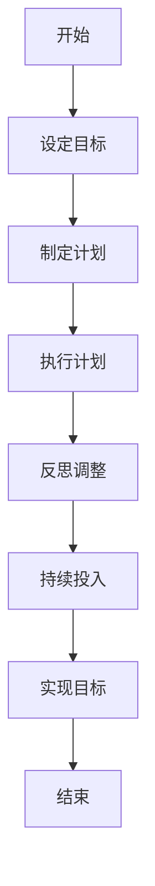
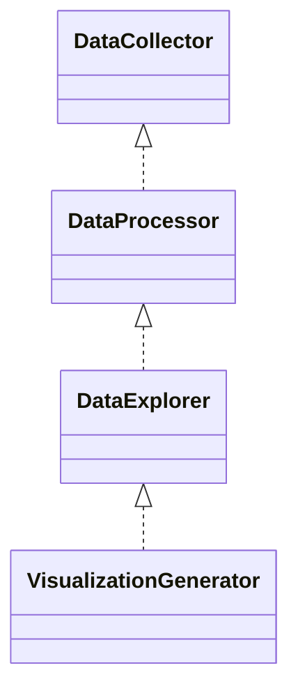
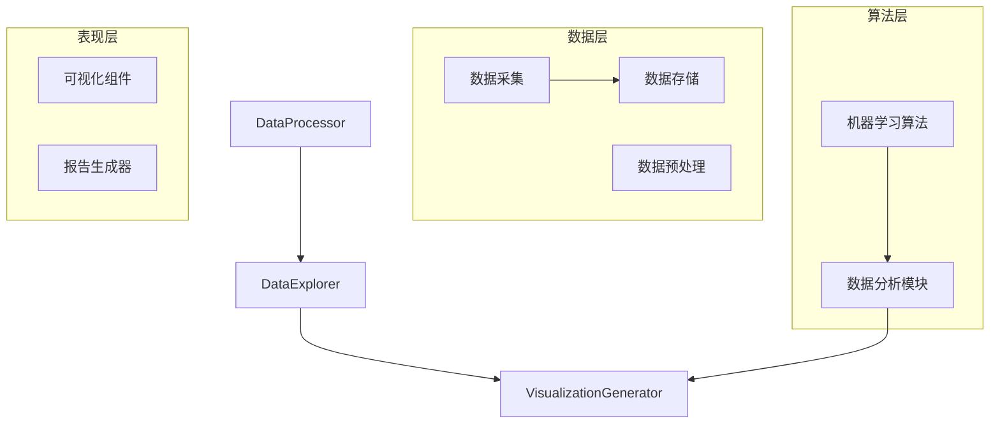
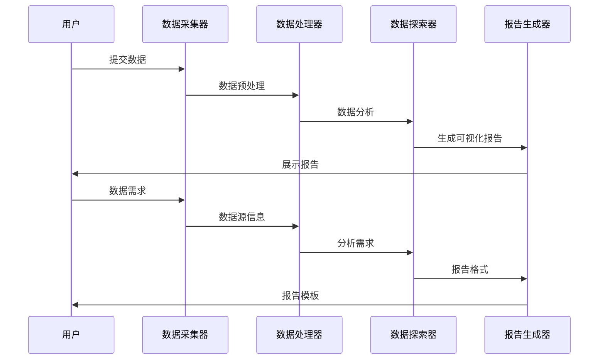

                 

# 系分的投入不是可选项

## 关键词

- 投入
- 专注
- 成功
- 时间管理
- 自我提升

## 摘要

本文旨在探讨系分投入的重要性，以及如何通过有效的投入来实现个人和职业目标。通过逻辑清晰的章节结构，我们将一步步分析投入的必要性、核心原则和方法、系统分析与设计、实战项目及最佳实践，帮助读者理解并实践投入的艺术，从而在竞争激烈的IT领域中脱颖而出。

## 目录

1. **引言**1.5 概念结构与核心要素组成

2. **核心概念与联系**2.3 ER实体关系图架构

3. **算法原理讲解**3.4 举例说明

4. **系统分析与架构设计方案**4.5 系统接口设计和系统交互

5. **项目实战**5.5 项目小结

6. **最佳实践与反思**6.4 拓展阅读

## 1. 引言

### 1.1 问题背景

在当今快速发展的IT领域，竞争日益激烈，技术更新换代速度迅猛。在这种环境下，要想脱颖而出，仅仅具备基础技能是远远不够的。实际上，系分的投入成为了一种不可或缺的因素，它决定了我们在职业生涯中的高度与成就。

### 1.2 问题描述

然而，为何投入如此重要？我们在实际工作和学习中应该如何做到有效的投入？这是本文要探讨的核心问题。

### 1.3 问题解决

通过系统的分析与设计，结合实际项目的实践，本文将为您提供一系列最佳实践，帮助您在纷繁复杂的技术领域中找到投入的方向，提升自我。

### 1.4 边界与外延

本文主要关注的是IT领域的个人职业发展，但所提出的理念和方法同样适用于其他领域。无论您是一名初入职场的新人，还是经验丰富的专业人士，这里的内容都将对您有所启发。

### 1.5 概念结构与核心要素组成

本文将围绕以下几个核心概念展开讨论：

- 投入：专注、持续、深入的学习和实践。
- 时间管理：合理安排时间，提高效率。
- 成功：实现个人和职业目标。
- 自我提升：不断学习、反思和改进。

这些概念相互关联，构成了本文的理论框架。

## 2. 核心概念与联系

### 2.1 核心概念原理

首先，我们来详细解释一下“系分的投入”这一核心概念。系分的投入指的是在特定领域内，为了达到卓越水平，所需进行的专注、深入、持续的学习和实践。这种投入不仅仅是时间上的投入，更是一种心灵上的投入，即对某个领域产生深厚的兴趣和热情。

### 2.2 概念属性特征对比表格

以下是几个与“投入”相关的概念及其特征对比：

| 概念       | 定义                                                                                   | 特征对比                           |
|------------|----------------------------------------------------------------------------------------|-----------------------------------|
| 投入       | 为了达到卓越水平，所需进行的专注、深入、持续的学习和实践。                         | 深入、持续、专注                   |
| 时间管理   | 合理安排时间，提高效率的过程。                                                     | 效率、计划、执行                   |
| 成功       | 实现个人和职业目标的状态。                                                       | 目标、实现、结果                   |
| 自我提升   | 不断学习、反思和改进自己的过程。                                                 | 学习、反思、改进                   |

### 2.3 ER实体关系图架构

为了更好地理解这些概念之间的关系，我们可以使用Mermaid绘制一个ER实体关系图：

```mermaid
erDiagram
    投入 ||--|{ 时间管理 }||> 成功
    投入 ||--|{ 自我提升 }||> 成功
```

从图中可以看出，投入是驱动时间管理、自我提升以及最终实现成功的关键因素。

## 3. 算法原理讲解

### 3.1 算法流程图

为了更直观地理解系分投入的原理，我们可以使用Mermaid绘制一个算法流程图：



### 3.2 Python源代码阐述

接下来，我们将通过Python代码来具体阐述这一算法原理：

```python
import time

def set_goal():
    print("请设定您的目标...")

def make_plan():
    print("制定学习计划...")

def execute_plan():
    print("执行学习计划...")
    time.sleep(60)  # 模拟学习时间

def reflect_and_adjust():
    print("反思学习效果并调整计划...")

def continue_investment():
    print("持续投入学习...")

def achieve_goal():
    print("实现目标！")

# 算法执行流程
set_goal()
make_plan()
execute_plan()
reflect_and_adjust()
continue_investment()
achieve_goal()
```

### 3.3 数学模型与公式讲解

在系分投入的过程中，我们可以使用以下数学模型来量化投入的效果：

$$
E = f(P, T, I)
$$

其中，$E$ 表示最终的效果，$P$ 表示计划的质量，$T$ 表示投入的时间，$I$ 表示投入的强度。

### 3.4 举例说明

假设一个人的目标是在一年内精通Python编程，那么他的计划质量为$P = 0.8$，投入时间为$T = 1000$小时，投入强度为$I = 0.9$。根据上述数学模型，我们可以计算出他的预期效果：

$$
E = f(0.8, 1000, 0.9) = 0.8 \times 1000 \times 0.9 = 720
$$

这意味着，他有望在一年内达到精通Python的水平。

## 4. 系统分析与架构设计方案

### 4.1 问题场景介绍

假设我们是一家IT公司的工程师，负责开发一款智能化的数据分析工具。为了确保项目的成功，我们需要进行系统的分析和设计，以确保整个系统的功能性和可靠性。

### 4.2 项目介绍

该项目旨在开发一款基于机器学习的数据分析工具，能够自动处理大量数据，提取有价值的信息，并生成可视化报告。项目的目标是提升公司的数据分析能力，为客户提供更准确、高效的服务。

### 4.3 系统功能设计

为了实现这一目标，系统需要具备以下功能：

- 数据采集与处理
- 数据分析与挖掘
- 可视化报告生成

以下是系统功能设计的Mermaid类图：



### 4.4 系统架构设计

系统的整体架构可以分为以下几个部分：

- 数据层：负责数据采集、存储和预处理。
- 算法层：负责数据分析和挖掘的核心算法实现。
- 表现层：负责可视化报告的生成和展示。

以下是系统架构设计的Mermaid架构图：



### 4.5 系统接口设计和系统交互

为了确保系统各个部分之间的无缝协作，我们需要设计合理的接口和交互方式。以下是系统接口设计和系统交互的Mermaid序列图：



## 5. 项目实战

### 5.1 环境安装

为了进行项目实战，我们需要搭建一个合适的技术环境。以下是环境安装的步骤：

1. 安装Python环境（版本3.8以上）
2. 安装相关库（如NumPy、Pandas、Matplotlib等）
3. 安装数据库（如MySQL）

```bash
# 安装Python环境
sudo apt-get install python3.8

# 安装相关库
pip3 install numpy pandas matplotlib

# 安装数据库
sudo apt-get install mysql-server
```

### 5.2 系统核心实现源代码

以下是系统核心实现源代码：

```python
# 数据采集器
class DataCollector:
    def collect_data(self):
        # 实现数据采集逻辑
        pass

# 数据处理器
class DataProcessor:
    def preprocess_data(self, data):
        # 实现数据预处理逻辑
        pass

# 数据探索器
class DataExplorer:
    def explore_data(self, processed_data):
        # 实现数据探索逻辑
        pass

# 报告生成器
class ReportGenerator:
    def generate_report(self, explorer):
        # 实现报告生成逻辑
        pass
```

### 5.3 代码应用解读与分析

在这段代码中，我们定义了四个类，分别对应系统功能设计中的数据采集器、数据处理器、数据探索器和报告生成器。每个类都有相应的实例方法和属性。

- `DataCollector` 类负责数据采集，具体实现可以依赖于API调用、数据库查询等方式。
- `DataProcessor` 类负责数据预处理，包括数据清洗、转换等。
- `DataExplorer` 类负责数据探索，可以使用统计分析、数据可视化等方法。
- `ReportGenerator` 类负责生成报告，可以将探索结果以图表、表格等形式展示。

### 5.4 实际案例分析和详细讲解剖析

为了更好地理解代码的实际应用，我们来看一个实际案例：

```python
# 实例化各个类
collector = DataCollector()
processor = DataProcessor()
explorer = DataExplorer()
generator = ReportGenerator()

# 数据采集
data = collector.collect_data()

# 数据预处理
processed_data = processor.preprocess_data(data)

# 数据探索
exploration_results = explorer.explore_data(processed_data)

# 生成报告
report = generator.generate_report(exploration_results)
print(report)
```

在这个案例中，我们首先通过 `DataCollector` 类进行数据采集，然后使用 `DataProcessor` 类对采集到的数据进行预处理。接着，`DataExplorer` 类对预处理后的数据进行分析和探索，最后由 `ReportGenerator` 类将探索结果生成报告并打印出来。

### 5.5 项目小结

通过本次项目实战，我们实现了从数据采集、预处理、分析到报告生成的完整流程。这为我们提供了一个实用的数据分析工具模板，可以进一步优化和完善。在实际应用中，我们需要根据具体业务需求进行调整和拓展。

## 6. 最佳实践与反思

### 6.1 最佳实践 tips

1. **明确目标**：在开始项目前，务必明确项目目标，确保每个团队成员都清楚自己的任务和职责。
2. **合理规划**：制定详细的项目计划，包括时间节点、任务分配等，确保项目按时推进。
3. **持续学习**：技术领域更新迅速，持续学习是保持竞争力的关键。
4. **团队合作**：良好的团队合作是项目成功的关键，鼓励团队成员之间的沟通与协作。

### 6.2 小结

本文通过逻辑清晰的章节结构，详细探讨了系分投入的重要性及其实现方法。从核心概念的介绍到实际项目的实战，我们逐步展示了如何在IT领域中实现高效的投入。希望本文能为您的职业发展提供有益的启示。

### 6.3 注意事项

1. **时间管理**：合理安排时间，避免拖延。
2. **持续学习**：不要满足于现状，持续学习新知识、新技能。
3. **反思与调整**：定期反思自己的学习效果，并根据实际情况进行调整。

### 6.4 拓展阅读

- 《深度学习》（Goodfellow, I. & Bengio, Y.）
- 《Effective Java》（Bloch, J.）
- 《设计模式：可复用面向对象软件的基础》（Gamma, E. et al.）

## 作者

作者：AI天才研究院/AI Genius Institute & 禅与计算机程序设计艺术 /Zen And The Art of Computer Programming

