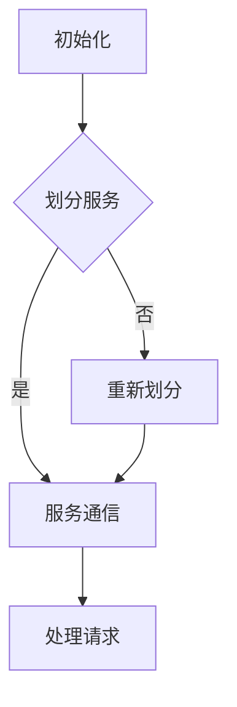
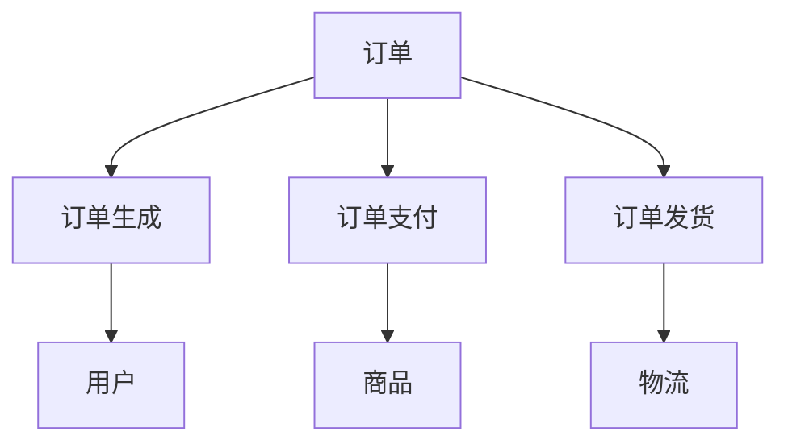
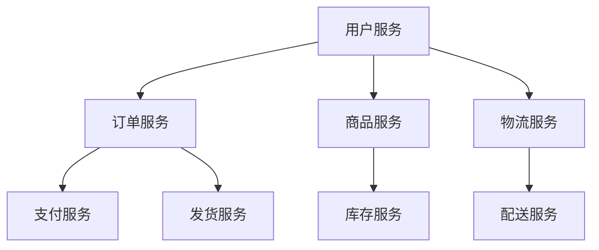
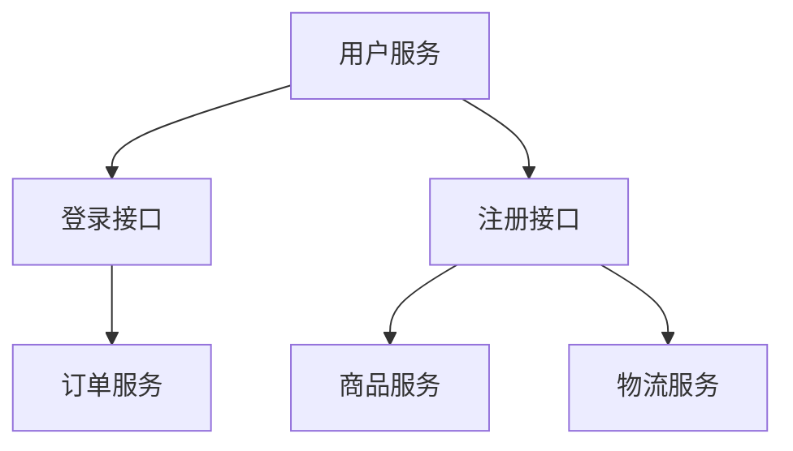
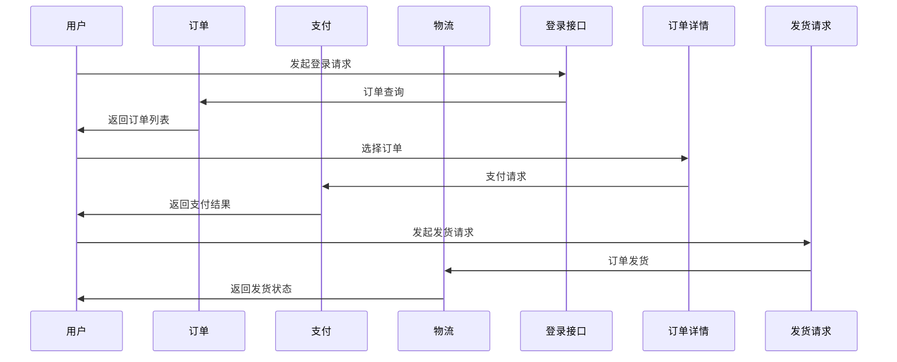

                 

### 系统思维才是架构师的真内核

#### 关键词：系统思维、架构师、软件架构、设计原则、实战案例

> 摘要：本文深入探讨系统思维在软件架构设计中的核心地位，通过理论阐述和实践案例，分析系统思维对架构师的重要性，并分享如何在实际项目中应用系统思维进行架构设计。

### 背景介绍

在当今快速发展的信息技术领域，软件架构设计成为决定系统性能、可维护性和可扩展性的关键因素。然而，传统的架构设计方法往往侧重于单一组件或功能的优化，忽视了系统整体结构和交互的复杂性和动态性。这种局限性导致了许多系统在实际运行中遇到性能瓶颈、系统崩溃和难以为继的维护问题。

为了应对这些挑战，系统思维应运而生。系统思维是一种综合考虑系统各个部分及其相互关系的思维方式，它强调从全局视角出发，理解系统整体行为和动态变化。通过系统思维，架构师能够更全面地分析问题、设计出更加稳健和灵活的系统架构。

### 核心概念与联系

#### 系统思维

**定义：** 系统思维是一种思考方式，它将系统视为一个整体，关注系统内部各个组成部分之间的相互作用和关系。

**特性：** 
- **整体性：** 系统思维强调系统的整体性，认为系统各部分相互依赖、相互作用。
- **动态性：** 系统思维考虑系统的动态变化，强调系统随时间变化的演化过程。
- **层次性：** 系统思维从不同层次看待问题，理解系统的结构层次和层次间的关系。

**核心要素：**
- **系统模型：** 用于描述系统结构和行为的抽象表示，如类图、架构图等。
- **系统要素：** 系统中的基本组成部分，如模块、组件、接口等。
- **系统属性：** 系统的基本特征，如性能、可扩展性、可靠性等。

#### 软件架构

**定义：** 软件架构是软件系统的整体结构，定义了系统的组件、组件之间的关系和系统的运行环境。

**特性：**
- **稳定性：** 软件架构应具备稳定性，确保系统在变化中的持续运行。
- **可扩展性：** 软件架构应支持系统的扩展，以适应未来需求的变化。
- **可维护性：** 软件架构应易于维护，降低系统维护的复杂度。

**核心要素：**
- **架构设计原则：** 用于指导架构设计的基本原则，如模块化、低耦合、高内聚等。
- **架构模式：** 用于解决常见架构问题的设计模式，如MVC、微服务架构等。

### 系统思维与软件架构的联系

系统思维与软件架构紧密相关，系统思维提供了理解软件架构的视角和方法，而软件架构则是系统思维在实际应用中的体现。系统思维强调全局视角和整体性，有助于架构师从宏观上把握系统结构，识别潜在问题并设计出更加稳健的架构。

### 算法原理讲解

为了更好地理解系统思维在软件架构中的应用，我们可以借助一个简单的例子——微服务架构的设计。

#### 算法流程图（使用Mermaid）



#### 算法原理与数学模型

微服务架构的设计过程可以看作是一个分治问题。初始时，我们将整个系统划分为多个服务。每个服务独立运行，并通过API进行通信。在这个过程中，我们需要考虑以下几个数学模型和公式：

- **通信复杂度（C）:** 通信复杂度是指服务间通信的次数和延迟。假设服务数量为N，通信复杂度可以表示为 O(N^2)。
- **系统复杂度（S）:** 系统复杂度是指系统的整体复杂度，包括服务数量、通信复杂度和系统性能。我们可以用以下公式表示：S = C * P，其中P是系统的性能指标。

通过优化服务划分和通信机制，我们可以降低系统复杂度和通信复杂度，从而提高系统性能。

#### 举例说明

假设我们有一个电商平台，最初我们将其划分为订单服务、商品服务和用户服务三个服务。在实际运行过程中，我们发现订单服务和商品服务之间存在大量的通信，导致系统性能下降。为了优化系统，我们可以重新划分服务，将订单服务和商品服务进一步拆分为订单管理服务和订单支付服务，从而降低通信复杂度和提高系统性能。

### 系统分析与架构设计方案

#### 问题场景介绍

在一个大型电子商务系统中，我们需要设计一个订单处理模块。该模块需要处理用户的订单请求，包括订单生成、支付、发货等操作。由于订单处理模块与商品管理和用户管理模块紧密相关，我们需要从系统整体角度出发，设计一个稳健、高性能的架构。

#### 项目介绍

项目名称：电商平台订单处理模块

项目背景：电商平台需要处理大量订单请求，系统性能和可扩展性成为关键问题。

项目目标：设计一个高效、可扩展的订单处理模块，满足高并发、高可用性的要求。

#### 系统功能设计（领域模型）



#### 系统架构设计



#### 系统接口设计



#### 系统交互



### 项目实战

#### 环境安装

在开始实现项目之前，我们需要安装必要的开发环境和依赖库。以下是一个简单的安装步骤：

1. 安装Python 3.8及以上版本
2. 安装Docker
3. 安装Flask框架

#### 系统核心实现源代码

以下是一个简单的订单处理模块的实现示例：

```python
from flask import Flask, request, jsonify
from flask_docker import Docker

app = Flask(__name__)
docker = Docker()

@app.route('/order', methods=['POST'])
def create_order():
    data = request.json
    user_id = data['user_id']
    product_id = data['product_id']
    quantity = data['quantity']

    # 查询用户余额
    user_balance = docker.execute_sql('SELECT balance FROM users WHERE id = ?', (user_id,))
    
    # 检查余额是否足够
    if user_balance < quantity:
        return jsonify({'error': 'Insufficient balance'})

    # 扣减用户余额
    docker.execute_sql('UPDATE users SET balance = balance - ? WHERE id = ?', (quantity, user_id))
    
    # 创建订单
    order_id = docker.execute_sql('INSERT INTO orders (user_id, product_id, quantity) VALUES (?, ?, ?)', (user_id, product_id, quantity), return_id=True)
    
    return jsonify({'order_id': order_id})

@app.route('/order/<int:order_id>', methods=['GET'])
def get_order(order_id):
    order = docker.execute_sql('SELECT * FROM orders WHERE id = ?', (order_id,))
    return jsonify(order)

if __name__ == '__main__':
    app.run()
```

#### 代码应用解读与分析

在上面的代码中，我们使用Flask框架实现了订单处理模块的核心功能。首先，我们接收用户的订单请求，包括用户ID、产品ID和数量。然后，我们查询用户余额，检查余额是否足够。如果余额足够，我们扣减用户余额并创建订单。最后，我们返回订单ID给用户。

#### 实际案例分析和详细讲解剖析

为了更好地理解代码应用，我们可以分析一个实际案例：

**案例：用户A购买产品B，数量为2**

1. 用户A发起订单请求，包括用户ID为1、产品ID为101、数量为2。
2. 订单处理模块查询用户A的余额，假设为100元。
3. 订单处理模块检查余额是否足够，发现余额足够。
4. 订单处理模块扣减用户A的余额，余额变为98元。
5. 订单处理模块创建订单，返回订单ID为1。
6. 用户A接收到订单ID为1的响应。

通过这个案例，我们可以看到订单处理模块如何处理用户的订单请求，并保证系统的准确性和一致性。

#### 项目小结

通过本次项目实战，我们实现了订单处理模块的核心功能，并分析了代码应用和实际案例。这个项目展示了系统思维在软件架构设计中的应用，帮助我们设计出高效、可靠的系统架构。

### 最佳实践 tips

- **系统思维的最佳实践：** 在设计软件架构时，始终从系统整体出发，关注系统各部分之间的相互作用和关系。避免仅关注单个组件的优化，导致系统整体性能下降。
- **避免常见的思维陷阱：** 在设计架构时，避免陷入局部最优的陷阱，要综合考虑系统整体性能和可扩展性。
- **实践中的系统思维技巧：** 通过实践，逐步培养系统思维的能力，如进行系统建模、分析系统行为等。

### 小结

系统思维是软件架构师的核心能力之一，它帮助我们更好地理解系统整体结构、识别潜在问题并设计出更加稳健的架构。通过本文的讨论，我们深入探讨了系统思维在软件架构设计中的应用，并分享了实战案例。希望本文能够帮助架构师提升系统思维，设计出更加优秀的软件架构。

### 注意事项

- 在实际项目中，系统思维的应用需要结合具体场景和需求，灵活运用。
- 系统思维不仅适用于软件架构设计，也适用于项目管理、团队协作等领域。

### 拓展阅读

- 《系统思维导论》: 该书提供了系统思维的全面介绍，包括基本概念、方法论和应用案例。
- 《软件架构设计原则》: 该书详细介绍了软件架构设计的基本原则和方法，有助于架构师提升设计能力。
- 《微服务架构设计》: 该书介绍了微服务架构的设计原理和实践方法，适用于需要构建可扩展、高可用系统的架构师。

---

**作者：AI天才研究院/AI Genius Institute & 禅与计算机程序设计艺术 /Zen And The Art of Computer Programming**

