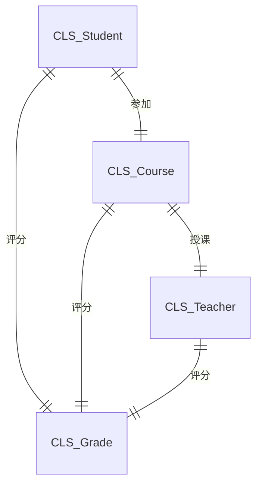

                 

## 第一部分：领域建模基础理论

### 1.1 领域建模背景与核心概念

#### 1.1.1 问题的提出与背景

在信息化和数据化的时代，如何有效地管理和处理复杂系统中的数据，成为了各行业面临的重大挑战。领域建模作为一种系统分析和设计的方法，旨在通过抽象和归纳，将实际问题转化为结构化的模型，从而更好地理解和解决问题。

##### 1.1.1.1 问题描述

领域建模主要解决的问题包括：

- **复杂性管理**：随着系统规模的扩大，直接操作原始数据变得复杂且容易出错。
- **抽象层次**：需要从业务角度对问题进行抽象，以便不同领域的专家可以理解并参与到系统设计过程中。
- **可维护性**：通过领域模型，可以降低系统的维护成本，提高系统的可扩展性。

##### 1.1.1.2 问题解决

领域建模提供了以下几种解决方案：

- **抽象与简化**：通过抽象关键实体和关系，简化复杂的系统结构。
- **标准化**：使用统一的方法和语言，使得领域模型在不同项目之间可以复用。
- **可视化**：通过图形化的方式展示模型，使得模型更加直观易懂。

##### 1.1.1.3 边界与外延

领域建模的边界主要包括：

- **系统边界**：定义系统所涵盖的业务范围和功能。
- **数据边界**：明确哪些数据属于系统内部，哪些数据需要外部交互。

#### 1.1.2 领域建模的概念与重要性

##### 1.1.2.1 概念介绍

领域建模（Domain Modeling）是指针对特定业务领域（Domain）建立模型的过程。它涉及到以下核心概念：

- **领域**（Domain）：指特定的业务领域，如金融、医疗、电商等。
- **模型**（Model）：对领域内的实体、关系和规则进行抽象和表示。
- **建模**（Modeling）：通过构建模型来理解和解决领域中的问题。

##### 1.1.2.2 核心概念原理

领域建模的原理可以概括为以下几点：

- **抽象**：通过提取关键要素，忽略次要细节，形成领域模型。
- **结构化**：将领域内的实体和关系组织成层次结构，便于理解和分析。
- **关联**：通过实体之间的关系，建立领域模型的整体视图。

##### 1.1.2.3 概念属性特征对比表格

| 概念         | 描述                                                         | 特征                         |
| ------------ | ------------------------------------------------------------ | ---------------------------- |
| 领域         | 指具体的业务领域                                             | 明确的业务范围和功能         |
| 模型         | 对领域内的实体、关系和规则进行抽象和表示                     | 结构化、关联性、可扩展性     |
| 建模         | 构建领域模型的过程                                           | 抽象层次、标准化、可视化     |

##### 1.1.2.4 ER实体关系图架构的Mermaid流程图

#### 1.1.3 领域建模的发展历程

##### 1.1.3.1 发展历程概述

领域建模的发展历程可以划分为以下几个阶段：

- **早期阶段**（20世纪80年代）：以实体关系模型（ER Model）为代表，奠定了领域建模的基础。
- **成熟阶段**（20世纪90年代）：随着面向对象技术的兴起，领域模型逐渐与面向对象方法论相结合。
- **扩展阶段**（21世纪初至今）：领域特定语言（DSL）、模型驱动开发（MDD）等新兴技术进一步推动了领域建模的发展。

##### 1.1.3.2 主要阶段与代表方法

- **实体关系模型**：由Peter Chen于1976年提出，是早期领域建模的主要方法。
- **统一建模语言**（UML）：由Grady Booch、James Rumbaugh和Ivar Jacobson于1997年提出，是现代领域建模的主要语言。
- **领域特定语言**（DSL）：通过定制化语法和语义，为特定领域提供高效的建模工具。
- **模型驱动开发**（MDD）：将模型作为主要开发资产，通过自动化工具生成应用程序代码。

### 1.2 领域模型的核心要素与属性

#### 1.2.1 核心概念与联系

领域模型的核心概念包括：

- **实体**：领域中的基本构成单位，如学生、课程等。
- **关系**：实体之间的连接，如参加、授课等。
- **属性**：实体的特征，如学生姓名、课程学分等。

这些概念之间的联系如下：

- 实体与属性的关系是“包含”关系，即每个实体都有若干属性。
- 实体与关系的关系是“参与”关系，即每个实体都可能参与多个关系。

#### 1.2.2 领域模型的构建步骤

领域模型的构建一般分为以下步骤：

1. **需求分析**：明确领域需求，了解领域中的关键实体和关系。
2. **概念模型设计**：绘制ER图或类图，表示领域模型的基本结构。
3. **详细设计**：对概念模型进行细化，包括实体的属性定义、关系的规则等。
4. **模型验证**：检查模型是否符合领域需求，是否能够准确反映现实世界的复杂性。

#### 1.2.3 领域模型的属性特征

领域模型的属性特征主要包括：

- **基本属性**：如数据类型、长度、默认值等。
- **关联属性**：与外部实体或关系的属性。
- **约束属性**：如唯一性、外键约束等。

这些属性特征需要根据领域需求进行详细设计，以保证领域模型的有效性和一致性。接下来，我们将深入探讨领域模型的核心要素和属性，帮助读者更好地理解和构建领域模型。接下来，我们将分别介绍领域模型的核心要素和属性，帮助读者更好地理解和构建领域模型。

## 第1章：领域建模背景与核心概念

### 1.1 领域建模的起源与发展

领域建模（Domain Modeling）作为一种系统分析和设计方法，其起源可以追溯到20世纪70年代。当时，随着计算机技术的迅速发展，数据库管理系统（DBMS）开始广泛应用于各个领域，如何高效地组织和管理数据成为了一个重要课题。在这一背景下，实体关系模型（Entity-Relationship Model，简称ER模型）被提出，成为领域建模的基础方法。

#### 1.1.1 领域建模的起源

1976年，Peter Chen在美国计算机协会（ACM）的会议上首次提出了实体关系模型。ER模型通过实体（Entity）、属性（Attribute）和关系（Relationship）三个基本概念，对现实世界中的业务对象进行抽象和表示。ER模型为数据库设计和领域建模提供了一个统一的方法，使得数据建模过程变得更加直观和易于理解。

#### 1.1.2 领域建模的发展

在ER模型的基础上，领域建模经历了多个发展阶段：

1. **早期阶段**（20世纪80年代）：实体关系模型成为数据库设计的主要方法，被广泛应用于各类信息系统的开发。

2. **成熟阶段**（20世纪90年代）：随着面向对象编程（Object-Oriented Programming，OOP）的兴起，领域建模开始与面向对象方法论相结合，形成面向对象领域建模（Object-Oriented Domain Modeling）。面向对象领域建模通过类（Class）、对象（Object）、继承（Inheritance）和多态（Polymorphism）等概念，提高了领域模型的灵活性和可扩展性。

3. **扩展阶段**（21世纪初至今）：随着模型驱动开发（Model-Driven Development，MDD）和领域特定语言（Domain-Specific Language，DSL）的发展，领域建模的方法和技术得到了进一步丰富和扩展。模型驱动开发强调通过模型来指导软件开发的各个环节，从而提高开发效率和软件质量。领域特定语言则为特定领域提供了定制化的建模工具和语法，使得领域建模更加高效和精准。

#### 1.1.3 领域建模的重要性

领域建模的重要性主要体现在以下几个方面：

1. **抽象和简化**：领域建模通过抽象和简化的方式，将复杂的业务场景和现实世界中的复杂性转化为结构化的模型，使得系统设计和开发过程更加清晰和高效。

2. **跨领域复用**：通过统一的方法和标准，领域模型可以在不同的项目和应用场景之间复用，减少了重复劳动，提高了开发效率。

3. **沟通和理解**：领域模型提供了一种通用的语言和表示方式，使得不同领域的专家和开发人员可以更好地沟通和理解系统的设计和功能。

4. **系统分析和优化**：领域模型可以帮助分析师和设计者更好地理解系统的结构和行为，从而发现潜在的问题和优化空间。

### 1.2 领域建模的基本概念

领域建模涉及多个基本概念，包括领域（Domain）、模型（Model）和建模（Modeling）等。以下是对这些概念的定义和解释：

#### 1.2.1 领域（Domain）

领域是指一个特定的业务领域或应用领域，如金融、医疗、教育、电商等。领域中的实体、关系和规则构成了领域模型的基础。

1. **定义**：领域是指一个具有特定目标、任务和功能的业务环境或应用环境。
2. **特征**：领域具有以下特征：
   - **业务独特性**：每个领域都有其特定的业务规则和流程。
   - **功能完整性**：领域包含了实现特定目标所需的全部功能。
   - **范围限定**：领域是有限的，有明确的边界。

#### 1.2.2 模型（Model）

模型是对领域中的实体、关系和规则进行抽象和表示的图示或符号系统。模型的主要作用是帮助人们理解和分析领域，为系统设计提供基础。

1. **定义**：模型是通过对领域中的实体、属性和关系进行抽象和表示，形成的结构化图形或符号系统。
2. **类型**：常见的模型类型包括实体关系模型（ER Model）、统一建模语言（UML）和领域特定语言（DSL）等。
3. **特征**：模型具有以下特征：
   - **抽象性**：模型是对现实世界的简化，只关注关键要素。
   - **结构化**：模型通过结构化的方式组织实体和关系，使得系统结构更加清晰。
   - **可扩展性**：模型可以根据需求的变化进行扩展和调整。

#### 1.2.3 建模（Modeling）

建模是指通过对领域进行分析和抽象，构建领域模型的过程。建模的目的是为了更好地理解和解决领域中的问题。

1. **定义**：建模是通过分析领域中的实体、关系和规则，构建相应的模型的过程。
2. **过程**：建模通常包括以下步骤：
   - **需求分析**：了解领域需求，明确系统功能。
   - **概念建模**：绘制初步的领域模型，确定实体和关系。
   - **详细设计**：细化模型，定义实体的属性和关系的规则。
   - **验证和优化**：检查模型是否符合需求，进行必要的调整和优化。
3. **特征**：建模具有以下特征：
   - **迭代性**：建模是一个反复迭代的过程，随着需求的变化，模型也会进行相应的调整。
   - **灵活性**：建模方法灵活多样，可以根据具体需求选择合适的方法。
   - **可视化**：模型通常以图形化的方式展示，使得领域结构和关系更加直观易懂。

通过以上对领域建模的起源、发展和基本概念的解释，我们可以更好地理解领域建模的本质和作用。接下来，我们将进一步探讨领域建模的核心要素，包括实体、关系和属性等。

### 1.3 领域建模的核心要素

在领域建模的过程中，核心要素的选取和定义是构建有效领域模型的关键。核心要素包括实体、关系和属性等。这些要素不仅构成了领域模型的基本框架，而且反映了领域中的关键概念和结构。以下是领域建模中核心要素的详细解释。

#### 1.3.1 实体（Entity）

实体是领域建模中最基本的组成单元，代表了领域中的具体对象。例如，在一个学校的领域模型中，实体可能包括学生、教师、课程和教室等。

1. **定义**：
   - 实体：领域中的一个具体对象，可以是一个物理对象或抽象概念。

2. **属性**：
   - 实体通常具有一组属性，如学生的姓名、年龄、性别等。

3. **关系**：
   - 实体之间可以通过关系相互连接，例如，学生可以参加多个课程，课程可以有多个学生参与。

4. **特征**：
   - **独特性**：每个实体都是独一无二的，具有唯一的标识。
   - **抽象性**：实体是对现实世界对象的抽象，可能包含多个具体的对象。

5. **例子**：
   - 在一个电子商务系统中，实体可能包括商品、订单、客户和购物车等。

#### 1.3.2 关系（Relationship）

关系是实体之间的连接，代表了实体之间的交互和依赖关系。关系可以是单向的或多向的，可以是关联性的或约束性的。

1. **定义**：
   - 关系：实体之间的连接或交互，可以表示一种依赖、影响或关联。

2. **类型**：
   - **关联关系**：实体之间的直接连接，如学生与课程之间的关系。
   - **依赖关系**：实体之间的间接连接，如商品与供应商之间的关系。
   - **约束关系**：实体之间的限制条件，如订单的总金额必须大于零。

3. **特征**：
   - **方向性**：关系可以是单向的或双向的，反映了实体之间的交互方向。
   - **多重性**：关系可以有多重性，如一个学生可以参与多个课程，一个课程可以有多个学生参与。

4. **例子**：
   - 在一个学校系统中，学生与课程之间存在关联关系，订单与商品之间存在依赖关系。

#### 1.3.3 属性（Attribute）

属性是实体的特征或描述，代表了实体的具体信息和状态。属性可以是简单的数据类型，也可以是复杂的结构。

1. **定义**：
   - 属性：实体的特征或描述，用于表示实体的具体信息和状态。

2. **类型**：
   - **基本属性**：简单的数据类型，如姓名、年龄、电话号码等。
   - **组合属性**：由多个基本属性组成的复杂结构，如地址、邮件等。
   - **关联属性**：与其他实体相关的属性，如订单号、商品编号等。

3. **特征**：
   - **可选性**：某些属性是可选的，即实体可以没有这些属性。
   - **唯一性**：某些属性具有唯一性，如学生的学号。
   - **约束**：属性可能有约束条件，如电话号码必须是有效的。

4. **例子**：
   - 在一个学生实体中，属性可能包括姓名、年龄、性别和学号等。

通过了解实体、关系和属性这三个核心要素，我们可以更深入地理解领域建模的基础。这些要素不仅是领域模型的构建基石，也是领域分析的重要工具。在接下来的章节中，我们将进一步探讨领域模型的构建方法和应用。

### 1.4 领域建模的方法

领域建模的方法多种多样，每种方法都有其独特的原理和适用场景。以下是一些常见的领域建模方法及其特点。

#### 1.4.1 实体关系模型（ER Model）

实体关系模型（ER Model）是领域建模的一种基础方法，由Peter Chen于1976年提出。ER模型通过实体、属性和关系的组合，对现实世界中的业务对象进行抽象和表示。

1. **原理**：
   - 实体（Entity）：代表领域中的具体对象，如学生、课程等。
   - 属性（Attribute）：实体的特征或描述，如学生姓名、课程学分等。
   - 关系（Relationship）：实体之间的连接，如学生与课程之间的选修关系。

2. **特点**：
   - **直观性**：ER模型通过图形化的方式表示实体和关系，使得模型易于理解和可视化。
   - **灵活性**：ER模型支持多种实体关系类型，包括一对一、一对多和多对多关系。
   - **适用性**：ER模型广泛应用于数据库设计和信息系统开发。

3. **案例**：
   - 在一个学校系统中，学生、课程和教师可以被视为实体，选修关系可以表示为实体之间的关系。

#### 1.4.2 统一建模语言（UML）

统一建模语言（UML）是面向对象领域建模的一种标准化方法，由Grady Booch、James Rumbaugh和Ivar Jacobson于1997年提出。UML通过类、对象、接口和组件等概念，对软件系统的结构和行为进行描述。

1. **原理**：
   - 类（Class）：代表领域中的抽象实体，包括属性和方法。
   - 对象（Object）：类的实例，代表具体的实体对象。
   - 接口（Interface）：定义类的公共方法和属性。
   - 组件（Component）：系统的可重用部分，可以包含多个类和对象。

2. **特点**：
   - **综合性**：UML提供了丰富的建模元素和图示，可以满足不同类型的系统建模需求。
   - **标准性**：UML已经成为一种国际标准，被广泛应用于软件开发领域。
   - **灵活性**：UML支持多种视图，包括类图、组件图、用例图等，可以全面描述系统的不同方面。

3. **案例**：
   - 在一个电子商务系统中，用户、商品和订单可以被视为类，它们的交互关系可以通过用例图和类图进行描述。

#### 1.4.3 领域特定语言（DSL）

领域特定语言（Domain-Specific Language，DSL）是一种针对特定领域设计的编程语言或工具，旨在提高领域建模的效率和准确性。

1. **原理**：
   - DSL通过定制化的语法和语义，为特定领域提供高效的建模工具，使得领域专家可以直接使用领域语言进行建模。
   - DSL通常包括领域词汇、领域规则和领域工具，可以支持领域模型的自动化生成和验证。

2. **特点**：
   - **针对性**：DSL针对特定领域设计，可以更好地满足领域需求。
   - **高效性**：DSL提供简化的语法和工具，使得领域建模过程更加高效。
   - **可扩展性**：DSL可以根据需求的变化进行扩展，以适应新的领域场景。

3. **案例**：
   - 在一个金融系统中，可以使用一种专门为金融领域设计的DSL来建模股票交易过程，使得领域专家可以更方便地进行模型构建和验证。

#### 1.4.4 模型驱动开发（MDD）

模型驱动开发（Model-Driven Development，MDD）是一种以模型为核心的软件开发方法，通过模型来驱动整个开发过程，包括需求分析、设计、实现和测试等。

1. **原理**：
   - MDD通过创建和维护领域模型，来指导软件开发的各个环节，从而提高开发效率和质量。
   - MDD强调模型的复用和自动化，通过模型生成代码，减少手工编写代码的工作量。

2. **特点**：
   - **模型中心性**：MDD将模型作为主要开发资产，通过模型来描述和管理系统的各个方面。
   - **自动化**：MDD利用模型自动化生成代码、文档和测试案例，提高开发效率。
   - **可维护性**：通过模型来管理系统变化，使得系统维护更加容易。

3. **案例**：
   - 在一个复杂的电信网络系统中，可以使用MDD来建模网络拓扑、业务流程和通信协议，从而实现系统的自动化部署和管理。

通过上述对常见领域建模方法的介绍，我们可以看到每种方法都有其独特的优势和适用场景。在实际应用中，可以根据具体需求选择合适的方法进行领域建模，以实现高效的系统分析和设计。

### 1.5 领域建模的实际应用

领域建模不仅在理论研究中具有重要意义，在实际应用中也展现出了强大的价值。通过有效的领域建模，可以显著提高系统开发的效率和质量，优化业务流程，降低维护成本。以下是领域建模在实际应用中的几个关键领域：

#### 1.5.1 数据库设计

数据库设计是领域建模的重要应用场景之一。通过领域建模，可以清晰地定义数据库中的实体、关系和属性，从而构建一个结构化、高效且易于维护的数据库系统。

1. **数据模型设计**：
   - 领域建模帮助分析师和设计者识别业务领域中的关键实体和关系，从而构建出符合业务需求的数据模型。
   - 实体关系模型（ER Model）是数据库设计中常用的领域建模方法，通过ER图可以直观地表示实体和关系。

2. **案例**：
   - 在一个电商平台上，领域模型可以帮助设计商品、订单、用户等实体的关系，以及订单的状态转换流程。

#### 1.5.2 软件系统设计

软件系统设计中，领域建模用于描述系统的结构和功能，帮助开发人员更好地理解系统需求，设计出符合业务逻辑的系统架构。

1. **系统架构设计**：
   - 领域建模可以帮助识别系统的核心组件和模块，以及它们之间的交互关系。
   - 统一建模语言（UML）是软件系统设计中常用的领域建模方法，通过UML图可以清晰地表示系统的类、对象和组件。

2. **案例**：
   - 在一个在线教育平台的设计中，领域模型可以帮助定义学生、课程、教师等实体，以及它们之间的注册、选课和评分关系。

#### 1.5.3 业务流程优化

领域建模可以用于分析和优化业务流程，通过建模找出业务中的瓶颈和优化点，从而提高业务效率和效果。

1. **流程优化**：
   - 领域建模可以帮助业务分析师识别业务流程中的关键步骤和流程关系，从而进行流程优化。
   - 业务流程模型（BPMN）是领域建模中常用的方法，通过BPMN图可以直观地表示业务流程。

2. **案例**：
   - 在一个制造企业中，领域建模可以帮助优化生产流程，减少生产周期，提高生产效率。

#### 1.5.4 领域特定应用

领域建模可以应用于特定的领域，如金融、医疗、物流等，为这些领域提供定制化的解决方案。

1. **领域特定建模**：
   - 针对特定领域，可以使用领域特定语言（DSL）进行建模，以更好地满足领域需求。
   - DSL通过定制化的语法和语义，提高了领域建模的效率和准确性。

2. **案例**：
   - 在金融领域，可以使用领域特定语言来建模金融产品、交易流程和风险管理。

#### 1.5.5 模型驱动的开发

模型驱动开发（MDD）是一种以模型为核心的开发方法，通过领域建模来驱动整个开发过程，从而提高开发效率和质量。

1. **MDD流程**：
   - 领域建模是MDD的核心环节，通过构建和维护领域模型，指导软件开发的各个环节。
   - MDD利用模型自动化生成代码、文档和测试，减少手动编写和修改的工作量。

2. **案例**：
   - 在一个复杂的物联网系统中，使用MDD来建模设备连接、数据传输和处理流程，从而实现自动化部署和管理。

通过以上实际应用场景的介绍，我们可以看到领域建模在各个领域中的重要作用。无论是数据库设计、软件系统设计、业务流程优化还是领域特定应用，领域建模都为系统分析和设计提供了强有力的支持，帮助组织更好地理解和解决业务问题。

### 1.6 领域建模的验证与优化

在构建领域模型的过程中，验证与优化是确保模型准确性和有效性的关键步骤。一个有效的领域模型需要经过反复的验证和优化，才能在实战中发挥其应有的作用。以下是领域建模的验证与优化方法：

#### 1.6.1 验证方法

1. **需求验证**：
   - **需求分析**：通过文档、访谈和问卷调查等方式，收集和分析领域需求，确保模型符合业务需求。
   - **需求验证**：对收集到的需求进行验证，确保每个需求都准确无误地反映在模型中。

2. **一致性验证**：
   - **实体与关系**：检查实体和关系是否一致，确保每个实体都有相应的属性和关系。
   - **属性与约束**：检查实体的属性是否合理，包括数据类型、长度和约束条件。

3. **完整性验证**：
   - **数据完整性**：确保模型中的数据不会出现丢失或冗余。
   - **功能完整性**：确保模型能够实现所有的业务功能。

4. **模型验证**：
   - **评审**：通过同行评审，发现模型中的潜在问题。
   - **测试**：通过模拟测试，验证模型在实际应用中的性能和稳定性。

#### 1.6.2 优化策略

1. **简化模型**：
   - **去除冗余**：删除多余的实体和关系，简化模型结构。
   - **合并相似实体**：将功能相似或属性相近的实体合并，减少模型的复杂度。

2. **增强可扩展性**：
   - **模块化**：将模型分解为模块，使得每个模块可以独立开发和维护。
   - **灵活性设计**：通过灵活的设计原则，如分层架构和模块化设计，提高模型的扩展性。

3. **性能优化**：
   - **数据优化**：通过数据规范化、索引和优化查询等方式，提高模型的性能。
   - **算法优化**：使用高效的算法和数据结构，提高模型处理速度和响应时间。

4. **用户体验**：
   - **简化界面**：通过简化用户界面，提高用户的使用体验。
   - **交互设计**：优化用户与系统的交互流程，减少用户的操作步骤。

#### 1.6.3 实践案例

1. **案例分析**：
   - 在一个电子商务系统中，通过需求分析和验证，确定了商品、订单、用户和购物车等关键实体和关系。在模型构建过程中，发现订单状态管理过于复杂，通过简化订单状态转换流程，提高了系统的易用性和稳定性。

2. **优化案例**：
   - 在一个大型企业资源规划（ERP）系统中，通过优化数据模型和查询算法，显著提高了系统的性能和响应速度。同时，通过模块化和灵活性设计，使得系统能够更好地适应业务变化和扩展需求。

通过有效的验证和优化，领域模型能够更加准确地反映业务需求，提高系统的性能和用户体验，从而实现领域建模的目标。

### 1.7 领域建模工具与技术

在现代软件开发和系统设计中，领域建模工具和技术扮演着至关重要的角色。这些工具和技术不仅提高了领域建模的效率，还保证了模型的质量和一致性。以下是对几种常用领域建模工具和技术的介绍及其优缺点。

#### 1.7.1 UML建模工具

统一建模语言（UML）是一种广泛使用的领域建模工具，它提供了丰富的图示和符号，用于描述系统的结构和行为。常用的UML建模工具有：

1. **Rational Rose**：
   - **优点**：功能强大，支持多种UML图，包括类图、用例图、组件图等。
   - **缺点**：较重，学习曲线陡峭，不适合小规模项目。

2. **Visual Paradigm**：
   - **优点**：用户界面友好，支持云存储，适合团队协作。
   - **缺点**：部分高级功能需要付费，软件更新频率较低。

3. **StarUML**：
   - **优点**：开源免费，轻量级，支持多种编程语言。
   - **缺点**：功能相对简单，可能无法满足复杂项目的需求。

#### 1.7.2 数据库建模工具

数据库建模工具主要用于创建和设计数据库结构，常用的工具有：

1. **ERwin**：
   - **优点**：功能强大，支持多种数据库系统，包括Oracle、MySQL、SQL Server等。
   - **缺点**：价格较高，学习成本较高。

2. **MySQL Workbench**：
   - **优点**：免费，支持MySQL和MariaDB数据库。
   - **缺点**：功能相对简单，不适合大型数据库设计。

3. **dbDesigner4**：
   - **优点**：开源免费，支持多种数据库系统。
   - **缺点**：用户界面较老，可能不支持最新的数据库特性。

#### 1.7.3 领域特定语言（DSL）

领域特定语言（DSL）是为特定领域设计的编程语言或工具，它提高了领域建模的效率和准确性。常用的DSL有：

1. **SQL**：
   - **优点**：广泛使用，简单易懂，适用于数据库查询和操作。
   - **缺点**：主要用于数据操作，不适用于复杂的业务逻辑。

2. **Entity Framework**：
   - **优点**：支持对象关系映射（ORM），提高了数据库操作的效率。
   - **缺点**：学习成本较高，不适合小型项目。

3. **Xtext**：
   - **优点**：开源免费，支持自定义语言和语法，适合开发复杂DSL。
   - **缺点**：学习曲线陡峭，开发周期较长。

#### 1.7.4 模型驱动开发（MDD）工具

模型驱动开发（MDD）工具通过模型来驱动整个开发过程，提高了开发效率和软件质量。常用的MDD工具包括：

1. **MagicDraw**：
   - **优点**：功能全面，支持多种建模方法和标准，包括UML、BPMN、SysML等。
   - **缺点**：价格较高，学习成本较高。

2. **MDA Tool Suite**：
   - **优点**：支持模型驱动架构（MDA），支持自动代码生成。
   - **缺点**：功能复杂，学习曲线陡峭。

3. **VisualAge for Java**：
   - **优点**：支持Java开发，提供了强大的建模和代码生成功能。
   - **缺点**：较老的技术，支持较少，更新较慢。

通过选择合适的领域建模工具和技术，开发人员可以更高效地构建和优化领域模型，从而提高系统的质量和开发效率。

### 第1章总结与展望

通过对领域建模背景与核心概念、方法、应用以及验证与优化等方面的详细探讨，我们可以看到领域建模在系统分析和设计中的重要性。领域建模不仅帮助我们抽象复杂的业务场景，简化系统结构，还提高了系统的可维护性和扩展性。

**总结**：

- 领域建模起源于20世纪70年代的实体关系模型，随着面向对象技术和模型驱动开发方法的发展，领域建模逐渐成为一种重要的系统分析工具。
- 领域建模的核心要素包括实体、关系和属性，通过这些要素的合理组合，可以构建出结构化、层次清晰的领域模型。
- 常见的领域建模方法包括实体关系模型、统一建模语言、领域特定语言和模型驱动开发，每种方法都有其独特的优势和适用场景。
- 领域建模在数据库设计、软件系统设计、业务流程优化和领域特定应用等多个实际场景中都有广泛的应用。

**展望**：

- 随着人工智能和大数据技术的发展，领域建模的方法和技术将不断进化，更加智能化和自动化。
- 领域特定语言和模型驱动开发将继续成为领域建模的重要工具，为复杂系统的设计和开发提供更强有力的支持。
- 在未来的研究和应用中，如何提高领域建模的效率、准确性和可扩展性，将是重要的研究方向。

在接下来的章节中，我们将继续深入探讨领域建模的具体应用和实战案例，帮助读者更好地理解和应用领域建模方法。

