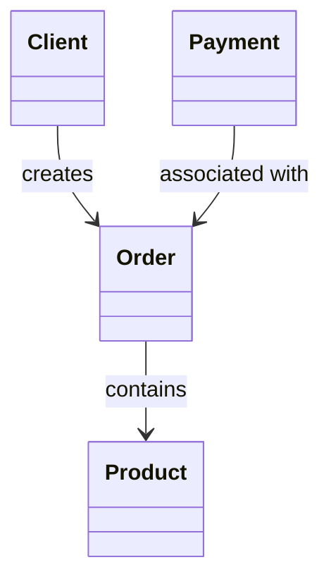
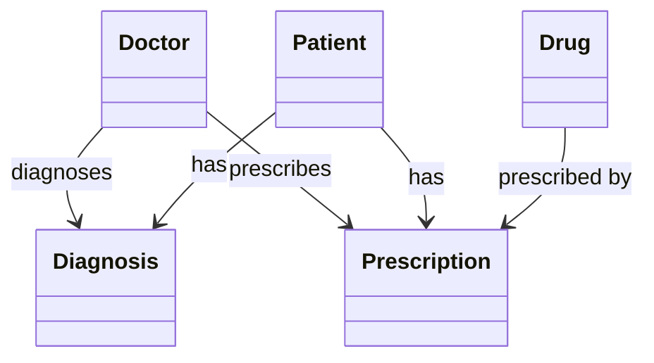
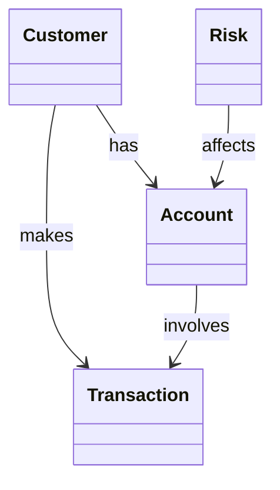

                 

# 练成领域建模这一神功

## 关键词：领域建模，软件工程，实体关系，模型设计，应用案例，最佳实践

### 摘要

领域建模是软件开发中至关重要的一环，它能够帮助开发者更好地理解业务需求，构建出清晰、高效且易于维护的系统架构。本文将深入探讨领域建模的基础知识、核心概念、设计与实现方法，并通过实际案例展示其在不同领域的应用。同时，还将分享领域建模的技巧、最佳实践以及未来展望，旨在帮助读者全面掌握这一关键技能。

## 第一部分：领域建模基础知识

### 第1章：领域建模概述

领域建模（Domain Modeling）是一种在软件工程中用于抽象和表示业务领域的方法。它通过识别和理解业务领域的实体、关系和规则，帮助开发者构建出与业务需求高度一致的软件系统。

#### 1.1 领域建模的背景

在软件开发过程中，需求分析是一个关键环节。传统的需求分析方法往往依赖于文档和会议，这不仅耗时且容易产生误解。领域建模提供了一种更加直观、结构化的方式来捕捉和理解业务需求。

#### 1.2 领域建模的意义

领域建模的意义主要体现在以下几个方面：

1. **提升沟通效率**：通过图形化的模型，团队成员可以更直观地理解业务需求和系统设计。
2. **确保需求一致**：领域模型可以作为项目的基础，确保所有团队成员对需求有统一的理解。
3. **指导开发**：领域模型能够指导开发人员设计出更加符合业务逻辑的系统。

#### 1.3 领域建模的基本概念

1. **实体（Entity）**：代表业务领域中的具体对象，如客户、订单等。
2. **属性（Attribute）**：描述实体的特征，如客户的姓名、地址等。
3. **关系（Relationship）**：描述实体之间的联系，如客户下单、订单包含商品等。
4. **规则（Rule）**：定义业务领域中的约束和规则，如订单必须包含至少一件商品等。

#### 1.4 领域建模的方法论

领域建模的方法论主要包括以下几个步骤：

1. **需求分析**：通过与业务专家的沟通，收集和理解业务需求。
2. **实体识别**：根据需求分析，识别出业务领域中的实体。
3. **属性定义**：为每个实体定义相应的属性。
4. **关系构建**：描述实体之间的关系。
5. **规则定义**：根据业务需求，定义业务规则。
6. **模型验证**：验证领域模型是否满足业务需求。

### 第2章：领域模型核心概念

领域模型的核心概念包括实体、属性、关系和规则。下面将详细讨论这些概念及其在领域建模中的应用。

#### 2.1 实体与属性

**实体**是领域模型中最基本的元素，代表业务领域中的对象。例如，在电子商务系统中，实体可以包括客户、订单、商品等。

**属性**是实体的特征，用于描述实体的具体信息。例如，对于客户实体，属性可以包括姓名、地址、联系方式等。

#### 2.2 关系与关联

**关系**描述了实体之间的相互联系。例如，在电子商务系统中，客户与订单之间存在“下单”关系，订单与商品之间存在“包含”关系。

**关联**是一种特殊的关系，它描述了实体之间的静态组合。例如，一个订单可能包含多个商品，这是一个“一对多”的关联。

#### 2.3 领域模型构建原则

在构建领域模型时，需要遵循以下原则：

1. **简洁性**：领域模型应尽可能简洁，避免冗余。
2. **一致性**：模型中的实体、属性和关系应保持一致。
3. **扩展性**：模型应具有较好的扩展性，以便在业务需求变化时能够灵活调整。
4. **可维护性**：模型应易于维护，确保在需求变更时能够快速响应。

#### 2.4 领域模型案例分析

为了更好地理解领域模型的应用，我们可以通过一个简单的案例来展示。

假设我们正在开发一个电子商务系统，核心实体包括客户、订单和商品。以下是这些实体的领域模型：

实体：客户
- 属性：姓名、地址、联系方式
- 关系：可以创建多个订单

实体：订单
- 属性：订单号、创建时间、状态
- 关系：可以包含多个商品

实体：商品
- 属性：商品名、价格、库存
- 关系：可以被多个订单包含

通过这个案例，我们可以看到如何利用领域模型来描述业务领域中的实体及其关系。

### 第3章：领域模型设计与实现

领域模型的设计与实现是领域建模过程中最重要的环节。在这一部分，我们将讨论如何设计和实现一个有效的领域模型。

#### 3.1 领域模型的抽象

领域模型的抽象是领域建模的第一步。通过抽象，我们可以从复杂的业务领域中提取出核心的概念和实体，并将其转化为模型中的元素。

#### 3.2 领域模型语言选择

在实现领域模型时，选择合适的语言是非常重要的。常见的领域模型语言包括UML（统一建模语言）、ER（实体关系模型）等。

#### 3.3 领域模型实现过程

领域模型的实现过程通常包括以下几个步骤：

1. **需求分析**：收集和理解业务需求。
2. **模型设计**：根据需求设计领域模型。
3. **模型验证**：验证模型是否满足业务需求。
4. **模型实现**：将领域模型转化为实际的应用程序。

#### 3.4 领域模型评估与优化

领域模型的评估与优化是确保模型质量和性能的重要环节。评估方法包括：

1. **一致性检查**：检查模型中的实体、属性和关系是否一致。
2. **完整性检查**：确保模型中没有遗漏重要的实体和关系。
3. **性能分析**：分析模型对系统性能的影响，并进行优化。

### 第4章：领域模型的扩展与应用

领域模型不仅在软件开发中具有重要意义，还可以广泛应用于多个领域。在这一部分，我们将探讨领域模型在不同领域的应用。

#### 4.1 领域模型在软件工程中的应用

在软件工程中，领域模型主要用于需求分析、系统设计和系统测试。通过领域模型，开发者可以更好地理解业务需求，并设计出符合需求的软件系统。

#### 4.2 领域模型在企业系统设计中的应用

企业系统通常涉及多个业务领域，领域模型可以帮助企业更好地管理和整合这些领域。例如，在人力资源管理系统中，领域模型可以描述员工、部门、职位等实体及其关系。

#### 4.3 领域模型在数据库设计中的应用

数据库设计是软件开发中的重要环节，领域模型可以用于指导数据库设计。通过领域模型，开发者可以更好地理解业务需求，并设计出符合需求的数据库表结构和关系。

#### 4.4 领域模型的未来发展趋势

随着技术的发展，领域模型在未来将继续发挥重要作用。未来领域模型的发展趋势包括：

1. **智能化**：领域模型将结合人工智能技术，实现更加智能的建模和优化。
2. **自动化**：领域模型将实现自动化生成和优化，提高开发效率。
3. **多领域集成**：领域模型将支持跨领域集成，实现更复杂的业务需求。

## 第二部分：领域建模实战案例

在这一部分，我们将通过实际案例展示领域建模的应用。

### 第5章：电子商务领域建模

电子商务领域是一个典型的应用领域，领域建模可以帮助开发者更好地理解和设计电子商务系统。

#### 5.1 电子商务领域概述

电子商务领域涉及多个实体，包括客户、订单、商品、支付等。这些实体之间存在复杂的关联和关系。

#### 5.2 电子商务领域实体与关系

以下是一个简单的电子商务领域模型：

实体：客户
- 属性：姓名、地址、联系方式
- 关系：可以创建多个订单

实体：订单
- 属性：订单号、创建时间、状态
- 关系：可以包含多个商品

实体：商品
- 属性：商品名、价格、库存
- 关系：可以被多个订单包含

实体：支付
- 属性：支付方式、支付金额
- 关系：与订单相关联

#### 5.3 电子商务领域模型设计与实现

在电子商务领域模型的设计与实现过程中，我们可以使用UML类图来描述实体及其关系。以下是一个简单的UML类图示例：

#### 5.4 电子商务领域模型应用案例

通过电子商务领域模型，我们可以实现以下功能：

1. **客户管理**：管理客户信息，包括添加、删除、修改等操作。
2. **订单管理**：管理订单信息，包括创建、删除、修改等操作。
3. **商品管理**：管理商品信息，包括添加、删除、修改等操作。
4. **支付管理**：管理支付信息，包括支付方式、支付金额等。

### 第6章：医疗健康领域建模

医疗健康领域是一个复杂且重要的领域，领域建模可以帮助医疗健康系统更好地处理业务需求。

#### 6.1 医疗健康领域概述

医疗健康领域涉及多个实体，包括医生、患者、药品、诊断等。这些实体之间存在复杂的关联和关系。

#### 6.2 医疗健康领域实体与关系

以下是一个简单的医疗健康领域模型：

实体：医生
- 属性：姓名、职称、科室
- 关系：可以诊断患者、开具处方

实体：患者
- 属性：姓名、年龄、联系方式
- 关系：可以接受医生的诊断、开具处方

实体：药品
- 属性：药品名、价格、库存
- 关系：可以被医生开具处方、被患者购买

实体：诊断
- 属性：诊断结果、诊断时间
- 关系：与患者相关联

#### 6.3 医疗健康领域模型设计与实现

在医疗健康领域模型的设计与实现过程中，我们可以使用UML类图来描述实体及其关系。以下是一个简单的UML类图示例：

#### 6.4 医疗健康领域模型应用案例

通过医疗健康领域模型，我们可以实现以下功能：

1. **医生管理**：管理医生信息，包括添加、删除、修改等操作。
2. **患者管理**：管理患者信息，包括添加、删除、修改等操作。
3. **药品管理**：管理药品信息，包括添加、删除、修改等操作。
4. **诊断与处方管理**：管理诊断结果和处方信息，包括创建、删除、修改等操作。

### 第7章：金融领域建模

金融领域是一个高度复杂且对准确性要求极高的领域，领域建模可以帮助金融系统更好地处理业务需求。

#### 7.1 金融领域概述

金融领域涉及多个实体，包括客户、账户、交易、风险等。这些实体之间存在复杂的关联和关系。

#### 7.2 金融领域实体与关系

以下是一个简单的金融领域模型：

实体：客户
- 属性：姓名、联系方式、账户余额
- 关系：可以创建多个账户、进行多个交易

实体：账户
- 属性：账户号、账户余额、开户时间
- 关系：属于一个客户、可以进行多个交易

实体：交易
- 属性：交易号、交易时间、交易金额
- 关系：与账户相关联、可以涉及多个账户

实体：风险
- 属性：风险等级、风险描述
- 关系：与账户相关联、可以影响账户的运营状况

#### 7.3 金融领域模型设计与实现

在金融领域模型的设计与实现过程中，我们可以使用UML类图来描述实体及其关系。以下是一个简单的UML类图示例：

#### 7.4 金融领域模型应用案例

通过金融领域模型，我们可以实现以下功能：

1. **客户管理**：管理客户信息，包括添加、删除、修改等操作。
2. **账户管理**：管理账户信息，包括添加、删除、修改等操作。
3. **交易管理**：管理交易信息，包括创建、删除、修改等操作。
4. **风险管理**：评估和管理风险，包括风险识别、风险评估、风险控制等操作。

## 第三部分：领域建模技巧与最佳实践

在这一部分，我们将讨论领域建模的技巧和最佳实践。

### 第8章：领域建模技巧

在领域建模过程中，掌握一些技巧可以帮助我们更有效地进行建模。

#### 8.1 领域建模中的常见问题

1. **需求不明确**：在建模前，确保需求明确，避免产生误解。
2. **模型过于复杂**：避免过度设计，保持模型的简洁性。
3. **不一致性**：确保模型中的实体、属性和关系保持一致。

#### 8.2 领域建模技巧总结

1. **逐步迭代**：分阶段进行建模，逐步完善。
2. **与业务专家合作**：与业务专家紧密合作，确保模型符合实际需求。
3. **使用可视化工具**：使用可视化工具（如UML类图）来提高模型的可读性。

#### 8.3 领域建模工具推荐

1. **StarUML**：一款功能强大的UML建模工具，支持多种建模语言。
2. **ER/Studio**：一款专业的数据库建模工具，支持实体关系模型。
3. **Visual Paradigm**：一款综合性的建模工具，支持多种建模方法。

### 第9章：领域建模最佳实践

领域建模的最佳实践可以帮助我们更好地进行领域建模。

#### 9.1 领域建模团队建设

1. **明确团队角色**：确保团队成员明确各自的角色和职责。
2. **定期沟通**：定期组织团队会议，确保团队成员对项目进展有统一的理解。
3. **分工合作**：合理分工，确保每个成员能够专注于自己的领域。

#### 9.2 领域建模流程优化

1. **需求分析**：确保需求分析阶段充分、彻底。
2. **模型评审**：定期进行模型评审，确保模型符合业务需求。
3. **持续迭代**：持续优化模型，根据反馈进行调整。

#### 9.3 领域建模质量保障

1. **一致性检查**：确保模型中的实体、属性和关系保持一致。
2. **完整性检查**：确保模型中没有遗漏重要的实体和关系。
3. **性能分析**：分析模型对系统性能的影响，并进行优化。

#### 9.4 领域建模持续迭代与优化

1. **定期更新**：根据业务需求的变化，定期更新领域模型。
2. **用户反馈**：收集用户反馈，及时调整模型。
3. **技术升级**：结合最新的技术趋势，持续优化领域模型。

### 第10章：领域建模未来展望

随着技术的发展，领域建模也将迎来新的机遇和挑战。

#### 10.1 领域建模与AI的结合

1. **智能化建模**：利用AI技术进行自动化的领域建模。
2. **智能优化**：结合AI技术，实现领域模型的自动优化。

#### 10.2 领域模型在新兴技术中的应用

1. **区块链**：领域模型在区块链中的应用，如智能合约的设计。
2. **云计算**：领域模型在云计算环境下的优化和应用。

#### 10.3 领域建模的未来趋势

1. **多领域集成**：支持跨领域集成，实现更复杂的业务需求。
2. **智能化与自动化**：领域建模将更加智能化和自动化，提高开发效率。

## 附录

### 附录A：领域建模常用工具与资源

- **StarUML**：[官网](https://staruml.io/)
- **ER/Studio**：[官网](https://www.sas.com/en_us/software/analytics/data-management/data-integration/erd-studio.html)
- **Visual Paradigm**：[官网](https://www.visual-paradigm.com/)

### 附录B：领域建模案例数据库

- **Model Driven Solutions**：[官网](https://model-driven-solutions.com/)
- **Modeling Languages**：[官网](https://modeling-languages.org/)

### 附录C：领域建模实践指南

- **《领域驱动设计》**：[作者：Eric Evans]
- **《UML基础教程》**：[作者：约翰·福赖尔]

### 附录D：领域建模相关书籍与论文推荐

- **《领域建模：概念、技术与实践》**：[作者：刘伟]
- **《领域驱动设计：软件核心复杂性应对策略》**：[作者：Eric Evans]

## 作者信息

- 作者：AI天才研究院/AI Genius Institute & 禅与计算机程序设计艺术 /Zen And The Art of Computer Programming

---

通过本文的讨论，我们可以看到领域建模在软件开发中的重要性。从基础知识的介绍到实际案例的应用，再到技巧和最佳实践的分享，本文旨在帮助读者全面了解领域建模，提升其在软件开发中的能力。随着技术的不断进步，领域建模也将不断发展，为软件开发带来更多的可能性。让我们共同探索这一领域，不断进步。

