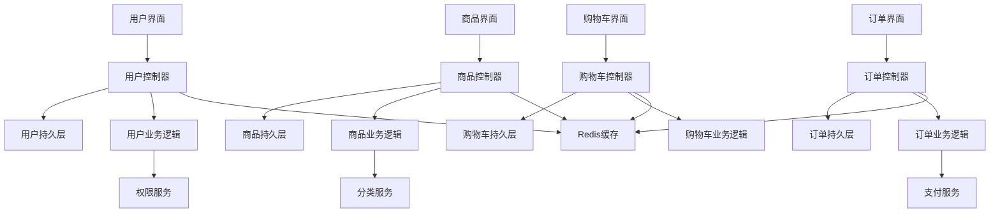
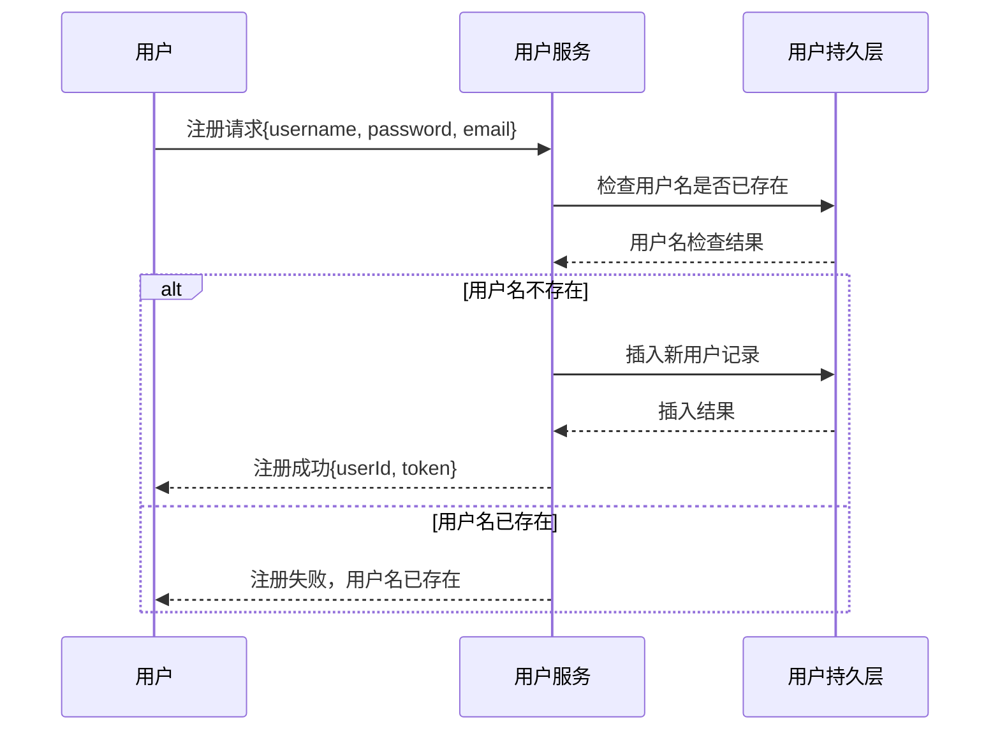
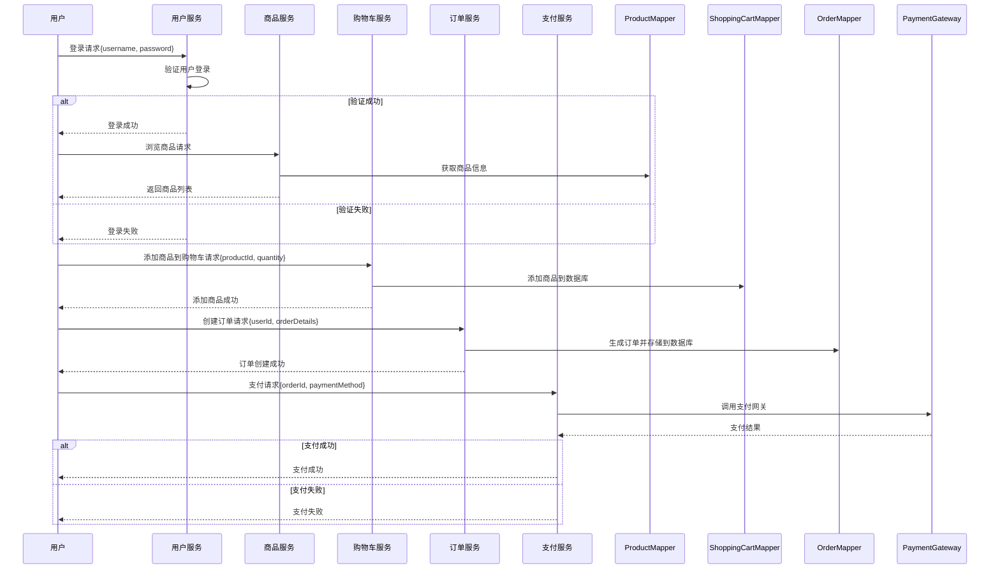

                 

### 背景介绍：核心概念术语说明

在讨论组件化与模块化之前，我们需要先理解一些核心概念和术语。这些概念和术语构成了我们进一步探讨的基础，因此首先对其进行详细的说明是至关重要的。

**组件（Component）**

组件是软件架构中的基本构建块。它通常是一个具有明确接口的软件单元，能够执行特定的功能。组件的特点包括：

- **独立性**：组件可以在不同的环境中独立运行和替换。
- **可复用性**：组件可以跨项目或系统复用，减少重复代码。
- **封装性**：组件将内部实现细节隐藏起来，只暴露必要的接口。

**模块（Module）**

模块与组件类似，但更多地关注于软件内部的结构和组织。模块通常包含一组相关函数、类或对象，共同实现一个特定的功能或服务。模块的特点包括：

- **组织性**：模块有助于组织代码，使软件结构更加清晰。
- **内聚性**：模块内部功能紧密相关，具有较高的内聚性。
- **低耦合性**：模块之间通过清晰的接口进行交互，耦合度较低。

**组件化（Component-Based Design）**

组件化是一种软件开发方法，强调将系统划分为多个可独立开发、测试和部署的组件。其核心思想是通过组件的重用和组合来提高软件开发的效率和质量。

- **独立开发**：组件可以在不同的开发环境中独立开发。
- **可组合性**：组件可以通过组合实现新的功能。
- **易于测试**：由于组件独立性高，测试更为方便和高效。

**模块化（Modular Design）**

模块化是一种软件架构设计方法，通过将系统划分为多个模块来实现。其目的是通过明确的模块边界来简化系统设计、提高可维护性。

- **模块独立性**：模块可以独立修改和替换，不会影响其他模块。
- **易于维护**：模块化设计使得代码维护变得更加简单。
- **可重用性**：模块可以在不同的系统中复用。

**边界与外延**

边界指的是组件或模块之间的接口，通过这些接口，组件或模块之间进行通信和数据交换。外延则是指组件或模块的用途和影响范围。合理的边界设计对于组件化与模块化的成功至关重要。

**概念结构与核心要素组成**

组件化与模块化的核心要素包括：

- **组件/模块接口设计**：定义组件或模块之间的交互方式。
- **组件/模块内部实现**：实现组件或模块的具体功能。
- **组件/模块组织结构**：定义组件或模块的组织方式，如层次结构、功能模块划分等。
- **组件/模块复用机制**：设计支持组件或模块复用的策略和机制。

通过上述核心概念和术语的详细说明，我们为后续的深入探讨打下了坚实的基础。接下来，我们将进一步分析组件化与模块化在软件架构设计中的应用及其重要性。

### 问题背景

在现代软件开发过程中，组件化与模块化已经成为提升代码质量和开发效率的重要手段。随着软件系统规模的不断扩大和复杂性的增加，传统的单体（monolithic）架构逐渐暴露出许多问题，如代码冗余、可维护性差、扩展性不足等。这些问题不仅限制了开发团队的工作效率，也影响了软件系统的长期可持续性。为了解决这些问题，软件架构设计方法逐步从单体架构向组件化与模块化架构演变。

**问题背景：单体架构的局限性**

单体架构（Monolithic Architecture）是将整个应用作为一个单一的、不可分割的实体来设计和开发。在单体架构中，所有的功能模块共同运行在同一个进程中，共享同一个代码库。虽然单体架构在早期开发阶段较为简单，易于实现和维护，但随着项目规模的扩大，它逐渐暴露出以下局限性：

1. **代码冗余**：由于所有功能模块共同运行在一个进程中，代码共享度较高，容易导致代码冗余。这会导致维护成本增加，代码质量下降。
2. **可维护性差**：单体架构中的代码高度耦合，一个模块的修改可能会影响到整个系统的运行，使得系统的可维护性大大降低。
3. **扩展性不足**：在单体架构中，新功能的添加通常需要修改现有的代码库，这使得系统的扩展性变得非常困难。
4. **部署复杂**：单体架构的应用通常需要整体部署，一旦一个模块出现问题，整个系统都会受到影响，增加了部署和维护的复杂性。

**问题背景：组件化与模块化的兴起**

为了克服单体架构的局限性，组件化（Component-Based Design）和模块化（Modular Design）架构逐渐被广泛应用。这两种架构设计方法强调将系统划分为独立的、可重用的组件或模块，从而实现以下目标：

1. **提高可维护性**：通过将系统划分为独立的组件或模块，每个组件或模块都可以独立开发、测试和部署，降低了模块间的依赖性，从而提高了系统的可维护性。
2. **提升开发效率**：组件化和模块化允许团队并行开发不同的组件或模块，提高了开发效率。
3. **增强扩展性**：组件和模块的独立性使得新功能可以以组件或模块的形式添加到系统中，而不需要修改现有代码，增强了系统的扩展性。
4. **简化部署过程**：由于组件或模块是独立的，部署过程可以更加灵活和便捷，减少了部署风险。

**组件化与模块化的重要性**

组件化与模块化在软件架构设计中的重要性体现在多个方面：

1. **代码复用**：组件和模块的设计初衷就是为了实现代码复用，减少了重复开发的工作量，提高了开发效率。
2. **提高开发质量**：通过明确的组件和模块接口设计，可以更好地管理和维护代码，减少了因耦合度过高导致的潜在问题。
3. **降低维护成本**：组件和模块的独立性使得维护变得更加简单和高效，降低了系统的维护成本。
4. **支持持续集成与部署**：组件化和模块化架构支持持续集成和持续部署，使得系统能够更快地响应市场变化。

综上所述，组件化与模块化在解决传统单体架构所面临的问题方面具有显著的优势，已成为现代软件架构设计中的重要趋势。在接下来的部分，我们将深入探讨组件化与模块化的核心概念、原理以及在实际应用中的具体实现方法。

### 组件化与模块化的区别

组件化（Component-Based Design）与模块化（Modular Design）虽然在目标和效果上有许多相似之处，但它们在定义、实现方法以及应用场景上存在一定的区别。理解这些区别对于正确选择和应用这两种设计方法至关重要。

**定义与实现方法**

1. **组件化（Component-Based Design）**

组件化设计将系统划分为独立的、具有明确接口的组件。组件通常具有以下特点：

- **独立性**：组件可以在不同的环境中独立运行和替换。
- **可复用性**：组件可以跨项目或系统复用。
- **封装性**：组件将内部实现细节隐藏起来，只暴露必要的接口。

组件化设计方法强调组件之间的松耦合和明确的接口定义。组件的实现通常采用模块化设计来实现，但组件化不仅仅局限于模块，还包括了更高层次的软件单元。

2. **模块化（Modular Design）**

模块化设计将系统划分为多个模块，每个模块包含一组相关函数、类或对象，共同实现一个特定的功能或服务。模块通常具有以下特点：

- **组织性**：模块有助于组织代码，使软件结构更加清晰。
- **内聚性**：模块内部功能紧密相关，具有较高的内聚性。
- **低耦合性**：模块之间通过清晰的接口进行交互，耦合度较低。

模块化设计方法的核心在于模块的组织和划分，模块通常是在较低的层次上（如函数或类）实现的。模块化设计关注于如何将代码划分成独立的、易于管理的单元。

**应用场景**

1. **组件化**

组件化设计在需要高度复用和灵活扩展的场景中应用广泛，例如：

- **企业级应用**：在企业级应用中，组件化设计可以用于构建复杂的业务系统，提高系统的可维护性和扩展性。
- **微服务架构**：微服务架构是组件化设计的一个典型应用场景，每个微服务都是一个独立的组件，可以独立部署和管理。
- **跨项目复用**：组件化设计使得开发团队可以将通用组件跨项目复用，减少重复开发的工作量。

2. **模块化**

模块化设计在关注系统结构和可维护性的场景中应用广泛，例如：

- **大型系统开发**：在大型系统的开发中，模块化设计可以帮助团队将复杂的功能模块化，降低系统的复杂度。
- **嵌入式系统**：在嵌入式系统的开发中，模块化设计有助于实现系统的可靠性和高效性。
- **教学与培训**：模块化设计在编程教育和培训中应用广泛，可以帮助初学者逐步学习和掌握复杂的编程概念。

**总结**

组件化与模块化在软件架构设计中的地位和作用不同，但它们相互补充，共同提升了软件开发的效率和质量。组件化更注重于系统的高层结构和复用性，而模块化则更注重于系统的内部结构和可维护性。在实际应用中，根据具体的系统需求和开发目标，可以选择合适的设计方法或结合使用。

### 组件化与模块化的核心概念和联系

要深入理解组件化与模块化，我们需要探讨其核心概念和它们之间的联系。通过这些核心概念，我们能够更好地把握组件化和模块化的设计原则，以及它们在软件架构中的应用。

**核心概念：组件和模块**

组件（Component）和模块（Module）是组件化与模块化的基础。虽然这两个概念在某些方面有重叠，但它们有着不同的侧重点和用途。

- **组件**：组件是一个独立的、具有明确接口的软件单元，通常实现特定的功能。组件的特点包括独立性、可复用性和封装性。组件之间通过接口进行通信，可以独立开发、测试和部署。
  
- **模块**：模块是软件内部结构的基本单元，通常包含一组相关的函数、类或对象。模块的特点包括组织性、内聚性和低耦合性。模块主要用于组织和管理代码，实现特定的功能。

**联系：组件和模块的关系**

组件和模块之间的关系可以从多个角度来理解：

- **层次结构**：组件通常在更高层次上组织模块，模块在较低层次上实现组件的功能。一个组件可以包含多个模块，而一个模块可以服务于多个组件。

- **依赖性**：组件和模块之间的依赖关系通过接口定义。组件依赖于模块提供的功能，而模块通过接口向组件暴露其功能。这种依赖关系有助于实现组件的独立性。

- **复用性**：组件和模块都具有复用性。组件可以在不同的项目中复用，模块可以在同一项目中复用。复用性是组件化和模块化设计的重要目标之一。

**核心概念：接口**

接口（Interface）是组件和模块之间通信的桥梁，定义了组件或模块之间的交互方式。一个良好的接口设计是组件化和模块化成功的关键。

- **抽象性**：接口提供了抽象的视图，隐藏了组件或模块的内部实现细节，只暴露必要的功能。这种抽象性有助于降低组件和模块之间的耦合度。

- **契约**：接口定义了组件或模块之间交互的规则和约定，包括输入参数、输出结果和异常处理等。接口的契约性确保了组件和模块之间的协同工作。

- **灵活性**：良好的接口设计允许组件和模块在不改变内部实现的情况下进行替换和扩展，增强了系统的灵活性和可维护性。

**核心概念：独立性**

独立性（Independence）是组件化和模块化设计的重要原则之一。独立性意味着组件或模块可以独立开发、测试和部署，不依赖于其他组件或模块。

- **组件独立性**：组件的独立性使得开发团队可以并行开发不同的组件，提高了开发效率。同时，独立组件的测试和部署更加灵活和高效。

- **模块独立性**：模块的独立性有助于减少系统中的耦合关系，提高代码的可维护性和可扩展性。独立模块的修改和扩展不会影响其他模块，降低了系统的复杂度。

**核心概念：可复用性**

可复用性（Reusability）是组件化和模块化设计的目标之一。通过设计和实现可复用的组件和模块，可以减少重复开发的工作量，提高开发效率。

- **组件复用**：可复用的组件可以在不同的项目中使用，减少了代码冗余，提高了开发质量。组件的复用还可以促进技术的标准化和最佳实践的应用。

- **模块复用**：模块的复用有助于实现代码的重用，降低系统的维护成本。模块可以在同一项目或不同的项目中复用，提高了系统的可维护性和扩展性。

**核心概念：封装性**

封装性（Encapsulation）是组件和模块设计的重要原则之一。封装性通过隐藏内部实现细节，只暴露必要的接口，确保组件和模块的独立性。

- **组件封装**：组件的封装性确保了组件的内部实现细节不会对外部组件暴露，从而降低了系统的耦合度，提高了组件的可维护性和可扩展性。

- **模块封装**：模块的封装性有助于组织和管理代码，提高了代码的可读性和可维护性。封装性使得模块的功能更加清晰，方便开发和维护。

通过以上对组件化与模块化核心概念和联系的探讨，我们可以看到，组件化和模块化设计在软件架构中具有重要的地位和作用。理解这些核心概念和联系，有助于我们在实际开发过程中正确应用组件化和模块化方法，提高代码质量、开发效率和维护性。

### 架构设计原则

组件化和模块化架构的设计原则是确保系统具有高度可维护性、可扩展性和可复用性的关键。以下是一些核心的设计原则：

**模块独立性**

模块独立性是组件化与模块化设计的基础原则之一。每个模块都应该专注于实现一个单一的功能，并且与其他模块之间的依赖性尽量降低。这样，当一个模块需要修改或扩展时，不会对其他模块产生影响，从而提高系统的可维护性。

- **实现单一职责原则**：每个模块应该只负责一项任务，而不是多种任务混合在一起。这有助于提高模块的内聚性，降低模块间的耦合度。
- **接口隔离原则**：模块之间的接口应该尽量简单和明确，只暴露必要的功能，减少不必要的依赖关系。

**高内聚、低耦合**

高内聚、低耦合是衡量模块设计质量的重要标准。高内聚意味着模块内部的功能紧密相关，低耦合意味着模块之间的依赖性较低。

- **内聚性**：模块内部的功能应该紧密相关，一个模块中的各个部分应该相互依赖，共同实现一个目标。
- **耦合度**：模块之间的依赖性应该尽量低，模块之间的通信应该通过清晰的接口进行，减少直接的代码依赖。

**封装性**

封装性是组件化和模块化设计的重要原则，它通过隐藏内部实现细节，保护模块或组件的内部状态，确保其独立性。

- **内部实现隐藏**：模块或组件的内部实现细节不应该对外暴露，只通过明确的接口进行通信。
- **状态保护**：模块或组件应该控制其内部状态的访问和修改，确保状态的一致性和正确性。

**可复用性**

可复用性是组件化和模块化设计的重要目标之一。通过设计可复用的模块和组件，可以减少重复开发的工作量，提高开发效率。

- **组件化**：组件应该具有清晰的接口和独立的实现，可以在不同的项目中复用。
- **模块化**：模块应该具有明确的职责和功能，可以在同一项目或不同项目中复用。

**设计模式与框架**

在设计组件化和模块化架构时，合理运用设计模式与框架可以显著提高系统的质量。

- **设计模式**：设计模式是一种在软件架构中广泛应用的解决方案，用于解决常见的设计问题。例如，工厂模式、单例模式、观察者模式等，可以帮助实现模块间的松耦合和组件的复用。
- **框架**：框架是一套预先设计好的软件结构，提供了一套规范和约定，用于实现特定的功能。例如，Spring、Django等，可以帮助快速构建和维护组件化和模块化架构。

**接口设计**

接口设计是组件化和模块化架构设计的关键环节。良好的接口设计可以确保组件和模块之间的清晰通信，降低耦合度。

- **抽象接口**：接口应该提供抽象的视图，隐藏内部实现细节，只暴露必要的功能。
- **契约明确**：接口应该定义清晰的契约，包括输入参数、输出结果和异常处理等，确保组件和模块之间的协同工作。

**架构演化**

组件化和模块化架构不是一成不变的，而是随着系统需求的变化而不断演化的。在架构设计过程中，应考虑系统的可扩展性和灵活性。

- **模块扩展**：模块应该设计为易于扩展和替换，以适应未来的需求变化。
- **组件复用**：组件应该具有高通用性和可复用性，可以方便地替换或扩展。

通过遵循上述架构设计原则，开发团队可以构建出高质量的组件化和模块化架构，提高软件系统的可维护性、可扩展性和可复用性，从而更好地应对日益复杂的软件开发挑战。

### 设计模式与框架在组件化与模块化中的应用

在组件化与模块化架构的设计过程中，设计模式和框架起到了至关重要的作用。设计模式为解决常见设计问题提供了成熟的解决方案，而框架则为组件和模块之间的集成提供了标准和规范。以下是一些常见的设计模式与框架，以及它们在组件化与模块化中的应用。

**设计模式**

1. **工厂模式（Factory Pattern）**

工厂模式是一种创建型设计模式，用于在程序运行时动态创建对象。通过工厂模式，可以将对象的创建逻辑分离出来，使得组件的创建过程更加灵活和可复用。

- **应用场景**：在组件化架构中，当需要根据不同条件创建多种组件时，可以使用工厂模式。例如，不同的数据库连接组件可以根据数据源类型动态创建。

- **实现方式**：使用工厂类或工厂方法来封装对象的创建逻辑，组件通过调用工厂方法来获取所需的组件实例。

2. **单例模式（Singleton Pattern）**

单例模式确保一个类仅有一个实例，并提供一个全局访问点。单例模式在组件化架构中常用于管理共享资源，如数据库连接池、配置管理等。

- **应用场景**：当系统需要保证某个关键组件只有一个实例时，可以使用单例模式。例如，数据库连接池需要保证全局唯一，防止多实例之间的冲突。

- **实现方式**：通过静态成员变量和静态工厂方法来实现单例模式。例如，使用`static`关键字和内部静态类来保证单例的创建和访问。

3. **观察者模式（Observer Pattern）**

观察者模式定义了一种一对多的依赖关系，当一个对象的状态发生改变时，所有依赖它的对象都会得到通知并自动更新。观察者模式在组件化架构中用于实现组件之间的通信和协作。

- **应用场景**：当系统中的组件需要实时响应其他组件的状态变化时，可以使用观察者模式。例如，在一个事件驱动系统中，事件监听器可以观察事件源，并在事件发生时进行相应的处理。

- **实现方式**：通过定义观察者和观察目标之间的接口，观察者订阅观察目标的事件，并在事件触发时接收通知。

**框架**

1. **Spring Framework**

Spring 是一个广泛使用的 Java 企业级应用程序框架，提供了一套完整的编程和配置模型，支持组件化与模块化架构。

- **应用场景**：Spring 框架适用于构建复杂的企业级应用程序，通过其依赖注入（DI）和面向切面编程（AOP）特性，实现组件的解耦和模块化。

- **实现方式**：Spring 通过 `@Component`、`@Service`、`@Repository` 等注解来定义组件，通过 `@Bean` 方法或 XML 配置来管理组件的生命周期和依赖关系。

2. **Django Framework**

Django 是一个高性能的 Python Web 框架，提供了一套完整的组件和工具，用于快速开发和部署 Web 应用程序。

- **应用场景**：Django 适用于快速开发和部署中小型 Web 应用程序，其组件化设计使得开发者可以灵活地组合不同的模块。

- **实现方式**：Django 使用 MTV（模型-视图-模板）架构模式，通过模型（Model）、视图（View）和模板（Template）的分离，实现组件的模块化和解耦。

3. **React**

React 是一个用于构建用户界面的 JavaScript 库，通过其组件化架构，使得前端开发变得更加模块化和可复用。

- **应用场景**：React 适用于构建复杂的前端应用，其组件化设计使得开发者可以轻松地创建、复用和组合 UI 组件。

- **实现方式**：React 使用 JSX 语法，通过 `class` 或 `function` 创建组件，并通过 `props` 和 `state` 管理组件的状态和属性。

**设计模式与框架的互补**

设计模式与框架相辅相成，共同支持组件化与模块化架构的构建。设计模式提供了通用的解决方案，而框架则提供了具体的实现和规范。在实际应用中，可以根据具体需求选择合适的设计模式或框架，或者将它们结合起来使用，以实现最佳的组件化和模块化效果。

通过合理运用设计模式和框架，开发团队可以构建出更加灵活、可扩展和可维护的系统，从而更好地应对现代软件开发中的复杂挑战。

### 组件接口设计原则

在组件化与模块化架构设计中，组件接口的设计至关重要。良好的接口设计不仅能够确保组件之间的松耦合和高效通信，还能提高系统的可维护性和可扩展性。以下是一些关键的接口设计原则：

**明确性**

接口的设计应该清晰明确，使得开发者能够快速理解其用途和功能。一个良好的接口应该具有以下特点：

- **命名规范**：接口的命名应具备直观性和一致性，避免使用晦涩难懂的名称。
- **功能描述**：接口文档应包含详细的功能描述，包括输入参数、输出结果和可能的异常处理。
- **代码示例**：提供实际代码示例，帮助开发者理解接口的使用方式。

**简洁性**

简洁性是接口设计的另一个重要原则。一个简洁的接口应该只暴露必要的功能，避免冗余和复杂。

- **最小化功能**：尽量减少接口的方法数量，只提供实现核心功能的接口。
- **抽象层次**：合理划分抽象层次，避免接口包含过多细节实现，保持接口的高层抽象性。

**稳定性**

接口的稳定性是确保系统长期可维护性的关键。在设计接口时，应考虑未来的变化和扩展，避免频繁的接口变更。

- **版本控制**：使用版本号区分不同版本的接口，避免不兼容的变更影响现有系统。
- **向后兼容**：在接口更新时，尽量避免破坏现有系统的功能，确保向后兼容。

**灵活性**

灵活性使得接口能够适应不同的使用场景和需求变化。在设计接口时，应考虑以下因素：

- **参数可扩展**：允许接口的输入参数根据具体需求进行扩展或缩减。
- **方法重载**：提供多种方法实现，允许根据不同的使用场景选择合适的接口。
- **动态调用**：支持动态调用接口，使得组件可以根据运行时环境灵活选择和使用接口。

**安全性**

安全性是接口设计不可忽视的一个方面。在设计接口时，应确保数据的安全传输和操作的安全性。

- **数据验证**：对接口传递的数据进行验证，确保数据的合法性和完整性。
- **异常处理**：设计合理的异常处理机制，确保在接口调用失败时能够正确处理异常。
- **权限控制**：对接口的使用权限进行严格管理，防止未经授权的访问和操作。

**可测试性**

可测试性是确保接口质量的重要指标。良好的接口设计应便于测试，包括单元测试和集成测试。

- **隔离性**：确保接口能够独立测试，不会受到其他组件或模块的干扰。
- **依赖注入**：使用依赖注入（DI）技术，使得接口的实现细节与测试环境分离，便于进行单元测试。
- **模拟和替代**：在测试过程中，可以使用模拟对象或替代对象来测试接口的行为，确保接口的独立性和可靠性。

通过遵循上述接口设计原则，开发团队可以设计出高质量的组件接口，从而提高系统的可维护性、可扩展性和可复用性。良好的接口设计是实现组件化与模块化架构成功的关键之一。

### 实际案例：系统功能设计

为了更好地理解组件化与模块化架构的实际应用，我们将通过一个实际案例来探讨系统功能设计的过程。这个案例将展示如何将一个复杂的系统功能分解为独立的组件和模块，并通过设计模式与框架来实现。

**案例背景**

假设我们正在开发一个在线购物平台，需要实现用户注册、商品浏览、购物车管理和订单处理等功能。这个系统需要具备高扩展性和高可维护性，因此我们将采用组件化与模块化设计方法。

**1. 系统功能模块划分**

首先，我们将系统功能划分为多个模块：

- **用户管理模块**：负责用户注册、登录和权限管理。
- **商品管理模块**：负责商品信息的管理和展示。
- **购物车模块**：负责用户购物车的管理。
- **订单管理模块**：负责订单的生成、处理和查询。

每个模块都可以独立开发、测试和部署，从而提高系统的可维护性和扩展性。

**2. 组件设计**

接下来，我们为每个模块设计独立的组件：

- **用户管理模块**：
  - **注册组件**：负责处理用户注册逻辑。
  - **登录组件**：负责用户登录逻辑。
  - **权限组件**：负责用户权限验证和管理。

- **商品管理模块**：
  - **商品展示组件**：负责展示商品信息。
  - **商品查询组件**：负责查询商品信息。
  - **商品分类组件**：负责商品分类管理。

- **购物车模块**：
  - **购物车组件**：负责管理用户购物车。
  - **购物车计算组件**：负责计算购物车中的商品总价。
  - **购物车持久化组件**：负责将购物车数据存储到数据库。

- **订单管理模块**：
  - **订单生成组件**：负责生成订单。
  - **订单处理组件**：负责处理订单。
  - **订单查询组件**：负责查询订单信息。

**3. 设计模式与框架应用**

在实现各个组件和模块时，我们将应用合适的设计模式和框架：

- **用户管理模块**：
  - **工厂模式**：使用工厂模式创建用户注册、登录和权限组件。
  - **单例模式**：使用单例模式管理用户权限组件，确保全局唯一实例。

- **商品管理模块**：
  - **观察者模式**：使用观察者模式管理商品分类组件，实现商品信息的实时更新。
  - **依赖注入**：使用依赖注入框架（如Spring）管理组件之间的依赖关系。

- **购物车模块**：
  - **工厂模式**：使用工厂模式创建购物车组件和购物车计算组件。
  - **策略模式**：使用策略模式实现不同的购物车持久化策略。

- **订单管理模块**：
  - **工厂模式**：使用工厂模式创建订单生成、订单处理和订单查询组件。
  - **模板方法模式**：使用模板方法模式定义订单处理的通用流程。

**4. 接口设计**

在组件接口设计方面，我们将遵循以下原则：

- **明确性**：为每个组件设计清晰明确的接口，提供详细的功能描述。
- **简洁性**：尽量减少接口的方法数量，只提供核心功能。
- **稳定性**：使用版本控制，确保接口的稳定性和向后兼容性。

**示例：用户注册接口设计**

```java
public interface IUserRegistrationService {
    // 注册用户
    void registerUser(String username, String password, String email);

    // 验证用户名是否已存在
    boolean isUsernameAvailable(String username);

    // 发送验证邮件
    void sendVerificationEmail(String email);
}
```

**5. 系统功能实现**

在实现系统功能时，我们将使用模块化设计方法，将各个组件和模块组合在一起，实现整体的功能。

- **用户注册功能实现**：
  - 注册组件：处理用户注册逻辑，调用用户管理模块中的其他组件进行验证和持久化。
  - 登录组件：处理用户登录逻辑，验证用户权限。
  - 权限组件：验证用户权限，确保用户可以访问系统资源。

- **商品浏览功能实现**：
  - 商品展示组件：从商品管理模块中获取商品信息，展示给用户。
  - 商品查询组件：提供商品搜索和过滤功能。
  - 商品分类组件：管理商品分类信息，实现商品分类的动态更新。

- **购物车管理功能实现**：
  - 购物车组件：管理用户购物车中的商品信息。
  - 购物车计算组件：计算购物车中的商品总价。
  - 购物车持久化组件：将购物车数据存储到数据库，实现购物车的持久化。

- **订单处理功能实现**：
  - 订单生成组件：根据用户选择的商品生成订单。
  - 订单处理组件：处理订单的支付、发货和售后等流程。
  - 订单查询组件：提供订单查询和状态更新功能。

通过以上实际案例，我们可以看到组件化与模块化架构在设计系统功能时的应用。通过合理的模块划分、组件设计和接口设计，系统实现了高扩展性和高可维护性，从而更好地应对复杂业务场景的需求变化。

### 系统架构设计

系统架构设计是软件架构中的关键步骤，它决定了系统的整体结构和性能。在进行系统架构设计时，我们需要综合考虑系统的需求、技术选型、性能要求、可扩展性以及安全性等多个方面。以下是一个详细系统架构设计的步骤，以及如何使用Mermaid流程图来描述系统架构。

**1. 需求分析**

在进行系统架构设计之前，首先需要对系统的需求进行详细分析。需求分析包括功能需求、性能需求、可靠性需求和安全需求等。通过需求分析，我们可以明确系统需要实现哪些功能，并确定系统的性能指标。

**2. 技术选型**

在需求分析的基础上，我们需要选择合适的技术栈和框架来构建系统。技术选型需要考虑以下几个方面：

- **编程语言**：选择适合项目需求的技术栈，如Java、Python、JavaScript等。
- **数据库**：选择适合数据存储和查询需求的数据库系统，如MySQL、MongoDB、Redis等。
- **中间件**：选择适合系统通信和消息传递的中间件，如RabbitMQ、Kafka等。
- **前端框架**：选择适合前端开发的前端框架，如React、Vue.js等。

**3. 确定系统架构风格**

根据需求分析和技术选型，我们需要确定系统的架构风格。常见的系统架构风格包括：

- **单体架构**：所有功能模块运行在一个进程中，易于实现但扩展性较差。
- **微服务架构**：将系统划分为多个独立的服务，每个服务运行在独立的进程中，具有较高的扩展性和灵活性。
- **组件化架构**：通过组件化将系统划分为多个独立的组件，每个组件可以独立开发、测试和部署。

**4. 设计系统模块**

在确定了系统架构风格后，我们需要设计系统的各个模块。每个模块应该实现特定的功能，并与其他模块通过清晰的接口进行通信。

- **用户管理模块**：负责用户注册、登录和权限管理。
- **商品管理模块**：负责商品信息的管理和展示。
- **购物车模块**：负责购物车管理。
- **订单管理模块**：负责订单的生成、处理和查询。

**5. 确定模块交互方式**

在系统架构设计中，我们需要明确各个模块之间的交互方式。常见的交互方式包括：

- **RESTful API**：通过HTTP协议进行远程过程调用。
- **消息队列**：通过消息队列进行异步通信。
- **WebSocket**：通过WebSocket进行实时通信。

**6. 设计系统接口**

接口设计是系统架构设计的关键环节。我们需要设计清晰、简洁的接口，确保模块之间的通信畅通无阻。

- **用户管理接口**：提供用户注册、登录和权限验证的接口。
- **商品管理接口**：提供商品信息查询、添加和删除的接口。
- **购物车接口**：提供购物车添加、删除和查询的接口。
- **订单管理接口**：提供订单生成、处理和查询的接口。

**7. 使用Mermaid流程图描述架构**

Mermaid是一个基于Markdown的图形流程图工具，可以方便地描述系统架构。以下是一个简单的Mermaid流程图示例，展示了在线购物平台的基本架构：



在这个示例中，我们使用了Mermaid的`graph`关键字来创建一个图形流程图，并通过`TB`（Top to Bottom，从上到下）布局来组织图中的元素。每个模块都用方框表示，模块之间的交互通过箭头表示。

**8. 考虑性能和扩展性**

在系统架构设计过程中，我们还需要考虑系统的性能和扩展性。以下是一些常用的优化策略：

- **缓存**：使用Redis等缓存系统来存储高频访问的数据，减少数据库访问压力。
- **负载均衡**：使用负载均衡器（如Nginx）来分发请求，提高系统的并发处理能力。
- **数据库优化**：通过数据库索引、分片和读写分离等策略来提升数据库性能。
- **服务化**：将系统拆分为多个独立的服务，提高系统的扩展性和容错性。

通过以上步骤和策略，我们可以设计出合理且高效的系统架构，确保系统能够满足需求、具备良好的性能和扩展性。同时，使用Mermaid流程图可以帮助我们清晰地表达和展示系统架构，便于团队协作和理解。

### 系统接口设计

在系统架构设计中，接口设计是确保各个模块之间能够高效、稳定通信的关键环节。系统接口设计主要包括定义接口规格、接口参数、返回值和异常处理等。以下将详细描述如何设计系统接口，并使用Mermaid序列图来展示接口调用流程。

**1. 接口规格定义**

接口规格定义是指明确接口的用途、功能以及如何使用该接口。在进行接口规格定义时，需要考虑以下几个方面：

- **接口名称**：接口的命名应具备描述性和一致性，如`getUserInfo`、`createOrder`等。
- **接口描述**：提供接口的详细描述，包括输入参数、返回值和可能的异常情况。
- **接口版本**：使用版本号来区分不同版本的接口，确保向后兼容性。

例如，以下是一个用户管理模块中的接口规格定义：

```markdown
## 用户注册接口

**URL**: `/api/users/register`

**Method**: `POST`

**Description**: 用于注册新用户。

**Parameters**:
| Name        | Type        | Description                                      |
|-------------|-------------|-------------------------------------------------|
| username    | String      | 用户名，长度不超过20个字符。                   |
| password    | String      | 用户密码，长度不少于6个字符。                   |
| email       | String      | 用户邮箱地址。                                   |

**Response**:
```json
{
  "status": "success",
  "message": "注册成功",
  "data": {
    "userId": "123456",
    "token": "your_access_token"
  }
}
```

**2. 接口参数设计**

接口参数设计是接口设计的重要部分，需要确保参数的合法性、完整性和合理性。

- **参数类型**：选择合适的参数类型，如字符串、数字、对象等。
- **参数验证**：对输入参数进行验证，确保参数的合法性和完整性。
- **默认值**：提供可选参数的默认值，以便在不传递参数时仍然能够正确执行功能。

例如，以下是一个商品查询接口的参数设计：

```markdown
## 商品查询接口

**URL**: `/api/products/search`

**Method**: `GET`

**Description**: 用于查询商品信息。

**Parameters**:
| Name        | Type        | Description                                      |
|-------------|-------------|-------------------------------------------------|
| categoryId  | Integer     | 商品分类ID。可选参数，默认值为0（查询所有商品）。|
| keyword     | String      | 关键词，用于模糊查询商品名称。可选参数。        |
```

**3. 返回值设计**

接口的返回值应清晰明确，便于前端或调用方处理。

- **成功返回**：当接口执行成功时，返回相应的数据结构和状态码。
- **错误返回**：当接口执行失败时，返回错误信息和相应的状态码。

例如，以下是一个订单创建接口的返回值设计：

```markdown
## 订单创建接口

**URL**: `/api/orders/create`

**Method**: `POST`

**Description**: 用于创建新订单。

**Response**:
```json
{
  "status": "success",
  "message": "订单创建成功",
  "data": {
    "orderId": "789012",
    "orderDetails": [
      {
        "productId": "123456",
        "quantity": 2,
        "price": 29.99
      }
    ]
  }
}
```

**4. 异常处理**

在接口设计中，需要考虑各种异常情况，并设计合理的异常处理机制。

- **系统异常**：当系统出现内部错误时，返回系统级别的错误信息。
- **业务异常**：当业务逻辑出现错误时，返回业务级别的错误信息。

例如，以下是一个用户登录接口的异常处理：

```markdown
## 用户登录接口

**URL**: `/api/users/login`

**Method**: `POST`

**Description**: 用于用户登录。

**Response**:
```json
{
  "status": "error",
  "message": "登录失败，用户名或密码错误",
  "errorCode": "1001"
}
```

**5. 使用Mermaid序列图展示接口调用流程**

Mermaid序列图可以帮助我们清晰地展示接口的调用流程和各个模块之间的交互。以下是一个简单的Mermaid序列图示例，展示了用户注册接口的调用流程：



在这个示例中，我们使用了`sequenceDiagram`关键字来创建一个序列图，并通过`participant`定义参与者和`->>`、`-->>`表示消息传递。这个序列图展示了用户注册接口的调用过程，包括用户请求注册、服务层处理请求和持久层执行数据库操作。

通过以上步骤和示例，我们可以设计出合理、清晰的系统接口，确保各个模块之间能够高效、稳定地通信。同时，使用Mermaid序列图可以帮助我们直观地展示接口调用流程，便于团队成员理解和使用。

### 系统交互设计

系统交互设计是确保各组件和模块能够无缝协作的重要环节。通过使用Mermaid序列图，我们可以直观地展示系统内各组件和模块之间的交互过程。以下是一个实际案例，用于展示如何设计并实现系统的交互流程。

**案例背景**

假设我们正在开发一个电子商务平台，系统包括用户管理、商品管理、购物车管理、订单管理和支付模块。我们需要设计并实现各模块之间的交互，确保系统能够高效、稳定地运行。

**1. 确定交互场景**

首先，我们需要明确系统中的关键交互场景。以下是一些常见的交互场景：

- 用户注册和登录
- 商品浏览和搜索
- 购物车管理（添加、删除商品）
- 订单创建和处理
- 支付流程

**2. 使用Mermaid序列图展示交互过程**

以下是一个示例，展示了用户在购物车中添加商品并完成支付的全流程交互：



在这个示例中，我们使用了Mermaid的`sequenceDiagram`关键字创建了一个序列图，定义了用户、用户服务、商品服务、购物车服务、订单服务和支付服务作为参与者。通过箭头和标签描述了各组件和模块之间的交互过程。

**3. 交互流程解释**

以下是对上述Mermaid序列图中的交互流程进行详细解释：

1. **用户登录**：
   - 用户向用户服务发送登录请求。
   - 用户服务验证用户登录，如果验证成功，返回登录成功消息；否则，返回登录失败消息。

2. **浏览商品**：
   - 用户请求商品服务获取商品列表。
   - 商品服务从数据库获取商品信息，并返回给用户。

3. **添加商品到购物车**：
   - 用户请求购物车服务添加商品到购物车。
   - 购物车服务将商品添加到数据库，并返回添加成功消息。

4. **创建订单**：
   - 用户请求订单服务创建订单。
   - 订单服务生成订单并存储到数据库，然后返回订单创建成功消息。

5. **支付流程**：
   - 用户请求支付服务进行支付。
   - 支付服务调用支付网关进行支付处理。
   - 如果支付成功，支付服务返回支付成功消息；否则，返回支付失败消息。

通过这个案例，我们可以看到如何使用Mermaid序列图来设计和实现系统的交互流程。这种方法不仅能够帮助团队成员更清晰地理解系统的工作原理，还能够便于文档化和后续的系统扩展。

### 项目实战

在本文的最后部分，我们将通过一个实际项目实战来深入探讨组件化与模块化架构的设计与实现。该项目将基于Python语言和Django框架，构建一个简单的博客平台。我们将介绍项目环境搭建、核心组件实现和代码解析等内容。

**1. 项目环境搭建**

首先，我们需要搭建项目环境。以下是在Windows操作系统上安装Django框架和所需的依赖的步骤：

- **安装Python 3**：确保已安装Python 3环境。
- **安装Django**：通过命令`pip install django`来安装Django框架。
- **创建新项目**：通过命令`django-admin startproject blog_project`来创建一个新的Django项目。
- **创建新应用**：进入项目目录，通过命令`python manage.py startapp blog`来创建一个新的应用。

**2. 应用模块设计**

在构建博客平台时，我们可以将系统划分为以下模块：

- **用户管理模块**：负责用户注册、登录和权限管理。
- **文章管理模块**：负责文章的创建、编辑、发布和删除。
- **评论管理模块**：负责评论的创建、编辑和删除。
- **标签管理模块**：负责标签的创建和管理。

**3. 核心组件实现**

以下是各核心组件的实现步骤和代码解析：

**用户管理模块**

用户管理模块负责处理用户注册、登录和权限验证。以下是用户模型和用户视图的实现：

```python
# models.py
from django.db import models
from django.contrib.auth.models import AbstractUser

class User(AbstractUser):
    nickname = models.CharField(max_length=30, blank=True)

# views.py
from django.shortcuts import render, redirect
from .models import User
from django.contrib.auth import login

def register(request):
    if request.method == 'POST':
        nickname = request.POST['nickname']
        user = User.objects.create_user(username=request.POST['username'], password=request.POST['password'], nickname=nickname)
        login(request, user)
        return redirect('home')
    return render(request, 'register.html')

def login(request):
    if request.method == 'POST':
        username = request.POST['username']
        password = request.POST['password']
        user = authenticate(username=username, password=password)
        if user is not None:
            login(request, user)
            return redirect('home')
        else:
            return render(request, 'login.html', {'error_message': 'Invalid username or password'})
    return render(request, 'login.html')
```

**文章管理模块**

文章管理模块负责文章的创建、编辑、发布和删除。以下是文章模型和文章视图的实现：

```python
# models.py
from django.db import models
from users.models import User

class Article(models.Model):
    title = models.CharField(max_length=200)
    content = models.TextField()
    author = models.ForeignKey(User, on_delete=models.CASCADE)
    created_at = models.DateTimeField(auto_now_add=True)
    updated_at = models.DateTimeField(auto_now=True)

# views.py
from django.shortcuts import render, redirect
from .models import Article

def create_article(request):
    if request.method == 'POST':
        title = request.POST['title']
        content = request.POST['content']
        author = request.user
        Article.objects.create(title=title, content=content, author=author)
        return redirect('home')
    return render(request, 'create_article.html')

def edit_article(request, article_id):
    article = Article.objects.get(id=article_id)
    if request.method == 'POST':
        article.title = request.POST['title']
        article.content = request.POST['content']
        article.save()
        return redirect('home')
    return render(request, 'edit_article.html', {'article': article})
```

**评论管理模块**

评论管理模块负责评论的创建、编辑和删除。以下是评论模型和评论视图的实现：

```python
# models.py
from django.db import models
from users.models import User
from articles.models import Article

class Comment(models.Model):
    content = models.TextField()
    author = models.ForeignKey(User, on_delete=models.CASCADE)
    article = models.ForeignKey(Article, on_delete=models.CASCADE)
    created_at = models.DateTimeField(auto_now_add=True)

# views.py
from django.shortcuts import render, redirect
from .models import Comment

def create_comment(request, article_id):
    if request.method == 'POST':
        content = request.POST['content']
        author = request.user
        article = Article.objects.get(id=article_id)
        Comment.objects.create(content=content, author=author, article=article)
        return redirect('article_detail', article_id=article_id)
    return render(request, 'create_comment.html', {'article_id': article_id})

def delete_comment(request, comment_id):
    comment = Comment.objects.get(id=comment_id)
    comment.delete()
    return redirect('article_detail', article_id=comment.article_id)
```

**4. 代码应用解读与分析**

上述代码实现了博客平台的核心功能，包括用户注册、登录、文章创建和编辑、评论创建和删除。以下是对代码的解读与分析：

- **用户管理模块**：通过继承`AbstractUser`类来自定义用户模型，添加了昵称字段。注册和登录视图处理用户请求，通过Django的认证系统进行用户验证。
- **文章管理模块**：定义了文章模型，包括标题、内容、作者和创建时间等字段。文章视图处理文章的创建和编辑请求。
- **评论管理模块**：定义了评论模型，包括内容、作者、所属文章和创建时间等字段。评论视图处理评论的创建和删除请求。

**5. 实际案例分析与详细讲解**

通过上述代码，我们可以创建一个简单的博客平台，用户可以注册、登录、创建和编辑文章，以及创建和删除评论。以下是一个实际案例：

- **用户注册**：用户通过注册页面提交用户名、密码和昵称，系统将注册信息存储到数据库，并自动登录用户。
- **文章创建**：用户登录后，可以创建新文章，系统将文章信息存储到数据库，并在首页展示所有文章。
- **文章编辑**：用户可以选择已发布的文章进行编辑，系统将更新文章信息。
- **评论创建**：用户可以在文章详情页面创建评论，系统将评论信息存储到数据库，并在文章详情页面展示评论。
- **评论删除**：用户可以选择删除自己的评论，系统将评论从数据库中移除。

通过这个实际案例，我们可以看到组件化与模块化架构如何应用在实际项目中，提高代码的可维护性和可扩展性。每个模块独立实现特定的功能，通过清晰的接口进行通信，使得系统的开发和维护变得更加简单和高效。

### 最佳实践

在组件化与模块化架构的设计与实现过程中，遵循一些最佳实践能够有效提升系统的质量、可维护性和扩展性。以下是一些关键的最佳实践：

**1. 严格定义组件和模块接口**

确保组件和模块的接口设计清晰、明确，遵循RESTful API设计原则。接口应提供简洁的功能，避免过多的冗余和复杂性。同时，使用版本控制来管理接口的变更，确保向后兼容。

**2. 保持模块独立性**

每个模块应专注于实现单一的功能，模块之间通过清晰的接口进行通信，避免过度的耦合。独立模块可以独立开发、测试和部署，提高系统的灵活性和可维护性。

**3. 合理划分组件层次**

在系统架构设计中，合理划分组件层次，确保高层组件专注于业务逻辑，底层组件专注于实现细节。这种分层设计有助于提升系统的可扩展性和可维护性。

**4. 利用设计模式**

合理运用设计模式，如工厂模式、单例模式、观察者模式和依赖注入模式，可以简化组件间的依赖关系，提高系统的灵活性和可复用性。

**5. 组件测试**

对每个组件进行单元测试和集成测试，确保组件的独立性和可靠性。测试覆盖面应尽可能广，包括边界条件和异常情况。

**6. 持续集成与部署**

采用持续集成（CI）和持续部署（CD）策略，自动化测试和部署流程，提高开发效率和质量，缩短项目周期。

**7. 文档化**

确保代码和接口有详细的文档，包括接口规格、使用示例和异常处理等。良好的文档有助于新团队成员快速上手和系统的长期维护。

**8. 代码审查**

定期进行代码审查，确保代码质量，避免潜在问题和设计缺陷。代码审查是团队协作和知识共享的重要环节。

通过遵循这些最佳实践，开发团队可以构建出高质量的组件化与模块化架构，提高软件系统的开发效率和长期可持续性。

### 小结

在本文中，我们详细探讨了组件化与模块化架构设计的核心概念、原理和最佳实践。通过深入分析组件和模块的定义、接口设计、架构原则以及设计模式与框架的应用，我们了解了如何构建高度可维护性、可扩展性和可复用的系统。

首先，组件化与模块化作为现代软件架构设计的重要趋势，解决了单体架构所面临的问题，如代码冗余、可维护性差和扩展性不足等。组件和模块的独立性、封装性、可复用性等特点，使得系统更加灵活和高效。

其次，我们通过实际案例展示了系统功能设计和接口设计的具体实现过程，展示了如何使用Mermaid流程图和序列图来描述系统的架构和交互过程。这些方法不仅能够帮助团队成员更好地理解系统，还能够便于系统的文档化和后续扩展。

在项目实战部分，我们通过一个简单的博客平台项目，展示了如何在实际开发中应用组件化与模块化架构。从环境搭建、模块设计到核心组件实现，我们详细讲解了每个环节的具体步骤和代码解析，帮助读者更好地理解组件化与模块化的实际应用。

最后，通过总结部分，我们回顾了组件化与模块化架构设计的关键原则和最佳实践，强调了代码质量、文档化和团队协作的重要性。

总之，组件化与模块化是提升软件架构质量和开发效率的关键方法。通过合理设计和实现组件化与模块化架构，开发团队能够构建出更加灵活、可靠和高效的系统，从而在激烈的市场竞争中立于不败之地。

### 注意事项

在设计和实现组件化与模块化架构时，需要注意以下几点，以避免常见问题，确保系统的稳定性和可维护性：

1. **明确边界**：确保组件和模块之间的边界清晰，避免功能混淆和过度耦合。合理的边界有助于提高系统的模块独立性。

2. **接口设计**：在接口设计过程中，要确保接口的明确性、简洁性和稳定性。良好的接口设计是组件复用和系统扩展的基础。

3. **模块独立性**：每个模块应专注于实现单一功能，减少模块间的依赖性。独立模块可以独立开发、测试和部署，提高系统的灵活性和可维护性。

4. **版本控制**：在接口变更时，应使用版本控制机制，确保向后兼容性。版本控制有助于降低因接口变更引起的问题。

5. **性能优化**：在模块设计和接口调用过程中，要考虑系统的性能和响应时间，避免过多的网络通信和数据库查询。

6. **安全措施**：在设计接口和模块时，要考虑数据的安全传输和操作的安全性，防止潜在的安全漏洞。

7. **代码审查**：定期进行代码审查，确保代码质量，发现和修复潜在的问题。代码审查有助于提高团队的代码水平和协作效率。

8. **持续集成**：采用持续集成和持续部署策略，自动化测试和部署流程，提高开发效率和质量。

通过遵循上述注意事项，开发团队能够更好地设计和实现组件化与模块化架构，确保系统的稳定性、可维护性和可扩展性。

### 拓展阅读

对于想要深入了解组件化与模块化架构的读者，以下是一些建议的阅读材料：

1. **《组件化架构：软件组件的设计、实现与部署》（Component-Based Software Engineering: Creating Breakthrough Products Through better Design and Development）》 - 由著名软件架构师Ivar Jacobson著，详细介绍了组件化架构的设计原理和实践方法。

2. **《模块化设计：系统与软件工程》（Modular Design: A Practical Guide for Developers and Designers）** - 本书由资深软件开发专家编写，涵盖了模块化设计的基本概念、方法和应用。

3. **《设计模式：可复用面向对象软件的基础》（Design Patterns: Elements of Reusable Object-Oriented Software）** - Erich Gamma等人的经典之作，介绍了多种设计模式及其在组件化架构中的应用。

4. **《微服务架构：分布式系统开发与实践》（Microservices: Designing Fine-Grained Systems）** - 著名云计算专家Sam Newman的著作，详细介绍了微服务架构的概念、设计原则和实践案例。

5. **《Django By Example》** - 该书是Django框架的实践指南，适合想要使用Django框架构建组件化与模块化系统的开发者。

6. **《Spring实战》（Spring in Action）》** - 介绍Spring框架的书籍，内容包括依赖注入、AOP、事务管理等，对组件化架构的设计和实现有重要参考价值。

7. **《软件架构模式：构建可复用组件》（Software Architecture Patterns: Programming the Cloud）** - 著名架构师Mark Richards的著作，介绍了多种软件架构模式和组件化设计方法。

通过阅读这些书籍，开发者可以进一步深入理解组件化与模块化架构的设计原则、实现方法和最佳实践，从而在实际项目中更加有效地应用这些概念。

