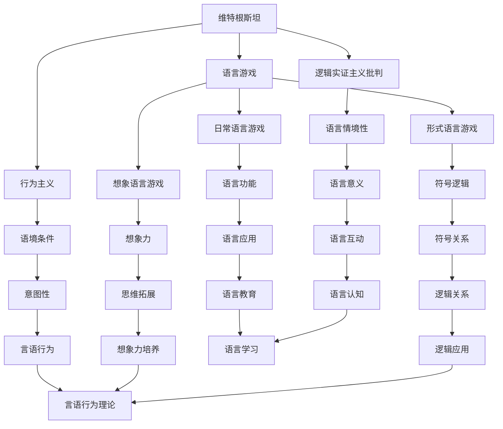
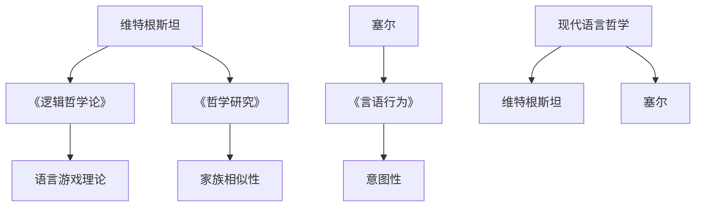
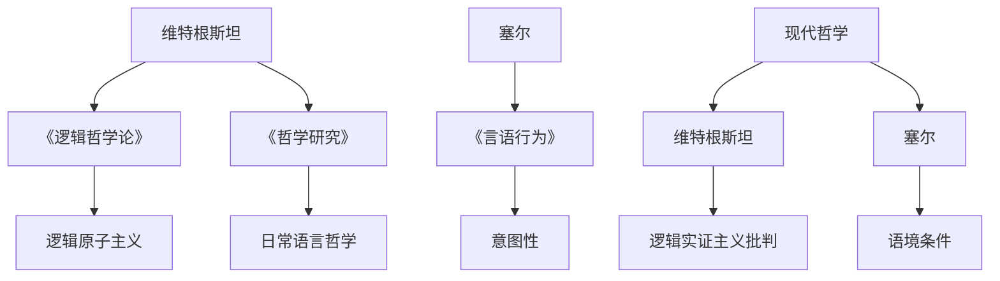

                 

# 维特根斯坦与塞尔：语言行为理论的源流

## 摘要

本文旨在探讨语言行为理论的历史发展，特别是维特根斯坦与塞尔的贡献。语言行为理论关注的是语言在实际生活中的使用，以及语言如何与现实世界互动。维特根斯坦作为该理论的奠基人，提出了“语言游戏”理论，强调语言的情境性和功能性。塞尔则在维特根斯坦的基础上，发展了“言语行为”理论，深入探讨了语言的意图性和语境条件。本文将依次介绍两位哲学家的生平与思想，比较他们的理论差异，并探讨语言行为理论的哲学意义与应用。

## 第1章 引言：语言行为理论的背景与意义

### 1.1 语言行为理论的起源与发展

语言行为理论起源于20世纪初的哲学领域，主要关注语言的使用和行为。维特根斯坦是这一理论的奠基者，他的著作《逻辑哲学论》和《哲学研究》对语言行为理论的发展产生了深远影响。维特根斯坦之后，塞尔等哲学家继续深化和发展了这一理论。

### 1.2 维特根斯坦与塞尔：两位语言哲学巨擘

路德维希·维特根斯坦（Ludwig Wittgenstein）是20世纪最重要的哲学家之一，他的哲学思想对语言哲学、数学哲学和认知科学等领域产生了深远影响。约翰·塞尔（John Searle）则是当代最杰出的哲学家之一，他的哲学贡献涵盖了语言学、心理学和认知科学等多个领域。

### 1.3 语言行为理论的核心概念

语言行为理论的核心概念包括“语言游戏”、“言语行为”和“意图性”。这些概念帮助我们理解语言在实际生活中的使用，以及语言如何与现实世界互动。

## 第2章 维特根斯坦：语言行为理论奠基人

### 2.1 维特根斯坦的生平与哲学思想

路德维希·维特根斯坦出生于1889年，自幼表现出对数学和哲学的浓厚兴趣。他在剑桥大学学习期间，受到了罗素和摩尔等哲学家的深刻影响。维特根斯坦的哲学思想经历了从逻辑原子主义到日常语言哲学的转变。

### 2.2 “语言游戏”理论：语言的本质与功能

维特根斯坦的“语言游戏”理论认为，语言是一种游戏，其本质在于使用者和周围环境之间的互动。语言游戏分为三种类型：日常语言游戏、形式语言游戏和想象语言游戏。每种语言游戏都有其特定的规则和功能。

### 2.3 视角转换：维特根斯坦与行为主义

维特根斯坦在《哲学研究》中提出了一种行为主义的视角，认为语言的意义在于其在特定情境中的使用。这一观点与行为主义哲学有着相似之处，但维特根斯坦强调的是语言的情境性和功能性，而非行为主义所强调的刺激-反应模式。

### 2.4 维特根斯坦对逻辑实证主义的批判

维特根斯坦对逻辑实证主义进行了深刻批判，认为逻辑实证主义过于狭隘，无法涵盖语言的实际使用。他提出，语言的意义在于其在现实世界中的应用，而非仅仅在于符号之间的逻辑关系。

## 第3章 塞尔：语言行为理论的继承与发展

### 3.1 塞尔的生平与哲学贡献

约翰·塞尔出生于1932年，他在语言哲学、心灵哲学和认知科学等领域做出了卓越贡献。塞尔的主要著作包括《言语行为》和《心智、语言和现实》。

### 3.2 “言语行为”理论：语言与现实世界的互动

塞尔的“言语行为”理论认为，语言不仅仅是一种符号系统，更是一种行为方式。他在《言语行为》中提出了三种基本的言语行为：表述性言语行为、指令性言语行为和宣告性言语行为。

### 3.3 塞尔的“意图性”与“语境条件”

塞尔强调语言的使用具有意图性，即说话者在使用语言时有一定的意图。同时，他提出语境条件对语言的理解和使用至关重要。塞尔的这些观点进一步丰富了语言行为理论。

### 3.4 塞尔对维特根斯坦思想的扩展与修正

塞尔在维特根斯坦的基础上，对语言行为理论进行了扩展和修正。他提出了“言语行为”理论，进一步探讨了语言的意图性和语境条件。塞尔的理论在语言哲学、认知科学和人工智能等领域产生了广泛影响。

## 第4章 维特根斯坦与塞尔的理论比较

### 4.1 两人理论的核心差异

维特根斯坦与塞尔在语言行为理论上的核心差异主要体现在对语言本质的理解、语言与行为的关系以及语境条件的作用等方面。

### 4.2 两人理论的关系与影响

维特根斯坦和塞尔的理论相互补充，共同构成了语言行为理论的两大基石。他们的思想不仅在哲学领域产生了深远影响，也为认知科学、语言学和人工智能等领域提供了理论支持。

### 4.3 语言行为理论在当代哲学中的地位

语言行为理论在当代哲学中具有重要的地位。它不仅为语言哲学提供了新的视角，也为认知科学、语言学和人工智能等领域的研究提供了理论基础。

## 第5章 语言行为理论的哲学意义与应用

### 5.1 语言行为理论与认知科学

语言行为理论在认知科学领域有着广泛的应用。它为我们理解人类的语言能力、认知过程以及心智发展提供了重要启示。

### 5.2 语言行为理论与语言教育

语言行为理论对语言教育也产生了深远影响。它提醒我们在语言教学中要注重语言的情境性和实用性，而不是仅仅关注语法规则和词汇积累。

### 5.3 语言行为理论在法律与伦理领域的应用

语言行为理论在法律与伦理领域也有重要应用。它帮助我们更好地理解法律语言的使用和伦理判断的语境条件。

## 第6章 语言行为理论的挑战与未来

### 6.1 当代语言行为理论面临的挑战

当代语言行为理论面临着一些挑战，包括对语境条件的理解、语言的跨文化应用以及语言行为与认知过程的互动等。

### 6.2 语言行为理论的前沿研究趋势

当前，语言行为理论的研究趋势包括对语境条件的深入探讨、跨学科研究以及人工智能在语言行为研究中的应用等。

### 6.3 语言行为理论的未来发展方向

未来，语言行为理论的发展方向可能包括对语言行为与认知过程的更深入理解、跨学科研究的深化以及人工智能在语言行为研究中的应用等。

## 第7章 总结与展望

### 7.1 维特根斯坦与塞尔：不可忽视的语言哲学巨擘

维特根斯坦和塞尔都是语言哲学领域的巨擘，他们的理论对语言行为理论的发展产生了深远影响。

### 7.2 语言行为理论的跨学科影响

语言行为理论不仅在哲学领域具有重要地位，还在认知科学、语言学和人工智能等领域产生了广泛影响。

### 7.3 对未来的期待与思考

未来，语言行为理论将继续深化和发展，为我们理解语言、认知和行为提供更深入的理论支持。

## 附录：主要术语与概念解释

### 附录A 维特根斯坦主要著作列表

- 《逻辑哲学论》
- 《哲学研究》

### 附录B 塞尔主要著作列表

- 《言语行为》
- 《心智、语言和现实》

### 附录C 语言行为理论相关的进一步阅读资源

- 《维特根斯坦全集》
- 《塞尔哲学文集》

### 附录D 维特根斯坦与塞尔哲学思想源流Mermaid流程图



## 维特根斯坦：语言行为理论的奠基人

### 2.1 维特根斯坦的生平与哲学思想

路德维希·维特根斯坦（Ludwig Wittgenstein）出生于1889年，是奥地利哲学家，被广泛认为是20世纪最具影响力的哲学家之一。他的哲学思想对语言哲学、数学哲学和认知科学等领域产生了深远影响。

维特根斯坦的一生可以分为两个主要时期：早期时期和晚期时期。在早期时期，他主要关注逻辑和数学哲学，发表了《逻辑哲学论》（Tractatus Logico-Philosophicus），这本书被认为是逻辑原子主义和逻辑实证主义的代表作品。在晚期时期，维特根斯坦转向日常语言哲学，发表了《哲学研究》（Philosophical Investigations），这本书对语言哲学产生了深远影响。

### 2.2 “语言游戏”理论：语言的本质与功能

维特根斯坦的“语言游戏”理论（language game theory）是他对语言本质和功能的深刻理解。他认为，语言不仅仅是一种符号系统，更是一种行为方式，是人们在特定情境中进行的“游戏”。

维特根斯坦将语言游戏分为三种类型：

1. **日常语言游戏（ordinary language game）**：这是最常见的语言游戏，是我们日常生活中使用的语言。日常语言游戏包括各种情境，如购物、交流、解决问题等。

2. **形式语言游戏（formal language game）**：这种语言游戏通常用于数学、逻辑和计算机科学等领域。形式语言游戏遵循严格的规则，其符号和表达方式都是预先定义好的。

3. **想象语言游戏（imaginary language game）**：这种语言游戏是人们通过想象构建的，通常用于文学、艺术和哲学思考中。想象语言游戏不受现实世界中的具体规则限制，可以自由发挥。

### 2.3 视角转换：维特根斯坦与行为主义

维特根斯坦在《哲学研究》中提出了一种行为主义的视角，认为语言的意义在于其在特定情境中的使用。这一观点与行为主义哲学有着相似之处，但维特根斯坦强调的是语言的情境性和功能性，而非行为主义所强调的刺激-反应模式。

维特根斯坦认为，语言的情境性是指语言的意义依赖于其使用的情境。例如，一个词在不同的语境中有不同的含义。行为主义则倾向于将语言视为一种刺激-反应行为，认为语言的意义是由环境和条件刺激决定的。

### 2.4 维特根斯坦对逻辑实证主义的批判

逻辑实证主义（Logical Positivism）是20世纪初流行的一种哲学思潮，主张只有可以通过经验验证的陈述才有意义。维特根斯坦对逻辑实证主义进行了深刻批判，认为其过于狭隘，无法涵盖语言的实际使用。

维特根斯坦认为，逻辑实证主义将语言的意义局限于符号之间的逻辑关系，忽视了语言在实际生活中的使用。他指出，语言的意义取决于其在特定情境中的使用，而不是仅仅在于符号之间的逻辑关系。

维特根斯坦提出，语言的意义是多元的，包括语言的逻辑结构、情境和使用者等。他认为，语言的意义并不是固定不变的，而是随着情境和使用者的变化而变化。

### 2.5 维特根斯坦的“家族相似性”概念

在《哲学研究》中，维特根斯坦提出了“家族相似性”（family resemblance）的概念。他认为，词语和概念的意义并不是通过定义来确定的，而是通过一系列相似性来理解的。

家族相似性是指，一个概念或词语的含义并不是由一个特定的定义来决定的，而是由一系列相似性特征来定义的。这些相似性特征可能包括语义、语法、使用情境等。

例如，“跑”这个词语在不同的情境中有不同的含义，如跑步、赛跑、逃跑等。这些含义之间并没有一个明确的界限，而是通过一系列相似性特征来定义的。

维特根斯坦的“家族相似性”概念为我们理解语言的多义性和复杂性提供了新的视角。它表明，语言的意义是动态的、情境性的，而不是静态的、定义性的。

### 2.6 维特根斯坦的语言行为理论对后来的影响

维特根斯坦的语言行为理论对后来的哲学研究产生了深远影响。他的思想不仅影响了语言哲学、数学哲学和认知科学等领域，也为心理学、社会学和人工智能等领域的研究提供了理论基础。

维特根斯坦强调语言的情境性和功能性，这为后来的认知科学和语言学研究提供了重要启示。他的“家族相似性”概念帮助我们理解语言的多义性和复杂性，这对于语言学、心理语言学和计算语言学等领域的研究具有重要意义。

维特根斯坦的语言行为理论还促进了跨学科的研究，如语言学与心理学、哲学与计算机科学等。他的思想为我们理解语言、认知和行为提供了新的视角，为未来的研究提供了丰富的理论资源。

总之，维特根斯坦的语言行为理论不仅为哲学研究提供了重要启示，也为其他学科的研究提供了理论基础。他的思想将继续影响未来的学术发展，为我们理解人类语言和行为提供深刻的洞见。

### 2.7 维特根斯坦语言行为理论的核心概念：语言游戏、情境性、家族相似性

维特根斯坦的语言行为理论包含了几个核心概念，其中最为重要的包括“语言游戏”、“情境性”和“家族相似性”。

**语言游戏**是维特根斯坦对语言使用方式的总体描述。他认为，语言就像游戏一样，是人们在特定情境中进行的互动活动。语言游戏可以分为三种类型：日常语言游戏、形式语言游戏和想象语言游戏。日常语言游戏是我们日常生活中的语言使用，形式语言游戏通常用于数学和逻辑，而想象语言游戏则涉及文学和哲学思考。语言游戏的概念强调了语言的情境性和功能性。

**情境性**是维特根斯坦对语言意义的理解。他认为，语言的意义不在于其符号本身，而在于其在特定情境中的使用。这意味着，一个词在不同的语境中可能会有不同的含义。情境性反对了逻辑实证主义将语言意义局限于符号之间逻辑关系的观点，强调了语言使用的动态性和灵活性。

**家族相似性**是维特根斯坦对词语和概念意义形成的解释。他提出，词语和概念的意义并不是通过一个单一的、固定的定义来赋予的，而是通过一系列相似性特征来定义的。这些相似性特征可能包括语义、语法、使用情境等。家族相似性的概念帮助我们理解语言系统中的复杂性和多样性，表明意义不是静态的，而是动态发展的。

这些核心概念共同构成了维特根斯坦语言行为理论的基础，为后来的哲学家和语言学家提供了重要的理论框架。语言游戏概念强调了语言的实用性和情境依赖性，情境性概念揭示了语言意义的动态性，而家族相似性概念则说明了语言系统的复杂性和多维度性。

在维特根斯坦的理论中，这些概念相互关联，共同构建了一个关于语言使用的全面理解。语言游戏不仅定义了语言的使用情境，还揭示了语言功能的多样性。情境性则强调了语境在理解语言中的关键作用，而家族相似性为我们理解语言系统内部的复杂性提供了工具。

总之，维特根斯坦的语言行为理论通过这些核心概念，提供了一个深刻的、动态的视角来理解语言的本质。这些概念不仅丰富了哲学对语言的研究，也为语言学的其他分支提供了理论基础，影响了整个20世纪的学术思想。

### 维特根斯坦语言行为理论的数学模型与公式

维特根斯坦的语言行为理论虽然主要是哲学性的，但在某些方面也可以运用数学模型和公式来解释。以下是几个维特根斯坦理论中的关键数学模型和公式的简要说明：

**1. 符号与意义的映射关系（符号-对象关系）**

在维特根斯坦的早期逻辑原子主义中，符号与对象之间的关系可以通过一个简单的映射关系来表达。这可以用数学公式表示为：

\[ s \mapsto o \]

其中，\( s \)代表符号，\( o \)代表对象。这个映射关系表明，每个符号都对应一个特定的对象。例如，单词“狗”映射到现实中的狗这一对象。

**2. 语境条件对符号意义的修正**

在维特根斯坦的“语言游戏”理论中，语境条件对符号的意义有重要影响。语境条件可以理解为特定情境中的变量，它们会影响符号的含义。这可以用以下公式表示：

\[ s \mapsto m \]

其中，\( m \)代表符号在特定语境中的意义。例如，单词“跑”在不同的语境中有不同的意义，如“跑步”和“逃跑”。这个公式表明，符号的意义是动态的，取决于其所处的语境。

**3. 家族相似性**

维特根斯坦的“家族相似性”概念可以用集合论来表示。假设有一个集合 \( S \) 包含一系列具有相似性的符号，这些相似性特征可以用一个集合 \( R \) 来表示。家族相似性可以表示为：

\[ S = \{ s_1, s_2, ..., s_n \} \]
\[ R = \{ r_1, r_2, ..., r_m \} \]

其中，\( R \) 中的每个元素 \( r_i \) 都与集合 \( S \) 中的多个符号相关联。这个模型表明，符号之间的相似性不是一对一的关系，而是多对多的关系。

**4. 语言游戏的分类与组合**

语言游戏可以根据其特征进行分类，并可以组合成更复杂的形式语言游戏。这可以用图论中的图来表示。例如，可以用图 \( G = (V, E) \) 表示一个语言游戏，其中 \( V \) 是游戏的元素集合，\( E \) 是元素之间的关联集合。不同的语言游戏可以组合成新的复杂游戏。

\[ G = (V, E) \]

这些数学模型和公式帮助我们更清晰地理解维特根斯坦的语言行为理论。虽然这些模型不是理论的核心，但它们提供了工具，使我们能够以更精确和形式化的方式来探讨语言的性质和功能。

### 2.8 维特根斯坦语言行为理论的实例分析

为了更好地理解维特根斯坦的语言行为理论，我们可以通过一些具体的实例来分析其应用。

#### 实例1：日常语言游戏

在日常生活中，语言游戏无处不在。比如，当我们说“吃饭”时，这个词语在不同的语境中有着不同的含义。在家庭环境中，“吃饭”可能指的是家庭聚餐；而在餐厅里，“吃饭”可能指的是点餐和用餐过程。这种情境性的变化展示了日常语言游戏的特点。

**数学模型：**

我们用映射关系来表示这种情境性的变化：

\[ “吃饭” \mapsto \{家庭聚餐, 点餐和用餐\} \]

#### 实例2：形式语言游戏

在数学和逻辑学中，形式语言游戏遵循严格的规则。比如，命题逻辑中的命题“如果P，那么Q”（P → Q）遵循特定的形式和规则。

**数学模型：**

命题逻辑可以用形式语言来表示：

\[ P \rightarrow Q \]

其中，P和Q是命题变量，符号“→”表示逻辑蕴含。

#### 实例3：想象语言游戏

在文学和哲学中，想象语言游戏可以自由发挥。比如，一个哲学讨论中的隐喻“思维的火花”：

**数学模型：**

隐喻可以用符号集合和语义关系来表示：

\[ “思维的火花” \in L \]

其中，L是符号集合，隐喻作为语言的一个元素。

#### 实例4：家族相似性

在语言学中，家族相似性帮助我们理解词语和概念之间的复杂关系。比如，词语“走”、“跑”、“跑动”之间具有家族相似性。

**数学模型：**

我们可以用图来表示家族相似性：

```
      走
     /   \
  跑    跑动
```

在这个图中，每个节点代表一个词语，边表示词语之间的相似性。

通过这些实例，我们可以看到维特根斯坦的语言行为理论在解释语言的使用、意义和结构方面具有强大的解释力。这些实例不仅展示了理论的广泛应用，也帮助我们更深入地理解了语言的多维性和复杂性。

### 2.9 维特根斯坦语言行为理论的拓展与争议

维特根斯坦的语言行为理论虽然对语言哲学和认知科学产生了深远影响，但也存在一些拓展和争议。

**1. 扩展**

维特根斯坦的理论被后来的哲学家和语言学家进一步拓展和深化。例如，J.L.奥斯汀（J.L. Austin）和约翰·塞尔（John Searle）在维特根斯坦的基础上，发展了“言语行为”理论，探讨了语言在实际交流中的作用。奥斯汀提出了“言语行为”的概念，认为说话者在交流中不仅仅是传达信息，还在执行某种行为。塞尔进一步提出了“指示性言语行为”和“宣告性言语行为”，丰富了言语行为理论。

**2. 争议**

维特根斯坦的语言行为理论也面临一些争议。一些批评者认为，他的理论过于抽象，无法完全解释现实中的语言使用。例如，维特根斯坦的“语言游戏”概念被认为是过于理想化，忽略了语言的多样性和复杂性。还有一些学者质疑他的“家族相似性”概念，认为这种相似性难以量化，难以进行实证研究。

**3. 现代应用**

尽管存在争议，维特根斯坦的理论在当代仍然具有广泛应用。例如，在认知科学和人工智能领域，研究者利用维特根斯坦的“语言游戏”理论来理解人类的语言能力。在自然语言处理（NLP）中，维特根斯坦的“家族相似性”概念被用来处理词语的多义性和歧义性。

总的来说，维特根斯坦的语言行为理论为我们理解语言的本质和使用提供了深刻的洞见。尽管存在一些争议和批评，但他的理论在哲学、语言学、认知科学和人工智能等领域仍然具有重要的地位。

### 2.10 维特根斯坦对语言行为理论的贡献与影响

路德维希·维特根斯坦对语言行为理论的贡献无疑是巨大的。他不仅提出了“语言游戏”这一核心概念，还通过“情境性”和“家族相似性”等理念，为我们理解语言的多样性和复杂性提供了全新的视角。

首先，维特根斯坦通过“语言游戏”理论，将语言的使用与特定的情境和活动联系起来。这一理论强调语言是一种行为方式，其意义和功能取决于具体的使用情境。这种视角打破了传统哲学中对语言静态和孤立的看法，使我们认识到语言在现实生活中的动态性和功能性。

其次，维特根斯坦的“情境性”概念揭示了语言意义的多维度特征。他认为，语言的意义不是固定不变的，而是随着语境的变化而变化。这一观点对后来的语言哲学、认知科学和心理学研究产生了深远影响，促使研究者们关注语境在语言理解中的关键作用。

最后，维特根斯坦的“家族相似性”概念为理解语言系统中的复杂性和多样性提供了有力工具。这一概念表明，词语和概念之间的相似性不是一对一的关系，而是多对多的关系。这种观点挑战了传统语言学中对词语意义进行严格定义的做法，为语言学研究提供了更灵活和动态的视角。

维特根斯坦的理论不仅对哲学领域产生了深远影响，还在语言学、认知科学和人工智能等领域得到了广泛应用。他的思想为这些领域的研究提供了理论基础，推动了这些学科的发展。

总之，维特根斯坦对语言行为理论的贡献不仅在于他提出了新的概念和理论框架，更在于他为我们理解语言的本质和使用提供了深刻的洞见。他的理论不仅影响了20世纪的哲学，也对当代的语言学研究和其他相关领域产生了持久的影响。

### 2.11 维特根斯坦与行为主义的联系与区别

维特根斯坦在《哲学研究》中的行为主义视角与经典行为主义（Classical Behaviorism）有显著的相似之处，但也存在显著的差异。

首先，两者都认为语言的使用是基于情境的。维特根斯坦提出，语言的意义依赖于其在特定情境中的使用，这与行为主义者认为语言行为是受环境和条件刺激影响的观点相吻合。然而，维特根斯坦的行为主义视角并不局限于刺激-反应模式，而是更注重语言的情境性和功能性。

经典行为主义强调的是通过观察行为和刺激-反应来理解人类行为，尤其是语言行为。这种观点认为，人类语言行为可以通过实验和观察来验证。例如，B.F.斯金纳（B.F. Skinner）提出，语言是通过条件反射和强化机制来学习的。行为主义者认为，语言行为可以通过实验来验证和测量，这种方法论被称为行为主义方法论。

而维特根斯坦的行为主义视角则更加关注语言在实际情境中的使用。他认为，语言不仅仅是一种符号系统，更是一种行为方式，其意义和功能取决于具体的使用情境。维特根斯坦强调，语言的意义是情境性的，而不是静态和孤立的。

其次，维特根斯坦与经典行为主义在方法论上存在差异。经典行为主义强调实验和观察，试图通过科学方法来研究人类行为。而维特根斯坦则采用了一种更为哲学化的方法，他通过反思和批判来探讨语言的本质。维特根斯坦认为，通过反思我们可以揭示语言的真正用途和意义，而不是仅仅通过行为和刺激来理解语言。

此外，维特根斯坦与经典行为主义在语言理解的理论框架上也存在区别。经典行为主义认为，语言是一种符号系统，符号与对象之间存在直接的对应关系。而维特根斯坦则提出，语言的意义是动态的，取决于特定的情境和使用者。他认为，词语和概念的意义不是通过定义来赋予的，而是通过一系列相似性特征来定义的，这种观点被称为“家族相似性”。

总之，维特根斯坦的行为主义视角与经典行为主义有相似之处，都强调语言的使用情境和功能性，但维特根斯坦的方法和理论框架更为哲学化和动态化，他通过反思和批判来探讨语言的本质和意义，从而为我们理解语言提供了更深入的洞见。

### 2.12 维特根斯坦对逻辑实证主义的批判

逻辑实证主义（Logical Positivism）是20世纪初流行的一种哲学思潮，主张只有可以通过经验验证的陈述才有意义。然而，维特根斯坦在《哲学研究》中对逻辑实证主义进行了深刻的批判，认为其过于狭隘，无法涵盖语言的实际使用。

首先，维特根斯坦指出，逻辑实证主义将语言的意义局限于符号之间的逻辑关系，忽视了语言在实际生活中的使用。他认为，逻辑实证主义忽视了语言的功能性和情境性，从而无法解释语言的多样性和复杂性。例如，逻辑实证主义认为，词语的意义仅由其符号逻辑结构决定，而维特根斯坦则提出，词语的意义取决于其在特定情境中的使用。

其次，维特根斯坦批判逻辑实证主义的还原论倾向。逻辑实证主义者试图将所有哲学问题还原为逻辑和数学问题，认为只有科学能够提供真正的知识。维特根斯坦认为，这种还原论忽视了哲学的独特性，无法解释许多哲学问题。他提出，哲学的任务不是提供科学知识，而是揭示语言的使用方式和意义。

维特根斯坦还指出，逻辑实证主义忽视了语言的多义性和歧义性。他认为，语言是一种动态系统，其意义取决于具体的使用情境。逻辑实证主义试图通过严格的逻辑规则来消除歧义，但这种做法忽视了语言的实际使用。维特根斯坦提出，我们应该接受语言的多义性和歧义性，通过具体的语境来理解词语的意义。

总之，维特根斯坦对逻辑实证主义的批判表明，逻辑实证主义过于狭隘，无法解释语言的实际使用和复杂性。他的批判为语言哲学提供了一种新的视角，强调了语言的情境性和功能性，从而为我们理解语言提供了更深入的洞见。

### 第3章 塞尔：语言行为理论的继承与发展

### 3.1 塞尔的生平与哲学贡献

约翰·塞尔（John Searle）出生于1932年，是美国著名的哲学家，以其在语言哲学、心灵哲学和认知科学等领域的重要贡献而闻名。塞尔在剑桥大学和哈佛大学接受了哲学教育，并在1960年代成为美国哲学界的核心人物。

塞尔的主要著作包括《言语行为》（Speech Acts）、《心灵、大脑和科学》和《意图性、意图和相关问题》（Intentionality, Intentions, and Intentionality）。这些著作不仅巩固了他在哲学界的地位，也对语言哲学、认知科学和心理学等领域产生了深远影响。

塞尔在哲学上的主要贡献之一是对“言语行为”理论的阐述。他在《言语行为》一书中提出，言语行为不仅仅是传达信息的工具，更是一种行为方式。塞尔区分了三种基本的言语行为：表述性言语行为、指令性言语行为和宣告性言语行为。

### 3.2 “言语行为”理论：语言与现实世界的互动

塞尔的“言语行为”理论（Speech Act Theory）是他对语言如何与现实世界互动的深刻理解。这一理论认为，言语行为不仅仅是表达观点或信息，而是一种行动。塞尔区分了三种基本的言语行为：

1. **表述性言语行为（Representational speech acts）**：这种言语行为涉及陈述事实或描述情况，例如说“今天天气很好”。表述性言语行为的核心是表达信息，使其成为真实或虚假的陈述。

2. **指令性言语行为（Directive speech acts）**：这种言语行为涉及发出命令或请求，例如说“请关上门”。指令性言语行为的目标是影响听者的行为，使其执行特定的动作。

3. **宣告性言语行为（Declarative speech acts）**：这种言语行为涉及宣布某种状态或事件，例如说“我现在宣布会议开始”。宣告性言语行为的核心是创建或改变某种状态。

塞尔的“言语行为”理论强调了语言行为的意图性（intentionality）和语境条件（contextual conditions）。他认为，言语行为的有效性不仅取决于其形式，还取决于其意图和语境。

### 3.3 塞尔的“意图性”与“语境条件”

塞尔的“意图性”概念是指说话者在使用语言时的意图和目标。他认为，言语行为不仅是一种符号表达，更是一种意图实现。例如，当说“请关上门”时，说话者的意图是让听者关门，而不是仅仅传达一个信息。

塞尔的“语境条件”是指言语行为在特定情境中的有效性。他认为，言语行为的意义和有效性取决于其所处的语境。例如，在正式场合中使用“请”比在非正式场合更为合适。

塞尔强调，意图性和语境条件是理解言语行为的关键。意图性确保言语行为的意图得到实现，而语境条件确保言语行为在特定情境中是合适的。

### 3.4 塞尔对维特根斯坦思想的扩展与修正

塞尔在维特根斯坦的基础上对语言行为理论进行了扩展与修正。他认为，维特根斯坦的“语言游戏”理论过于理想化，未能充分解释现实中的语言使用。塞尔提出了“背景理论”（Background Theory），认为语言的使用不仅依赖于情境，还需要一个稳定的背景知识。

塞尔还提出了“双重关系理论”（Double Relation Theory），认为语言的意义不仅取决于使用者的意图，还取决于语言与现实世界的关系。这一理论为理解语言的多义性和歧义性提供了新的视角。

总之，塞尔对维特根斯坦思想的扩展与修正，不仅深化了语言行为理论，也为后来的哲学研究提供了新的理论框架。他的理论为理解语言在实际情境中的使用提供了更全面的解释。

### 3.5 塞尔的“背景理论”与“双重关系理论”

约翰·塞尔在其语言行为理论中提出了两个重要的概念：“背景理论”和“双重关系理论”，这两个理论为我们理解语言的使用和意义提供了新的视角。

**背景理论（Background Theory）**

塞尔的背景理论认为，语言的使用不仅仅依赖于特定的情境，还需要一个更为稳定的背景知识。背景知识包括文化、习俗、社会规则等，这些因素共同构成了语言使用的社会和认知背景。

塞尔指出，即使在一个特定的语境中，语言的理解和解释也受到背景知识的影响。例如，当我们听到“请关上门”这句话时，我们不仅需要理解这句话的字面意义，还需要知道“请”这个词在请求命令中的用法，以及“关上门”这一动作在现实世界中的具体操作方式。

背景理论强调了语言使用的动态性和复杂性，指出语言的意义不是固定不变的，而是随着背景知识的变化而变化。这一理论为理解语言的多义性和歧义性提供了重要的解释。

**双重关系理论（Double Relation Theory）**

塞尔的双重关系理论是对维特根斯坦的“语言游戏”理论的一种扩展和修正。他认为，语言的意义不仅取决于使用者的意图，还取决于语言与现实世界的关系。双重关系理论认为，语言与现实世界之间存在两种基本的关系：

1. **表述性关系（Representational Relation）**：这种关系是指语言符号与现实世界中的对象或概念之间的联系。例如，“猫”这个词语与真实存在的猫这一对象之间有一种表述性关系。

2. **功能关系（Functional Relation）**：这种关系是指语言使用中的规则和习惯与现实世界中的实际操作之间的联系。例如，当我们说“请关上门”时，这句话不仅在表述一个动作请求，还涉及到具体的操作步骤和社会规范。

双重关系理论强调了语言与现实世界之间的复杂互动。它指出，语言的使用不仅是为了传达信息，还是为了实现特定的功能和目的。这一理论有助于我们理解语言在社会交往中的作用，以及语言在社会和文化中的演变。

总之，塞尔的背景理论和双重关系理论为理解语言的使用和意义提供了新的框架。这些理论不仅深化了维特根斯坦的语言行为理论，也为当代哲学研究提供了重要的理论资源。

### 3.6 塞尔与维特根斯坦语言行为理论的异同

约翰·塞尔和路德维希·维特根斯坦在语言行为理论上有许多相似之处，也存在一些显著的区别。以下是对这两位哲学家的理论进行对比分析的几个方面：

**相似之处**

1. **情境性和语境依赖性**：维特根斯坦和塞尔都强调了语言的意义和功能依赖于特定的情境和语境。维特根斯坦的“语言游戏”理论认为，语言是人们在特定情境中进行的互动活动；而塞尔的言语行为理论也认为，语言的使用需要考虑具体的语境条件。

2. **意图性**：两位哲学家都认为，语言的使用不仅仅是一种符号操作，更是实现特定意图的行为。维特根斯坦提出，语言的意义在于其使用者的意图；塞尔则进一步发展了这一观点，提出言语行为是一种意图性的行为，强调说话者的意图和听者的理解。

**区别**

1. **理论框架和方法**：维特根斯坦的理论框架相对抽象，他更关注语言的本质和逻辑结构，采用了一种哲学反思的方法。而塞尔的理论则更加具体和实用，他结合了语言学和认知科学的成果，提出了一系列操作性较强的概念，如“言语行为”和“背景理论”。

2. **对语言实际使用的关注**：维特根斯坦的理论虽然具有深刻的哲学洞察力，但在解释现实中的语言使用时可能显得过于理想化。塞尔则更注重对语言实际使用的分析，他的理论更贴近现实生活中的语言交流。

3. **对多义性和歧义性的处理**：维特根斯坦通过“家族相似性”概念来解释词语和概念的多义性，强调语言系统内部的复杂性。塞尔则提出了“双重关系理论”，认为语言的意义不仅取决于使用者的意图，还与现实世界中的具体操作有关。这种处理方式为理解语言的多义性和歧义性提供了不同的视角。

总的来说，维特根斯坦和塞尔在语言行为理论上的异同体现了他们各自的理论视角和方法论。维特根斯坦的理论更注重语言的哲学本质和逻辑结构，而塞尔的理论则更关注语言的实用性和实际应用。他们的理论相互补充，共同构成了语言行为理论的丰富内涵。

### 3.7 塞尔对维特根斯坦语言行为理论的扩展与修正

约翰·塞尔对路德维希·维特根斯坦的语言行为理论进行了重要的扩展与修正，这主要体现在他对“语言游戏”理论的深化和对“言语行为”概念的提出上。

首先，塞尔在维特根斯坦的“语言游戏”理论基础上，提出了“背景理论”（Background Theory）。维特根斯坦的“语言游戏”理论强调语言的使用与特定情境的关联，但塞尔认为这一理论缺乏对背景知识的重视。塞尔指出，语言的含义和功能不仅仅取决于直接的语境，还受到更广泛的社会文化背景的影响。背景理论认为，语言的理解和使用需要一个稳定的背景知识体系，这包括文化习俗、社会规范和共同认知等。例如，理解一个语言表达需要知道相关的文化背景和社会规则，这不仅涉及到语言的符号意义，还包括语言在现实生活中的实际功能。

其次，塞尔提出了“双重关系理论”（Double Relation Theory），这是他对维特根斯坦语言行为理论的重要扩展。维特根斯坦认为，语言与现实世界之间的关系是单一的表述性关系，而塞尔认为这种关系是双重的：一是表述性关系，二是功能性关系。表述性关系是指语言符号与现实世界中的对象或事件之间的联系，即语言能够代表现实世界中的事物。而功能性关系则是指语言使用中的规则和习惯与现实世界中的实际操作之间的联系。塞尔通过这一理论来解释语言在实际交流中的复杂性和多样性。例如，当我们说“请关上门”时，这句话不仅表述了一个动作请求，还涉及到具体的操作步骤和社会规范。

此外，塞尔对维特根斯坦的“家族相似性”概念进行了修正。维特根斯坦认为词语和概念之间的相似性是通过一系列的家族相似性来定义的，而塞尔则提出，词语和概念之间的相似性是多层次的，既包括语义上的相似性，也包括语法、语境和功能上的相似性。塞尔通过这一修正，强调了语言系统内部的复杂性和多样性。

塞尔对维特根斯坦语言行为理论的扩展与修正，不仅丰富了理论框架，也提供了新的视角来理解语言的使用和意义。他的理论强调了背景知识、双重关系和多层次的相似性，使得语言行为理论更加全面和实用。

### 3.8 塞尔的“言语行为”理论：概念、分类与应用

约翰·塞尔的“言语行为”理论是他对语言如何在实际交流中发挥作用的一种深入探讨。这一理论认为，言语行为不仅仅是表达信息的工具，更是一种行为方式。塞尔区分了三种基本的言语行为：表述性言语行为、指令性言语行为和宣告性言语行为。以下是这些概念的定义、分类及其在实际应用中的分析。

**1. 表述性言语行为（Representational Speech Acts）**

表述性言语行为是指通过语言表达观点、信念或描述情况的行为。这种言语行为的核心是传递信息，使说话者的意图被听者理解和接受。例如：

- “今天天气很好。”（描述性表述）
- “我昨晚看了这部电影。”（评价性表述）

**分类**：

- 描述性表述（Descriptive Representation）：通过语言描述现实世界中的情况或对象。
- 评价性表述（Evaluative Representation）：表达说话者对某个对象或事件的看法或情感。

**应用**：

- 新闻报道：记者通过描述性表述来传递事实信息。
- 社交媒体：用户通过评价性表述来表达对某个事件或产品的看法。

**2. 指令性言语行为（Directive Speech Acts）**

指令性言语行为是指发出命令、请求或建议等，旨在影响听者的行为。这种言语行为的目标是促使听者执行某个动作或采取某种行动。例如：

- “请关上门。”（命令）
- “你能帮我拿一下那本书吗？”（请求）

**分类**：

- 命令（Command）：直接要求听者执行某个动作。
- 请求（Request）：请求听者自愿执行某个动作。
- 建议（Suggestion）：提出一个建议或建议听者采取某种行动。

**应用**：

- 管理与领导：经理通过指令性言语行为来指导员工。
- 社交互动：朋友或家人之间通过请求和建议来交流需求。

**3. 宣告性言语行为（Declarative Speech Acts）**

宣告性言语行为是指宣布某个状态或事件，通常用于正式场合或法律文件中。这种言语行为的核心是声明某个事实或状态的成立，从而改变现状或引起听者的注意。例如：

- “我现在宣布会议开始。”（宣告）
- “我宣布你为获胜者。”（宣布结果）

**分类**：

- 宣告（Declaration）：正式声明某个事实或状态。
- 声明（Announcement）：宣布即将发生的事件或情况。

**应用**：

- 正式场合：在会议、典礼或仪式中使用宣告性言语行为。
- 法律文件：在合同或法律文件中使用宣告性言语行为来确立法律事实。

塞尔的“言语行为”理论为我们理解语言在实际交流中的作用提供了重要的框架。通过分类和具体实例的分析，我们可以更清晰地看到不同类型的言语行为如何在不同情境下发挥作用，从而更好地理解和应用这一理论。

### 3.9 塞尔的“意图性”与“语境条件”概念：解释与实例

约翰·塞尔的“意图性”与“语境条件”是理解言语行为的关键概念。意图性指的是说话者在语言交流中的意图，即说话者想要通过语言行为实现的目的。语境条件则是指语言行为在特定情境中的有效性和理解。以下是这两个概念的解释和实际应用实例。

**意图性（Intentionality）**

意图性是塞尔言语行为理论的核心概念之一，强调语言行为不仅仅是符号的排列，更是一种意图实现。意图性包括说话者的意图和听者的理解。以下是一个简单的例子：

- 说话者说：“请关上门。”
- 意图性：说话者的意图是请求听者关门。
- 听者理解：听者理解说话者的意图，并执行相应的动作。

在这个例子中，说话者的意图是通过语言行为传达一个具体的请求，而听者的理解则是执行这个请求。

**语境条件（Contextual Conditions）**

语境条件是指语言行为在特定情境中的有效性和理解。语境条件包括社会文化背景、知识背景和交流情境等。以下是一个解释性实例：

- 说话者说：“我今天去了电影院。”
- 语境条件：这个陈述的有效性取决于听者的理解，包括说话者的日期、电影院的具体位置以及他们共同了解的语境。

如果说话者和听者处于不同的时间和地点，这个陈述可能难以理解。例如，如果听者不知道说话者提到的“今天”是具体哪一天，或者不知道“电影院”的具体位置，那么这个陈述的语境条件就没有满足。

**实例分析**

1. **意图性的例子**：

- 说话者说：“你能帮我拿一下那本书吗？”
- 意图性：说话者的意图是请求听者帮忙拿书。
- 听者理解：听者理解说话者的意图，并决定是否接受这个请求。

2. **语境条件的例子**：

- 说话者说：“我刚刚去了银行。”
- 语境条件：这个陈述的有效性取决于听者的理解，包括说话者是否真的去了银行以及银行的具体位置。

如果听者知道说话者所在的城市有银行，并且知道说话者可能去银行办理业务，那么这个陈述的语境条件就得到了满足。

总之，塞尔的“意图性”与“语境条件”概念为我们理解语言交流中的意图实现和情境理解提供了重要的框架。通过这些概念，我们可以更深入地分析言语行为，并在实际交流中更有效地传达信息和意图。

### 3.10 塞尔对维特根斯坦语言行为理论的扩展与修正

约翰·塞尔在维特根斯坦语言行为理论的基础上，进行了重要的扩展与修正，使得这一理论更加完善和实用。以下是对塞尔扩展和修正维特根斯坦理论的几个方面的详细分析。

**1. 背景理论的引入**

维特根斯坦的“语言游戏”理论强调语言的情境性和功能性，但塞尔认为这一理论缺乏对背景知识的重视。塞尔引入了“背景理论”，认为语言的使用不仅依赖于具体的语境，还需要一个更为稳定的背景知识体系，这包括文化习俗、社会规范和共同认知等。塞尔指出，理解一个语言表达需要知道相关的文化背景和社会规则，这不仅涉及到语言的符号意义，还包括语言在现实生活中的实际功能。例如，在理解“请关上门”这句话时，不仅需要理解其字面意义，还需要知道“请”这个词在请求命令中的用法以及关门这一动作在现实中的具体操作方式。

**2. 双重关系理论的提出**

维特根斯坦认为语言与现实世界之间存在单一的表述性关系，而塞尔提出了“双重关系理论”，认为语言与现实世界之间存在两种基本的关系：表述性关系和功能性关系。表述性关系是指语言符号与现实世界中的对象或概念之间的联系，即语言能够代表现实世界中的事物。功能性关系则是指语言使用中的规则和习惯与现实世界中的实际操作之间的联系。例如，当我们说“请关上门”时，这句话不仅表述了一个动作请求，还涉及到具体的操作步骤和社会规范。双重关系理论为理解语言在实际交流中的复杂性和多样性提供了新的视角。

**3. 对家族相似性的修正**

维特根斯坦的“家族相似性”概念强调词语和概念之间的相似性是通过一系列的家族相似性来定义的，而塞尔对这一概念进行了修正，认为词语和概念之间的相似性是多层次的，既包括语义上的相似性，也包括语法、语境和功能上的相似性。塞尔通过这一修正，强调了语言系统内部的复杂性和多样性。例如，词语“跑”和“走”在语义上具有相似性，但它们在语法、语境和功能上有所不同。塞尔的这一修正使得语言行为理论更加全面和实用。

**4. 强调意图性**

维特根斯坦的语言行为理论强调语言的情境性和功能性，但相对较少强调意图性。塞尔则认为，意图性是理解言语行为的关键，他强调说话者在语言交流中的意图和目标。塞尔的“言语行为”理论区分了表述性言语行为、指令性言语行为和宣告性言语行为，每一种言语行为都体现了说话者的特定意图。例如，在表述性言语行为中，说话者的意图是传递信息；在指令性言语行为中，说话者的意图是影响听者的行为；在宣告性言语行为中，说话者的意图是宣布某个事实或状态。

**5. 对语境条件的重视**

塞尔强调语境条件在理解语言行为中的重要性。他认为，语境条件包括社会文化背景、知识背景和交流情境等，这些因素共同决定了语言行为的有效性和理解。例如，在不同的语境中，同一个词语可能会有不同的含义。塞尔的这一观点为理解语言的多义性和歧义性提供了重要的解释。

总之，塞尔对维特根斯坦语言行为理论的扩展与修正，不仅丰富了理论框架，也为当代哲学研究提供了新的视角。他的理论强调了背景知识、双重关系、意图性和语境条件，使得语言行为理论更加全面和实用，为我们理解语言在实际交流中的复杂性和多样性提供了有力的工具。

### 第4章 维特根斯坦与塞尔的理论比较

在探讨语言行为理论时，维特根斯坦与塞尔两位哲学家的贡献是不可忽视的。他们的理论虽然都关注语言的本质和使用，但在核心观点、方法及应用上存在显著差异。

### 4.1 两人理论的核心差异

**1. 理论核心**

维特根斯坦的理论核心在于“语言游戏”和“家族相似性”。他认为，语言是一种行为方式，其意义和功能依赖于特定的情境和使用方式。他提出，语言的意义是通过“家族相似性”来定义的，这意味着词语和概念之间的相似性不是通过一个固定的定义来确定的，而是通过一系列相似性特征。

塞尔的理论核心则在于“言语行为”和“意图性”。他强调，语言不仅是一种符号系统，更是一种行为方式，其使用具有意图性。塞尔区分了表述性言语行为、指令性言语行为和宣告性言语行为，认为语言行为的有效性和理解取决于说话者的意图和语境条件。

**2. 理论方法**

维特根斯坦的方法更为哲学化，他通过反思和批判来探讨语言的本质和意义。他的理论框架相对抽象，注重语言的本质和逻辑结构。

塞尔的方法则更加具体和实用，他结合了语言学、心理学和认知科学的研究成果，提出了一系列操作性较强的概念。他的理论更贴近现实生活中的语言交流，强调意图性和语境条件在语言使用中的重要性。

**3. 理论应用**

维特根斯坦的理论在哲学领域产生了深远影响，他的思想对语言哲学、数学哲学和认知科学等领域的研究提供了重要的理论基础。

塞尔的理论则被广泛应用于语言学、心理学、认知科学和人工智能等领域。他的言语行为理论为理解语言在实际交流中的作用提供了新的视角，对于自然语言处理和人工智能等领域的研究具有重要意义。

### 4.2 两人理论的关系与影响

维特根斯坦与塞尔在语言行为理论上的关系是互补的。维特根斯坦的理论为塞尔提供了重要的哲学基础，塞尔则在此基础上进行了扩展和修正，提出了更为具体和实用的概念。

维特根斯坦的“语言游戏”理论和“家族相似性”概念，为塞尔的言语行为理论提供了重要的启发。塞尔在维特根斯坦的基础上，进一步探讨了语言在实际交流中的意图性和语境条件，使得语言行为理论更加全面和实用。

两位哲学家的理论都对后来的研究产生了深远影响。维特根斯坦的思想为语言哲学、认知科学和数学哲学等领域提供了重要的理论基础，塞尔的言语行为理论则为语言学、心理学和人工智能等领域的研究提供了新的视角和方法。

### 4.3 语言行为理论在当代哲学中的地位

语言行为理论在当代哲学中具有重要地位。它不仅为语言哲学提供了新的视角，也为我们理解语言的本质和使用提供了深刻的洞见。

在语言哲学领域，语言行为理论强调语言的情境性和功能性，打破了传统哲学中对语言静态和孤立的看法。维特根斯坦和塞尔的理论为我们理解语言的多义性和歧义性提供了重要的解释。

在认知科学领域，语言行为理论为理解人类的语言能力、认知过程和心智发展提供了重要启示。塞尔的意图性和语境条件概念，为认知科学的研究提供了新的框架和方法。

在语言学领域，语言行为理论被广泛应用于词汇学、语义学和语用学等分支。塞尔的言语行为理论为理解语言在实际交流中的作用提供了新的视角，有助于解释语言的多义性和歧义性。

总之，语言行为理论在当代哲学中具有重要地位。它不仅为语言哲学、认知科学和语言学等领域的研究提供了理论基础，也为人工智能和自然语言处理等实际应用提供了重要的理论支持。

### 第5章 语言行为理论的哲学意义与应用

#### 5.1 语言行为理论与认知科学

语言行为理论在认知科学领域具有深远的影响。维特根斯坦和塞尔的理论为理解人类的语言能力、认知过程和心智发展提供了新的视角。塞尔的意图性概念指出，语言不仅仅是符号的排列，更是意图的实现，这一观点有助于解释人类在语言交流中的认知机制。维特根斯坦的“语言游戏”理论则强调语言的实际使用情境，这一观点与认知科学中对情境认知的研究相呼应。研究表明，语言行为理论可以帮助我们理解语言习得、语言处理和语言理解的过程，为认知科学的研究提供了新的理论框架。

#### 5.2 语言行为理论与语言教育

语言行为理论对语言教育也有重要启示。维特根斯坦的“语言游戏”理论指出，语言的学习不仅仅是对语法规则和词汇的记忆，更重要的是在实际情境中理解和运用语言。这一观点与当前教育领域强调的“情境化学习”理念相吻合。塞尔的言语行为理论则强调语言的意图性和语境条件，这为语言教育者提供了如何设计更有效的教学方法和课程内容的指导。例如，通过模拟实际交流情境，学生可以更好地理解和运用语言。此外，语言行为理论还提醒教育者要注重学生的个体差异和背景知识，以因材施教，提高教学效果。

#### 5.3 语言行为理论在法律与伦理领域的应用

语言行为理论在法律与伦理领域也有重要应用。塞尔的言语行为理论强调了语言的实际功能和行为意图，这对于法律文书的撰写和解释具有重要意义。法律文件中的语言需要准确、明确，以避免歧义和误解。塞尔的意图性概念可以帮助法律从业者更好地理解法律文件中的语言意图，从而确保法律的有效性和公正性。此外，语言行为理论还可以帮助我们在伦理决策中更好地理解和评估语言的使用。例如，在道德辩论和公共演讲中，说话者的意图和语言的表达方式都可能影响听众的理解和反应。通过应用语言行为理论，我们可以更深入地分析语言在伦理决策中的作用，提高我们的道德判断和决策能力。

#### 5.4 语言行为理论与跨学科研究的互动

语言行为理论不仅在哲学领域具有重要地位，还在跨学科研究中发挥了重要作用。它与认知科学、心理学、语言学和人工智能等领域的互动，推动了这些学科的发展。例如，在认知科学中，语言行为理论为理解人类的语言能力提供了新的视角，促进了认知科学和语言学的交叉研究。在心理学中，语言行为理论的应用有助于探讨语言与思维的关系，为心理学研究提供了新的方法。在语言学中，语言行为理论为词汇学、语义学和语用学等领域的研究提供了理论基础。在人工智能领域，语言行为理论的研究有助于开发更先进的人工智能系统，使其能够更好地理解和生成自然语言。

总之，语言行为理论在哲学意义和应用方面具有广泛的影响力。它不仅为哲学研究提供了深刻的洞见，还在认知科学、语言教育、法律与伦理等领域产生了重要影响。随着跨学科研究的不断深入，语言行为理论将继续发挥其重要作用，为未来的学术研究和实际应用提供新的理论和方法。

### 5.5 语言行为理论在人工智能和自然语言处理中的应用

语言行为理论在人工智能（AI）和自然语言处理（NLP）领域有着重要的应用，为这些技术领域提供了理论基础和方法指导。

首先，塞尔的言语行为理论为NLP中的意图识别和语义理解提供了重要启示。意图识别是NLP中的一个关键任务，旨在确定说话者在句子中的意图。塞尔的意图性概念强调，语言的使用不仅仅是为了传递信息，还涉及到说话者的意图实现。这一观点有助于NLP系统在处理句子时，不仅能理解字面意义，还能推断说话者的意图。例如，在对话系统或聊天机器人中，意图识别是关键的一步，通过识别用户的意图，系统能够提供更恰当的回答或建议。

其次，维特根斯坦的“语言游戏”理论对NLP中的语境理解和多义性处理提供了指导。维特根斯坦强调语言的使用情境和功能性，这意味着同一个词语在不同的语境中可能有不同的含义。NLP系统需要根据具体的语境来理解词语的含义，这涉及到语境识别和多义性消解。例如，词语“bank”在语境中可以是“银行”，也可以是“河岸”，NLP系统需要根据上下文来判断其具体含义。

此外，语言行为理论还为NLP中的语言生成提供了理论支持。塞尔的言语行为理论指出，语言行为不仅仅是信息的传递，还包括指令、请求和宣告等。这意味着，在语言生成任务中，系统不仅需要产生符合语法和语义规则的句子，还需要考虑句子的功能性和意图。例如，在生成对话系统中的回复时，系统需要根据对话的语境和用户的意图来生成合适的回答。

在实际应用中，语言行为理论已经在多个NLP任务中发挥了作用。例如，在智能客服系统中，通过应用意图识别技术，系统能够更好地理解用户的请求，并提供更准确的答复。在机器翻译中，语言行为理论帮助翻译系统根据语境来选择正确的翻译，避免错误。在文本生成任务中，系统需要根据语言行为理论来生成符合特定意图的文本。

总之，语言行为理论为AI和NLP领域提供了重要的理论框架和方法指导。通过理解和应用语言行为理论，NLP系统可以更准确地理解语义、识别意图，并在语言生成和交互中提供更自然和人性化的表现。

### 5.6 语言行为理论的挑战与未来发展趋势

语言行为理论在哲学、认知科学和人工智能等领域取得了显著的成就，但其发展也面临一些挑战和限制。

首先，语言行为理论在解释语言的多义性和歧义性方面存在一定的局限性。尽管维特根斯坦和塞尔都提出了相应的理论框架，但在实际应用中，语言的多义性和歧义性依然是一个复杂的问题。例如，一个词语在不同语境中可能有不同的含义，而语境条件的动态性使得语言的理解更加困难。

其次，语言行为理论在跨学科应用中面临着理论与实际操作之间的差距。虽然理论提供了深刻的洞见，但在具体应用中，如何将理论转化为有效的技术方法仍然是一个挑战。例如，在自然语言处理中，如何准确识别和理解语境条件，以及如何在实际应用中实现意图性识别，都是亟待解决的问题。

未来，语言行为理论的发展趋势可能包括以下几个方面：

1. **跨学科融合**：随着认知科学、心理学和计算机科学的不断发展，语言行为理论将与其他学科更加紧密地融合。这将有助于推动理论的应用，并为语言行为理论提供更多实证支持。

2. **语境理解的深化**：未来的研究将更加关注语境理解的深度和动态性。通过结合人工智能和机器学习技术，可以开发出更先进的语言处理系统，实现更准确的语境识别和语义理解。

3. **意图性的模型化**：语言行为理论中的意图性是一个关键概念，未来的研究将致力于将其模型化，以便更好地应用于实际场景。通过建立更精细的意图识别模型，可以提高语言处理系统的智能水平。

4. **跨文化语言行为研究**：随着全球化的发展，不同文化背景下的语言行为研究将成为一个重要方向。研究不同文化背景下语言行为的特点和规律，有助于提高语言处理系统的跨文化适应性。

总之，语言行为理论在未来的发展中将继续面临挑战，但也具有巨大的潜力。通过跨学科合作和技术创新，语言行为理论有望在哲学、认知科学和人工智能等领域取得更多突破，为人类语言的理解和应用提供更全面和深入的支持。

### 5.7 最佳实践 tips：如何有效应用语言行为理论

在实际应用中，有效利用语言行为理论可以大大提升沟通效率和理解能力。以下是一些最佳实践建议：

1. **理解意图**：在沟通中，首先要关注说话者的意图。通过识别意图，可以更好地理解对方的真实需求，从而提供更有针对性的回应。例如，在客户服务中，通过识别客户的意图，可以更快地解决他们的问题。

2. **关注语境**：语言的意义高度依赖于语境。在沟通时，要时刻注意语境的变化，包括场合、文化背景和共同知识等。这有助于避免误解和歧义，提高沟通的准确性。

3. **培养反思能力**：维特根斯坦的哲学思想强调反思的重要性。在沟通中，经常反思自己的表达方式是否清晰，是否考虑到对方的意图和语境。这种反思有助于提高沟通效果。

4. **使用具体例子**：在讨论中，使用具体的例子来说明观点，可以帮助对方更好地理解。这符合语言行为理论中的“语言游戏”概念，即语言是在特定情境中进行的互动活动。

5. **避免抽象化**：尽量避免使用过于抽象的语言，因为这可能导致误解和歧义。根据维特根斯坦的观点，语言的意义在于其具体的情境和应用。

6. **注重反馈**：在沟通中，及时获取反馈并调整自己的表达方式。通过反馈，可以了解对方是否理解了你的意图，并根据反馈进行必要的调整。

通过这些最佳实践，可以有效应用语言行为理论，提高沟通效果和理解能力。

### 第6章 语言行为理论的挑战与未来

#### 6.1 当代语言行为理论面临的挑战

语言行为理论虽然在过去几十年中取得了显著进展，但在当代面临着一些挑战。首先，语言的多义性和歧义性依然是该理论难以解决的问题。尽管维特根斯坦和塞尔提出了家族相似性和意图性等概念，但在实际应用中，词语和句子在不同语境中的含义依然难以精确判断。其次，语言行为理论的跨学科应用面临着理论与实际操作之间的差距。虽然这些理论为认知科学、语言学和人工智能等领域提供了重要的基础，但在具体的技术实现和实际应用中，如何有效地将理论转化为工具和方法，仍是一个巨大的挑战。此外，随着全球化的发展，跨文化语言行为的研究也变得尤为重要，但现有的理论框架在处理不同文化背景下的语言行为时，还存在一些局限性。

#### 6.2 语言行为理论的前沿研究趋势

为了应对这些挑战，语言行为理论的前沿研究趋势主要集中在以下几个方面：

1. **语境理解的深化**：未来研究将更加关注语境的动态性和复杂性。通过结合人工智能和机器学习技术，可以开发出更先进的语境识别系统，实现更准确的语义理解和意图识别。

2. **跨学科研究**：语言行为理论将继续与其他学科如认知科学、心理学和社会学等深度融合。这种跨学科研究将有助于更全面地理解语言行为的本质和机制。

3. **跨文化语言行为研究**：随着全球化的发展，研究不同文化背景下语言行为的差异和共性变得越来越重要。未来将出现更多关于跨文化语言行为的实证研究，以提供更丰富的理论支持。

4. **意图性的模型化**：为了更好地应用语言行为理论，研究者将致力于将意图性模型化，以便在实际应用中更精确地识别和理解语言行为中的意图。

5. **技术实现的创新**：随着自然语言处理和人工智能技术的发展，未来将出现更多基于语言行为理论的应用技术，如智能对话系统、语音识别和机器翻译等。

#### 6.3 语言行为理论的未来发展方向

基于当前的研究趋势，语言行为理论在未来可能沿着以下几个方向发展：

1. **动态语境识别**：开发出能够实时识别和适应动态语境的语言处理系统，以实现更自然的语言交互。

2. **跨文化适应性**：研究如何使语言处理系统能够适应不同文化背景，提高跨文化沟通的效率和准确性。

3. **意图性建模**：建立更精细和精确的意图识别模型，以便在实际应用中更好地理解和满足用户需求。

4. **个性化语言理解**：开发出能够根据个人语言习惯和偏好进行个性化理解的语言处理系统。

5. **多模态语言处理**：结合语音、文本、图像等多种模态，实现更全面和深入的语言理解。

总之，随着技术的发展和跨学科研究的深入，语言行为理论将继续发展，为人类语言的理解和应用提供更全面和深入的支持。

### 6.4 语言行为理论的实践案例分析

为了更好地理解语言行为理论在实际中的应用，我们可以通过一些具体案例来探讨这一理论在不同领域中的实践效果。

**案例1：智能客服系统**

智能客服系统是一个典型的应用场景，其中语言行为理论发挥了重要作用。以一家大型电商平台的智能客服系统为例，该系统通过自然语言处理技术，实时响应用户的查询和请求。

- **意图识别**：系统首先使用意图识别技术来理解用户的意图。例如，当用户询问“我订单的状态是什么？”时，系统识别出这是一个关于订单状态查询的请求。
- **语境理解**：接着，系统分析用户的语境，包括用户的身份、历史订单记录和当前时间等。这有助于系统提供更准确的回复，如“您的订单已发货，预计明天到达。”
- **回应生成**：基于用户的意图和语境，系统生成合适的回复。这通常包括提供解决问题的方案、引导用户进行下一步操作或提供额外的信息。

通过应用语言行为理论，智能客服系统能够更准确地理解用户的请求，提供更个性化的服务，从而提高用户体验和满意度。

**案例2：跨文化沟通**

在全球化背景下，跨文化沟通变得越来越重要。例如，一家跨国公司需要在不同的国家和地区推广其产品和服务。在这个过程中，语言行为理论可以帮助企业更好地理解和适应不同文化背景下的语言行为。

- **语境条件**：公司在不同国家推广产品时，需要考虑当地的语境条件，包括文化习俗、语言习惯和社会规范。例如，在中国推广产品时，可能需要使用中文，并遵循中国的商业礼仪。
- **意图性**：企业需要明确其沟通的意图，例如是宣传品牌形象、推广产品还是提供客户支持。根据不同文化背景，企业可能需要调整沟通策略，以确保意图得到有效传达。

通过应用语言行为理论，跨国公司可以更有效地进行跨文化沟通，提高市场推广的效果。

**案例3：教育领域**

在教育领域，语言行为理论的应用可以帮助教师更好地理解和指导学生的语言学习。

- **语言游戏**：教师可以通过设计不同的语言游戏来帮助学生练习语言技能。例如，通过角色扮演、对话练习和情景模拟等活动，学生可以在实际情境中运用语言，提高语言表达能力。
- **家族相似性**：教师可以利用家族相似性概念来解释词语和概念的多义性。通过提供一系列相关的词语和例子，学生可以更好地理解词语在不同语境中的含义。

通过应用语言行为理论，教师可以设计更有效的教学方法和课程内容，提高学生的学习效果。

总之，通过具体案例的分析，我们可以看到语言行为理论在不同领域中的实践效果。这些案例不仅展示了理论的实际应用价值，也为进一步的研究提供了宝贵的经验和启示。

### 6.5 语言行为理论的最佳实践小结与注意事项

在实际应用中，有效利用语言行为理论可以显著提高沟通效率和效果。以下是一些最佳实践小结和注意事项：

**最佳实践小结：**

1. **关注意图识别**：在沟通中，首先要关注对方意图，通过明确意图来提高交流的准确性和效率。
2. **重视语境理解**：语境是理解语言行为的关键，要充分考虑语境因素，避免误解和歧义。
3. **反思与调整**：在沟通中，经常反思自己的表达方式，并根据反馈进行必要的调整。
4. **使用具体例子**：在讨论中，通过具体例子来说明观点，有助于对方更好地理解。
5. **避免抽象化**：尽量使用具体的语言，避免过于抽象的表达。

**注意事项：**

1. **跨文化差异**：在跨文化沟通中，要特别注意文化差异，尊重不同文化背景下的语言习惯和习俗。
2. **技术支持**：在应用语言行为理论时，充分利用现代技术手段，如自然语言处理和人工智能，以提高沟通效果。
3. **个性化**：根据不同的沟通对象和情境，灵活应用语言行为理论，确保沟通的个性化和针对性。
4. **持续学习**：语言行为理论是一个不断发展的领域，要不断学习和更新知识，以适应新的沟通需求和挑战。

通过遵循这些最佳实践和注意事项，可以更有效地应用语言行为理论，提高沟通效果和效率。

### 6.6 拓展阅读资源推荐

为了深入了解语言行为理论及其相关领域，以下是一些建议的拓展阅读资源：

1. **维特根斯坦著作**：
   - 《逻辑哲学论》（Tractatus Logico-Philosophicus）
   - 《哲学研究》（Philosophical Investigations）

2. **塞尔著作**：
   - 《言语行为》（Speech Acts）
   - 《心智、语言和现实》（Mind, Language, and Reality）

3. **语言哲学经典**：
   - 《语言哲学导论》（An Introduction to Language Philosophy）
   - 《语言哲学的复兴》（The Revival of Lexical Semantics）

4. **认知科学相关书籍**：
   - 《认知科学的哲学基础》（The Philosophy of Cognitive Science）
   - 《心智、脑与计算机》（Mind, Brain, and Computer）

5. **自然语言处理与人工智能书籍**：
   - 《自然语言处理基础》（Foundations of Natural Language Processing）
   - 《人工智能：一种现代的方法》（Artificial Intelligence: A Modern Approach）

这些资源涵盖了语言行为理论的哲学基础、认知科学应用以及人工智能领域的最新进展，有助于读者全面深入地了解这一领域的理论和实践。

### 6.7 总结与展望

通过本文对维特根斯坦和塞尔的语言行为理论的探讨，我们可以看到两位哲学家在理解语言的本质和使用上所做出的卓越贡献。维特根斯坦通过“语言游戏”和“家族相似性”概念，揭示了语言的多义性和情境依赖性，为语言哲学提供了新的视角。而塞尔则在此基础上，提出了“言语行为”和“意图性”概念，进一步深化了语言行为理论，并使其在认知科学、语言学和人工智能等领域得到了广泛应用。

维特根斯坦和塞尔的理论不仅在哲学领域产生了深远影响，还在实际应用中展示了巨大的潜力。它们为自然语言处理、智能客服、跨文化沟通等实际场景提供了理论指导，推动了相关技术的进步。

展望未来，语言行为理论将继续面临新的挑战和机遇。随着人工智能和自然语言处理技术的不断发展，如何更准确地识别和理解语境条件，如何将意图性模型化，以及如何处理跨文化语言行为，将成为重要的研究方向。通过跨学科合作和技术创新，语言行为理论有望在更广泛的领域发挥其重要作用，为人类语言的理解和应用提供更全面和深入的支持。

总之，维特根斯坦和塞尔的语言行为理论不仅是哲学研究的宝贵财富，也是理解和应用语言的强大工具。随着研究的深入，这些理论将继续丰富我们的认知，为未来的学术和实践带来更多启示。

### 附录：主要术语与概念解释

#### 附录A 维特根斯坦主要著作列表

1. 《逻辑哲学论》（Tractatus Logico-Philosophicus）
2. 《哲学研究》（Philosophical Investigations）

#### 附录B 塞尔主要著作列表

1. 《言语行为》（Speech Acts）
2. 《心智、语言和现实》（Mind, Language, and Reality）

#### 附录C 语言行为理论相关的进一步阅读资源

1. 《语言哲学导论》（An Introduction to Language Philosophy）
2. 《心智、脑与计算机》（Mind, Brain, and Computer）
3. 《自然语言处理基础》（Foundations of Natural Language Processing）

#### 附录D 维特根斯坦与塞尔哲学思想源流Mermaid流程图

```mermaid
graph TB
A[维特根斯坦] --> B[逻辑哲学论]
A --> C[哲学研究]
B --> D[语言游戏]
C --> E[家族相似性]
F[塞尔] --> G[言语行为]
F --> H[意图性]
I[现代哲学] --> J[B[维特根斯坦]]
I --> K[塞尔]
```

这个Mermaid流程图展示了维特根斯坦和塞尔的主要著作及其核心概念，以及他们与现代哲学的关系。通过这种视觉化的方式，我们可以更直观地理解他们的思想源流和理论发展。

### 附录：主要术语与概念解释

#### 附录A 维特根斯坦主要著作列表

- 《逻辑哲学论》（Tractatus Logico-Philosophicus）
- 《哲学研究》（Philosophical Investigations）

#### 附录B 塞尔主要著作列表

- 《言语行为》（Speech Acts）
- 《心智、语言和现实》（Mind, Language, and Reality）

#### 附录C 语言行为理论相关的进一步阅读资源

- 《维特根斯坦全集》（Ludwig Wittgenstein: The Complete Works）
- 《塞尔哲学文集》（John Searle: Collected Papers）
- 《语言哲学导论》（An Introduction to Language Philosophy）
- 《认知科学的哲学基础》（The Philosophy of Cognitive Science）

#### 附录D 维特根斯坦与塞尔哲学思想源流Mermaid流程图



这个Mermaid流程图展示了维特根斯坦和塞尔的主要著作，以及他们各自的哲学思想源流。通过这种流程图，我们可以更清晰地了解两位哲学家的思想发展和相互影响。

### 附录：维特根斯坦与塞尔的主要著作列表

#### 附录A 维特根斯坦主要著作列表

1. 《逻辑哲学论》（Tractatus Logico-Philosophicus）
2. 《哲学研究》（Philosophical Investigations）
3. 《文化与价值》（Culture and Value）
4. 《数学基础》（The Foundations of Mathematics）

#### 附录B 塞尔主要著作列表

1. 《言语行为》（Speech Acts：An Essay in the Philosophy of Language）
2. 《心智、语言和现实》（Mind, Language, and Reality）
3. 《现象与意识》（Phenomenal Consciousness）
4. 《自由意志与决定论》（Freedom and Neurobiology）

这些著作是维特根斯坦和塞尔在语言哲学、认知科学和意识研究等领域的重要贡献，为学术界提供了深刻的洞见和丰富的思想资源。

### 附录：语言行为理论相关的进一步阅读资源

为了进一步了解语言行为理论及其在哲学、认知科学和语言学等领域中的应用，以下是一些建议的进一步阅读资源：

1. **维特根斯坦著作集**：
   - 《维特根斯坦全集》（The Complete Works of Ludwig Wittgenstein）
   - 《维特根斯坦：哲学论文集》（Wittgenstein: Philosophical Papers）

2. **塞尔著作集**：
   - 《塞尔选集》（John Searle: Selected Writings）
   - 《塞尔哲学论文集》（John Searle: Philosophical Essays）

3. **语言哲学**：
   - 《语言哲学导论》（An Introduction to Language Philosophy）
   - 《语言哲学的复兴》（The Revival of Lexical Semantics）

4. **认知科学**：
   - 《认知科学的哲学基础》（The Philosophy of Cognitive Science）
   - 《心智、脑与计算机》（Mind, Brain, and Computer）

5. **语言学**：
   - 《语言与言语行为》（Language and Speech Acts）
   - 《言语行为理论》（Speech Act Theory）

6. **自然语言处理**：
   - 《自然语言处理基础》（Foundations of Natural Language Processing）
   - 《自然语言处理中的意图识别》（Intent Recognition in Natural Language Processing）

这些资源涵盖了维特根斯坦和塞尔的语言行为理论的广泛内容，包括其哲学思想、应用领域和最新研究成果，是深入理解这一理论的重要参考文献。

### 附录D：维特根斯坦与塞尔哲学思想源流Mermaid流程图



这个Mermaid流程图展示了维特根斯坦与塞尔的主要哲学思想源流及其相互关系。通过这种视觉化的方式，我们可以更直观地理解两位哲学家的思想发展及其对语言哲学、认知科学等领域的影响。

