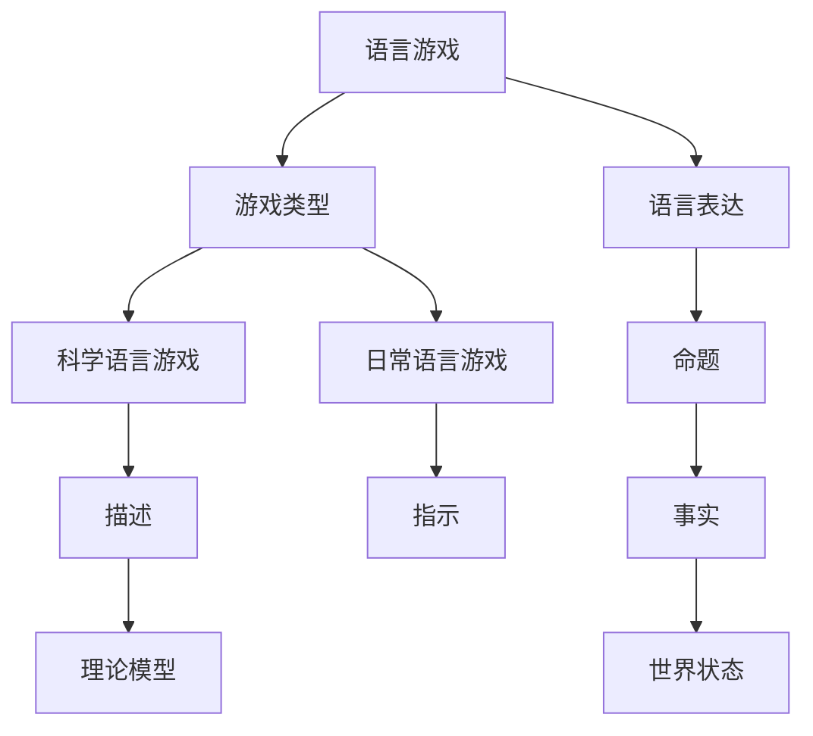
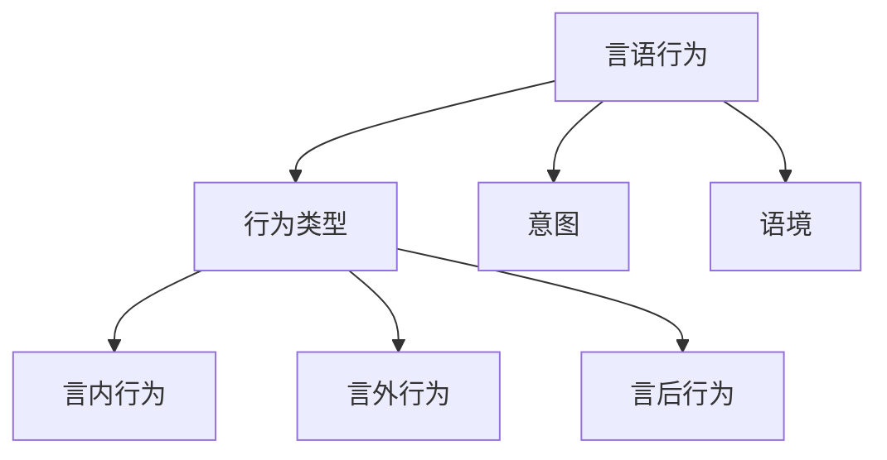

                 

# 维特根斯坦与奥斯汀：日常语言哲学的开创者

## 关键词
- 维特根斯坦
- 奥斯汀
- 日常语言哲学
- 言语行为理论
- 语言游戏理论
- 哲学分析

## 摘要
本文将深入探讨两位伟大的哲学家路德维希·维特根斯坦和约翰·奥斯汀在日常语言哲学领域的贡献。通过分析他们的核心思想和理论，我们将探讨如何理解和运用这些哲学观念来分析日常生活中的语言现象。文章结构将按照维特根斯坦和奥斯汀的思想发展历程，结合具体案例，逐步揭示他们的哲学对话及其对现代哲学研究的深远影响。

## 引言与背景

### 1.1. 书籍主题介绍
日常语言哲学是哲学研究的一个重要分支，关注的是我们日常使用的语言及其哲学意义。路德维希·维特根斯坦（Ludwig Wittgenstein）和约翰·奥斯汀（John Austin）是这一领域的开创者。维特根斯坦以其“语言游戏”理论和对逻辑原子主义的批判而著称，而奥斯汀则以其“言语行为”理论和对语用学的贡献闻名。本书旨在探讨这两位哲学家的思想，分析其对现代哲学研究的影响，并探讨日常语言哲学在当代的应用。

### 1.2. 维特根斯坦与奥斯汀的核心思想
维特根斯坦的核心思想体现在他的“语言游戏”理论中，这一理论认为语言的使用方式多种多样，不同的语言游戏有不同的规则和目的。奥斯汀的“言语行为”理论则提出了语言不仅传达信息，还实施行为。这一理论强调了语言的实践功能，认为言语行为可以分为表达意图、表达状态和实施行动三个方面。

### 1.3. 本书的研究方法与结构安排
本书采用哲学分析方法，通过对文献的综合考察和历史的回顾，来深入理解维特根斯坦和奥斯汀的思想。本书的结构按照两位哲学家的思想发展顺序展开，先介绍维特根斯坦的早期和后期思想，再探讨奥斯汀的言语行为理论和语用学贡献，最后分析两位哲学家的哲学对话及其对当代哲学研究的启示。

## 第二部分：维特根斯坦的日常语言哲学

### 2.1. 维特根斯坦早期的思想

#### 2.1.1. 《逻辑哲学论》
维特根斯坦的早期思想集中体现在他的《逻辑哲学论》中。这本书提出了逻辑原子主义和世界图景理论，认为世界由不可分割的事实组成，这些事实可以通过逻辑原子来表达。维特根斯坦认为，逻辑原子是语言的最基本单位，是构成世界的基础。

#### 2.1.2. 数学基础与逻辑原子主义
在《逻辑哲学论》中，维特根斯坦探讨了数学的基础，提出了逻辑原子主义。他试图通过逻辑原子来解释数学和世界的本质，认为逻辑原子之间的关系构成了数学和科学的基础。

#### 2.1.3. 语言与现实的关系
维特根斯坦认为，语言与现实之间的关系是复杂的。语言不仅仅是一种符号系统，更是与现实世界相互作用的一种方式。他的观点强调了语言的使用和现实世界的关联性。

### 2.2. 维特根斯坦的日常语言哲学

#### 2.2.1. 语言游戏理论
维特根斯坦的“语言游戏”理论是他后期哲学思想的核心。他认为，语言的使用方式是多样化的，不同的语言游戏有不同的规则和目的。语言游戏可以分为日常语言游戏、科学语言游戏和艺术语言游戏等。

##### 不同类型的语言游戏

- **日常语言游戏**：这是最常见的语言使用方式，包括我们的日常对话和交流。日常语言游戏有其固有的规则，但并不一定有明确的形式。
  
- **科学语言游戏**：这种语言游戏主要用于科学研究和表达科学理论。科学语言游戏有明确的规则和形式，以确保表达的科学理论是准确的。
  
- **艺术语言游戏**：艺术语言游戏则更注重语言的表达力和创造性，艺术家通过语言来表达情感和思想。

#### 2.2.2. 形式逻辑与日常语言的差异
维特根斯坦指出，形式逻辑和日常语言之间存在显著差异。形式逻辑强调符号和逻辑规则，而日常语言则更加灵活和多样化。他认为，理解日常语言的关键在于理解语言的使用环境，而不是机械地应用逻辑规则。

#### 2.2.3. 表达式与命题的意义
维特根斯坦认为，表达式的意义不仅取决于符号本身，还取决于其在特定语言游戏中的使用。命题的意义在于它们如何在特定的语言游戏中发挥作用，而不是它们在逻辑上是否自洽。

### 2.3. 维特根斯坦后期思想

#### 2.3.1. 《哲学研究》
维特根斯坦的后期思想主要体现在他的《哲学研究》中。这本书对早期思想进行了批判和修正，提出了新的哲学观点。维特根斯坦认为，哲学的任务不是提出一套理论，而是通过澄清思想和语言的使用来解决问题。

#### 2.3.2. 意义与使用的关系
在后期思想中，维特根斯坦强调了意义与使用的关系。他认为，一个词或表达式的意义在于它在实际使用中的功能，而不是它所代表的概念或对象。

#### 2.3.3. 对哲学问题的重新思考
维特根斯坦的后期思想对许多哲学问题提出了新的看法。他批判了传统哲学中的许多概念，如“自我”、“心灵”、“实在”等，认为这些问题可以通过对语言和思想的使用进行澄清。

## 第三部分：奥斯汀的日常语言哲学

### 3.1. 奥斯汀的言语行为理论

#### 3.1.1. 言语行为与语言功能
奥斯汀的言语行为理论认为，语言不仅仅是一种表达信息的工具，更是一种行为。他的理论指出，每个言语行为都包含三个层面：言内行为、言外行为和言后行为。

##### 言语行为三要素

- **言内行为**：这是指说话者使用词汇和语法来表达意思的行为。
- **言外行为**：这是说话者的意图，即说话者试图通过言语行为实现的目的。
- **言后行为**：这是言语行为可能产生的效果或后果。

#### 3.1.2. 三元结构
奥斯汀的言语行为理论强调言语行为的三元结构。他认为，每个言语行为都必须同时满足这三个层面，否则就无法称之为有效的言语行为。

#### 3.1.3. 言语行为理论的应用
奥斯汀的言语行为理论在法律、教育、心理学等领域都有广泛应用。例如，在法律领域，它可以用来分析法庭辩论中的语言使用；在教育领域，它可以用来指导教师如何更有效地传达信息。

### 3.2. 奥斯汀的语用学贡献

#### 3.2.1. 语言使用与语境
奥斯汀强调，语言的使用是与语境紧密相关的。语境包括说话者、听者、环境等多个因素，这些因素都会影响言语行为的理解和解释。

#### 3.2.2. 表达与理解
奥斯汀认为，表达和理解是语言使用中两个不可或缺的环节。表达是指说话者如何通过言语行为传达意图，理解则是指听者如何正确解读言语行为。

#### 3.2.3. 日常语言哲学的实践应用
奥斯汀的语用学贡献使日常语言哲学在实践领域有了更广泛的应用。例如，在商务谈判、公共演讲、人际沟通等方面，语用学原则都可以帮助我们更有效地使用语言。

### 3.3. 奥斯汀的哲学思想

#### 3.3.1. 知识论与认识论
奥斯汀的知识论和认识论观点强调，知识的获取不仅仅是通过观察和经验，还包括语言和沟通。他认为，语言是知识传播的重要媒介。

#### 3.3.2. 伦理学与道德哲学
奥斯汀的伦理学和道德哲学观点指出，道德行为不仅涉及行为本身，还包括行为背后的意图和动机。他强调，意图和动机是判断道德行为的关键。

#### 3.3.3. 对维特根斯坦哲学的批判与继承
奥斯汀对维特根斯坦的哲学观点既有批判也有继承。他批判维特根斯坦对语言和哲学问题的抽象处理，认为哲学问题需要更具体的分析和解释。然而，他也继承了一些维特根斯坦的核心思想，如语言的使用与语境的关系。

## 第四部分：维特根斯坦与奥斯汀的哲学对话

### 4.1. 维特根斯坦与奥斯汀的哲学交流
维特根斯坦和奥斯汀虽然在某些方面有分歧，但他们的哲学观点也存在许多交集。例如，他们都关注语言的使用和意义，都试图通过哲学分析来解决语言哲学问题。

#### 4.1.1. 双方思想的交集
- **对语言使用的关注**：维特根斯坦和奥斯汀都认为，理解语言的关键在于理解其使用方式。
- **对语言哲学问题的探讨**：他们都试图通过哲学分析来探讨语言的本质和功能。

#### 4.1.2. 双方思想的分歧
- **对语言规则的理解**：维特根斯坦强调语言的灵活性，而奥斯汀则强调语言规则的重要性。
- **对哲学方法的态度**：维特根斯坦倾向于通过日常语言的分析来解决问题，而奥斯汀则更注重逻辑和形式化的方法。

### 4.2. 哲学对话的意义
维特根斯坦与奥斯汀的哲学对话对日常语言哲学的研究具有重要意义。他们的观点不仅丰富了语言哲学的理论体系，也为现代哲学研究提供了新的思路和方法。

#### 4.2.1. 对日常语言哲学的深化理解
通过分析维特根斯坦和奥斯汀的思想，我们可以更深入地理解日常语言的本质和功能，从而更好地解决语言哲学问题。

#### 4.2.2. 对语言哲学研究的启示
维特根斯坦与奥斯汀的哲学对话为我们提供了新的研究视角和方法，启示我们在未来如何进一步深化语言哲学的研究。

## 第五部分：案例研究

### 5.1. 维特根斯坦与奥斯汀思想在当代的应用

#### 5.1.1. 语言哲学在教育领域的应用
维特根斯坦和奥斯汀的语言哲学观点在教育领域有着广泛的应用。例如，在教育教学中，教师可以通过分析语言的使用来帮助学生更好地理解和掌握语言。

#### 5.1.2. 语言哲学在法律领域的应用
在法律领域，维特根斯坦和奥斯汀的语言哲学观点可以帮助法官和律师更好地理解法律文本，从而更准确地解释和应用法律。

#### 5.1.3. 语言哲学在社会科学研究中的应用
在社会科学研究中，维特根斯坦和奥斯汀的语言哲学观点可以帮助研究者更好地理解社会现象，从而提出更有效的解决方案。

### 5.2. 维特根斯坦与奥斯汀思想的影响与挑战

#### 5.2.1. 当代哲学家的继承与创新
当代许多哲学家都在继承维特根斯坦和奥斯汀的思想，同时也在尝试提出自己的创新观点。这些创新观点为语言哲学的研究带来了新的机遇和挑战。

#### 5.2.2. 语言哲学研究的挑战与机遇
语言哲学研究面临着许多挑战，如如何在现代社会中解释和运用哲学观点，如何应对新的技术变革等。然而，这些挑战也带来了新的机遇，为语言哲学的研究提供了更广阔的空间。

## 第六部分：结论与展望

### 6.1. 维特根斯坦与奥斯汀日常语言哲学的总体评价
维特根斯坦和奥斯汀是日常语言哲学领域的重要开创者。他们的思想不仅丰富了哲学理论体系，也为现代哲学研究提供了新的思路和方法。他们的贡献在于揭示了语言的使用和意义，推动了哲学分析的发展。

### 6.2. 日常语言哲学的未来研究
未来，日常语言哲学的研究将继续深化，特别是在新的技术背景下，如何理解和应用哲学观点将是一个重要的课题。同时，跨学科研究也将成为语言哲学研究的重要趋势，为哲学带来新的机遇。

## 附录

### 7.1. 参考文献
[1] 维特根斯坦，L. (1921). 《逻辑哲学论》.
[2] 奥斯汀，J. (1962). 《如何以言行事》.
[3] 蒙塔格，G. E. M. (1975). 《维特根斯坦》.
[4] 罗素，B. (1959). 《分析哲学的历史》.

### 7.2. 维特根斯坦与奥斯汀著作选读
- 维特根斯坦，《哲学研究》节选
- 奥斯汀，《言语行为》节选

## 第七部分：核心概念与联系架构

### 8.1. 维特根斯坦的“语言游戏”理论与“意义理论”联系架构

### 8.2. 奥斯汀的“言语行为”理论与“言语行为三要素”联系架构

## 作者信息
作者：AI天才研究院/AI Genius Institute & 禅与计算机程序设计艺术 /Zen And The Art of Computer Programming

### 结论
维特根斯坦和奥斯汀的日常语言哲学为我们提供了一种新的视角来理解语言的本质和功能。通过分析他们的核心思想和理论，我们可以更好地理解语言在现实世界中的作用，并为当代哲学研究提供新的启示。随着社会技术的不断发展，日常语言哲学的研究将继续深化，为解决现实世界中的语言问题提供更有效的理论支持。

