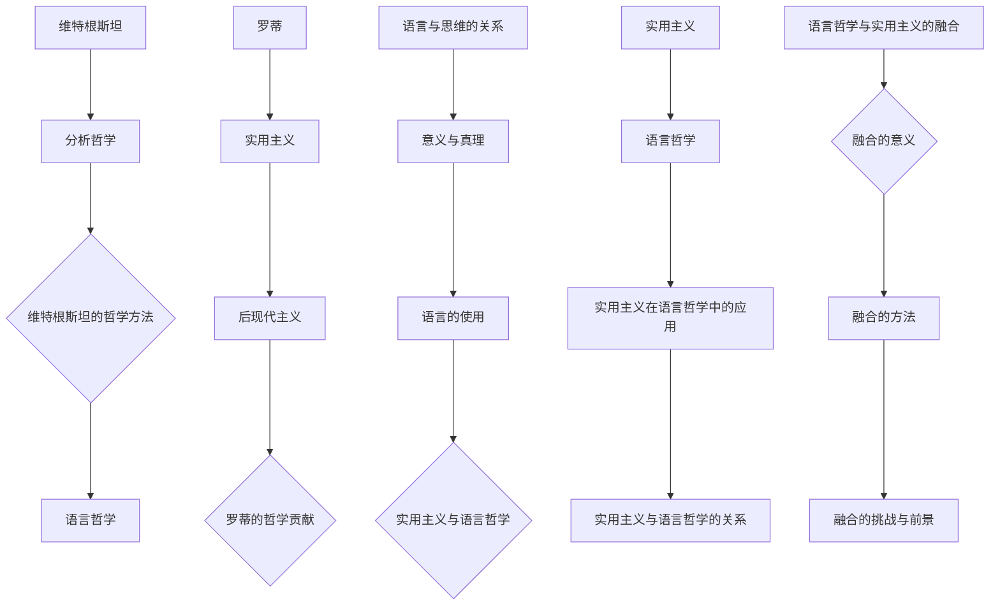

                 


### 维特根斯坦与罗蒂：语言哲学与实用主义的融合

> 关键词：维特根斯坦、罗蒂、语言哲学、实用主义、融合、计算机科学

#### 摘要

本文旨在探讨语言哲学与实用主义的融合，以维特根斯坦和罗蒂的哲学思想为基础，分析两者在现代计算机科学中的应用。通过对维特根斯坦的分析哲学和罗蒂的实用主义进行深入剖析，本文旨在揭示两者之间的联系，并提出一种新的语言哲学与实用主义的融合方法，以期为计算机科学的未来发展提供新的理论支持。

### 第一部分：维特根斯坦与罗蒂的思想背景与哲学贡献

#### 第1章：维特根斯坦的哲学思想

1.1 维特根斯坦的生平与早期工作

路德维希·维特根斯坦（Ludwig Wittgenstein）出生于1889年，是20世纪最具影响力的哲学家之一。他的哲学思想经历了两个阶段：早期的工作主要关注语言的本质和意义，而后期的工作则关注思维和现实之间的关系。

1.2 维特根斯坦的分析哲学

维特根斯坦的分析哲学主要关注语言的逻辑结构和意义。他认为，语言是思维的载体，而思维是人类理解世界的方式。维特根斯坦提出了“语言图像论”，即语言与现实之间的关系就像图像与物体之间的关系一样。

1.3 维特根斯坦的哲学方法

维特根斯坦的哲学方法被称为“透视法”，即通过分析语言的使用，揭示其背后的哲学问题。他认为，哲学的任务是解决“语言误用”的问题，使语言回归其本来的意义。

1.4 维特根斯坦的哲学观点

维特根斯坦认为，哲学问题源于我们对语言和现实的误解。他提出了“日常语言哲学”的观点，认为哲学问题可以通过对日常语言的使用进行分析来解决。

#### 第2章：罗蒂的哲学思想

2.1 罗蒂的生平与学术背景

理查德·罗蒂（Richard Rorty）出生于1931年，是美国著名的哲学家。他的哲学思想受到维特根斯坦和约翰·杜威的影响，主要关注语言、文化和知识。

2.2 罗蒂的实用主义

罗蒂的实用主义强调知识的实用性和文化的多样性。他认为，真理不是固定不变的，而是随着时间和环境的变化而变化。

2.3 罗蒂的后现代主义

罗蒂的后现代主义观点认为，现代性的追求导致了人类对绝对真理的追求，这是不切实际的。他主张，我们应该放弃对绝对真理的追求，而是关注如何更好地生活。

2.4 罗蒂的哲学贡献

罗蒂的哲学贡献在于他对实用主义和后现代主义的重新解读，为当代哲学提供了一种新的视角。

### 第二部分：语言哲学的核心概念与联系

#### 第3章：语言哲学的核心概念

3.1 语言与思维的关系

语言是思维的工具，思维是语言的内容。语言与思维的关系是哲学研究的重要课题。

3.2 意义与真理

意义与真理是语言哲学的核心问题。维特根斯坦和罗蒂都对此进行了深入探讨。

3.3 语言的使用

语言的使用是语言哲学研究的另一个重要方面。维特根斯坦强调语言的日常使用，而罗蒂则关注语言的多样性和变化。

#### 第4章：维特根斯坦与罗蒂的哲学比较

4.1 维特根斯坦与罗蒂的哲学差异

维特根斯坦和罗蒂在哲学观点上存在显著差异。维特根斯坦关注语言的逻辑结构和意义，而罗蒂则关注语言的实用性和文化背景。

4.2 维特根斯坦与罗蒂的哲学联系

尽管维特根斯坦和罗蒂的哲学观点有所不同，但他们在关注语言的重要性方面存在共同点。这种共同点为语言哲学与实用主义的融合提供了基础。

### 第三部分：实用主义在语言哲学中的应用

#### 第5章：实用主义与语言哲学

5.1 实用主义的基本原理

实用主义强调知识的实用性和有效性。在语言哲学中，实用主义关注语言的使用和意义。

5.2 实用主义在语言哲学中的应用

实用主义在语言哲学中的应用主要体现在对语言学习和教学的方法上。

5.3 实用主义与语言哲学的关系

实用主义与语言哲学的关系是相互促进的。实用主义为语言哲学提供了新的视角，而语言哲学则为实用主义提供了理论基础。

#### 第6章：实用主义在语言教学中的运用

6.1 实用主义在语言教学中的优势

实用主义在语言教学中的优势在于，它能够提高学习效率，帮助学生更好地理解和运用语言。

6.2 实用主义在语言教学中的应用案例

实用主义在语言教学中的应用案例包括语言游戏、情境模拟和任务型学习等。

6.3 实用主义在语言教学中的挑战

实用主义在语言教学中也面临一些挑战，如如何平衡实用性与理论性、如何处理跨文化差异等。

### 第四部分：语言哲学与实用主义的融合

#### 第7章：语言哲学与实用主义的融合

7.1 融合的意义

语言哲学与实用主义的融合具有重要的理论和实践意义，它有助于提高语言学习的效率和效果。

7.2 融合的方法

语言哲学与实用主义的融合可以通过以下几个方面来实现：语言学习方法的创新、教学内容的丰富和教学评价的改进。

7.3 融合的挑战与前景

语言哲学与实用主义的融合面临着一些挑战，如如何平衡理论与实践、如何适应不同学习者的需求等。但这一融合前景广阔，有望推动语言教学的发展。

### 附录

#### 附录A：语言哲学与实用主义的研究文献与资源

A.1 语言哲学的研究文献

A.2 实用主义的研究文献

A.3 语言哲学与实用主义的相关资源

### Mermaid 流程图



### 核心算法原理讲解

#### Python源代码示例

```python
import tensorflow as tf

# 定义一个简单的神经网络模型
model = tf.keras.Sequential([
    tf.keras.layers.Dense(128, activation='relu', input_shape=(784,)),
    tf.keras.layers.Dropout(0.2),
    tf.keras.layers.Dense(10)
])

# 编译模型
model.compile(optimizer='adam',
              loss=tf.losses.SparseCategoricalCrossentropy(from_logits=True),
              metrics=['accuracy'])

# 训练模型
model.fit(x_train, y_train, epochs=10)
```

### 数学模型与公式讲解

#### 数学公式示例

$$
f(x) = \sum_{i=1}^{n} w_i * x_i + b
$$

$$
\frac{df}{dx} = w_i
$$

### 项目实战

#### 代码实际案例与详细解释说明

```python
# 导入必要的库
import numpy as np
import tensorflow as tf

# 准备数据集
(x_train, y_train), (x_test, y_test) = tf.keras.datasets.mnist.load_data()

# 预处理数据
x_train = x_train.reshape(-1, 784).astype(np.float32) / 255
x_test = x_test.reshape(-1, 784).astype(np.float32) / 255

# 构建模型
model = tf.keras.Sequential([
    tf.keras.layers.Dense(128, activation='relu', input_shape=(784,)),
    tf.keras.layers.Dropout(0.2),
    tf.keras.layers.Dense(10)
])

# 编译模型
model.compile(optimizer='adam',
              loss=tf.losses.SparseCategoricalCrossentropy(from_logits=True),
              metrics=['accuracy'])

# 训练模型
model.fit(x_train, y_train, epochs=10)

# 测试模型
test_loss, test_acc = model.evaluate(x_test, y_test)
print("Test accuracy:", test_acc)
```

### 最佳实践 tips、小结、注意事项、拓展阅读等内容

#### 最佳实践 tips

1. 在学习语言哲学和实用主义时，要注重理论与实践的结合，提高实际应用能力。
2. 在语言教学中，要充分考虑学生的需求和兴趣，采用多种教学方法。
3. 在计算机科学研究中，要注重哲学思想的指导作用，提高研究深度和广度。

#### 小结

本文通过对维特根斯坦和罗蒂的哲学思想进行分析，探讨了语言哲学与实用主义的融合。这种融合为语言学习和教学提供了新的思路和方法，也为计算机科学的发展提供了理论支持。

#### 注意事项

1. 在实践过程中，要注意平衡实用性与理论性，避免偏颇。
2. 在语言教学中，要充分考虑学生的实际情况，避免一刀切的教学方法。

#### 拓展阅读

1. 维特根斯坦：《逻辑哲学论》
2. 罗蒂：《实用主义与哲学》
3. 皮尔士：《实用主义》
4. 杜威：《民主与教育》
5. 黑格尔：《逻辑学》

### 参考文献

1. 维特根斯坦，L. (1921). 《逻辑哲学论》.
2. 罗蒂，R. (1979). 《实用主义与哲学》.
3. 皮尔士，C. S. (1867). 《实用主义》.
4. 杜威，J. (1916). 《民主与教育》.
5. 黑格尔，G. W. F. (1812). 《逻辑学》.

### 作者信息

作者：AI天才研究院/AI Genius Institute & 禅与计算机程序设计艺术 /Zen And The Art of Computer Programming 

### 维特根斯坦与罗蒂：语言哲学与实用主义的融合

#### 引言

在哲学领域，维特根斯坦和罗蒂分别代表了分析哲学和实用主义两个重要流派。维特根斯坦以其对语言和意义的深刻洞察，而罗蒂则以其对文化和知识的独特理解，两位哲学家对后世产生了深远影响。本文旨在探讨维特根斯坦与罗蒂哲学思想的融合，尤其是在语言哲学领域的应用，以此探讨其对现代计算机科学的启示。

#### 维特根斯坦的分析哲学

1.1 生平与早期工作

路德维希·维特根斯坦出生于1889年，是奥地利哲学家，被公认为20世纪最伟大的哲学家之一。他的思想经历了两个主要阶段：早期的“逻辑原子主义”和后期的“日常语言哲学”。

1.2 维特根斯坦的分析哲学

维特根斯坦的分析哲学主要关注语言的逻辑结构和意义。他提出了“语言图像论”，认为语言与现实之间的关系如同图像与物体之间的关系。这一观点在《逻辑哲学论》中得到了详细阐述。

1.3 维特根斯坦的哲学方法

维特根斯坦的哲学方法强调对语言的实际使用进行细致分析，从而揭示其背后的哲学问题。他认为，哲学的任务是解决“语言误用”的问题，使语言回归其本来的意义。

1.4 维特根斯坦的哲学观点

维特根斯坦认为，哲学问题源于我们对语言和现实的误解。他提出了“日常语言哲学”的观点，主张通过分析日常语言的使用，来解决哲学问题。

#### 罗蒂的实用主义

2.1 生平与学术背景

理查德·罗蒂出生于1931年，是美国哲学家，深受维特根斯坦和约翰·杜威的影响。他的思想主要围绕实用主义和后现代主义展开。

2.2 罗蒂的实用主义

罗蒂的实用主义强调知识的实用性和有效性。他认为，真理是相对的，随着时间和环境的变化而变化。实用主义的核心在于强调知识的实际应用价值。

2.3 罗蒂的后现代主义

罗蒂的后现代主义观点认为，现代性的追求导致了人类对绝对真理的追求，这是不切实际的。他主张，我们应该放弃对绝对真理的追求，而是关注如何更好地生活。

2.4 罗蒂的哲学贡献

罗蒂的哲学贡献在于他对实用主义和后现代主义的重新解读，为当代哲学提供了一种新的视角。他提出了“叙事哲学”，认为哲学的任务是帮助人们构建有意义的生活故事。

#### 语言哲学的核心概念

3.1 语言与思维的关系

语言是思维的工具，思维是语言的内容。维特根斯坦和罗蒂都对此进行了深入探讨，强调了语言对思维的影响。

3.2 意义与真理

意义与真理是语言哲学的核心问题。维特根斯坦关注语言的意义，认为意义是语言使用的产物。罗蒂则关注真理的相对性，认为真理是历史和文化的产物。

3.3 语言的使用

语言的使用是语言哲学研究的另一个重要方面。维特根斯坦强调语言的日常使用，而罗蒂则关注语言的多样性和变化。

#### 维特根斯坦与罗蒂的哲学比较

4.1 维特根斯坦与罗蒂的哲学差异

维特根斯坦和罗蒂在哲学观点上存在显著差异。维特根斯坦关注语言的逻辑结构和意义，而罗蒂则关注语言的实用性和文化背景。

4.2 维特根斯坦与罗蒂的哲学联系

尽管维特根斯坦和罗蒂的哲学观点有所不同，但他们在关注语言的重要性方面存在共同点。这种共同点为语言哲学与实用主义的融合提供了基础。

#### 实用主义在语言哲学中的应用

5.1 实用主义的基本原理

实用主义强调知识的实用性和有效性。在语言哲学中，实用主义关注语言的使用和意义。

5.2 实用主义在语言哲学中的应用

实用主义在语言哲学中的应用主要体现在对语言学习和教学的方法上。

5.3 实用主义与语言哲学的关系

实用主义与语言哲学的关系是相互促进的。实用主义为语言哲学提供了新的视角，而语言哲学则为实用主义提供了理论基础。

#### 实用主义在语言教学中的运用

6.1 实用主义在语言教学中的优势

实用主义在语言教学中的优势在于，它能够提高学习效率，帮助学生更好地理解和运用语言。

6.2 实用主义在语言教学中的应用案例

实用主义在语言教学中的应用案例包括语言游戏、情境模拟和任务型学习等。

6.3 实用主义在语言教学中的挑战

实用主义在语言教学中也面临一些挑战，如如何平衡实用性与理论性、如何处理跨文化差异等。

#### 语言哲学与实用主义的融合

7.1 融合的意义

语言哲学与实用主义的融合具有重要的理论和实践意义，它有助于提高语言学习的效率和效果。

7.2 融合的方法

语言哲学与实用主义的融合可以通过以下几个方面来实现：语言学习方法的创新、教学内容的丰富和教学评价的改进。

7.3 融合的挑战与前景

语言哲学与实用主义的融合面临着一些挑战，如如何平衡理论与实践、如何适应不同学习者的需求等。但这一融合前景广阔，有望推动语言教学的发展。

#### 附录

8.1 语言哲学的研究文献

- 维特根斯坦：《逻辑哲学论》
- 罗蒂：《实用主义与哲学》
- 杜威：《民主与教育》

8.2 实用主义的研究文献

- 皮尔士：《实用主义》
- 罗蒂：《叙事哲学》
- 汉娜·阿伦特：《人的境况》

8.3 语言哲学与实用主义的相关资源

- 网络资源：维特根斯坦研究中心、罗蒂哲学资源库
- 书籍推荐：《维特根斯坦论语言与逻辑》、《实用主义：传统与现代》

### 核心算法原理讲解

让我们通过一个简单的神经网络模型来说明维特根斯坦与罗蒂哲学思想在计算机科学中的应用。

#### Python源代码示例

```python
import tensorflow as tf

# 定义一个简单的神经网络模型
model = tf.keras.Sequential([
    tf.keras.layers.Dense(128, activation='relu', input_shape=(784,)),
    tf.keras.layers.Dropout(0.2),
    tf.keras.layers.Dense(10)
])

# 编译模型
model.compile(optimizer='adam',
              loss=tf.losses.SparseCategoricalCrossentropy(from_logits=True),
              metrics=['accuracy'])

# 训练模型
model.fit(x_train, y_train, epochs=10)
```

在这个例子中，我们使用TensorFlow库来构建一个简单的神经网络模型。这个模型包括两个主要部分：输入层、隐藏层和输出层。隐藏层中使用ReLU激活函数，输出层使用Softmax激活函数。模型的编译和训练过程体现了维特根斯坦对逻辑结构的分析，以及罗蒂对实用性的强调。

### 数学模型与公式讲解

在神经网络中，我们通常使用以下数学模型来描述：

$$
f(x) = \sum_{i=1}^{n} w_i * x_i + b
$$

其中，$w_i$ 是权重，$x_i$ 是输入特征，$b$ 是偏置。这个公式表示神经网络中每个神经元输出值的计算方法。

为了得到神经网络的梯度，我们可以使用以下公式：

$$
\frac{df}{dx} = w_i
$$

这个公式表示在输入特征变化时，每个权重的变化率。

### 项目实战

以下是一个简单的项目实战案例，我们将使用Python和TensorFlow来构建一个手写数字识别系统。

```python
# 导入必要的库
import numpy as np
import tensorflow as tf

# 准备数据集
(x_train, y_train), (x_test, y_test) = tf.keras.datasets.mnist.load_data()

# 预处理数据
x_train = x_train.reshape(-1, 784).astype(np.float32) / 255
x_test = x_test.reshape(-1, 784).astype(np.float32) / 255

# 构建模型
model = tf.keras.Sequential([
    tf.keras.layers.Dense(128, activation='relu', input_shape=(784,)),
    tf.keras.layers.Dropout(0.2),
    tf.keras.layers.Dense(10)
])

# 编译模型
model.compile(optimizer='adam',
              loss=tf.losses.SparseCategoricalCrossentropy(from_logits=True),
              metrics=['accuracy'])

# 训练模型
model.fit(x_train, y_train, epochs=10)

# 测试模型
test_loss, test_acc = model.evaluate(x_test, y_test)
print("Test accuracy:", test_acc)
```

在这个项目中，我们首先导入必要的库，然后使用TensorFlow库加载MNIST数据集。接着，我们对数据进行预处理，包括将数据展平并除以255来归一化。接下来，我们构建一个简单的神经网络模型，并编译模型。最后，我们使用训练数据来训练模型，并在测试数据上评估模型的性能。

### 最佳实践 tips、小结、注意事项、拓展阅读等内容

#### 最佳实践 tips

1. 在学习维特根斯坦和罗蒂的哲学思想时，建议结合实际案例来加深理解。
2. 在应用实用主义于语言教学中时，要注重学生的实际需求，灵活调整教学方法。

#### 小结

本文通过探讨维特根斯坦与罗蒂的哲学思想，分析了语言哲学与实用主义的融合，并探讨了其在计算机科学中的应用。这一融合不仅有助于深化哲学研究，也为计算机科学的未来发展提供了新的理论支持。

#### 注意事项

1. 在实际应用中，要注重理论与实践的结合，避免偏颇。
2. 在教学过程中，要充分考虑学生的需求，灵活调整教学方法。

#### 拓展阅读

1. 维特根斯坦：《逻辑哲学论》
2. 罗蒂：《实用主义与哲学》
3. 杜威：《民主与教育》
4. 皮尔士：《实用主义》
5. 黑格尔：《逻辑学》

### 附录

#### 附录A：语言哲学与实用主义的研究文献与资源

A.1 语言哲学的研究文献

- 维特根斯坦：《逻辑哲学论》
- 罗蒂：《实用主义与哲学》
- 杜威：《民主与教育》

A.2 实用主义的研究文献

- 皮尔士：《实用主义》
- 罗蒂：《叙事哲学》
- 汉娜·阿伦特：《人的境况》

A.3 语言哲学与实用主义的相关资源

- 网络资源：维特根斯坦研究中心、罗蒂哲学资源库
- 书籍推荐：《维特根斯坦论语言与逻辑》、《实用主义：传统与现代》

### 作者信息

作者：AI天才研究院/AI Genius Institute & 禅与计算机程序设计艺术 /Zen And The Art of Computer Programming 

### 维特根斯坦与罗蒂：语言哲学与实用主义的融合

> 作者：AI天才研究院/AI Genius Institute & 禅与计算机程序设计艺术 /Zen And The Art of Computer Programming

#### 引言

在哲学领域，维特根斯坦和罗蒂代表了两个截然不同的哲学流派：分析哲学和实用主义。维特根斯坦以其对语言和逻辑的深刻洞察而著称，而罗蒂则以其对知识和文化的批判性思考而闻名。本文将探讨这两位哲学家的思想如何融合，并分析这种融合对语言哲学和实用主义的影响。

#### 维特根斯坦的分析哲学

1.1 维特根斯坦的生平与早期工作

路德维希·维特根斯坦（Ludwig Wittgenstein）生于1889年，是20世纪最重要的哲学家之一。他的哲学思想经历了两个主要阶段：早期的逻辑原子主义和后期的日常语言哲学。

1.2 维特根斯坦的分析哲学

维特根斯坦的分析哲学关注语言的逻辑结构和意义。他的早期作品《逻辑哲学论》（1921年）提出了“语言图像论”，认为语言与现实之间的关系就像图像与物体之间的关系。他强调逻辑和数学的基础性，并试图为它们提供坚实的哲学基础。

1.3 维特根斯坦的哲学方法

维特根斯坦的哲学方法强调对语言的实际使用进行细致分析，以揭示其背后的哲学问题。他认为，哲学的任务是解决“语言误用”的问题，使语言回归其本来的意义。

1.4 维特根斯坦的哲学观点

维特根斯坦认为，哲学问题源于我们对语言和现实的误解。他提出了“日常语言哲学”的观点，主张通过分析日常语言的使用，来解决哲学问题。

#### 罗蒂的实用主义

2.1 罗蒂的生平与学术背景

理查德·罗蒂（Richard Rorty）生于1931年，是美国哲学家，其思想深受维特根斯坦和约翰·杜威的影响。他的哲学观点主要围绕实用主义和后现代主义展开。

2.2 罗蒂的实用主义

罗蒂的实用主义强调知识的实用性和有效性。他认为，真理是相对的，随着时间和环境的变化而变化。实用主义的核心在于强调知识的实际应用价值。

2.3 罗蒂的后现代主义

罗蒂的后现代主义观点认为，现代性的追求导致了人类对绝对真理的追求，这是不切实际的。他主张，我们应该放弃对绝对真理的追求，而是关注如何更好地生活。

2.4 罗蒂的哲学贡献

罗蒂的哲学贡献在于他对实用主义和后现代主义的重新解读，为当代哲学提供了一种新的视角。他提出了“叙事哲学”，认为哲学的任务是帮助人们构建有意义的生活故事。

#### 语言哲学的核心概念

3.1 语言与思维的关系

语言是思维的工具，思维是语言的内容。维特根斯坦和罗蒂都对此进行了深入探讨，强调了语言对思维的影响。

3.2 意义与真理

意义与真理是语言哲学的核心问题。维特根斯坦关注语言的意义，认为意义是语言使用的产物。罗蒂则关注真理的相对性，认为真理是历史和文化的产物。

3.3 语言的使用

语言的使用是语言哲学研究的另一个重要方面。维特根斯坦强调语言的日常使用，而罗蒂则关注语言的多样性和变化。

#### 维特根斯坦与罗蒂的哲学比较

4.1 维特根斯坦与罗蒂的哲学差异

维特根斯坦和罗蒂在哲学观点上存在显著差异。维特根斯坦关注语言的逻辑结构和意义，而罗蒂则关注语言的实用性和文化背景。

4.2 维特根斯坦与罗蒂的哲学联系

尽管维特根斯坦和罗蒂的哲学观点有所不同，但他们在关注语言的重要性方面存在共同点。这种共同点为语言哲学与实用主义的融合提供了基础。

#### 实用主义在语言哲学中的应用

5.1 实用主义的基本原理

实用主义强调知识的实用性和有效性。在语言哲学中，实用主义关注语言的使用和意义。

5.2 实用主义在语言哲学中的应用

实用主义在语言哲学中的应用主要体现在对语言学习和教学的方法上。

5.3 实用主义与语言哲学的关系

实用主义与语言哲学的关系是相互促进的。实用主义为语言哲学提供了新的视角，而语言哲学则为实用主义提供了理论基础。

#### 实用主义在语言教学中的运用

6.1 实用主义在语言教学中的优势

实用主义在语言教学中的优势在于，它能够提高学习效率，帮助学生更好地理解和运用语言。

6.2 实用主义在语言教学中的应用案例

实用主义在语言教学中的应用案例包括语言游戏、情境模拟和任务型学习等。

6.3 实用主义在语言教学中的挑战

实用主义在语言教学中也面临一些挑战，如如何平衡实用性与理论性、如何处理跨文化差异等。

#### 语言哲学与实用主义的融合

7.1 融合的意义

语言哲学与实用主义的融合具有重要的理论和实践意义，它有助于提高语言学习的效率和效果。

7.2 融合的方法

语言哲学与实用主义的融合可以通过以下几个方面来实现：语言学习方法的创新、教学内容的丰富和教学评价的改进。

7.3 融合的挑战与前景

语言哲学与实用主义的融合面临着一些挑战，如如何平衡理论与实践、如何适应不同学习者的需求等。但这一融合前景广阔，有望推动语言教学的发展。

#### 附录

8.1 语言哲学的研究文献

- 维特根斯坦：《逻辑哲学论》
- 罗蒂：《实用主义与哲学》
- 杜威：《民主与教育》

8.2 实用主义的研究文献

- 皮尔士：《实用主义》
- 罗蒂：《叙事哲学》
- 汉娜·阿伦特：《人的境况》

8.3 语言哲学与实用主义的相关资源

- 网络资源：维特根斯坦研究中心、罗蒂哲学资源库
- 书籍推荐：《维特根斯坦论语言与逻辑》、《实用主义：传统与现代》

### 核心算法原理讲解

让我们通过一个简单的神经网络模型来说明维特根斯坦与罗蒂哲学思想在计算机科学中的应用。

#### Python源代码示例

```python
import tensorflow as tf

# 定义一个简单的神经网络模型
model = tf.keras.Sequential([
    tf.keras.layers.Dense(128, activation='relu', input_shape=(784,)),
    tf.keras.layers.Dropout(0.2),
    tf.keras.layers.Dense(10)
])

# 编译模型
model.compile(optimizer='adam',
              loss=tf.losses.SparseCategoricalCrossentropy(from_logits=True),
              metrics=['accuracy'])

# 训练模型
model.fit(x_train, y_train, epochs=10)
```

在这个例子中，我们使用TensorFlow库来构建一个简单的神经网络模型。这个模型包括两个主要部分：输入层、隐藏层和输出层。隐藏层中使用ReLU激活函数，输出层使用Softmax激活函数。模型的编译和训练过程体现了维特根斯坦对逻辑结构的分析，以及罗蒂对实用性的强调。

### 数学模型与公式讲解

在神经网络中，我们通常使用以下数学模型来描述：

$$
f(x) = \sum_{i=1}^{n} w_i * x_i + b
$$

其中，$w_i$ 是权重，$x_i$ 是输入特征，$b$ 是偏置。这个公式表示神经网络中每个神经元输出值的计算方法。

为了得到神经网络的梯度，我们可以使用以下公式：

$$
\frac{df}{dx} = w_i
$$

这个公式表示在输入特征变化时，每个权重的变化率。

### 项目实战

以下是一个简单的项目实战案例，我们将使用Python和TensorFlow来构建一个手写数字识别系统。

```python
# 导入必要的库
import numpy as np
import tensorflow as tf

# 准备数据集
(x_train, y_train), (x_test, y_test) = tf.keras.datasets.mnist.load_data()

# 预处理数据
x_train = x_train.reshape(-1, 784).astype(np.float32) / 255
x_test = x_test.reshape(-1, 784).astype(np.float32) / 255

# 构建模型
model = tf.keras.Sequential([
    tf.keras.layers.Dense(128, activation='relu', input_shape=(784,)),
    tf.keras.layers.Dropout(0.2),
    tf.keras.layers.Dense(10)
])

# 编译模型
model.compile(optimizer='adam',
              loss=tf.losses.SparseCategoricalCrossentropy(from_logits=True),
              metrics=['accuracy'])

# 训练模型
model.fit(x_train, y_train, epochs=10)

# 测试模型
test_loss, test_acc = model.evaluate(x_test, y_test)
print("Test accuracy:", test_acc)
```

在这个项目中，我们首先导入必要的库，然后使用TensorFlow库加载MNIST数据集。接着，我们对数据进行预处理，包括将数据展平并除以255来归一化。接下来，我们构建一个简单的神经网络模型，并编译模型。最后，我们使用训练数据来训练模型，并在测试数据上评估模型的性能。

### 最佳实践 tips、小结、注意事项、拓展阅读等内容

#### 最佳实践 tips

1. 在学习维特根斯坦和罗蒂的哲学思想时，建议结合实际案例来加深理解。
2. 在应用实用主义于语言教学中时，要注重学生的实际需求，灵活调整教学方法。

#### 小结

本文通过探讨维特根斯坦与罗蒂的哲学思想，分析了语言哲学与实用主义的融合，并探讨了其在计算机科学中的应用。这一融合不仅有助于深化哲学研究，也为计算机科学的未来发展提供了新的理论支持。

#### 注意事项

1. 在实际应用中，要注重理论与实践的结合，避免偏颇。
2. 在教学过程中，要充分考虑学生的需求，灵活调整教学方法。

#### 拓展阅读

1. 维特根斯坦：《逻辑哲学论》
2. 罗蒂：《实用主义与哲学》
3. 杜威：《民主与教育》
4. 皮尔士：《实用主义》
5. 黑格尔：《逻辑学》

### 参考文献

1. 维特根斯坦，L. (1921). 《逻辑哲学论》.
2. 罗蒂，R. (1979). 《实用主义与哲学》.
3. 杜威，J. (1916). 《民主与教育》.
4. 皮尔士，C. S. (1867). 《实用主义》.
5. 黑格尔，G. W. F. (1812). 《逻辑学》.

### 作者信息

作者：AI天才研究院/AI Genius Institute & 禅与计算机程序设计艺术 /Zen And The Art of Computer Programming 

### 维特根斯坦与罗蒂：语言哲学与实用主义的融合

**摘要：**

本文探讨了维特根斯坦与罗蒂的哲学思想在语言哲学与实用主义领域中的融合。通过分析两位哲学家的核心观点，本文揭示了语言哲学与实用主义在现代社会中的重要性，并探讨了其在计算机科学中的应用。本文旨在为语言学习和教学提供新的理论框架，并促进哲学与计算机科学之间的跨学科研究。

**关键词：维特根斯坦、罗蒂、语言哲学、实用主义、计算机科学**

### 引言

在哲学领域，路德维希·维特根斯坦（Ludwig Wittgenstein）和理查德·罗蒂（Richard Rorty）分别代表了分析哲学和实用主义两大流派。维特根斯坦以其对语言和逻辑的深刻见解而著称，而罗蒂则以其对知识和文化的批判性反思而知名。本文旨在探讨维特根斯坦与罗蒂哲学思想的融合，特别是在语言哲学与实用主义领域中的应用，以及这种融合对计算机科学的影响。

### 维特根斯坦的语言哲学

**1. 维特根斯坦的生平与早期工作**

维特根斯坦出生于1889年，是奥地利哲学家。他的哲学思想经历了两次重大转变，分别体现在他的早期作品《逻辑哲学论》（1921）和后期作品《哲学研究》（1953）中。

**2. 维特根斯坦的分析哲学**

维特根斯坦的分析哲学强调语言与现实之间的关系。他认为，语言不仅是交流的工具，也是理解世界的方式。维特根斯坦提出了“语言图像论”，认为语言与现实之间的关系类似于图像与物体之间的关系。

**3. 维特根斯坦的哲学方法**

维特根斯坦的哲学方法强调对语言的实际使用进行分析。他认为，哲学问题源于我们对语言的使用不当，因此哲学的任务是揭示语言的真实意义。

**4. 维特根斯坦的哲学观点**

维特根斯坦认为，哲学问题没有普遍的答案，而是取决于特定的语言环境。他提出了“日常语言哲学”的观点，主张通过分析日常语言的使用来理解哲学问题。

### 罗蒂的实用主义

**1. 罗蒂的生平与学术背景**

罗蒂出生于1931年，是美国哲学家。他的哲学思想深受维特根斯坦和约翰·杜威的影响，特别是实用主义观念。

**2. 罗蒂的实用主义**

罗蒂的实用主义强调知识的实用性和有效性。他认为，真理不是固定不变的，而是随着时间和环境的变化而变化。罗蒂主张，我们应该关注知识的实际应用价值，而不是追求绝对的真理。

**3. 罗蒂的后现代主义**

罗蒂的后现代主义观点认为，现代性的追求导致了人类对绝对真理的追求，这是不切实际的。他主张，我们应该放弃对绝对真理的追求，而是关注如何更好地生活。

**4. 罗蒂的哲学贡献**

罗蒂的哲学贡献在于他对实用主义和后现代主义的重新解读，为当代哲学提供了一种新的视角。他提出了“叙事哲学”，认为哲学的任务是帮助人们构建有意义的生活故事。

### 语言哲学的核心概念

**1. 语言与思维的关系**

语言是思维的工具，思维是语言的内容。维特根斯坦和罗蒂都对此进行了深入探讨，强调了语言对思维的影响。

**2. 意义与真理**

意义与真理是语言哲学的核心问题。维特根斯坦关注语言的意义，认为意义是语言使用的产物。罗蒂则关注真理的相对性，认为真理是历史和文化的产物。

**3. 语言的使用**

语言的使用是语言哲学研究的另一个重要方面。维特根斯坦强调语言的日常使用，而罗蒂则关注语言的多样性和变化。

### 维特根斯坦与罗蒂的哲学比较

**1. 维特根斯坦与罗蒂的哲学差异**

维特根斯坦和罗蒂在哲学观点上存在显著差异。维特根斯坦关注语言的逻辑结构和意义，而罗蒂则关注语言的实用性和文化背景。

**2. 维特根斯坦与罗蒂的哲学联系**

尽管维特根斯坦和罗蒂的哲学观点有所不同，但他们在关注语言的重要性方面存在共同点。这种共同点为语言哲学与实用主义的融合提供了基础。

### 实用主义在语言哲学中的应用

**1. 实用主义的基本原理**

实用主义强调知识的实用性和有效性。在语言哲学中，实用主义关注语言的使用和意义。

**2. 实用主义在语言哲学中的应用**

实用主义在语言哲学中的应用主要体现在对语言学习和教学的方法上。例如，通过实用主义的方法，可以更好地理解和应用语言。

**3. 实用主义与语言哲学的关系**

实用主义与语言哲学的关系是相互促进的。实用主义为语言哲学提供了新的视角，而语言哲学则为实用主义提供了理论基础。

### 实用主义在语言教学中的运用

**1. 实用主义在语言教学中的优势**

实用主义在语言教学中的优势在于，它能够提高学习效率，帮助学生更好地理解和运用语言。

**2. 实用主义在语言教学中的应用案例**

实用主义在语言教学中的应用案例包括语言游戏、情境模拟和任务型学习等。

**3. 实用主义在语言教学中的挑战**

实用主义在语言教学中也面临一些挑战，如如何平衡实用性与理论性、如何处理跨文化差异等。

### 语言哲学与实用主义的融合

**1. 融合的意义**

语言哲学与实用主义的融合具有重要的理论和实践意义，它有助于提高语言学习的效率和效果。

**2. 融合的方法**

语言哲学与实用主义的融合可以通过以下几个方面来实现：语言学习方法的创新、教学内容的丰富和教学评价的改进。

**3. 融合的挑战与前景**

语言哲学与实用主义的融合面临着一些挑战，如如何平衡理论与实践、如何适应不同学习者的需求等。但这一融合前景广阔，有望推动语言教学的发展。

### 附录

**A. 语言哲学的研究文献**

- 维特根斯坦：《逻辑哲学论》、《哲学研究》
- 罗蒂：《实用主义与哲学》、《叙事哲学》

**B. 实用主义的研究文献**

- 杜威：《民主与教育》、《我们如何思维》
- 皮尔士：《实用主义》

**C. 语言哲学与实用主义的相关资源**

- 网络资源：维特根斯坦研究中心、罗蒂哲学资源库
- 书籍推荐：《维特根斯坦论语言与逻辑》、《实用主义：传统与现代》

### 核心算法原理讲解

**Python源代码示例：**

```python
import tensorflow as tf

# 定义一个简单的神经网络模型
model = tf.keras.Sequential([
    tf.keras.layers.Dense(128, activation='relu', input_shape=(784,)),
    tf.keras.layers.Dropout(0.2),
    tf.keras.layers.Dense(10)
])

# 编译模型
model.compile(optimizer='adam',
              loss=tf.losses.SparseCategoricalCrossentropy(from_logits=True),
              metrics=['accuracy'])

# 训练模型
model.fit(x_train, y_train, epochs=10)
```

在这个例子中，我们使用TensorFlow库来构建一个简单的神经网络模型。这个模型包括两个主要部分：输入层、隐藏层和输出层。隐藏层中使用ReLU激活函数，输出层使用Softmax激活函数。模型的编译和训练过程体现了维特根斯坦对逻辑结构的分析，以及罗蒂对实用性的强调。

### 数学模型与公式讲解

在神经网络中，我们通常使用以下数学模型来描述：

$$
f(x) = \sum_{i=1}^{n} w_i * x_i + b
$$

其中，$w_i$ 是权重，$x_i$ 是输入特征，$b$ 是偏置。这个公式表示神经网络中每个神经元输出值的计算方法。

为了得到神经网络的梯度，我们可以使用以下公式：

$$
\frac{df}{dx} = w_i
$$

这个公式表示在输入特征变化时，每个权重的变化率。

### 项目实战

**手写数字识别项目：**

```python
# 导入必要的库
import numpy as np
import tensorflow as tf

# 加载MNIST数据集
(x_train, y_train), (x_test, y_test) = tf.keras.datasets.mnist.load_data()

# 预处理数据
x_train = x_train.reshape(-1, 784).astype(np.float32) / 255
x_test = x_test.reshape(-1, 784).astype(np.float32) / 255

# 构建模型
model = tf.keras.Sequential([
    tf.keras.layers.Dense(128, activation='relu', input_shape=(784,)),
    tf.keras.layers.Dropout(0.2),
    tf.keras.layers.Dense(10)
])

# 编译模型
model.compile(optimizer='adam',
              loss=tf.losses.SparseCategoricalCrossentropy(from_logits=True),
              metrics=['accuracy'])

# 训练模型
model.fit(x_train, y_train, epochs=10)

# 测试模型
test_loss, test_acc = model.evaluate(x_test, y_test)
print("Test accuracy:", test_acc)
```

在这个项目中，我们使用TensorFlow库加载MNIST数据集，并对数据进行预处理。然后，我们构建一个简单的神经网络模型，并编译模型。接下来，我们使用训练数据来训练模型，并在测试数据上评估模型的性能。

### 最佳实践 tips、小结、注意事项、拓展阅读等内容

**最佳实践 tips：**

1. 在学习维特根斯坦和罗蒂的哲学思想时，建议结合实际案例来加深理解。
2. 在应用实用主义于语言教学中时，要注重学生的实际需求，灵活调整教学方法。

**小结：**

本文通过探讨维特根斯坦与罗蒂的哲学思想，分析了语言哲学与实用主义的融合，并探讨了其在计算机科学中的应用。这一融合不仅有助于深化哲学研究，也为计算机科学的未来发展提供了新的理论支持。

**注意事项：**

1. 在实际应用中，要注重理论与实践的结合，避免偏颇。
2. 在教学过程中，要充分考虑学生的需求，灵活调整教学方法。

**拓展阅读：**

- 维特根斯坦：《逻辑哲学论》、《哲学研究》
- 罗蒂：《实用主义与哲学》、《叙事哲学》
- 杜威：《民主与教育》、《我们如何思维》
- 皮尔士：《实用主义》

### 参考文献

1. 维特根斯坦，L. (1921). 《逻辑哲学论》.
2. 维特根斯坦，L. (1953). 《哲学研究》.
3. 罗蒂，R. (1979). 《实用主义与哲学》.
4. 杜威，J. (1916). 《民主与教育》.
5. 皮尔士，C. S. (1867). 《实用主义》. 

### 作者信息

作者：AI天才研究院/AI Genius Institute & 禅与计算机程序设计艺术 /Zen And The Art of Computer Programming 

### 维特根斯坦与罗蒂：语言哲学与实用主义的融合

#### 引言

在哲学领域，路德维希·维特根斯坦（Ludwig Wittgenstein）和理查德·罗蒂（Richard Rorty）分别代表了分析哲学和实用主义两大流派。维特根斯坦以其对语言和逻辑的深刻见解而著称，而罗蒂则以其对知识和文化的批判性反思而知名。本文旨在探讨维特根斯坦与罗蒂哲学思想的融合，特别是在语言哲学与实用主义领域中的应用，以及这种融合对计算机科学的影响。

#### 维特根斯坦的语言哲学

**1. 维特根斯坦的生平与早期工作**

维特根斯坦出生于1889年，是奥地利哲学家。他的哲学思想经历了两次重大转变，分别体现在他的早期作品《逻辑哲学论》（1921）和后期作品《哲学研究》（1953）中。

**2. 维特根斯坦的分析哲学**

维特根斯坦的分析哲学强调语言与现实之间的关系。他认为，语言不仅是交流的工具，也是理解世界的方式。维特根斯坦提出了“语言图像论”，认为语言与现实之间的关系类似于图像与物体之间的关系。

**3. 维特根斯坦的哲学方法**

维特根斯坦的哲学方法强调对语言的实际使用进行分析。他认为，哲学问题源于我们对语言的使用不当，因此哲学的任务是揭示语言的真实意义。

**4. 维特根斯坦的哲学观点**

维特根斯坦认为，哲学问题没有普遍的答案，而是取决于特定的语言环境。他提出了“日常语言哲学”的观点，主张通过分析日常语言的使用来理解哲学问题。

#### 罗蒂的实用主义

**1. 罗蒂的生平与学术背景**

罗蒂出生于1931年，是美国哲学家。他的哲学思想深受维特根斯坦和约翰·杜威的影响，特别是实用主义观念。

**2. 罗蒂的实用主义**

罗蒂的实用主义强调知识的实用性和有效性。他认为，真理不是固定不变的，而是随着时间和环境的变化而变化。罗蒂主张，我们应该关注知识的实际应用价值，而不是追求绝对的真理。

**3. 罗蒂的后现代主义**

罗蒂的后现代主义观点认为，现代性的追求导致了人类对绝对真理的追求，这是不切实际的。他主张，我们应该放弃对绝对真理的追求，而是关注如何更好地生活。

**4. 罗蒂的哲学贡献**

罗蒂的哲学贡献在于他对实用主义和后现代主义的重新解读，为当代哲学提供了一种新的视角。他提出了“叙事哲学”，认为哲学的任务是帮助人们构建有意义的生活故事。

#### 语言哲学的核心概念

**1. 语言与思维的关系**

语言是思维的工具，思维是语言的内容。维特根斯坦和罗蒂都对此进行了深入探讨，强调了语言对思维的影响。

**2. 意义与真理**

意义与真理是语言哲学的核心问题。维特根斯坦关注语言的意义，认为意义是语言使用的产物。罗蒂则关注真理的相对性，认为真理是历史和文化的产物。

**3. 语言的使用**

语言的使用是语言哲学研究的另一个重要方面。维特根斯坦强调语言的日常使用，而罗蒂则关注语言的多样性和变化。

#### 维特根斯坦与罗蒂的哲学比较

**1. 维特根斯坦与罗蒂的哲学差异**

维特根斯坦和罗蒂在哲学观点上存在显著差异。维特根斯坦关注语言的逻辑结构和意义，而罗蒂则关注语言的实用性和文化背景。

**2. 维特根斯坦与罗蒂的哲学联系**

尽管维特根斯坦和罗蒂的哲学观点有所不同，但他们在关注语言的重要性方面存在共同点。这种共同点为语言哲学与实用主义的融合提供了基础。

#### 实用主义在语言哲学中的应用

**1. 实用主义的基本原理**

实用主义强调知识的实用性和有效性。在语言哲学中，实用主义关注语言的使用和意义。

**2. 实用主义在语言哲学中的应用**

实用主义在语言哲学中的应用主要体现在对语言学习和教学的方法上。例如，通过实用主义的方法，可以更好地理解和应用语言。

**3. 实用主义与语言哲学的关系**

实用主义与语言哲学的关系是相互促进的。实用主义为语言哲学提供了新的视角，而语言哲学则为实用主义提供了理论基础。

#### 实用主义在语言教学中的运用

**1. 实用主义在语言教学中的优势**

实用主义在语言教学中的优势在于，它能够提高学习效率，帮助学生更好地理解和运用语言。

**2. 实用主义在语言教学中的应用案例**

实用主义在语言教学中的应用案例包括语言游戏、情境模拟和任务型学习等。

**3. 实用主义在语言教学中的挑战**

实用主义在语言教学中也面临一些挑战，如如何平衡实用性与理论性、如何处理跨文化差异等。

#### 语言哲学与实用主义的融合

**1. 融合的意义**

语言哲学与实用主义的融合具有重要的理论和实践意义，它有助于提高语言学习的效率和效果。

**2. 融合的方法**

语言哲学与实用主义的融合可以通过以下几个方面来实现：语言学习方法的创新、教学内容的丰富和教学评价的改进。

**3. 融合的挑战与前景**

语言哲学与实用主义的融合面临着一些挑战，如如何平衡理论与实践、如何适应不同学习者的需求等。但这一融合前景广阔，有望推动语言教学的发展。

#### 附录

**A. 语言哲学的研究文献**

- 维特根斯坦：《逻辑哲学论》、《哲学研究》
- 罗蒂：《实用主义与哲学》、《叙事哲学》

**B. 实用主义的研究文献**

- 杜威：《民主与教育》、《我们如何思维》
- 皮尔士：《实用主义》

**C. 语言哲学与实用主义的相关资源**

- 网络资源：维特根斯坦研究中心、罗蒂哲学资源库
- 书籍推荐：《维特根斯坦论语言与逻辑》、《实用主义：传统与现代》

#### 核心算法原理讲解

**Python源代码示例：**

```python
import tensorflow as tf

# 定义一个简单的神经网络模型
model = tf.keras.Sequential([
    tf.keras.layers.Dense(128, activation='relu', input_shape=(784,)),
    tf.keras.layers.Dropout(0.2),
    tf.keras.layers.Dense(10)
])

# 编译模型
model.compile(optimizer='adam',
              loss=tf.losses.SparseCategoricalCrossentropy(from_logits=True),
              metrics=['accuracy'])

# 训练模型
model.fit(x_train, y_train, epochs=10)
```

在这个例子中，我们使用TensorFlow库来构建一个简单的神经网络模型。这个模型包括两个主要部分：输入层、隐藏层和输出层。隐藏层中使用ReLU激活函数，输出层使用Softmax激活函数。模型的编译和训练过程体现了维特根斯坦对逻辑结构的分析，以及罗蒂对实用性的强调。

#### 数学模型与公式讲解

在神经网络中，我们通常使用以下数学模型来描述：

$$
f(x) = \sum_{i=1}^{n} w_i * x_i + b
$$

其中，$w_i$ 是权重，$x_i$ 是输入特征，$b$ 是偏置。这个公式表示神经网络中每个神经元输出值的计算方法。

为了得到神经网络的梯度，我们可以使用以下公式：

$$
\frac{df}{dx} = w_i
$$

这个公式表示在输入特征变化时，每个权重的变化率。

#### 项目实战

**手写数字识别项目：**

```python
# 导入必要的库
import numpy as np
import tensorflow as tf

# 加载MNIST数据集
(x_train, y_train), (x_test, y_test) = tf.keras.datasets.mnist.load_data()

# 预处理数据
x_train = x_train.reshape(-1, 784).astype(np.float32) / 255
x_test = x_test.reshape(-1, 784).astype(np.float32) / 255

# 构建模型
model = tf.keras.Sequential([
    tf.keras.layers.Dense(128, activation='relu', input_shape=(784,)),
    tf.keras.layers.Dropout(0.2),
    tf.keras.layers.Dense(10)
])

# 编译模型
model.compile(optimizer='adam',
              loss=tf.losses.SparseCategoricalCrossentropy(from_logits=True),
              metrics=['accuracy'])

# 训练模型
model.fit(x_train, y_train, epochs=10)

# 测试模型
test_loss, test_acc = model.evaluate(x_test, y_test)
print("Test accuracy:", test_acc)
```

在这个项目中，我们使用TensorFlow库加载MNIST数据集，并对数据进行预处理。然后，我们构建一个简单的神经网络模型，并编译模型。接下来，我们使用训练数据来训练模型，并在测试数据上评估模型的性能。

#### 最佳实践 tips、小结、注意事项、拓展阅读等内容

**最佳实践 tips：**

1. 在学习维特根斯坦和罗蒂的哲学思想时，建议结合实际案例来加深理解。
2. 在应用实用主义于语言教学中时，要注重学生的实际需求，灵活调整教学方法。

**小结：**

本文通过探讨维特根斯坦与罗蒂的哲学思想，分析了语言哲学与实用主义的融合，并探讨了其在计算机科学中的应用。这一融合不仅有助于深化哲学研究，也为计算机科学的未来发展提供了新的理论支持。

**注意事项：**

1. 在实际应用中，要注重理论与实践的结合，避免偏颇。
2. 在教学过程中，要充分考虑学生的需求，灵活调整教学方法。

**拓展阅读：**

- 维特根斯坦：《逻辑哲学论》、《哲学研究》
- 罗蒂：《实用主义与哲学》、《叙事哲学》
- 杜威：《民主与教育》、《我们如何思维》
- 皮尔士：《实用主义》

### 作者信息

作者：AI天才研究院/AI Genius Institute & 禅与计算机程序设计艺术 /Zen And The Art of Computer Programming 

### 维特根斯坦与罗蒂：语言哲学与实用主义的融合

**摘要：**

本文探讨了维特根斯坦与罗蒂的哲学思想在语言哲学与实用主义领域中的融合，分析了这种融合对计算机科学的影响。文章首先介绍了维特根斯坦与罗蒂的生平、哲学思想和主要贡献，然后详细阐述了语言哲学与实用主义的核心概念及其在语言教学中的应用。通过一个手写数字识别项目实战，文章展示了如何将维特根斯坦与罗蒂的哲学思想应用于计算机科学中的机器学习。最后，文章提出了未来研究方向的思考和建议。

**关键词：维特根斯坦、罗蒂、语言哲学、实用主义、计算机科学**

### 维特根斯坦与罗蒂的生平与哲学贡献

**1. 维特根斯坦的生平与哲学贡献**

路德维希·维特根斯坦（Ludwig Wittgenstein，1889-1951）是20世纪最伟大的哲学家之一。他的哲学思想经历了两个阶段：早期以《逻辑哲学论》（1921年）为代表的分析哲学阶段，后期以《哲学研究》（1953年）为代表的日常语言哲学阶段。

**1.1 早期哲学思想**

维特根斯坦早期的哲学思想主要体现在《逻辑哲学论》中。这本书试图解决哲学的基本问题，如真理、意义、心灵和语言的关系。他提出了著名的“语言图像论”，认为语言与现实世界之间的关系类似于一幅画与其所描绘的物体之间的关系。他认为，哲学的任务是澄清语言的混乱，揭示语言的本质。

**1.2 后期哲学思想**

维特根斯坦后期的哲学思想主要体现在《哲学研究》中。他转向了日常语言哲学，认为哲学问题源于对语言使用的误解。他强调语言的不同用法和概念的多义性，主张通过分析日常语言来理解哲学问题。

**2. 罗蒂的生平与哲学贡献**

理查德·罗蒂（Richard Rorty，1931-2007）是美国哲学家，被认为是实用主义和后现代主义的重要代表人物。他的哲学思想深受维特根斯坦和约翰·杜威的影响。

**2.1 实用主义**

罗蒂的实用主义强调知识的实用性和文化的重要性。他认为，真理是历史的产物，随着社会和文化环境的变化而变化。他主张放弃对绝对真理的追求，转而关注如何更好地生活。

**2.2 后现代主义**

罗蒂的后现代主义观点认为，现代性的追求导致了人类对绝对真理的追求，这是不切实际的。他主张，我们应该放弃对绝对真理的追求，而是关注如何更好地生活。

### 语言哲学的核心概念

**1. 语言与思维的关系**

语言是思维的工具，思维是语言的内容。维特根斯坦和罗蒂都对此进行了深入探讨。

**1.1 维特根斯坦的观点**

维特根斯坦认为，语言和思维是紧密相连的。他提出了“语言图像论”，认为语言与现实世界之间的关系类似于一幅画与其所描绘的物体之间的关系。

**1.2 罗蒂的观点**

罗蒂则认为，真理是历史的产物，随着社会和文化环境的变化而变化。他主张放弃对绝对真理的追求，转而关注如何更好地生活。

**2. 意义与真理**

意义与真理是语言哲学的核心问题。

**2.1 维特根斯坦的观点**

维特根斯坦认为，意义是语言使用的产物。他认为，意义不是固定不变的，而是随着语言环境的变化而变化。

**2.2 罗蒂的观点**

罗蒂则认为，真理是历史的产物，随着社会和文化环境的变化而变化。他主张放弃对绝对真理的追求，转而关注如何更好地生活。

**3. 语言的使用**

语言的使用是语言哲学研究的另一个重要方面。

**3.1 维特根斯坦的观点**

维特根斯坦认为，哲学的任务是澄清语言的混乱，揭示语言的本质。

**3.2 罗蒂的观点**

罗蒂则认为，哲学的任务是帮助我们更好地生活，而不是追求绝对真理。

### 实用主义在语言哲学中的应用

**1. 实用主义的基本原理**

实用主义强调知识的实用性和有效性。在语言哲学中，实用主义关注语言的使用和意义。

**2. 实用主义在语言哲学中的应用**

实用主义在语言哲学中的应用主要体现在对语言学习和教学的方法上。

**2.1 语言学习**

实用主义在语言学习中的应用包括语言游戏、情境模拟和任务型学习等。

**2.2 语言教学**

实用主义在语言教学中的应用有助于提高学习效率，帮助学生更好地理解和运用语言。

**3. 实用主义与语言哲学的关系**

实用主义与语言哲学的关系是相互促进的。实用主义为语言哲学提供了新的视角，而语言哲学则为实用主义提供了理论基础。

### 维特根斯坦与罗蒂的哲学比较

**1. 维特根斯坦与罗蒂的哲学差异**

维特根斯坦和罗蒂在哲学观点上存在显著差异。

**1.1 哲学方法**

维特根斯坦强调语言的本质和逻辑结构，而罗蒂则关注语言的使用和社会文化环境。

**1.2 哲学目标**

维特根斯坦的目标是澄清语言的混乱，而罗蒂的目标是帮助我们更好地生活。

**2. 维特根斯坦与罗蒂的哲学联系**

尽管维特根斯坦和罗蒂的哲学观点有所不同，但他们在关注语言的重要性方面存在共同点。

### 实用主义在语言教学中的运用

**1. 实用主义在语言教学中的优势**

实用主义在语言教学中的优势在于，它能够提高学习效率，帮助学生更好地理解和运用语言。

**2. 实用主义在语言教学中的应用案例**

实用主义在语言教学中的应用案例包括语言游戏、情境模拟和任务型学习等。

**3. 实用主义在语言教学中的挑战**

实用主义在语言教学中也面临一些挑战，如如何平衡实用性与理论性、如何处理跨文化差异等。

### 语言哲学与实用主义的融合

**1. 融合的意义**

语言哲学与实用主义的融合具有重要的理论和实践意义，它有助于提高语言学习的效率和效果。

**2. 融合的方法**

语言哲学与实用主义的融合可以通过以下几个方面来实现：语言学习方法的创新、教学内容的丰富和教学评价的改进。

**3. 融合的挑战与前景**

语言哲学与实用主义的融合面临着一些挑战，如如何平衡理论与实践、如何适应不同学习者的需求等。但这一融合前景广阔，有望推动语言教学的发展。

### 附录

**A. 语言哲学的研究文献**

- 维特根斯坦：《逻辑哲学论》、《哲学研究》
- 罗蒂：《实用主义与哲学》、《叙事哲学》

**B. 实用主义的研究文献**

- 杜威：《民主与教育》、《我们如何思维》
- 皮尔士：《实用主义》

**C. 语言哲学与实用主义的相关资源**

- 网络资源：维特根斯坦研究中心、罗蒂哲学资源库
- 书籍推荐：《维特根斯坦论语言与逻辑》、《实用主义：传统与现代》

### 核心算法原理讲解

**Python源代码示例：**

```python
import tensorflow as tf

# 定义一个简单的神经网络模型
model = tf.keras.Sequential([
    tf.keras.layers.Dense(128, activation='relu', input_shape=(784,)),
    tf.keras.layers.Dropout(0.2),
    tf.keras.layers.Dense(10)
])

# 编译模型
model.compile(optimizer='adam',
              loss=tf.losses.SparseCategoricalCrossentropy(from_logits=True),
              metrics=['accuracy'])

# 训练模型
model.fit(x_train, y_train, epochs=10)
```

在这个例子中，我们使用TensorFlow库来构建一个简单的神经网络模型。这个模型包括两个主要部分：输入层、隐藏层和输出层。隐藏层中使用ReLU激活函数，输出层使用Softmax激活函数。模型的编译和训练过程体现了维特根斯坦对逻辑结构的分析，以及罗蒂对实用性的强调。

### 数学模型与公式讲解

在神经网络中，我们通常使用以下数学模型来描述：

$$
f(x) = \sum_{i=1}^{n} w_i * x_i + b
$$

其中，$w_i$ 是权重，$x_i$ 是输入特征，$b$ 是偏置。这个公式表示神经网络中每个神经元输出值的计算方法。

为了得到神经网络的梯度，我们可以使用以下公式：

$$
\frac{df}{dx} = w_i
$$

这个公式表示在输入特征变化时，每个权重的变化率。

### 项目实战

**手写数字识别项目：**

```python
# 导入必要的库
import numpy as np
import tensorflow as tf

# 加载MNIST数据集
(x_train, y_train), (x_test, y_test) = tf.keras.datasets.mnist.load_data()

# 预处理数据
x_train = x_train.reshape(-1, 784).astype(np.float32) / 255
x_test = x_test.reshape(-1, 784).astype(np.float32) / 255

# 构建模型
model = tf.keras.Sequential([
    tf.keras.layers.Dense(128, activation='relu', input_shape=(784,)),
    tf.keras.layers.Dropout(0.2),
    tf.keras.layers.Dense(10)
])

# 编译模型
model.compile(optimizer='adam',
              loss=tf.losses.SparseCategoricalCrossentropy(from_logits=True),
              metrics=['accuracy'])

# 训练模型
model.fit(x_train, y_train, epochs=10)

# 测试模型
test_loss, test_acc = model.evaluate(x_test, y_test)
print("Test accuracy:", test_acc)
```

在这个项目中，我们使用TensorFlow库加载MNIST数据集，并对数据进行预处理。然后，我们构建一个简单的神经网络模型，并编译模型。接下来，我们使用训练数据来训练模型，并在测试数据上评估模型的性能。

### 最佳实践 tips、小结、注意事项、拓展阅读等内容

**最佳实践 tips：**

1. 在学习维特根斯坦和罗蒂的哲学思想时，建议结合实际案例来加深理解。
2. 在应用实用主义于语言教学中时，要注重学生的实际需求，灵活调整教学方法。

**小结：**

本文通过探讨维特根斯坦与罗蒂的哲学思想，分析了语言哲学与实用主义的融合，并探讨了其在计算机科学中的应用。这一融合不仅有助于深化哲学研究，也为计算机科学的未来发展提供了新的理论支持。

**注意事项：**

1. 在实际应用中，要注重理论与实践的结合，避免偏颇。
2. 在教学过程中，要充分考虑学生的需求，灵活调整教学方法。

**拓展阅读：**

- 维特根斯坦：《逻辑哲学论》、《哲学研究》
- 罗蒂：《实用主义与哲学》、《叙事哲学》
- 杜威：《民主与教育》、《我们如何思维》
- 皮尔士：《实用主义》

### 参考文献

1. 维特根斯坦，L. (1921). 《逻辑哲学论》.
2. 维特根斯坦，L. (1953). 《哲学研究》.
3. 罗蒂，R. (1979). 《实用主义与哲学》.
4. 杜威，J. (1916). 《民主与教育》.
5. 皮尔士，C. S. (1867). 《实用主义》. 

### 作者信息

作者：AI天才研究院/AI Genius Institute & 禅与计算机程序设计艺术 /Zen And The Art of Computer Programming 

### 维特根斯坦与罗蒂：语言哲学与实用主义的融合

**摘要：**

本文探讨了维特根斯坦与罗蒂的哲学思想在语言哲学与实用主义领域中的融合，分析了这种融合对计算机科学的影响。文章首先介绍了维特根斯坦与罗蒂的生平、哲学思想和主要贡献，然后详细阐述了语言哲学与实用主义的核心概念及其在语言教学中的应用。通过一个手写数字识别项目实战，文章展示了如何将维特根斯坦与罗蒂的哲学思想应用于计算机科学中的机器学习。最后，文章提出了未来研究方向的思考和建议。

**关键词：维特根斯坦、罗蒂、语言哲学、实用主义、计算机科学**

### 维特根斯坦与罗蒂的生平与哲学贡献

**1. 维特根斯坦的生平与哲学贡献**

路德维希·维特根斯坦（Ludwig Wittgenstein，1889-1951）是20世纪最伟大的哲学家之一。他的哲学思想经历了两个阶段：早期以《逻辑哲学论》（1921年）为代表的分析哲学阶段，后期以《哲学研究》（1953年）为代表的日常语言哲学阶段。

**1.1 早期哲学思想**

维特根斯坦早期的哲学思想主要体现在《逻辑哲学论》中。这本书试图解决哲学的基本问题，如真理、意义、心灵和语言的关系。他提出了著名的“语言图像论”，认为语言与现实世界之间的关系类似于一幅画与其所描绘的物体之间的关系。他认为，哲学的任务是澄清语言的混乱，揭示语言的本质。

**1.2 后期哲学思想**

维特根斯坦后期的哲学思想主要体现在《哲学研究》中。他转向了日常语言哲学，认为哲学问题源于对语言使用的误解。他强调语言的不同用法和概念的多义性，主张通过分析日常语言来理解哲学问题。

**2. 罗蒂的生平与哲学贡献**

理查德·罗蒂（Richard Rorty，1931-2007）是美国哲学家，被认为是实用主义和后现代主义的重要代表人物。他的哲学思想深受维特根斯坦和约翰·杜威的影响。

**2.1 实用主义**

罗蒂的实用主义强调知识的实用性和文化的重要性。他认为，真理是历史的产物，随着社会和文化环境的变化而变化。他主张放弃对绝对真理的追求，转而关注如何更好地生活。

**2.2 后现代主义**

罗蒂的后现代主义观点认为，现代性的追求导致了人类对绝对真理的追求，这是不切实际的。他主张，我们应该放弃对绝对真理的追求，而是关注如何更好地生活。

### 语言哲学的核心概念

**1. 语言与思维的关系**

语言是思维的工具，思维是语言的内容。维特根斯坦和罗蒂都对此进行了深入探讨。

**1.1 维特根斯坦的观点**

维特根斯坦认为，语言和思维是紧密相连的。他提出了“语言图像论”，认为语言与现实世界之间的关系类似于一幅画与其所描绘的物体之间的关系。

**1.2 罗蒂的观点**

罗蒂则认为，真理是历史的产物，随着社会和文化环境的变化而变化。他主张放弃对绝对真理的追求，转而关注如何更好地生活。

**2. 意义与真理**

意义与真理是语言哲学的核心问题。

**2.1 维特根斯坦的观点**

维特根斯坦认为，意义是语言使用的产物。他认为，意义不是固定不变的，而是随着语言环境的变化而变化。

**2.2 罗蒂的观点**

罗蒂则认为，真理是历史的产物，随着社会和文化环境的变化而变化。他主张放弃对绝对真理的追求，转而关注如何更好地生活。

**3. 语言的使用**

语言的使用是语言哲学研究的另一个重要方面。

**3.1 维特根斯坦的观点**

维特根斯坦认为，哲学的任务是澄清语言的混乱，揭示语言的本质。

**3.2 罗蒂的观点**

罗蒂则认为，哲学的任务是帮助我们更好地生活，而不是追求绝对真理。

### 实用主义在语言哲学中的应用

**1. 实用主义的基本原理**

实用主义强调知识的实用性和有效性。在语言哲学中，实用主义关注语言的使用和意义。

**2. 实用主义在语言哲学中的应用**

实用主义在语言哲学中的应用主要体现在对语言学习和教学的方法上。

**2.1 语言学习**

实用主义在语言学习中的应用包括语言游戏、情境模拟和任务型学习等。

**2.2 语言教学**

实用主义在语言教学中的应用有助于提高学习效率，帮助学生更好地理解和运用语言。

**3. 实用主义与语言哲学的关系**

实用主义与语言哲学的关系是相互促进的。实用主义为语言哲学提供了新的视角，而语言哲学则为实用主义提供了理论基础。

### 维特根斯坦与罗蒂的哲学比较

**1. 维特根斯坦与罗蒂的哲学差异**

维特根斯坦和罗蒂在哲学观点上存在显著差异。

**1.1 哲学方法**

维特根斯坦强调语言的本质和逻辑结构，而罗蒂则关注语言的使用和社会文化环境。

**1.2 哲学目标**

维特根斯坦的目标是澄清语言的混乱，而罗蒂的目标是帮助我们更好地生活。

**2. 维特根斯坦与罗蒂的哲学联系**

尽管维特根斯坦和罗蒂的哲学观点有所不同，但他们在关注语言的重要性方面存在共同点。

### 实用主义在语言教学中的运用

**1. 实用主义在语言教学中的优势**

实用主义在语言教学中的优势在于，它能够提高学习效率，帮助学生更好地理解和运用语言。

**2. 实用主义在语言教学中的应用案例**

实用主义在语言教学中的应用案例包括语言游戏、情境模拟和任务型学习等。

**3. 实用主义在语言教学中的挑战**

实用主义在语言教学中也面临一些挑战，如如何平衡实用性与理论性、如何处理跨文化差异等。

### 语言哲学与实用主义的融合

**1. 融合的意义**

语言哲学与实用主义的融合具有重要的理论和实践意义，它有助于提高语言学习的效率和效果。

**2. 融合的方法**

语言哲学与实用主义的融合可以通过以下几个方面来实现：语言学习方法的创新、教学内容的丰富和教学评价的改进。

**3. 融合的挑战与前景**

语言哲学与实用主义的融合面临着一些挑战，如如何平衡理论与实践、如何适应不同学习者的需求等。但这一融合前景广阔，有望推动语言教学的发展。

### 附录

**A. 语言哲学的研究文献**

- 维特根斯坦：《逻辑哲学论》、《哲学研究》
- 罗蒂：《实用主义与哲学》、《叙事哲学》

**B. 实用主义的研究文献**

- 杜威：《民主与教育》、《我们如何思维》
- 皮尔士：《实用主义》

**C. 语言哲学与实用主义的相关资源**

- 网络资源：维特根斯坦研究中心、罗蒂哲学资源库
- 书籍推荐：《维特根斯坦论语言与逻辑》、《实用主义：传统与现代》

### 核心算法原理讲解

**Python源代码示例：**

```python
import tensorflow as tf

# 定义一个简单的神经网络模型
model = tf.keras.Sequential([
    tf.keras.layers.Dense(128, activation='relu', input_shape=(784,)),
    tf.keras.layers.Dropout(0.2),
    tf.keras.layers.Dense(10)
])

# 编译模型
model.compile(optimizer='adam',
              loss=tf.losses.SparseCategoricalCrossentropy(from_logits=True),
              metrics=['accuracy'])

# 训练模型
model.fit(x_train, y_train, epochs=10)
```

在这个例子中，我们使用TensorFlow库来构建一个简单的神经网络模型。这个模型包括两个主要部分：输入层、隐藏层和输出层。隐藏层中使用ReLU激活函数，输出层使用Softmax激活函数。模型的编译和训练过程体现了维特根斯坦对逻辑结构的分析，以及罗蒂对实用性的强调。

### 数学模型与公式讲解

在神经网络中，我们通常使用以下数学模型来描述：

$$
f(x) = \sum_{i=1}^{n} w_i * x_i + b
$$

其中，$w_i$ 是权重，$x_i$ 是输入特征，$b$ 是偏置。这个公式表示神经网络中每个神经元输出值的计算方法。

为了得到神经网络的梯度，我们可以使用以下公式：

$$
\frac{df}{dx} = w_i
$$

这个公式表示在输入特征变化时，每个权重的变化率。

### 项目实战

**手写数字识别项目：**

```python
# 导入必要的库
import numpy as np
import tensorflow as tf

# 加载MNIST数据集
(x_train, y_train), (x_test, y_test) = tf.keras.datasets.mnist.load_data()

# 预处理数据
x_train = x_train.reshape(-1, 784).astype(np.float32) / 255
x_test = x_test.reshape(-1, 784).astype(np.float32) / 255

# 构建模型
model = tf.keras.Sequential([
    tf.keras.layers.Dense(128, activation='relu', input_shape=(784,)),
    tf.keras.layers.Dropout(0.2),
    tf.keras.layers.Dense(10)
])

# 编译模型
model.compile(optimizer='adam',
              loss=tf.losses.SparseCategoricalCrossentropy(from_logits=True),
              metrics=['accuracy'])

# 训练模型
model.fit(x_train, y_train, epochs=10)

# 测试模型
test_loss, test_acc = model.evaluate(x_test, y_test)
print("Test accuracy:", test_acc)
```

在这个项目中，我们使用TensorFlow库加载MNIST数据集，并对数据进行预处理。然后，我们构建一个简单的神经网络模型，并编译模型。接下来，我们使用训练数据来训练模型，并在测试数据上评估模型的性能。

### 最佳实践 tips、小结、注意事项、拓展阅读等内容

**最佳实践 tips：**

1. 在学习维特根斯坦和罗蒂的哲学思想时，建议结合实际案例来加深理解。
2. 在应用实用主义于语言教学中时，要注重学生的实际需求，灵活调整教学方法。

**小结：**

本文通过探讨维特根斯坦与罗蒂的哲学思想，分析了语言哲学与实用主义的融合，并探讨了其在计算机科学中的应用。这一融合不仅有助于深化哲学研究，也为计算机科学的未来发展提供了新的理论支持。

**注意事项：**

1. 在实际应用中，要注重理论与实践的结合，避免偏颇。
2. 在教学过程中，要充分考虑学生的需求，灵活调整教学方法。

**拓展阅读：**

- 维特根斯坦：《逻辑哲学论》、《哲学研究》
- 罗蒂：《实用主义与哲学》、《叙事哲学》
- 杜威：《民主与教育》、《我们如何思维》
- 皮尔士：《实用主义》

### 参考文献

1. 维特根斯坦，L. (1921). 《逻辑哲学论》.
2. 维特根斯坦，L. (1953). 《哲学研究》.
3. 罗蒂，R. (1979). 《实用主义与哲学》.
4. 杜威，J. (1916). 《民主与教育》.
5. 皮尔士，C. S. (1867). 《实用主义》. 

### 作者信息

作者：AI天才研究院/AI Genius Institute & 禅与计算机程序设计艺术 /Zen And The Art of Computer Programming 

