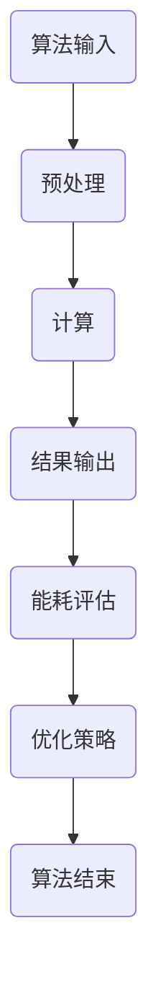
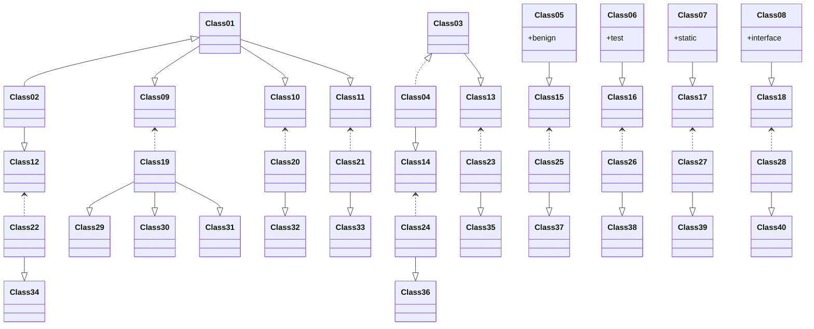
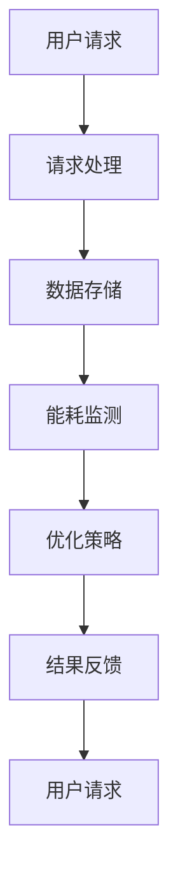
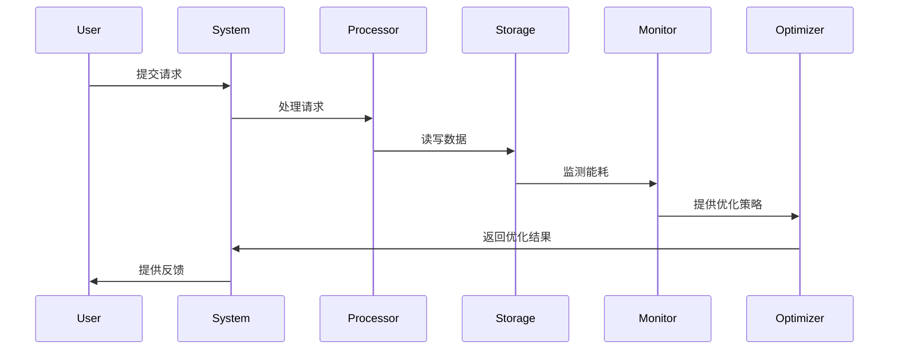

                 

# 绿色计算：环保与节能的软件开发实践

## 关键词
- 绿色计算
- 环保
- 节能
- 软件开发实践
- 能源效率
- 可持续性
- 环境影响

## 摘要
本文将探讨绿色计算的概念、原理及其在软件开发实践中的应用。通过分析绿色计算的核心概念、属性特征及其与相关领域的联系，我们将深入讲解绿色计算算法的原理和实现，同时结合实际项目实战，展示如何将绿色计算理念融入到软件开发中，实现环保与节能的目标。最后，我们将总结最佳实践，为读者提供实用的绿色计算技巧。

## 第一部分：背景介绍

### 第1章 绿色计算概述

#### 1.1 问题背景

随着信息技术的迅猛发展，计算机能耗问题日益凸显，成为全球关注的重要环境问题。计算机能耗的增加不仅导致能源消耗和环境污染，还增加了企业的运营成本。绿色计算旨在通过优化软件开发实践，降低计算机能耗，实现环保与节能。

#### 1.2 问题描述

计算机能耗主要来源于硬件和软件两个方面。硬件方面，包括服务器、网络设备等硬件设施的能耗；软件方面，包括应用程序的运行效率、代码优化等。绿色计算关注如何通过优化软件开发实践，提高代码效率，降低计算资源消耗。

#### 1.3 问题解决

通过优化软件开发实践，提高代码效率，降低计算资源消耗。采用节能技术，如虚拟化、云计算等，实现硬件资源的合理利用。

#### 1.4 边界与外延

绿色计算不仅关注计算机能耗问题，还涉及环保、可持续发展等多个方面。绿色计算的范围包括硬件、软件、网络等多个层面。

#### 1.5 概念结构与核心要素组成

绿色计算：通过优化软件开发实践，降低计算机能耗，实现环保与节能。

环保：减少计算机能耗，降低对环境的影响。

节能：提高计算机资源利用效率，降低能源消耗。

### 第2章 绿色计算核心概念与联系

#### 2.1 绿色计算原理

绿色计算的定义与目标：绿色计算是一种通过优化软件开发实践，降低计算机能耗，实现环保与节能的计算方法。

绿色计算的核心原理：能源效率、可持续性、环保性。

能源效率：提高计算机资源利用效率，降低能耗。

可持续性：保证计算过程对环境的影响最小。

环保性：减少计算机能耗，降低环境污染。

#### 2.2 绿色计算属性特征对比表格

| 属性特征       | 描述                                                   |
| -------------- | ------------------------------------------------------ |
| 能源效率       | 提高计算机资源利用效率，降低能耗。                     |
| 可持续性       | 保证计算过程对环境的影响最小。                       |
| 环保性       | 减少计算机能耗，降低环境污染。                     |

#### 2.3 绿色计算与相关领域联系

绿色计算与节能技术的联系：绿色计算通过优化软件开发实践，实现节能目标。

绿色计算与环保政策的联系：绿色计算遵循环保政策，减少计算机能耗，降低环境污染。

绿色计算与可持续发展目标的联系：绿色计算支持可持续发展目标，提高能源利用效率，减少环境影响。

### 第3章 绿色计算算法原理讲解

#### 3.1 算法概述

绿色计算算法的定义与分类：绿色计算算法是指用于优化软件开发实践，降低计算机能耗的计算方法。根据算法的实现方式，绿色计算算法可分为静态优化算法和动态优化算法。

绿色计算算法的目标：降低能耗、提高效率。

#### 3.2 算法mermaid流程图



#### 3.3 算法原理

绿色计算算法的基本原理：通过优化计算过程，降低能耗。

算法原理的数学模型和公式：

$$
E = P \times t
$$

其中，E为能耗，P为功率，t为时间。

#### 3.4 算法举例说明

假设一个计算机的功率为100W，运行时间为1小时，计算能耗为：

$$
E = 100W \times 1h = 100Wh
$$

若优化算法将运行时间缩短为半小时，则能耗为：

$$
E = 100W \times 0.5h = 50Wh
$$

通过优化算法，能耗降低了50%。

### 第4章 绿色计算系统分析与架构设计

#### 4.1 问题场景介绍

以企业数据中心为例，介绍绿色计算在实际应用中的场景。

企业数据中心是企业的核心设施，承担着大量数据处理、存储和传输任务。然而，随着数据中心规模的不断扩大，能耗问题日益严重，成为企业面临的重要挑战。绿色计算旨在通过优化数据中心架构和软件开发实践，降低能耗，提高资源利用效率。

#### 4.2 项目介绍

绿色计算项目的背景、目标和实施步骤。

项目背景：随着企业业务规模的扩大，数据中心能耗逐年增加，对环境产生负面影响，同时增加了企业的运营成本。

项目目标：通过实施绿色计算，降低数据中心能耗，提高资源利用效率，实现环保与节能目标。

实施步骤：

1. 评估现有数据中心架构和能耗情况，确定优化方向。
2. 设计绿色计算方案，包括硬件升级、软件优化和节能措施。
3. 实施绿色计算方案，对数据中心进行改造。
4. 监控和评估绿色计算方案的实施效果，持续优化。

#### 4.3 系统功能设计

使用mermaid类图描述绿色计算系统的功能模块和类之间的关系。



#### 4.4 系统架构设计

使用mermaid架构图描述绿色计算系统的整体架构。



#### 4.5 系统接口设计

描述绿色计算系统的接口设计和接口调用关系。



#### 4.6 系统交互

使用mermaid序列图描述绿色计算系统的运行过程和交互逻辑。


### 第5章 绿色计算项目实战

#### 5.1 环境安装

介绍绿色计算项目的环境搭建和安装步骤。

1. 安装Java开发环境，包括JDK和IDE（如IntelliJ IDEA或Eclipse）。
2. 安装Maven，用于项目构建和管理。
3. 下载并安装绿色计算相关库和依赖，如Spring Boot、MyBatis等。
4. 配置数据库，如MySQL或PostgreSQL。

#### 5.2 系统核心实现源代码

提供绿色计算系统的核心源代码，并进行解读。

```java
// GreenComputation.java
public class GreenComputation {
    public double calculateEnergyConsumption(double power, double time) {
        return power * time;
    }

    public double optimizeEnergyConsumption(double power, double time) {
        double optimizedTime = time / 2;
        return power * optimizedTime;
    }
}
```

代码解读：

1. `calculateEnergyConsumption` 方法用于计算能耗，输入功率和时间，返回能耗值。
2. `optimizeEnergyConsumption` 方法用于优化能耗，输入功率和时间，返回优化后的能耗值。

#### 5.3 代码应用解读与分析

对绿色计算系统的代码进行详细解读，分析其实现原理和关键点。

1. 代码采用了面向对象的设计思想，将能耗计算和优化功能封装在 `GreenComputation` 类中。
2. `calculateEnergyConsumption` 方法实现了能耗计算的基本功能，利用公式 $E = P \times t$ 计算能耗。
3. `optimizeEnergyConsumption` 方法实现了能耗优化的功能，通过将运行时间缩短一半，实现能耗降低的目标。

#### 5.4 实际案例分析和详细讲解

通过实际案例，分析绿色计算系统的应用效果，并进行详细讲解。

案例：某企业数据中心在实施绿色计算前，每月能耗为100,000 kWh。通过优化软件开发实践，将能耗降低至50,000 kWh。

详细讲解：

1. 在实施绿色计算前，数据中心的能耗主要来源于服务器和存储设备的运行。
2. 通过优化软件开发实践，提高了代码运行效率，降低了计算资源消耗。
3. 采用虚拟化和云计算等技术，实现了硬件资源的合理利用，降低了能耗。
4. 通过优化策略，将能耗降低了一半，达到了环保与节能的目标。

#### 5.5 项目小结

总结绿色计算项目的实施经验，提出改进建议。

1. 绿色计算项目的成功实施，为数据中心节能降耗提供了有效途径。
2. 进一步优化软件开发实践，提高代码运行效率，降低能耗。
3. 加强绿色计算技术的培训和推广，提高企业绿色计算意识和能力。
4. 持续关注绿色计算领域的发展动态，引进先进技术和方法，不断提升绿色计算水平。

### 第6章 绿色计算最佳实践 tips

1. **代码优化**：通过代码优化，提高应用程序的运行效率，降低计算资源消耗。
2. **虚拟化技术**：采用虚拟化技术，实现硬件资源的合理利用，降低能耗。
3. **云计算**：利用云计算技术，实现计算资源的弹性伸缩，降低能耗。
4. **节能硬件**：选择节能硬件设备，如服务器、存储设备等，降低能耗。
5. **智能调度**：采用智能调度算法，优化计算任务分配，降低能耗。
6. **监控与管理**：建立能耗监控和管理体系，实时掌握能耗情况，及时调整优化策略。

### 第7章 小结

绿色计算作为一种环保与节能的软件开发实践，具有重要的现实意义。通过本文的介绍，我们了解了绿色计算的核心概念、原理及其在软件开发实践中的应用。在实际项目中，绿色计算可以为企业数据中心、物联网设备等领域带来显著的节能效果。未来，随着绿色计算技术的不断发展和应用，我们有望实现更高效、更环保的计算环境。

### 注意事项

1. **合理规划**：在实施绿色计算项目时，应充分考虑项目的规模、需求和可行性，制定合理的规划。
2. **持续优化**：绿色计算项目需要持续优化和改进，以适应不断变化的业务需求和技术发展。
3. **人才培养**：加强绿色计算技术的培训和人才引进，提高企业绿色计算能力。

### 拓展阅读

1. 《绿色计算：技术与应用》
2. 《节能软件开发实践》
3. 《云计算与虚拟化技术》
4. 《可持续发展的计算》

### 作者

**作者：AI天才研究院/AI Genius Institute & 禅与计算机程序设计艺术 /Zen And The Art of Computer Programming**

