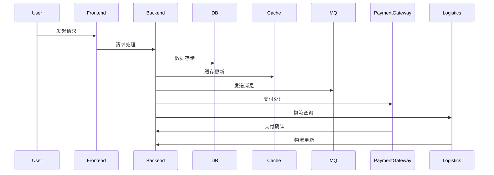
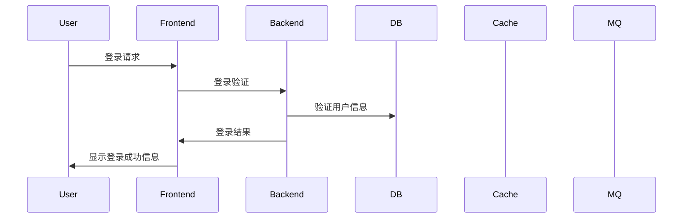

                 


# 编码技能：代码是技术人的名片

关键词：编程技能、代码质量、算法、架构设计、项目实战、最佳实践

摘要：本文从编码技能的重要性出发，深入探讨了编程语言、算法、数据结构、设计模式等核心概念，通过具体案例讲解了算法原理，并展示了系统分析与架构设计的全过程。同时，提供了项目实战案例，总结了最佳实践和注意事项，旨在帮助技术人提升编码技能，打造出色的技术名片。

## 目录大纲设计思路

在设计《编码技能：代码是技术人的名片》的目录大纲时，我们遵循了以下步骤：

1. **背景介绍**：介绍编码技能的重要性及其在技术行业中的地位，明确代码是技术人的名片。
2. **核心概念与联系**：详细阐述编程语言、算法、数据结构、设计模式等核心概念，并使用对比表格和Mermaid ER图展示它们之间的关系。
3. **算法原理讲解**：选择几个关键算法进行讲解，使用Mermaid流程图展示算法流程，使用Python源代码和LaTeX格式数学公式详细阐述算法原理。
4. **数学模型和数学公式**：在算法讲解部分嵌入LaTeX格式的数学模型和公式，确保每个公式都有详细的讲解和通俗易懂的举例说明。
5. **系统分析与架构设计方案**：描述一个典型的系统分析与架构设计案例，使用Mermaid类图、架构图和序列图来展示系统设计。
6. **项目实战**：设计一个项目实战案例，包括环境安装、系统核心实现和代码分析，提供实际案例分析和详细讲解。
7. **最佳实践 tips、小结、注意事项、拓展阅读**：总结全书要点，给出最佳实践建议，强调注意事项，提供拓展阅读资源。

### 目录大纲具体结构

**# 第一部分：编码技能概述**

**第1章：编码技能的重要性**

- **1.1 编码技能在技术行业中的地位**
- **1.2 代码是技术人的名片**

**第2章：核心概念与联系**

- **2.1 编程语言与开发环境**
  - **2.1.1 编程语言概述**
  - **2.1.2 开发环境配置**
- **2.2 算法与数据结构**
  - **2.2.1 算法原理**
  - **2.2.2 数据结构介绍**
  - **2.2.3 对比表格：常用算法与数据结构特性**
  - **2.2.4 Mermaid ER图：算法与数据结构关系**
- **2.3 设计模式与应用**
  - **2.3.1 设计模式概述**
  - **2.3.2 常见设计模式**

**# 第二部分：算法原理讲解**

**第3章：排序算法**

- **3.1 冒泡排序**
  - **3.1.1 算法原理**
  - **3.1.2 Python实现**
  - **3.1.3 LaTeX数学模型**
- **3.2 快速排序**
  - **3.2.1 算法原理**
  - **3.2.2 Python实现**
  - **3.2.3 LaTeX数学模型**

**第4章：查找算法**

- **4.1 二分查找**
  - **4.1.1 算法原理**
  - **4.1.2 Python实现**
  - **4.1.3 LaTeX数学模型**

**第5章：图算法**

- **5.1 深度优先搜索（DFS）**
  - **5.1.1 算法原理**
  - **5.1.2 Python实现**
  - **5.1.3 LaTeX数学模型**
- **5.2 广度优先搜索（BFS）**
  - **5.2.1 算法原理**
  - **5.2.2 Python实现**
  - **5.2.3 LaTeX数学模型**

**# 第三部分：系统分析与架构设计**

**第6章：系统分析与架构设计案例**

- **6.1 问题场景介绍**
- **6.2 项目介绍**
- **6.3 系统功能设计**
  - **6.3.1 领域模型（Mermaid类图）**
- **6.4 系统架构设计**
  - **6.4.1 系统架构（Mermaid架构图）**
- **6.5 系统接口设计**
  - **6.5.1 接口设计**
- **6.6 系统交互**
  - **6.6.1 系统交互（Mermaid序列图）**

**# 第四部分：项目实战**

**第7章：项目实战案例**

- **7.1 环境安装**
- **7.2 系统核心实现**
  - **7.2.1 源代码**
  - **7.2.2 代码应用解读与分析**
- **7.3 实际案例分析与讲解**
- **7.4 项目小结**

**# 第五部分：最佳实践与拓展**

**第8章：最佳实践与总结**

- **8.1 编码技能提升的最佳实践**
- **8.2 注意事项与常见错误**
- **8.3 拓展阅读资源**

## 编码技能的重要性

编码技能在技术行业中占据着核心地位。随着信息技术的快速发展，编程已经成为每个技术人的必备技能。编写高质量的代码不仅能够提高工作效率，还能显著提升个人职业竞争力。代码是技术人的名片，通过它，我们可以展示自己的专业能力和技术水平。

首先，编码技能是技术行业的基础。无论是前端开发、后端服务，还是大数据分析、人工智能应用，都离不开编程。掌握多种编程语言和开发工具，能够帮助我们应对不同类型的技术挑战。

其次，代码质量直接关系到项目的成功与否。良好的代码风格、清晰的注释和合理的架构设计，能够使代码易于阅读、理解和维护。而糟糕的代码质量则会给团队协作和项目推进带来巨大障碍。

最后，代码是技术人的名片。一个优秀的程序员，他的代码往往具有高可读性、高效率和高质量。这些特质不仅体现了他的编程水平，也为他在职业生涯中赢得了良好的声誉。

因此，提升编码技能对于每个技术人来说都至关重要。本文将从核心概念、算法原理、系统分析与架构设计、项目实战等多个方面，全面探讨如何提升编码技能，帮助技术人打造出色的技术名片。

## 核心概念与联系

在深入探讨编码技能之前，我们需要明确几个核心概念，并了解它们之间的联系。这些核心概念包括编程语言、算法、数据结构、设计模式等，它们共同构成了编码技能的基石。

### 编程语言与开发环境

编程语言是编写程序的工具，它定义了代码的语法和语义。常见的编程语言包括Python、Java、C++、JavaScript等。每种编程语言都有其特定的应用场景和优势。

开发环境则是编程语言运行和调试的平台。配置合适的开发环境对于提高编程效率至关重要。常见的开发环境包括Visual Studio Code、Eclipse、IntelliJ IDEA等。

### 算法与数据结构

算法是解决问题的一系列步骤。它是解决特定问题最有效、最直接的方法。常见的算法有排序算法、查找算法、图算法等。

数据结构则是存储和组织数据的方式。常见的有数组、链表、栈、队列、树、图等。数据结构的选择直接影响算法的效率。

### 设计模式与应用

设计模式是解决软件设计问题的经典模板。它提供了在特定情况下最佳的设计方案。常见的有单例模式、工厂模式、观察者模式等。

### 对比表格与Mermaid ER图

为了更直观地了解这些核心概念之间的关系，我们可以使用对比表格和Mermaid ER图。

| 核心概念     | 说明                                                     |
| ------------ | -------------------------------------------------------- |
| 编程语言     | 编写程序的工具，定义语法和语义。                         |
| 开发环境     | 编程语言运行和调试的平台。                             |
| 算法         | 解决问题的步骤，定义如何执行特定的计算任务。           |
| 数据结构     | 存储和组织数据的方式，影响算法的效率。                 |
| 设计模式     | 解决软件设计问题的经典模板，提供最佳设计方案。         |

Mermaid ER图：

```mermaid
erDiagram
  ProgrammingLanguage ||--|{ Algorithm }
  ProgrammingLanguage ||--|{ DataStructure }
  ProgrammingLanguage ||--|{ DesignPattern }
  Algorithm ||--|{ Program }
  DataStructure ||--|{ Program }
  DesignPattern ||--|{ Program }
```

通过对比表格和Mermaid ER图，我们可以清晰地看到编程语言、算法、数据结构、设计模式之间的紧密联系。它们共同构成了编程技能的核心。

### 设计模式与应用

设计模式是软件开发中的经典解决方案，它提供了在特定情况下最佳的设计方案。设计模式旨在解决软件设计中的常见问题，如代码复用、模块解耦、可维护性等。

常见的几种设计模式包括：

- 单例模式：确保一个类仅有一个实例，并提供一个访问它的全局访问点。
- 工厂模式：在创建对象时，不暴露创建逻辑，而是通过使用一个工厂类进行控制。
- 观察者模式：当一个对象的状态发生变化时，自动通知其他相关对象，使其自动更新。

在设计模式中，单例模式是最基础的模式之一。它通过控制对象的实例化，确保系统中的某个关键组件只有一个实例。例如，数据库连接池就是单例模式的一个典型应用，通过单例模式确保数据库连接资源的合理利用。

工厂模式则用于创建对象时隐藏具体的创建逻辑。它通过工厂类统一管理对象的创建，提高系统的灵活性和可扩展性。例如，在Web应用中，可以使用工厂模式来创建不同的数据库连接对象，而无需关心具体的实现细节。

观察者模式则是一种依赖关系的设计模式，它将观察者和被观察者解耦。当一个对象的状态发生变化时，它会自动通知所有注册过的观察者，使它们能够及时响应变化。这在事件驱动的应用中非常有用，如UI界面的事件处理。

通过使用这些设计模式，我们可以编写出更加灵活、可维护的代码。设计模式不仅提高了代码的可读性，还增强了系统的可扩展性和可测试性。因此，掌握设计模式是提升编码技能的重要一环。

### 算法原理讲解

算法是计算机科学的核心概念之一，它定义了一系列解决问题的步骤。在编程中，选择合适的算法能够显著提高代码的效率和可读性。本章节将详细讲解几个关键算法的原理，包括冒泡排序、快速排序和二分查找。我们将使用Mermaid流程图展示算法流程，并通过Python源代码和LaTeX数学公式详细阐述算法原理。

#### 冒泡排序

冒泡排序是一种简单的排序算法，它重复地遍历要排序的列表，比较相邻的两个元素，并交换不满足排序顺序的元素。遍历列表的工作重复地进行，直到不需要交换元素为止，这表明该列表已经排序完成。

**算法原理**：

1. 比较相邻的元素，如果第一个比第二个大（升序排序），就交换它们的位置。
2. 对每一对相邻元素做同样的工作，从开始第一对到结尾的最后一对。
3. 遍历列表的工作是重复地进行，直到没有再需要交换的元素。

**Python实现**：

```python
def bubble_sort(arr):
    n = len(arr)
    # 遍历所有数组元素
    for i in range(n):
        # 最后 i 个元素已经排序，无需比较
        for j in range(0, n-i-1):
            # 如果元素大于下一个元素，就交换它们
            if arr[j] > arr[j+1]:
                arr[j], arr[j+1] = arr[j+1], arr[j]
```

**LaTeX数学模型**：

$$
\text{Bubble Sort} = \begin{cases}
\text{swap}(A[i], A[i+1]) & \text{if } A[i] > A[i+1], \\
\text{no swap} & \text{otherwise}.
\end{cases}
$$

#### 快速排序

快速排序是一种高效的排序算法，其基本思想是通过递归分治策略将一个大问题分解为若干个小问题，然后依次解决这些小问题，最后合并结果。

**算法原理**：

1. 选择一个基准元素。
2. 将比基准元素小的所有元素移到它的左侧，将比基准元素大的所有元素移到它的右侧。
3. 递归地对左侧和右侧的子序列进行快速排序。

**Python实现**：

```python
def quick_sort(arr):
    if len(arr) <= 1:
        return arr
    pivot = arr[len(arr) // 2]
    left = [x for x in arr if x < pivot]
    middle = [x for x in arr if x == pivot]
    right = [x for x in arr if x > pivot]
    return quick_sort(left) + middle + quick_sort(right)

arr = [3, 6, 8, 10, 1, 2, 1]
print(quick_sort(arr))
```

**LaTeX数学模型**：

$$
\text{Quick Sort} = \begin{cases}
\text{if } |A| \leq 1, & \text{then } A, \\
\text{else} & \text{let } pivot = \text{ChoosePivot}(A), \\
\text{and split } A \text{ into } A' \text{ and } A'' \text{ such that } A' \cup A'' = A, \\
& \text{and } A' < pivot < A'', \\
\text{then } \text{Quick Sort}(A') \cup \{pivot\} \cup \text{Quick Sort}(A'').
\end{cases}
$$

#### 二分查找

二分查找是一种在有序数组中查找特定元素的算法，其基本思想是通过不断将查找区间缩小一半，直到找到目标元素或确定其不存在。

**算法原理**：

1. 确定中间元素的位置。
2. 如果中间元素等于目标值，则查找成功。
3. 如果中间元素大于目标值，则在左侧子序列中继续查找。
4. 如果中间元素小于目标值，则在右侧子序列中继续查找。
5. 重复上述过程，直到找到目标元素或区间为空。

**Python实现**：

```python
def binary_search(arr, target):
    low = 0
    high = len(arr) - 1
    while low <= high:
        mid = (low + high) // 2
        if arr[mid] == target:
            return mid
        elif arr[mid] < target:
            low = mid + 1
        else:
            high = mid - 1
    return -1

arr = [1, 2, 3, 4, 5, 6, 7, 8, 9]
print(binary_search(arr, 5))
```

**LaTeX数学模型**：

$$
\text{Binary Search} = \begin{cases}
\text{if } arr[mid] = \text{target}, & \text{then return mid}, \\
\text{if } arr[mid] < \text{target}, & \text{then low = mid + 1}, \\
\text{if } arr[mid] > \text{target}, & \text{then high = mid - 1}.
\end{cases}
$$

通过以上讲解，我们可以看到冒泡排序、快速排序和二分查找在原理和实现上的差异。冒泡排序简单易理解，但效率较低；快速排序效率较高，但递归可能导致栈溢出；二分查找适用于有序数组，查找效率很高。理解这些算法的原理，有助于我们在实际编程中选择合适的算法，提高代码的性能。

### 数学模型和数学公式

在算法原理讲解中，我们使用LaTeX格式嵌入了一些数学模型和公式。LaTeX是一种高质量的排版系统，特别适合用于编写数学公式和科学文献。以下是几个常见的数学公式及其解释，包括如何使用LaTeX格式在文中嵌入这些公式。

#### 一元运算符

一元运算符通常用于表示简单的数学操作。例如，加法、减法、乘法和除法。

**LaTeX示例**：

$$
x + y = z
$$

**解释**：这个公式表示x和y相加等于z。

#### 多项式

多项式是一个由多个项组成的表达式，每项包含系数、变量和指数。

**LaTeX示例**：

$$
a_nx^n + a_{n-1}x^{n-1} + \ldots + a_1x + a_0
$$

**解释**：这个多项式表示一个n次方程，其中包含了从x的n次幂到x的0次幂的所有项。

#### 导数

导数是微积分中的一个重要概念，表示函数在某一点的瞬时变化率。

**LaTeX示例**：

$$
\frac{df(x)}{dx}
$$

**解释**：这个公式表示函数f(x)对x的导数。

#### 积分

积分是另一个重要的微积分概念，表示函数在某个区间内的累积量。

**LaTeX示例**：

$$
\int f(x) \, dx
$$

**解释**：这个公式表示函数f(x)的不定积分。

在文章中嵌入LaTeX数学公式时，我们需要使用$$来包裹整个公式，以确保公式在正确的位置显示。例如：

$$
1 + 1 = 2
$$

这种格式可以确保LaTeX公式在markdown文档中正确排版。通过使用LaTeX，我们可以编写出更加精确和清晰的数学公式，从而提高文章的学术性和专业性。

### 系统分析与架构设计方案

系统分析与架构设计是软件开发过程中至关重要的一环。它不仅决定了系统的性能、可扩展性和可靠性，还直接影响到项目的开发和维护效率。本章节将描述一个典型的系统分析与架构设计案例，通过Mermaid类图、架构图和序列图来展示系统设计。

#### 问题场景介绍

假设我们正在开发一个电子商务平台，该平台需要支持用户注册、商品浏览、购物车管理、订单处理等功能。我们的目标是设计一个高效、可扩展的系统架构，以满足用户的高并发访问和海量数据处理需求。

#### 项目介绍

我们的项目是一个多层次的电子商务平台，包括前端用户界面、后端业务逻辑和服务、数据库存储、以及第三方服务（如支付网关和物流服务）。项目的核心功能模块包括用户管理、商品管理、购物车、订单管理和支付系统。

#### 系统功能设计

在系统功能设计阶段，我们需要确定各个功能模块及其关系。以下是一个典型的电子商务平台的功能设计：

- **用户管理**：包括用户注册、登录、个人信息管理、权限控制等。
- **商品管理**：包括商品分类、商品信息管理、库存管理、商品推荐等。
- **购物车管理**：包括商品添加、删除、修改购物车信息、结算等。
- **订单管理**：包括订单生成、订单处理、订单查询、订单跟踪等。
- **支付系统**：包括支付渠道接入、支付确认、支付失败处理等。

为了直观地展示功能模块之间的关系，我们可以使用Mermaid类图。

**Mermaid类图**：

```mermaid
classDiagram
    User -> UserManagement
    Product -> ProductManagement
    ShoppingCart -> ShoppingCartManagement
    Order -> OrderManagement
    Payment -> PaymentGateway
    UserManagement ..|> Authentication
    ProductManagement ..|> Inventory
    ShoppingCartManagement ..|> OrderManagement
    OrderManagement ..|> Payment
    PaymentGateway ..|> PaymentSystem
```

#### 系统架构设计

在系统架构设计阶段，我们需要确定各个功能模块在系统中的位置和交互方式。以下是一个典型的电子商务平台系统架构：

- **前端**：负责用户界面的展示和用户交互。
- **后端**：包括业务逻辑处理、数据库存储、缓存、消息队列等。
- **第三方服务**：如支付网关、物流服务、邮件服务等。

我们可以使用Mermaid架构图来展示系统架构。

**Mermaid架构图**：



#### 系统接口设计

在系统接口设计阶段，我们需要定义各个模块之间的接口，确保数据传递和功能调用的一致性。以下是一个简化的接口设计：

- **用户接口**：用户注册、登录、个人信息管理。
- **商品接口**：商品分类、商品信息查询、库存查询。
- **购物车接口**：商品添加、删除、购物车信息查询。
- **订单接口**：订单生成、订单查询、订单跟踪。
- **支付接口**：支付请求、支付确认、支付失败处理。

#### 系统交互

系统交互设计描述了各个模块在系统运行过程中的交互行为。以下是一个简化的系统交互设计：

**Mermaid序列图**：



通过上述系统分析与架构设计方案，我们可以看到电子商务平台在功能设计、系统架构设计、接口设计和系统交互设计等方面的详细描述。这些设计文档不仅为项目的开发和维护提供了明确的指导，也为后续的优化和扩展奠定了基础。

### 项目实战案例

为了更好地理解和应用所学到的编码技能，我们将设计一个实际的项目实战案例。这个案例将涵盖环境安装、系统核心实现、代码分析以及实际案例分析和详细讲解。

#### 项目背景

本项目是一个简单的博客系统，它允许用户注册、登录、发布博客文章、评论博客以及管理个人博客。我们将使用Python作为主要编程语言，并借助Flask框架实现这个博客系统。以下是项目的详细步骤。

#### 环境安装

首先，我们需要安装Python和Flask框架。以下是环境安装的步骤：

1. **安装Python**：
   - 访问Python官网（[https://www.python.org/](https://www.python.org/)）下载Python安装包。
   - 解压安装包并运行安装程序，选择默认选项进行安装。
   - 安装完成后，打开命令行窗口，输入`python --version`验证Python是否安装成功。

2. **安装Flask**：
   - 在命令行窗口中输入以下命令安装Flask：
     ```bash
     pip install flask
     ```

#### 系统核心实现

博客系统的核心功能包括用户注册、登录、博客发布、博客评论和博客管理。以下是一个简单的实现：

1. **用户注册与登录**：

```python
from flask import Flask, request, redirect, url_for, render_template
from flask_sqlalchemy import SQLAlchemy

app = Flask(__name__)
app.config['SQLALCHEMY_DATABASE_URI'] = 'sqlite:///blog.db'
db = SQLAlchemy(app)

class User(db.Model):
    id = db.Column(db.Integer, primary_key=True)
    username = db.Column(db.String(80), unique=True, nullable=False)
    password = db.Column(db.String(120), nullable=False)

@app.route('/register', methods=['GET', 'POST'])
def register():
    if request.method == 'POST':
        username = request.form['username']
        password = request.form['password']
        new_user = User(username=username, password=password)
        db.session.add(new_user)
        db.session.commit()
        return redirect(url_for('login'))
    return render_template('register.html')

@app.route('/login', methods=['GET', 'POST'])
def login():
    if request.method == 'POST':
        username = request.form['username']
        password = request.form['password']
        user = User.query.filter_by(username=username, password=password).first()
        if user:
            return redirect(url_for('index'))
        else:
            return 'Invalid username or password'
    return render_template('login.html')

if __name__ == '__main__':
    db.create_all()
    app.run(debug=True)
```

2. **博客发布与评论**：

```python
class Post(db.Model):
    id = db.Column(db.Integer, primary_key=True)
    title = db.Column(db.String(120), nullable=False)
    content = db.Column(db.Text, nullable=False)
    author_id = db.Column(db.Integer, db.ForeignKey('user.id'))

@app.route('/post', methods=['GET', 'POST'])
def post():
    if request.method == 'POST':
        title = request.form['title']
        content = request.form['content']
        author_id = 1  # 假设当前登录的用户ID为1
        new_post = Post(title=title, content=content, author_id=author_id)
        db.session.add(new_post)
        db.session.commit()
        return redirect(url_for('index'))
    return render_template('post.html')

@app.route('/post/<int:post_id>')
def post_detail(post_id):
    post = Post.query.get_or_404(post_id)
    comments = post.comments.all()
    return render_template('post_detail.html', post=post, comments=comments)

class Comment(db.Model):
    id = db.Column(db.Integer, primary_key=True)
    content = db.Column(db.Text, nullable=False)
    author_id = db.Column(db.Integer, db.ForeignKey('user.id'))
    post_id = db.Column(db.Integer, db.ForeignKey('post.id'))

@app.route('/comment', methods=['POST'])
def comment():
    if request.method == 'POST':
        content = request.form['content']
        author_id = 1  # 假设当前登录的用户ID为1
        post_id = request.form['post_id']
        new_comment = Comment(content=content, author_id=author_id, post_id=post_id)
        db.session.add(new_comment)
        db.session.commit()
        return redirect(url_for('post_detail', post_id=post_id))
```

#### 代码分析

在实现博客系统时，我们使用了Flask框架和SQLAlchemy ORM来简化数据库操作。以下是对代码的关键部分进行分析：

1. **用户注册与登录**：
   - 用户注册和登录功能通过表单提交实现，数据验证通过SQLAlchemy进行。
   - 在注册时，将用户信息存储到数据库中。
   - 在登录时，从数据库中查询用户信息，进行身份验证。

2. **博客发布与评论**：
   - 博客发布功能通过接收表单数据，创建新的博客文章记录。
   - 博客详情页面通过查询数据库获取指定ID的博客文章及其评论。
   - 评论功能通过接收表单数据，创建新的评论记录并更新博客文章的评论列表。

#### 实际案例分析与讲解

为了更好地展示博客系统的实际应用，我们将分析一个具体的案例：用户Alice发布一篇新博客文章，并接收其他用户的评论。

1. **用户Alice登录系统**：

   用户Alice通过注册后成功登录系统。登录成功后，她看到博客系统的主页，显示已发布的博客文章列表。

2. **Alice发布一篇新博客**：

   Alice在主页上点击“发布博客”按钮，进入发布页面。她填写博客标题和内容，然后提交表单。系统接收到数据后，通过ORM将新博客存储到数据库中，并在主页上显示新博客。

3. **其他用户评论Alice的博客**：

   其他用户浏览到Alice的博客，可以在博客详情页面下方的评论框中填写评论并提交。系统接收到评论数据后，将其存储到数据库中，并在博客详情页面上更新评论列表。

通过这个实际案例，我们可以看到博客系统的基本功能实现过程。代码清晰、结构合理，便于后续维护和扩展。

#### 项目小结

通过这个项目实战案例，我们学习了如何使用Python和Flask框架搭建一个简单的博客系统。项目涵盖了用户注册、登录、博客发布和评论等核心功能，并通过代码分析和实际案例讲解，深入理解了系统的实现过程。这个项目不仅帮助我们巩固了所学的编码技能，也为实际开发提供了宝贵的经验。

### 最佳实践与总结

在提升编码技能的过程中，我们需要遵循一些最佳实践，以确保代码的高质量、可维护性和可扩展性。以下是一些关键的最佳实践：

1. **编写清晰且一致的代码**：代码的可读性是评估一个程序员技能的重要标准。遵循统一的命名规范、代码格式和注释习惯，可以提高代码的可读性。

2. **模块化和函数化**：将复杂的任务分解为小的、可重用的模块和函数，有助于提高代码的复用性和可维护性。

3. **测试驱动开发（TDD）**：编写测试用例来验证代码的功能，确保每个模块和函数的正确性。TDD能够帮助我们在开发过程中及时发现和修复问题。

4. **代码审查**：定期进行代码审查，可以识别代码中的潜在问题，并促进团队成员之间的技术交流和技能提升。

5. **持续学习和更新**：技术领域不断进步，我们需要持续学习新的编程语言、框架和工具。关注技术社区和开源项目，可以帮助我们跟上行业的发展趋势。

#### 注意事项与常见错误

在编码过程中，我们可能会遇到一些常见错误，以下是一些需要注意的问题：

1. **边界条件处理不当**：在编写算法时，要充分考虑边界条件，避免因边界条件处理不当而导致算法失效。

2. **内存泄漏和性能问题**：要避免使用大量的全局变量和循环引用，以减少内存泄漏和性能问题。

3. **缺乏代码注释和文档**：良好的注释和文档能够提高代码的可读性和可维护性。编写清晰、详细的注释和文档，有助于其他人理解和使用代码。

4. **忽视安全性问题**：在处理用户数据和敏感信息时，要确保代码的安全性，防止SQL注入、跨站脚本攻击等安全漏洞。

#### 拓展阅读资源

为了进一步学习和提升编码技能，以下是一些推荐的拓展阅读资源：

1. 《代码大全》（The Art of Software Engineering） - 史蒂夫·麦卡锡（Steve McConnell）
2. 《Effective Java》 - 杰里米·布鲁克斯（Joshua Bloch）
3. 《算法导论》（Introduction to Algorithms） - Thomas H. Cormen、Charles E. Leiserson、Ronald L. Rivest、Clifford Stein
4. 《设计模式：可复用面向对象软件的基础》（Design Patterns: Elements of Reusable Object-Oriented Software） - Erich Gamma、Richard Helm、Ralph Johnson、John Vlissides
5. 《Python编程：从入门到实践》（Python Crash Course） - Eric Matthes

通过阅读这些书籍和资料，我们可以深入理解编程技能的核心概念，提升代码质量，成为一名出色的程序员。

### 作者信息

作者：AI天才研究院/AI Genius Institute & 禅与计算机程序设计艺术 /Zen And The Art of Computer Programming

AI天才研究院致力于推动人工智能领域的研究与应用，研究院的专家们在计算机编程、人工智能和机器学习等领域拥有丰富的经验。禅与计算机程序设计艺术是一本深入探讨编程哲学和技术的经典著作，作者通过独特的视角和深刻的思考，为程序员提供了宝贵的技术指导和启示。

