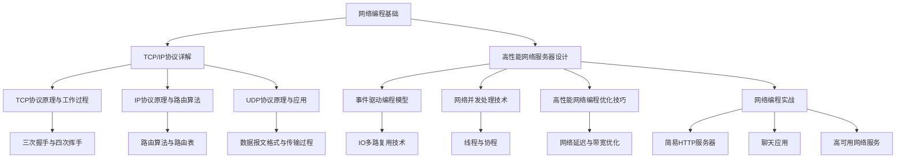

                 


### 网络编程：构建高性能服务器应用

---

## 关键词

- 网络编程
- 高性能服务器
- TCP/IP协议
- 事件驱动编程
- 网络并发处理

---

## 摘要

本文深入探讨了网络编程的核心概念、TCP/IP协议的原理、高性能网络服务器的架构设计以及高级网络编程技术。通过详细的原理讲解、流程图分析、代码示例和实战项目，帮助读者理解并掌握构建高性能网络服务器的关键技术和实践方法。

---

## 目录大纲

### 第一部分：网络编程基础

### 第1章：网络编程概述
#### 1.1 网络编程基础
#### 1.2 网络协议与通信模型
#### 1.3 网络编程常用库和框架

### 第2章：TCP/IP协议详解
#### 2.1 TCP/IP协议栈结构
#### 2.2 TCP协议原理与工作过程
#### 2.3 IP协议原理与路由算法
#### 2.4 UDP协议原理与应用

### 第3章：高性能网络服务器设计
#### 3.1 网络服务器架构
#### 3.2 事件驱动编程模型
#### 3.3 网络并发处理技术
#### 3.4 高性能网络编程优化技巧

### 第二部分：高级网络编程技术

### 第4章：网络安全性
#### 4.1 网络安全基础
#### 4.2 加密技术
#### 4.3 认证与授权机制
#### 4.4 防火墙与入侵检测

### 第5章：网络监控与性能优化
#### 5.1 网络监控工具
#### 5.2 性能优化策略
#### 5.3 常见性能瓶颈分析
#### 5.4 性能测试与调优实践

### 第6章：分布式网络编程
#### 6.1 分布式系统基础
#### 6.2 网络协议与分布式算法
#### 6.3 分布式存储与计算
#### 6.4 分布式网络编程框架

### 第7章：网络编程实战
#### 7.1 实战项目一：构建简易HTTP服务器
#### 7.2 实战项目二：开发一个聊天应用
#### 7.3 实战项目三：构建高可用网络服务

### 第三部分：附录
### 第8章：附录与资源
#### 8.1 常用网络编程资源
#### 8.2 学习资料推荐
#### 8.3 网络编程社区与论坛

---

## 核心概念与联系

### Mermaid 流程图



---

## 核心算法原理讲解

### Python源代码示例

```python
import socket

# 创建TCP套接字
server_socket = socket.socket(socket.AF_INET, socket.SOCK_STREAM)

# 绑定IP地址和端口号
server_socket.bind(('127.0.0.1', 8080))

# 监听连接
server_socket.listen(5)

# 接受客户端连接
client_socket, client_address = server_socket.accept()

# 接收数据
data = client_socket.recv(1024)
print("Received data:", data.decode())

# 发送数据
client_socket.send(b"HTTP/1.1 200 OK\n\nHello, client!")

# 关闭连接
client_socket.close()
server_socket.close()
```

---

### 传输速率计算公式

$$
\text{传输速率} = \frac{\text{数据传输量}}{\text{传输时间}}
$$

### 示例

假设网络传输一个1MB（1024KB）的文件需要5秒，则传输速率为：

$$
\text{传输速率} = \frac{1024 \text{KB}}{5 \text{秒}} = 204.8 \text{KB/s}
$$

---

## 项目实战

### 代码实际案

```python
# 实战项目一：构建简易HTTP服务器

import socket

def handle_client(client_socket):
    request = client_socket.recv(1024).decode()
    print("Received request:")
    print(request)

    response = "HTTP/1.1 200 OK\n\nHello, client!"
    client_socket.sendall(response.encode())

    client_socket.close()

server_socket = socket.socket(socket.AF_INET, socket.SOCK_STREAM)
server_socket.bind(('127.0.0.1', 8080))
server_socket.listen(5)

print("Server is running...")

while True:
    client_socket, client_address = server_socket.accept()
    print("Connected to", client_address)

    handle_client(client_socket)

server_socket.close()
```

### 代码应用解读与分析

1. **创建套接字**：使用`socket.socket()`创建一个TCP套接字，指定使用IPv4地址族`AF_INET`和TCP协议`SOCK_STREAM`。

2. **绑定IP地址和端口号**：使用`bind()`方法将套接字绑定到本地的IP地址和端口号。

3. **监听连接**：使用`listen()`方法使套接字开始监听传入的连接请求。

4. **接受客户端连接**：使用`accept()`方法接受客户端的连接请求，返回一个新的套接字对象和客户端地址。

5. **接收数据**：使用`recv()`方法从客户端套接字接收数据。

6. **发送数据**：使用`sendall()`方法向客户端发送HTTP响应。

7. **关闭连接**：在处理完客户端请求后，关闭客户端套接字。

### 实际案例分析和详细讲解剖析

**案例**：一个客户端请求访问服务器上的一个网页，服务器返回一个HTTP响应。

1. **客户端请求**：客户端发送一个HTTP请求，例如：
   ```
   GET /index.html HTTP/1.1
   Host: 127.0.0.1
   ```

2. **服务器接收请求**：服务器接收到客户端的HTTP请求后，会创建一个新的线程或协程来处理这个请求。

3. **服务器处理请求**：服务器会读取客户端发送的HTTP请求，提取URL等信息，然后根据请求生成HTTP响应。

4. **服务器发送响应**：服务器将HTTP响应发送给客户端，例如：
   ```
   HTTP/1.1 200 OK
   Content-Type: text/html

   <html>
   <head>
       <title>Index Page</title>
   </head>
   <body>
       <h1>Hello, client!</h1>
   </body>
   </html>
   ```

5. **客户端接收响应**：客户端接收服务器的HTTP响应，并显示网页内容。

### 项目小结

通过构建简易HTTP服务器，我们学习了如何使用Python标准库中的`socket`模块来创建网络连接、接收和发送数据。这个项目为我们提供了一个基础框架，可以进一步扩展和优化，以实现更复杂的功能，如多线程处理、负载均衡和缓存等。

---

## 最佳实践 Tips

- 使用非阻塞IO模型可以提高网络服务器的性能。
- 理解并优化TCP拥塞控制算法可以提高网络传输的可靠性。
- 在开发过程中，使用网络监控工具来实时跟踪和分析网络性能。

## 小结

本文系统地介绍了网络编程的核心概念、TCP/IP协议原理、高性能网络服务器设计以及高级网络编程技术。通过详细的原理讲解、代码示例和实战项目，读者可以深入理解网络编程的各个方面，掌握构建高性能网络服务器的关键技术和实践方法。

## 注意事项

- 在实际应用中，网络编程涉及到许多复杂的技术和概念，建议读者逐步学习和实践。
- 在开发高性能网络应用时，要充分考虑网络延迟、带宽和安全性等因素。

## 拓展阅读

- 《TCP/IP详解 卷1：协议》 - W. Richard Stevens
- 《高性能网络编程》 - Stephen R. Emmott
- 《Linux网络编程》 - W. Richard Stevens

作者：AI天才研究院/AI Genius Institute & 禅与计算机程序设计艺术 /Zen And The Art of Computer Programming

