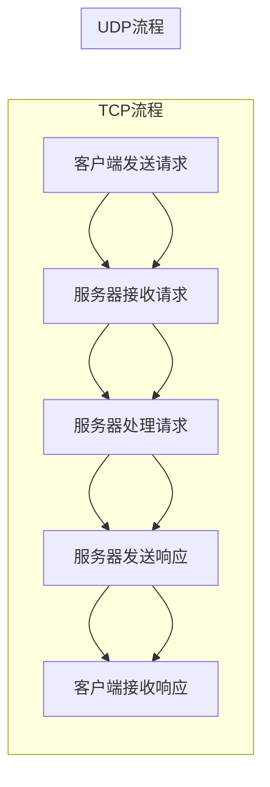
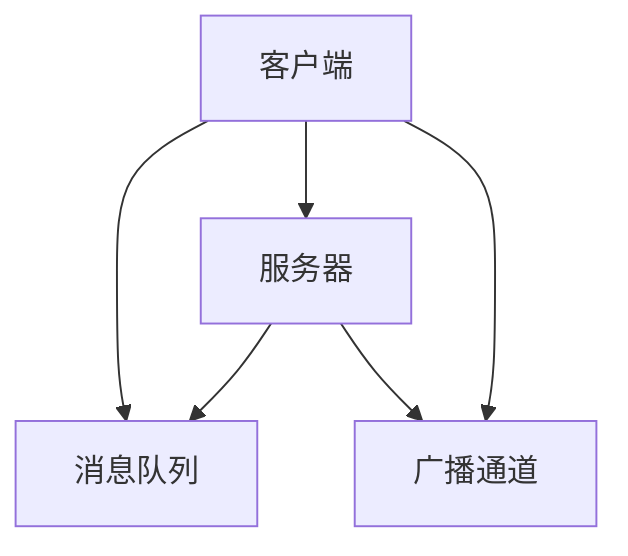
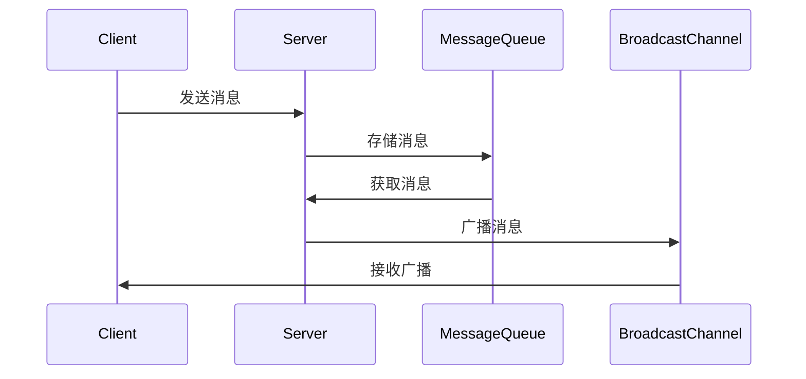
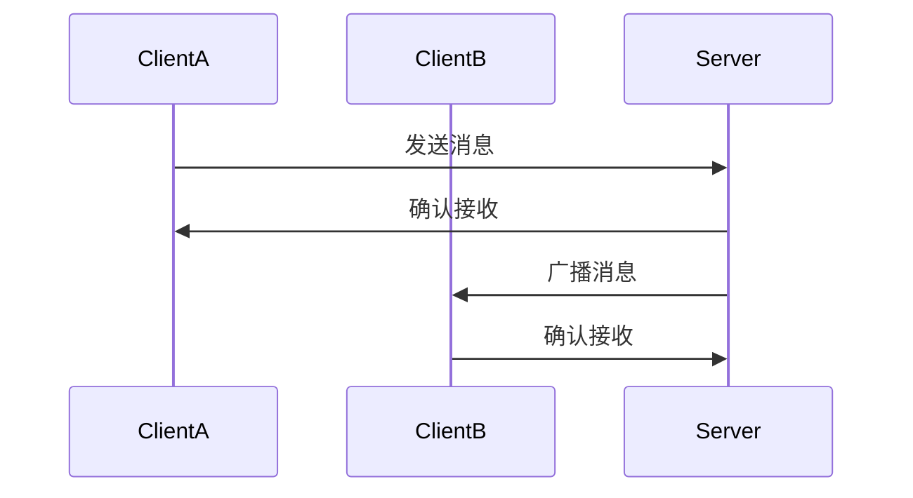
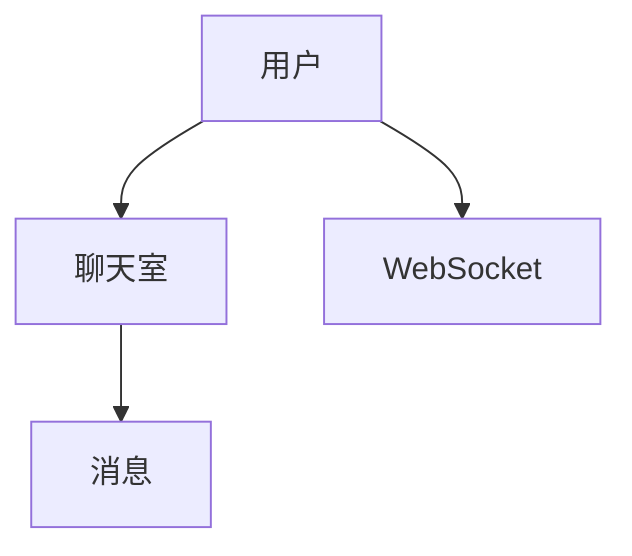
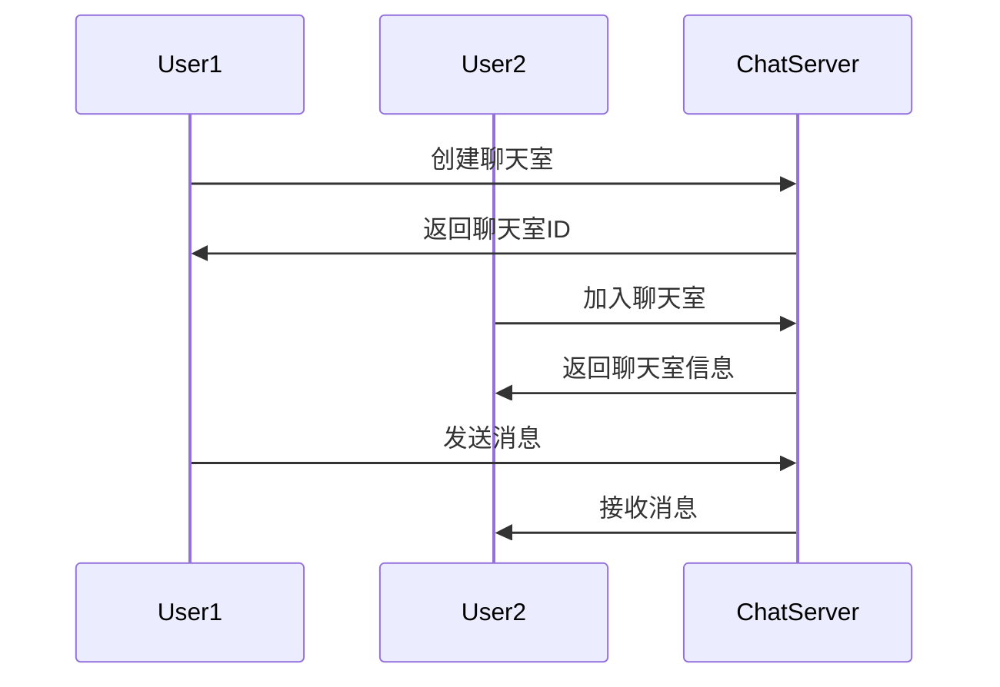

                 


### 网络编程概述

#### 背景介绍

网络编程是指通过计算机语言和协议，实现计算机之间数据通信的过程。随着互联网的普及和信息技术的发展，网络编程在现代社会中扮演着越来越重要的角色。无论是企业级应用、互联网服务，还是嵌入式系统，网络编程都是必不可少的一环。网络编程的基本概念包括网络、协议、客户端、服务器等，这些概念构成了网络编程的基础。

在网络编程中，协议是确保数据正确传输的关键。常见的网络协议有TCP/IP、HTTP、FTP、SMTP等。其中，TCP/IP协议是互联网的基础协议，它负责将数据分组传输到目标主机。HTTP协议用于网页数据的传输，FTP协议用于文件传输，SMTP协议用于电子邮件传输。理解这些协议的工作原理对于进行网络编程至关重要。

网络编程的重要性体现在多个方面。首先，网络编程是实现分布式计算和分布式存储的基础。现代应用往往需要处理海量数据，通过网络编程可以实现数据在多个节点之间的传输和处理，提高系统的性能和可靠性。其次，网络编程是构建互联网应用的关键技术。从Web应用、移动应用，到物联网应用，网络编程都是不可或缺的一环。最后，网络编程对于网络安全具有重要意义。通过合理的设计和实现，可以保护数据不被窃取或篡改，保障系统的安全性。

网络编程的发展历程可以追溯到20世纪60年代。当时，ARPANET项目启动，这是互联网的前身。随着ARPANET的不断发展，TCP/IP协议被设计出来，成为了互联网的基石。随后的几十年里，网络协议和技术不断演进，如HTTP、FTP、SMTP等协议的诞生，以及现代网络编程框架和库的出现，使得网络编程变得更加高效和便捷。

#### 核心概念与联系

网络编程的核心概念包括网络、协议、客户端、服务器等。以下是一个简单的概念属性特征对比表格：

| 概念     | 属性特征                    | 关系                     |
|----------|-----------------------------|--------------------------|
| 网络     | 连接多台计算机的体系结构     | 支持数据传输的基础设施   |
| 协议     | 规定数据传输的规则和格式     | 确保数据正确传输的标准   |
| 客户端   | 发起网络请求的计算机程序     | 使用协议与服务器通信     |
| 服务器   | 响应客户端请求的计算机程序   | 提供网络服务             |

为了更直观地展示这些概念之间的关系，我们可以使用Mermaid ER实体关系图架构：

```mermaid
erDiagram
    Network ||--|{ Client }||>
    Network ||--|{ Server }||>
    Protocol ||--|{ Client }||>
    Protocol ||--|{ Server }||>
    Client ||--|{ Network }||>
    Server ||--|{ Network }||>
```

在这个ER图中，`Network`表示网络，`Protocol`表示协议，`Client`表示客户端，`Server`表示服务器。每个实体都与网络和协议有直接关联，客户端通过网络发起请求，服务器通过网络响应请求。协议则是客户端和服务器之间沟通的桥梁。

#### 算法原理讲解

网络编程中的算法原理主要包括网络协议的工作原理和数据传输的基本过程。以下是一个简单的Mermaid流程图，用于描述数据传输的基本步骤：



在TCP流程中，客户端首先发送一个请求到服务器，服务器接收请求并处理，然后发送响应回客户端。在UDP流程中，过程类似，但没有确认和重传机制，因此速度较快，但可靠性较低。

以下是一个简单的Python源代码示例，用于演示TCP数据传输的过程：

```python
import socket

# 创建TCP客户端
client_socket = socket.socket(socket.AF_INET, socket.SOCK_STREAM)
client_socket.connect(('localhost', 8080))

# 发送数据
client_socket.sendall(b'Hello, Server!')

# 接收数据
data = client_socket.recv(1024)
print('Received:', repr(data))

# 关闭连接
client_socket.close()
```

在TCP/IP网络中，数据传输是通过分组（packet）实现的。每个分组包含数据以及发送方的地址和接收方的地址。TCP协议负责将这些分组按正确的顺序组装，并确保数据完整性和可靠性。以下是一个简单的分组传输的数学模型：

$$
\text{分组传输模型} = \sum_{i=1}^{n} \text{分组}_i \times \text{传输概率}_i
$$

其中，$n$表示分组的数量，$\text{分组}_i$表示第$i$个分组，$\text{传输概率}_i$表示第$i$个分组成功传输的概率。通过计算上述模型，可以评估整个数据传输的可靠性。

#### 系统分析与架构设计方案

在网络编程中，系统分析与架构设计是至关重要的环节。以下是一个简单的系统架构设计方案，用于描述一个基本的网络通信系统。

##### 问题场景介绍

假设我们需要设计一个简单的聊天应用，允许客户端和服务器之间进行实时通信。

##### 项目介绍

项目名为ChatNet，主要功能包括：
- 客户端发送消息到服务器
- 服务器接收消息并广播给所有在线客户端
- 客户端接收服务器广播的消息

##### 系统功能设计

领域模型（Mermaid类图）：

```mermaid
classDiagram
    Client --|{发送消息}|> Server
    Server --|{接收消息}|> Client
    Client --|{接收广播}|> Server
    Server --|{广播消息}|> Client
```

在这个类图中，`Client`表示客户端，`Server`表示服务器。客户端发送消息到服务器，服务器接收消息并广播给所有客户端。客户端接收服务器广播的消息。

##### 系统架构设计

架构设计（Mermaid架构图）：



在这个架构图中，客户端和服务器通过消息队列进行通信，服务器通过广播通道将消息广播给所有客户端。消息队列和广播通道保证了消息的有序传输和广播。

##### 系统接口设计

接口设计（Mermaid序列图）：



在这个序列图中，客户端发送消息到服务器，服务器将消息存储在消息队列中，然后从消息队列中获取消息并广播给所有客户端。

##### 系统交互

系统交互（Mermaid序列图）：



在这个交互图中，客户端A发送消息到服务器，服务器确认接收消息后，将消息广播给客户端B。

#### 项目实战

##### 环境安装

1. 安装Python环境：确保Python 3.7及以上版本已安装。
2. 安装依赖库：使用pip安装以下库：`socket`, `threading`, `queue`。

##### 系统核心实现源代码

客户端代码：

```python
import socket
import threading

def send_message(client_socket, message_queue):
    while True:
        message = input('输入消息：')
        message_queue.put(message)
        client_socket.sendall(message.encode('utf-8'))

def receive_message(client_socket, message_queue, broadcast_channel):
    while True:
        try:
            message = message_queue.get()
            broadcast_channel.send(message.encode('utf-8'))
        except Exception as e:
            print('发生错误：', e)

def main():
    client_socket = socket.socket(socket.AF_INET, socket.SOCK_STREAM)
    client_socket.connect(('localhost', 8080))

    message_queue = queue.Queue()
    broadcast_channel = socket.socket(socket.AF_INET, socket.SOCK_DGRAM)
    broadcast_channel.bind(('255.255.255.255', 12345))

    send_thread = threading.Thread(target=send_message, args=(client_socket, message_queue))
    receive_thread = threading.Thread(target=receive_message, args=(client_socket, message_queue, broadcast_channel))

    send_thread.start()
    receive_thread.start()

    send_thread.join()
    receive_thread.join()

if __name__ == '__main__':
    main()
```

服务器代码：

```python
import socket
import threading
import queue

def send_message(server_socket, message_queue):
    while True:
        message = message_queue.get()
        server_socket.sendall(message.encode('utf-8'))

def receive_message(server_socket, broadcast_socket, message_queue):
    while True:
        data, addr = broadcast_socket.recvfrom(1024)
        message_queue.put(data.decode('utf-8'))

def main():
    server_socket = socket.socket(socket.AF_INET, socket.SOCK_STREAM)
    server_socket.bind(('localhost', 8080))
    server_socket.listen()

    message_queue = queue.Queue()
    broadcast_socket = socket.socket(socket.AF_INET, socket.SOCK_DGRAM)
    broadcast_socket.bind(('', 12345))

    send_thread = threading.Thread(target=send_message, args=(server_socket, message_queue))
    receive_thread = threading.Thread(target=receive_message, args=(server_socket, broadcast_socket, message_queue))

    send_thread.start()
    receive_thread.start()

    send_thread.join()
    receive_thread.join()

if __name__ == '__main__':
    main()
```

##### 代码应用解读与分析

客户端和服务器分别运行在两个不同的线程中，客户端线程负责发送消息，服务器线程负责接收消息。客户端通过输入消息，将消息放入消息队列，服务器从消息队列中获取消息并广播给所有客户端。广播使用UDP协议，确保消息能够迅速传播。

##### 实际案例分析和详细讲解剖析

假设有多个客户端同时连接到服务器，服务器如何处理这些客户端的请求？

1. 客户端A发送消息：客户端A将消息放入消息队列，服务器从消息队列中读取消息并广播给所有客户端，包括客户端B和客户端C。
2. 客户端B发送消息：客户端B将消息放入消息队列，服务器从消息队列中读取消息并广播给所有客户端，包括客户端A和客户端C。
3. 客户端C发送消息：客户端C将消息放入消息队列，服务器从消息队列中读取消息并广播给所有客户端，包括客户端A和客户端B。

通过这种方式，服务器能够高效地处理多个客户端的请求，确保消息能够及时广播给所有客户端。

##### 项目小结

ChatNet项目实现了简单的实时聊天功能，客户端可以通过输入消息进行通信。服务器通过消息队列和广播通道处理客户端的消息，确保消息能够及时广播给所有客户端。这个项目展示了网络编程的基本原理和实现方法，为进一步学习网络编程提供了实践基础。

### 高性能网络编程

#### 背景介绍

高性能网络编程是现代网络应用开发的重点之一。随着互联网的快速发展和大数据时代的到来，网络应用的性能要求越来越高。高性能网络编程旨在设计并实现高效、稳定的网络通信系统，以满足高并发、高吞吐量的需求。高性能网络编程的核心目标是减少延迟、提高传输速度和可靠性。

网络延迟是影响网络性能的关键因素之一。网络延迟包括传输延迟和处理延迟。传输延迟是指数据从发送方传输到接收方所需的时间，处理延迟是指接收方处理数据所需的时间。减少网络延迟需要从以下几个方面入手：

1. **优化网络协议**：选择高效的网络协议，如TCP和UDP，并合理配置协议参数，如窗口大小、拥塞控制算法等。
2. **优化传输路径**：选择最优的传输路径，避免网络瓶颈和延迟。
3. **优化处理流程**：减少处理过程中的耗时操作，如网络编程框架的优化、系统调用的减少等。

#### 高性能网络编程的核心技术和方法

1. **多线程和异步编程**：
   - **多线程**：通过创建多个线程，实现并发处理，提高系统的吞吐量。然而，多线程编程需要处理线程同步和资源竞争问题。
   - **异步编程**：异步编程通过非阻塞I/O操作，避免线程阻塞在等待I/O操作完成上，从而提高系统的响应速度。异步编程的实现依赖于操作系统提供的异步I/O接口，如Linux的epoll和Windows的IOCP。

2. **网络优化技术**：
   - **零拷贝**：零拷贝技术通过减少数据在用户空间和内核空间之间的拷贝次数，提高数据传输速度。常见的零拷贝技术包括sendfile系统调用和splice操作。
   - **负载均衡**：通过负载均衡技术，将网络请求分布到多个服务器上，避免单点瓶颈，提高系统的整体性能。
   - **缓存技术**：缓存技术通过存储常用的数据，减少重复的数据处理和传输，提高系统的响应速度。

3. **并发编程**：
   - **无锁编程**：无锁编程通过避免锁机制，减少线程同步和竞态条件，提高系统的并发性能。常见的无锁数据结构包括队列、堆栈、哈希表等。
   - **并发框架**：使用并发编程框架，如Java的Thread和Python的asyncio，简化并发编程，提高代码的可读性和可维护性。

4. **网络编程库和框架**：
   - **高性能网络库**：如Node.js的libuv、Python的asyncio等，提供了高效的网络编程接口，支持异步I/O操作，提高系统的性能和可扩展性。
   - **分布式系统框架**：如Docker、Kubernetes等，通过容器化和集群管理，实现分布式系统的部署和管理，提高系统的可靠性和性能。

#### 实际案例与最佳实践

1. **案例一：基于TCP的高性能Web服务器**：
   - 使用多线程和异步编程，实现并发处理大量HTTP请求。
   - 优化TCP协议参数，提高传输速度和可靠性。
   - 使用负载均衡技术，将请求分布到多个服务器上，避免单点瓶颈。

2. **案例二：基于UDP的高性能实时通信系统**：
   - 使用异步编程，实现非阻塞I/O操作，提高系统的响应速度。
   - 优化UDP协议参数，提高传输速度和可靠性。
   - 使用零拷贝技术，减少数据拷贝次数，提高数据传输速度。

3. **最佳实践**：
   - 选择合适的网络协议和编程模型，根据应用场景和性能需求进行优化。
   - 使用高性能网络库和框架，简化编程，提高代码的可读性和可维护性。
   - 进行性能测试和优化，针对不同的性能瓶颈进行针对性的优化。

通过高性能网络编程，可以显著提高网络应用的性能和可靠性，满足现代互联网应用的高并发和高吞吐量需求。掌握高性能网络编程的核心技术和方法，对于网络工程师和软件开发者来说至关重要。

### 并发编程

#### 背景介绍

在现代计算机系统中，并发编程是提高程序执行效率的关键技术之一。随着多核处理器和分布式计算技术的普及，并发编程在性能优化、系统可靠性和可扩展性方面发挥着重要作用。并发编程允许多个任务同时执行，充分利用计算机资源，提高程序的吞吐量和响应速度。

并发编程的核心是处理多个任务之间的同步和通信。任务可以是一个线程或进程，它们可以并行执行，但需要协调共享资源，避免竞态条件和死锁等问题。并发编程的挑战在于如何设计并发程序，使其既高效又安全。正确处理并发编程中的问题，可以显著提高程序的性能和可靠性。

#### 并发编程的基础概念

1. **线程**：线程是程序执行的基本单元，它包括程序代码、数据和独立的执行路径。线程相对于进程有更小的创建和切换开销，适合执行短期、频繁的任务。线程可以分为用户级线程和内核级线程。用户级线程由应用程序管理，内核级线程由操作系统管理。

2. **进程**：进程是计算机中正在运行的程序的实例，它包括代码、数据、堆栈和资源。进程是独立的执行单元，具有独立的内存空间和系统资源。进程之间的通信需要通过操作系统提供的接口进行。

3. **锁**：锁是用于控制对共享资源访问的机制。常见的锁有互斥锁（Mutex）和读写锁（Read-Write Lock）。互斥锁保证同一时刻只有一个线程能够访问共享资源，读写锁允许多个线程同时读共享资源，但写操作需要独占锁。

4. **信号量**：信号量是一种计数器，用于控制对共享资源的访问。信号量可以实现互斥锁和条件变量等功能。

5. **条件变量**：条件变量用于线程之间的同步，它允许线程在特定条件不满足时等待，直到条件满足后继续执行。

6. **无锁编程**：无锁编程通过避免锁机制，减少线程同步和竞态条件，提高系统的并发性能。无锁编程需要设计无锁数据结构，如队列、堆栈、哈希表等。

#### 并发编程模型

1. **进程模型**：进程模型通过创建多个进程实现并发执行。进程之间相互独立，资源共享较少。进程模型的优点是隔离性高，缺点是创建和切换开销大，不适合执行短期任务。

2. **线程模型**：线程模型通过创建多个线程实现并发执行。线程共享进程的内存空间和资源，切换开销较小。线程模型的优点是并发性能高，缺点是线程间同步复杂，容易出现竞态条件和死锁问题。

3. **异步编程模型**：异步编程模型通过非阻塞I/O操作，避免线程阻塞在等待I/O操作完成上，从而提高系统的响应速度。异步编程模型包括事件驱动和协程。事件驱动通过事件队列管理I/O操作，协程通过轻量级线程实现并发执行。

#### 并发编程最佳实践

1. **最小化共享资源**：减少共享资源的使用，降低线程同步和竞态条件的可能性。

2. **合理使用锁**：避免过度使用锁，减少锁竞争和死锁的风险。合理使用读写锁，提高并发性能。

3. **避免锁嵌套**：锁嵌套可能导致死锁，应尽量避免。

4. **合理使用信号量和条件变量**：合理使用信号量和条件变量，确保线程之间的同步和通信。

5. **无锁编程**：对于高并发场景，考虑使用无锁编程，减少锁的开销。

6. **性能测试和优化**：进行性能测试，识别并发编程中的性能瓶颈，进行针对性的优化。

7. **代码可读性和可维护性**：确保并发编程代码的可读性和可维护性，方便后续维护和优化。

通过遵循并发编程最佳实践，可以设计出高效、可靠、可维护的并发程序，充分利用计算机资源，提高系统的性能和可靠性。

### 安全编程

#### 背景介绍

在网络编程中，安全编程是一个至关重要的环节。随着互联网的普及和网络的普及，网络安全威胁层出不穷，如DDoS攻击、数据泄露、恶意软件等。网络编程中的安全编程旨在设计和实现安全的网络应用，保护数据的安全性和完整性，防止恶意攻击和数据泄露。

网络安全威胁主要包括以下几类：

1. **网络攻击**：网络攻击是指恶意用户通过网络对计算机系统进行的非法攻击。常见的网络攻击包括拒绝服务攻击（DDoS）、缓冲区溢出攻击、网络钓鱼等。
2. **数据泄露**：数据泄露是指敏感数据未经授权被访问、窃取或篡改。数据泄露可能导致严重的后果，如商业机密泄露、用户信息泄露等。
3. **恶意软件**：恶意软件是指通过网络传播的恶意程序，如病毒、木马、勒索软件等。恶意软件可以破坏系统、窃取数据、控制系统等。
4. **社会工程学攻击**：社会工程学攻击是指通过欺骗、操纵等方式获取敏感信息或访问权限。常见的攻击手段包括电话诈骗、网络钓鱼等。

为了应对这些安全威胁，安全编程需要关注以下几个方面：

1. **访问控制**：访问控制是网络安全的基础，通过控制对系统资源的访问，防止未授权的访问和数据泄露。常见的访问控制方法包括用户认证、权限控制、访问日志等。
2. **加密技术**：加密技术是保护数据安全的关键，通过加密算法对数据进行加密，确保数据在传输和存储过程中不被窃取或篡改。常见的加密算法包括AES、RSA等。
3. **网络安全协议**：网络安全协议是确保数据在传输过程中安全的关键，如HTTPS、SSL/TLS等。这些协议通过加密传输、身份验证等方式保护数据的安全性和完整性。
4. **漏洞扫描与修复**：定期进行漏洞扫描，识别系统中的安全漏洞，及时修复漏洞，防止被恶意攻击。
5. **安全审计与监控**：通过安全审计和监控，发现并处理安全事件，确保系统的安全性。

#### 网络编程中的常见安全威胁

1. **SQL注入**：SQL注入是一种常见的网络攻击方式，攻击者通过在输入框中插入恶意的SQL代码，篡改数据库数据或执行非法操作。
2. **跨站脚本攻击（XSS）**：跨站脚本攻击是指攻击者通过在Web应用中注入恶意脚本，窃取用户信息或执行非法操作。
3. **跨站请求伪造（CSRF）**：跨站请求伪造是指攻击者通过伪造用户请求，执行非法操作，如转账、修改密码等。
4. **文件上传漏洞**：文件上传漏洞是指攻击者通过上传恶意文件，执行系统命令或窃取敏感信息。

为了防范这些安全威胁，可以采取以下措施：

1. **输入验证**：对用户输入进行严格的验证，防止SQL注入、XSS等攻击。
2. **使用安全库和框架**：使用安全库和框架，如Python的Flask和Django，自动处理安全相关的问题，减少安全漏洞。
3. **配置防火墙和入侵检测系统**：配置防火墙和入侵检测系统，防止恶意攻击和入侵。
4. **定期备份和更新**：定期备份系统数据，确保数据的安全性和完整性。及时更新系统和应用程序，修复安全漏洞。
5. **用户教育和培训**：加强用户的安全意识教育，避免用户因误操作导致的安全事件。

#### 网络编程中的安全措施

1. **身份验证与授权**：使用安全的身份验证机制，如OAuth2.0和JWT，确保用户身份的合法性和权限的正确性。
2. **数据加密**：使用加密算法对敏感数据进行加密，确保数据在传输和存储过程中不被窃取或篡改。
3. **安全传输**：使用HTTPS等安全协议，确保数据在传输过程中的安全性和完整性。
4. **安全编程规范**：遵循安全编程规范，如OWASP安全编码规范，减少安全漏洞的出现。
5. **日志记录与监控**：记录系统日志，监控系统异常和潜在的安全威胁，及时发现并处理安全事件。

通过采取有效的安全措施，可以显著提高网络编程的安全性，保护数据和系统的安全。

### 常见网络应用场景

#### 客户端-服务器模型

客户端-服务器模型（Client-Server Model）是网络编程中最常见的应用场景之一。在客户端-服务器模型中，客户端和服务器分别承担不同的角色，客户端发送请求，服务器接收请求并响应。

**工作流程**：
1. **客户端发起请求**：客户端向服务器发送请求，请求可以是一个HTTP请求、FTP请求或其他类型的请求。
2. **服务器处理请求**：服务器接收客户端请求，根据请求类型执行相应的处理操作，如查询数据库、处理文件上传等。
3. **服务器返回响应**：服务器将处理结果返回给客户端，客户端接收响应并显示处理结果。

**特点**：
- **分布式计算**：客户端和服务器可以分布在不同的计算机上，实现分布式计算。
- **模块化设计**：客户端和服务器可以独立开发、测试和部署，提高系统的可维护性和可扩展性。

**应用示例**：
- **Web应用**：常见的Web应用，如社交媒体平台、电商平台等，都是基于客户端-服务器模型开发的。
- **邮件服务**：邮件客户端（如Outlook、Thunderbird）与邮件服务器（如SMTP服务器、IMAP服务器）之间的通信。

#### 实时通信

实时通信（Real-Time Communication）是指在短时间内传输大量数据的通信场景，常见于在线聊天、视频会议、在线游戏等应用。

**工作流程**：
1. **客户端连接服务器**：客户端通过TCP或UDP协议连接到服务器，建立通信通道。
2. **数据传输**：客户端和服务器之间传输文本、音频、视频等数据，确保实时性。
3. **断开连接**：通信结束后，客户端和服务器断开连接。

**特点**：
- **低延迟**：实时通信要求低延迟，确保实时性和交互性。
- **高带宽**：实时通信需要高带宽，支持大量数据的传输。
- **可靠性**：实时通信需要保证数据传输的可靠性和完整性。

**应用示例**：
- **在线聊天**：如微信、WhatsApp等即时通讯应用，支持实时文本消息、语音消息传输。
- **视频会议**：如Zoom、Microsoft Teams等视频会议应用，支持实时视频和音频传输。

#### 分布式系统

分布式系统（Distributed System）是指由多个独立计算机组成的系统，通过通信网络实现协同工作。分布式系统具有高可用性、高可扩展性和容错性等特点。

**工作流程**：
1. **节点连接**：分布式系统中的各个节点通过通信网络连接，形成一个整体。
2. **任务分配**：系统将任务分配给不同的节点，节点之间协作完成任务。
3. **数据同步**：分布式系统需要保证数据的一致性和同步。

**特点**：
- **高可用性**：分布式系统通过冗余设计，提高系统的可用性和可靠性。
- **高可扩展性**：分布式系统可以通过增加节点数量，水平扩展系统性能。
- **容错性**：分布式系统通过冗余和故障转移，提高系统的容错性。

**应用示例**：
- **云计算平台**：如Amazon Web Services（AWS）、Microsoft Azure等，提供分布式计算和存储服务。
- **分布式数据库**：如Apache Cassandra、MongoDB等，支持海量数据的分布式存储和查询。

通过了解这些常见的网络应用场景，可以更好地设计和实现网络编程项目，满足不同应用场景的需求。

### 网络编程项目实战

#### 项目介绍

项目名称：ChatRoom

项目背景：为了提高团队沟通效率，公司决定开发一个基于网络的实时聊天室系统。该系统需要支持多人在线聊天，提供文本、图片、音频等多种通信方式。

技术栈：Python、Django、WebSockets

#### 系统设计与实现

##### 领域模型设计

在ChatRoom项目中，需要定义用户（User）、聊天室（ChatRoom）、消息（Message）等实体，并建立它们之间的关系。

领域模型（Mermaid类图）：

```mermaid
classDiagram
    User <<entity>>
    ChatRoom <<entity>>
    Message <<entity>>

    User ||--|{has many}|> Message
    ChatRoom ||--|{has many}|> Message
    ChatRoom ||--|{has one}|> User
```

在这个类图中，用户（User）可以创建和加入聊天室（ChatRoom），聊天室中包含多个消息（Message）。用户和聊天室之间是一对多的关系，聊天室和用户之间是一对一的关系。

##### 系统架构设计

系统架构（Mermaid架构图）：



在这个架构图中，用户通过WebSocket与服务器通信，聊天室和消息是系统的核心实体，通过WebSocket实现实时消息传输。

##### 系统接口设计

系统接口（Mermaid序列图）：



在这个序列图中，用户1创建聊天室，用户2加入聊天室，用户1发送消息，聊天室服务器接收消息并转发给用户2。

#### 系统核心实现源代码

##### 用户认证

用户认证是系统的入口，使用Django框架实现用户认证。

```python
# users/models.py
from django.contrib.auth.models import AbstractUser

class CustomUser(AbstractUser):
    # 自定义用户模型，可以扩展用户信息
    pass
```

```python
# users/admin.py
from django.contrib import admin
from .models import CustomUser

@admin.register(CustomUser)
class CustomUserAdmin(admin.ModelAdmin):
    pass
```

##### WebSocket配置

在Django项目中，通过`channels`库配置WebSocket。

```python
# settings.py
INSTALLED_APPS = [
    # ...
    'channels',
]

# 使用ASGI服务器
ASGI_APPLICATION = 'chatroom.routing.application'
```

```python
# routing.py
from channels.routing import ProtocolTypeRouter, URLRouter
from django.urls import path

application = ProtocolTypeRouter({
    'websocket': URLRouter([
        path('ws/chatroom/<int:room_id>/', chatroom.views.ChatRoomView.as_view()),
    ]),
})
```

##### 聊天室视图

聊天室视图负责处理WebSocket连接、接收和发送消息。

```python
# chatroom/views.py
from django.http import JsonResponse
from .models import ChatRoom, Message
from .serializers import ChatRoomSerializer, MessageSerializer
from channels.layers import get_channel_layer
import json

def ChatRoomView(request, room_id):
    if request.method == 'GET':
        chatroom = ChatRoom.objects.get(id=room_id)
        serializer = ChatRoomSerializer(chatroom)
        return JsonResponse(serializer.data)
    elif request.method == 'POST':
        data = json.loads(request.body)
        message = Message.objects.create(
            user=request.user,
            chatroom=chatroom,
            content=data['content'],
        )
        serializer = MessageSerializer(message)
        channel_layer = get_channel_layer()
        channel_layer.group_send(str(room_id), {'type': 'chat_message', 'message': serializer.data})
        return JsonResponse(serializer.data)
```

##### 前端实现

前端使用React框架实现聊天室界面，通过WebSocket与后端通信。

```jsx
// ChatRoom.js
import React, { useState, useEffect } from 'react';
import { useParams } from 'react-router-dom';
import socketIOClient from 'socket.io-client';

const ChatRoom = () => {
    const [messages, setMessages] = useState([]);
    const [message, setMessage] = useState('');
    const { room_id } = useParams();

    useEffect(() => {
        const socket = socketIOClient('http://localhost:8000');
        socket.on('chat_message', (data) => {
            setMessages([...messages, data]);
        });
        return () => {
            socket.disconnect();
        };
    }, [messages]);

    const sendMessage = () => {
        if (message) {
            const data = {
                room_id: parseInt(room_id),
                content: message,
            };
            fetch(`/chatroom/${room_id}/`, {
                method: 'POST',
                headers: {
                    'Content-Type': 'application/json',
                },
                body: JSON.stringify(data),
            });
            setMessage('');
        }
    };

    return (
        <div>
            <ul>
                {messages.map((message, index) => (
                    <li key={index}>{message.content}</li>
                ))}
            </ul>
            <input
                type="text"
                value={message}
                onChange={(e) => setMessage(e.target.value)}
            />
            <button onClick={sendMessage}>发送</button>
        </div>
    );
};

export default ChatRoom;
```

#### 代码应用解读与分析

1. **用户认证**：使用Django框架实现用户认证，自定义用户模型，通过用户身份验证确保系统的安全性。
2. **WebSocket配置**：通过`channels`库配置WebSocket，实现实时消息传输，提高系统的交互性和实时性。
3. **聊天室视图**：聊天室视图处理WebSocket连接，接收和发送消息，确保消息的实时性和可靠性。
4. **前端实现**：使用React框架实现聊天室界面，通过WebSocket与后端通信，实现实时消息展示和发送。

#### 实际案例分析和详细讲解剖析

假设有用户A和用户B同时在一个聊天室中，分析他们的通信过程：

1. **用户A发送消息**：
   - 用户A在聊天室界面输入消息，点击发送按钮。
   - 前端将消息发送到后端，通过`POST`请求将消息发送到`/chatroom/<room_id>/`接口。
   - 后端聊天室视图接收到消息，创建一个`Message`对象，并将其发送到WebSocket。
   - WebSocket将消息广播给聊天室中的所有用户，包括用户B。

2. **用户B接收消息**：
   - 用户B的WebSocket监听到消息，将消息更新到聊天室界面。
   - 用户B可以在聊天室界面中看到用户A发送的消息。

通过这种方式，ChatRoom项目实现了多人实时聊天功能，确保消息的实时性和可靠性。

#### 项目小结

ChatRoom项目通过WebSocket实现实时通信，提高了系统的交互性和实时性。项目使用Django框架实现用户认证和消息处理，确保系统的安全性和可靠性。通过实际案例分析和详细讲解，展示了项目实现的关键技术和方法。项目小结如下：

1. **技术要点**：WebSocket、Django、React。
2. **项目架构**：用户认证、聊天室视图、前端界面。
3. **实际应用**：多人实时聊天、消息发送与接收。

通过ChatRoom项目，深入了解了网络编程中的实时通信技术，为进一步学习和实践网络编程提供了实际案例。

### 网络编程在新兴领域的应用

#### 5G网络编程

5G（第五代移动通信技术）的推广和应用，为网络编程带来了新的机遇和挑战。5G网络具有高速度、低延迟、大连接和高效能的特点，使得网络编程在物联网（IoT）、增强现实（AR）、虚拟现实（VR）等新兴领域取得了显著进展。

**5G网络编程的特点**：
- **高速度**：5G网络的理论下载速度可达10Gbps，相比4G有显著提升，提高了网络编程的数据传输效率。
- **低延迟**：5G网络的端到端延迟可低至1ms，显著降低了实时应用的网络延迟，如自动驾驶、远程手术等。
- **大连接**：5G网络支持大规模设备连接，每平方公里可连接100万台设备，为物联网应用提供了坚实的基础。
- **高效能**：5G网络采用网络切片技术，可以根据不同应用需求灵活分配网络资源，提高网络编程的效率和可靠性。

**5G网络编程的应用场景**：
- **物联网（IoT）**：5G网络编程在IoT领域具有广泛应用，如智能城市、智能家居、智能工厂等。通过5G网络，设备可以实现高速、稳定的连接，实时传输大量数据，提高系统的智能化和自动化水平。
- **增强现实（AR）与虚拟现实（VR）**：5G网络编程在AR和VR领域具有重要作用。5G网络的低延迟和高速度，保证了AR和VR应用的实时性和流畅性，为用户带来更加沉浸式的体验。
- **远程医疗**：5G网络编程在远程医疗领域，可以实现实时视频诊断、远程手术等。通过5G网络，医生可以远程实时监控患者的病情，提高医疗服务的质量和效率。
- **自动驾驶**：5G网络编程在自动驾驶领域，可以实现车辆与周围环境的高速数据传输，提高车辆的感知能力和决策能力，确保自动驾驶的安全和可靠性。

**5G网络编程的技术挑战**：
- **网络编程复杂性**：5G网络的复杂性和多样性，增加了网络编程的难度。开发者需要熟悉5G网络协议、网络切片技术等，确保网络编程的正确性和稳定性。
- **功耗和资源管理**：物联网设备通常功耗有限，5G网络编程需要优化功耗和资源管理，延长设备的使用寿命。
- **安全性**：5G网络的开放性和互联性，使得安全性成为重要挑战。开发者需要设计安全的网络编程架构，防止数据泄露和网络攻击。

#### 物联网编程

物联网编程是指通过编程实现物联网设备之间的连接和数据交互。随着物联网技术的快速发展，物联网编程在智能城市、智能家居、智能交通等领域得到了广泛应用。

**物联网编程的核心技术**：
- **设备连接**：通过无线通信技术（如WiFi、蓝牙、LoRa等）实现物联网设备之间的连接。
- **数据传输**：通过 MQTT、CoAP 等物联网协议，实现物联网设备与云端的数据传输。
- **数据处理**：通过大数据分析和机器学习算法，对物联网设备收集的数据进行处理和分析，实现智能决策和自动化控制。

**物联网编程的应用场景**：
- **智能城市**：物联网编程可以用于智能交通、智能照明、智能监控等，提高城市的管理效率和居民的生活质量。
- **智能家居**：物联网编程可以实现家电设备之间的智能互联，如智能门锁、智能照明、智能空调等，提高家庭生活的舒适性和便利性。
- **智能农业**：物联网编程可以用于智能灌溉、智能监控、智能气象预测等，提高农业生产的效率和质量。

**物联网编程的技术挑战**：
- **数据安全**：物联网设备数量庞大，数据传输过程中存在安全风险。开发者需要设计安全的物联网编程架构，防止数据泄露和网络攻击。
- **设备功耗**：物联网设备通常功耗有限，开发者需要优化编程代码，延长设备的使用寿命。
- **协议兼容性**：物联网协议种类繁多，开发者需要处理不同协议之间的兼容性问题。

#### 边缘计算编程

边缘计算编程是指在网络边缘（如路由器、网关等）进行数据处理和计算的一种编程模式。边缘计算能够降低数据传输延迟，提高系统的响应速度和可靠性。

**边缘计算编程的核心技术**：
- **边缘计算框架**：如Kubernetes、Fog Computing等，用于管理和部署边缘计算应用。
- **数据处理与存储**：在边缘节点进行数据预处理和存储，减少数据传输量和网络带宽消耗。
- **智能调度**：通过智能调度算法，优化边缘节点的资源利用和任务分配。

**边缘计算编程的应用场景**：
- **智能交通**：边缘计算编程可以用于智能交通信号控制、智能停车管理等，提高交通管理的效率和安全性。
- **工业物联网**：边缘计算编程可以用于工业物联网设备的数据采集、分析和控制，提高工业生产的自动化和智能化水平。
- **智能医疗**：边缘计算编程可以用于医疗设备的实时监控、诊断和预测，提高医疗服务的质量和效率。

**边缘计算编程的技术挑战**：
- **资源限制**：边缘节点资源有限，开发者需要优化编程代码，充分利用有限的资源。
- **网络稳定性**：边缘节点的网络环境复杂，开发者需要设计可靠的边缘计算架构，确保系统的稳定运行。
- **安全性和隐私**：边缘计算涉及大量的数据传输和处理，开发者需要确保数据的安全性和用户隐私。

通过了解5G网络编程、物联网编程和边缘计算编程，可以更好地把握网络编程在新兴领域的应用趋势和发展方向。这些技术不仅为网络编程带来了新的机遇，也带来了新的挑战，需要开发者不断学习和创新，实现更加高效、安全和智能的网络应用。

### 网络编程的未来趋势与展望

随着信息技术和互联网的不断演进，网络编程也面临着诸多变革和挑战。未来，网络编程将在以下几方面展现出显著的趋势和发展方向：

#### **1. 边缘计算与网络编程的深度融合**

边缘计算通过在网络边缘节点进行数据处理和计算，减少了数据传输的延迟和带宽消耗。未来，网络编程将更加注重与边缘计算的融合，开发者在编写程序时需要考虑如何在边缘节点上高效地处理数据和任务。这不仅要求开发者具备对边缘计算框架和技术的深入了解，还需要掌握如何在有限的资源环境下优化算法和代码。

#### **2. 5G网络的全面普及与应用**

5G网络的全面普及将为网络编程带来更广阔的应用场景和更高的性能要求。5G网络的低延迟、高速度和大连接特性，将推动网络编程在物联网、增强现实、虚拟现实等领域的广泛应用。开发者需要熟悉5G网络的技术特性，掌握如何在5G环境下进行高效的编程和优化。

#### **3. 智能化与自动化编程**

随着人工智能技术的发展，智能化和自动化编程将成为网络编程的重要趋势。未来的网络编程工具和平台将具备自动优化、错误检测和修复、安全评估等功能，减少开发者的工作量，提高开发效率和代码质量。开发者需要关注人工智能技术在网络编程中的应用，学习如何利用智能算法和工具提升编程能力。

#### **4. 开源生态的持续发展**

开源生态的持续发展为网络编程提供了丰富的资源和平台。未来，开源网络编程框架和工具将继续发展壮大，为开发者提供更多的选择和便利。开发者需要关注开源项目的发展动态，积极参与开源社区，掌握前沿的技术和最佳实践。

#### **5. 跨领域和跨平台编程**

未来的网络编程将更加注重跨领域和跨平台的应用。开发者需要具备在不同操作系统、网络环境、硬件平台上的编程能力，编写可移植和可扩展的代码。跨领域编程要求开发者具备多学科的知识和技能，能够处理复杂的业务逻辑和系统架构。

#### **6. 安全编程的重要性日益凸显**

随着网络攻击手段的不断升级，安全编程的重要性日益凸显。未来，网络编程将更加注重安全性，开发者需要掌握各种安全编程技术和最佳实践，如加密、认证、访问控制等。同时，开发者还需要关注网络安全法规和标准，确保网络应用的安全性。

#### **7. 云原生网络编程的兴起**

云原生网络编程是未来网络编程的重要趋势之一。云原生网络应用具有高可扩展性、高可用性和高可靠性，能够更好地适应云计算环境。开发者需要了解云原生架构和容器技术，掌握如何编写云原生网络应用，充分利用云计算的资源和管理优势。

总之，网络编程的未来充满机遇和挑战。开发者需要不断学习和适应新技术、新趋势，提高自身的编程能力和技术素养，为网络编程的发展贡献力量。通过不断创新和优化，网络编程将推动信息技术的进步，为各行各业带来更多的价值和变革。

