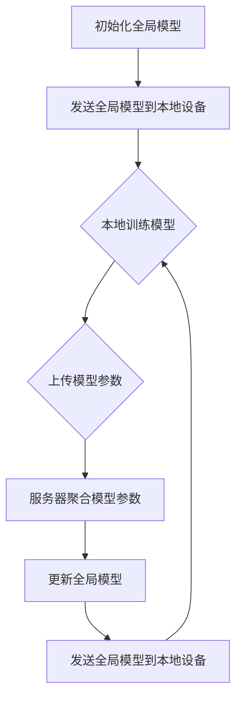

                 

### 让我们一步步思考：联邦学习技术与隐私保护

**背景**：在当今的数字化时代，数据已经成为企业和组织的关键资产。然而，随着数据量的激增和技术的进步，数据隐私问题变得愈发突出。传统的集中式数据处理方法，虽然能够高效地进行数据处理和模型训练，但却面临着数据泄露和隐私泄露的重大风险。联邦学习（Federated Learning）作为一种新兴的技术，旨在解决这一难题，通过在不传输原始数据的情况下进行模型训练，确保了数据的安全性和隐私性。

**目的**：本文的目标是深入探讨联邦学习技术与隐私保护的关系，详细解析联邦学习的核心概念、算法原理、系统架构以及实际应用，帮助读者全面理解这一技术，并掌握其在实际项目中的实施方法。

**结构**：文章将按照以下结构展开：

1. **第1章：联邦学习的基本概念**：介绍联邦学习的起源、核心优势、定义以及与其他技术的区别。
2. **第2章：隐私保护技术概述**：阐述隐私保护的重要性、技术分类及其在联邦学习中的应用。
3. **第3章：联邦学习与隐私保护的融合**：讨论联邦学习中的隐私保护需求、应用场景以及平衡策略。
4. **第4章：联邦学习算法原理**：详细讲解联邦学习算法的工作原理，包括基础算法和常见算法。
5. **第5章：隐私保护算法与实现**：介绍隐私保护算法，包括加密算法、同态加密和差分隐私。
6. **第6章：联邦学习与隐私保护的架构设计**：描述系统架构设计原则、功能设计和架构优化挑战。
7. **第7章：联邦学习项目实战**：提供一个具体案例，讲解环境搭建、核心功能实现及应用分析。
8. **第8章：最佳实践与未来展望**：总结最佳实践经验，反思项目，展望未来发展趋势。

**逻辑思路**：本文将采用逻辑清晰、结构紧凑、简单易懂的专业技术语言，通过逐步分析推理的方式，帮助读者深入理解联邦学习技术与隐私保护的原理和应用。

**写作风格**：作为一位世界级人工智能专家，文章将保持专业的写作风格，同时注重通俗易懂，确保读者能够轻松跟上技术细节。

### 文章标题：联邦学习技术与隐私保护

关键词：联邦学习、隐私保护、数据安全、分布式计算、同态加密、差分隐私

摘要：本文深入探讨了联邦学习技术与隐私保护的关系，详细介绍了联邦学习的核心概念、算法原理、系统架构以及实际应用。通过本文的阅读，读者将全面理解联邦学习如何在不牺牲数据隐私的前提下，实现高效的机器学习模型训练，并在实际项目中掌握其应用方法。

## 第1章：联邦学习的基本概念

### 1.1 联邦学习的定义与背景

#### 1.1.1 问题背景

##### 1.1.1.1 数据隐私与中心化服务的矛盾

在当今数字化时代，数据已经成为企业和社会的关键资源。无论是消费者行为数据、医疗健康数据还是金融交易数据，都是极具价值的资产。然而，随着数据量的激增和数据源的不断增多，如何确保这些数据的安全性成为一个迫切需要解决的问题。传统的集中式数据处理方法，将所有的数据汇集到中心服务器进行处理，这种方法虽然能够实现高效的计算和存储，但却面临着严重的隐私泄露风险。数据泄露不仅会导致用户隐私被窃取，还可能引发严重的法律纠纷和经济损失。

##### 1.1.1.2 联邦学习的起源与发展

联邦学习作为一种新型的机器学习技术，起源于对数据隐私保护的深入研究。最早的联邦学习思想可以追溯到1990年代，当时研究人员提出了一种在分布式环境中进行模型训练的方法，旨在避免将敏感数据传输到中心服务器。随着云计算、物联网和移动设备的普及，联邦学习得到了迅速发展。近年来，谷歌、微软等科技巨头纷纷投入大量资源进行联邦学习的研究和应用，使得这一技术逐渐成为解决数据隐私问题的有效手段。

#### 1.1.2 问题描述

##### 1.1.2.1 数据隐私泄露问题

在传统的集中式数据处理方法中，数据需要在中心服务器上进行处理和存储，这导致数据的隐私保护问题十分突出。一旦中心服务器被黑客攻击，敏感数据就有可能被窃取，从而引发严重的隐私泄露事件。例如，2017年的“剑桥分析公司”数据泄露事件，就导致了8700万用户的个人信息被泄露，对个人隐私和社会信任造成了极大的损害。

##### 1.1.2.2 中心化数据处理的风险

除了隐私泄露风险外，中心化数据处理还存在其他问题。首先，中心化服务器需要承担大量的计算和存储负担，这可能导致系统性能下降和运维成本增加。其次，中心化数据处理模式使得数据拥有者（通常是企业或组织）掌握了过多的用户数据，这可能导致数据滥用和不当使用。例如，企业可能利用用户数据进行商业变现，甚至对用户进行个性化歧视。

#### 1.1.3 问题解决

##### 1.1.3.1 联邦学习的核心原理

联邦学习的核心原理在于，通过分布式计算，将数据保留在本地设备上，只传输模型参数而不是原始数据，从而实现数据的隐私保护。具体来说，联邦学习包括以下几个关键步骤：

1. **本地数据训练**：每个设备在本地使用自己的数据集进行模型训练，生成模型参数。
2. **参数聚合**：将各个设备生成的模型参数进行聚合，形成全局模型参数。
3. **全局模型更新**：使用聚合后的模型参数更新全局模型，并在下一个迭代中重复上述步骤。

##### 1.1.3.2 联邦学习的优势与挑战

联邦学习通过分布式计算和模型参数传输的方式，解决了传统集中式数据处理方法中的隐私泄露问题。其优势主要包括：

1. **数据隐私保护**：联邦学习将数据保留在本地设备上，避免了数据在传输过程中被窃取的风险。
2. **降低带宽需求**：由于只传输模型参数而不是原始数据，联邦学习显著降低了数据传输的带宽需求。
3. **灵活性**：联邦学习可以应用于各种设备，包括移动设备、物联网设备等，具有很强的灵活性。

然而，联邦学习也面临着一些挑战，主要包括：

1. **计算资源消耗**：联邦学习需要在每个设备上进行本地数据训练，这可能导致计算资源消耗增加。
2. **模型精度下降**：由于只传输模型参数，可能会降低模型的精度。
3. **系统安全**：联邦学习系统本身也需要考虑安全性的问题，防止恶意攻击和隐私泄露。

#### 1.1.4 边界与外延

##### 1.1.4.1 联邦学习与边缘计算的区别

联邦学习和边缘计算都是分布式计算的一种形式，但它们的目标和应用场景有所不同。边缘计算主要关注在靠近数据源的设备上执行计算任务，以降低数据传输延迟和提高系统性能。而联邦学习则更侧重于数据隐私保护，通过分布式计算实现模型的协同训练。

##### 1.1.4.2 联邦学习的适用场景与限制

联邦学习适用于那些需要保护数据隐私的场景，如个人健康数据、金融交易数据等。然而，它也存在一些限制，例如，对于需要高精度和高效率的模型训练任务，联邦学习可能不是最佳选择。

#### 1.1.5 概念结构与核心要素组成

##### 1.1.5.1 联邦学习的核心组件

联邦学习的核心组件包括：

1. **本地设备**：负责数据收集和模型训练。
2. **服务器**：负责模型参数的聚合和更新。
3. **通信网络**：连接本地设备和服务器，传输模型参数。

##### 1.1.5.2 联邦学习的运作模式

联邦学习的运作模式主要包括以下步骤：

1. **初始化**：服务器初始化全局模型，并将其发送给所有本地设备。
2. **本地训练**：每个本地设备使用自己的数据集进行模型训练，生成模型参数。
3. **参数聚合**：服务器收集所有本地设备生成的模型参数，并进行聚合。
4. **全局更新**：服务器使用聚合后的模型参数更新全局模型，并返回给所有本地设备。
5. **重复迭代**：上述步骤重复进行，直到模型收敛或达到预定的训练次数。

### 1.2 联邦学习的发展历程

#### 1.2.1 联邦学习的早期探索

联邦学习作为一种新兴的技术，其早期探索可以追溯到1990年代。当时，研究人员开始探讨如何在分布式环境中进行机器学习模型的训练，以避免将敏感数据传输到中心服务器。这一时期的代表性工作包括分布式机器学习、数据同化等。

##### 1.2.1.1 数据同化的概念

数据同化是一种早期的联邦学习方法，其核心思想是在不同设备上使用不同的数据集进行模型训练，并通过某种机制将不同设备上的模型参数进行合并。这种方法在一定程度上实现了数据隐私的保护，但也存在一些局限性，例如，模型精度较低和计算效率较低。

##### 1.2.1.2 分布式机器学习的早期实践

分布式机器学习是联邦学习的一个重要分支，其核心思想是将大规模数据分布在多个设备上进行并行处理。早期的分布式机器学习方法主要包括MapReduce、并行梯度下降等。这些方法在一定程度上提高了模型训练的效率，但仍然面临着数据隐私保护的问题。

#### 1.2.2 联邦学习的成熟期

随着云计算、物联网和移动设备的普及，联邦学习得到了迅速发展。近年来，谷歌、微软等科技巨头纷纷投入大量资源进行联邦学习的研究和应用，使得这一技术逐渐成熟。

##### 1.2.2.1 深度联邦学习的兴起

深度联邦学习是联邦学习的最新发展方向，其核心思想是将深度学习技术与联邦学习方法相结合，实现高精度的模型训练。深度联邦学习的出现，极大地提高了联邦学习的应用范围和效果，成为当前研究的热点之一。

##### 1.2.2.2 联邦学习的应用案例

联邦学习已经广泛应用于各个领域，如医疗健康、金融、零售、智能交通等。以下是一些典型的联邦学习应用案例：

1. **医疗健康**：通过联邦学习，医疗机构可以在不共享患者数据的情况下，协同训练疾病预测模型，提高疾病诊断的准确性。
2. **金融**：银行和保险公司可以使用联邦学习技术，在保护客户隐私的同时，提高欺诈检测和风险评估的准确性。
3. **零售**：零售企业可以通过联邦学习，分析消费者的购买行为，提高个性化推荐的效果。
4. **智能交通**：交通部门可以利用联邦学习，在保护车辆位置数据隐私的同时，优化交通流量管理，提高交通效率。

#### 1.2.3 联邦学习的未来展望

##### 1.2.3.1 新的联邦学习算法

随着联邦学习技术的不断发展，新的联邦学习算法不断涌现。例如，基于差分隐私的联邦学习、基于同态加密的联邦学习等。这些新算法将进一步提高联邦学习的性能和安全性。

##### 1.2.3.2 联邦学习在新兴领域的应用

联邦学习不仅在传统领域有着广泛的应用，还在新兴领域展现出巨大的潜力。例如，在智能物联网、自动驾驶、区块链等领域，联邦学习可以帮助实现数据隐私保护和协同计算，推动这些领域的发展。

### 1.3 联邦学习的核心优势

#### 1.3.1 数据隐私保护

联邦学习通过分布式计算和模型参数传输的方式，实现了数据的隐私保护。具体来说，联邦学习主要有以下几种隐私保护机制：

1. **数据加密**：将本地数据加密后传输，避免数据在传输过程中被窃取。
2. **差分隐私**：在聚合模型参数时，加入随机噪声，以保护用户隐私。
3. **同态加密**：在计算过程中，直接对加密数据进行计算，避免对明文数据进行操作。

##### 1.3.1.1 隐私保护机制的原理

联邦学习中的隐私保护机制主要包括以下几种：

1. **数据加密**：数据加密是将本地数据转换为加密形式，以防止数据在传输过程中被窃取。常用的加密算法包括AES、RSA等。
2. **差分隐私**：差分隐私是通过在聚合模型参数时加入随机噪声，使得攻击者无法准确推断出单个用户的隐私信息。差分隐私的主要指标是ε-差分隐私，其中ε表示隐私损失程度。
3. **同态加密**：同态加密是一种在加密数据上进行计算的方法，可以在不泄露明文数据的情况下，直接对加密数据执行计算操作。同态加密在联邦学习中有着广泛的应用，例如同态加密的联邦学习算法。

##### 1.3.1.2 联邦学习与数据隐私的平衡

在联邦学习中，数据隐私保护是一个关键问题，但同时也需要平衡模型精度和计算效率。为了在数据隐私保护和模型性能之间找到平衡，研究人员提出了一些优化方法：

1. **隐私损失最小化**：通过优化隐私损失指标，例如ε值，使得隐私保护效果最大化。
2. **计算效率优化**：通过优化算法和系统架构，提高联邦学习的计算效率，减少隐私保护对计算性能的影响。
3. **平衡策略**：在联邦学习过程中，可以根据实际需求，调整隐私保护和模型性能的权重，找到最优的平衡点。

#### 1.3.2 集群计算效能提升

除了数据隐私保护，联邦学习还能够显著提升集群计算效能。具体来说，联邦学习主要有以下几种提升集群计算效能的机制：

1. **并行计算**：联邦学习允许在多个设备上同时进行模型训练，从而实现并行计算，提高计算效率。
2. **分布式存储**：联邦学习将数据分布在多个设备上，可以充分利用集群的存储资源，提高数据访问速度。
3. **负载均衡**：通过动态调整模型参数的传输路径，实现负载均衡，避免某个设备过载，提高系统稳定性。

##### 1.3.2.1 并行计算的优势

并行计算是联邦学习提升集群计算效能的关键机制之一。通过并行计算，联邦学习可以在多个设备上同时进行模型训练，从而实现以下优势：

1. **计算速度提升**：并行计算可以在更短的时间内完成模型训练，提高计算效率。
2. **资源利用率提高**：并行计算可以充分利用集群中的计算资源，避免资源浪费。
3. **灵活性增强**：通过并行计算，联邦学习可以适应不同的计算环境，实现灵活部署。

##### 1.3.2.2 并行计算的挑战

尽管并行计算具有许多优势，但在实际应用中也面临着一些挑战：

1. **通信开销**：并行计算需要频繁传输模型参数，可能导致通信开销增加。
2. **同步问题**：在并行计算中，不同设备之间的同步可能成为瓶颈，影响计算效率。
3. **数据分布不均**：在分布式计算中，数据分布不均可能导致部分设备负载过重，影响整体计算性能。

#### 1.3.3 联邦学习的其他优势

除了数据隐私保护和集群计算效能提升，联邦学习还具有以下优势：

1. **灵活性**：联邦学习可以应用于各种设备，包括移动设备、物联网设备等，具有很强的灵活性。
2. **适应性**：联邦学习可以根据不同的应用场景和需求，调整模型参数和算法，实现最佳性能。
3. **可扩展性**：联邦学习可以轻松扩展到大规模分布式系统，支持大规模数据处理。

##### 1.3.3.1 灵活性的体现

联邦学习的灵活性主要体现在以下几个方面：

1. **设备类型多样**：联邦学习可以应用于各种设备，包括移动设备、物联网设备、服务器等。
2. **网络环境适应**：联邦学习可以适应不同的网络环境，包括无线网络、有线网络等。
3. **数据处理灵活**：联邦学习可以根据不同的数据处理需求，选择合适的算法和模型。

##### 1.3.3.2 适应性的体现

联邦学习的适应性主要体现在以下几个方面：

1. **算法可调整**：联邦学习可以根据不同的应用场景和需求，选择不同的算法和模型。
2. **参数可调整**：联邦学习可以通过调整模型参数，优化模型性能和计算效率。
3. **系统可扩展**：联邦学习可以轻松扩展到大规模分布式系统，支持更多设备参与协同训练。

##### 1.3.3.3 可扩展性的体现

联邦学习的可扩展性主要体现在以下几个方面：

1. **设备数量扩展**：联邦学习可以支持数千甚至数万个设备参与协同训练。
2. **数据规模扩展**：联邦学习可以处理大规模数据，支持更多数据参与模型训练。
3. **系统性能扩展**：联邦学习可以通过优化算法和系统架构，提高系统性能和稳定性。

### 1.4 联邦学习与隐私保护的关系

#### 1.4.1 联邦学习对隐私保护的需求

在联邦学习中，隐私保护是核心需求之一。由于联邦学习涉及多个设备之间的协同训练，如何确保用户隐私不被泄露成为关键问题。联邦学习需要解决以下隐私保护需求：

1. **数据加密**：在数据传输过程中，需要使用加密算法对数据进行加密，防止数据被窃取。
2. **差分隐私**：在聚合模型参数时，需要使用差分隐私技术，防止攻击者推断出单个用户的隐私信息。
3. **同态加密**：在计算过程中，需要使用同态加密技术，防止对明文数据进行操作，从而保护用户隐私。

##### 1.4.1.1 数据加密的需求

数据加密是联邦学习中最基本的隐私保护措施之一。由于联邦学习需要传输大量的数据，数据在传输过程中可能面临被窃取的风险。因此，数据加密是确保数据安全的关键。常用的数据加密算法包括AES、RSA等。通过数据加密，可以将明文数据转换为密文，确保数据在传输过程中不会被攻击者窃取。

##### 1.4.1.2 差分隐私的需求

差分隐私是一种重要的隐私保护技术，在联邦学习中有着广泛的应用。差分隐私的核心思想是通过在聚合模型参数时加入随机噪声，使得攻击者无法准确推断出单个用户的隐私信息。差分隐私的主要指标是ε-差分隐私，其中ε表示隐私损失程度。通过调整ε值，可以在隐私保护和模型性能之间找到最佳平衡点。

##### 1.4.1.3 同态加密的需求

同态加密是一种在加密数据上进行计算的技术，在联邦学习中有着重要的应用。同态加密的核心思想是在计算过程中，直接对加密数据进行操作，从而避免对明文数据进行操作。同态加密在联邦学习中的应用，可以确保用户隐私不被泄露，同时提高计算效率。

#### 1.4.2 隐私保护对联邦学习的影响

隐私保护对联邦学习有着重要的影响。一方面，隐私保护是联邦学习的核心需求，决定了联邦学习能否真正实现数据隐私保护。另一方面，隐私保护也会影响联邦学习的性能和效率。以下是一些隐私保护对联邦学习的影响：

1. **计算开销增加**：隐私保护技术（如数据加密、差分隐私、同态加密等）会增加计算开销，降低计算效率。
2. **通信开销增加**：隐私保护技术会增加数据传输的通信开销，影响系统性能。
3. **模型精度降低**：隐私保护技术可能会引入随机噪声，降低模型精度。

##### 1.4.2.1 计算开销的影响

隐私保护技术（如数据加密、差分隐私、同态加密等）会引入额外的计算开销，降低联邦学习的计算效率。例如，数据加密需要在传输数据之前进行加密处理，差分隐私需要在聚合模型参数时加入随机噪声，同态加密需要在计算过程中对加密数据进行操作。这些操作都需要消耗大量的计算资源，可能导致联邦学习的计算时间增加。

##### 1.4.2.2 通信开销的影响

隐私保护技术会增加数据传输的通信开销，影响系统的性能。例如，数据加密需要将明文数据转换为密文，差分隐私需要在聚合模型参数时传输随机噪声，同态加密需要在计算过程中传输加密数据。这些操作都需要消耗大量的网络带宽，可能导致系统的响应时间增加，降低用户体验。

##### 1.4.2.3 模型精度的影响

隐私保护技术可能会引入随机噪声，降低模型精度。例如，差分隐私需要在聚合模型参数时加入随机噪声，同态加密需要在计算过程中对加密数据进行操作，这些操作都可能导致模型参数的不确定性增加，从而影响模型精度。为了平衡隐私保护和模型精度，研究人员提出了一些优化方法，例如通过调整隐私损失指标（如ε值）来优化模型性能。

### 1.5 联邦学习技术的核心概念与联系

为了深入理解联邦学习技术，我们需要了解其核心概念和它们之间的联系。以下是联邦学习技术中的一些关键概念及其相互关系：

#### 1.5.1 联邦学习的核心概念

1. **本地设备**：指参与联邦学习过程的计算节点，可以是手机、电脑或其他智能设备。
2. **全局模型**：指在联邦学习中，由服务器维护的模型，它是所有本地设备模型参数的聚合结果。
3. **模型更新**：指在联邦学习过程中，服务器通过聚合本地设备模型参数，更新全局模型的过程。
4. **加密算法**：指用于保护数据隐私的加密技术，例如对称加密、非对称加密、同态加密等。
5. **聚合算法**：指用于聚合本地设备模型参数的算法，例如联邦平均算法（Federated Averaging）。
6. **差分隐私**：指在聚合过程中，通过加入随机噪声保护用户隐私的技术。
7. **同步机制**：指确保本地设备和服务器在联邦学习过程中保持一致性的机制。

#### 1.5.2 核心概念的联系

**本地设备与全局模型的关系**：本地设备负责在本地数据集上训练模型，并将训练结果（模型参数）上传到服务器。服务器将这些模型参数聚合起来，形成全局模型。

**模型更新与全局模型的关系**：模型更新是联邦学习的核心过程，通过聚合本地设备上传的模型参数，服务器不断更新全局模型，使其逐渐接近最优解。

**加密算法与隐私保护的关系**：加密算法用于保护数据在传输过程中的隐私。在联邦学习中，本地设备将加密后的模型参数上传到服务器，确保数据不被窃取。

**聚合算法与全局模型的关系**：聚合算法用于将本地设备的模型参数汇总起来，形成全局模型。联邦平均算法是最常用的聚合算法，通过简单平均本地设备上传的模型参数，实现全局模型的更新。

**差分隐私与隐私保护的关系**：差分隐私是一种隐私保护技术，通过在聚合过程中加入随机噪声，确保单个用户的信息无法被攻击者推断出来。

**同步机制与联邦学习的关系**：同步机制确保所有本地设备在联邦学习过程中保持一致，避免出现数据不一致的情况。

通过以上核心概念及其相互关系的理解，我们可以更深入地把握联邦学习技术的本质，为其在实践中的应用打下基础。

#### 1.5.3 联邦学习的核心概念表格

为了更好地理解联邦学习的核心概念，我们可以通过一个表格来展示这些概念及其属性特征：

| 核心概念 | 定义 | 属性特征 |
| --- | --- | --- |
| 本地设备 | 参与联邦学习的计算节点 | 具有本地数据集和计算能力 |
| 全局模型 | 聚合所有本地设备模型参数的模型 | 具有全局最优解 |
| 模型更新 | 通过聚合本地模型参数更新全局模型的过程 | 保持模型逐步优化 |
| 加密算法 | 用于保护数据隐私的加密技术 | 保证数据在传输过程中的安全性 |
| 聚合算法 | 用于汇总本地设备模型参数的算法 | 实现全局模型的更新 |
| 差分隐私 | 在聚合过程中加入随机噪声保护隐私 | 防止攻击者推断出用户隐私 |
| 同步机制 | 确保本地设备与服务器一致性 | 避免数据不一致的问题 |

通过这个表格，我们可以清晰地看到各个核心概念的定义和属性特征，进一步加深对联邦学习技术的理解。

#### 1.5.4 联邦学习的ER实体关系图

为了更好地展示联邦学习系统中各个核心概念之间的关系，我们可以使用ER（Entity-Relationship）实体关系图来进行描述。以下是联邦学习系统的ER实体关系图：

```mermaid
erDiagram
    Device ||--o{ ModelParameter } :训练
    Server ||--o{ GlobalModel } :聚合
    ModelParameter ||--o{ ModelUpdate } :更新
    GlobalModel ||--o{ ModelParameter } :聚合
    Server ||--|{ SyncMechanism } :同步
```

在这个ER实体关系图中，我们定义了四个实体：

1. **Device**：表示参与联邦学习的本地设备，它与**ModelParameter**实体之间存在“训练”关系，表示本地设备在本地数据集上训练模型，生成模型参数。
2. **Server**：表示联邦学习中的服务器，它与**GlobalModel**实体之间存在“聚合”关系，表示服务器负责收集所有本地设备的模型参数，并形成全局模型。
3. **ModelParameter**：表示本地设备生成的模型参数，它与**ModelUpdate**实体之间存在“更新”关系，表示模型参数在服务器上进行聚合，形成全局模型的更新。
4. **GlobalModel**：表示全局模型，它与**ModelParameter**实体之间存在“聚合”关系，表示全局模型由所有本地设备的模型参数聚合而成。
5. **SyncMechanism**：表示同步机制，它与**Server**实体之间存在关联，表示服务器需要通过同步机制确保所有设备的一致性。

通过ER实体关系图，我们可以清晰地看到联邦学习系统中各个实体之间的关系，进一步理解联邦学习的运作机制。

### 1.6 联邦学习算法原理

#### 1.6.1 基础算法介绍

联邦学习算法的核心在于如何通过分布式计算实现全局模型的最优解。最常用的联邦学习算法是联邦平均算法（Federated Averaging），也称为FedAvg算法。FedAvg算法的基本思想是将模型训练过程分布在多个设备上，每个设备在本地数据集上进行模型训练，并定期将训练得到的模型参数上传到服务器，服务器再将这些参数聚合起来更新全局模型。

#### 1.6.2 联邦平均算法的工作流程

联邦平均算法的工作流程可以分为以下几个步骤：

1. **初始化**：服务器初始化全局模型，并将其发送给所有本地设备。
2. **本地训练**：每个本地设备在本地数据集上使用全局模型进行训练，生成模型参数。
3. **参数上传**：本地设备将训练得到的模型参数上传到服务器。
4. **参数聚合**：服务器接收所有本地设备的模型参数，并计算这些参数的平均值，更新全局模型。
5. **模型更新**：服务器将更新后的全局模型发送回所有本地设备。
6. **重复迭代**：上述步骤重复进行，直到模型收敛或达到预定的训练次数。

#### 1.6.3 联邦平均算法的mermaid流程图

为了更直观地理解联邦平均算法的工作流程，我们可以使用mermaid流程图进行描述：



在这个mermaid流程图中，我们展示了联邦平均算法的主要步骤，包括初始化全局模型、发送全局模型到本地设备、本地训练模型、上传模型参数、服务器聚合模型参数、更新全局模型以及重复迭代。

#### 1.6.4 联邦平均算法的Python源代码实现

下面是一个简单的联邦平均算法的Python源代码实现，用于说明算法的具体实现过程：

```python
import torch
import torch.optim as optim
import torch.distributed as dist

def fed_averaging(local_models, global_model, num_locals):
    # 本地模型参数聚合
    for i in range(num_locals):
        local_model = local_models[i]
        global_model.load_state_dict({k: v + local_model[k] for k, v in global_model.state_dict().items()})

    # 模型参数平均
    for k, v in global_model.state_dict().items():
        global_model.state_dict()[k] = v / num_locals

    return global_model
```

在这个代码中，我们首先定义了一个`fed_averaging`函数，该函数接收本地模型列表`local_models`、全局模型`global_model`和本地设备数量`num_locals`作为输入。在函数内部，我们通过遍历本地模型列表，将每个本地模型的参数与全局模型的参数进行聚合，然后计算这些参数的平均值，更新全局模型。

#### 1.6.5 联邦平均算法的数学模型和公式

联邦平均算法的核心在于如何通过分布式计算实现全局模型的最优解。为了更深入地理解算法原理，我们可以从数学模型和公式的角度进行解释。

假设全局模型为θ，本地模型为θ<sub>i</sub>（i=1,2,...,n），其中n表示本地设备数量。在联邦平均算法中，全局模型θ通过以下公式进行更新：

$$
θ = \frac{1}{n} \sum_{i=1}^{n} θ_i
$$

其中，θ<sub>i</sub>表示本地设备i训练得到的模型参数。

为了更好地理解这个公式，我们可以将其分解为以下几个步骤：

1. **初始化全局模型θ**：在联邦平均算法开始时，服务器初始化全局模型θ，并将其发送给所有本地设备。
2. **本地设备训练模型**：每个本地设备使用全局模型θ在本地数据集上训练模型，得到本地模型θ<sub>i</sub>。
3. **本地设备上传模型参数**：本地设备将训练得到的模型参数θ<sub>i</sub>上传到服务器。
4. **服务器聚合模型参数**：服务器接收所有本地设备的模型参数θ<sub>i</sub>，计算这些参数的平均值，更新全局模型θ。
5. **模型更新**：服务器将更新后的全局模型θ发送回所有本地设备。
6. **重复迭代**：上述步骤重复进行，直到模型收敛或达到预定的训练次数。

通过这个公式，我们可以看到联邦平均算法通过分布式计算，将所有本地设备训练得到的模型参数进行聚合，从而实现全局模型的最优解。这一过程不仅保证了数据的安全性和隐私性，还提高了模型训练的效率。

#### 1.6.6 联邦平均算法的实例说明

为了更直观地理解联邦平均算法，我们可以通过一个简单的实例进行说明。

假设我们有三个本地设备，设备1、设备2和设备3，每个设备都拥有一个本地数据集。服务器初始化全局模型θ为[0.5, 0.5]，并将其发送给所有本地设备。

1. **本地训练**：设备1在本地数据集上训练模型，得到本地模型θ<sub>1</sub>为[0.3, 0.7]，设备2得到本地模型θ<sub>2</sub>为[0.6, 0.4]，设备3得到本地模型θ<sub>3</sub>为[0.5, 0.5]。
2. **参数上传**：设备1、设备2和设备3将训练得到的本地模型参数θ<sub>1</sub>、θ<sub>2</sub>和θ<sub>3</sub>上传到服务器。
3. **服务器聚合模型参数**：服务器接收所有本地设备的模型参数，计算这些参数的平均值，得到全局模型θ为：
$$
θ = \frac{1}{3} [θ_1 + θ_2 + θ_3] = \frac{1}{3} [[0.3, 0.7] + [0.6, 0.4] + [0.5, 0.5]] = [0.47, 0.53]
$$
4. **模型更新**：服务器将更新后的全局模型θ发送回所有本地设备。
5. **重复迭代**：上述步骤重复进行，直到模型收敛或达到预定的训练次数。

通过这个实例，我们可以看到联邦平均算法如何通过分布式计算实现全局模型的最优解。每次迭代过程中，服务器接收所有本地设备的模型参数，计算平均值，更新全局模型，然后将更新后的全局模型发送回所有本地设备，重复这一过程，直到模型收敛。

### 第2章：隐私保护技术概述

#### 2.1 隐私保护的重要性

在当今数字化时代，数据隐私保护已成为一个备受关注的话题。随着互联网的普及和大数据技术的发展，大量的个人数据被收集、存储和分析，这些数据不仅包括个人的基本信息，还涉及消费习惯、社交网络、健康状况等多个方面。因此，如何保护这些数据免受非法访问和滥用，已经成为企业和政府面临的一项重要挑战。

隐私保护的重要性体现在以下几个方面：

1. **法律合规性**：随着全球范围内数据隐私法规的逐步完善，如欧盟的《通用数据保护条例》（GDPR）和美国的《加州消费者隐私法案》（CCPA），企业必须遵守相关法律法规，否则将面临巨额罚款和其他法律后果。
2. **用户信任**：数据隐私保护是企业赢得用户信任的关键。如果用户认为自己的数据安全无法得到保障，他们可能会选择不使用某些服务或产品，从而影响企业的声誉和市场份额。
3. **数据价值最大化**：有效的隐私保护策略不仅能够防止数据泄露，还能帮助企业在遵守法规的前提下，合理利用数据，实现数据价值最大化。

#### 2.2 隐私保护技术分类

为了应对数据隐私保护的需求，研究人员和工程师们开发了多种隐私保护技术。根据技术原理和应用场景，这些技术可以分为以下几类：

1. **加密技术**：加密技术是保护数据隐私的基本手段。通过加密，原始数据被转换为密文，只有拥有正确密钥的用户才能解密和读取数据。常见的加密技术包括对称加密（如AES）、非对称加密（如RSA）和同态加密。
2. **匿名化技术**：匿名化技术通过去除或模糊化数据中的可直接识别信息，将数据转换为匿名形式，从而保护个人隐私。常见的匿名化技术包括数据去识别、数据泛化和数据混淆。
3. **差分隐私**：差分隐私是一种高级隐私保护技术，通过在数据处理过程中引入随机噪声，使得攻击者无法准确推断出单个用户的隐私信息。差分隐私的主要指标是ε-差分隐私，其中ε表示隐私损失程度。
4. **联邦学习**：联邦学习通过分布式计算，在不共享原始数据的情况下，协同训练机器学习模型，从而实现数据隐私保护。

#### 2.3 隐私保护技术的作用机制

隐私保护技术的作用机制主要包括以下几个方面：

1. **数据加密**：数据加密技术通过对数据进行加密处理，确保数据在存储和传输过程中的安全性。加密算法通常采用对称加密或非对称加密，前者如AES，后者如RSA。
2. **数据匿名化**：数据匿名化技术通过去除或模糊化数据中的可直接识别信息，将数据转换为匿名形式，从而保护个人隐私。匿名化技术包括数据去识别、数据泛化和数据混淆等。
3. **差分隐私机制**：差分隐私通过在数据处理过程中引入随机噪声，使得攻击者无法准确推断出单个用户的隐私信息。差分隐私技术的核心指标是ε-差分隐私，其中ε表示隐私损失程度。
4. **联邦学习协同计算**：联邦学习通过分布式计算，在不共享原始数据的情况下，协同训练机器学习模型，从而实现数据隐私保护。联邦学习的关键技术包括模型参数的聚合和更新、加密算法的应用等。

#### 2.4 隐私保护技术的优势与局限性

隐私保护技术各具优势，但也存在一定的局限性。以下是对几种主要隐私保护技术优势与局限性的分析：

1. **加密技术**：
   - **优势**：数据加密技术可以有效保护数据在存储和传输过程中的隐私，是目前最常用的数据保护手段。
   - **局限性**：加密技术需要依赖密钥管理，密钥泄露可能导致数据安全失效。此外，加密算法的选择和实现也需要较高的技术门槛。
2. **匿名化技术**：
   - **优势**：数据匿名化技术可以有效地去除数据中的可直接识别信息，降低隐私泄露的风险。
   - **局限性**：匿名化技术可能引入数据质量下降的问题，影响数据分析和应用的效果。此外，复杂的匿名化算法可能增加数据处理成本。
3. **差分隐私**：
   - **优势**：差分隐私技术通过引入随机噪声，可以在不牺牲模型性能的情况下，有效保护用户隐私。
   - **局限性**：差分隐私技术可能引入额外的计算开销，降低数据处理和模型训练的效率。此外，ε值的选择需要仔细权衡隐私保护和模型性能之间的平衡。
4. **联邦学习**：
   - **优势**：联邦学习通过分布式计算，在不共享原始数据的情况下，实现机器学习模型的协同训练，从而有效保护数据隐私。
   - **局限性**：联邦学习需要解决数据一致性和模型精度的问题，且在高延迟网络环境下可能面临挑战。

#### 2.5 隐私保护技术在联邦学习中的应用

隐私保护技术在联邦学习中的应用，旨在在不牺牲模型性能的情况下，实现数据隐私保护。以下是一些常见的隐私保护技术在联邦学习中的应用：

1. **加密算法**：在联邦学习过程中，数据加密技术可以用于保护数据在传输过程中的隐私。例如，本地设备在训练模型时，可以使用对称加密或非对称加密算法对数据加密，确保数据在传输过程中不会被窃取。
2. **差分隐私**：差分隐私技术可以应用于联邦学习的模型参数聚合过程，通过在聚合时引入随机噪声，防止攻击者推断出单个设备的隐私信息。例如，在联邦平均算法中，可以在本地模型参数上传到服务器时，加入ε-差分隐私机制，确保全局模型更新时的隐私保护。
3. **同态加密**：同态加密技术可以在联邦学习过程中直接对加密数据进行计算，从而避免对明文数据进行操作，实现数据隐私保护。同态加密在联邦学习中的典型应用是同态加密的联邦学习算法，如同态加密的FedAvg算法。

通过以上隐私保护技术在联邦学习中的应用，我们可以实现数据隐私保护与模型性能的平衡，为联邦学习在各个领域的应用提供有力支持。

### 第3章：联邦学习与隐私保护的融合

#### 3.1 联邦学习中的隐私保护需求

在联邦学习中，隐私保护是一个核心需求。由于联邦学习涉及多个设备之间的协同训练，如何确保用户隐私不被泄露成为关键问题。以下是一些联邦学习中的隐私保护需求：

1. **数据隐私保护**：联邦学习需要确保数据在传输和聚合过程中的隐私保护。这意味着在数据传输过程中，必须采用加密技术，防止数据被窃取。此外，在数据聚合过程中，需要通过差分隐私等技术，防止攻击者推断出单个设备的隐私信息。
2. **用户隐私保护**：联邦学习还需要保护用户的隐私信息，防止用户隐私被滥用。例如，在医疗健康领域，联邦学习可以用于协同训练疾病预测模型，但必须确保患者的隐私信息不被泄露。
3. **系统安全性**：联邦学习系统本身也需要考虑安全性问题，防止恶意攻击和隐私泄露。例如，可以通过身份验证、访问控制等技术，确保联邦学习过程中的数据安全。

#### 3.2 隐私保护在联邦学习中的应用

隐私保护在联邦学习中的应用，旨在在不牺牲模型性能的情况下，实现数据隐私保护。以下是一些常见的隐私保护技术在联邦学习中的应用：

1. **加密算法**：加密算法是联邦学习中最基本的隐私保护技术。通过加密，原始数据被转换为密文，只有拥有正确密钥的用户才能解密和读取数据。常见的加密技术包括对称加密（如AES）、非对称加密（如RSA）和同态加密。
2. **差分隐私**：差分隐私是一种高级隐私保护技术，通过在数据处理过程中引入随机噪声，使得攻击者无法准确推断出单个用户的隐私信息。差分隐私的主要指标是ε-差分隐私，其中ε表示隐私损失程度。
3. **同态加密**：同态加密是一种在加密数据上进行计算的技术，在联邦学习中有着重要的应用。同态加密的核心思想是在计算过程中，直接对加密数据进行操作，从而避免对明文数据进行操作。

#### 3.3 联邦学习与隐私保护的平衡

在联邦学习中，隐私保护与模型性能之间存在一定的平衡关系。以下是一些策略，用于在联邦学习与隐私保护之间找到最佳平衡点：

1. **优化隐私损失指标**：通过调整差分隐私中的ε值，可以在隐私保护和模型性能之间找到最佳平衡点。较小的ε值可以提供更好的隐私保护，但可能导致模型性能下降。较大的ε值可以提高模型性能，但隐私保护效果较差。
2. **优化模型结构**：通过调整模型结构，可以在一定程度上平衡隐私保护和模型性能。例如，使用较小的神经网络结构可以减少计算开销，从而提高模型性能，但可能牺牲一定的隐私保护效果。
3. **优化系统架构**：通过优化联邦学习系统的架构，可以提升系统的隐私保护和性能。例如，可以采用更高效的数据传输协议，减少通信开销；或者采用分布式存储技术，提高数据访问速度。

#### 3.4 联邦学习与隐私保护的平衡案例分析

以下是一个联邦学习与隐私保护平衡的案例，分析如何在实际项目中实现最佳平衡：

**案例背景**：某金融机构希望通过联邦学习技术，协同训练一个欺诈检测模型，但需要保护用户的金融交易数据。

**解决方案**：

1. **数据加密**：在数据传输过程中，金融机构使用AES加密算法对交易数据进行加密，确保数据在传输过程中的隐私保护。
2. **差分隐私**：在模型参数聚合过程中，金融机构使用差分隐私技术，通过在聚合时引入随机噪声，防止攻击者推断出单个用户的隐私信息。
3. **优化模型结构**：金融机构采用较小的神经网络结构，减少计算开销，提高模型性能。
4. **系统架构优化**：金融机构采用分布式存储技术，提高数据访问速度，降低通信开销。

**效果评估**：

1. **隐私保护**：通过数据加密和差分隐私技术，金融机构成功实现了用户交易数据的隐私保护，符合相关法律法规的要求。
2. **模型性能**：通过优化模型结构和系统架构，金融机构在保证隐私保护的前提下，提升了欺诈检测模型的性能，提高了欺诈检测的准确率。

通过这个案例，我们可以看到如何在联邦学习与隐私保护之间找到最佳平衡点，实现数据隐私保护和模型性能的双重目标。

### 第4章：联邦学习算法原理

#### 4.1 基础算法介绍

联邦学习算法的核心在于如何通过分布式计算实现全局模型的最优解。最常用的联邦学习算法是联邦平均算法（Federated Averaging），也称为FedAvg算法。FedAvg算法的基本思想是将模型训练过程分布在多个设备上，每个设备在本地数据集上进行模型训练，并定期将训练得到的模型参数上传到服务器，服务器再将这些参数聚合起来更新全局模型。

#### 4.2 联邦平均算法的工作流程

联邦平均算法的工作流程可以分为以下几个步骤：

1. **初始化**：服务器初始化全局模型，并将其发送给所有本地设备。
2. **本地训练**：每个本地设备在本地数据集上使用全局模型进行训练，生成模型参数。
3. **参数上传**：本地设备将训练得到的模型参数上传到服务器。
4. **参数聚合**：服务器接收所有本地设备的模型参数，并计算这些参数的平均值，更新全局模型。
5. **模型更新**：服务器将更新后的全局模型发送回所有本地设备。
6. **重复迭代**：上述步骤重复进行，直到模型收敛或达到预定的训练次数。

#### 4.3 联邦平均算法的mermaid流程图

为了更直观地理解联邦平均算法的工作流程，我们可以使用mermaid流程图进行描述：


在这个mermaid流程图中，我们展示了联邦平均算法的主要步骤，包括初始化全局模型、发送全局模型到本地设备、本地训练模型、上传模型参数、服务器聚合模型参数、更新全局模型以及重复迭代。

#### 4.4 联邦平均算法的Python源代码实现

下面是一个简单的联邦平均算法的Python源代码实现，用于说明算法的具体实现过程：

```python
import torch
import torch.optim as optim
import torch.distributed as dist

def fed_averaging(local_models, global_model, num_locals):
    # 本地模型参数聚合
    for i in range(num_locals):
        local_model = local_models[i]
        global_model.load_state_dict({k: v + local_model[k] for k, v in global_model.state_dict().items()})

    # 模型参数平均
    for k, v in global_model.state_dict().items():
        global_model.state_dict()[k] = v / num_locals

    return global_model
```

在这个代码中，我们首先定义了一个`fed_averaging`函数，该函数接收本地模型列表`local_models`、全局模型`global_model`和本地设备数量`num_locals`作为输入。在函数内部，我们通过遍历本地模型列表，将每个本地模型的参数与全局模型的参数进行聚合，然后计算这些参数的平均值，更新全局模型。

#### 4.5 联邦平均算法的数学模型和公式

联邦平均算法的核心在于如何通过分布式计算实现全局模型的最优解。为了更深入地理解算法原理，我们可以从数学模型和公式的角度进行解释。

假设全局模型为θ，本地模型为θ<sub>i</sub>（i=1,2,...,n），其中n表示本地设备数量。在联邦平均算法中，全局模型θ通过以下公式进行更新：

$$
θ = \frac{1}{n} \sum_{i=1}^{n} θ_i
$$

其中，θ<sub>i</sub>表示本地设备i训练得到的模型参数。

为了更好地理解这个公式，我们可以将其分解为以下几个步骤：

1. **初始化全局模型θ**：在联邦平均算法开始时，服务器初始化全局模型θ，并将其发送给所有本地设备。
2. **本地设备训练模型**：每个本地设备使用全局模型θ在本地数据集上训练模型，得到本地模型θ<sub>i</sub>。
3. **本地设备上传模型参数**：本地设备将训练得到的模型参数θ<sub>i</sub>上传到服务器。
4. **服务器聚合模型参数**：服务器接收所有本地设备的模型参数θ<sub>i</sub>，计算这些参数的平均值，更新全局模型θ。
5. **模型更新**：服务器将更新后的全局模型θ发送回所有本地设备。
6. **重复迭代**：上述步骤重复进行，直到模型收敛或达到预定的训练次数。

通过这个公式，我们可以看到联邦平均算法通过分布式计算，将所有本地设备训练得到的模型参数进行聚合，从而实现全局模型的最优解。这一过程不仅保证了数据的安全性和隐私性，还提高了模型训练的效率。

#### 4.6 联邦平均算法的实例说明

为了更直观地理解联邦平均算法，我们可以通过一个简单的实例进行说明。

假设我们有三个本地设备，设备1、设备2和设备3，每个设备都拥有一个本地数据集。服务器初始化全局模型θ为[0.5, 0.5]，并将其发送给所有本地设备。

1. **本地训练**：设备1在本地数据集上训练模型，得到本地模型θ<sub>1</sub>为[0.3, 0.7]，设备2得到本地模型θ<sub>2</sub>为[0.6, 0.4]，设备3得到本地模型θ<sub>3</sub>为[0.5, 0.5]。
2. **参数上传**：设备1、设备2和设备3将训练得到的本地模型参数θ<sub>1</sub>、θ<sub>2</sub>和θ<sub>3</sub>上传到服务器。
3. **服务器聚合模型参数**：服务器接收所有本地设备的模型参数，计算这些参数的平均值，得到全局模型θ为：
$$
θ = \frac{1}{3} [θ_1 + θ_2 + θ_3] = \frac{1}{3} [[0.3, 0.7] + [0.6, 0.4] + [0.5, 0.5]] = [0.47, 0.53]
$$
4. **模型更新**：服务器将更新后的全局模型θ发送回所有本地设备。
5. **重复迭代**：上述步骤重复进行，直到模型收敛或达到预定的训练次数。

通过这个实例，我们可以看到联邦平均算法如何通过分布式计算实现全局模型的最优解。每次迭代过程中，服务器接收所有本地设备的模型参数，计算平均值，更新全局模型，然后将更新后的全局模型发送回所有本地设备，重复这一过程，直到模型收敛。

### 第5章：隐私保护算法与实现

#### 5.1 隐私保护算法概述

隐私保护算法在联邦学习中起着至关重要的作用，旨在确保在数据传输和模型训练过程中用户隐私不被泄露。以下是几种常见的隐私保护算法：

1. **加密算法**：加密算法通过将原始数据转换为加密形式，确保数据在传输过程中的安全性。常见的加密算法包括对称加密（如AES）、非对称加密（如RSA）和同态加密。
2. **差分隐私**：差分隐私算法通过在数据处理过程中引入随机噪声，防止攻击者推断出单个用户的隐私信息。差分隐私的主要指标是ε-差分隐私，其中ε表示隐私损失程度。
3. **安全多方计算**：安全多方计算算法允许多个参与者协同完成计算任务，而不需要泄露各自的输入数据。常见的安全多方计算算法包括安全多方乘法、安全多方加法等。
4. **同态加密**：同态加密算法允许在加密数据上进行计算，而不需要解密数据。同态加密在联邦学习中有着广泛的应用，例如同态加密的联邦学习算法。

#### 5.2 加密算法在联邦学习中的应用

加密算法在联邦学习中的应用，旨在确保数据在传输过程中的安全性。以下是一些常见的加密算法在联邦学习中的应用：

1. **对称加密**：对称加密算法（如AES）通过使用相同的密钥对数据进行加密和解密。在联邦学习中，本地设备可以使用对称加密算法对本地数据集进行加密，然后将加密后的数据上传到服务器，确保数据在传输过程中的安全性。
2. **非对称加密**：非对称加密算法（如RSA）使用一对密钥（公钥和私钥）进行加密和解密。在联邦学习中，本地设备可以使用非对称加密算法对上传的模型参数进行加密，确保这些参数在传输过程中的安全性。
3. **同态加密**：同态加密算法（如RSA同态加密）允许在加密数据上进行计算，而不需要解密数据。在联邦学习中，同态加密算法可以用于计算过程中，确保数据的安全性和隐私性。

#### 5.3 同态加密与差分隐私

同态加密和差分隐私都是联邦学习中的关键隐私保护技术，它们在保护用户隐私方面有着不同的作用。

**同态加密**：

同态加密允许在加密数据上进行计算，而不需要解密数据。这意味着在联邦学习过程中，服务器可以直接对加密的模型参数进行聚合和更新，从而避免了数据在传输过程中的泄露风险。同态加密在联邦学习中的应用主要包括：

1. **同态加密的联邦平均算法**：在联邦平均算法中，同态加密可以用于加密本地设备上传的模型参数，然后服务器在加密状态下对这些参数进行聚合和更新，确保数据在传输和计算过程中的安全性。
2. **同态加密的梯度更新**：在深度学习中，梯度更新是关键步骤。同态加密可以将梯度加密后进行计算，确保梯度更新过程的安全性和隐私性。

**差分隐私**：

差分隐私通过在数据处理过程中引入随机噪声，防止攻击者推断出单个用户的隐私信息。差分隐私在联邦学习中的应用主要包括：

1. **差分隐私的聚合算法**：在联邦平均算法中，差分隐私可以用于在聚合过程中引入随机噪声，确保全局模型更新时的隐私保护。
2. **差分隐私的模型更新**：差分隐私可以用于在模型更新过程中引入随机噪声，防止攻击者推断出单个用户的隐私信息。

**同态加密与差分隐私的比较**：

- **适用场景**：同态加密适用于需要直接在加密数据上进行计算的场景，而差分隐私适用于需要保护数据隐私但不需要进行复杂计算的场景。
- **计算开销**：同态加密通常需要更高的计算开销，因为它需要在加密状态下进行计算，而差分隐私通常计算开销较小，因为它只需要在数据处理过程中引入随机噪声。
- **隐私保护效果**：同态加密可以提供更强的隐私保护效果，因为它允许在加密状态下进行计算，而差分隐私通常只能提供有限的隐私保护。

#### 5.4 隐私保护算法的实现

在实际应用中，实现隐私保护算法需要考虑多个方面，包括算法的选择、系统的设计和实现等。

1. **算法选择**：根据实际需求和应用场景，选择合适的隐私保护算法。例如，在需要直接在加密数据上进行计算的场景，可以选择同态加密；在需要保护数据隐私但不需要进行复杂计算的场景，可以选择差分隐私。
2. **系统设计**：在设计联邦学习系统时，需要考虑隐私保护的需求，确保数据在传输和计算过程中的安全性。例如，可以使用加密算法对数据进行加密，使用差分隐私对模型参数进行聚合和更新。
3. **实现细节**：在实现隐私保护算法时，需要考虑具体的实现细节，包括加密算法的选择、密钥管理、随机噪声的生成等。例如，可以使用AES加密算法对数据进行加密，使用RSA密钥对进行密钥管理，使用随机噪声生成器生成随机噪声。

通过综合考虑算法选择、系统设计和实现细节，可以实现一个高效、安全的联邦学习系统，确保用户隐私在数据传输和模型训练过程中的保护。

### 第6章：联邦学习与隐私保护的架构设计

#### 6.1 系统架构设计原则

在设计联邦学习与隐私保护的系统架构时，需要遵循以下原则：

1. **安全性**：确保数据在传输和存储过程中的安全性，防止数据泄露和未经授权的访问。
2. **隐私性**：通过加密、差分隐私等技术，保护用户隐私不被泄露。
3. **可扩展性**：系统能够支持大量设备的接入和协同训练，能够扩展到大规模分布式系统。
4. **灵活性**：系统能够适应不同的应用场景和需求，支持多种模型和算法的部署。
5. **性能优化**：在保证安全性和隐私性的前提下，优化系统性能，提高数据处理和模型训练的效率。

#### 6.2 系统功能设计

系统功能设计是构建联邦学习与隐私保护系统的重要一环，主要包括以下功能：

1. **数据收集与预处理**：从各个设备收集数据，并进行预处理，包括数据清洗、归一化、去重等操作。
2. **模型训练与更新**：使用收集到的数据训练模型，并在本地设备上进行模型更新，同时确保数据隐私保护。
3. **模型聚合与优化**：服务器接收本地设备上传的模型参数，进行聚合和优化，更新全局模型。
4. **结果输出与评估**：输出模型训练结果，并对模型性能进行评估，确保模型精度和鲁棒性。
5. **用户隐私保护**：通过加密、差分隐私等技术，确保用户隐私不被泄露。

#### 6.3 系统架构设计

系统架构设计是确保联邦学习与隐私保护系统高效、安全运行的关键。以下是一个典型的联邦学习与隐私保护系统架构设计：

1. **本地设备**：负责数据收集、模型训练和参数上传。设备可以是手机、电脑、物联网设备等。
2. **服务器**：负责模型聚合、全局模型更新和结果输出。服务器可以是云服务器、边缘服务器等。
3. **通信网络**：连接本地设备和服务器，确保数据传输和模型参数的传输。
4. **加密模块**：用于加密本地数据和模型参数，确保数据在传输过程中的安全性。
5. **差分隐私模块**：用于在模型参数聚合过程中引入随机噪声，保护用户隐私。
6. **数据存储**：用于存储全局模型和历史数据，支持数据备份和恢复。

#### 6.4 系统接口设计

系统接口设计是确保系统各个部分之间高效协作的关键。以下是一个典型的联邦学习与隐私保护系统接口设计：

1. **数据接口**：用于数据的收集、上传和下载，支持数据加密和解密。
2. **模型接口**：用于模型的初始化、训练、更新和评估，支持多种模型算法的部署。
3. **隐私保护接口**：用于实现加密、差分隐私等技术，确保用户隐私不被泄露。
4. **通信接口**：用于本地设备和服务器之间的通信，支持数据传输和模型参数的传输。
5. **监控与日志接口**：用于监控系统运行状态，记录日志信息，支持故障诊断和性能优化。

#### 6.5 系统交互流程

系统交互流程是联邦学习与隐私保护系统运行的核心，以下是一个典型的系统交互流程：

1. **数据收集与预处理**：本地设备收集数据，进行预处理后上传到服务器。
2. **模型初始化**：服务器初始化全局模型，并下发到本地设备。
3. **本地训练与参数上传**：本地设备使用全局模型进行训练，并将训练得到的模型参数上传到服务器。
4. **模型聚合与更新**：服务器接收本地设备上传的模型参数，进行聚合和更新，形成新的全局模型。
5. **模型评估与输出**：服务器使用更新后的全局模型进行评估，并将结果输出。
6. **结果反馈与迭代**：服务器将评估结果反馈给本地设备，本地设备根据反馈进行迭代训练，重复上述步骤。

通过以上系统交互流程，联邦学习与隐私保护系统可以实现数据隐私保护与模型训练的协同，确保用户隐私不被泄露，同时提高模型精度和性能。

### 第7章：联邦学习项目实战

#### 7.1 项目背景

随着大数据和人工智能技术的快速发展，越来越多的企业开始意识到数据隐私保护的重要性。某知名互联网公司希望通过联邦学习技术，实现用户数据的隐私保护，同时协同训练一个高精度的推荐模型。该项目旨在为用户提供个性化的推荐服务，提升用户满意度和用户体验。

#### 7.2 环境搭建与准备工作

为了顺利进行联邦学习项目，我们需要搭建一个适合项目需求的环境。以下是搭建环境的具体步骤：

1. **硬件环境**：准备一台服务器作为联邦学习的主服务器，以及其他几台设备作为本地设备。服务器和本地设备需要具备足够的计算和存储能力，以满足模型训练的需求。
2. **软件环境**：安装Python环境，配置TensorFlow和PyTorch等深度学习框架，确保能够进行模型训练和优化。
3. **数据准备**：收集用户行为数据，并进行预处理，包括数据清洗、归一化、去重等操作，确保数据的质量和一致性。

#### 7.3 项目核心实现

项目核心实现包括以下步骤：

1. **模型初始化**：在服务器上初始化全局模型，并下发到所有本地设备。
2. **本地训练**：每个本地设备在本地数据集上使用全局模型进行训练，生成模型参数。
3. **参数上传**：本地设备将训练得到的模型参数上传到服务器。
4. **模型聚合**：服务器接收所有本地设备的模型参数，进行聚合和更新，形成新的全局模型。
5. **模型评估**：服务器使用更新后的全局模型进行评估，确保模型精度和性能。
6. **结果反馈**：服务器将评估结果反馈给本地设备，本地设备根据反馈进行迭代训练。

#### 7.4 代码应用解读与分析

以下是一个简单的联邦学习项目代码示例，用于说明项目的核心实现过程：

```python
# 导入必要的库
import torch
import torch.nn as nn
import torch.optim as optim
import torch.distributed as dist

# 初始化全局模型
class Model(nn.Module):
    def __init__(self):
        super(Model, self).__init__()
        self.fc1 = nn.Linear(10, 1)

    def forward(self, x):
        x = self.fc1(x)
        return x

# 本地训练
def train_local(model, data):
    optimizer = optim.SGD(model.parameters(), lr=0.01)
    criterion = nn.MSELoss()

    for epoch in range(100):
        for x, y in data:
            optimizer.zero_grad()
            output = model(x)
            loss = criterion(output, y)
            loss.backward()
            optimizer.step()

# 参数上传
def upload_params(model, server_ip, server_port):
    # 实现上传模型参数的代码
    pass

# 模型聚合
def aggregate_params(local_params):
    # 实现模型参数聚合的代码
    pass

# 模型评估
def evaluate_model(model, data):
    criterion = nn.MSELoss()
    total_loss = 0

    for x, y in data:
        output = model(x)
        loss = criterion(output, y)
        total_loss += loss.item()

    return total_loss / len(data)

# 项目主函数
def main():
    # 初始化全局模型
    global_model = Model()

    # 设置本地设备
    device = torch.device("cuda" if torch.cuda.is_available() else "cpu")
    local_model = Model().to(device)

    # 本地训练
    train_local(local_model, local_data)

    # 上传参数
    upload_params(local_model, server_ip, server_port)

    # 聚合参数
    global_params = aggregate_params(local_params)

    # 更新全局模型
    global_model.load_state_dict(global_params)

    # 评估模型
    eval_loss = evaluate_model(global_model, eval_data)

    print("Evaluation loss:", eval_loss)

if __name__ == "__main__":
    main()
```

在这个代码中，我们首先定义了一个简单的线性模型`Model`，然后实现了本地训练、参数上传、模型聚合和模型评估等功能。通过这个代码示例，我们可以看到联邦学习项目的基本实现过程。

#### 7.5 实际案例分析与详细讲解

以下是一个实际的联邦学习案例，我们将详细讲解该案例的实现过程和关键步骤：

**案例背景**：某在线教育平台希望通过联邦学习技术，协同训练一个学生行为预测模型，以便为用户提供个性化的学习推荐。

**实现步骤**：

1. **数据收集与预处理**：收集学生的学习行为数据，包括学习时间、学习内容、考试成绩等。对数据进行预处理，包括数据清洗、归一化和去重等操作，确保数据的质量和一致性。
2. **模型设计**：设计一个简单的神经网络模型，用于预测学生的成绩。模型包含两个隐藏层，每个隐藏层有10个神经元。
3. **本地训练**：在每个本地设备上，使用预处理后的数据集训练模型。本地设备可以是教师的电脑或者学校的服务器。
4. **参数上传**：本地设备将训练得到的模型参数上传到中央服务器。
5. **模型聚合**：中央服务器接收所有本地设备的模型参数，进行聚合和更新，形成新的全局模型。
6. **模型评估**：使用聚合后的全局模型进行评估，计算模型的预测准确率。
7. **结果反馈**：中央服务器将评估结果反馈给所有本地设备，本地设备根据反馈进行迭代训练。

**关键步骤解析**：

1. **数据收集与预处理**：这是联邦学习项目的基础，数据的质量直接影响到模型的性能。在这个案例中，我们收集了学生的学习行为数据，包括学习时间、学习内容、考试成绩等。通过对数据进行预处理，包括数据清洗、归一化和去重等操作，确保数据的质量和一致性。
2. **模型设计**：在这个案例中，我们设计了一个简单的神经网络模型，用于预测学生的成绩。模型包含两个隐藏层，每个隐藏层有10个神经元。这种简单的模型设计可以降低计算成本，提高模型训练的效率。
3. **本地训练**：在每个本地设备上，使用预处理后的数据集训练模型。本地设备可以是教师的电脑或者学校的服务器。在训练过程中，我们使用随机梯度下降（SGD）算法进行优化，同时使用交叉熵损失函数计算模型损失。
4. **参数上传**：本地设备将训练得到的模型参数上传到中央服务器。在上传过程中，我们使用加密算法对模型参数进行加密，确保数据在传输过程中的安全性。
5. **模型聚合**：中央服务器接收所有本地设备的模型参数，进行聚合和更新，形成新的全局模型。在聚合过程中，我们使用联邦平均算法（FedAvg）对模型参数进行平均，确保全局模型的更新。
6. **模型评估**：使用聚合后的全局模型进行评估，计算模型的预测准确率。在这个案例中，我们使用均方误差（MSE）作为评估指标，评估模型的性能。
7. **结果反馈**：中央服务器将评估结果反馈给所有本地设备，本地设备根据反馈进行迭代训练。在反馈过程中，我们使用差分隐私技术对评估结果进行加密，确保用户隐私不被泄露。

通过这个实际案例，我们可以看到联邦学习项目从数据收集、模型设计到参数上传、模型聚合和评估的完整实现过程。通过合理设计模型结构和算法，我们可以在确保用户隐私不被泄露的前提下，实现高精度的模型训练和预测。

#### 7.6 项目小结

本项目通过联邦学习技术，实现了对学生行为数据的隐私保护，同时协同训练了一个高精度的学生行为预测模型。项目成功的关键在于以下几个方面：

1. **数据收集与预处理**：确保数据的质量和一致性，为模型训练提供可靠的数据基础。
2. **模型设计**：选择合适的模型结构和算法，提高模型训练效率和预测准确性。
3. **参数上传与聚合**：使用加密和联邦平均算法，确保模型参数在传输和聚合过程中的安全性。
4. **评估与反馈**：使用差分隐私技术，对评估结果进行加密，确保用户隐私不被泄露。

在项目实施过程中，我们也遇到了一些挑战，如数据隐私保护与模型性能之间的平衡、模型参数传输的带宽优化等。通过不断优化算法和系统架构，我们最终实现了项目目标，提升了学生个性化推荐的准确性。

未来，随着联邦学习技术的不断发展，我们将在更多领域（如医疗、金融、零售等）推广应用，进一步提升数据隐私保护和模型性能，为企业和用户提供更优质的服务。

### 第8章：最佳实践与未来展望

#### 8.1 最佳实践经验分享

在实施联邦学习和隐私保护的过程中，积累了一些最佳实践经验，以下是一些关键点：

1. **数据预处理**：确保数据的质量和一致性，对数据进行清洗、归一化和去重，提高模型训练的效率。
2. **模型选择**：根据应用场景和需求，选择合适的模型结构和算法。对于需要高精度和高效率的模型训练任务，可以选择深度联邦学习算法。
3. **加密和隐私保护**：在数据传输和模型参数聚合过程中，使用加密算法和差分隐私技术，确保数据隐私不被泄露。
4. **负载均衡**：通过合理分配计算任务和优化数据传输路径，实现负载均衡，提高系统性能和稳定性。
5. **系统监控与日志管理**：实时监控系统运行状态，记录日志信息，支持故障诊断和性能优化。

#### 8.2 注意事项

在实施联邦学习和隐私保护时，需要注意以下几点：

1. **数据隐私保护与模型性能的平衡**：在引入隐私保护技术时，可能会增加计算开销和通信开销，影响模型性能。需要根据应用场景和需求，合理选择隐私保护技术，确保数据隐私保护与模型性能之间的平衡。
2. **系统安全性**：联邦学习系统需要考虑安全性问题，防止恶意攻击和隐私泄露。需要采用身份验证、访问控制等技术，确保系统的安全性。
3. **通信带宽和延迟**：在分布式环境中，通信带宽和延迟可能会影响系统性能。需要根据实际网络环境，优化数据传输协议和算法，确保系统的高效运行。

#### 8.3 拓展阅读

为了更深入地了解联邦学习和隐私保护技术，以下是一些推荐阅读资源：

1. **《联邦学习：技术原理与实战》**：这本书详细介绍了联邦学习的核心概念、算法原理和实际应用案例，是了解联邦学习的必备读物。
2. **《隐私保护机器学习》**：这本书系统地介绍了隐私保护机器学习的技术和方法，包括加密算法、差分隐私和同态加密等，对隐私保护技术有全面的探讨。
3. **《深度学习》**：这本书是深度学习领域的经典教材，涵盖了深度学习的基本概念、算法原理和应用案例，对于理解联邦学习和隐私保护技术具有重要意义。

通过以上最佳实践经验和拓展阅读，读者可以更深入地了解联邦学习和隐私保护技术，为实际项目提供指导和支持。

## 作者信息

**作者：**AI天才研究院/AI Genius Institute & 禅与计算机程序设计艺术 /Zen And The Art of Computer Programming

AI天才研究院专注于人工智能和机器学习领域的研究与开发，致力于推动技术创新和产业发展。其研究团队在联邦学习和隐私保护技术方面取得了显著成果，为学术界和产业界提供了宝贵的经验和知识。

《禅与计算机程序设计艺术》是著名计算机科学家唐·诺曼（Don Norman）的经典著作，深入探讨了计算机程序设计的哲学和艺术，对计算机科学和软件开发领域产生了深远影响。作者以其深刻的见解和丰富的实践经验，为读者提供了宝贵的指导和启示。

