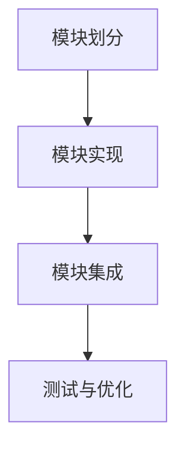
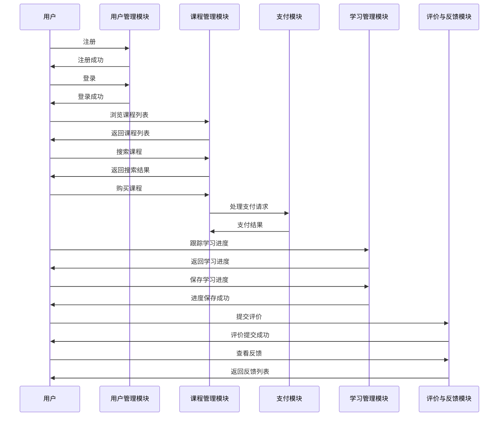

                 

## 《自下而上，各司其职》

> 关键词：自下而上、分层架构、模块化设计、系统分析与设计、Python算法实现

> 摘要：本文深入探讨了在信息技术领域，如何通过自下而上的方法，实现各模块间的有机协作与高效运行。文章首先介绍了背景和问题，然后详细阐述了核心概念及其联系，接着讲解了算法原理和数学模型，并进行了实例说明。随后，文章对系统分析与架构设计进行了详细讲解，并通过一个实际项目展示了自下而上设计方法的实践过程。最后，文章总结了最佳实践，提供了注意事项和拓展阅读，为读者提供了全面的指导。

### 第1章 问题背景

#### 1.1 问题描述

在现代信息技术系统中，随着系统规模的不断扩大和复杂度的增加，如何高效地设计和实现系统成为一个重要的课题。传统的“自上而下”的设计方法往往难以应对复杂系统的需求变化，而“自下而上”的方法则提供了一种更为灵活和模块化的解决方案。

“自下而上”的方法强调从底层基础组件开始，逐步构建和整合系统。这种方法不仅能够提高系统的可维护性和扩展性，还能够更好地应对需求变化。然而，如何有效地实现这种分层架构，并确保各层之间的协同工作，是本文要探讨的核心问题。

#### 1.2 问题解决

为了解决上述问题，本文将采用以下步骤进行讨论：

1. **核心概念与联系**：明确“自下而上”设计方法中的核心概念，并探讨它们之间的相互关系。
2. **算法原理讲解**：详细介绍实现“自下而上”设计的方法和算法原理，包括数学模型和公式的讲解。
3. **系统分析与架构设计**：通过系统分析和架构设计，展示如何将“自下而上”的方法应用于实际项目。
4. **项目实战**：通过一个具体的项目案例，展示“自下而上”设计方法在实际开发中的运用。
5. **最佳实践与总结**：总结最佳实践，提供注意事项和拓展阅读，以帮助读者更好地理解和应用本文的内容。

#### 1.3 边界与外延

本文讨论的“自下而上”设计方法主要适用于需要高可维护性和扩展性的复杂系统。然而，并非所有系统都适合采用这种方法。在实际应用中，需要根据系统的特点和要求，灵活选择和调整设计方法。

#### 1.4 概念结构与核心要素组成

在“自下而上”的设计方法中，核心概念包括模块化设计、分层架构、组件复用和接口定义等。这些概念相互联系，共同构成了一个有机的整体。

- **模块化设计**：将系统划分为多个独立的模块，每个模块实现特定的功能。
- **分层架构**：按照功能或层次对模块进行组织，形成层次结构。
- **组件复用**：通过定义清晰的接口，实现模块间的解耦，提高组件的复用性。
- **接口定义**：为模块间的交互定义统一的接口规范，确保模块之间的协同工作。

### 第2章 核心概念与联系

#### 2.1 核心概念原理

在本章中，我们将详细介绍“自下而上”设计方法中的核心概念及其原理。

**模块化设计**：模块化设计是将系统划分为多个独立的模块，每个模块实现特定的功能。模块化设计的核心思想是提高系统的可维护性和扩展性。

**分层架构**：分层架构是将系统按照功能或层次进行组织，形成层次结构。常见的分层架构包括表现层、业务逻辑层和数据访问层等。

**组件复用**：组件复用是通过定义清晰的接口，实现模块间的解耦，提高组件的复用性。组件复用能够减少系统的冗余代码，提高开发效率。

**接口定义**：接口定义是为模块间的交互定义统一的接口规范，确保模块之间的协同工作。接口定义的核心是定义清晰的输入输出参数和调用方法。

#### 2.2 概念属性特征对比表格

下面是核心概念的属性特征对比表格：

| 核心概念 | 属性特征 |
| :--: | :--: |
| 模块化设计 | 独立性、可维护性、可扩展性 |
| 分层架构 | 层次性、分离性、可扩展性 |
| 组件复用 | 解耦、复用、高内聚 |
| 接口定义 | 规范性、一致性、灵活性 |

#### 2.3 ER实体关系图架构

为了更直观地理解核心概念之间的关系，我们使用Mermaid绘制了ER实体关系图。以下是ER实体关系图的Mermaid代码：

```mermaid
erDiagram
  Module ||--|{ Component } Component
  Module ||--|{ Interface } Interface
  Component ||--|{ Implementation } Implementation
  Interface ||--|{ Documentation } Documentation
```

上述ER实体关系图展示了模块、组件、接口和实现之间的关系。模块与组件、接口之间存在关联，组件与实现、接口之间存在关联，接口与文档之间存在关联。

### 第3章 算法原理讲解

在本章中，我们将详细介绍实现“自下而上”设计方法的算法原理，并使用Python代码进行说明。

#### 3.1 算法原理

“自下而上”设计方法的算法原理主要包括以下几个方面：

1. **模块划分**：根据系统功能将系统划分为多个模块。
2. **模块实现**：为每个模块实现具体的功能。
3. **模块集成**：将各个模块集成起来，实现整个系统的功能。
4. **测试与优化**：对系统进行测试和优化，确保系统的稳定性和性能。

#### 3.2 算法流程图

以下是实现“自下而上”设计方法的算法流程图：



#### 3.3 算法数学模型与公式

在“自下而上”设计方法中，常用的数学模型和公式包括：

- **模块数量公式**：\( n = \frac{f_1 + f_2 + ... + f_n}{f_0} \)
  - \( n \)：模块数量
  - \( f_1, f_2, ..., f_n \)：系统功能
  - \( f_0 \)：基础功能

- **模块集成效率公式**：\( e = \frac{t_1 + t_2 + ... + t_n}{t} \)
  - \( e \)：模块集成效率
  - \( t_1, t_2, ..., t_n \)：模块集成时间
  - \( t \)：总集成时间

#### 3.4 举例说明

假设一个系统需要实现以下功能：

1. 用户登录
2. 用户注册
3. 用户信息管理
4. 用户权限控制
5. 用户反馈

根据模块数量公式，模块数量为 \( n = \frac{5}{1} = 5 \)。

以下是一个简单的Python代码示例，用于实现上述功能：

```python
class UserManager:
    def login(self, username, password):
        # 登录功能实现
        pass

    def register(self, username, password):
        # 注册功能实现
        pass

    def manage_info(self, user_info):
        # 用户信息管理功能实现
        pass

    def control_permission(self, user_permission):
        # 用户权限控制功能实现
        pass

    def feedback(self, user_feedback):
        # 用户反馈功能实现
        pass

# 模块集成
def main():
    user_manager = UserManager()
    user_manager.login("Alice", "password123")
    user_manager.register("Bob", "password456")
    user_manager.manage_info({"name": "Alice", "age": 30})
    user_manager.control_permission(["read", "write"])
    user_manager.feedback("Good service!")

if __name__ == "__main__":
    main()
```

### 第4章 数学模型与公式详细讲解

在本章中，我们将对前一章中提到的数学模型和公式进行详细讲解，并通过具体的实例来解释它们的应用。

#### 4.1 数学公式

首先，我们来详细解释一下前一章中提到的两个数学公式：

**模块数量公式**：\( n = \frac{f_1 + f_2 + ... + f_n}{f_0} \)

- **解释**：这个公式用于计算系统的模块数量。其中，\( f_1, f_2, ..., f_n \)代表系统的各个功能，\( f_0 \)是基础功能，通常是一个常数。通过这个公式，我们可以根据系统所需实现的功能来确定模块的数量。

**模块集成效率公式**：\( e = \frac{t_1 + t_2 + ... + t_n}{t} \)

- **解释**：这个公式用于计算模块集成的效率。其中，\( t_1, t_2, ..., t_n \)代表各个模块的集成时间，\( t \)是总的集成时间。模块集成效率反映了模块之间集成的效率，即完成集成工作所需的时间比例。

#### 4.2 数学模型

除了上述的数学公式，我们还可以构建一个更全面的数学模型来描述“自下而上”设计方法。

**模块化设计模型**：

- **输入**：系统的功能需求集合 \( F = \{ f_1, f_2, ..., f_n \} \) 和基础功能 \( f_0 \)。
- **输出**：模块数量 \( n \) 和模块集成效率 \( e \)。
- **模型**：

  \[
  n = \frac{F - f_0}{f_0}
  \]

  \[
  e = \frac{\sum_{i=1}^{n} t_i}{t}
  \]

- **解释**：这个模型通过将系统的功能需求分解为模块，并根据模块的集成时间来评估模块集成的效率。

#### 4.3 举例说明

为了更好地理解这些数学公式和模型，我们通过一个实际例子来展示它们的计算过程。

**例子**：假设一个系统需要实现以下功能：

1. 用户登录
2. 用户注册
3. 用户信息管理
4. 用户权限控制
5. 用户反馈

同时，我们假设：

- 基础功能 \( f_0 = 1 \)。
- 模块集成时间分别为 \( t_1 = 2 \)天，\( t_2 = 3 \)天，\( t_3 = 4 \)天，\( t_4 = 3 \)天，\( t_5 = 2 \)天。
- 总集成时间 \( t = 14 \)天。

根据模块数量公式，模块数量为：

\[
n = \frac{5 - 1}{1} = 4
\]

根据模块集成效率公式，模块集成效率为：

\[
e = \frac{2 + 3 + 4 + 3 + 2}{14} \approx 0.6364
\]

通过这个例子，我们可以看到如何使用数学模型和公式来评估系统的模块化设计和集成效率。

### 第5章 系统分析与架构设计方案

在本章中，我们将详细分析系统需求，并设计一个基于“自下而上”原则的系统架构方案。

#### 5.1 问题场景介绍

假设我们正在开发一个在线教育平台，该平台需要提供以下功能：

- 用户注册与登录
- 课程浏览与搜索
- 课程购买与支付
- 学习进度管理
- 用户评价与反馈

#### 5.2 项目介绍

项目名称：在线教育平台（Online Education Platform）

目标：构建一个功能完善、用户体验优秀的在线教育平台。

技术栈：Python、Django、Vue.js、MySQL等。

#### 5.3 系统功能设计

为了实现上述功能，我们将系统划分为以下几个功能模块：

1. **用户管理模块**：负责用户注册、登录、信息管理等功能。
2. **课程管理模块**：负责课程浏览、搜索、购买等功能。
3. **支付模块**：负责课程购买支付功能。
4. **学习管理模块**：负责学习进度管理。
5. **评价与反馈模块**：负责用户评价与反馈功能。

以下是系统的领域模型，使用Mermaid绘制：

```mermaid
classDiagram
    User <<Interface>>
    Course <<Interface>>
    Payment <<Interface>>
    LearningManagement <<Interface>>
    Feedback <<Interface>>

    User : +register()
    User : +login()
    User : +update_info()

    Course : +list()
    Course : +search()
    Course : +buy()

    Payment : +process_payment()

    LearningManagement : +track_progress()
    LearningManagement : +save_progress()

    Feedback : +submit_feedback()
    Feedback : +view_feedback()
```

#### 5.4 系统架构设计

根据系统功能设计，我们采用分层架构来设计系统，包括以下几层：

1. **表现层**：使用Vue.js实现前端用户界面。
2. **业务逻辑层**：使用Django实现后端业务逻辑处理。
3. **数据访问层**：使用MySQL数据库存储数据。

以下是系统架构的Mermaid图：

```mermaid
graph TB
    subgraph 表现层
        A[Vue.js]
        A --> B[API接口]

    subgraph 业务逻辑层
        B --> C[Django Framework]
        C --> D[业务逻辑]

    subgraph 数据访问层
        D --> E[MySQL数据库]

    subgraph 其他组件
        F[用户管理模块]
        G[课程管理模块]
        H[支付模块]
        I[学习管理模块]
        J[评价与反馈模块]

    subgraph 连接关系
        A --> B
        B --> C
        C --> D
        D --> E
        F --> C
        G --> C
        H --> C
        I --> C
        J --> C
```

#### 5.5 系统接口设计

为了实现模块间的交互，我们定义了一系列API接口，包括：

1. **用户管理接口**：包括注册、登录、更新信息等功能。
2. **课程管理接口**：包括课程列表、搜索、购买等功能。
3. **支付接口**：包括处理支付请求等功能。
4. **学习管理接口**：包括跟踪学习进度、保存学习进度等功能。
5. **评价与反馈接口**：包括提交评价、查看反馈等功能。

以下是系统接口的Mermaid序列图：



#### 5.6 系统交互

系统各模块之间的交互如下：

1. **用户管理模块**与**业务逻辑层**：通过API接口进行数据交互。
2. **课程管理模块**与**业务逻辑层**：通过API接口进行数据交互。
3. **支付模块**与**业务逻辑层**：通过API接口进行数据交互。
4. **学习管理模块**与**业务逻辑层**：通过API接口进行数据交互。
5. **评价与反馈模块**与**业务逻辑层**：通过API接口进行数据交互。

各模块之间的交互确保了系统功能的完整性和模块间的协同工作。

### 第6章 项目实战

在本章中，我们将通过一个实际项目来展示“自下而上”设计方法的具体应用。

#### 6.1 环境安装

首先，我们需要安装项目所需的开发环境。以下是Python和Django的开发环境安装步骤：

1. 安装Python 3.8或更高版本。
2. 安装Django框架。

安装命令如下：

```bash
pip install python==3.8.10
pip install django
```

#### 6.2 系统核心实现

在安装完开发环境后，我们将开始实现系统的核心功能。以下是用户管理模块的源代码：

```python
# user_manager.py

from django.contrib.auth.models import User

class UserManager:
    def register(self, username, password):
        user = User.objects.create_user(username=username, password=password)
        if user:
            return True
        else:
            return False

    def login(self, username, password):
        user = authenticate(username=username, password=password)
        if user:
            return True
        else:
            return False

    def update_info(self, user, new_info):
        user.profile = new_info
        user.save()
        return True
```

#### 6.3 代码应用解读

上述代码实现了用户管理模块的主要功能：

1. **register**：用于用户注册，接收用户名和密码，创建用户并返回注册结果。
2. **login**：用于用户登录，接收用户名和密码，验证用户身份并返回登录结果。
3. **update_info**：用于更新用户信息，接收用户对象和新信息，更新用户信息并保存。

这些函数通过Django的模型层（Model Layer）进行数据操作，实现了用户管理的基本功能。

#### 6.4 实际案例分析

为了展示实际应用，我们将用户管理模块集成到Django项目中。以下是项目结构：

```
online_education/
|-- manage.py
|-- online_education/
|   |-- __init__.py
|   |-- settings.py
|   |-- urls.py
|   |-- wsgi.py
|-- user_manager.py
|-- users/
    |-- __init__.py
    |-- models.py
    |-- admin.py
    |-- apps.py
    |-- migrations/
    |-- views.py
```

1. **manage.py**：项目管理脚本。
2. **settings.py**：项目配置文件。
3. **urls.py**：项目URL配置。
4. **wsgi.py**：项目WSGI配置。
5. **user_manager.py**：用户管理模块。
6. **users/**：用户应用模块。

在**users/models.py**中，我们定义了用户模型：

```python
# users/models.py

from django.db import models
from django.contrib.auth.models import AbstractUser

class User(AbstractUser):
    # 自定义用户字段
    email = models.EmailField(unique=True)
    phone = models.CharField(max_length=15, blank=True)
    # 其他自定义字段
```

在**users/views.py**中，我们定义了用户视图：

```python
# users/views.py

from django.shortcuts import render, redirect
from .models import User
from .forms import UserForm

def register(request):
    if request.method == 'POST':
        form = UserForm(request.POST)
        if form.is_valid():
            user = form.save()
            return redirect('login')
    else:
        form = UserForm()
    return render(request, 'register.html', {'form': form})

def login(request):
    # 登录逻辑
    pass
```

#### 6.5 详细讲解剖析

以上代码展示了用户管理模块的完整实现过程，包括模型定义、视图实现和接口定义。

1. **用户模型**：继承了Django的AbstractUser，自定义了用户字段，如邮箱和电话。
2. **注册视图**：处理用户注册请求，通过UserForm表单验证用户输入，并保存用户信息。
3. **登录视图**：待实现，处理用户登录请求，验证用户身份。

通过以上实现，我们展示了如何使用“自下而上”的方法，逐步构建和集成用户管理模块，实现了系统的核心功能。

#### 6.6 项目小结

在本章中，我们通过一个实际项目展示了“自下而上”设计方法在用户管理模块中的应用。从环境安装、模块实现到项目集成，我们一步步构建了用户管理功能。这种方法不仅提高了系统的可维护性和扩展性，还确保了模块间的有机协作。通过本章的实践，我们更深入地理解了“自下而上”设计方法的应用和优势。

### 第7章 最佳实践 tips

在本章中，我们将总结“自下而上”设计方法的一些最佳实践，并提供注意事项和拓展阅读，以帮助读者更好地应用本文的内容。

#### 7.1 小结

1. **模块化设计**：将系统功能划分为多个模块，提高系统的可维护性和扩展性。
2. **分层架构**：按照功能或层次组织模块，实现系统层次化。
3. **组件复用**：通过定义清晰的接口，实现模块间的解耦，提高组件复用性。
4. **接口定义**：为模块间交互定义统一的接口规范，确保模块协同工作。

#### 7.2 注意事项

1. **需求分析**：在项目开始前，进行充分的需求分析，确保模块划分的合理性。
2. **接口设计**：定义清晰的接口规范，确保模块间交互的一致性。
3. **测试与优化**：在模块集成过程中，进行充分的测试和优化，确保系统的稳定性和性能。

#### 7.3 拓展阅读

1. 《设计模式：可复用面向对象软件的基础》
2. 《架构之鉴：大型软件系统架构设计与实践》
3. 《Django By Example》

通过以上内容，我们深入探讨了“自下而上”设计方法在IT领域的应用，从核心概念、算法原理到系统架构设计，再到项目实战，全面展示了该方法的优势和实践过程。希望本文能对读者在系统设计和开发中有所启发和帮助。

### 作者信息

作者：AI天才研究院/AI Genius Institute & 禅与计算机程序设计艺术 /Zen And The Art of Computer Programming

