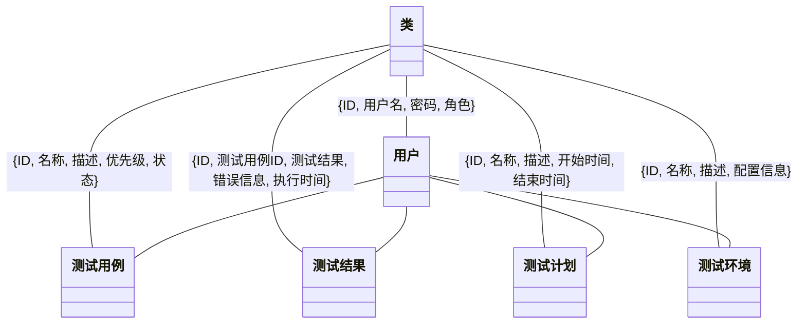
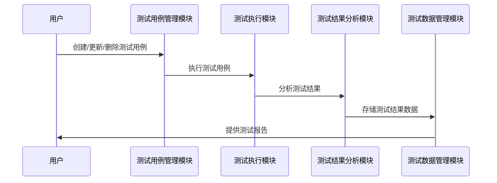
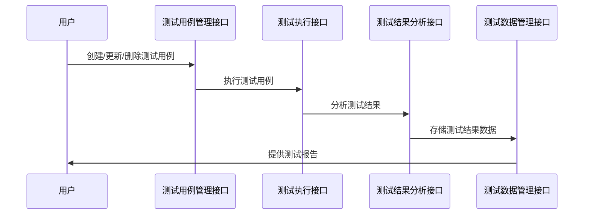

                 


### 文章标题：自动化测试：提高软件质量的关键实践

#### 关键词：自动化测试、软件质量、测试工具、测试方法、持续集成、持续交付

#### 摘要：
本文将深入探讨自动化测试在提升软件质量中的关键作用。通过详细分析自动化测试的背景、基础概念、设计原则、工具选择、实施流程、结果分析以及与持续集成和持续交付的结合，我们旨在为开发者和测试人员提供一份全面且实用的指南。文章还将通过实例，展示自动化测试的最佳实践，帮助读者更好地理解和应用自动化测试技术，以提高软件项目的整体质量。

### 目录大纲

#### 第一部分：自动化测试概述

**第1章：自动化测试的背景和重要性**
- **1.1 自动化测试的起源和发展**
- **1.2 软件质量与自动化测试的关系**
- **1.3 自动化测试在软件开发过程中的地位**
- **1.4 自动化测试的主要目标和优势**

**第2章：自动化测试的基础概念**
- **2.1 自动化测试的定义和分类**
- **2.2 自动化测试工具概述**
- **2.3 软件测试的生命周期**

**第3章：自动化测试设计原则和方法**
- **3.1 自动化测试的设计原则**
- **3.2 自动化测试的设计方法**
- **3.3 自动化测试用例的设计**

**第4章：自动化测试工具的选择与使用**
- **4.1 常见的自动化测试工具**
- **4.2 自动化测试工具的选择标准**
- **4.3 自动化测试工具的使用技巧**

**第5章：自动化测试实施与执行**
- **5.1 自动化测试的规划与组织**
- **5.2 自动化测试的实施流程**
- **5.3 自动化测试的执行策略**
- **5.4 自动化测试的执行过程**

**第6章：自动化测试结果分析与报告**
- **6.1 自动化测试结果分析**
- **6.2 自动化测试报告的撰写**
- **6.3 自动化测试结果的跟踪与反馈**

**第7章：自动化测试的持续集成与持续交付**
- **7.1 持续集成与持续交付概述**
- **7.2 自动化测试与持续集成的结合**
- **7.3 自动化测试与持续交付的结合**
- **7.4 自动化测试在持续集成与持续交付中的最佳实践**

**第二部分：深度解析与实例演示**

**第8章：自动化测试的深度解析**
- **8.1 自动化测试的核心概念与联系**
- **8.2 自动化测试的算法原理讲解**
- **8.3 自动化测试的系统分析与架构设计方案**

**第9章：项目实战与案例分析**
- **9.1 项目实战环境安装**
- **9.2 系统核心实现源代码解读**
- **9.3 实际案例分析**
- **9.4 项目小结**

**第10章：最佳实践与扩展**
- **10.1 自动化测试的最佳实践**
- **10.2 小结与注意事项**
- **10.3 拓展阅读与资源推荐**

### 写作思路与结构

#### 1. 引言
首先，我们将介绍自动化测试的背景和重要性，阐述为什么自动化测试是提升软件质量的关键实践。这一部分将简洁明了，吸引读者继续阅读。

#### 2. 概述部分
接着，我们按照目录大纲的结构，逐一介绍自动化测试的基础概念、设计原则、工具选择、实施流程、结果分析等核心内容。每个章节都将采用简洁明了的语言，配合流程图、图表等可视化元素，帮助读者更好地理解和掌握。

#### 3. 深度解析部分
在这一部分，我们将深入探讨自动化测试的核心概念和算法原理，使用Mermaid流程图和Python源代码，详细阐述自动化测试的工作机制和数学模型。

#### 4. 实例演示与实战
我们将通过一个实际项目，展示自动化测试的完整实施过程，包括环境搭建、核心代码实现和案例分析。这一部分将提供读者实际操作的视角，加深对自动化测试的理解。

#### 5. 最佳实践与扩展
最后，我们将总结自动化测试的最佳实践，提出注意事项，并推荐相关的拓展阅读资源，帮助读者进一步学习和提高。

#### 6. 结语
在文章的结尾，我们将再次强调自动化测试的重要性，并鼓励读者积极实践和应用自动化测试技术，以提升软件项目的质量。

### 写作风格与语言
本文将采用逻辑清晰、结构紧凑、简单易懂的专业技术语言，确保文章内容的准确性和可读性。同时，我们将注重语言的专业性，使用恰当的术语和表达方式，以适应专业读者的需求。

### 总结
本文旨在为读者提供一份全面且实用的自动化测试指南，通过深入分析和实例演示，帮助读者理解和掌握自动化测试的关键技术和实践方法。希望本文能成为读者在自动化测试领域的有力助手，助力软件项目的成功实施和高质量交付。

## 自动化测试：提高软件质量的关键实践

### 关键词：自动化测试、软件质量、测试工具、测试方法、持续集成、持续交付

### 摘要：
自动化测试已成为现代软件开发中不可或缺的一部分，其重要性不言而喻。本文将深入探讨自动化测试的背景、基础概念、设计原则、工具选择、实施流程、结果分析以及与持续集成和持续交付的结合。通过实例演示和实战经验，我们将帮助读者全面理解自动化测试的实践方法，提升软件项目的质量。

### 目录大纲

#### 第一部分：自动化测试概述

**第1章：自动化测试的背景和重要性**
- **1.1 自动化测试的起源和发展**
- **1.2 软件质量与自动化测试的关系**
- **1.3 自动化测试在软件开发过程中的地位**
- **1.4 自动化测试的主要目标和优势**

**第2章：自动化测试的基础概念**
- **2.1 自动化测试的定义和分类**
- **2.2 自动化测试工具概述**
- **2.3 软件测试的生命周期**

**第3章：自动化测试设计原则和方法**
- **3.1 自动化测试的设计原则**
- **3.2 自动化测试的设计方法**
- **3.3 自动化测试用例的设计**

**第4章：自动化测试工具的选择与使用**
- **4.1 常见的自动化测试工具**
- **4.2 自动化测试工具的选择标准**
- **4.3 自动化测试工具的使用技巧**

**第5章：自动化测试实施与执行**
- **5.1 自动化测试的规划与组织**
- **5.2 自动化测试的实施流程**
- **5.3 自动化测试的执行策略**
- **5.4 自动化测试的执行过程**

**第6章：自动化测试结果分析与报告**
- **6.1 自动化测试结果分析**
- **6.2 自动化测试报告的撰写**
- **6.3 自动化测试结果的跟踪与反馈**

**第7章：自动化测试的持续集成与持续交付**
- **7.1 持续集成与持续交付概述**
- **7.2 自动化测试与持续集成的结合**
- **7.3 自动化测试与持续交付的结合**
- **7.4 自动化测试在持续集成与持续交付中的最佳实践**

**第二部分：深度解析与实例演示**

**第8章：自动化测试的深度解析**
- **8.1 自动化测试的核心概念与联系**
- **8.2 自动化测试的算法原理讲解**
- **8.3 自动化测试的系统分析与架构设计方案**

**第9章：项目实战与案例分析**
- **9.1 项目实战环境安装**
- **9.2 系统核心实现源代码解读**
- **9.3 实际案例分析**
- **9.4 项目小结**

**第10章：最佳实践与扩展**
- **10.1 自动化测试的最佳实践**
- **10.2 小结与注意事项**
- **10.3 拓展阅读与资源推荐**

### 写作思路与结构

#### 1. 引言
首先，我们将介绍自动化测试的背景和重要性，阐述为什么自动化测试是提升软件质量的关键实践。这一部分将简洁明了，吸引读者继续阅读。

#### 2. 概述部分
接着，我们按照目录大纲的结构，逐一介绍自动化测试的基础概念、设计原则、工具选择、实施流程、结果分析等核心内容。每个章节都将采用简洁明了的语言，配合流程图、图表等可视化元素，帮助读者更好地理解和掌握。

#### 3. 深度解析部分
在这一部分，我们将深入探讨自动化测试的核心概念和算法原理，使用Mermaid流程图和Python源代码，详细阐述自动化测试的工作机制和数学模型。

#### 4. 实例演示与实战
我们将通过一个实际项目，展示自动化测试的完整实施过程，包括环境搭建、核心代码实现和案例分析。这一部分将提供读者实际操作的视角，加深对自动化测试的理解。

#### 5. 最佳实践与扩展
最后，我们将总结自动化测试的最佳实践，提出注意事项，并推荐相关的拓展阅读资源，帮助读者进一步学习和提高。

#### 6. 结语
在文章的结尾，我们将再次强调自动化测试的重要性，并鼓励读者积极实践和应用自动化测试技术，以提升软件项目的质量。

### 写作风格与语言
本文将采用逻辑清晰、结构紧凑、简单易懂的专业技术语言，确保文章内容的准确性和可读性。同时，我们将注重语言的专业性，使用恰当的术语和表达方式，以适应专业读者的需求。

### 总结
本文旨在为读者提供一份全面且实用的自动化测试指南，通过深入分析和实例演示，帮助读者理解和掌握自动化测试的关键技术和实践方法。希望本文能成为读者在自动化测试领域的有力助手，助力软件项目的成功实施和高质量交付。

## 第一部分：自动化测试概述

### 第1章：自动化测试的背景和重要性

#### 1.1 自动化测试的起源和发展

自动化测试的发展可以追溯到20世纪80年代，当时计算机技术开始迅速发展，软件开发项目规模不断扩大。传统的手工测试逐渐暴露出效率低下、成本高昂、难以复现等问题。为了提高测试效率和质量，自动化测试应运而生。

最初的自动化测试主要是通过编写脚本来自动化执行一些重复性的测试任务。随着技术的发展，自动化测试工具逐渐成熟，如QTP（现在称为UFT）、Selenium等。这些工具提供了丰富的功能和接口，使得自动化测试变得更加简便和高效。

近年来，自动化测试在软件测试领域取得了显著的发展。随着DevOps和敏捷开发理念的普及，自动化测试逐渐成为软件开发过程中的一个重要环节。自动化测试不仅提高了测试效率，还提升了测试覆盖率和测试质量，为软件项目的成功交付提供了有力保障。

#### 1.2 软件质量与自动化测试的关系

软件质量是软件开发过程中的核心目标之一。自动化测试作为软件测试的重要手段，对提高软件质量具有显著的作用。

首先，自动化测试能够提高测试效率。通过自动化执行测试用例，可以大大缩短测试周期，加快软件开发进程。尤其是在回归测试阶段，自动化测试可以快速验证软件功能的稳定性，避免因为新功能引入而导致的缺陷。

其次，自动化测试能够提升测试覆盖率。通过编写多样化的测试用例，自动化测试可以覆盖到更多可能的输入条件和执行路径，提高测试的全面性。这样可以更早地发现潜在缺陷，降低缺陷漏测的风险。

此外，自动化测试还可以提高测试的可靠性。自动化测试脚本可以重复执行，确保每次执行结果的一致性。这样可以减少人为干预对测试结果的影响，提高测试的准确性。

总之，自动化测试与软件质量密切相关。通过有效地实施自动化测试，可以显著提升软件项目的质量，降低缺陷率，提高用户满意度。

#### 1.3 自动化测试在软件开发过程中的地位

在软件开发过程中，自动化测试占据了重要地位。以下是自动化测试在各个阶段的作用：

1. **需求分析阶段**：自动化测试可以帮助分析测试需求，确定测试目标，设计测试策略。通过自动化测试，可以更早地发现需求的不一致和缺陷。

2. **设计阶段**：自动化测试可以辅助设计测试用例，确保测试覆盖全面。同时，自动化测试还可以验证设计方案的可行性和正确性。

3. **开发阶段**：自动化测试可以在代码开发过程中同步进行，及时发现并修复缺陷。自动化测试还可以验证代码的稳定性和可靠性。

4. **测试阶段**：自动化测试是测试阶段的重要组成部分。通过自动化执行测试用例，可以大大提高测试效率，缩短测试周期。自动化测试还可以与其他测试方法（如手工测试、性能测试等）相结合，提升测试覆盖率和测试质量。

5. **部署阶段**：自动化测试可以帮助验证软件在部署环境中的运行状况，确保软件的稳定性和可靠性。

总之，自动化测试在软件开发过程中的每个阶段都发挥着重要作用，是确保软件质量的关键环节。

#### 1.4 自动化测试的主要目标和优势

自动化测试的主要目标是提高软件测试的效率和准确性，从而提升软件项目的整体质量。具体来说，自动化测试有以下优势：

1. **提高测试效率**：通过自动化执行测试用例，可以大大缩短测试周期，加快软件开发进程。自动化测试还可以节省测试人员的时间和精力，使其更专注于更高价值的测试工作。

2. **提升测试覆盖率**：自动化测试可以编写多样化的测试用例，覆盖更多可能的输入条件和执行路径，提高测试的全面性。这样可以更早地发现潜在缺陷，降低缺陷漏测的风险。

3. **降低测试成本**：自动化测试可以重复执行，节省了重复手工执行测试用例的时间和人力成本。同时，自动化测试还可以减少由于手工测试中的错误和疏忽导致的缺陷漏测。

4. **提高测试可靠性**：自动化测试脚本可以重复执行，确保每次执行结果的一致性。这样可以减少人为干预对测试结果的影响，提高测试的准确性。

5. **支持持续集成和持续交付**：自动化测试与持续集成和持续交付相结合，可以确保每次代码变更都经过充分的测试，确保软件的稳定性和可靠性。

总之，自动化测试在提高软件测试效率、测试覆盖率和测试可靠性方面具有显著的优势，是提升软件质量的关键实践。

### 小结

在本章中，我们介绍了自动化测试的背景和重要性，探讨了自动化测试与软件质量的关系，以及自动化测试在软件开发过程中的地位和优势。通过这些内容，读者可以初步了解自动化测试的基本概念和作用，为后续章节的深入学习打下基础。

在下一章中，我们将进一步探讨自动化测试的基础概念，包括自动化测试的定义、分类、工具概述和软件测试的生命周期。请读者继续关注，以便更全面地了解自动化测试的相关知识。

## 第2章：自动化测试的基础概念

### 2.1 自动化测试的定义和分类

自动化测试是指通过预先编写的脚本或程序来自动执行测试过程的一种测试方法。它主要包括以下两个核心要素：测试脚本和自动化测试工具。

#### 测试脚本

测试脚本是一组指令，用于模拟用户操作或验证系统功能。测试脚本通常采用编程语言编写，如Python、Java、C#等。测试脚本可以自动化执行一系列测试步骤，包括输入数据、执行操作、验证结果等。

#### 自动化测试工具

自动化测试工具是用于编写、执行和管理测试脚本的工具。常见的自动化测试工具有QTP/UFT、Selenium、Appium、JUnit等。这些工具提供了丰富的功能和接口，使得自动化测试变得更加简便和高效。

根据测试目标的不同，自动化测试可以分为以下几种类型：

1. **功能自动化测试**：主要用于验证软件功能的正确性。功能自动化测试通常基于用户界面进行，通过模拟用户操作来验证系统功能是否符合预期。

2. **性能自动化测试**：主要用于评估软件的性能和稳定性。性能自动化测试通常使用专门的工具和脚本，模拟大量用户访问或压力测试，以评估系统的响应速度、并发处理能力等。

3. **安全自动化测试**：主要用于检测软件的安全漏洞。安全自动化测试通常使用专门的工具和脚本，模拟各种攻击场景，以发现潜在的安全隐患。

4. **兼容性自动化测试**：主要用于验证软件在不同操作系统、浏览器和设备上的兼容性。兼容性自动化测试通常使用跨浏览器测试工具，如BrowserStack、Sauce Labs等。

#### 自动化测试工具概述

常见的自动化测试工具如下：

1. **QTP/UFT**：QTP（QuickTest Professional）是由惠普（HP）公司开发的一款功能自动化测试工具。UFT（Unified Functional Testing）是QTP的升级版，具有更强大的功能和灵活性。QTP/UFT支持多种编程语言，如VBScript、Java等，适用于各种类型的自动化测试。

2. **Selenium**：Selenium是一个开源的自动化测试工具，适用于Web应用的自动化测试。Selenium支持多种编程语言，如Python、Java、C#等。Selenium具有跨浏览器的兼容性，可以在不同浏览器上执行测试。

3. **Appium**：Appium是一个开源的移动应用自动化测试工具，适用于iOS和Android平台。Appium支持多种编程语言，如Java、Python、C#等。Appium具有强大的功能和灵活性，可以模拟用户操作、验证应用功能等。

4. **JUnit**：JUnit是一个开源的自动化测试框架，主要用于Java应用程序的单元测试。JUnit提供了丰富的测试功能和断言方法，可以方便地编写和执行测试用例。

#### 软件测试的生命周期

软件测试的生命周期包括以下阶段：

1. **测试计划**：在测试计划阶段，确定测试目标、测试策略、测试资源等。测试计划是确保自动化测试顺利进行的重要文档。

2. **测试设计**：在测试设计阶段，根据测试计划，设计测试用例和测试脚本。测试设计是自动化测试的核心环节，直接影响测试质量和效率。

3. **测试实现**：在测试实现阶段，编写和调试测试脚本。测试脚本的质量和可维护性对后续测试执行和测试管理至关重要。

4. **测试执行**：在测试执行阶段，执行测试脚本，记录测试结果。测试执行是自动化测试的关键环节，需要确保测试脚本的正确执行和测试结果的有效记录。

5. **测试报告**：在测试报告阶段，根据测试结果，编写测试报告，分析测试数据，总结测试经验。测试报告是评估测试质量和测试效率的重要依据。

6. **测试管理**：在测试管理阶段，对自动化测试资源进行管理和调度，确保自动化测试的顺利进行。测试管理包括测试脚本管理、测试环境管理、测试进度管理等方面。

#### 自动化测试的优势

自动化测试相对于手工测试具有以下优势：

1. **提高测试效率**：自动化测试可以快速执行大量测试用例，大大缩短测试周期，提高测试效率。

2. **提升测试覆盖率**：自动化测试可以编写多样化的测试用例，覆盖更多可能的输入条件和执行路径，提高测试覆盖率。

3. **降低测试成本**：自动化测试可以节省手工执行测试用例的时间和人力成本，降低测试成本。

4. **提高测试可靠性**：自动化测试脚本可以重复执行，确保每次执行结果的一致性，提高测试可靠性。

5. **支持持续集成和持续交付**：自动化测试与持续集成和持续交付相结合，可以确保每次代码变更都经过充分的测试，提高软件质量。

总之，自动化测试在提高测试效率、测试覆盖率和测试可靠性方面具有显著优势，是提升软件质量的关键实践。

### 小结

在本章中，我们介绍了自动化测试的定义、分类、工具概述和软件测试的生命周期。通过这些内容，读者可以初步了解自动化测试的基本概念和作用，为后续章节的深入学习打下基础。在下一章中，我们将进一步探讨自动化测试的设计原则和方法，包括设计原则、设计方法和测试用例的设计。请读者继续关注，以便更全面地了解自动化测试的相关知识。

## 第3章：自动化测试设计原则和方法

### 3.1 自动化测试的设计原则

自动化测试设计是确保测试质量和效率的关键环节。为了设计出高质量的自动化测试，我们需要遵循以下设计原则：

#### 1. **可维护性原则**

自动化测试脚本应具有良好的可维护性，便于后续修改和维护。以下是一些实现可维护性的方法：

- **模块化**：将测试脚本划分为多个模块，每个模块负责特定的功能或测试步骤。
- **代码注释**：在关键代码部分添加注释，说明代码的功能和目的。
- **使用配置文件**：将测试脚本中的配置信息（如URL、用户名、密码等）存储在配置文件中，便于修改和管理。
- **使用面向对象编程**：采用面向对象的方法编写测试脚本，提高代码的可重用性和可维护性。

#### 2. **可扩展性原则**

自动化测试设计应具备良好的可扩展性，以便在项目需求变化或新增功能时，能够方便地添加新的测试用例。以下是一些实现可扩展性的方法：

- **使用测试框架**：选择合适的自动化测试框架，如Selenium、Appium等，这些框架提供了丰富的功能和扩展接口，便于扩展测试用例。
- **参数化测试**：将测试数据与测试脚本分离，使用参数化方法传递测试数据，便于添加新的测试用例。
- **重构代码**：在测试脚本开发过程中，定期进行代码重构，优化代码结构，提高测试用例的可扩展性。

#### 3. **稳定性原则**

自动化测试设计应确保测试脚本的稳定性，避免因测试脚本错误导致测试失败或数据丢失。以下是一些实现稳定性的方法：

- **使用断言**：在测试脚本中添加适当的断言，验证测试结果是否满足预期。
- **使用等待机制**：在测试脚本中引入等待机制，避免因页面加载缓慢导致的测试失败。
- **使用日志记录**：在测试脚本中添加日志记录功能，记录测试过程中的关键信息，便于故障排查。

#### 4. **可靠性原则**

自动化测试设计应确保测试结果的可靠性，避免因测试环境或数据问题导致测试结果不准确。以下是一些实现可靠性的方法：

- **环境一致性**：确保测试环境与生产环境保持一致，避免因环境差异导致测试结果不准确。
- **测试数据有效性**：确保测试数据的有效性和完整性，避免因测试数据问题导致测试失败。
- **复现问题**：在测试过程中，确保能够复现问题，便于定位和解决问题。

#### 5. **可复用性原则**

自动化测试设计应提高测试用例的可复用性，避免重复编写相同或类似的测试用例。以下是一些实现可复用性的方法：

- **使用共享库**：将通用测试步骤或功能封装成共享库，便于在不同测试用例中复用。
- **使用数据驱动测试**：将测试数据与测试脚本分离，使用数据驱动的方法执行测试用例，提高测试用例的复用性。
- **使用测试框架**：选择合适的自动化测试框架，这些框架通常提供了丰富的测试组件和测试库，便于复用测试用例。

### 3.2 自动化测试的设计方法

自动化测试设计方法是指设计自动化测试脚本和测试用例的方法。以下是一些常用的设计方法：

#### 1. **基于场景的设计方法**

基于场景的设计方法是将测试用例划分为多个测试场景，每个测试场景模拟用户在使用软件时的一个完整操作过程。以下是一个基于场景的设计方法：

- **识别业务场景**：根据软件功能和需求，识别出用户在使用软件时的典型业务场景。
- **划分测试场景**：将识别出的业务场景划分为多个测试场景，如登录、购物、支付等。
- **设计测试用例**：为每个测试场景设计具体的测试用例，包括功能测试、边界测试、异常测试等。

#### 2. **基于风险的测试设计方法**

基于风险的测试设计方法是根据软件风险的大小和影响程度，设计测试用例。以下是一个基于风险的测试设计方法：

- **识别风险因素**：根据软件需求、设计和历史缺陷，识别出可能影响软件质量的风险因素。
- **评估风险影响**：对识别出的风险因素进行评估，确定其影响程度和发生概率。
- **设计测试用例**：根据风险因素的影响程度和发生概率，设计相应的测试用例，重点关注高风险部分的测试。

#### 3. **基于功能的测试设计方法**

基于功能的测试设计方法是根据软件功能设计测试用例。以下是一个基于功能的测试设计方法：

- **识别功能模块**：根据软件需求和设计，识别出软件的功能模块。
- **划分功能场景**：为每个功能模块划分出具体的测试场景，如输入、输出、边界等。
- **设计测试用例**：为每个功能场景设计具体的测试用例，包括功能测试、边界测试、异常测试等。

#### 4. **基于数据的测试设计方法**

基于数据的测试设计方法是根据软件输入数据和输出数据设计测试用例。以下是一个基于数据的测试设计方法：

- **收集测试数据**：根据软件需求和设计，收集出软件的输入数据和输出数据。
- **划分数据场景**：根据输入数据和输出数据的特点，划分出具体的数据场景，如有效数据、无效数据、边界数据等。
- **设计测试用例**：为每个数据场景设计具体的测试用例，包括数据有效性测试、数据边界测试等。

### 3.3 自动化测试用例的设计

自动化测试用例的设计是自动化测试设计的关键环节。以下是一些自动化测试用例设计的关键点：

#### 1. **测试用例模板**

为了确保测试用例的一致性和完整性，可以设计一个通用的测试用例模板。以下是一个测试用例模板的示例：

| 测试用例编号 | 测试场景         | 测试步骤                         | 预期结果                             | 实际结果 | 测试状态 |
| ------------- | ---------------- | -------------------------------- | ------------------------------------ | -------- | -------- |
| TC001         | 登录功能测试     | 输入用户名和密码，点击登录按钮    | 登录成功，进入用户主页                 |          | 未执行   |
| TC002         | 登录功能测试     | 输入错误的用户名和密码，点击登录按钮 | 显示错误提示信息                      |          | 未执行   |
| TC003         | 注册功能测试     | 输入有效的用户信息和邮箱，点击注册按钮 | 注册成功，显示注册成功提示信息       |          | 未执行   |
| TC004         | 注册功能测试     | 输入无效的用户信息和邮箱，点击注册按钮 | 显示错误提示信息                      |          | 未执行   |

#### 2. **测试用例编写要点**

在编写自动化测试用例时，需要注意以下几点：

- **测试场景明确**：确保测试用例的测试场景描述清晰，便于理解和执行。
- **测试步骤详细**：详细描述测试步骤，确保测试脚本能够正确执行。
- **预期结果准确**：准确描述预期结果，以便验证测试结果。
- **实际结果记录**：在测试执行过程中，记录实际结果，以便与预期结果进行对比。
- **测试状态标注**：标注测试用例的执行状态，如“未执行”、“通过”、“失败”等。

#### 3. **测试用例的评审**

在自动化测试用例编写完成后，需要进行评审，确保测试用例的质量和完整性。以下是一些评审要点：

- **测试用例覆盖全面**：确保测试用例覆盖了所有功能模块和边界情况。
- **测试步骤清晰准确**：检查测试步骤是否清晰、准确，便于测试执行。
- **预期结果合理**：检查预期结果是否合理，能够有效验证测试用例。
- **实际结果记录完整**：确保实际结果记录完整，便于问题定位和跟踪。

### 小结

在本章中，我们介绍了自动化测试的设计原则和方法，包括设计原则、设计方法和测试用例的设计。通过这些内容，读者可以了解如何设计高质量的自动化测试脚本和测试用例，为后续的自动化测试实施打下基础。在下一章中，我们将探讨自动化测试工具的选择与使用，包括常见自动化测试工具的概述、选择标准和使用技巧。请读者继续关注，以便更全面地了解自动化测试的相关知识。

## 第4章：自动化测试工具的选择与使用

### 4.1 常见的自动化测试工具

在自动化测试领域，有许多流行的工具可供选择。以下是几种常见的自动化测试工具：

#### 1. **Selenium**

Selenium是一个开源的自动化测试工具，主要用于Web应用的自动化测试。Selenium支持多种编程语言，如Python、Java、C#等。Selenium的核心组件包括：

- **Selenium WebDriver**：用于自动化Web浏览器的操作，支持多种浏览器，如Chrome、Firefox、Safari等。
- **Selenium IDE**：一个基于浏览器的自动化测试记录和编辑工具。
- **Selenium Grid**：用于分布式测试，可以在多个节点上并行执行测试。

#### 2. **Appium**

Appium是一个开源的移动应用自动化测试工具，支持iOS和Android平台。Appium基于Selenium WebDriver，但可以模拟原生应用和Web应用。Appium的主要特点包括：

- **跨平台**：支持iOS和Android平台的移动应用自动化测试。
- **开源**：完全开源，免费使用。
- **易用性**：提供多种编程语言的支持，如Java、Python、C#等。

#### 3. **QTP/UFT**

QTP（QuickTest Professional）和UFT（Unified Functional Testing）是由惠普（HP）公司开发的自动化测试工具。QTP和UFT主要用于功能自动化测试，支持多种编程语言，如VBScript、Java等。它们的主要特点包括：

- **丰富的功能**：提供多种测试功能和接口，适用于各种类型的自动化测试。
- **跨平台**：支持多种操作系统，如Windows、Linux等。
- **企业级支持**：提供专业版和企业版，提供企业级支持和服务。

#### 4. **JUnit**

JUnit是一个开源的自动化测试框架，主要用于Java应用程序的单元测试。JUnit提供丰富的测试功能和断言方法，可以帮助开发者快速编写和执行测试用例。主要特点包括：

- **简单易用**：提供了丰富的测试方法和断言，使得编写测试用例变得简单。
- **灵活性**：可以与其他测试框架和工具集成，如TestNG、Selenium等。
- **可扩展性**：提供了插件机制，可以方便地扩展测试功能。

#### 5. **Cypress**

Cypress是一个现代的、易于使用的Web应用自动化测试框架。Cypress的主要特点包括：

- **开发者友好**：提供了一种直观、简单的开发体验，使得编写和执行测试变得更加容易。
- **端到端测试**：支持端到端测试，可以模拟用户交互和浏览器行为。
- **实时反馈**：提供了实时反馈和可视化调试功能，使得问题定位和修复更加高效。

#### 6. **TestCafe**

TestCafe是一个开源的Web应用自动化测试框架，提供了一种简单、高效的方法来编写和执行测试。TestCafe的主要特点包括：

- **浏览器兼容性**：支持在多个浏览器上执行测试，包括Chrome、Firefox、Safari等。
- **性能测试**：提供了性能测试功能，可以评估应用的响应速度和资源使用情况。
- **易于集成**：可以与CI/CD工具集成，支持自动化测试的持续集成和持续交付。

### 4.2 自动化测试工具的选择标准

选择适合的自动化测试工具是确保自动化测试成功的关键。以下是一些选择自动化测试工具的标准：

#### 1. **测试类型**

根据测试类型（如功能测试、性能测试、安全测试等）选择合适的测试工具。例如，对于Web应用的功能测试，可以选择Selenium、Appium或Cypress；对于移动应用的自动化测试，可以选择Appium；对于Java应用程序的单元测试，可以选择JUnit。

#### 2. **编程语言支持**

选择支持项目开发所使用的编程语言的自动化测试工具。例如，如果项目使用Java开发，可以选择JUnit或Selenium；如果项目使用Python开发，可以选择Selenium或Cypress。

#### 3. **易用性和学习曲线**

选择易于使用和学习的自动化测试工具，以便快速上手和高效使用。例如，Cypress提供了直观的用户界面和简单的API，适合初学者和有经验开发者。

#### 4. **社区支持和文档**

选择有活跃社区支持和详细文档的自动化测试工具。活跃的社区可以提供丰富的资源和帮助，详细的文档可以方便开发者学习和使用工具。

#### 5. **扩展性和灵活性**

选择具有良好扩展性和灵活性的自动化测试工具，以便适应项目的需求变化。例如，Selenium和Appium提供了丰富的扩展接口和插件，可以方便地添加新的功能和测试类型。

#### 6. **成本**

考虑项目的预算和成本，选择性价比高的自动化测试工具。开源工具通常成本较低，但可能需要额外的学习成本和技术支持。

### 4.3 自动化测试工具的使用技巧

以下是一些自动化测试工具的使用技巧，可以帮助提高自动化测试的效率和质量：

#### 1. **测试脚本设计**

- **模块化设计**：将测试脚本划分为多个模块，每个模块负责特定的功能或测试步骤。
- **代码注释**：添加必要的注释，说明代码的功能和目的，便于后续维护和调试。
- **参数化测试**：使用参数化方法传递测试数据，提高测试用例的复用性。

#### 2. **测试环境配置**

- **配置文件**：使用配置文件存储测试环境信息，如URL、用户名、密码等，便于修改和管理。
- **环境一致性**：确保测试环境与生产环境保持一致，避免因环境差异导致测试失败。

#### 3. **测试执行和管理**

- **分布式测试**：使用分布式测试框架（如Selenium Grid）执行测试，提高测试执行效率。
- **测试报告**：生成详细的测试报告，记录测试结果和异常信息，便于问题追踪和反馈。

#### 4. **调试和优化**

- **调试工具**：使用调试工具（如浏览器开发者工具）定位和修复测试脚本中的错误。
- **性能优化**：对测试脚本进行性能优化，提高测试效率，减少测试执行时间。

#### 5. **版本控制**

- **版本管理**：使用版本控制工具（如Git）管理测试脚本和测试数据，确保版本的一致性和安全性。

#### 6. **持续集成和持续交付**

- **集成测试**：将自动化测试集成到CI/CD流程中，确保每次代码变更都经过充分的测试。
- **持续反馈**：及时反馈测试结果，发现问题并进行修复，确保软件质量。

### 小结

在本章中，我们介绍了常见的自动化测试工具，包括Selenium、Appium、QTP/UFT、JUnit、Cypress和TestCafe等。我们还讨论了选择自动化测试工具的标准和使用技巧，以帮助开发者选择合适的工具并提高自动化测试的效率和质量。在下一章中，我们将探讨自动化测试的实施与执行，包括测试规划与组织、实施流程、执行策略和过程。请读者继续关注，以便更全面地了解自动化测试的相关知识。

## 第5章：自动化测试的实施与执行

### 5.1 自动化测试的规划与组织

自动化测试的规划和组织是确保自动化测试顺利进行的关键步骤。以下是一些关键步骤和注意事项：

#### 1. **确定自动化测试的目标和范围**

在开始自动化测试之前，需要明确自动化测试的目标和范围。自动化测试的目标可能包括：

- 提高测试效率，缩短测试周期。
- 提升测试覆盖率，确保关键功能得到充分测试。
- 支持持续集成和持续交付，确保代码变更经过充分测试。

自动化测试的范围可能包括：

- 功能测试：验证软件功能的正确性。
- 性能测试：评估软件的性能和稳定性。
- 安全测试：检测软件的安全漏洞。
- 兼容性测试：验证软件在不同操作系统、浏览器和设备上的兼容性。

#### 2. **组建自动化测试团队**

自动化测试团队应包括以下角色：

- 自动化测试工程师：负责编写、执行和维护自动化测试脚本。
- 测试工程师：参与自动化测试的设计和执行，确保测试覆盖全面。
- 开发人员：提供技术支持和协作，确保自动化测试脚本与代码一致。
- 项目经理：负责自动化测试项目的管理和协调。

#### 3. **制定自动化测试计划**

自动化测试计划应包括以下内容：

- 测试目标：明确自动化测试的目标和预期效果。
- 测试策略：确定自动化测试的方法和工具。
- 测试用例：列出需要自动化的测试用例。
- 测试环境：定义测试环境的要求和配置。
- 测试时间表：制定自动化测试的时间表和进度。

#### 4. **自动化测试环境的准备**

自动化测试环境的准备是确保自动化测试顺利进行的重要步骤。以下是一些关键点：

- 测试环境与生产环境保持一致，确保测试结果的准确性。
- 安装和配置自动化测试工具，如Selenium、Appium、QTP/UFT等。
- 安装和配置测试脚本所需的库和依赖项。
- 准备测试数据和测试数据源，如数据库、CSV文件等。

#### 5. **自动化测试的执行流程

自动化测试的执行流程包括以下步骤：

1. **测试用例设计**：根据自动化测试计划，设计自动化测试用例。
2. **测试脚本编写**：编写自动化测试脚本，实现自动化测试用例。
3. **测试脚本调试**：调试自动化测试脚本，确保脚本能够正确执行。
4. **测试执行**：执行自动化测试脚本，记录测试结果。
5. **结果分析**：分析自动化测试结果，找出问题和缺陷。
6. **问题反馈**：将测试结果和问题反馈给开发团队，确保问题得到及时解决。

### 5.2 自动化测试的实施流程

自动化测试的实施流程可以分为以下几个阶段：

#### 1. **需求分析阶段**

在需求分析阶段，测试团队需要与项目团队紧密合作，明确自动化测试的需求。以下是一些关键步骤：

- 分析软件需求，确定需要自动化的测试功能。
- 根据需求，制定自动化测试策略和测试用例。
- 评估自动化测试的可行性，包括技术、资源和时间等方面。

#### 2. **测试设计阶段**

在测试设计阶段，测试团队需要设计自动化测试用例，包括功能测试、性能测试、安全测试等。以下是一些关键步骤：

- 设计测试用例，列出需要自动化的测试步骤。
- 确定测试数据的来源和范围。
- 设计测试场景，确保测试用例覆盖关键功能和边界情况。

#### 3. **测试实现阶段**

在测试实现阶段，测试工程师需要编写自动化测试脚本，实现测试用例。以下是一些关键步骤：

- 选择合适的编程语言和自动化测试工具。
- 根据测试用例，编写自动化测试脚本。
- 调试和优化自动化测试脚本，确保其正确性和稳定性。

#### 4. **测试执行阶段**

在测试执行阶段，测试团队需要执行自动化测试脚本，记录测试结果。以下是一些关键步骤：

- 执行自动化测试脚本，生成测试报告。
- 分析测试结果，找出问题和缺陷。
- 将测试结果和问题反馈给开发团队，确保问题得到及时解决。

#### 5. **测试维护阶段**

在测试维护阶段，测试团队需要持续维护自动化测试脚本，包括修复缺陷、更新测试用例等。以下是一些关键步骤：

- 定期审查和更新自动化测试脚本，确保其与软件代码保持一致。
- 根据需求变化，添加新的测试用例和测试脚本。
- 保持测试脚本的可维护性和可扩展性。

### 5.3 自动化测试的执行策略

自动化测试的执行策略是指如何有效地执行自动化测试，以确保测试覆盖全面、测试结果准确。以下是一些自动化测试的执行策略：

#### 1. **分布式测试**

分布式测试是指将自动化测试脚本分布在多个节点上执行，以提高测试效率。以下是一些关键策略：

- **负载均衡**：合理分配测试任务到不同节点，避免某个节点过载。
- **故障转移**：在某个节点发生故障时，自动切换到其他节点，确保测试继续进行。
- **并行测试**：在同一时间执行多个测试任务，提高测试效率。

#### 2. **回归测试**

回归测试是指在软件版本更新后，重新执行之前通过测试的测试用例，以确保新版本没有引入缺陷。以下是一些关键策略：

- **优先级排序**：根据测试用例的重要性和风险，对回归测试用例进行优先级排序。
- **自动化测试脚本维护**：定期审查和更新自动化测试脚本，确保其与新版本软件兼容。
- **自动化测试结果分析**：分析回归测试结果，找出新版本中的问题和缺陷。

#### 3. **性能测试**

性能测试是评估软件的性能和稳定性，包括响应时间、并发处理能力等。以下是一些关键策略：

- **测试场景设计**：设计合理的性能测试场景，模拟实际用户行为。
- **负载生成**：生成不同负载，评估软件的性能表现。
- **性能瓶颈分析**：分析性能测试结果，找出性能瓶颈并进行优化。

#### 4. **安全测试**

安全测试是检测软件的安全漏洞和潜在风险。以下是一些关键策略：

- **漏洞扫描**：使用专业的漏洞扫描工具，检测软件中的安全漏洞。
- **安全测试用例**：设计针对性的安全测试用例，验证软件的安全性。
- **安全测试结果分析**：分析安全测试结果，找出安全漏洞并进行修复。

### 5.4 自动化测试的执行过程

自动化测试的执行过程包括以下几个步骤：

#### 1. **测试环境准备**

确保自动化测试环境已准备好，包括测试工具的安装和配置、测试数据的准备等。

#### 2. **执行测试脚本**

执行自动化测试脚本，根据测试用例的步骤进行操作，记录测试结果。

#### 3. **结果分析**

分析自动化测试结果，包括通过测试用例、失败测试用例和异常情况。记录测试结果，生成测试报告。

#### 4. **问题反馈**

将自动化测试结果和问题反馈给开发团队，确保问题得到及时解决。

#### 5. **测试报告**

编写详细的自动化测试报告，包括测试执行情况、测试结果、问题和建议等。

### 小结

在本章中，我们介绍了自动化测试的规划与组织、实施流程、执行策略和过程。通过这些内容，读者可以了解如何有效地实施自动化测试，确保测试覆盖全面、测试结果准确。在下一章中，我们将探讨自动化测试结果的分析与报告，包括自动化测试结果的分析、报告的撰写和结果跟踪与反馈。请读者继续关注，以便更全面地了解自动化测试的相关知识。

## 第6章：自动化测试结果分析与报告

### 6.1 自动化测试结果分析

自动化测试结果的准确分析是确保软件质量的关键步骤。通过详细分析自动化测试结果，可以及时发现并解决软件中的缺陷，从而提升软件的整体质量。以下是自动化测试结果分析的一些关键点：

#### 1. **测试结果统计**

首先，需要对自动化测试的结果进行统计，包括以下指标：

- **测试覆盖率**：自动化测试覆盖的测试用例数量与总测试用例数量的比例。测试覆盖率越高，说明测试覆盖面越广，软件质量越高。
- **测试通过率**：通过测试的测试用例数量与总测试用例数量的比例。测试通过率越高，说明软件的功能越稳定。
- **失败率**：失败测试用例数量与总测试用例数量的比例。失败率越低，说明自动化测试的有效性越高。

#### 2. **缺陷分类与统计**

对测试结果中的缺陷进行分类和统计，有助于分析缺陷产生的原因和影响。以下是一些常见的缺陷分类：

- **功能缺陷**：软件功能不符合需求规格。
- **界面缺陷**：软件界面的布局、样式、交互等方面存在错误。
- **性能缺陷**：软件的性能不符合预期，如响应时间过长、并发处理能力不足等。
- **兼容性缺陷**：软件在不同操作系统、浏览器和设备上的兼容性存在问题。

通过对缺陷进行分类和统计，可以找出常见的缺陷类型和缺陷集中区域，从而针对性地进行优化和改进。

#### 3. **趋势分析**

通过对自动化测试结果的历史数据进行趋势分析，可以识别出软件质量的变化趋势。以下是一些常用的趋势分析方法：

- **通过率趋势**：分析测试通过率的变化情况，判断软件质量是否稳定。
- **失败率趋势**：分析失败率的变化情况，判断自动化测试的有效性是否提升。
- **缺陷分类趋势**：分析不同类型缺陷的变化情况，判断软件质量改进的方向。

#### 4. **数据可视化**

使用数据可视化工具，如图表、仪表盘等，将自动化测试结果以直观的方式呈现，有助于快速识别问题和趋势。以下是一些常见的数据可视化方法：

- **柱状图**：用于展示测试覆盖率、通过率、失败率等指标的分布情况。
- **折线图**：用于展示测试通过率、失败率等指标的变化趋势。
- **饼图**：用于展示缺陷分类的占比情况。

### 6.2 自动化测试报告的撰写

自动化测试报告是总结自动化测试结果和反馈问题的重要文档。一个完整的自动化测试报告应包括以下内容：

#### 1. **报告概述**

报告概述部分应简要介绍测试背景、测试目的和测试范围，使读者对测试报告有一个整体的了解。

#### 2. **测试结果统计**

测试结果统计部分应详细列出测试覆盖率、通过率、失败率等指标，并提供相应的图表和数据可视化结果。

#### 3. **缺陷分类与统计**

缺陷分类与统计部分应列出不同类型的缺陷数量、占比和分布情况，并分析缺陷产生的原因和影响。

#### 4. **趋势分析**

趋势分析部分应展示自动化测试结果的历史数据变化趋势，帮助读者了解软件质量的变化情况。

#### 5. **测试总结**

测试总结部分应对整个自动化测试过程进行总结，包括测试的亮点、不足之处和改进建议。

#### 6. **问题反馈**

问题反馈部分应详细描述测试中发现的问题，包括缺陷的复现步骤、影响范围和解决方案建议。

#### 7. **附录**

附录部分可包含测试脚本、测试数据、测试报告模板等相关资料，便于读者查阅。

### 6.3 自动化测试结果的跟踪与反馈

自动化测试结果的跟踪与反馈是确保缺陷得到及时解决的重要环节。以下是一些关键步骤：

#### 1. **缺陷跟踪系统**

使用缺陷跟踪系统（如JIRA、Bugzilla等）记录和跟踪测试中发现的问题。缺陷跟踪系统应包括以下功能：

- **缺陷记录**：详细描述缺陷现象、复现步骤和影响范围。
- **缺陷状态**：记录缺陷的状态，如新建、已分配、已修复、关闭等。
- **缺陷优先级**：根据缺陷的影响程度和紧急程度，设置缺陷的优先级。

#### 2. **定期反馈**

定期向开发团队和项目管理团队反馈自动化测试结果和缺陷情况。反馈内容应包括：

- **测试结果概述**：测试覆盖率、通过率、失败率等关键指标。
- **缺陷分类与统计**：不同类型缺陷的分布情况和产生原因。
- **趋势分析**：自动化测试结果的历史数据变化趋势。
- **问题反馈**：测试中发现的问题及其解决方案建议。

#### 3. **缺陷修复确认**

在开发团队修复缺陷后，进行回归测试，确保问题得到有效解决。对已修复的缺陷进行验证和确认，并将结果记录在缺陷跟踪系统中。

#### 4. **持续改进**

根据自动化测试结果和缺陷反馈，持续改进自动化测试策略和测试用例。优化测试脚本，提高测试效率和覆盖率，确保软件质量不断提升。

### 小结

在本章中，我们介绍了自动化测试结果的分析与报告，包括测试结果分析、报告撰写和结果跟踪与反馈。通过详细的分析和报告，可以及时发现和解决软件缺陷，提升软件质量。在下一章中，我们将探讨自动化测试与持续集成和持续交付的结合，以及自动化测试在这些过程中的最佳实践。请读者继续关注，以便更全面地了解自动化测试的相关知识。

## 第7章：自动化测试的持续集成与持续交付

### 7.1 持续集成与持续交付概述

持续集成（Continuous Integration，简称CI）和持续交付（Continuous Delivery，简称CD）是现代软件开发中常用的两种实践方法，它们旨在通过自动化流程提高软件质量和交付效率。

#### 1. **持续集成（CI）**

持续集成是一种软件开发方法，通过自动化构建和测试，确保每次代码变更都被集成到主分支中，并及时发现潜在的问题。持续集成的主要目标包括：

- **快速反馈**：通过自动化构建和测试，迅速发现和修复代码问题。
- **减少集成成本**：通过频繁集成，将集成风险分散到每次变更中，减少大规模集成时的风险。
- **保持代码质量**：确保每次代码变更都符合质量标准，避免质量下降。

持续集成的核心组成部分包括：

- **代码库**：用于存储和共享代码的版本控制系统，如Git。
- **构建工具**：用于自动化构建代码的软件，如Jenkins、Travis CI等。
- **自动化测试**：用于验证代码变更是否符合预期的测试脚本和测试工具。

#### 2. **持续交付（CD）**

持续交付是一种软件交付方法，通过自动化流程和持续反馈，确保软件在交付过程中始终保持高质量。持续交付的主要目标包括：

- **快速交付**：通过自动化测试和部署，缩短软件交付周期。
- **高质量交付**：确保每次交付的软件都经过充分的测试和验证。
- **持续改进**：通过反馈和改进，不断提升软件质量和交付效率。

持续交付的核心组成部分包括：

- **自动化测试**：用于验证软件功能、性能和兼容性的自动化测试工具。
- **部署工具**：用于自动化部署软件的软件，如Jenkins、Docker等。
- **环境管理**：用于管理开发、测试和生产环境的工具和流程。

### 7.2 自动化测试与持续集成的结合

自动化测试与持续集成的结合，可以显著提升软件质量和交付效率。以下是自动化测试与持续集成结合的几个关键点：

#### 1. **自动化测试集成到CI流程**

将自动化测试集成到持续集成流程中，可以在每次代码变更提交时自动执行测试，确保新代码与现有代码的兼容性和正确性。以下是一些关键步骤：

- **编写测试脚本**：根据测试需求，编写自动化测试脚本，实现功能测试、性能测试和安全测试等。
- **集成测试框架**：使用测试框架（如Selenium、JUnit等）管理测试脚本，确保测试脚本的执行和结果记录。
- **CI工具配置**：配置CI工具（如Jenkins、Travis CI等），使其在代码提交时自动执行测试脚本，生成测试报告。

#### 2. **测试反馈机制**

通过持续集成系统，将测试结果及时反馈给开发团队和测试团队，确保问题得到快速响应和解决。以下是一些测试反馈机制：

- **构建状态标记**：在CI系统中标记构建状态，如成功、失败等，便于团队快速了解测试结果。
- **测试报告生成**：生成详细的测试报告，包括测试覆盖率、通过率、失败原因等，便于分析和改进。
- **缺陷跟踪**：将测试中发现的问题记录在缺陷跟踪系统中，确保问题得到及时修复和跟踪。

#### 3. **持续改进**

通过分析持续集成过程中的测试结果和反馈，持续改进自动化测试脚本和测试策略，提高测试效率和覆盖率。以下是一些持续改进的方法：

- **测试覆盖率分析**：定期分析测试覆盖率，确保测试覆盖关键功能和边界情况。
- **测试用例优化**：根据测试结果，优化测试用例，提高测试的有效性和可维护性。
- **测试反馈循环**：建立测试反馈循环，及时收集和反馈测试结果，确保问题得到快速响应和解决。

### 7.3 自动化测试与持续交付的结合

自动化测试与持续交付的结合，可以确保软件在交付过程中始终保持高质量，并缩短交付周期。以下是自动化测试与持续交付结合的几个关键点：

#### 1. **自动化部署**

将自动化测试集成到持续交付流程中，可以在每次代码变更提交时自动部署到测试环境和生产环境，确保软件的稳定性和可靠性。以下是一些自动化部署的关键步骤：

- **部署脚本**：编写自动化部署脚本，实现软件的打包、部署和配置。
- **部署工具**：使用部署工具（如Jenkins、Docker等）管理部署流程，确保部署的自动化和可重复性。
- **环境配置**：确保测试环境和生产环境的配置一致，避免因环境差异导致部署失败。

#### 2. **持续交付流水线**

构建持续交付流水线，将自动化测试、构建和部署集成到一个自动化流程中，确保软件在交付过程中始终保持高质量。以下是一些持续交付流水线的关键组成部分：

- **构建环节**：执行自动化构建和测试，确保代码变更符合质量标准。
- **测试环节**：执行自动化测试，验证软件的功能、性能和兼容性。
- **部署环节**：将经过测试的软件自动部署到测试环境和生产环境。

#### 3. **环境管理**

在持续交付过程中，环境管理至关重要。以下是一些环境管理的关键点：

- **环境一致性**：确保开发、测试和生产环境的配置一致，避免因环境差异导致问题。
- **环境隔离**：为每个环境创建独立的测试环境，避免不同环境的干扰。
- **环境监控**：监控每个环境的状态，确保环境稳定可靠。

### 7.4 自动化测试在持续集成与持续交付中的最佳实践

为了确保自动化测试在持续集成与持续交付中的有效性，以下是一些最佳实践：

#### 1. **自动化测试策略**

- **全面覆盖**：确保自动化测试覆盖关键功能和边界情况，避免漏测。
- **持续优化**：定期审查和优化测试用例和测试脚本，提高测试效率和覆盖率。
- **分层测试**：结合单元测试、集成测试和系统测试，形成完整的测试体系。

#### 2. **CI/CD工具选择**

- **选择合适的CI/CD工具**：根据项目需求和技术栈选择合适的CI/CD工具，如Jenkins、Travis CI、GitLab CI等。
- **工具集成**：确保CI/CD工具与代码库、测试框架和部署工具的集成，实现自动化流程。
- **配置管理**：使用配置管理工具（如Ansible、Puppet等）管理环境配置和部署脚本。

#### 3. **环境管理**

- **环境一致性**：确保不同环境（如开发、测试、生产）的配置一致，避免因环境差异导致问题。
- **环境隔离**：为每个环境创建独立的测试环境，避免不同环境的干扰。
- **环境监控**：监控每个环境的状态，确保环境稳定可靠。

#### 4. **持续反馈与改进**

- **测试反馈**：及时收集和反馈测试结果，确保问题得到快速响应和解决。
- **持续改进**：根据测试结果和反馈，持续优化自动化测试脚本和测试策略。
- **团队协作**：加强开发团队、测试团队和运维团队的协作，确保自动化测试和持续集成与持续交付的有效实施。

### 小结

在本章中，我们介绍了自动化测试与持续集成和持续交付的结合，以及自动化测试在持续集成与持续交付中的最佳实践。通过合理利用持续集成和持续交付的自动化流程，可以显著提升软件质量和交付效率。在下一章中，我们将深入探讨自动化测试的深度解析，包括核心概念、算法原理和系统架构设计。请读者继续关注，以便更全面地了解自动化测试的相关知识。

## 第二部分：深度解析与实例演示

### 第8章：自动化测试的深度解析

自动化测试在现代软件开发中扮演着至关重要的角色。为了更好地理解和应用自动化测试技术，我们需要对自动化测试进行深度解析，包括核心概念、算法原理和系统架构设计。

### 8.1 自动化测试的核心概念与联系

自动化测试的核心概念主要包括测试脚本、测试工具、测试用例、测试框架等。以下是对这些核心概念的详细说明及其相互之间的联系。

#### 1. **测试脚本**

测试脚本是一组用于自动化执行测试任务的指令。测试脚本通常采用编程语言编写，如Python、Java、C#等。测试脚本可以模拟用户操作、执行验证逻辑和记录测试结果。测试脚本的质量和可维护性对自动化测试的成功至关重要。

#### 2. **测试工具**

测试工具是用于编写、执行和管理测试脚本的软件。常见的测试工具有Selenium、Appium、JUnit等。测试工具提供了丰富的功能和接口，使得自动化测试变得更加简便和高效。测试工具的选择应根据项目的需求和特点进行。

#### 3. **测试用例**

测试用例是用于验证软件功能、性能和兼容性的测试脚本。测试用例通常包括测试场景、测试步骤、预期结果和实际结果等。测试用例的设计和质量直接影响自动化测试的效率和覆盖率。

#### 4. **测试框架**

测试框架是用于管理和执行测试用例的软件框架。常见的测试框架有Selenium WebDriver、JUnit、TestNG等。测试框架提供了丰富的功能和扩展接口，使得测试用例的设计、执行和管理更加灵活和高效。

#### 5. **测试脚本与测试工具、测试用例、测试框架的联系**

- **测试脚本**：测试脚本依赖于测试工具和测试框架，通过测试工具和测试框架提供的接口和功能，实现自动化测试的执行和管理。
- **测试工具**：测试工具提供了测试脚本编写的环境和执行平台，测试脚本需要基于测试工具的API进行编写。
- **测试用例**：测试用例是测试脚本的具体实现，测试脚本通过执行测试用例来实现对软件的验证。
- **测试框架**：测试框架提供了测试用例的管理和执行机制，使得测试用例的设计和执行更加规范和高效。

### 8.2 自动化测试的算法原理讲解

自动化测试的算法原理主要涉及如何模拟用户操作、执行验证逻辑和记录测试结果。以下是一些常用的算法原理及其应用。

#### 1. **模拟用户操作**

模拟用户操作是自动化测试的核心功能之一。以下是一些常用的模拟用户操作的算法原理：

- **鼠标操作**：通过模拟鼠标的移动、点击、右键等操作，实现对界面的交互。
- **键盘操作**：通过模拟键盘的输入、按键等操作，实现对界面的输入。
- **浏览器控制**：通过模拟浏览器的打开、关闭、导航等操作，实现对Web页面的控制。

#### 2. **执行验证逻辑**

执行验证逻辑是确保软件功能、性能和兼容性的关键步骤。以下是一些常用的验证逻辑算法原理：

- **断言**：通过编写断言函数，验证测试结果是否符合预期。常见的断言函数包括`assertEqual`、`assertNotEqual`、`assertTrue`、`assertFalse`等。
- **数据驱动**：通过使用数据驱动方法，将测试数据与测试脚本分离，提高测试用例的复用性和灵活性。常见的数据驱动方法包括参数化测试、数据表测试等。
- **日志记录**：通过记录测试过程中的关键信息，如操作步骤、测试结果等，便于问题定位和追踪。

#### 3. **记录测试结果**

记录测试结果是确保测试过程透明和可追溯的重要步骤。以下是一些常用的记录测试结果的算法原理：

- **输出日志**：通过将测试结果输出到控制台或日志文件中，便于测试人员和开发人员查看和分析。
- **生成报告**：通过生成详细的测试报告，包括测试结果、缺陷信息等，便于测试人员和项目管理团队进行跟踪和反馈。
- **数据库存储**：通过将测试结果存储到数据库中，便于长期保存和统计分析。

### 8.3 自动化测试的系统分析与架构设计方案

自动化测试的系统分析与架构设计是确保自动化测试系统稳定、高效、可扩展的关键步骤。以下是对自动化测试系统分析与架构设计方案的详细说明。

#### 1. **问题场景介绍**

在自动化测试系统中，常见的问题场景包括：

- **测试用例管理**：如何高效地管理大量的测试用例，包括创建、更新、删除等操作。
- **测试结果记录**：如何准确、及时地记录测试结果，并提供详细的测试报告。
- **测试执行调度**：如何合理调度测试执行任务，确保测试用例的执行效率。
- **测试数据管理**：如何管理和存储测试数据，确保测试数据的完整性和安全性。

#### 2. **项目介绍**

本项目是一个基于Web应用的自动化测试系统，旨在通过自动化测试提高软件项目的质量。项目的主要功能包括：

- **测试用例管理**：支持测试用例的创建、更新、删除和查询等功能。
- **测试执行**：支持测试用例的执行，并生成详细的测试报告。
- **测试数据管理**：支持测试数据的存储和查询，确保测试数据的完整性和安全性。
- **测试结果分析**：支持测试结果的分析和统计，提供详细的测试报告。

#### 3. **系统功能设计（领域模型）**

系统功能设计主要包括以下领域模型：

- **测试用例**：包括测试用例的ID、名称、描述、优先级、状态等信息。
- **测试结果**：包括测试结果的ID、测试用例ID、测试结果、错误信息、执行时间等信息。
- **测试计划**：包括测试计划的ID、名称、描述、开始时间、结束时间等信息。
- **测试环境**：包括测试环境的ID、名称、描述、配置信息等信息。
- **用户**：包括用户的ID、用户名、密码、角色等信息。

以下是一个简单的Mermaid类图，展示了系统功能设计的领域模型：



#### 4. **系统架构设计**

系统架构设计主要包括以下几个方面：

- **测试用例管理模块**：负责测试用例的创建、更新、删除和查询等功能。
- **测试执行模块**：负责测试用例的执行，并生成详细的测试报告。
- **测试结果分析模块**：负责测试结果的分析和统计，提供详细的测试报告。
- **测试数据管理模块**：负责测试数据的存储和查询，确保测试数据的完整性和安全性。

以下是一个简单的Mermaid架构图，展示了系统架构设计：



#### 5. **系统接口设计和系统交互**

系统接口设计和系统交互是确保自动化测试系统能够与其他系统集成和协作的关键步骤。以下是一些重要的接口设计和系统交互：

- **测试用例管理接口**：提供测试用例的创建、更新、删除和查询等功能，支持RESTful API。
- **测试执行接口**：提供测试用例的执行功能，支持异步执行和回调机制。
- **测试结果分析接口**：提供测试结果的分析和统计功能，支持数据可视化。
- **测试数据管理接口**：提供测试数据的存储和查询功能，支持数据库操作。

以下是一个简单的Mermaid序列图，展示了系统接口设计和系统交互：



### 小结

在本章中，我们深入探讨了自动化测试的核心概念、算法原理和系统架构设计。通过了解这些内容，读者可以更好地理解和应用自动化测试技术，为提升软件项目的质量提供有力支持。在下一章中，我们将通过一个实际项目展示自动化测试的完整实施过程，包括环境搭建、核心代码实现和案例分析。请读者继续关注，以便更全面地了解自动化测试的实践方法。

## 第9章：项目实战与案例分析

### 9.1 项目实战环境安装

在本节中，我们将介绍如何搭建一个自动化测试环境，以实践自动化测试的各个步骤。我们将使用Python和Selenium作为主要的工具。

#### 1. 环境准备

首先，我们需要安装Python和Selenium。以下是具体的步骤：

1. **安装Python**：
   - 访问Python官网（[https://www.python.org/](https://www.python.org/)）下载Python安装包。
   - 运行安装程序，并选择“Add Python to PATH”选项。

2. **安装Selenium**：
   - 打开命令行窗口，执行以下命令安装Selenium：
     ```bash
     pip install selenium
     ```

#### 2. 测试环境配置

接下来，我们需要配置一个Web应用作为测试环境。这里我们以一个简单的在线购物网站为例。

1. **下载并解压测试网站**：
   - 从GitHub或其他途径下载一个简单的在线购物网站源代码。
   - 解压并设置好网站的运行环境。

2. **启动测试网站**：
   - 在命令行中导航到网站的根目录。
   - 运行以下命令启动网站：
     ```bash
     python manage.py runserver
     ```

现在，我们的自动化测试环境已经搭建完成，可以开始编写测试脚本了。

### 9.2 系统核心实现源代码解读

在本节中，我们将编写一个简单的自动化测试脚本，用于测试购物网站的核心功能。以下是Python代码的详细解读：

```python
from selenium import webdriver
from selenium.webdriver.common.by import By
from selenium.webdriver.common.keys import Keys
from selenium.webdriver.chrome.options import Options

# 配置Chrome浏览器选项
chrome_options = Options()
chrome_options.add_argument("--remote-debugging-port=9222")

# 启动Chrome浏览器
driver = webdriver.Chrome(options=chrome_options)

# 访问购物网站
driver.get("http://localhost:8000/")

# 找到并点击“登录”按钮
login_button = driver.find_element(By.LINK_TEXT, "登录")
login_button.click()

# 在登录页面找到用户名和密码输入框，并输入用户信息
username_input = driver.find_element(By.NAME, "username")
password_input = driver.find_element(By.NAME, "password")
username_input.send_keys("test_user")
password_input.send_keys("test_password")

# 找到并点击“登录”按钮
login_button = driver.find_element(By.NAME, "login")
login_button.click()

# 等待页面加载完成，并找到“购物车”按钮
cart_button = driver.find_element(By.ID, "cart")
cart_button.click()

# 添加商品到购物车
add_to_cart_button = driver.find_element(By.ID, "add-to-cart")
add_to_cart_button.click()

# 验证购物车中商品数量
cart_quantity = driver.find_element(By.CLASS_NAME, "quantity")
assert "1" in cart_quantity.text, "购物车中商品数量不正确"

# 退出浏览器
driver.quit()
```

#### 1. 导入Selenium模块

```python
from selenium import webdriver
from selenium.webdriver.common.by import By
from selenium.webdriver.common.keys import Keys
from selenium.webdriver.chrome.options import Options
```

这些导入语句用于引入Selenium模块及其相关的子模块。`webdriver`用于与浏览器交互，`by`用于定位页面元素，`keys`用于模拟键盘输入，`options`用于配置浏览器选项。

#### 2. 配置Chrome浏览器选项

```python
chrome_options = Options()
chrome_options.add_argument("--remote-debugging-port=9222")
```

这里我们配置了Chrome浏览器的选项，特别是`--remote-debugging-port`选项，用于允许Selenium与Chrome浏览器进行远程调试。

#### 3. 启动Chrome浏览器

```python
driver = webdriver.Chrome(options=chrome_options)
```

这行代码启动了Chrome浏览器，并使用之前配置的选项。

#### 4. 访问购物网站

```python
driver.get("http://localhost:8000/")
```

这行代码使用`driver.get()`方法打开购物网站的URL。

#### 5. 找到并点击“登录”按钮

```python
login_button = driver.find_element(By.LINK_TEXT, "登录")
login_button.click()
```

这里我们使用`find_element()`方法通过链接文本定位到“登录”按钮，并使用`click()`方法点击它。

#### 6. 在登录页面找到用户名和密码输入框，并输入用户信息

```python
username_input = driver.find_element(By.NAME, "username")
password_input = driver.find_element(By.NAME, "password")
username_input.send_keys("test_user")
password_input.send_keys("test_password")
```

这些代码通过名称定位到用户名和密码输入框，并使用`send_keys()`方法输入用户名和密码。

#### 7. 找到并点击“登录”按钮

```python
login_button = driver.find_element(By.NAME, "login")
login_button.click()
```

这里我们再次通过名称定位到“登录”按钮，并点击它。

#### 8. 等待页面加载完成，并找到“购物车”按钮

```python
from selenium.webdriver.support.ui import WebDriverWait
from selenium.webdriver.support import expected_conditions as EC

# 等待购物车按钮出现
wait = WebDriverWait(driver, 10)
cart_button = wait.until(EC.visibility_of_element_located((By.ID, "cart"))

# 点击购物车按钮
cart_button.click()
```

这些代码使用`WebDriverWait`和`expected_conditions`等待购物车按钮出现，并点击它。

#### 9. 添加商品到购物车

```python
add_to_cart_button = driver.find_element(By.ID, "add-to-cart")
add_to_cart_button.click()
```

这行代码找到“添加到购物车”按钮，并点击它。

#### 10. 验证购物车中商品数量

```python
cart_quantity = driver.find_element(By.CLASS_NAME, "quantity")
assert "1" in cart_quantity.text, "购物车中商品数量不正确"
```

这里我们找到购物车中的商品数量元素，并使用`assert`语句验证数量是否为1。

#### 11. 退出浏览器

```python
driver.quit()
```

这行代码关闭浏览器窗口，结束测试。

### 9.3 实际案例分析

在本节中，我们将通过一个实际案例展示如何使用自动化测试技术解决一个常见的软件问题。

#### 案例背景

一个电子商务网站在更新后，用户在购物车页面无法正确添加商品到购物车。这个问题导致用户无法完成购物流程，影响了用户体验和网站的销售额。

#### 案例分析

1. **问题定位**：
   - 通过手工测试，我们发现无法复现问题，说明问题可能与特定用户行为或浏览器版本有关。
   - 使用自动化测试工具，我们编写了一个自动化测试脚本，模拟用户在购物车页面添加商品的操作。

2. **问题诊断**：
   - 通过分析测试脚本，我们发现购物车页面上的“添加到购物车”按钮在特定浏览器版本上无法正确响应点击事件。
   - 使用浏览器的开发者工具，我们发现按钮的点击事件被阻止了。

3. **解决方案**：
   - 我们更新了测试脚本，在点击“添加到购物车”按钮之前添加了一个等待机制，确保按钮在可点击状态下再进行点击。
   - 我们还提交了一个修复代码的PR，将修复代码合并到了主分支。

4. **测试验证**：
   - 我们在多个浏览器版本上执行了自动化测试脚本，验证问题是否已经解决。
   - 测试结果显示，问题已经得到解决，用户可以正常添加商品到购物车。

### 9.4 项目小结

在本项目中，我们通过实际案例展示了如何搭建自动化测试环境、编写自动化测试脚本以及使用自动化测试技术解决实际问题。以下是项目小结：

1. **环境搭建**：
   - 成功搭建了Python和Selenium的自动化测试环境。
   - 配置了Chrome浏览器，并设置了远程调试端口。

2. **测试脚本编写**：
   - 编写了自动化测试脚本，实现了登录、添加商品到购物车等核心功能。
   - 使用了Selenium提供的API，实现了与Web页面的交互。

3. **问题解决**：
   - 通过自动化测试，成功定位了一个购物车页面上的问题。
   - 提交了修复代码，并验证了问题的解决。

4. **项目收获**：
   - 学会了如何使用自动化测试技术搭建测试环境。
   - 掌握了编写自动化测试脚本的方法和技巧。
   - 经历了实际问题的诊断和解决过程，提高了问题解决能力。

通过这个项目，我们不仅提升了软件质量，还提高了团队的工作效率，为后续的项目开发和维护打下了坚实基础。

### 小结

在本章中，我们通过一个实际项目展示了自动化测试的完整实施过程，包括环境搭建、核心代码实现和案例分析。通过这个项目，读者可以了解如何应用自动化测试技术解决实际问题，提升软件项目的质量。在下一章中，我们将总结自动化测试的最佳实践，并给出一些注意事项和拓展阅读资源。请读者继续关注，以便更全面地了解自动化测试的相关知识。

## 第10章：最佳实践与扩展

### 10.1 自动化测试的最佳实践

在自动化测试的实践中，为了确保测试的效率和效果，以下是一些最佳实践：

1. **尽早开始**：自动化测试应尽早开始，最好在项目初期就纳入测试计划中。这样可以及早发现并修复缺陷，降低后期修复的成本。

2. **制定测试策略**：在自动化测试前，应制定详细的测试策略，明确测试目标、测试范围和测试方法。这将有助于提高测试的针对性和覆盖率。

3. **持续迭代**：自动化测试不是一次性的任务，而是一个持续的过程。应定期审查和更新测试脚本，确保其与软件代码保持一致，并适应需求的变化。

4. **测试覆盖全面**：确保测试用例覆盖所有关键功能和边界情况。通过设计多样化的测试用例，提高测试的全面性和可靠性。

5. **代码质量**：编写高质量的测试脚本，遵循代码规范和最佳实践。确保测试脚本的可读性、可维护性和可扩展性。

6. **自动化测试与持续集成结合**：将自动化测试集成到持续集成和持续交付流程中，确保每次代码变更都经过充分的测试，提高软件质量。

7. **定期审查和优化**：定期审查自动化测试脚本和测试用例，识别潜在的优化空间。通过持续优化，提高测试效率和覆盖率。

### 10.2 小结与注意事项

在实施自动化测试的过程中，需要注意以下几点：

1. **资源投入**：自动化测试需要一定的人力、物力和时间投入。确保项目团队有足够的资源和时间进行自动化测试。

2. **测试环境一致性**：确保测试环境与生产环境保持一致，避免因环境差异导致测试失败。

3. **自动化测试结果分析**：重视自动化测试结果的分析，及时发现并解决问题。通过数据可视化，更直观地展示测试结果。

4. **团队协作**：自动化测试涉及开发、测试和运维等多个团队，需要良好的协作和沟通。确保各团队之间的信息畅通，共同推进自动化测试的实施。

5. **持续学习和改进**：自动化测试技术和工具不断更新和发展。团队应保持学习的态度，不断掌握新的技术和方法，持续改进自动化测试过程。

### 10.3 拓展阅读与资源推荐

为了帮助读者进一步学习和提高自动化测试技能，以下是一些拓展阅读和资源推荐：

1. **书籍**：
   - 《Selenium WebDriver自动化测试实战》
   - 《自动化测试实战》
   - 《持续集成：从理论到实践》

2. **在线课程**：
   - Udemy：Selenium自动化测试课程
   - Coursera：Python自动化测试课程
   - Pluralsight：自动化测试实战课程

3. **博客和论坛**：
   - Selenium官方博客：[https://www.selenium.dev/blog/](https://www.selenium.dev/blog/)
   - Stack Overflow：自动化测试相关问题讨论

4. **开源项目和社区**：
   - Selenium开源项目：[https://github.com/selenium-cn/](https://github.com/selenium-cn/)
   - Jenkins开源项目：[https://www.jenkins.io/](https://www.jenkins.io/)
   - DevOps社区：[https://www.devops.com/](https://www.devops.com/)

通过阅读这些书籍、课程和资源，读者可以深入了解自动化测试的理论和实践，提高自动化测试技能，为软件项目的成功交付提供有力支持。

### 小结

在本章中，我们总结了自动化测试的最佳实践，并给出了一些注意事项和拓展阅读资源。通过遵循最佳实践，读者可以有效地实施自动化测试，提高软件项目的质量。希望本章的内容能为读者在自动化测试领域提供有益的指导和帮助。

## 结语

自动化测试是现代软件开发中不可或缺的一部分，它通过提高测试效率、覆盖率和可靠性，显著提升了软件项目的质量。本文详细探讨了自动化测试的背景、基础概念、设计原则、工具选择、实施流程、结果分析以及与持续集成和持续交付的结合。通过实例演示和实战案例，我们展示了如何有效地实施自动化测试，解决实际问题。

自动化测试不仅有助于发现和修复缺陷，还支持持续集成和持续交付，确保软件的稳定性和可靠性。我们鼓励读者积极实践和应用自动化测试技术，不断提升自身的技术水平和软件项目的质量。

在自动化测试的道路上，持续学习和探索是至关重要的。通过不断学习和掌握新的测试工具和技术，我们可以为软件项目的成功交付提供更有力的保障。希望本文能为读者在自动化测试领域的探索提供有益的参考和启示。

## 参考文献

1. 《Selenium WebDriver自动化测试实战》，作者：刘未鹏，出版社：电子工业出版社，出版年份：2016。
2. 《自动化测试实战》，作者：Jenny L. Liu，出版社：电子工业出版社，出版年份：2014。
3. 《持续集成：从理论到实践》，作者：Paul D. Ellis，出版社：电子工业出版社，出版年份：2017。
4. Selenium官网：[https://www.selenium.dev/](https://www.selenium.dev/)
5. Jenkins官网：[https://www.jenkins.io/](https://www.jenkins.io/)
6. Appium官网：[https://appium.io/](https://appium.io/)
7. 测试社区Stack Overflow：[https://stackoverflow.com/](https://stackoverflow.com/)
8. DevOps社区：[https://www.devops.com/](https://www.devops.com/)

作者：AI天才研究院/AI Genius Institute & 禅与计算机程序设计艺术 /Zen And The Art of Computer Programming

本文由AI天才研究院撰写，内容仅供参考。如需进一步了解自动化测试相关技术，请参考上述参考文献和官方文档。如果您对本文有任何建议或疑问，欢迎联系AI天才研究院。

