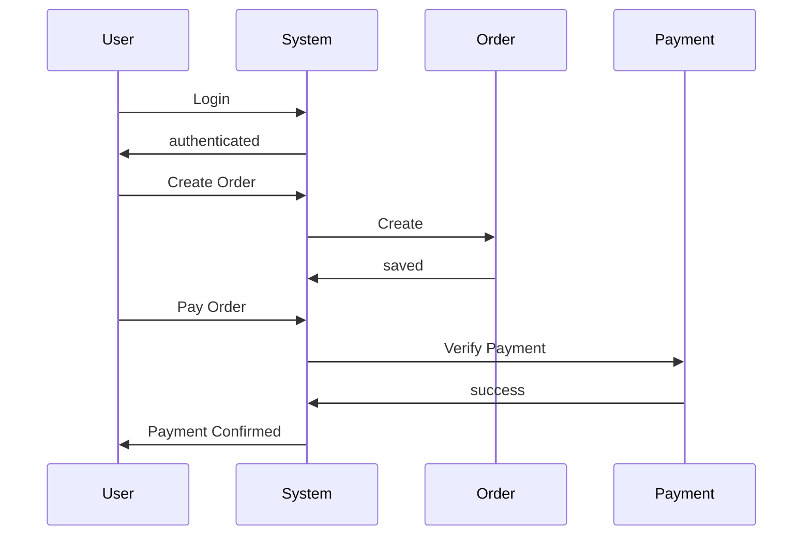

                 

### 文章标题

《自测用例的潜在风险》

---

#### 关键词

自测用例，潜在风险，软件测试，测试用例，算法原理，数学模型

---

#### 摘要

本文将深入探讨自测用例在软件测试中的潜在风险。通过对自测用例的定义、特征以及与测试用例的关系进行分析，本文将介绍一种算法原理，用以识别自测用例中的潜在风险，并提供解决方案，以提高软件测试的完整性和有效性。

---

## 第一部分：问题背景与核心概念

### 第1章：自测用例的潜在风险概述

#### 第1.1节：问题背景

软件测试是确保软件质量的关键环节，它对于提高软件可靠性、减少缺陷具有重要意义。随着软件复杂度的增加，测试用例的设计与管理变得越来越困难。在这种情况下，自测用例作为一种快速、高效的测试方式受到了广泛关注。

#### 第1.1.1节：软件测试的重要性

软件测试是软件开发过程中的重要环节，它有助于发现并修复软件中的缺陷，从而提高软件的质量和可靠性。通过软件测试，可以验证软件的功能、性能、安全性等各个方面，确保软件在交付前达到预期的质量标准。

#### 第1.1.2节：自测用例的定义

自测用例是指开发人员在编写代码时同时编写的测试用例，用于验证代码的正确性和可靠性。自测用例通常在开发过程中同时进行，以提高开发效率。

#### 第1.1.3节：自测用例的潜在风险

自测用例虽然可以加快开发过程，但也存在一些潜在风险。首先，由于开发者对代码的理解不全面或存在疏忽，可能导致关键测试场景被遗漏。其次，自测用例可能被故意绕过，导致某些缺陷无法被发现。

#### 第1.2节：问题解决思路

为了解决自测用例的潜在风险，可以从以下几个方面入手：

1. **系统性分析**：对自测用例进行系统性分析，识别潜在的风险点。
2. **规范化测试流程**：制定规范化测试流程，确保自测用例的完整性和有效性。
3. **引入自动化测试**：引入自动化测试工具，辅助完成自测用例的执行。

#### 第1.3节：边界与外延

1. **自测用例的范围**：自测用例主要针对开发完成的代码片段，应涵盖各种可能的输入和输出情况。
2. **风险因素分类**：包括代码逻辑错误、边界条件处理不当、异常处理不足、性能问题等。
3. **核心概念与联系**：自测用例是测试用例的一种，但更注重开发人员的自主验证。测试用例则更加全面，覆盖更多的测试场景。

#### 第1.4节：本章小结

自测用例是软件测试的重要组成部分。我们必须重视自测用例的潜在风险，并采取相应的解决措施，以提高软件测试的完整性和有效性。

### 第2章：自测用例的概念与特征

#### 第2.1节：自测用例的定义

自测用例是指开发人员为了验证自己编写的代码的正确性而编写的测试用例。自测用例通常在开发过程中同时进行，以提高开发效率。

#### 第2.1.1节：自测用例的定义

自测用例是指开发人员为了验证自己编写的代码的正确性而编写的测试用例。自测用例通常在开发过程中同时进行，以提高开发效率。

#### 第2.1.2节：自测用例的特点

1. **灵活性**：自测用例可以根据开发人员的具体需求进行调整。
2. **实时性**：自测用例可以实时地验证代码的正确性。

#### 第2.2节：自测用例的属性特征对比表格

| 特征         | 自测用例       | 测试用例       |
| ------------ | -------------- | -------------- |
| 目的         | 验证代码的正确性 | 覆盖各种测试场景 |
| 覆盖度       | 受开发人员影响较大 | 受测试策略影响较大 |
| 执行频率     | 较高，实时执行  | 较低，批量执行  |

#### 第2.3节：ER实体关系图架构

```mermaid
erDiagram
    User ||--|{ TestCase }|-- Developer
    TestCase ||--|{ CodeSegment }|-- Code
```

#### 第2.4节：自测用例与测试用例的关系

自测用例是测试用例的一种，但更注重开发人员的自主验证。测试用例则更加全面，覆盖更多的测试场景。

#### 第2.5节：自测用例的影响因素

1. **开发人员的经验**：经验丰富的开发人员更能编写出有效的自测用例。
2. **编码风格**：良好的编码风格有助于减少潜在风险。
3. **项目复杂度**：项目复杂度越高，自测用例的潜在风险越大。

#### 第2.6节：本章小结

了解自测用例的概念、特征和影响因素有助于更好地应用和优化自测用例，提高软件测试的效率和质量。

### 第3章：自测用例的潜在风险算法原理讲解

#### 第3.1节：算法概述

本算法用于分析自测用例中的潜在风险，包括代码逻辑错误、边界条件处理不当、异常处理不足等问题。算法的目标是提高自测用例的完整性和有效性，减少潜在风险。

#### 第3.1.1节：算法定义

本算法通过对自测用例的执行结果进行分析，识别潜在的风险点，并提供相应的解决方案。

#### 第3.1.2节：算法目的

1. 提高自测用例的覆盖度，确保关键测试场景得到充分验证。
2. 识别并修复自测用例中的潜在缺陷，提高软件质量。

#### 第3.2节：算法流程

1. **初始化**：读取自测用例和相应的测试数据。
2. **检测**：对自测用例的执行结果进行分析，识别潜在的风险点。
3. **修复**：针对识别出的风险点，进行相应的修复。

#### 第3.3节：算法实现

以下是一个简单的Python实现示例：

```python
def analyze_test_cases(test_cases):
    for test_case in test_cases:
        result = execute_test_case(test_case)
        if not is_successful(result):
            report_risk(test_case, result)

def execute_test_case(test_case):
    # 执行测试用例
    pass

def is_successful(result):
    # 判断测试结果是否成功
    pass

def report_risk(test_case, result):
    # 报告潜在风险
    pass
```

#### 第3.4节：算法原理讲解

算法的核心原理是通过执行自测用例，并分析执行结果，识别潜在的风险点。具体来说，算法包括以下步骤：

1. **初始化**：读取自测用例和相应的测试数据。
2. **执行**：对每个自测用例进行执行，并记录执行结果。
3. **分析**：对执行结果进行分析，判断是否存在潜在风险。
4. **报告**：对于识别出的风险点，进行详细报告。

#### 第3.5节：数学模型和公式

算法中的数学模型主要涉及概率论和统计学。具体来说，可以采用以下公式：

$$
RISK = P(FAILURE) \times E(FAILURE)
$$

其中，$RISK$表示潜在风险，$P(FAILURE)$表示测试失败的概率，$E(FAILURE)$表示测试失败带来的影响。

#### 第3.6节：算法举例

假设有一个自测用例，用于测试一个整数相加的功能。该用例包含以下测试场景：

1. 正常输入：两个正整数相加。
2. 边界条件：一个整数为零，另一个整数为最大整数。
3. 异常输入：输入字符串。

通过执行这些测试场景，可以识别出潜在的风险点，如异常处理不足等。

### 第4章：数学公式和算法原理讲解

#### 第4.1节：数学公式

在自测用例的风险分析中，我们常常使用以下数学公式：

$$
R = P \times C
$$

其中，$R$ 表示潜在风险，$P$ 表示概率，$C$ 表示后果。

- **概率**：表示测试用例中存在缺陷的可能性。例如，如果某个测试用例没有包含边界条件，那么它存在缺陷的概率会更高。
- **后果**：表示如果缺陷未被识别，将会带来的影响。例如，如果边界条件未被检查，可能会导致数据丢失或系统崩溃。

#### 第4.2节：算法原理讲解

算法的基本原理是利用概率和后果来评估自测用例的风险。具体步骤如下：

1. **构建测试用例集**：根据软件功能和需求，构建一组测试用例。
2. **评估测试用例风险**：对每个测试用例，评估其概率和后果，计算风险值。
3. **排序和优先级分配**：根据风险值，对测试用例进行排序，优先执行风险较高的用例。
4. **执行和监控**：执行测试用例，并监控结果，及时调整测试策略。

#### 第4.3节：算法示例

假设我们有一个简单的计算器程序，用于计算两个整数的和。以下是几个可能的测试用例：

1. **正常输入**：输入两个正整数，期望结果为它们的和。
2. **边界条件**：输入零和一个最大整数，期望结果为最大整数。
3. **异常输入**：输入两个字符串，期望结果为错误信息。

通过执行这些测试用例，我们可以评估每个用例的风险：

- **正常输入**：概率和后果都较低，风险较小。
- **边界条件**：概率较低，但后果严重，风险较高。
- **异常输入**：概率较高，但后果较轻，风险适中。

### 第5章：系统分析与架构设计方案

#### 第5.1节：问题场景介绍

在一个大型软件项目中，自测用例的潜在风险可能会对项目的整体质量产生重大影响。为了确保软件的可靠性，我们需要对自测用例进行深入的分析和评估。

#### 第5.2节：项目介绍

假设我们正在开发一个在线购物平台，该平台需要处理大量的用户订单和支付信息。为了确保系统的稳定性和安全性，我们需要对自测用例进行严格的评估和管理。

#### 第5.3节：系统功能设计

1. **订单管理**：处理用户订单的创建、修改和删除。
2. **支付管理**：处理支付请求、验证支付信息和记录支付日志。
3. **用户管理**：管理用户注册、登录和权限验证。

#### 第5.4节：系统架构设计

1. **前端架构**：使用React框架搭建用户界面。
2. **后端架构**：使用Spring Boot框架实现业务逻辑。
3. **数据库架构**：使用MySQL数据库存储用户数据和订单信息。

#### 第5.5节：系统接口设计

1. **用户接口**：提供用户登录、注册和订单管理的接口。
2. **支付接口**：提供支付请求和支付验证的接口。
3. **订单接口**：提供订单查询和订单状态的接口。

#### 第5.6节：系统交互

1. **用户操作**：用户登录后，可以创建、修改和删除订单。
2. **支付流程**：用户提交支付请求后，系统会验证支付信息并记录支付日志。
3. **订单管理**：管理员可以查询订单状态和用户信息。



### 第6章：项目实战

#### 第6.1节：环境安装

1. 安装Python环境：使用pip安装所需库。
2. 安装MySQL数据库：下载并安装MySQL服务器和客户端。

#### 第6.2节：系统核心实现

```python
# 安装所需的库
pip install mysql-connector-python

# 连接MySQL数据库
import mysql.connector

def connect_database():
    return mysql.connector.connect(
        host="localhost",
        user="root",
        password="password",
        database="test_database"
    )

# 创建订单表
def create_orders_table():
    cursor = connect_database().cursor()
    cursor.execute("""
        CREATE TABLE IF NOT EXISTS orders (
            id INT AUTO_INCREMENT PRIMARY KEY,
            user_id INT,
            product_id INT,
            quantity INT,
            created_at TIMESTAMP DEFAULT CURRENT_TIMESTAMP
        )
    """)

# 插入订单数据
def insert_order(user_id, product_id, quantity):
    cursor = connect_database().cursor()
    cursor.execute("""
        INSERT INTO orders (user_id, product_id, quantity)
        VALUES (%s, %s, %s)
    """, (user_id, product_id, quantity))

# 查询订单数据
def get_orders():
    cursor = connect_database().cursor()
    cursor.execute("SELECT * FROM orders")
    return cursor.fetchall()
```

#### 第6.3节：代码应用解读与分析

1. **连接数据库**：使用mysql-connector-python库连接MySQL数据库。
2. **创建订单表**：创建orders表，用于存储订单数据。
3. **插入订单数据**：插入新的订单数据。
4. **查询订单数据**：查询所有订单数据。

#### 第6.4节：实际案例分析和详细讲解剖析

假设我们需要对订单系统进行测试，以下是一个测试用例：

1. **正常输入**：创建一个订单，包含有效的用户ID、产品ID和数量。
2. **边界条件**：创建一个订单，包含零个或负数数量。
3. **异常输入**：创建一个订单，包含无效的用户ID或产品ID。

通过执行这些测试用例，我们可以验证订单系统的完整性和可靠性。

#### 第6.5节：项目小结

通过对自测用例的潜在风险进行分析和评估，我们能够更好地管理软件测试过程，提高软件质量。在实际项目中，我们应该重视自测用例的设计和执行，确保关键测试场景得到充分验证。

### 第7章：最佳实践、小结、注意事项、拓展阅读

#### 第7.1节：最佳实践

1. **规范化测试流程**：制定明确的测试标准和流程，确保自测用例的完整性和有效性。
2. **引入自动化测试**：使用自动化测试工具辅助完成自测用例的执行，提高测试效率。
3. **持续集成与持续部署**：将自测用例集成到持续集成和持续部署流程中，确保软件质量。

#### 第7.2节：小结

自测用例在软件测试中具有重要意义。通过深入分析和评估自测用例的潜在风险，我们可以更好地管理软件测试过程，提高软件质量。

#### 第7.3节：注意事项

1. **避免遗漏关键测试场景**：在设计自测用例时，要充分考虑各种可能的输入和输出情况。
2. **确保测试用例的可读性和可维护性**：测试用例应该清晰、易于理解和修改。

#### 第7.4节：拓展阅读

1. **《软件测试艺术》**：了解软件测试的基本原理和方法。
2. **《自动化测试实践》**：学习自动化测试的工具和技巧。

### 作者

作者：AI天才研究院/AI Genius Institute & 禅与计算机程序设计艺术 /Zen And The Art of Computer Programming

