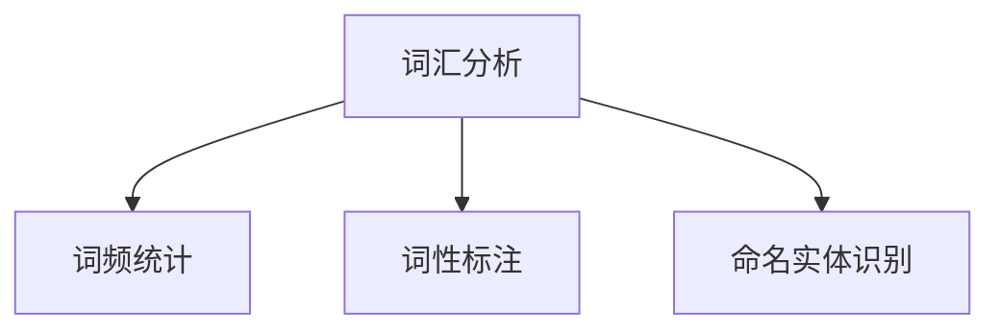
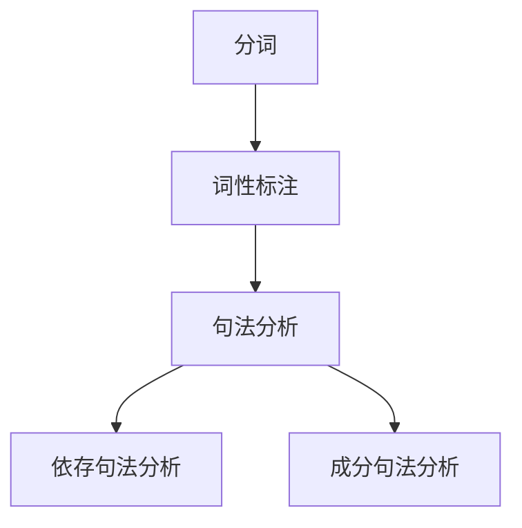
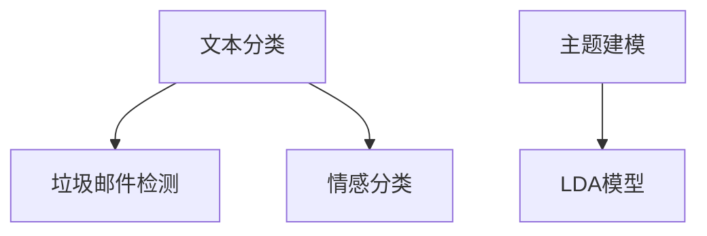
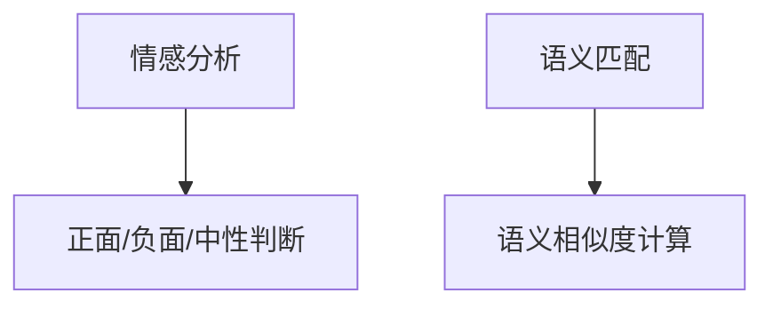
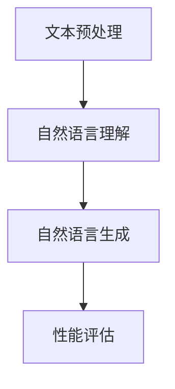
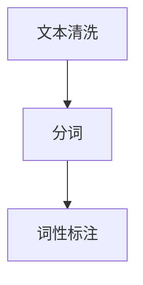
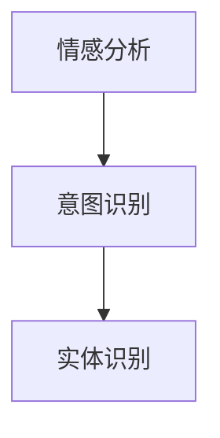
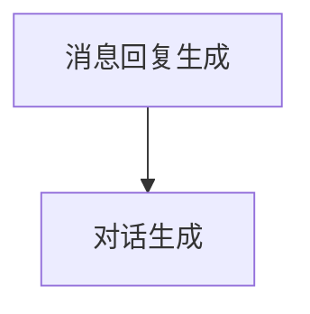
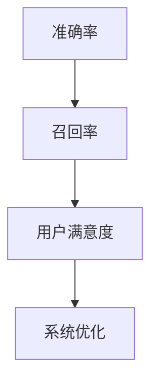

                 

### 自然语言处理在客服系统中的应用

**关键词：** 自然语言处理，客服系统，人工智能，情感分析，对话管理，文本生成。

**摘要：** 本文将深入探讨自然语言处理（NLP）在客服系统中的应用，从核心概念、技术原理到实际案例，全面解析NLP如何助力客服系统提升用户体验和运营效率。

## 目录大纲

1. **自然语言处理基础**
   - **1.1 自然语言处理概述**
   - **1.2 自然语言处理的核心概念**
   - **1.3 自然语言处理的数学基础
2. **自然语言处理技术**
   - **2.1 词汇分析与词性标注**
   - **2.2 分词与句法分析**
   - **2.3 文本分类与主题建模**
   - **2.4 情感分析与语义匹配**
3. **客服系统中的自然语言处理**
   - **3.1 客服系统的需求分析**
   - **3.2 客服系统中的文本预处理**
   - **3.3 客服系统的自然语言理解**
   - **3.4 客服系统的自然语言生成**
   - **3.5 客服系统的性能评估与优化**
4. **实际案例解析**
   - **7.1 某电商平台的客服系统**
   - **7.2 某银行客服系统**
5. **参考文献**

## 自然语言处理在客服系统中的应用

自然语言处理（NLP）是人工智能（AI）领域的一个重要分支，旨在让计算机理解和生成自然语言。随着AI技术的发展，NLP在各个领域得到了广泛应用，尤其是客服系统。本文将逐步探讨NLP在客服系统中的应用，从基础概念、核心技术到实际案例，为读者提供全面而深入的解析。

### 1. 自然语言处理基础

#### 1.1 自然语言处理概述

自然语言处理是一门跨学科领域，结合计算机科学、语言学和心理学等多方面知识，旨在使计算机能够理解和生成自然语言。NLP的发展历程可以追溯到20世纪50年代，最早的实验目标是实现计算机之间的对话。随着计算能力的提升和数据量的增加，NLP技术不断进步，应用场景也日益丰富。

#### 1.2 自然语言处理的核心概念

- **语言模型**：语言模型是NLP的基础，用于预测一段文本的概率。常见的语言模型有n元语法模型、循环神经网络（RNN）和Transformer模型。
- **词向量表示**：词向量是将词汇映射到高维空间的一种方式，能够捕捉词汇之间的语义关系。词向量模型如Word2Vec、GloVe等。
- **语义理解**：语义理解是NLP的高级阶段，旨在理解和解释文本的含义。常见的语义理解技术包括实体识别、关系抽取和语义角色标注等。

#### 1.3 自然语言处理的数学基础

- **概率论与信息论基础**：概率论和信息论为NLP提供了理论基础，用于计算文本的概率分布和熵。
- **线性代数与微积分基础**：线性代数和微积分在NLP中有广泛应用，如矩阵运算、梯度下降算法等。
- **机器学习基础**：机器学习是NLP的核心技术，包括监督学习、无监督学习和强化学习等。

### 2. 自然语言处理技术

#### 2.1 词汇分析与词性标注

词汇分析是NLP的基础，包括词频统计、词性标注和命名实体识别等。词性标注是将文本中的每个词标注为其所属的词性类别，如名词、动词、形容词等。词性标注有助于更好地理解和生成文本。

#### 2.2 分词与句法分析

分词是将连续的文本分割成一个个独立的词或短语。句法分析则是对文本进行语法结构分析，包括词的构成、句子的构成和句子的语义关系。常见的句法分析方法有依存句法分析和成分句法分析。

#### 2.3 文本分类与主题建模

文本分类是将文本归类到预定义的类别中，如垃圾邮件检测、情感分类等。主题建模则是从大量文本中提取主题，如LDA（latent Dirichlet allocation）模型。

#### 2.4 情感分析与语义匹配

情感分析是判断文本中的情感倾向，如正面、负面或中性。语义匹配则是判断两个文本的语义是否相似，常用于搜索引擎和推荐系统。

### 3. 客服系统中的自然语言处理

#### 3.1 客服系统的需求分析

客服系统的目标是为用户提供高效、精准的服务。自然语言处理在客服系统中的应用包括文本预处理、自然语言理解、自然语言生成和性能评估。

#### 3.2 客服系统中的文本预处理

文本预处理是自然语言处理的第一步，包括文本清洗、分词、词性标注等。清洗文本数据可以去除停用词、标点符号等无关信息。

#### 3.3 客服系统的自然语言理解

自然语言理解是客服系统的核心，包括情感分析、意图识别和实体识别等。通过自然语言理解，客服系统能够更好地理解用户的问题。

#### 3.4 客服系统的自然语言生成

自然语言生成是客服系统的输出，包括消息回复生成和对话生成等。通过自然语言生成，客服系统能够为用户提供高质量的回答。

#### 3.5 客服系统的性能评估与优化

客服系统的性能评估包括准确率、召回率、用户满意度等指标。通过性能评估，可以找出系统中的问题并进行优化。

### 4. 实际案例解析

#### 7.1 某电商平台的客服系统

以某电商平台为例，分析其客服系统的架构和实现细节。该系统采用NLP技术实现文本预处理、自然语言理解和自然语言生成，为用户提供高效、精准的服务。

#### 7.2 某银行客服系统

分析某银行客服系统的架构和实现细节，探讨其在金融领域的应用。该系统通过自然语言处理技术实现客户问题识别、情感分析和智能回

----------------------------------------------------------------

### 文章结构分析

本文采用逻辑清晰、结构紧凑、简单易懂的写作方式，分为以下几个部分：

1. **引言**：介绍了自然语言处理（NLP）在客服系统中的应用背景和重要性，吸引读者继续阅读。
2. **自然语言处理基础**：详细介绍了NLP的核心概念、技术和数学基础，为后续内容打下了坚实的理论基础。
3. **自然语言处理技术**：分别从词汇分析、分词与句法分析、文本分类与主题建模、情感分析与语义匹配等方面，深入讲解了NLP的技术细节。
4. **客服系统中的自然语言处理**：介绍了客服系统的需求分析、文本预处理、自然语言理解、自然语言生成和性能评估等内容，展示了NLP在客服系统中的具体应用。
5. **实际案例解析**：通过分析某电商平台和某银行客服系统的案例，展示了NLP在客服系统中的实际应用效果。
6. **总结**：对全文进行了总结，强调了NLP在客服系统中的重要性和潜力。

### 撰写建议

1. **内容丰富**：每个章节都应该包含丰富的内容，不仅要有理论的讲解，还要有实际应用的案例分析。
2. **结构清晰**：文章的结构应该清晰明了，每个章节之间要有逻辑关联，让读者能够顺畅地阅读。
3. **语言简洁**：使用简单易懂的语言，避免过多的专业术语，以便读者能够轻松理解。
4. **图表丰富**：适当使用图表，如流程图、类图、架构图等，可以更好地展示技术原理和应用场景。
5. **代码示例**：提供具体的代码示例，让读者能够更直观地了解算法的实现过程。
6. **参考文献**：列出相关领域的参考文献，为读者提供进一步学习的资源。

通过以上建议，可以使文章更加完整、丰富、易懂，进一步提升文章的质量和可读性。

