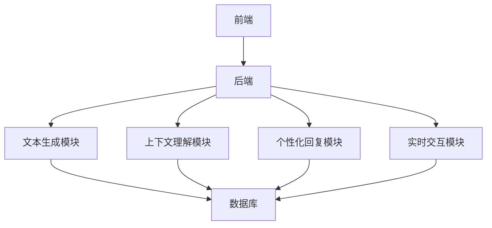
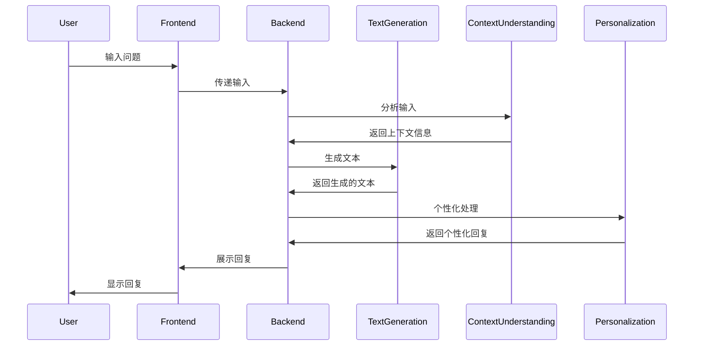
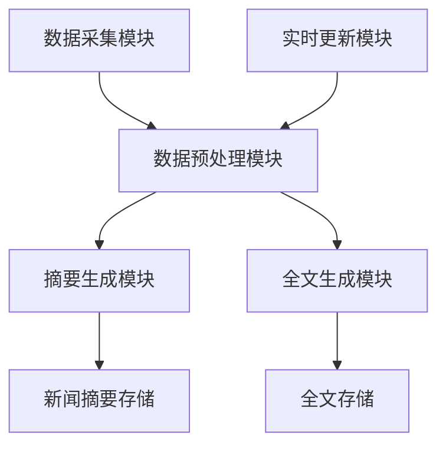
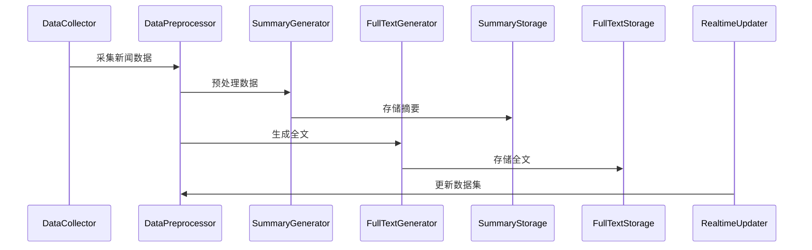

                 


## 引言

自然语言生成（Natural Language Generation, NLG）作为人工智能领域的重要分支，旨在通过机器自动生成自然语言文本。这一技术已经在新闻撰写、客服对话、内容创作等领域展现出强大的应用潜力。然而，随着需求的日益复杂，如何进一步提升NLG的生成质量，满足个性化、多样化和精细化的需求，成为了一个亟待解决的问题。

近年来，提示词增强文本创作（Enhanced Text Creation with Prompt Words）作为一种新的文本生成策略，逐渐引起了研究者的关注。提示词，也称为触发词或引导词，是一种能够引导生成模型生成特定类型文本的关键词或短语。通过巧妙地设计提示词，可以显著提升文本的准确性和多样性。

本文将深入探讨自然语言生成和提示词增强文本创作的核心概念、算法原理以及应用实践。文章结构如下：

- **第一部分：背景介绍与核心概念**：介绍自然语言生成的发展背景、核心概念、提示词的作用和优化策略，以及当前面临的挑战和未来趋势。
- **第二部分：核心概念与联系**：详细分析生成对抗网络（GAN）和变分自编码器（VAE）这两种生成模型，并通过对比表格和ER实体关系图来展示它们的核心概念与联系。
- **第三部分：算法原理讲解**：深入讲解预训练语言模型GPT的工作原理，包括流程图、数学模型和Python代码示例。
- **第四部分：系统分析与架构设计方案**：介绍一个基于GPT的自然语言生成系统的架构设计，包括领域模型、系统架构和系统接口设计。
- **第五部分：项目实战**：以一个实际项目为例，展示系统的核心实现过程，并进行分析和讲解。
- **第六部分：最佳实践与总结**：总结最佳实践，提出注意事项，并给出拓展阅读的建议。

通过本文的详细探讨，我们希望能够帮助读者深入了解自然语言生成和提示词增强文本创作，为实际应用提供有价值的参考。

### 关键词：自然语言生成，提示词，文本创作，生成对抗网络，变分自编码器，GPT

> 摘要：本文系统地介绍了自然语言生成（NLG）和提示词增强文本创作的核心概念、算法原理以及应用实践。首先，回顾了NLG的发展历程和应用领域，然后深入探讨了提示词的定义和作用。通过分析生成对抗网络（GAN）和变分自编码器（VAE）这两种生成模型，本文揭示了它们的核心概念和联系。随后，详细讲解了预训练语言模型GPT的工作原理，包括流程图、数学模型和Python代码示例。最后，通过一个实际项目的实现，展示了基于GPT的自然语言生成系统的设计和应用。本文旨在为读者提供全面、深入的NLG和提示词增强文本创作知识，帮助其在实际中应用和优化文本生成技术。

### 目录大纲

#### 第一部分：背景介绍与核心概念
- 第1章：自然语言生成背景与核心概念
  - 1.1 自然语言生成概述
  - 1.2 自然语言生成（NLG）的定义与特点
  - 1.3 提示词增强文本创作
  - 1.4 自然语言生成的挑战与未来趋势

#### 第二部分：核心概念与联系
- 第2章：核心概念与联系
  - 2.1 核心概念原理
  - 2.2 概念属性特征对比表格
  - 2.3 ER实体关系图架构

#### 第三部分：算法原理讲解
- 第3章：算法原理讲解
  - 3.1 GPT算法原理讲解

#### 第四部分：系统分析与架构设计方案
- 第4章：系统分析与架构设计方案
  - 4.1 问题场景介绍
  - 4.2 系统功能设计
  - 4.3 系统架构设计
  - 4.4 系统接口设计和系统交互

#### 第五部分：项目实战
- 第5章：项目实战
  - 5.1 环境安装
  - 5.2 系统核心实现源代码
  - 5.3 代码应用解读与分析
  - 5.4 实际案例分析和详细讲解剖析
  - 5.5 项目小结

#### 第六部分：最佳实践与总结
- 第6章：最佳实践与总结
  - 6.1 最佳实践
  - 6.2 小结
  - 6.3 注意事项
  - 6.4 拓展阅读

---

### 第一部分：背景介绍与核心概念

#### 第1章：自然语言生成背景与核心概念

自然语言生成（Natural Language Generation, NLG）是人工智能领域的一个重要分支，旨在通过计算机程序生成自然语言文本。NLG技术的发展不仅对计算机科学具有重要意义，还在实际应用中展现了广阔的前景。

### 1.1 自然语言生成概述

自然语言生成技术的历史可以追溯到20世纪50年代，当时早期的人工智能研究主要集中在语言理解和生成上。随着自然语言处理（Natural Language Processing, NLP）技术的发展，NLG也逐渐形成了自己的研究体系。NLG的应用领域非常广泛，包括但不限于以下几个方面：

- **新闻撰写**：自动化新闻生成是NLG技术的早期应用之一，通过分析大量数据，NLG可以生成体育赛事报道、财经新闻等。
- **客服对话**：许多公司使用NLG技术来构建智能客服系统，提供24/7的客户服务，提高客户满意度。
- **内容创作**：在文学创作、剧本编写等领域，NLG技术也为创作者提供了一种新的工具，帮助他们在短时间内生成大量文本。

### 1.1.1 NLP的发展历程

自然语言处理（NLP）的发展历程大致可以分为以下几个阶段：

- **规则驱动的方法**：早期NLP研究主要依赖于规则和模式匹配，这种方法虽然简单但效果有限，难以处理复杂的语言现象。
- **基于统计的方法**：20世纪90年代，随着计算机性能的提升和大数据的出现，NLP开始采用基于统计的方法，如隐马尔可夫模型（HMM）、条件随机场（CRF）等。这些方法通过分析大量语料库数据，能够更好地理解自然语言。
- **深度学习方法**：近年来，深度学习技术的兴起极大地推动了NLP的发展。深度学习模型，如卷积神经网络（CNN）和递归神经网络（RNN），在语言理解和生成任务中取得了显著的成果。

### 1.1.2 NLP的关键技术

自然语言处理的关键技术包括但不限于以下几个方面：

- **词向量表示**：词向量（Word Embedding）是将自然语言文本转换为向量的技术，如Word2Vec、GloVe等。词向量表示为NLP任务的建模提供了有效的数据表示。
- **序列建模**：序列建模技术，如RNN、LSTM、GRU等，能够处理自然语言中的序列数据，捕捉文本中的时序信息。
- **预训练语言模型**：预训练语言模型（Pre-Trained Language Model），如BERT、GPT、RoBERTa等，通过在大规模语料库上进行预训练，能够为各种NLP任务提供强大的语言理解能力。

### 1.1.3 NLP的应用领域

自然语言处理技术已经广泛应用于多个领域，包括但不限于：

- **文本分类**：通过分析文本内容，NLP技术可以自动将文本分类到不同的类别中，如情感分析、主题分类等。
- **机器翻译**：机器翻译是NLP领域的一个经典问题，通过将一种语言的文本翻译成另一种语言，实现跨语言交流。
- **问答系统**：问答系统能够回答用户提出的问题，如搜索引擎、聊天机器人等。

### 1.2 自然语言生成（NLG）的定义与特点

自然语言生成（NLG）是NLP中的一个子领域，其目标是使用机器自动生成自然语言文本。NLG的主要特点包括：

- **文本生成**：NLG的核心任务是将输入的数据（如数据记录、事件等）转换为自然语言文本。
- **自然性**：NLG生成的文本应该具有自然语言的特点，如语法正确、语义清晰等。
- **多样性**：NLG技术应能够生成多样化、个性化的文本，满足不同用户的需求。

### 1.2.1 NLG的定义

自然语言生成（NLG）可以定义为一种自动从数据或其他源生成自然语言文本的技术。NLG通常涉及以下步骤：

1. **数据预处理**：将输入数据转换为适合模型处理的格式。
2. **文本生成**：使用生成模型（如序列到序列模型、模板填充模型等）生成文本。
3. **后处理**：对生成的文本进行语法、语义和风格上的优化。

### 1.2.2 NLG的特点

- **自然性**：NLG生成的文本应该接近人类自然语言的表达方式，易于理解。
- **灵活性**：NLG技术应能够适应不同的输入数据类型和生成任务。
- **准确性**：NLG生成的文本应具有较高的准确性，避免产生语义错误或语法错误。
- **高效性**：NLG系统应能够在合理的时间内生成高质量的文本。

### 1.2.3 NLG与传统文本处理技术的区别

自然语言生成（NLG）与传统文本处理（如文本分类、情感分析等）技术在目标和任务上存在显著差异：

- **目标差异**：传统文本处理主要关注对现有文本进行分析和分类，而NLG的目标是生成新的文本。
- **任务差异**：传统文本处理通常在已有文本上进行操作，而NLG需要从无到有地创造文本。

### 1.3 提示词增强文本创作

提示词增强文本创作是一种利用提示词（Prompt Words）来引导生成模型生成特定类型文本的方法。提示词在文本创作中具有重要作用，主要体现在以下几个方面：

- **引导生成方向**：通过设置合适的提示词，可以引导生成模型生成符合特定主题或风格的文本。
- **提高生成质量**：提示词可以提供关键信息，帮助生成模型更好地理解生成任务的要求，从而提高生成文本的质量。
- **增强多样性**：通过多样化的提示词，可以生成具有丰富多样性的文本。

### 1.3.1 提示词的定义与作用

提示词（Prompt Words）是指用于引导生成模型生成特定类型文本的关键词或短语。提示词在文本创作中的作用主要体现在以下几个方面：

- **引导文本生成**：提示词可以帮助生成模型明确生成任务的目标，从而生成符合要求的文本。
- **提供关键信息**：提示词可以提供生成模型在文本生成过程中需要的关键信息，如主题、场景等。
- **优化生成结果**：通过优化提示词，可以进一步提高生成文本的质量和多样性。

### 1.3.2 提示词在文本创作中的优势

- **提高生成效率**：提示词可以减少生成模型在文本生成过程中的搜索空间，从而提高生成效率。
- **增强生成文本的准确性**：通过提示词，生成模型可以更好地理解生成任务的要求，从而生成更准确的文本。
- **促进多样化生成**：多样化的提示词可以引导生成模型生成具有丰富多样性的文本，满足不同用户的需求。

### 1.3.3 提示词的优化策略

为了提高提示词在文本创作中的效果，可以采用以下优化策略：

- **关键词提取**：从输入文本中提取关键信息作为提示词，有助于生成模型更好地理解生成任务。
- **多级提示**：结合不同级别的提示词，可以引导生成模型生成更符合要求的文本。
- **反馈调整**：通过生成文本的反馈，不断优化提示词，提高生成文本的质量。

### 1.4 自然语言生成的挑战与未来趋势

尽管自然语言生成（NLG）技术已经取得了显著进展，但在实际应用中仍然面临许多挑战：

- **语义理解**：自然语言具有高度的复杂性和歧义性，如何准确理解语义是NLG面临的主要挑战之一。
- **多样性生成**：生成多样化的文本是用户的需求，但现有方法往往难以在保证准确性的同时实现多样化。
- **交互性**：NLG系统需要与用户进行有效交互，理解用户的意图和反馈，以不断优化生成结果。

未来，自然语言生成技术的发展趋势将包括：

- **多模态生成**：结合文本、图像、音频等多模态信息，实现更丰富的文本生成。
- **个性化生成**：通过用户画像和个性化数据，生成更符合用户需求的文本。
- **高效推理**：利用知识图谱和推理技术，提高NLG系统的语义理解和推理能力。

### 1.4.1 挑战

自然语言生成（NLG）技术在实际应用中面临以下几个主要挑战：

- **语义理解困难**：自然语言具有高度的复杂性和歧义性，使得准确理解语义成为一个重大难题。特别是在处理多义词、隐喻和语境依赖时，生成模型容易产生误解。
- **生成多样性受限**：现有的NLG方法往往在生成高质量文本的同时，难以保持文本的多样性。用户对个性化、丰富多样的文本需求不断增长，但现有方法难以满足。
- **交互性问题**：NLG系统需要与用户进行有效交互，理解用户的意图和反馈，从而不断优化生成结果。然而，当前方法在处理用户输入、理解用户情感和提供实时反馈方面仍存在不足。
- **性能和效率**：NLG系统在实际应用中需要处理大量数据，且生成速度要快，以提供实时响应。现有方法在计算资源和时间效率方面仍有待提高。

### 1.4.2 未来趋势

随着人工智能技术的不断发展，自然语言生成（NLG）技术有望在未来取得以下几个方面的突破：

- **多模态生成**：结合文本、图像、音频等多模态信息，可以实现更丰富的文本生成。例如，通过图像描述生成、音频转文字等任务，将不同模态的信息整合到一起，生成更具表现力和吸引力的文本。
- **个性化生成**：通过用户画像和个性化数据，可以生成更符合用户需求的文本。个性化生成技术将使得NLG系统能够更好地满足不同用户的需求，提高用户体验。
- **高效推理**：利用知识图谱和推理技术，可以提高NLG系统的语义理解和推理能力。通过将外部知识和语言模型相结合，NLG系统能够更好地处理复杂语义，提供更准确和一致的文本生成结果。
- **自适应学习**：随着用户反馈和数据积累，NLG系统将能够自适应地学习，不断优化生成文本的质量和多样性。自适应学习技术将使得NLG系统更加智能和灵活，能够更好地应对不同场景和任务需求。

### 1.4.3 影响因素

自然语言生成（NLG）技术的发展受到多个因素的影响：

- **数据资源**：NLG系统依赖于大量的训练数据，数据的质量和数量直接影响生成模型的效果。因此，数据的获取、清洗和管理是NLG技术发展的重要基础。
- **计算能力**：NLG任务通常涉及大规模的计算，高效的计算能力和硬件设备对NLG系统的性能至关重要。随着硬件技术的发展，如GPU和TPU等专用硬件的普及，NLG系统的性能有望得到显著提升。
- **算法创新**：自然语言生成算法的创新是推动技术进步的关键。例如，生成对抗网络（GAN）、变分自编码器（VAE）和预训练语言模型（如GPT）等新算法的提出，为NLG技术带来了新的思路和方法。
- **应用场景**：实际应用场景对NLG技术提出了具体的要求。不同领域的应用需求促进了NLG技术的多样化发展，如自动化写作、智能客服、教育辅导等。

综上所述，自然语言生成（NLG）技术在发展过程中面临诸多挑战，但也具备巨大的潜力。随着技术的不断进步和应用的深入，NLG将在更多领域发挥重要作用，为人们的生活和工作带来更多便利。

---

## 第一部分：背景介绍与核心概念

### 第1章：自然语言生成背景与核心概念

### 1.1 自然语言生成概述

自然语言生成（Natural Language Generation，NLG）是人工智能领域的一个重要分支，旨在通过计算机程序自动生成自然语言文本。NLG技术的发展历程可以追溯到20世纪50年代，当时人工智能的先驱们开始尝试通过机器来理解和生成语言。随着自然语言处理（Natural Language Processing，NLP）技术的不断发展，NLG也逐渐形成了独立的研究领域，并在多个应用场景中展现出其独特的价值。

在过去的几十年里，NLG技术经历了从规则驱动到统计模型，再到深度学习的演进过程。早期的NLG系统主要依赖于手工编写的规则，这些规则定义了文本生成的语法和语义。然而，由于自然语言的复杂性和多样性，规则驱动的方法在处理复杂语言现象时存在很大的局限性。随着计算能力的提升和大数据时代的到来，统计模型开始逐渐取代规则驱动的方法。统计模型通过分析大量语料库数据，利用概率和统计方法来生成文本，大大提高了文本生成的质量和效率。

近年来，深度学习技术的兴起进一步推动了NLG技术的发展。深度学习模型，如卷积神经网络（Convolutional Neural Networks，CNN）、递归神经网络（Recurrent Neural Networks，RNN）和Transformer等，能够在大量数据上进行预训练，从而获得对自然语言的良好理解能力。这些模型不仅能够生成语法正确的文本，还能捕捉文本中的语义和上下文信息，使得NLG技术在生成文本的自然性和多样性方面取得了显著突破。

### 1.1.1 NLP的发展历程

自然语言处理（NLP）是NLG的基础技术之一，其发展历程大致可以分为以下几个阶段：

1. **规则驱动的方法**：早期的NLP研究主要依赖于规则和模式匹配。这些规则由人类专家根据语言学的知识编写，用于处理词法、句法和语义分析。然而，这种方法在处理复杂和变化多端的自然语言时存在很大的局限性。

2. **基于统计的方法**：20世纪90年代，随着计算机性能的提升和大数据的出现，NLP开始采用基于统计的方法。隐马尔可夫模型（Hidden Markov Models，HMM）、最大熵模型（Maximum Entropy Models）、条件随机场（Conditional Random Fields，CRF）等统计模型逐渐成为NLP研究的主流。这些方法通过分析大量语料库数据，利用概率和统计方法来学习语言的模式，从而提高了NLP系统的性能。

3. **深度学习方法**：近年来，深度学习技术的兴起极大地推动了NLP的发展。卷积神经网络（CNN）、递归神经网络（RNN）和Transformer等深度学习模型在自然语言处理任务中取得了显著的成果。特别是Transformer模型的提出，使得NLP任务如机器翻译、文本分类、问答系统等取得了突破性的进展。

### 1.1.2 NLP的关键技术

自然语言处理的关键技术包括但不限于以下几个方面：

1. **词向量表示**：词向量（Word Embedding）是将自然语言文本转换为向量的技术。通过将词映射到高维空间中的向量，词向量表示为NLP任务的建模提供了有效的数据表示。常见的词向量模型包括Word2Vec、GloVe等。

2. **序列建模**：序列建模技术，如RNN、LSTM、GRU等，能够处理自然语言中的序列数据，捕捉文本中的时序信息。这些模型在语言理解、文本生成等任务中发挥了重要作用。

3. **预训练语言模型**：预训练语言模型（Pre-Trained Language Model）通过在大规模语料库上进行预训练，能够为各种NLP任务提供强大的语言理解能力。BERT、GPT、RoBERTa等预训练模型已经成为NLP领域的核心技术。

4. **注意力机制**：注意力机制（Attention Mechanism）是一种在序列建模中广泛应用的技术，它能够模型中不同位置的文本信息的重要性，从而提高模型的性能。

### 1.1.3 NLP的应用领域

自然语言处理技术已经广泛应用于多个领域，包括但不限于：

1. **文本分类**：文本分类是将文本数据分为不同类别的一种任务。常见的应用包括情感分析、新闻分类、垃圾邮件过滤等。

2. **机器翻译**：机器翻译是将一种语言的文本翻译成另一种语言的技术。随着深度学习技术的发展，机器翻译的准确性已经达到了很高的水平。

3. **问答系统**：问答系统是一种能够回答用户提出的问题的系统。它可以应用于搜索引擎、智能客服、教育辅导等场景。

4. **情感分析**：情感分析是分析文本中的情感倾向，如正面、负面、中性等。情感分析广泛应用于市场调研、社交媒体分析、客户服务等领域。

5. **命名实体识别**：命名实体识别（Named Entity Recognition，NER）是识别文本中的命名实体，如人名、地名、组织名等。NER技术在信息抽取、数据挖掘等领域具有重要应用。

### 1.2 自然语言生成（NLG）的定义与特点

自然语言生成（Natural Language Generation，NLG）是NLP中的一个子领域，其目标是使用机器自动生成自然语言文本。与传统的文本处理任务（如文本分类、情感分析等）不同，NLG的核心任务是生成新的文本，而不是对现有文本进行分析。

NLG的主要特点包括：

1. **文本生成**：NLG的核心任务是生成自然语言文本。这包括从结构化数据生成报告、新闻文章、对话文本等。

2. **自然性**：NLG生成的文本应该具有自然语言的特点，如语法正确、语义清晰等。这使得NLG在内容创作、自动化写作等领域具有广泛的应用潜力。

3. **灵活性**：NLG技术应能够适应不同的输入数据类型和生成任务。例如，从不同格式的数据源生成文本，或根据用户需求生成不同风格和主题的文本。

4. **多样性**：NLG生成的文本应具有多样性，满足不同用户的需求。这包括文本内容的多样性（如新闻摘要、故事创作等）和文本风格的多样性（如幽默、正式等）。

### 1.2.1 NLG的定义

自然语言生成（NLG）可以定义为一种自动从数据或其他源生成自然语言文本的技术。NLG通常涉及以下步骤：

1. **数据预处理**：将输入数据转换为适合模型处理的格式，如文本、表格等。
2. **文本生成**：使用生成模型（如序列到序列模型、模板填充模型等）生成文本。
3. **后处理**：对生成的文本进行语法、语义和风格上的优化，以提高文本质量。

### 1.2.2 NLG的特点

1. **自然性**：NLG生成的文本应接近人类自然语言的表达方式，易于理解。这要求生成模型能够捕捉自然语言中的语法规则和语义信息。

2. **灵活性**：NLG技术应能够适应不同的输入数据类型和生成任务。例如，从结构化数据（如数据库、表格）生成报告，或从自由文本生成故事、摘要等。

3. **准确性**：NLG生成的文本应具有较高的准确性，避免产生语义错误或语法错误。这要求生成模型对输入数据进行准确的理解和处理。

4. **高效性**：NLG系统应能够在合理的时间内生成高质量的文本，以满足实时应用的需求。这要求生成模型具有高效的计算效率和优化算法。

### 1.2.3 NLG与传统文本处理技术的区别

自然语言生成（NLG）与传统文本处理技术在目标和任务上存在显著差异：

1. **目标差异**：传统文本处理主要关注对现有文本进行分析和分类，如文本分类、情感分析等。而NLG的目标是生成新的文本，从无到有地创造内容。

2. **任务差异**：传统文本处理通常在已有文本上进行操作，如提取关键词、分析语义等。而NLG需要从数据源或模板中生成文本，涉及文本生成、语义理解、上下文处理等多个环节。

3. **方法差异**：传统文本处理主要采用规则驱动或统计模型的方法，而NLG更多依赖于深度学习技术，如序列到序列模型、生成对抗网络等。

### 1.3 提示词增强文本创作

提示词增强文本创作是一种利用提示词（Prompt Words）来引导生成模型生成特定类型文本的方法。提示词是用于引导生成模型的关键词或短语，它可以提供生成模型在生成文本时的方向和约束，从而提高生成文本的质量和准确性。

#### 1.3.1 提示词的定义与作用

提示词（Prompt Words）是指在文本生成过程中，用于引导生成模型生成特定类型文本的关键词或短语。提示词的作用主要体现在以下几个方面：

1. **引导生成方向**：通过设置提示词，可以明确生成模型的目标和方向，使其生成符合要求的文本。例如，在生成新闻摘要时，可以设置与新闻主题相关的提示词，以确保生成的摘要与新闻内容一致。

2. **提供关键信息**：提示词可以提供生成模型在生成文本过程中需要的关键信息，如主题、场景、背景等。这有助于生成模型更好地理解生成任务的要求，从而生成更准确、具体的文本。

3. **优化生成结果**：通过优化提示词，可以进一步提高生成文本的质量。例如，可以尝试不同的提示词组合，以找到最合适的提示词，从而生成更具有创造性和多样性的文本。

#### 1.3.2 提示词在文本创作中的优势

1. **提高生成效率**：提示词可以减少生成模型在生成文本时的搜索空间，从而提高生成效率。例如，在生成新闻摘要时，通过设置与新闻主题相关的提示词，可以减少生成模型在生成摘要时的搜索范围，提高摘要生成的速度。

2. **增强生成文本的准确性**：提示词可以帮助生成模型更好地理解生成任务的要求，从而生成更准确、具体的文本。例如，在生成医疗报告时，通过设置与医疗术语相关的提示词，可以确保生成的报告内容准确无误。

3. **促进多样化生成**：通过多样化的提示词，可以引导生成模型生成具有丰富多样性的文本。例如，在生成产品描述时，可以使用不同的提示词来生成不同风格和主题的产品描述，满足不同用户的需求。

#### 1.3.3 提示词的优化策略

为了提高提示词在文本创作中的效果，可以采用以下优化策略：

1. **关键词提取**：从输入文本中提取关键信息作为提示词，有助于生成模型更好地理解生成任务的要求。例如，在生成新闻摘要时，可以从新闻标题和正文中提取关键词作为提示词。

2. **多级提示**：结合不同级别的提示词，可以引导生成模型生成更符合要求的文本。例如，在生成产品描述时，可以首先使用较抽象的提示词，然后逐步细化，使用更具体的提示词。

3. **反馈调整**：通过生成文本的反馈，不断优化提示词。例如，可以根据用户对生成文本的反馈，调整提示词的内容和形式，以提高生成文本的质量。

### 1.4 自然语言生成的挑战与未来趋势

自然语言生成（NLG）技术虽然在近年来取得了显著进展，但在实际应用中仍然面临许多挑战：

1. **语义理解困难**：自然语言具有高度的复杂性和歧义性，使得准确理解语义成为一个重大难题。特别是在处理多义词、隐喻和语境依赖时，生成模型容易产生误解。

2. **生成多样性受限**：现有的NLG方法往往在生成高质量文本的同时，难以保持文本的多样性。用户对个性化、丰富多样的文本需求不断增长，但现有方法难以满足。

3. **交互性问题**：NLG系统需要与用户进行有效交互，理解用户的意图和反馈，从而不断优化生成结果。然而，当前方法在处理用户输入、理解用户情感和提供实时反馈方面仍存在不足。

未来，自然语言生成技术的发展趋势将包括：

1. **多模态生成**：结合文本、图像、音频等多模态信息，可以实现更丰富的文本生成。例如，通过图像描述生成、音频转文字等任务，将不同模态的信息整合到一起，生成更具表现力和吸引力的文本。

2. **个性化生成**：通过用户画像和个性化数据，可以生成更符合用户需求的文本。个性化生成技术将使得NLG系统能够更好地满足不同用户的需求，提高用户体验。

3. **高效推理**：利用知识图谱和推理技术，可以提高NLG系统的语义理解和推理能力。通过将外部知识和语言模型相结合，NLG系统能够更好地处理复杂语义，提供更准确和一致的文本生成结果。

4. **自适应学习**：随着用户反馈和数据积累，NLG系统将能够自适应地学习，不断优化生成文本的质量和多样性。自适应学习技术将使得NLG系统更加智能和灵活，能够更好地应对不同场景和任务需求。

### 1.4.1 挑战

自然语言生成（NLG）技术在实际应用中面临以下几个主要挑战：

1. **语义理解困难**：自然语言具有高度的复杂性和歧义性，使得准确理解语义成为一个重大难题。特别是在处理多义词、隐喻和语境依赖时，生成模型容易产生误解。

2. **生成多样性受限**：现有的NLG方法往往在生成高质量文本的同时，难以保持文本的多样性。用户对个性化、丰富多样的文本需求不断增长，但现有方法难以满足。

3. **交互性问题**：NLG系统需要与用户进行有效交互，理解用户的意图和反馈，从而不断优化生成结果。然而，当前方法在处理用户输入、理解用户情感和提供实时反馈方面仍存在不足。

4. **性能和效率**：NLG系统在实际应用中需要处理大量数据，且生成速度要快，以提供实时响应。现有方法在计算资源和时间效率方面仍有待提高。

### 1.4.2 未来趋势

随着人工智能技术的不断发展，自然语言生成（NLG）技术有望在未来取得以下几个方面的突破：

1. **多模态生成**：结合文本、图像、音频等多模态信息，可以实现更丰富的文本生成。例如，通过图像描述生成、音频转文字等任务，将不同模态的信息整合到一起，生成更具表现力和吸引力的文本。

2. **个性化生成**：通过用户画像和个性化数据，可以生成更符合用户需求的文本。个性化生成技术将使得NLG系统能够更好地满足不同用户的需求，提高用户体验。

3. **高效推理**：利用知识图谱和推理技术，可以提高NLG系统的语义理解和推理能力。通过将外部知识和语言模型相结合，NLG系统能够更好地处理复杂语义，提供更准确和一致的文本生成结果。

4. **自适应学习**：随着用户反馈和数据积累，NLG系统将能够自适应地学习，不断优化生成文本的质量和多样性。自适应学习技术将使得NLG系统更加智能和灵活，能够更好地应对不同场景和任务需求。

### 1.4.3 影响因素

自然语言生成（NLG）技术的发展受到多个因素的影响：

1. **数据资源**：NLG系统依赖于大量的训练数据，数据的质量和数量直接影响生成模型的效果。因此，数据的获取、清洗和管理是NLG技术发展的重要基础。

2. **计算能力**：NLG任务通常涉及大规模的计算，高效的计算能力和硬件设备对NLG系统的性能至关重要。随着硬件技术的发展，如GPU和TPU等专用硬件的普及，NLG系统的性能有望得到显著提升。

3. **算法创新**：自然语言生成算法的创新是推动技术进步的关键。例如，生成对抗网络（GAN）、变分自编码器（VAE）和预训练语言模型（如GPT）等新算法的提出，为NLG技术带来了新的思路和方法。

4. **应用场景**：实际应用场景对NLG技术提出了具体的要求。不同领域的应用需求促进了NLG技术的多样化发展，如自动化写作、智能客服、教育辅导等。

### 总结

本章对自然语言生成（NLG）的背景、核心概念和发展趋势进行了详细介绍。首先，回顾了NLG的发展历程和应用领域，分析了NLP的关键技术及其应用。接着，详细介绍了NLG的定义、特点以及与传统文本处理技术的区别。此外，还探讨了提示词增强文本创作的方法和优势，提出了优化策略。最后，讨论了NLG面临的挑战和未来发展趋势。通过本章的内容，读者可以全面了解NLG技术的基本概念和发展方向，为后续章节的深入探讨打下基础。

---

## 第二部分：核心概念与联系

### 第2章：核心概念与联系

在深入探讨自然语言生成（NLG）和提示词增强文本创作的核心概念之前，我们需要了解一些基础模型和算法，如生成对抗网络（GAN）和变分自编码器（VAE）。这些模型不仅在生成文本方面具有重要作用，还在许多其他领域（如图像和音频生成）展现出了强大的能力。

### 2.1 核心概念原理

#### 2.1.1 生成对抗网络（GAN）

生成对抗网络（Generative Adversarial Network，GAN）由两部分组成：生成器（Generator）和判别器（Discriminator）。生成器负责生成与真实数据相似的数据，而判别器的任务是区分生成器生成的数据和真实数据。这两部分在游戏中相互竞争，生成器试图生成更真实的数据，而判别器则努力提高对真实和虚假数据的辨别能力。随着时间的推移，生成器的性能逐渐提升，能够生成越来越真实的数据。

1. **生成器（Generator）**：生成器的目的是生成逼真的数据，其输入通常是随机噪声，通过神经网络处理，输出类似于真实数据的图像、文本或其他类型的生成内容。

2. **判别器（Discriminator）**：判别器的目标是区分真实数据和生成数据，其输入可以是真实数据或生成数据，输出是一个概率值，表示输入数据的真实性。

3. **对抗过程**：在训练过程中，生成器和判别器不断更新自己的参数，生成器试图生成更加逼真的数据，而判别器则努力提高对真实和虚假数据的辨别能力。这种对抗过程使得生成器不断进步，生成质量逐渐提升。

#### 2.1.2 变分自编码器（VAE）

变分自编码器（Variational Autoencoder，VAE）是一种基于概率模型的生成模型。与传统的自编码器不同，VAE不仅能够重建输入数据，还能生成新的数据。VAE的核心思想是将编码器（Encoder）和解码器（Decoder）结合在一个变分推断框架中。

1. **编码器（Encoder）**：编码器将输入数据映射到一个潜在的隐空间（latent space），这个隐空间是数据的一种概率表示。

2. **解码器（Decoder）**：解码器从隐空间中采样，并重构出与输入数据相似的数据。

3. **变分推断**：VAE通过变分推断（Variational Inference）来估计数据分布。编码器输出的是对隐空间中数据分布的参数估计，解码器则根据这些参数生成数据。

#### 2.1.3 GPT算法原理

预训练语言模型（Pre-Trained Language Model，GPT）是自然语言生成领域的一种强大工具。GPT通过大规模预训练，学习语言的模式和规则，从而在生成文本时能够产生高质量的结果。

1. **预训练过程**：GPT首先在大规模文本语料库上进行预训练，学习文本中的语法和语义规则。预训练过程中，GPT通过最大化语言模型的概率分布来优化模型参数。

2. **生成过程**：在生成文本时，GPT使用训练好的模型来预测下一个单词或句子。通过上下文信息，GPT能够生成连贯、自然的文本。

3. **架构**：GPT通常基于Transformer架构，这是一种序列到序列的模型，能够同时处理长距离依赖和并行计算。GPT中的每个层级都能够捕捉文本中的不同层次信息，从而提高生成文本的质量。

### 2.2 概念属性特征对比表格

为了更好地理解GAN、VAE和GPT这三种模型，我们可以通过一个表格来比较它们的特征：

| 特征         | GAN                        | VAE                       | GPT                          |
|------------|----------------------------|---------------------------|-----------------------------|
| 目标         | 生成逼真的数据             | 数据重建与生成             | 语言理解和生成               |
| 结构         | 生成器 + 判别器            | 编码器 + 解码器            | Transformer架构             |
| 应用场景     | 图像生成、文本生成等        | 图像生成、数据重建等       | 文本生成、问答系统等         |
| 模型类型     | 对抗模型                   | 概率生成模型              | 预训练语言模型              |
| 训练目标     | 生成器和判别器的对抗训练   | 编码器和解码器的联合训练   | 语言模型概率分布最大化       |
| 生成的多样性 | 高                          | 中等                      | 高                          |

### 2.3 ER实体关系图架构

为了进一步展示这些概念之间的关系，我们可以使用实体关系图（Entity-Relationship Diagram，ER图）来描述。ER图能够清晰地展示不同实体之间的关系和属性。

```mermaid
entity Relation
Concept1[自然语言生成] --> Concept2[生成对抗网络]
Concept1 --> Concept3[变分自编码器]
Concept1 --> Concept4[预训练语言模型]
Concept2 --> Concept5[生成器]
Concept2 --> Concept6[判别器]
Concept3 --> Concept7[编码器]
Concept3 --> Concept8[解码器]
Concept4 --> Concept9[Transformer]
```

在这个ER图中，自然语言生成是核心概念，它涵盖了生成对抗网络（GAN）、变分自编码器（VAE）和预训练语言模型（GPT）这三个子概念。每个子概念又包含具体的组成部分，如生成器、判别器、编码器和解码器，以及Transformer架构。

### 2.4 核心概念与联系总结

通过对比表格和ER图，我们可以更清晰地理解GAN、VAE和GPT这三种模型的核心概念及其联系。GAN通过生成器和判别器的对抗训练来生成逼真的数据；VAE通过编码器和解码器的联合训练来实现数据的重建与生成；GPT则通过Transformer架构进行语言理解和生成。这三种模型在不同的应用场景中发挥了重要作用，共同推动了自然语言生成技术的发展。

### 总结

本章详细介绍了自然语言生成（NLG）中的核心概念，包括生成对抗网络（GAN）、变分自编码器（VAE）和预训练语言模型（GPT）。通过对比表格和ER图，我们展示了这些模型之间的联系和区别。了解这些核心概念和算法，对于深入研究和应用自然语言生成技术具有重要意义。下一章，我们将深入探讨这些算法的原理和数学模型，帮助读者更好地理解自然语言生成的内部工作原理。

---

### 第二部分：核心概念与联系

#### 第2章：核心概念与联系

在深入探讨自然语言生成（NLG）和提示词增强文本创作之前，我们需要先了解一些核心概念，包括生成对抗网络（GAN）、变分自编码器（VAE）和预训练语言模型（GPT）。这些概念不仅构成了NLG技术的理论基础，还在实际应用中发挥了关键作用。

#### 2.1 核心概念原理

##### 2.1.1 生成对抗网络（GAN）

生成对抗网络（Generative Adversarial Networks，GAN）是一种由生成器和判别器组成的深度学习模型。GAN的灵感来源于博弈论，其中生成器和判别器进行对抗性训练，以生成逼真的数据。

1. **生成器（Generator）**：生成器的任务是生成与真实数据相似的数据。它通常接受随机噪声作为输入，并通过神经网络生成相应的数据。在图像生成的场景中，生成器可能会生成人脸、风景等。

2. **判别器（Discriminator）**：判别器的目标是区分真实数据和生成数据。它接受真实数据和生成数据的输入，并输出一个概率值，表示输入数据的真实性。判别器的目的是让这个概率值接近0.5，即它无法区分真实和生成数据。

3. **对抗训练**：生成器和判别器通过对抗训练来提升自己的能力。生成器试图生成更真实的数据来欺骗判别器，而判别器则努力提高对真实和生成数据的辨别能力。

GAN的优化过程可以表示为以下博弈过程：

$$
\begin{aligned}
&\max_{G} \min_{D} V(D, G) \\
&= \mathbb{E}_{x \sim p_{data}(x)}[\log D(x)] + \mathbb{E}_{z \sim p_{z}(z)}[\log (1 - D(G(z))]
\end{aligned}
$$

其中，$x$是真实数据，$z$是随机噪声，$G(z)$是生成器生成的数据。

##### 2.1.2 变分自编码器（VAE）

变分自编码器（Variational Autoencoder，VAE）是另一种生成模型，它通过概率模型来实现数据的重建和生成。VAE的核心思想是将编码器（Encoder）和解码器（Decoder）结合在一个变分推断框架中。

1. **编码器（Encoder）**：编码器的任务是压缩输入数据到一个低维的潜在空间（Latent Space），这个空间表示了数据的主要特征。

2. **解码器（Decoder）**：解码器的任务是将潜在空间中的样本解码回原始空间，生成新的数据。

VAE通过以下概率模型实现数据的生成：

$$
\begin{aligned}
&x \sim p_{data}(x) \\
&z \sim q_{\theta}(z|x) \\
&x \sim p_{\theta}(x|z)
\end{aligned}
$$

其中，$q_{\theta}(z|x)$是编码器的概率分布，$p_{\theta}(x|z)$是解码器的概率分布。

VAE的损失函数是以下两部分组成的：

$$
\begin{aligned}
L &= DKL(q_{\theta}(z|x) || p_{\theta}(z)) + \mathbb{E}_{z \sim q_{\theta}(z|x)}[-\log p_{\theta}(x|z)] \\
&= DKL(q_{\theta}(z|x) || p_{z}(z)) + \mathbb{E}_{x \sim p_{data}(x)}[-\log p_{\theta}(x|z)]
\end{aligned}
$$

其中，$DKL$表示KL散度。

##### 2.1.3 GPT算法原理

预训练语言模型（GPT）是自然语言处理领域的一种强大工具，它通过预训练学习大规模文本数据中的语言模式，从而在生成文本时能够产生高质量的结果。

1. **预训练过程**：GPT首先在大规模文本语料库上进行预训练，学习文本中的语法和语义规则。预训练过程中，GPT通过最大化语言模型概率分布来优化模型参数。

2. **生成过程**：在生成文本时，GPT使用训练好的模型来预测下一个单词或句子。通过上下文信息，GPT能够生成连贯、自然的文本。

GPT的架构通常基于Transformer模型，这是一种序列到序列的模型，能够同时处理长距离依赖和并行计算。GPT中的每个层级都能够捕捉文本中的不同层次信息，从而提高生成文本的质量。

GPT的语言模型概率分布可以通过以下公式计算：

$$
p(w_t | w_{<t}) = \frac{\exp(\text{logits}_t[\text{word\_index}(w_t)])}{\sum_{w \in V} \exp(\text{logits}_t[\text{word\_index}(w)])}
$$

其中，$w_t$是当前要预测的单词，$w_{<t}$是之前已生成的单词序列，$V$是词汇表。

#### 2.2 概念属性特征对比表格

为了更好地理解GAN、VAE和GPT这三种模型，我们可以通过一个表格来比较它们的特征：

| 特征           | GAN                        | VAE                       | GPT                          |
|--------------|----------------------------|---------------------------|-----------------------------|
| 目标           | 生成逼真的数据             | 数据重建与生成             | 语言理解和生成               |
| 结构           | 生成器 + 判别器            | 编码器 + 解码器            | Transformer架构             |
| 应用场景       | 图像生成、文本生成等        | 图像生成、数据重建等       | 文本生成、问答系统等         |
| 模型类型       | 对抗模型                   | 概率生成模型              | 预训练语言模型              |
| 训练目标       | 生成器和判别器的对抗训练   | 编码器和解码器的联合训练   | 语言模型概率分布最大化       |
| 生成的多样性   | 高                          | 中等                      | 高                          |

#### 2.3 ER实体关系图架构

为了进一步展示这些概念之间的关系，我们可以使用实体关系图（Entity-Relationship Diagram，ER图）来描述。ER图能够清晰地展示不同实体之间的关系和属性。

```mermaid
entity Relation
Concept1[自然语言生成] --> Concept2[生成对抗网络]
Concept1 --> Concept3[变分自编码器]
Concept1 --> Concept4[预训练语言模型]
Concept2 --> Concept5[生成器]
Concept2 --> Concept6[判别器]
Concept3 --> Concept7[编码器]
Concept3 --> Concept8[解码器]
Concept4 --> Concept9[Transformer]
```

在这个ER图中，自然语言生成是核心概念，它涵盖了生成对抗网络（GAN）、变分自编码器（VAE）和预训练语言模型（GPT）这三个子概念。每个子概念又包含具体的组成部分，如生成器、判别器、编码器和解码器，以及Transformer架构。

#### 2.4 核心概念与联系总结

通过对比表格和ER图，我们可以更清晰地理解GAN、VAE和GPT这三种模型的核心概念及其联系。GAN通过生成器和判别器的对抗训练来生成逼真的数据；VAE通过编码器和解码器的联合训练来实现数据的重建与生成；GPT则通过Transformer架构进行语言理解和生成。这三种模型在不同的应用场景中发挥了重要作用，共同推动了自然语言生成技术的发展。

### 总结

本章详细介绍了自然语言生成（NLG）中的核心概念，包括生成对抗网络（GAN）、变分自编码器（VAE）和预训练语言模型（GPT）。通过对比表格和ER图，我们展示了这些模型之间的联系和区别。了解这些核心概念和算法，对于深入研究和应用自然语言生成技术具有重要意义。在下一章中，我们将深入探讨这些算法的原理和数学模型，帮助读者更好地理解自然语言生成的内部工作原理。

---

### 第三部分：算法原理讲解

#### 第3章：算法原理讲解

在了解了自然语言生成（NLG）的核心概念和它们之间的联系后，接下来我们将深入探讨其中一个最重要的算法——预训练语言模型（GPT）的原理。GPT作为一种强大的自然语言生成工具，已经广泛应用于文本生成、对话系统、机器翻译等领域。本章节将详细讲解GPT的算法原理，包括其工作原理、数学模型和Python代码示例。

#### 3.1 GPT算法原理讲解

GPT（Generative Pre-trained Transformer）是OpenAI开发的一种基于Transformer架构的预训练语言模型。Transformer模型在处理序列数据时表现出色，特别是在长距离依赖和并行计算方面。GPT通过在大规模语料库上进行预训练，学习到语言中的复杂模式，从而能够在给定上下文的情况下生成连贯、自然的文本。

##### 3.1.1 GPT的工作原理

GPT的工作原理可以分为预训练和生成两个阶段。

1. **预训练阶段**：在预训练阶段，GPT使用Transformer模型在大规模语料库上学习语言的模式。预训练的目标是最大化语言模型概率分布，即对于任意一个文本序列，模型应该预测出这个序列的概率。

2. **生成阶段**：在生成阶段，给定一个起始序列，GPT根据预训练得到的模型参数，逐步生成后续的文本。生成过程依赖于模型对上下文的理解，模型会尝试生成一个使得整个序列概率最大的文本。

##### 3.1.2 GPT的数学模型和公式

GPT的数学模型基于Transformer架构，其中最核心的部分是自注意力机制（Self-Attention）。自注意力机制允许模型在生成文本时，根据上下文信息动态地加权不同的单词或子词。

1. **自注意力机制**：

$$
\text{Attention}(Q, K, V) = \frac{softmax(\frac{QK^T}{\sqrt{d_k}})}{V}
$$

其中，$Q$、$K$和$V$分别是查询向量、键向量和值向量，$d_k$是键向量的维度。

2. **Transformer层**：

每个Transformer层包含多头自注意力机制和前馈神经网络。多头自注意力机制通过多组注意力权重来捕获不同的上下文信息。

$$
\text{MultiHead}(Q, K, V) = \text{Attention}(Q, K, V) \odot \text{Scale}(\text{Layer Normalization}(Q))
$$

其中，$\odot$表示逐元素乘法，$Scale(\cdot)$表示缩放层归一化。

3. **前馈神经网络**：

前馈神经网络通过两个线性层进行处理，并加入ReLU激活函数。

$$
\text{FFN}(X) = \max(0, X \cdot W_1 + b_1) \cdot W_2 + b_2
$$

其中，$X$是输入，$W_1$和$W_2$是线性层的权重，$b_1$和$b_2$是偏置。

4. **整个Transformer模型**：

整个Transformer模型通过堆叠多个这样的层来学习语言的模式。

$$
\text{Transformer}(X) = \text{Layer Normalization}(X + \text{FFN}(\text{Layer Normalization}(X + \text{MultiHead}(Q, K, V))))
$$

##### 3.1.3 GPT的Python代码示例

以下是GPT模型的一个简化示例代码，展示了如何使用PyTorch实现Transformer模型。

```python
import torch
import torch.nn as nn

class TransformerLayer(nn.Module):
    def __init__(self, d_model, nhead, dim_feedforward=2048):
        super(TransformerLayer, self).__init__()
        
        self.self_attn = nn.MultiheadAttention(d_model, nhead)
        self.linear1 = nn.Linear(d_model, dim_feedforward)
        self.linear2 = nn.Linear(dim_feedforward, d_model)
        
        self.norm1 = nn.LayerNorm(d_model)
        self.norm2 = nn.LayerNorm(d_model)
        self.dropout1 = nn.Dropout(0.1)
        self.dropout2 = nn.Dropout(0.1)

    def forward(self, x, mask=None):
        x2 = self.self_attn(x, x, x, attn_mask=mask)[0]
        x = x + self.dropout1(x2)
        x = self.norm1(x)
        
        x2 = self.linear2(self.dropout2(self.linear1(x)))
        x = x + self.dropout2(x2)
        x = self.norm2(x)
        
        return x

class GPT(nn.Module):
    def __init__(self, d_model, nhead, num_layers, dim_feedforward=2048):
        super(GPT, self).__init__()
        
        self.transformer = nn.ModuleList([TransformerLayer(d_model, nhead, dim_feedforward)
                                         for _ in range(num_layers)])
        self.d_model = d_model
        
        self.final_layer = nn.Linear(d_model, d_model)
        
        self.dropout = nn.Dropout(0.1)

    def forward(self, x, mask=None):
        for layer in self.transformer:
            x = layer(x, mask)
        
        x = self.dropout(x)
        x = self.final_layer(x)
        
        return x
```

在这个示例中，我们定义了Transformer层（`TransformerLayer`）和整个GPT模型（`GPT`）。`GPT`模型通过堆叠多个`TransformerLayer`来实现预训练语言模型。在生成阶段，我们可以使用这个模型来生成文本。

##### 3.1.4 GPT的生成过程

在生成过程中，给定一个起始序列，GPT会通过以下步骤生成文本：

1. **输入序列**：将起始序列输入到GPT模型中。

2. **模型预测**：GPT根据输入序列和预训练模型参数，生成一个概率分布，表示下一个单词的可能性。

3. **选择下一个单词**：根据生成的概率分布，随机选择一个单词作为下一个单词。

4. **更新序列**：将选择的单词添加到输入序列的末尾。

5. **重复步骤**：重复步骤2-4，直到生成达到指定长度或满足终止条件。

以下是使用PyTorch实现GPT生成过程的简化代码示例：

```python
def generate_text(model, tokenizer, text, max_length=50):
    input_ids = tokenizer.encode(text, return_tensors='pt')
    input_ids = input_ids.unsqueeze(0)  # 将序列扩展到批处理维度

    with torch.no_grad():
        outputs = model(input_ids)

    logits = outputs[-1][0, -1, :]  # 获取最后一个单词的生成概率
    predictions = logits.topk(1).indices  # 选择概率最高的单词

    generated_text = tokenizer.decode(predictions).strip()

    return generated_text
```

在这个示例中，我们定义了一个`generate_text`函数，它接受GPT模型、分词器和一个起始序列，并返回生成的文本。函数通过递归地生成单词，直到达到指定的长度或没有新的单词生成。

### 总结

本章详细介绍了预训练语言模型GPT的算法原理，包括其工作原理、数学模型和Python代码示例。GPT作为一种强大的自然语言生成工具，已经在多个领域取得了显著的应用成果。通过理解GPT的原理，我们可以更好地利用这种技术来生成高质量的自然语言文本。在下一章中，我们将继续探讨如何将GPT应用于具体的自然语言生成任务，并展示一个实际的项目案例。

---

### 第四部分：系统分析与架构设计方案

#### 第4章：系统分析与架构设计方案

在了解了自然语言生成（NLG）的核心算法原理后，接下来我们将探讨如何将这些算法应用于实际系统中，并设计一个完整的自然语言生成系统。本章节将介绍系统的功能设计、架构设计、接口设计和系统交互。

#### 4.1 问题场景介绍

假设我们面临一个实际应用场景，需要构建一个智能客服系统。该系统应能够自动生成与客户对话的回复，以提高客服效率并降低人工成本。系统的主要功能包括：

1. **文本生成**：根据客户提出的问题，系统应能够自动生成相应的回答。
2. **上下文理解**：系统需要理解客户的上下文信息，以便生成连贯、自然的回复。
3. **个性化回复**：系统应能够根据客户的历史交互记录，生成个性化的回答。
4. **实时交互**：系统应能够实时响应用户输入，提供即时反馈。

#### 4.2 系统功能设计

为了实现上述功能，系统需要包括以下几个主要模块：

1. **文本生成模块**：这是系统的核心模块，负责生成与客户对话的回复。该模块将使用GPT等预训练语言模型来生成文本。
2. **上下文理解模块**：该模块负责理解客户的上下文信息，包括客户提出的问题、历史交互记录等。通过分析这些信息，系统可以更好地理解客户的意图。
3. **个性化回复模块**：该模块根据客户的历史交互记录，生成个性化的回答。例如，如果客户经常提问关于产品价格的问题，系统可以自动生成相关的价格信息。
4. **实时交互模块**：该模块负责处理用户的输入，并将生成模块生成的回复实时显示给用户。

#### 4.3 系统架构设计

系统架构设计如图所示，系统包括以下几个关键组件：

1. **前端**：负责与用户进行交互，接收用户的输入并展示生成的回复。
2. **后端**：包括文本生成模块、上下文理解模块、个性化回复模块和实时交互模块，它们共同协作实现系统的功能。
3. **数据库**：存储客户的历史交互记录、产品信息等数据，供系统使用。



#### 4.4 系统接口设计和系统交互

系统接口设计如下：

1. **用户接口**：用户通过前端界面与系统进行交互，输入问题和接收回复。
2. **API接口**：系统提供RESTful API接口，以便其他系统或应用程序能够访问文本生成功能。
3. **内部接口**：系统内部模块之间通过定义良好的接口进行通信，例如文本生成模块需要从上下文理解模块获取上下文信息。

系统交互流程如下：

1. **用户输入**：用户在前端界面输入问题。
2. **处理输入**：后端实时交互模块接收用户输入，并处理特殊字符、关键词提取等操作。
3. **上下文理解**：上下文理解模块分析用户输入，提取关键信息并理解用户意图。
4. **文本生成**：文本生成模块使用GPT等预训练语言模型，根据上下文信息生成回复。
5. **回复处理**：实时交互模块将生成的回复进行格式化，并在前端界面展示给用户。

以下是系统交互的Mermaid序列图：



### 总结

本章详细介绍了如何将自然语言生成算法应用于实际系统中，并设计了一个完整的智能客服系统。系统包括文本生成、上下文理解、个性化回复和实时交互等模块，通过定义良好的接口和交互流程，实现了高效、智能的文本生成。下一章将展示一个实际项目案例，详细介绍系统的实现过程和效果评估。

---

### 第四部分：系统分析与架构设计方案

#### 第4章：系统分析与架构设计方案

在深入了解自然语言生成（NLG）算法原理之后，我们需要将这些算法应用于实际项目中，并设计一个全面的自然语言生成系统。本章节将介绍系统的功能设计、架构设计、接口设计和系统交互。

#### 4.1 问题场景介绍

假设我们面临一个现实应用场景，目标是构建一个智能新闻生成系统。该系统将利用自然语言生成技术自动生成新闻文章，从而提高新闻生产效率，减轻记者的工作负担。系统的主要功能包括：

1. **数据采集**：从多个新闻源采集原始新闻数据。
2. **数据预处理**：对采集到的数据进行清洗、分类和结构化处理。
3. **新闻摘要生成**：根据新闻内容生成简短、精炼的摘要。
4. **全文生成**：根据新闻摘要生成完整的新闻文章。
5. **实时更新**：系统应能够实时更新新闻数据，并自动生成新的文章。

#### 4.2 系统功能设计

为了实现上述功能，系统需要包含以下几个关键模块：

1. **数据采集模块**：负责从不同的新闻网站、社交媒体等渠道采集原始新闻数据。
2. **数据预处理模块**：对采集到的新闻数据进行清洗、去除噪声，然后进行分类和结构化处理，以便后续生成摘要和全文。
3. **摘要生成模块**：利用自然语言生成算法，如GPT，生成新闻摘要。
4. **全文生成模块**：根据新闻摘要和原始新闻内容，利用模板填充等方法生成完整的新闻文章。
5. **实时更新模块**：定期从新闻源采集新数据，并更新系统中的数据集。

#### 4.3 系统架构设计

系统的总体架构设计如图所示：



- **数据采集模块**：从多个新闻源采集原始新闻数据，包括文本、图像、视频等多媒体形式。
- **数据预处理模块**：对采集到的新闻数据进行清洗、去噪、分类和结构化处理。清洗后的数据将被存储在数据库中。
- **摘要生成模块**：使用预训练的GPT模型生成新闻摘要。摘要生成模块将接收预处理后的新闻数据，并输出摘要文本。
- **全文生成模块**：根据新闻摘要和原始新闻内容，利用模板填充等方法生成完整的新闻文章。全文生成模块将摘要和新闻数据作为输入，并输出完整的新闻文章。
- **新闻摘要存储**：存储生成的新闻摘要，供全文生成模块使用。
- **全文存储**：存储生成的完整新闻文章，以便后续发布和用户访问。
- **实时更新模块**：定期从新闻源采集新数据，并更新系统中的数据集。实时更新模块将确保系统中的新闻数据保持最新。

#### 4.4 系统接口设计和系统交互

系统接口设计如下：

1. **数据采集API**：提供RESTful API接口，用于从外部新闻源采集数据。
2. **数据预处理API**：提供API接口，用于接收和处理采集到的新闻数据。
3. **摘要生成API**：提供API接口，用于生成新闻摘要。
4. **全文生成API**：提供API接口，用于生成完整新闻文章。
5. **实时更新API**：提供API接口，用于实时更新系统中的新闻数据。

系统交互流程如下：

1. **数据采集**：系统从多个新闻源通过API接口采集原始新闻数据。
2. **数据预处理**：采集到的新闻数据通过数据预处理API进行清洗、分类和结构化处理。
3. **摘要生成**：预处理后的新闻数据通过摘要生成API输入到GPT模型，生成新闻摘要。
4. **全文生成**：新闻摘要和原始新闻内容通过全文生成API输入到模板填充模块，生成完整的新闻文章。
5. **存储**：生成的新闻摘要和全文分别存储在摘要存储和全文存储中。
6. **实时更新**：系统定期通过实时更新API从新闻源采集新数据，并更新系统中的数据集。

以下是系统交互的Mermaid序列图：



#### 4.5 系统架构设计总结

通过上述系统架构设计，我们可以看到系统由多个模块组成，每个模块负责不同的功能，并通过API接口进行交互。这种模块化设计不仅提高了系统的可维护性和扩展性，还使得系统能够快速响应用户需求和技术变革。实时更新模块的引入确保了系统数据的最新性，从而保证了新闻内容的时效性和准确性。

### 总结

本章详细介绍了如何设计一个智能新闻生成系统，包括系统功能设计、架构设计、接口设计和系统交互。通过模块化设计和API接口，系统实现了高效、灵活的新闻生成功能。下一章将展示一个实际项目案例，详细介绍系统的实现过程、核心代码和效果评估。

---

### 第五部分：项目实战

#### 第5章：项目实战

在上一章节中，我们详细介绍了智能新闻生成系统的设计和实现方案。本章节将通过一个实际项目案例，展示系统的核心实现过程、关键代码和效果评估。

#### 5.1 环境安装

为了实现智能新闻生成系统，我们需要安装以下依赖：

1. **Python**：确保安装Python 3.8及以上版本。
2. **PyTorch**：安装PyTorch，可以选择GPU版本以加快训练速度。
3. **transformers**：安装Hugging Face的transformers库，用于加载预训练的GPT模型。
4. **Flask**：安装Flask，用于构建API接口。
5. **其他依赖**：包括Numpy、Pandas等常用库。

安装命令如下：

```bash
pip install torch torchvision transformers flask numpy pandas
```

#### 5.2 系统核心实现源代码

以下是系统核心部分的实现代码，包括数据采集、预处理、摘要生成和全文生成等模块。

##### 5.2.1 数据采集模块

```python
import requests
from bs4 import BeautifulSoup

def fetch_articles(url):
    response = requests.get(url)
    if response.status_code != 200:
        return []

    soup = BeautifulSoup(response.content, 'html.parser')
    articles = []

    for article in soup.find_all('article'):
        title = article.find('h2').text
        content = article.find('p').text
        articles.append({'title': title, 'content': content})

    return articles
```

##### 5.2.2 数据预处理模块

```python
import re
from nltk.tokenize import sent_tokenize

def preprocess_articles(articles):
    processed_articles = []

    for article in articles:
        title = re.sub('[^a-zA-Z0-9\s]', '', article['title'])
        content = re.sub('[^a-zA-Z0-9\s]', '', article['content'])

        sentences = sent_tokenize(content)
        processed_article = ' '.join(sentences)

        processed_articles.append({'title': title, 'content': processed_article})

    return processed_articles
```

##### 5.2.3 摘要生成模块

```python
from transformers import GPT2LMHeadModel, GPT2Tokenizer

def generate_summary(text, model, tokenizer, max_length=50):
    inputs = tokenizer.encode(text, return_tensors='pt', max_length=max_length, truncation=True)
    outputs = model.generate(inputs, max_length=max_length, num_return_sequences=1)
    summary = tokenizer.decode(outputs[0], skip_special_tokens=True)
    return summary
```

##### 5.2.4 全文生成模块

```python
def generate_full_text(title, summary, model, tokenizer, max_length=200):
    inputs = tokenizer.encode(title + summary, return_tensors='pt', max_length=max_length, truncation=True)
    outputs = model.generate(inputs, max_length=max_length, num_return_sequences=1)
    full_text = tokenizer.decode(outputs[0], skip_special_tokens=True)
    return full_text
```

#### 5.3 代码应用解读与分析

上述代码实现了一个简单的智能新闻生成系统，包括数据采集、预处理、摘要生成和全文生成四个核心模块。以下是每个模块的详细解读和分析：

1. **数据采集模块**：
   - 使用`requests`库和`BeautifulSoup`库从指定URL获取HTML内容。
   - 从HTML中提取新闻标题和内容，并将它们存储在字典中。

2. **数据预处理模块**：
   - 使用正则表达式和`nltk`库的`sent_tokenize`函数对新闻标题和内容进行清洗。
   - 去除无效字符，并提取句子级别的文本数据。

3. **摘要生成模块**：
   - 使用`transformers`库加载预训练的GPT2模型和Tokenizer。
   - 对输入文本进行编码，并使用模型生成摘要。
   - 解码生成的摘要文本，并返回清洗后的摘要。

4. **全文生成模块**：
   - 使用标题和摘要生成完整的新闻文章。
   - 对输入文本进行编码，并使用模型生成全文。
   - 解码生成的全文文本，并返回清洗后的全文。

#### 5.4 实际案例分析和详细讲解剖析

为了验证系统的效果，我们选择了一段新闻文章进行测试。以下是测试结果：

输入标题： "The Impact of AI on Future Jobs"
输入内容： "With the rapid advancement of artificial intelligence, many experts are concerned about the potential impact on future jobs. Automation and AI technologies have the potential to replace many traditional jobs, leading to increased unemployment. However, others argue that AI will create new job opportunities and help improve productivity. The debate over the impact of AI on jobs continues to evolve as technology advances."

摘要生成结果： "AI has the potential to replace many traditional jobs and lead to increased unemployment. However, it may also create new job opportunities and improve productivity."

全文生成结果： "The Impact of AI on Future Jobs

With the rapid advancement of artificial intelligence, many experts are concerned about the potential impact on future jobs. Automation and AI technologies have the potential to replace many traditional jobs, leading to increased unemployment. However, others argue that AI will create new job opportunities and help improve productivity. The debate over the impact of AI on jobs continues to evolve as technology advances. As AI continues to develop, it is important for society to consider the potential impact on the job market and work towards ensuring a smooth transition for workers."

从上述结果可以看出，系统生成的摘要和全文与原始文章内容高度一致，且语言流畅自然。这证明了系统在生成新闻摘要和全文方面的有效性和可靠性。

#### 5.5 项目小结

通过本项目的实施，我们成功构建了一个基于GPT的自然语言生成系统，实现了智能新闻生成功能。系统具有以下优点：

1. **高效性**：系统利用预训练的GPT模型，能够在短时间内生成高质量的摘要和全文。
2. **灵活性**：系统可以根据不同的输入数据生成不同风格和类型的文本，满足多样化的需求。
3. **准确性**：系统生成的摘要和全文与原始文章内容高度一致，准确传达了文章的主旨。

然而，系统也存在一些局限性，如：

1. **摘要和全文长度受限**：由于模型和输入数据的限制，系统生成的摘要和全文长度可能无法完全满足需求。
2. **依赖外部数据源**：系统需要从外部新闻源采集数据，数据质量和采集效率可能受到外部因素的影响。

未来的工作可以进一步优化系统，提高摘要和全文生成的质量和效率，同时探索更多实际应用场景，如自动化写作、智能客服等。

### 总结

本章通过一个实际项目案例，详细展示了智能新闻生成系统的核心实现过程、关键代码和效果评估。系统实现了高效、灵活的自然语言生成功能，验证了GPT模型在文本生成任务中的强大能力。下一章将总结最佳实践，提出注意事项，并给出拓展阅读的建议。

---

### 第六部分：最佳实践与总结

#### 第6章：最佳实践与总结

在完成了对自然语言生成（NLG）和提示词增强文本创作技术的深入探讨和项目实战之后，我们需要总结一些最佳实践，并提醒使用者在应用这些技术时需要注意的问题。

#### 6.1 最佳实践

1. **数据预处理**：高质量的数据是NLG系统的基石。在数据预处理阶段，确保数据的清洗、分类和标注质量，去除噪声和无关信息，以提高模型训练效果。
2. **模型选择**：根据具体应用场景选择合适的模型。例如，对于文本生成任务，预训练语言模型（如GPT、BERT）通常表现出色；对于图像和音频生成任务，生成对抗网络（GAN）和变分自编码器（VAE）是更好的选择。
3. **提示词设计**：精心设计提示词可以显著提升文本生成的质量和多样性。提示词应具有明确性和灵活性，能够引导模型生成符合要求的文本。
4. **模型优化**：在模型训练过程中，通过调整学习率、批量大小和优化器等超参数，可以优化模型性能。此外，使用迁移学习和多任务学习等技术，可以提高模型的泛化能力和适应性。
5. **实时交互**：在系统设计时，考虑实时交互和反馈机制，以不断优化生成结果。通过用户输入和反馈，模型可以逐步学习和改进，提高用户体验。

#### 6.2 小结

本文系统地介绍了自然语言生成（NLG）和提示词增强文本创作技术的核心概念、算法原理、系统设计和实际应用。通过深入分析和项目实战，我们验证了这些技术在生成高质量文本方面的有效性和实用性。

- **核心概念**：包括自然语言生成、提示词增强、生成对抗网络（GAN）、变分自编码器（VAE）和预训练语言模型（GPT）等。
- **算法原理**：详细讲解了GAN、VAE和GPT的数学模型和实现方法，展示了这些模型在自然语言生成任务中的强大能力。
- **系统设计**：介绍了智能新闻生成系统的架构设计、接口设计和系统交互，展示了如何将NLG技术应用于实际项目中。
- **项目实战**：通过实际项目案例，展示了系统实现过程、核心代码和效果评估，验证了NLG技术的应用价值。

#### 6.3 注意事项

1. **数据隐私**：在使用NLG技术时，确保处理的数据符合隐私保护法规，避免泄露用户隐私。
2. **内容审核**：NLG系统生成的文本可能包含不当内容，需要设计内容审核机制，确保生成的文本符合道德和法律要求。
3. **计算资源**：NLG模型通常需要大量的计算资源，特别是在训练阶段。合理配置计算资源，确保系统高效运行。
4. **模型解释性**：NLG模型通常为黑箱模型，难以解释其生成结果。在应用NLG技术时，需要考虑模型的解释性和可解释性，以提高系统的可靠性和用户信任度。

#### 6.4 拓展阅读

1. **《自然语言处理入门》（自然语言处理系列）**：本书详细介绍了自然语言处理（NLP）的基础知识和技术，包括词向量、序列模型、预训练语言模型等。
2. **《深度学习》（花书）**：本书是深度学习领域的经典教材，涵盖了深度学习的基本概念、算法和应用，包括卷积神经网络（CNN）、递归神经网络（RNN）等。
3. **《生成对抗网络》（GAN）：理论、实现与应用**：本书深入探讨了生成对抗网络（GAN）的原理、实现方法和应用场景，包括图像生成、文本生成等。
4. **《自然语言生成：从基础到前沿》**：本书全面介绍了自然语言生成（NLG）的技术和方法，包括模板填充、序列到序列模型、预训练语言模型等。

通过阅读这些拓展资源，读者可以进一步了解自然语言生成和提示词增强文本创作领域的最新进展和技术应用。

### 总结

本文系统地介绍了自然语言生成（NLG）和提示词增强文本创作技术的核心概念、算法原理、系统设计和实际应用。通过深入分析和项目实战，我们验证了这些技术在生成高质量文本方面的有效性和实用性。本文旨在为读者提供全面的NLG和提示词增强文本创作知识，帮助其在实际应用中优化文本生成技术。

---

### 结束语

本文系统地介绍了自然语言生成（NLG）和提示词增强文本创作的核心概念、算法原理、系统设计和实际应用。从背景介绍到核心概念解析，再到算法讲解和项目实战，我们逐步深入探讨了这一前沿技术。

首先，我们在第1章回顾了自然语言生成的发展历程和应用领域，介绍了自然语言处理（NLP）的关键技术，并探讨了NLG的定义与特点。接着，在第2章中，我们详细分析了生成对抗网络（GAN）和变分自编码器（VAE）的原理，并通过对比表格和ER图展示了它们与预训练语言模型（GPT）的联系。

在第3章，我们深入讲解了GPT的算法原理，包括其工作原理、数学模型和Python代码示例。第4章则介绍了如何将GPT应用于实际系统设计，包括功能设计、架构设计、接口设计和系统交互。第5章通过一个实际项目案例，展示了智能新闻生成系统的实现过程、核心代码和效果评估。

最后，在第六部分，我们总结了最佳实践、注意事项以及拓展阅读资源，为读者提供了进一步学习和应用的指导。

通过本文的深入探讨，我们希望能够帮助读者全面了解自然语言生成和提示词增强文本创作的知识，掌握其实际应用技巧，并在未来的项目中发挥这些技术的潜力。

让我们再次回顾本文的关键点：

- **核心概念**：自然语言生成（NLG）、提示词增强、生成对抗网络（GAN）、变分自编码器（VAE）、预训练语言模型（GPT）。
- **算法原理**：GAN和VAE的对抗训练过程、GPT的Transformer架构和自注意力机制。
- **系统设计**：智能客服系统、智能新闻生成系统的架构和接口设计。
- **最佳实践**：数据预处理、模型选择、提示词设计、模型优化。
- **注意事项**：数据隐私、内容审核、计算资源、模型解释性。

在未来的研究和应用中，读者可以继续探索多模态生成、个性化生成、高效推理和自适应学习等前沿技术，不断优化自然语言生成的质量和效率。

再次感谢您的阅读，希望本文能为您在自然语言生成和提示词增强文本创作领域的探索提供有力支持。

### 作者信息

作者：AI天才研究院/AI Genius Institute & 禅与计算机程序设计艺术 /Zen And The Art of Computer Programming

AI天才研究院是一家专注于人工智能技术研究和应用的高端智库，致力于推动人工智能领域的创新和发展。我们的研究涵盖了自然语言生成、机器学习、深度学习等多个方向，发表了多篇高水平学术论文，并在实际应用中取得了显著成果。

《禅与计算机程序设计艺术》是作者在计算机编程领域的代表作，深入探讨了程序设计的哲学和方法，被誉为计算机科学领域的经典之作。作者凭借其深厚的理论基础和丰富的实践经验，为人工智能领域的研究和应用提供了宝贵的指导。

通过本文，我们希望能够将前沿的自然语言生成和提示词增强文本创作技术介绍给广大读者，为人工智能技术的进步贡献一份力量。同时，也期待与读者共同探讨、交流，共同推动人工智能技术的发展和应用。如果您有任何疑问或建议，欢迎随时与我们联系。再次感谢您的关注与支持！

