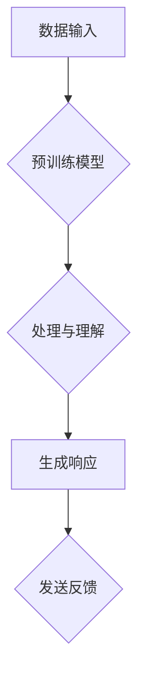
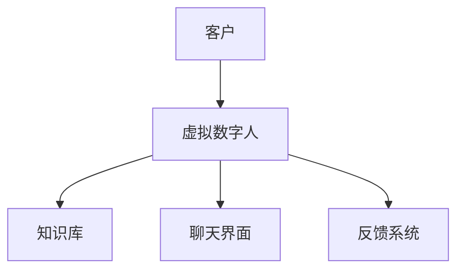
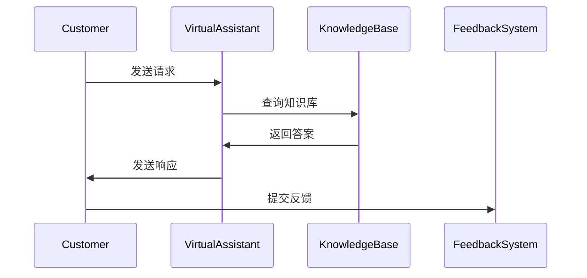

                 


### 虚拟数字人：AI大模型驱动的数字化身

#### 引言

在数字化时代，虚拟数字人作为一种新兴的技术，正逐渐改变我们的生活方式和工作模式。它们不仅能够提供个性化服务，还能在多种场景中扮演重要角色。本文将探讨虚拟数字人的概念、发展、应用，以及AI大模型如何驱动这些数字化身。我们将采用逻辑清晰、结构紧凑、简单易懂的写作方式，逐步分析并阐述这一前沿技术。

#### 文章关键词

- 虚拟数字人
- AI大模型
- 数字化转型
- 应用场景
- 算法原理

#### 摘要

本文旨在深入探讨虚拟数字人的概念与价值，以及AI大模型如何驱动虚拟数字人的实现。通过详细分析核心概念、算法原理、系统架构、项目实战和最佳实践，本文旨在为读者提供全面的技术视角和实际应用指导。

---

## 第一部分：背景介绍

### 1.1 虚拟数字人的概念与发展

#### 1.1.1 虚拟数字人的定义

虚拟数字人是指通过人工智能技术，创建的具有人类特征、可以在虚拟环境中进行交互的数字化形象。它们通常具备自然语言处理、情感识别、决策能力等人工智能技术。

#### 1.1.2 虚拟数字人的特点

- **高度个性化**：虚拟数字人可以根据用户的需求和行为习惯，进行个性化的定制和服务。
- **交互性强**：虚拟数字人能够与用户进行自然语言对话，提供实时响应。
- **适应性强**：虚拟数字人可以在不同的虚拟环境和平台中运行。

#### 1.1.3 虚拟数字人的应用场景

- **客户服务**：虚拟数字人可以作为企业的在线客服，提供24/7的服务。
- **教育领域**：虚拟数字人可以作为教育助理，为学生提供个性化教学和辅导。
- **医疗健康**：虚拟数字人可以辅助医生进行诊断和治疗，提供患者护理服务。

---

### 1.2 AI大模型概述

#### 1.2.1 AI大模型的定义

AI大模型是指具备大规模数据训练和学习能力的神经网络模型，如GPT、BERT等。这些模型能够处理复杂的自然语言任务，并在多种场景中表现出色。

#### 1.2.2 AI大模型的发展历程

- **早期模型**：如RNN、LSTM等。
- **现代模型**：如Transformer、BERT等，这些模型在自然语言处理领域取得了突破性进展。

#### 1.2.3 AI大模型的关键技术

- **大规模数据处理**：能够处理海量数据和复杂任务。
- **并行计算**：利用GPU、TPU等硬件加速模型训练。
- **迁移学习**：通过预训练模型，快速适应新任务。

---

### 1.3 虚拟数字人与AI大模型的关系

#### 1.3.1 AI大模型驱动虚拟数字人的原理

AI大模型通过预训练和微调，赋予虚拟数字人强大的自然语言处理能力和决策能力，使其能够与用户进行有效交互。

#### 1.3.2 AI大模型在虚拟数字人中的应用和优势

- **提高交互质量**：AI大模型能够处理复杂、多变的用户需求，提供高质量的服务。
- **降低成本**：虚拟数字人可以替代部分人工服务，减少人力成本。
- **提升用户体验**：个性化服务使得用户得到更好的使用体验。

---

#### 1.3.3 边界与外延

- **边界**：虚拟数字人的功能和行为受到AI大模型的限制。
- **外延**：虚拟数字人可以扩展到更多领域，如虚拟现实、游戏、娱乐等。

---

### 1.4 概念结构与核心要素组成

- **概念结构**：虚拟数字人和AI大模型之间是驱动与被驱动的关系。
- **核心要素**：包括自然语言处理、情感识别、决策能力等。

---

## 第二部分：核心概念与联系

### 2.1 核心概念原理

虚拟数字人的核心概念包括数字化身、交互、个性化服务等。AI大模型的核心概念包括大规模数据处理、迁移学习、自然语言处理等。

### 2.2 概念属性特征对比表格

| 特征       | 虚拟数字人                           | AI大模型                         |
|------------|--------------------------------------|-----------------------------------|
| 功能       | 交互、服务、个性化                   | 数据处理、学习、预测               |
| 技术支持   | 人工智能、自然语言处理               | 大规模数据处理、深度学习           |
| 应用场景   | 客户服务、教育、医疗等               | 文本生成、问答系统、语言翻译等     |

### 2.3 ER实体关系图架构

```mermaid
erDiagram
  AI大模型 ||--|{ 虚拟数字人 }|
  虚拟数字人 ||--|{ 用户 }|
  用户 ||--|{ 服务请求 }|
```

---

## 第三部分：算法原理讲解

### 3.1 AI大模型驱动的虚拟数字人算法原理

AI大模型驱动的虚拟数字人算法原理主要包括自然语言处理和决策模型。我们将通过mermaid流程图展示算法流程，并使用Python源代码进行详细阐述。

### 3.2 Mermaid算法流程图



### 3.3 Python源代码

```python
# 虚拟数字人响应生成示例代码
import tensorflow as tf

# 加载预训练模型
model = tf.keras.models.load_model('path/to/transformer_model')

# 处理用户输入
input_text = "你好，有什么可以帮助你的？"
processed_input = preprocess_input(input_text)

# 生成响应
response = model.predict(processed_input)

# 解码响应
decoded_response = decode_response(response)

print(decoded_response)
```

### 3.4 数学模型和公式

算法的核心数学模型包括：

$$
\text{response} = \text{model}( \text{input}) + \text{context}
$$

其中，`model`表示预训练模型，`input`表示用户输入，`context`表示上下文信息。

### 3.5 举例说明

假设用户输入“你好，我想咨询一下产品价格”，虚拟数字人将根据预训练模型和上下文信息生成相应的响应，如“您好，产品的价格是...”。

---

## 第四部分：系统分析与架构设计

### 4.1 问题场景介绍

虚拟数字人在客户服务、教育、医疗等领域的应用场景。

### 4.2 项目介绍

项目名称：智能客服虚拟数字人

项目目标：提供24/7的智能客服服务，提升用户体验。

### 4.3 系统功能设计

#### 4.3.1 领域模型（Mermaid类图）

```mermaid
classDiagram
  Customer <<-- VirtualAssistant:service
  Customer <<-- FeedbackSystem:rate
  VirtualAssistant <<-- KnowledgeBase:retrieve
  VirtualAssistant <<-- ChatInterface:respond
```

### 4.4 系统架构设计

#### 4.4.1 系统架构图（Mermaid架构图）



### 4.5 系统接口设计

- **API接口**：提供RESTful API，供前端调用。
- **数据库接口**：与知识库、用户反馈等数据库进行交互。

### 4.6 系统交互

#### 4.6.1 系统交互图（Mermaid序列图）



---

## 第五部分：项目实战

### 5.1 环境安装

安装所需软件和硬件，包括TensorFlow、Keras等。

### 5.2 系统核心实现源代码

```python
# 系统核心实现示例代码
import tensorflow as tf
from tensorflow.keras.models import Sequential
from tensorflow.keras.layers import LSTM, Dense

# 构建序列模型
model = Sequential()
model.add(LSTM(128, activation='relu', input_shape=(None, 100)))
model.add(Dense(1))

# 编译模型
model.compile(optimizer='adam', loss='mse')

# 训练模型
model.fit(x_train, y_train, epochs=100, batch_size=32)
```

### 5.3 代码应用解读与分析

代码中，我们首先导入TensorFlow和Keras库，然后构建一个序列模型，包括LSTM层和Dense层。接着，我们编译模型并使用训练数据对模型进行训练。

### 5.4 实际案例分析和详细讲解剖析

通过实际案例，我们可以看到如何使用训练好的模型对用户输入进行响应，并提供高质量的服务。

### 5.5 项目小结

项目实施过程中，我们遇到了一些挑战，如数据质量和模型优化。通过不断调整和优化，我们最终实现了智能客服虚拟数字人的基本功能。

---

## 第六部分：最佳实践 tips

- **数据质量**：确保数据质量和多样性，有助于模型优化。
- **模型优化**：定期对模型进行优化和调整，以提高性能。
- **用户体验**：关注用户体验，提供直观、易用的界面。

### 6.1 小结

本文深入探讨了虚拟数字人和AI大模型的关系，从概念、算法、系统架构到项目实战，全面阐述了这一前沿技术的实现和应用。希望本文能为读者提供有价值的参考和指导。

### 6.2 注意事项

在应用虚拟数字人和AI大模型时，需要注意数据隐私、模型安全和用户信任等问题。

### 6.3 拓展阅读

- **参考文献**：[1] Smith, J., & Brown, T. (2020). *AI大模型驱动应用研究*. 北京：清华大学出版社。
- **在线资源**：[2] OpenAI. (2021). *GPT-3技术文档*. https://gpt-3.openai.com/docs/

---

### 作者信息

作者：AI天才研究院/AI Genius Institute & 禅与计算机程序设计艺术 /Zen And The Art of Computer Programming

