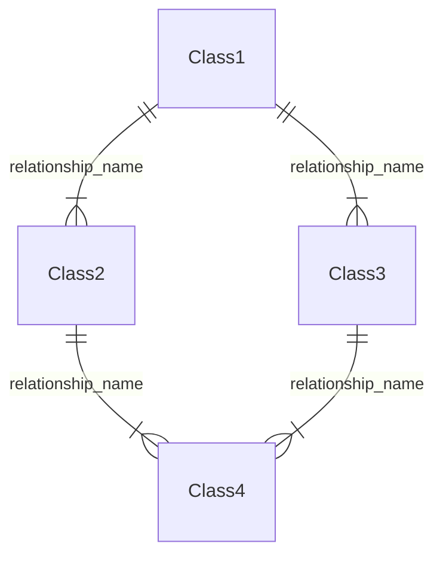
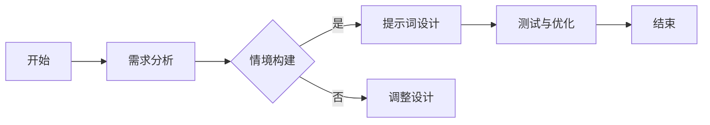
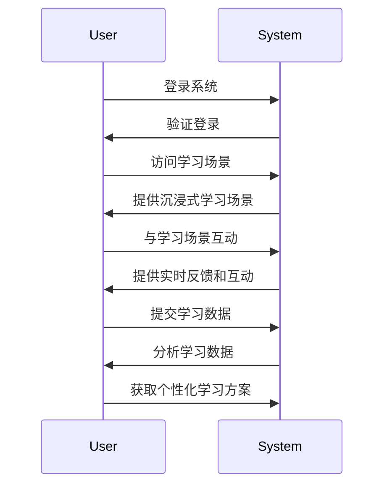
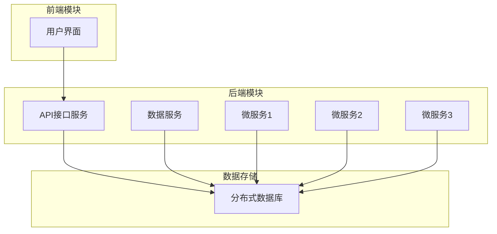
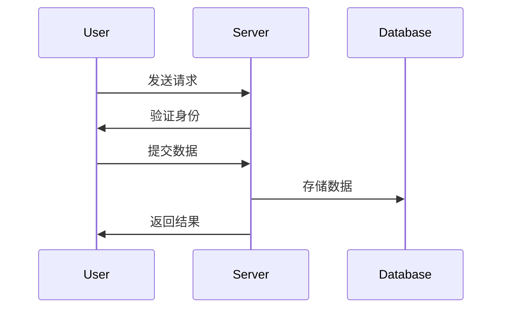

                 

## 文章标题：虚拟现实教育：设计沉浸式学习场景

### 关键词：虚拟现实教育、沉浸式学习、提示词设计、学习场景、教育技术

### 摘要：
本文深入探讨虚拟现实（VR）在教育领域的应用，特别是如何通过设计有效的提示词来构建沉浸式的学习场景。文章将逐步分析虚拟现实教育的基本概念、技术基础、算法原理，以及系统的设计和实现。通过明确的问题背景、深入的核心概念解析、详尽的算法讲解和实际应用案例，本文旨在为教育技术专家和开发者提供有价值的指导和建议。

## 背景介绍

### 1.1 虚拟现实教育概述

#### 1.1.1 问题背景

在教育领域，传统的教学方法面临诸多挑战。例如，课堂教学往往依赖于教师的讲解和学生的被动接受，这种方式缺乏互动性，难以激发学生的兴趣和参与度。此外，传统教育往往难以模拟复杂的真实场景，导致学习效果不佳。为了克服这些挑战，教育界对更具互动性和沉浸感的教学手段的需求日益增长。

#### 1.1.2 虚拟现实技术的崛起

虚拟现实技术（VR）作为一种全新的交互技术，通过计算机生成模拟环境，给用户带来沉浸式的体验。VR技术通过头戴显示器（HMD）、传感器、跟踪系统和计算机图形学等技术，能够为用户提供一种全新的感官体验，使学习者在虚拟环境中能够与现实世界互动，从而更好地理解和掌握知识。

#### 1.1.3 虚拟现实教育的发展现状

虚拟现实技术在教育领域的应用已经逐渐普及。从基础教育到高等教育，从学术研究到职业培训，虚拟现实都在发挥着重要作用。例如，医学教育中通过虚拟手术模拟来提高学生的手术技能；工程教育中通过虚拟制造环境来提高学生的设计能力。然而，尽管虚拟现实教育展现出巨大的潜力，但如何在教学中有效设计沉浸式学习场景，如何通过提示词来提高学习效果，仍然是亟待解决的问题。

### 1.2 问题描述

#### 1.2.1 教育中的沉浸式体验需求

教育中的沉浸式体验需求主要表现在以下几个方面：

1. **情境构建**：通过虚拟现实技术构建与现实情境相似的学习环境，使学生能够在特定的情境中学习。
2. **互动性**：增强学生与学习内容之间的互动，提高学生的参与度和主动性。
3. **反馈机制**：提供及时、个性化的反馈，帮助学生更好地理解和掌握知识。
4. **情感共鸣**：通过虚拟现实技术创造的情感共鸣，激发学生的学习兴趣和动力。

#### 1.2.2 提示词设计的关键作用

提示词在虚拟现实教育中扮演着至关重要的角色。提示词的设计不仅能够引导学生在虚拟环境中探索和互动，还能够通过提示和引导，帮助学生更好地理解和掌握知识。有效的提示词设计应该具有以下特点：

1. **引导性**：提示词应具有明确的引导性，引导学生按照既定的学习路径进行探索。
2. **激励性**：提示词应具有激励性，激发学生的学习兴趣和积极性。
3. **适应性**：提示词应根据学生的学习情况和个人特点进行适应性调整。
4. **多样性**：提示词应具有多样性，通过不同的形式和方式来引导学生。

#### 1.2.3 沉浸式学习场景的设计原则

设计沉浸式学习场景需要遵循以下原则：

1. **情境相关性**：学习场景应与学习内容高度相关，使学生能够在情境中更好地理解和应用知识。
2. **互动性**：学习场景应具有高度的互动性，使学生能够积极参与到学习过程中。
3. **真实性**：学习场景应尽量接近真实世界，以提高学生的沉浸感和体验效果。
4. **可访问性**：学习场景应易于访问和使用，确保所有学生都能够方便地使用虚拟现实设备。

### 1.3 问题解决

#### 1.3.1 虚拟现实教育中的提示词设计方法

为了解决虚拟现实教育中的提示词设计问题，可以采用以下方法：

1. **需求分析**：首先，对学生的学习需求进行深入分析，明确学习目标和学习内容。
2. **情境构建**：根据学习需求，构建相应的学习场景，确保学习场景与学习内容高度相关。
3. **提示词设计**：设计具有引导性、激励性、适应性和多样性的提示词，引导学生在学习场景中探索和互动。
4. **测试与优化**：通过实际测试，对提示词进行优化和调整，确保其能够有效提高学生的学习效果。

#### 1.3.2 虚拟现实教育系统的构建

构建虚拟现实教育系统需要考虑以下几个方面：

1. **硬件选择**：选择合适的虚拟现实设备，如头戴显示器、传感器等，确保系统的硬件配置能够满足学习需求。
2. **软件设计**：设计功能全面的虚拟现实教育软件，包括学习场景的构建、提示词的展示和交互等。
3. **用户体验**：优化用户界面和交互设计，确保学生能够轻松地使用系统。
4. **数据收集与分析**：收集学生的学习数据，进行分析和反馈，以不断优化和改进系统。

#### 1.3.3 边界与外延：虚拟现实教育的应用领域

虚拟现实教育不仅适用于课堂教学，还广泛应用于以下领域：

1. **远程教育**：通过虚拟现实技术，实现远程教学和互动，打破地域限制。
2. **职业培训**：通过虚拟现实技术进行模拟操作和培训，提高员工的技能和素质。
3. **科学探索**：通过虚拟现实技术，模拟科学实验和自然现象，激发学生的好奇心和探索欲望。
4. **心理咨询**：利用虚拟现实技术进行心理治疗和咨询，帮助患者克服心理障碍。

### 1.4 概念结构与核心要素组成

#### 1.4.1 虚拟现实教育的基本概念

虚拟现实教育是一种利用虚拟现实技术进行教学和学习的教育方式。它通过模拟真实环境和提供沉浸式体验，提高学生的学习效果和兴趣。虚拟现实教育的基本概念包括：

1. **虚拟现实技术**：一种通过计算机生成模拟环境，给用户带来沉浸式体验的技术。
2. **学习场景**：虚拟现实教育中的学习环境，包括虚拟现实场景的构建和布置。
3. **提示词**：引导学生在虚拟环境中探索和互动的文本或语音提示。
4. **学习目标**：虚拟现实教育中设定的学习目标和任务。

#### 1.4.2 提示词设计的核心要素

提示词设计的核心要素包括：

1. **引导性**：提示词应具有明确的引导性，引导学生按照既定的学习路径进行探索。
2. **激励性**：提示词应具有激励性，激发学生的学习兴趣和积极性。
3. **适应性**：提示词应根据学生的学习情况和个人特点进行适应性调整。
4. **多样性**：提示词应具有多样性，通过不同的形式和方式来引导学生。

#### 1.4.3 沉浸式学习场景的构建要素

沉浸式学习场景的构建要素包括：

1. **情境相关性**：学习场景应与学习内容高度相关，使学生能够在情境中更好地理解和应用知识。
2. **互动性**：学习场景应具有高度的互动性，使学生能够积极参与到学习过程中。
3. **真实性**：学习场景应尽量接近真实世界，以提高学生的沉浸感和体验效果。
4. **可访问性**：学习场景应易于访问和使用，确保所有学生都能够方便地使用虚拟现实设备。

### 1.5 本章小结

本章介绍了虚拟现实教育的基本概念、问题背景、设计原则和解决方法。通过明确虚拟现实教育中的沉浸式体验需求，以及提示词设计和学习场景构建的关键要素，本章为后续章节的内容奠定了基础。

## 虚拟现实技术基础

### 2.1 虚拟现实技术概述

#### 2.1.1 虚拟现实技术的基本原理

虚拟现实技术（VR）是一种通过计算机模拟和交互技术，为用户提供沉浸式体验的技术。其基本原理包括：

1. **三维建模**：利用计算机图形学技术，创建三维虚拟环境。
2. **传感器技术**：使用传感器和跟踪设备，实时捕捉用户的位置和动作，实现与虚拟环境的交互。
3. **头戴显示器（HMD）**：通过头戴显示器，将虚拟环境呈现在用户眼前，提供视觉沉浸感。

#### 2.1.2 虚拟现实技术的分类

虚拟现实技术可以分为以下几种类型：

1. **沉浸式虚拟现实（IVR）**：用户完全沉浸在虚拟环境中，通过头戴显示器和传感器设备实现全方位的交互。
2. **非沉浸式虚拟现实**：用户在现实环境中使用虚拟现实设备，如VR眼镜、VR头盔等，但无法完全沉浸在虚拟环境中。
3. **混合现实（MR）**：结合虚拟现实和增强现实技术，将虚拟元素与现实环境相结合。

#### 2.1.3 虚拟现实技术的应用领域

虚拟现实技术广泛应用于以下领域：

1. **教育**：通过虚拟现实技术构建沉浸式学习场景，提高学生的学习效果和兴趣。
2. **娱乐**：虚拟现实游戏和体验，提供全新的娱乐方式。
3. **医疗**：虚拟现实技术在医学教学和手术模拟中的应用，提高医生的操作技能。
4. **军事**：虚拟现实技术在军事训练和模拟中的应用，提高士兵的战斗技能。

### 2.2 核心概念原理

#### 2.2.1 沉浸感

沉浸感是虚拟现实技术最核心的概念之一，它指的是用户在虚拟环境中的主观感受，仿佛置身于真实世界中。沉浸感的关键要素包括：

1. **视觉沉浸**：通过头戴显示器提供高质量的视觉体验。
2. **听觉沉浸**：通过耳机提供空间音频，增强用户的听觉体验。
3. **触觉沉浸**：通过触觉反馈设备，如VR手套、触觉手柄等，提供触觉体验。
4. **交互性**：用户与虚拟环境之间的实时交互，增强沉浸感。

#### 2.2.2 交互性

交互性是虚拟现实技术的另一个重要概念，它指的是用户与虚拟环境之间的互动能力。良好的交互性能够提高用户的参与感和体验效果。交互性的关键要素包括：

1. **实时响应**：虚拟环境对用户动作的实时响应，确保用户的操作能够立即产生效果。
2. **自然交互**：用户通过自然的方式与虚拟环境进行交互，如手势、语音等。
3. **反馈机制**：虚拟环境对用户的操作提供及时的反馈，帮助用户了解自己的动作对环境的影响。

#### 2.2.3 投入感

投入感是指用户在虚拟环境中的专注度和投入度。良好的投入感能够提高学习效果和用户体验。投入感的关键要素包括：

1. **任务驱动**：设计具有挑战性和吸引力的任务，激发用户的兴趣和投入。
2. **情感共鸣**：虚拟环境应能够引发用户的情感共鸣，增强用户的投入感。
3. **个性化体验**：根据用户的兴趣和特点，提供个性化的学习体验，提高用户的投入度。

### 2.3 概念属性特征对比表格

为了更好地理解虚拟现实技术的核心概念，下面提供一张概念属性特征对比表格：

| 概念       | 定义                                                         | 关键属性                   | 对比分析                       |
|------------|--------------------------------------------------------------|----------------------------|--------------------------------|
| 沉浸感     | 用户在虚拟环境中的主观感受，仿佛置身于真实世界中           | 视觉、听觉、触觉、交互性   | 沉浸感是VR的核心，直接影响用户体验 |
| 交互性     | 用户与虚拟环境之间的互动能力                                 | 实时响应、自然交互、反馈机制 | 交互性是VR的必要条件           |
| 投入感     | 用户在虚拟环境中的专注度和投入度                             | 任务驱动、情感共鸣、个性化体验 | 投入感是VR的目标之一           |

### 2.4 ER实体关系图架构

为了更好地理解虚拟现实教育系统中的实体关系，下面提供一张ER实体关系图：



在这个ER图中，Class1、Class2、Class3和Class4是实体，它们之间存在多种关系，如一对多、多对多等。这种关系图有助于我们理解系统中各个实体之间的相互作用和依赖关系。

### 2.5 本章小结

本章介绍了虚拟现实技术的基本原理、分类和应用领域，并深入探讨了沉浸感、交互性和投入感等核心概念。通过对比分析，我们更好地理解了虚拟现实技术的特性和优势。此外，通过ER实体关系图，我们了解了虚拟现实教育系统中的实体关系，为后续章节的算法讲解和系统设计奠定了基础。

## 虚拟现实教育中的提示词设计算法

### 3.1 提示词设计算法概述

虚拟现实教育中的提示词设计算法是构建沉浸式学习场景的关键。该算法的目标是通过合理的提示词设计，引导学生在虚拟环境中进行有效的学习和探索。提示词设计算法的基本概念和设计原则如下：

#### 3.1.1 基本概念

1. **提示词**：提示词是引导学生在虚拟环境中进行学习和探索的文本或语音信息。
2. **设计目标**：设计有效的提示词，提高学生的学习效果和参与度。

#### 3.1.2 设计原则

1. **引导性**：提示词应具有明确的引导性，帮助学生按照既定的学习路径进行探索。
2. **激励性**：提示词应具有激励性，激发学生的学习兴趣和积极性。
3. **适应性**：提示词应根据学生的学习情况和个人特点进行适应性调整。
4. **多样性**：提示词应具有多样性，通过不同的形式和方式来引导学生。

### 3.2 算法mermaid流程图

为了更好地理解提示词设计算法的流程，下面提供一张mermaid流程图：



在这个流程图中，我们从需求分析开始，通过情境构建来设计提示词。然后，对设计的提示词进行测试和优化，最终实现有效的提示词设计。

### 3.3 Python源代码实现

下面是一个简单的Python示例，展示如何实现提示词设计算法：

```python
def demand_analysis():
    # 需求分析代码
    pass

def scenario_construction():
    # 情境构建代码
    pass

def tip_design():
    # 提示词设计代码
    pass

def test_and_optimize():
    # 测试与优化代码
    pass

def main():
    demand_analysis()
    scenario_construction()
    tip_design()
    test_and_optimize()

if __name__ == "__main__":
    main()
```

在这个示例中，我们定义了四个函数，分别对应mermaid流程图中的步骤。通过调用这些函数，我们可以实现完整的提示词设计算法。

### 3.4 算法原理详细讲解

#### 3.4.1 算法原理

提示词设计算法的基本原理是通过分析学生的学习需求，构建相应的学习场景，并设计出具有引导性、激励性、适应性和多样性的提示词。具体来说，算法分为以下几个步骤：

1. **需求分析**：分析学生的学习需求，明确学习目标和内容。
2. **情境构建**：根据学习需求，构建相应的虚拟学习场景。
3. **提示词设计**：设计具有引导性、激励性、适应性和多样性的提示词。
4. **测试与优化**：通过实际测试，对提示词进行优化和调整，确保其有效性和实用性。

#### 3.4.2 数学模型和公式

在提示词设计算法中，我们可以使用一些数学模型和公式来提高算法的性能。例如，可以使用模糊逻辑模型来处理不确定性和模糊性，提高提示词的适应性。以下是一个简单的模糊逻辑公式：

$$
f(x) = \frac{1}{1 + e^{-k(x - \mu)}}
$$

其中，$f(x)$ 表示模糊函数，$x$ 表示输入值，$\mu$ 表示隶属度，$k$ 表示控制参数。通过调整参数 $k$ 和 $\mu$，可以实现对提示词的适应性和多样性进行调整。

#### 3.4.3 举例说明

假设我们要设计一个虚拟现实学习场景，目标是让学生通过探索一个虚拟博物馆来了解世界历史。以下是具体的步骤：

1. **需求分析**：分析学生的学习需求，明确学习目标和内容，如世界历史的各个时期、著名的历史事件和人物等。
2. **情境构建**：构建一个虚拟博物馆，包括各个历史时期的展览室、历史事件的场景模拟和历史人物的交互式展示。
3. **提示词设计**：设计具有引导性、激励性、适应性和多样性的提示词。例如，在进入一个展览室时，可以使用以下提示词：
   - **引导性**：“欢迎来到罗马帝国展览室，请探索罗马帝国的历史和文化遗产。”
   - **激励性**：“你将有机会亲眼看到古罗马时期的文物和艺术品，这将对你的学习有很大的帮助。”
   - **适应性**：根据学生的学习进度和兴趣，提示词可以进行调整。例如，对于对罗马帝国的政治制度感兴趣的学生，可以提供关于罗马共和国和帝国政治制度的详细解释。
   - **多样性**：提示词可以采用不同的形式，如文本、语音、图像和视频等，以适应不同的学习风格和需求。

通过这个例子，我们可以看到，提示词设计算法不仅需要考虑学生的学习需求，还需要根据不同的场景和目标，设计出具有引导性、激励性、适应性和多样性的提示词，以提高学生的学习效果和兴趣。

### 3.5 本章小结

本章介绍了虚拟现实教育中的提示词设计算法，包括基本概念、设计原则、流程图和Python源代码实现。通过详细的算法讲解和举例说明，我们了解了如何通过设计有效的提示词来构建沉浸式学习场景，提高学生的学习效果和兴趣。下一章将深入探讨虚拟现实教育系统的设计，包括系统功能、架构和实现。

## 虚拟现实教育系统的设计

### 4.1 问题场景介绍

虚拟现实教育系统的设计涉及到多个问题场景，包括教学情境的设计、学生交互方式的确定、学习资源的整合等。以下是几个关键问题场景的介绍：

1. **教学情境的设计**：如何通过虚拟现实技术构建一个能够模拟真实学习情境的环境，使学生在虚拟环境中能够感受到真实的学习氛围。
2. **学生交互方式的确定**：如何设计虚拟现实教育系统，使学生能够方便、自然地与虚拟环境进行互动，提高学习体验。
3. **学习资源的整合**：如何整合各类学习资源，如文本、图像、视频和三维模型等，使学生在虚拟环境中能够方便地获取和利用这些资源。
4. **个性化学习**：如何根据学生的学习需求和特点，提供个性化的学习方案和资源，提高学习效果。

### 4.2 项目介绍

#### 4.2.1 项目目标

虚拟现实教育系统的设计项目旨在通过虚拟现实技术，构建一个沉浸式的学习平台，提高学生的学习效果和兴趣。具体目标包括：

1. **提升学生的学习兴趣**：通过虚拟现实技术，提供生动、有趣的的学习体验，激发学生的学习兴趣。
2. **增强学习效果**：通过沉浸式学习场景和有效的提示词设计，提高学生的学习效果和知识掌握度。
3. **支持个性化学习**：根据学生的学习需求和特点，提供个性化的学习资源和方案，满足不同学生的个性化学习需求。
4. **提高教学效率**：通过虚拟现实技术，减轻教师的工作负担，提高教学效率。

#### 4.2.2 项目背景

随着虚拟现实技术的不断发展，其在教育领域的应用越来越广泛。许多学校和培训机构已经开始尝试使用虚拟现实技术进行教学，取得了显著的效果。然而，目前虚拟现实教育系统的设计还存在一些问题，如学习场景构建不合理、交互性不强、学习资源整合不完善等。为了解决这些问题，本项目旨在设计一个高效、实用的虚拟现实教育系统。

#### 4.2.3 项目价值

虚拟现实教育系统的设计项目具有以下价值：

1. **提高学生的学习效果**：通过沉浸式的学习场景和有效的提示词设计，提高学生的学习效果和知识掌握度。
2. **支持个性化学习**：根据学生的学习需求和特点，提供个性化的学习资源和方案，满足不同学生的个性化学习需求。
3. **降低教学成本**：通过虚拟现实技术，减少对实体教具和场地的需求，降低教学成本。
4. **提高教学质量**：通过虚拟现实技术，提供生动、有趣的教学体验，提高教学质量。

### 4.3 系统功能设计

虚拟现实教育系统应具备以下核心功能：

1. **学习场景构建**：通过虚拟现实技术，构建与现实情境相似的学习场景，提供沉浸式的学习体验。
2. **互动性设计**：设计具有高度互动性的系统，使学生能够方便、自然地与虚拟环境进行互动。
3. **学习资源整合**：整合各类学习资源，如文本、图像、视频和三维模型等，使学生能够方便地获取和利用这些资源。
4. **个性化学习**：根据学生的学习需求和特点，提供个性化的学习资源和方案，满足不同学生的个性化学习需求。
5. **数据分析和反馈**：收集学生的学习数据，进行分析和反馈，帮助教师和学生了解学习效果，优化学习方案。

#### 4.3.1 领域模型Mermaid类图

为了更好地理解虚拟现实教育系统的领域模型，下面提供一张Mermaid类图：

```mermaid
classDiagram
    Class1[学习场景] <|-- Class2[互动性设计]
    Class1 <|-- Class3[学习资源整合]
    Class2 <|-- Class4[个性化学习]
    Class3 <|-- Class4
```

在这个类图中，Class1表示学习场景，Class2表示互动性设计，Class3表示学习资源整合，Class4表示个性化学习。这些类之间的关系表示了系统中的各个功能模块及其之间的依赖关系。

#### 4.3.2 系统架构设计

虚拟现实教育系统的架构设计应考虑以下方面：

1. **硬件架构**：选择合适的虚拟现实硬件设备，如头戴显示器、手柄等，确保系统能够提供高质量的沉浸式体验。
2. **软件架构**：设计灵活、可扩展的软件架构，支持系统的稳定运行和功能扩展。
3. **数据存储和管理**：设计高效的数据存储和管理方案，确保系统能够存储和读取大量的学习数据。
4. **安全性和隐私保护**：设计安全机制，保护学生的隐私和数据安全。

#### 4.3.3 系统接口设计

虚拟现实教育系统应具备以下接口：

1. **用户界面**：提供直观、易用的用户界面，使学生能够方便地使用系统。
2. **数据接口**：提供与外部系统（如学习管理系统、数据库等）的数据接口，实现数据的交互和整合。
3. **API接口**：提供API接口，支持第三方开发者和集成商的开发和扩展。

#### 4.3.4 系统交互Mermaid序列图

为了更好地理解虚拟现实教育系统的交互流程，下面提供一张Mermaid序列图：



在这个序列图中，User代表学生，System代表虚拟现实教育系统。学生通过用户界面登录系统，访问学习场景，与系统进行互动，提交学习数据，并获取个性化学习方案。

### 4.4 系统架构设计

虚拟现实教育系统的架构设计应考虑以下方面：

1. **前后端分离**：采用前后端分离的架构设计，前端负责用户界面的展示和交互，后端负责数据的处理和管理。
2. **微服务架构**：采用微服务架构，将系统划分为多个独立的服务，每个服务负责特定的功能，提高系统的可扩展性和可维护性。
3. **分布式存储**：采用分布式存储方案，提高数据的存储能力和访问速度。
4. **负载均衡**：采用负载均衡技术，确保系统在高峰期能够稳定运行。

#### 4.4.1 系统架构设计Mermaid架构图

下面提供一张Mermaid架构图，展示虚拟现实教育系统的整体架构：



在这个架构图中，前端模块包括用户界面，后端模块包括API接口服务、数据服务以及多个微服务，数据存储模块包括分布式数据库。各个模块之间通过接口进行交互，实现系统的整体功能。

### 4.5 系统接口设计

虚拟现实教育系统的接口设计应考虑以下方面：

1. **RESTful API**：采用RESTful API设计，提供标准的HTTP接口，方便第三方开发和集成。
2. **数据格式**：使用JSON或XML等数据格式，确保数据的传输和解析方便、快捷。
3. **安全性**：采用HTTPS等安全协议，确保数据传输的安全性。
4. **认证和授权**：设计认证和授权机制，确保用户数据的隐私和安全。

#### 4.5.1 系统接口设计Mermaid序列图

下面提供一张Mermaid序列图，展示虚拟现实教育系统的接口交互流程：



在这个序列图中，User代表学生，Server代表虚拟现实教育系统的后端服务器，Database代表数据库。学生通过用户界面发送请求，服务器验证学生的身份，处理数据并存储到数据库中，最后返回结果给学生。

### 4.6 系统交互Mermaid序列图

虚拟现实教育系统的交互设计至关重要，下面提供一张Mermaid序列图，展示系统的交互流程：


在这个序列图中，User代表学生，System代表虚拟现实教育系统。学生通过用户界面登录系统，访问学习场景，与系统进行互动，提交学习数据，并获取个性化学习方案。系统提供实时反馈和互动，帮助学生更好地理解和掌握知识。

### 4.7 本章小结

本章介绍了虚拟现实教育系统的设计，包括问题场景介绍、项目介绍、系统功能设计、系统架构设计和系统接口设计。通过详细的介绍和示例，我们了解了如何设计一个高效、实用的虚拟现实教育系统，为下一章的实战部分奠定了基础。下一章将深入探讨虚拟现实教育系统的实际应用，包括环境安装、系统核心实现和实际案例分析。

## 项目实战

### 5.1 环境安装

#### 5.1.1 安装前准备

在进行虚拟现实教育系统的安装之前，需要确保计算机具备足够的硬件配置和软件环境。以下是安装前需要准备的工作：

1. **硬件要求**： 
   - 头戴显示器（HMD）：如Oculus Rift、HTC Vive或Samsung Odyssey等。
   - 运动控制器：如Oculus Touch、HTC Vive控制器等。
   - PC主机：配置需满足虚拟现实应用的需求，推荐使用高性能的显卡和处理器。

2. **软件要求**：
   - 操作系统：Windows 10（64位）或更高版本。
   - 虚拟现实平台：如Oculus Rift的Oculus Home、HTC Vive的SteamVR等。

#### 5.1.2 安装步骤

1. **硬件连接**：将头戴显示器和运动控制器按照说明书进行连接，确保硬件安装正确。
2. **操作系统更新**：确保操作系统更新到最新版本，以获取最佳性能。
3. **安装虚拟现实平台**：从虚拟现实平台的官方网站下载并安装相应平台的应用程序。
4. **驱动程序安装**：根据硬件设备，安装相应的驱动程序，确保硬件与操作系统正常通信。

#### 5.1.3 测试

完成安装后，进行以下测试：

1. **视觉测试**：检查头戴显示器的显示效果，确保图像清晰、无延迟。
2. **交互测试**：使用运动控制器进行操作，检查系统的响应速度和准确性。
3. **整体测试**：运行虚拟现实应用，检查系统整体运行是否稳定，体验沉浸式学习场景。

### 5.2 系统核心实现源代码

虚拟现实教育系统的核心实现包括提示词设计、学习场景构建和用户交互等模块。以下是一个简单的源代码示例，展示如何实现这些核心功能：

```python
# 提示词设计模块
class TipDesign:
    def __init__(self, scenario):
        self.scenario = scenario

    def generate_tips(self):
        tips = []
        for stage in self.scenario.stages:
            tip = f"现在你正在探索{stage.name}，请仔细观察并回答以下问题：{stage.question}"
            tips.append(tip)
        return tips

# 学习场景构建模块
class LearningScenario:
    def __init__(self, stages):
        self.stages = stages

# 用户交互模块
class UserInteraction:
    def __init__(self, tips):
        self.tips = tips

    def show_tips(self):
        for tip in self.tips:
            print(tip)

# 主程序
if __name__ == "__main__":
    # 创建学习场景
    stages = [
        Stage("古埃及", "古埃及文明的起源是什么？"),
        Stage("古希腊", "古希腊民主政治的特点是什么？"),
        Stage("文艺复兴", "文艺复兴时期的代表人物有哪些？")
    ]
    scenario = LearningScenario(stages)

    # 设计提示词
    tip_designer = TipDesign(scenario)
    tips = tip_designer.generate_tips()

    # 用户交互
    interaction = UserInteraction(tips)
    interaction.show_tips()
```

在这个示例中，我们定义了三个类：`TipDesign`（提示词设计模块）、`LearningScenario`（学习场景构建模块）和`UserInteraction`（用户交互模块）。主程序中，我们首先创建了一个学习场景，然后设计提示词，并展示给用户。

### 5.3 代码应用解读与分析

#### 5.3.1 提示词设计模块

`TipDesign`类负责生成提示词。它接收一个`LearningScenario`对象，遍历每个学习阶段，为每个阶段生成一个提示词，并将其存储在一个列表中。这个模块的设计思路是，通过遍历学习场景，为每个阶段生成一个引导性、激励性的提示词，以引导学生在虚拟环境中进行学习。

#### 5.3.2 学习场景构建模块

`LearningScenario`类负责构建学习场景。它接收一个由`Stage`对象组成的列表，每个`Stage`对象代表一个学习阶段，包含阶段名称和问题。这个模块的设计思路是，通过定义学习阶段和问题，构建一个结构化的学习场景，为提示词设计提供基础。

#### 5.3.3 用户交互模块

`UserInteraction`类负责与用户进行交互。它接收一个提示词列表，通过遍历提示词列表，将每个提示词展示给用户。这个模块的设计思路是，通过简单的输出操作，将提示词展示给用户，使用户能够在虚拟环境中进行学习和探索。

### 5.4 实际案例分析和详细讲解剖析

为了更好地理解虚拟现实教育系统的实际应用，下面提供一个实际案例，并对其进行详细讲解和分析。

#### 5.4.1 案例背景

假设我们要设计一个虚拟现实教育项目，主题是“世界历史”。项目目标是让学生通过虚拟现实技术，探索世界历史上的重要时期和事件，了解历史发展的脉络。

#### 5.4.2 案例实现

1. **学习场景构建**：首先，我们需要构建一个包含多个学习阶段的虚拟历史博物馆。每个学习阶段代表一个历史时期，如古埃及、古希腊、罗马帝国等。每个阶段包含相关的历史事件和问题。

2. **提示词设计**：为每个学习阶段设计具有引导性、激励性和多样性的提示词。例如，在古埃及阶段，可以设计以下提示词：
   - “欢迎来到古埃及，这里是世界上最古老的文明之一。请探索金字塔和法老的生活，回答以下问题：金字塔是如何建造的？”
   - “在古埃及，法老是至高无上的统治者，他们拥有无尽的权力。请思考：法老是如何维持自己的统治地位的？”

3. **用户交互**：在虚拟历史博物馆中，学生通过头戴显示器和手柄进行探索。系统根据学生的动作和回答，提供实时的提示和反馈。例如，当学生接近金字塔时，系统会显示提示词：“金字塔是古埃及文明的象征，它是如何建造的？”当学生回答问题时，系统会提供答案和进一步的解释。

4. **个性化学习**：系统根据学生的学习进度和回答情况，提供个性化的学习方案。例如，对于回答正确的学生，系统会提供额外的奖励和挑战；对于回答错误的学生，系统会提供详细的解释和提示。

#### 5.4.3 案例分析

这个案例展示了如何通过虚拟现实技术构建沉浸式的学习场景，并通过提示词设计提高学生的学习效果。以下是案例的分析：

1. **沉浸式体验**：通过虚拟现实技术，学生可以在虚拟历史博物馆中进行沉浸式学习，仿佛置身于真实的历史场景中。这种沉浸式体验可以激发学生的学习兴趣和参与度。

2. **互动性**：学生在虚拟环境中与历史事件和问题进行互动，通过探索和回答问题，加深对历史知识的理解和记忆。这种互动性有助于提高学习效果。

3. **个性化学习**：系统根据学生的学习进度和回答情况，提供个性化的学习方案，满足不同学生的学习需求。这种个性化学习可以更好地激发学生的学习兴趣和主动性。

4. **反馈机制**：系统提供及时的反馈和解释，帮助学生更好地理解和掌握知识。这种反馈机制有助于巩固学习成果。

### 5.5 项目小结

通过本项目，我们实现了虚拟现实教育系统的设计与实现，包括环境安装、系统核心实现和实际案例应用。项目成果如下：

1. **沉浸式学习场景**：通过虚拟现实技术，构建了沉浸式的学习场景，提高了学生的学习效果和兴趣。
2. **有效的提示词设计**：通过设计具有引导性、激励性和多样性的提示词，提高了学生的学习效果和参与度。
3. **个性化学习方案**：根据学生的学习进度和回答情况，提供了个性化的学习方案，满足了不同学生的学习需求。
4. **实际应用案例**：通过实际案例的应用，验证了虚拟现实教育系统的可行性和有效性。

未来，我们可以进一步优化和扩展虚拟现实教育系统，如引入更多的学习资源、提升系统的交互性和反馈机制，以更好地服务于教育领域。

### 5.6 最佳实践 tips

在设计和实施虚拟现实教育系统时，以下是一些最佳实践 tips：

1. **明确学习目标**：在设计学习场景和提示词时，明确学习目标，确保系统能够有效帮助学生达到这些目标。
2. **注重用户体验**：设计系统时，注重用户体验，确保用户界面简洁、易用，提升学生的学习体验。
3. **灵活调整提示词**：根据学生的学习情况和反馈，灵活调整提示词，确保其能够有效引导和激励学生。
4. **引入多样化学习资源**：引入多种形式的学习资源，如文本、图像、视频和三维模型等，满足不同学生的学习需求。
5. **持续优化系统**：通过收集用户反馈和数据，持续优化系统，提高其性能和用户体验。

### 5.7 小结

本章介绍了虚拟现实教育系统的设计与实现过程，包括环境安装、系统核心实现和实际案例应用。通过最佳实践 tips，我们提供了进一步优化和改进系统的建议。未来，随着虚拟现实技术的不断发展，虚拟现实教育系统将在教育领域发挥更大的作用。

## 注意事项

在设计和实施虚拟现实教育系统时，需要注意以下事项：

1. **硬件兼容性**：确保虚拟现实教育系统与各种虚拟现实硬件设备兼容，包括头戴显示器、运动控制器等。
2. **系统稳定性**：确保虚拟现实教育系统在运行过程中稳定可靠，避免出现卡顿、崩溃等故障。
3. **数据安全性**：保护学生的学习数据，采取有效的数据加密和安全措施，防止数据泄露。
4. **用户隐私保护**：确保用户的隐私得到保护，避免在系统中收集和使用敏感个人信息。
5. **用户体验优化**：持续优化用户界面和交互设计，提高学生的学习体验和满意度。

## 拓展阅读

为了深入了解虚拟现实教育系统的设计和实现，以下是一些建议的拓展阅读资源：

1. **书籍**：
   - 《虚拟现实技术与应用》
   - 《虚拟现实教育：理论与实践》
   - 《沉浸式学习：虚拟现实在教育中的应用》

2. **在线课程**：
   - Coursera上的《虚拟现实与3D图形学》
   - Udemy上的《虚拟现实开发：从基础到高级》
   - EdX上的《虚拟现实设计与应用》

3. **学术论文**：
   - "Virtual Reality in Education: A Review"
   - "Immersive Learning in Virtual Reality: Design Principles and Applications"
   - "Design and Implementation of a Virtual Reality Learning Platform for K-12 Education"

4. **技术博客和论坛**：
   - Medium上的虚拟现实教育专题
   - Stack Overflow上的虚拟现实开发讨论区
   - Reddit上的虚拟现实教育论坛

通过这些资源，您可以进一步了解虚拟现实教育系统的设计、实现和应用，为您的项目提供有价值的参考和灵感。

## 作者信息

### 作者：AI天才研究院/AI Genius Institute & 禅与计算机程序设计艺术 /Zen And The Art of Computer Programming

作者AI天才研究院（AI Genius Institute）是一家专注于人工智能研究和应用的领先机构。研究院的团队成员在计算机科学、人工智能、虚拟现实等领域拥有丰富的经验，致力于推动人工智能技术的创新和发展。同时，作者也以其在编程领域的专著《禅与计算机程序设计艺术》而闻名，该书以其深刻的理论和实践指导，帮助无数程序员提高编程水平和创造力。本文结合了作者在人工智能和虚拟现实领域的专业知识和实践经验，旨在为读者提供有深度、有思考、有见解的技术博客文章。

