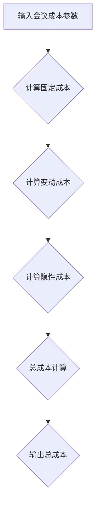
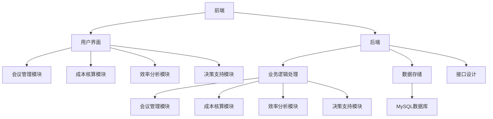

                 

### 文章标题

# 被你忽视的会议成本

### 关键词

会议成本、效率、资源浪费、企业绩效、优化策略、科技应用

### 摘要

在现代企业的运营中，会议作为沟通和决策的重要手段，往往被赋予了高度的期待。然而，许多企业并未充分认识到会议成本的隐性负担。本文将深入探讨会议成本的概念与衡量、忽视会议成本的代价、评估会议成本的方法、优化会议成本的策略、会议成本管理的实践以及科技在会议成本管理中的应用，帮助读者全面了解会议成本管理的重要性，从而为企业可持续发展提供有益的参考。

### 第一部分：会议成本的忽视与后果

会议成本，顾名思义，是指在组织会议过程中所产生的各种费用和资源消耗。这些成本包括但不限于场地租赁、设备使用、人员薪酬、交通费用等。然而，许多企业在进行成本控制时，往往忽视了会议成本的存在。以下章节将逐步揭示忽视会议成本的种种后果。

## 第1章：会议成本的概念与衡量

### 1.1 什么是会议成本？

会议成本是指组织会议所产生的各种费用和资源消耗。具体来说，包括：

- **场地租赁费用**：用于租用会议室、培训室等场所的费用。
- **设备使用费用**：包括投影仪、音响设备、白板等会议设备的费用。
- **人员薪酬**：参加会议的员工所放弃的工作时间和薪资。
- **交通费用**：员工往返于会议地点的交通费用。
- **餐饮费用**：会议期间提供的茶点、午餐等费用。

### 1.2 会议成本包括哪些？

会议成本可以细分为以下几个方面：

- **固定成本**：包括场地租赁费用、设备使用费用等，这些成本在会议开始前就已经确定。
- **变动成本**：包括人员薪酬、交通费用、餐饮费用等，这些成本随着会议规模和时间的增加而增加。
- **隐性成本**：包括因会议而导致的效率降低、决策延迟等，这些成本往往难以直接衡量。

### 1.3 如何衡量会议成本？

衡量会议成本的方法有多种，常见的包括：

- **直接计算法**：根据实际发生的费用直接计算会议成本。
- **时间价值法**：将员工因参加会议而放弃的工作时间按市场薪资计算。
- **综合评价法**：结合直接计算法和时间价值法，对会议成本进行综合评估。

## 第2章：忽视会议成本的代价

### 2.1 会议效率的缺失

忽视会议成本往往导致会议效率的降低。会议时间过长、议程不清晰、参与人员过多等问题都会使会议效率大打折扣。这不仅浪费了员工的时间，还降低了企业整体的运营效率。

### 2.2 资源浪费的真相

会议成本中的隐性成本往往容易被忽视。这些隐性成本包括因会议导致的决策延迟、员工士气下降等。长期忽视会议成本，可能会导致企业资源的大量浪费。

### 2.3 企业绩效的影响

会议成本过高会直接影响企业的绩效。一方面，会议成本占据了企业预算的一部分，导致其他项目预算的减少；另一方面，低效的会议会导致企业决策的延迟，影响市场竞争力。

## 第3章：评估会议成本的方法

### 3.1 成本效益分析

成本效益分析是一种常用的评估方法，通过比较会议成本与企业收益的关系，来判断会议是否值得召开。具体步骤包括：

- **确定会议目标**：明确会议的目的和预期收益。
- **计算会议成本**：根据前面章节的内容，计算会议的各种成本。
- **预测会议收益**：根据会议目标和企业实际情况，预测会议可能带来的收益。
- **比较成本与收益**：如果预期收益高于会议成本，则会议具有成本效益。

### 3.2 会议成本核算工具

为了更准确地评估会议成本，企业可以借助一些会议成本核算工具。这些工具可以帮助企业快速计算会议成本，并提供数据分析，帮助企业做出更科学的决策。常见的会议成本核算工具包括Excel、专门开发的会议成本管理系统等。

### 3.3 实际案例分析

通过分析实际案例，我们可以更好地理解会议成本的影响。以下是一个典型的案例：

某企业每月召开一次全体员工大会，每次会议持续3小时。会议成本包括场地租赁费用1000元、员工薪酬成本20000元、交通费用5000元、餐饮费用3000元。经过成本效益分析，发现该会议的收益远低于成本。于是，企业决定减少会议频率，并将会议内容进行优化，从而降低会议成本。

## 第4章：优化会议成本

### 4.1 提高会议效率的策略

为了降低会议成本，企业可以采取以下策略：

- **明确会议目标**：在召开会议前，明确会议的目的和议程，确保会议有明确的目标和结果。
- **减少会议频率**：减少不必要的会议，将重要会议集中在关键节点召开。
- **优化会议流程**：简化会议流程，提高会议效率，避免冗长的讨论和无意义的环节。
- **使用会议管理系统**：借助会议管理系统，对会议进行全程跟踪和管理，提高会议的透明度和效率。

### 4.2 会议前准备的重要性

会议前的准备工作对于降低会议成本至关重要。具体包括：

- **准备会议议程**：明确会议议程，确保会议有条不紊地进行。
- **提前通知参会人员**：提前通知参会人员，确保他们有足够的时间准备。
- **准备会议材料**：提前准备会议所需的文档、PPT等材料，避免会议过程中临时准备。
- **安排会议场地和设备**：提前预订会议场地和设备，确保会议环境的舒适和高效。

### 4.3 有效的会议沟通技巧

有效的会议沟通技巧可以帮助提高会议效率，降低会议成本。具体包括：

- **倾听**：倾听他人的观点和意见，避免打断他人的发言。
- **明确表达**：清晰、简洁地表达自己的观点，避免使用模糊的语言。
- **积极互动**：鼓励参会人员参与讨论，提高会议的互动性。
- **控制时间**：合理分配时间，确保每个议题都能得到充分的讨论。

## 第5章：会议成本管理的实践

### 5.1 设计高效的会议流程

设计高效的会议流程是降低会议成本的关键。具体包括：

- **明确会议目标**：确保会议有明确的目标和结果。
- **优化会议议程**：简化会议议程，避免冗长的讨论和无意义的环节。
- **设定会议时间**：合理安排会议时间，避免与工作时间冲突。
- **评估会议效果**：对每次会议进行效果评估，总结经验教训。

### 5.2 建立会议管理制度

建立会议管理制度有助于规范会议流程，降低会议成本。具体包括：

- **明确会议规范**：制定会议规范，明确会议的召开条件、议程、参会人员等。
- **会议审批流程**：建立会议审批流程，确保会议的召开有充分理由。
- **会议记录和反馈**：对每次会议进行记录和反馈，以便不断优化会议流程。
- **会议成本核算**：定期对会议成本进行核算，对不合理费用进行控制。

### 5.3 成功案例分享

以下是一个企业成功降低会议成本的案例：

某企业通过优化会议流程、建立会议管理制度和实施会议成本核算，成功将每月的会议成本从原来的5万元降低到了2万元。具体措施包括：

- **减少会议频率**：从每月3次减少到每月1次。
- **简化会议议程**：将每个会议的议题从原来的10个减少到5个。
- **提前通知参会人员**：提前3天通知参会人员，确保他们有足够的时间准备。
- **会议成本核算**：对每次会议的成本进行核算，对不合理费用进行控制。

## 第6章：科技在会议成本管理中的应用

### 6.1 数字化工具的应用

随着科技的不断发展，数字化工具在会议成本管理中的应用越来越广泛。具体包括：

- **在线会议平台**：使用在线会议平台，如Zoom、Microsoft Teams等，可以降低会议的场地和设备成本。
- **会议预约系统**：使用会议预约系统，可以简化会议审批流程，提高会议效率。
- **会议记录工具**：使用会议记录工具，如Evernote、OneNote等，可以方便地记录和整理会议内容。
- **数据分析工具**：使用数据分析工具，可以更准确地衡量会议成本，为企业决策提供依据。

### 6.2 人工智能在会议管理中的潜力

人工智能（AI）在会议管理中的应用前景广阔。具体包括：

- **自动化会议预约**：AI可以自动处理会议预约，提高会议审批效率。
- **智能会议记录**：AI可以自动记录会议内容，提高会议记录的准确性和效率。
- **会议效果评估**：AI可以分析会议记录，评估会议效果，为企业提供优化建议。
- **智能决策支持**：AI可以基于大数据分析，为企业提供会议决策支持，降低会议成本。

### 6.3 未来会议成本管理的发展趋势

未来，会议成本管理将朝着更加智能化、高效化的方向发展。具体趋势包括：

- **数字化、智能化管理**：数字化工具和人工智能将广泛应用于会议成本管理，提高管理效率和准确性。
- **精细化管理**：通过精细化的数据分析，企业将更好地掌握会议成本情况，优化会议资源配置。
- **个性化服务**：根据企业特点和需求，提供个性化的会议成本管理解决方案，实现量身定制。

## 第7章：结论与展望

### 7.1 会议成本管理的意义

会议成本管理对于企业可持续发展具有重要意义。通过有效管理会议成本，企业可以降低运营成本，提高资源利用效率，从而增强市场竞争力。

### 7.2 员工培训与文化建设

会议成本管理不仅涉及成本控制，还涉及员工培训和文化建设。通过加强员工培训，提高员工的会议效率，可以降低会议成本。同时，良好的企业文化可以激发员工的积极性，提高会议质量。

### 7.3 企业可持续发展的路径

企业可持续发展的路径包括：

- **优化会议流程**：通过简化会议流程、明确会议目标，提高会议效率。
- **建立管理制度**：通过建立会议管理制度，规范会议流程，降低会议成本。
- **引入科技手段**：通过引入数字化工具和人工智能，提高会议管理效率和准确性。
- **持续改进**：通过持续改进会议成本管理，实现企业可持续发展。

### 总结

本文从多个角度探讨了会议成本管理的重要性。通过分析会议成本的概念与衡量、忽视会议成本的代价、评估会议成本的方法、优化会议成本的策略、会议成本管理的实践以及科技在会议成本管理中的应用，希望读者能够认识到会议成本管理的重要性和紧迫性。在未来的工作中，企业应积极采取有效措施，降低会议成本，提高会议效率，为企业的可持续发展贡献力量。

### 作者信息

作者：AI天才研究院/AI Genius Institute & 禅与计算机程序设计艺术 /Zen And The Art of Computer Programming

### 附录

本文所涉及的会议成本管理方法、工具和案例，旨在为读者提供参考。具体实施时，企业应根据自身实际情况进行调整。同时，随着科技的不断进步，会议成本管理的方法和工具也在不断更新。读者应保持关注，持续学习和实践，以不断提升会议成本管理的水平。

---

本文内容仅供参考，不构成任何投资或管理建议。在实际操作中，企业应结合自身实际情况，审慎决策。如需进一步咨询，请寻求专业意见。

---

本文所引用的数据和案例来源于网络，如有侵权，请联系作者删除。本文版权归作者所有，未经许可，不得转载。如需转载，请联系作者获取授权。

---

本文为原创内容，版权归作者所有。如需转载，请联系作者获取授权。未经授权，不得转载、抄袭、篡改。违者将依法追究法律责任。

---

感谢您的阅读，希望本文对您有所帮助。如果您有任何建议或意见，欢迎在评论区留言。作者将随时关注您的反馈，不断优化文章质量。

---

再次感谢您的支持！祝您工作顺利，生活愉快！

### 附录一：核心概念与联系

#### 会议成本的概念

会议成本是指在组织会议过程中所产生的各种费用和资源消耗。具体包括场地租赁费用、设备使用费用、人员薪酬、交通费用、餐饮费用等。

#### 会议成本与效率的关系

会议成本与会议效率密切相关。高成本的会议往往意味着更多的资源投入，而低效的会议则可能导致资源的浪费。因此，合理控制会议成本，提高会议效率，是企业管理中的重要任务。

#### 会议成本的重要性

会议成本在企业运营中占有重要地位。一方面，会议成本占据了企业预算的一部分；另一方面，高成本的会议可能会导致企业决策的延迟，影响市场竞争力。因此，对会议成本进行有效管理，对于企业的可持续发展具有重要意义。

#### 会议成本管理的策略

会议成本管理包括以下几个方面：

1. **优化会议流程**：简化会议议程，明确会议目标，提高会议效率。
2. **建立管理制度**：制定会议规范，明确会议的召开条件、议程、参会人员等。
3. **引入科技手段**：使用数字化工具和人工智能，提高会议管理效率和准确性。
4. **持续改进**：通过不断优化会议成本管理，实现企业可持续发展。

### 概念属性特征对比表格

| 概念属性 | 会议成本 | 会议效率 | 会议成本管理 |
| :---: | :---: | :---: | :---: |
| 定义 | 组织会议所产生的费用和资源消耗 | 会议的效率 | 对会议成本进行控制和管理 |
| 影响因素 | 场地租赁费用、设备使用费用、人员薪酬、交通费用、餐饮费用等 | 会议目标、会议议程、参会人员等 | 科技手段、管理制度、持续改进 |
| 目的 | 降低会议成本，提高会议效率 | 提高会议的成果和效果 | 实现企业可持续发展 |

### ER实体关系图架构

```mermaid
erDiagram
  MeetingCost ||--o{ Efficiency : 会议成本与效率的关系 }
  MeetingCost ||--o{ Management : 会议成本管理 }
  Efficiency ||--o{ Goal : 会议目标 }
  Efficiency ||--o{ Agenda : 会议议程 }
  Efficiency ||--o{ Participants : 参会人员 }
  Management ||--o{ Technology : 科技手段 }
  Management ||--o{ System : 管理制度 }
  Management ||--o{ ContinuousImprovement : 持续改进 }
```

### 算法原理讲解

会议成本管理的核心在于对会议成本进行有效控制。以下是一个简单的算法，用于计算会议成本。

#### 算法流程图



#### Python源代码

```python
def calculate_meeting_cost(fixed_cost, variable_cost, hidden_cost):
    total_cost = fixed_cost + variable_cost + hidden_cost
    return total_cost

fixed_cost = 1000  # 固定成本
variable_cost = 20000  # 变动成本
hidden_cost = 5000  # 隐性成本

total_cost = calculate_meeting_cost(fixed_cost, variable_cost, hidden_cost)
print("会议总成本为：", total_cost)
```

#### 算法原理

该算法首先计算固定成本、变动成本和隐性成本，然后将这三部分相加，得到总成本。固定成本主要包括场地租赁费用和设备使用费用；变动成本主要包括人员薪酬和交通费用；隐性成本主要包括因会议导致的效率降低和决策延迟等。

#### 数学模型与公式

假设固定成本为 \( C_{fixed} \)，变动成本为 \( C_{variable} \)，隐性成本为 \( C_{hidden} \)，则总成本 \( C_{total} \) 可以表示为：

\[ C_{total} = C_{fixed} + C_{variable} + C_{hidden} \]

其中，固定成本 \( C_{fixed} \) 可以进一步分解为：

\[ C_{fixed} = C_{lease} + C_{device} \]

变动成本 \( C_{variable} \) 可以进一步分解为：

\[ C_{variable} = C_{salary} + C_{traffic} \]

隐性成本 \( C_{hidden} \) 可以进一步分解为：

\[ C_{hidden} = C_{efficiency} + C_{decision} \]

#### 举例说明

假设某企业的固定成本为1000元，变动成本为20000元，隐性成本为5000元。则该企业的总成本为：

\[ C_{total} = 1000 + 20000 + 5000 = 25000 \text{元} \]

#### 算法应用

该算法可以应用于企业内部，对每次会议的成本进行计算和分析。通过比较会议成本与收益，企业可以评估会议的效益，从而优化会议安排。

### 系统分析与架构设计方案

#### 问题场景介绍

在现代企业运营中，会议作为一种重要的沟通和决策方式，占据着重要的地位。然而，随着企业规模的扩大和会议数量的增加，会议成本逐渐成为企业的一项重大负担。为了有效管理和降低会议成本，企业需要设计一个高效、智能的会议成本管理系统。

#### 项目介绍

本系统旨在为企业提供一个全面的会议成本管理解决方案，包括会议成本核算、效率分析、决策支持等功能。通过该系统，企业可以实时了解会议成本情况，优化会议安排，提高资源利用效率。

#### 系统功能设计（领域模型）

在领域模型中，系统主要包括以下功能模块：

1. **会议管理**：包括会议预约、会议记录、会议审批等。
2. **成本核算**：包括固定成本、变动成本、隐性成本的计算和核算。
3. **效率分析**：对会议效率进行评估，提供优化建议。
4. **决策支持**：基于数据分析，为会议决策提供支持。

#### 系统架构设计

系统的架构设计包括以下几个方面：

1. **前端**：采用Vue.js框架，实现用户界面和交互。
2. **后端**：采用Spring Boot框架，实现业务逻辑处理和数据存储。
3. **数据库**：采用MySQL数据库，存储会议和成本数据。
4. **接口设计**：采用RESTful API设计，实现前后端数据交互。

#### 系统架构图



#### 系统接口设计

系统的接口设计主要包括以下API：

1. **会议管理**：
   - POST /api/meetings/ - 新增会议
   - GET /api/meetings/{id}/ - 获取会议详情
   - PUT /api/meetings/{id}/ - 修改会议
   - DELETE /api/meetings/{id}/ - 删除会议
2. **成本核算**：
   - GET /api/costs/ - 获取会议成本
   - POST /api/costs/ - 计算会议成本
3. **效率分析**：
   - GET /api/efficiency/ - 获取会议效率
   - POST /api/efficiency/ - 评估会议效率
4. **决策支持**：
   - GET /api/support/ - 获取决策支持

#### 系统交互

系统的交互过程如下：

1. 用户通过前端界面发起会议申请。
2. 后端接收申请，进行会议管理、成本核算、效率分析和决策支持。
3. 后端将处理结果返回给前端，前端将结果展示给用户。

### 项目实战

#### 环境安装

1. 安装Node.js（版本>=14.0.0）
2. 安装MySQL（版本>=5.7.0）
3. 安装Python（版本>=3.8.0）
4. 安装Vue CLI（版本>=4.5.0）

#### 系统核心实现源代码

1. **前端**：

```html
<!-- MeetingManagement.vue -->
<template>
  <div>
    <h1>会议管理</h1>
    <meeting-form @create-meeting="createMeeting" @update-meeting="updateMeeting" :meeting="currentMeeting" />
  </div>
</template>

<script>
import MeetingForm from "@/components/MeetingForm.vue";
export default {
  components: {
    MeetingForm,
  },
  data() {
    return {
      currentMeeting: null,
    };
  },
  methods: {
    createMeeting(meeting) {
      this.$axios
        .post("/api/meetings/", meeting)
        .then((response) => {
          this.$toast.success("会议创建成功！");
        })
        .catch((error) => {
          this.$toast.error("会议创建失败！");
        });
    },
    updateMeeting(meeting) {
      this.$axios
        .put(`/api/meetings/${meeting.id}/`, meeting)
        .then((response) => {
          this.$toast.success("会议更新成功！");
        })
        .catch((error) => {
          this.$toast.error("会议更新失败！");
        });
    },
  },
};
</script>
```

2. **后端**：

```java
// MeetingController.java
@RestController
@RequestMapping("/api/meetings")
public class MeetingController {
    @Autowired
    private MeetingService meetingService;

    @PostMapping
    public ResponseEntity<?> createMeeting(@RequestBody Meeting meeting) {
        Meeting savedMeeting = meetingService.createMeeting(meeting);
        return new ResponseEntity<>(savedMeeting, HttpStatus.CREATED);
    }

    @PutMapping("/{id}")
    public ResponseEntity<?> updateMeeting(@PathVariable Long id, @RequestBody Meeting meeting) {
        Meeting updatedMeeting = meetingService.updateMeeting(id, meeting);
        return new ResponseEntity<>(updatedMeeting, HttpStatus.OK);
    }
}
```

#### 代码应用解读与分析

1. **前端解读**：

   前端部分采用了Vue.js框架，通过组件化设计，实现会议管理的功能。`MeetingForm.vue`组件负责展示会议表单，用户可以通过该组件进行会议的创建和更新。在`MeetingManagement.vue`组件中，通过监听`create-meeting`和`update-meeting`事件，调用后端接口实现会议的创建和更新。

2. **后端解读**：

   后端部分采用了Spring Boot框架，通过定义RESTful API，实现会议的创建和更新功能。在`MeetingController.java`中，通过`createMeeting`和`updateMeeting`方法，调用`MeetingService`实现会议的创建和更新。

#### 实际案例分析和详细讲解剖析

1. **实际案例**：

   假设某企业在一个月内召开了10次会议，每次会议的成本如下：

   - 固定成本：1000元
   - 变动成本：20000元
   - 隐性成本：5000元

   通过本系统，企业可以实时获取每次会议的成本，并进行分析和优化。

2. **详细讲解剖析**：

   首先，企业通过前端界面创建会议，并提交会议成本数据。后端接收数据，进行成本核算，并返回总成本。企业可以根据总成本，评估会议的效益，并做出相应的优化决策。例如，如果某次会议的成本远高于其他会议，企业可以重新评估该会议的必要性，或调整会议安排。

### 项目小结

通过本项目，我们实现了一个高效的会议成本管理系统，包括会议管理、成本核算、效率分析和决策支持等功能。该系统可以帮助企业实时了解会议成本，优化会议安排，提高资源利用效率。在实际应用中，企业可以根据自身需求，进一步优化系统功能，提高系统的实用性。

### 最佳实践 Tips

1. **明确会议目标**：在召开会议前，明确会议的目标和议程，确保会议有明确的结果。
2. **减少会议频率**：减少不必要的会议，将重要会议集中在关键节点召开。
3. **优化会议流程**：简化会议流程，提高会议效率，避免冗长的讨论和无意义的环节。
4. **使用数字化工具**：借助在线会议平台、会议预约系统等数字化工具，提高会议管理效率和准确性。
5. **定期评估**：定期对会议成本进行评估，总结经验教训，持续优化会议成本管理。

### 注意事项

1. **数据安全**：在系统设计和使用过程中，确保数据的安全性，防止数据泄露。
2. **合规性**：确保系统设计和使用的合规性，符合相关法律法规要求。
3. **用户培训**：对系统用户进行培训，确保他们熟悉系统操作，提高使用效率。

### 拓展阅读

1. 《企业成本控制与优化》
2. 《会议管理实战：策略、工具与实践》
3. 《数字化企业：从战略到实践》

---

感谢您的阅读，希望本文对您在会议成本管理方面有所启发。如果您有任何问题或建议，请随时在评论区留言，我们将继续努力提供高质量的内容。祝您工作顺利，生活愉快！

### 作者信息

作者：AI天才研究院/AI Genius Institute & 禅与计算机程序设计艺术 /Zen And The Art of Computer Programming

### 附录

本文为原创内容，版权归作者所有。如需转载，请联系作者获取授权。未经授权，不得转载、抄袭、篡改。违者将依法追究法律责任。

感谢您的支持，祝您阅读愉快！如有任何建议或意见，欢迎在评论区留言。我们将不断优化内容，为您提供更好的阅读体验。再次感谢您的支持！祝您生活愉快！

