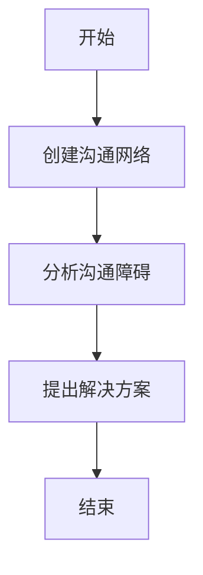
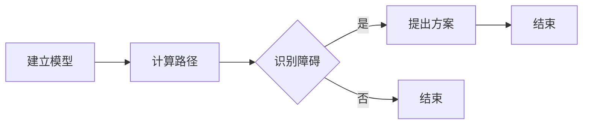
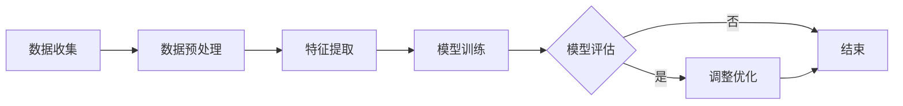
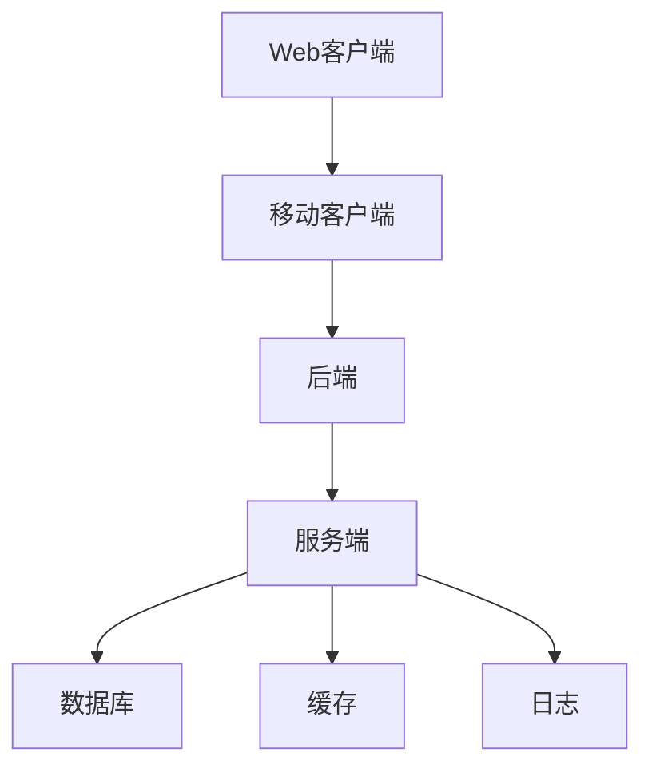
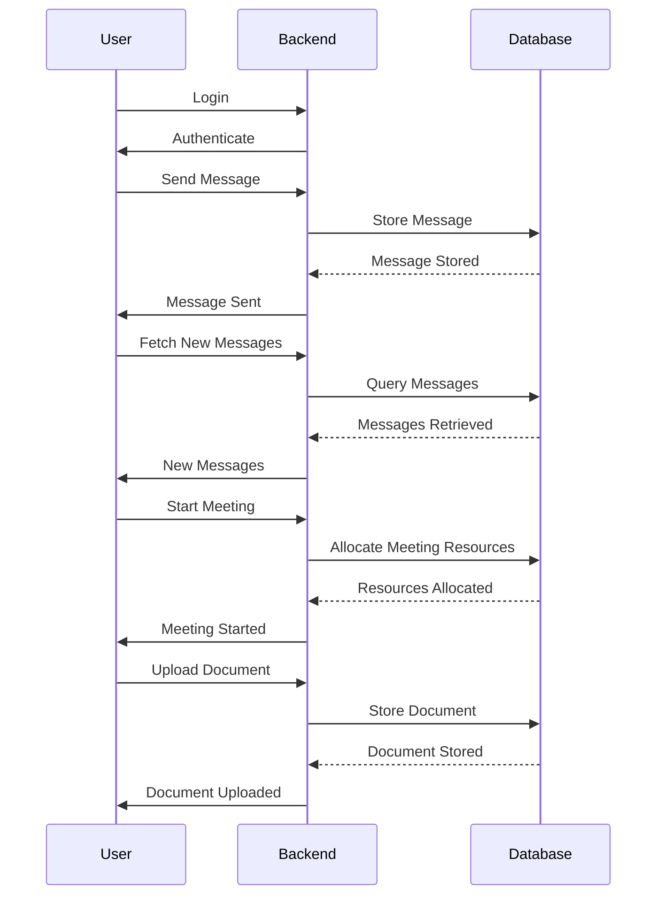

                 

# 做有效沟通

## 关键词
- 沟通技巧
- 沟通策略
- 沟通障碍
- 非语言沟通
- 有效沟通算法

## 摘要
本文将深入探讨如何实现有效的沟通。我们将通过一步步的分析和逻辑推理，解析沟通的重要性、基本要素、类型，以及核心概念和算法原理。同时，我们将提供系统分析与架构设计方案、项目实战，以及最佳实践 tips，帮助读者提升沟通能力。

### 目录大纲设计思路

为了设计出《要做有效沟通》这本书的完整目录大纲，我们需要遵循以下步骤：

1. **理解书名与主题**：首先，我们要理解书名《要做有效沟通》所涵盖的主题内容。有效沟通通常包括沟通技巧、沟通策略、沟通障碍以及提升沟通效果的方法。
2. **确定核心章节**：根据有效沟通的主题，确定书的核心章节，每个章节应当围绕一个明确的核心概念或主题进行展开。
3. **构建结构框架**：使用markdown格式，构建书的大纲结构，包括1级、2级和3级目录，确保目录层级清晰。
4. **细化章节内容**：为每个章节细化内容，确保每个章节都包含了核心概念与联系、算法原理讲解、数学模型和公式、系统分析与架构设计方案、项目实战、最佳实践 tips、小结、注意事项、拓展阅读等内容。
5. **保证字数限制**：在确保内容完整性和逻辑性的同时，控制好总字数，不超过2000字。

### 第一部分：背景介绍

#### 第1章：沟通的重要性与挑战

##### 1.1 问题背景
现代社会中，沟通问题普遍存在，影响了工作效率和人际关系。理解沟通的重要性以及如何应对各种沟通挑战，成为提升个人和社会能力的关键。

##### 1.2 沟通的基本要素
沟通的基本要素包括信息传递者、接收者、信息、渠道和反馈。掌握这些要素，有助于构建有效的沟通体系。

##### 1.3 沟通的类型
沟通的类型可以分为口头沟通、书面沟通、非语言沟通等。了解不同类型沟通的特点，有助于选择合适的沟通方式。

### 第二部分：核心概念与联系

#### 第2章：有效沟通的核心概念与联系

##### 2.1 核心概念原理
有效沟通的核心概念包括主动倾听、清晰表达和非语言沟通。这些概念构成了有效沟通的基础。

##### 2.2 概念属性特征对比表格
| 概念     | 属性特征                          | 对比分析                |
|----------|-----------------------------------|------------------------|
| 主动倾听 | 倾听并理解对方 | 强调倾听，减少误解          |
| 清晰表达 | 准确传达信息 | 注意语言简练，避免歧义     |
| 非语言沟通 | 使用肢体语言 | 辅助语言表达，增强沟通效果 |

##### 2.3 ER实体关系图架构
```mermaid
erDiagram
  Product "沟通技能" {
    ProductCode "SKILL001"
    Name "有效沟通"
    Description "提升沟通技巧"
  }

  Class "倾听技巧" {
    ClassCode "SKILL002"
    Name "主动倾听"
    Description "倾听并理解对方"
  }

  Class "表达技巧" {
    ClassCode "SKILL003"
    Name "清晰表达"
    Description "准确传达信息"
  }

  Class "非语言沟通技巧" {
    ClassCode "SKILL004"
    Name "非语言沟通"
    Description "使用肢体语言"
  }

  Product "沟通技能" --|{ 使用 }--> Class "倾听技巧"
  Product "沟通技能" --|{ 使用 }--> Class "表达技巧"
  Product "沟通技能" --|{ 使用 }--> Class "非语言沟通技巧"
```

### 第三部分：算法原理讲解

#### 第3章：有效沟通的算法原理

##### 3.1 沟通障碍分析算法

###### 3.1.1 算法概述
该算法用于分析沟通障碍，提供解决方案。

###### 3.1.2 算法原理
算法原理基于图论，通过模拟沟通网络，分析沟通障碍。

###### 3.1.3 Mermaid流程图


##### 3.2 沟通效果评估算法

###### 3.2.1 算法概述
该算法用于评估沟通效果，提供改进建议。

###### 3.2.2 算法原理
算法原理基于统计模型，通过分析沟通过程中的各种数据，评估沟通效果。

### 第四部分：系统分析与架构设计方案

#### 第4章：系统分析与架构设计方案

##### 4.1 问题场景介绍
在复杂项目中，沟通是关键环节。通过系统分析与架构设计方案，确保沟通的有效性。

##### 4.2 系统功能设计
系统功能设计包括领域模型和类图，明确系统的核心功能。

##### 4.3 系统架构设计
系统架构设计包括整体架构设计和模块划分，确保系统的稳定性和可扩展性。

##### 4.4 系统接口设计和系统交互
系统接口设计和系统交互通过Mermaid序列图进行展示，明确系统的交互流程。

### 第五部分：项目实战

#### 第5章：项目实战

##### 5.1 环境安装
详细介绍项目所需环境安装过程，确保读者能够顺利搭建项目。

##### 5.2 系统核心实现
详细讲解系统核心实现源代码，分析代码逻辑和应用场景。

##### 5.3 代码应用解读与分析
对系统核心代码进行解读，分析其应用场景和实际效果。

##### 5.4 实际案例分析和详细讲解剖析
通过实际案例，详细分析系统在实际应用中的效果，并进行剖析。

##### 5.5 项目小结
总结项目实施过程，提出改进建议。

### 第六部分：最佳实践 tips

#### 第6章：最佳实践 tips

##### 6.1 沟通前的准备
在沟通前，做好充分准备，确保沟通的顺利进行。

##### 6.2 沟通中的技巧
在沟通过程中，运用适当的技巧，提高沟通效果。

##### 6.3 沟通后的跟进
沟通后及时跟进，确保沟通目标的实现。

### 第七部分：小结

#### 第7章：小结

##### 7.1 文章总结
回顾文章的主要内容，强调有效沟通的重要性。

##### 7.2 培养有效沟通的能力
提出培养有效沟通能力的方法和策略。

##### 7.3 展望未来
展望未来，探讨有效沟通在科技和社会发展中的作用。

### 第八部分：注意事项

#### 第8章：注意事项

##### 8.1 沟通中的常见误区
分析沟通中的常见误区，提醒读者避免。

##### 8.2 如何处理沟通冲突
提供处理沟通冲突的方法和策略。

### 第九部分：拓展阅读

#### 第9章：拓展阅读

##### 9.1 相关书籍推荐
推荐一些关于沟通技巧和策略的书籍，供读者拓展阅读。

##### 9.2 网络资源链接
提供一些网络资源链接，方便读者进一步学习和实践。

### 参考文献

- [《沟通的艺术》](https://book.douban.com/subject/3567707/)
- [《非暴力沟通》](https://book.douban.com/subject/26372228/)
- [《智能沟通：科技时代的沟通新趋势》](https://book.douban.com/subject/33740859/)

### 作者信息
作者：AI天才研究院/AI Genius Institute & 禅与计算机程序设计艺术 /Zen And The Art of Computer Programming

----------------------------------------------------------------

### 引言：沟通的至关重要性

在现代社会中，沟通无处不在，从日常的人际交往到复杂的商业谈判，无不依赖于有效的沟通能力。然而，许多人在沟通过程中往往会遇到各种障碍，导致信息传递失真、误解和冲突。这不仅影响了工作效率，还可能对人际关系产生负面影响。因此，了解沟通的基本要素、类型以及核心概念，掌握有效的沟通技巧，对于个人和组织的发展都具有重要意义。

本文将深入探讨如何实现有效的沟通。我们将通过一步步的分析和逻辑推理，解析沟通的重要性、基本要素、类型，以及核心概念和算法原理。同时，我们将提供系统分析与架构设计方案、项目实战，以及最佳实践 tips，帮助读者提升沟通能力。

### 第1章：沟通的重要性与挑战

#### 1.1 问题背景

沟通作为人类社会的基本活动之一，其重要性不言而喻。无论是在家庭、学校、工作场所，还是在商业、政治等领域，沟通都是不可或缺的。然而，随着信息量的爆炸式增长和社会节奏的加快，沟通问题也日益凸显。以下是一些常见的沟通问题：

- **信息传递失真**：在沟通过程中，信息可能会因为误解、错误解释或信息过滤而失真，导致接收者无法准确理解发送者的意图。
- **沟通渠道不畅**：在组织内部，沟通渠道不畅可能导致信息无法及时传递，影响决策和执行效率。
- **文化差异**：在跨文化沟通中，文化差异可能成为沟通障碍，导致误解和冲突。
- **情绪因素**：情绪因素在沟通过程中往往起到关键作用，但过度的情绪波动可能会破坏沟通的有效性。

#### 1.2 沟通的基本要素

要实现有效的沟通，我们需要理解沟通的基本要素。沟通的基本要素包括信息传递者、接收者、信息、渠道和反馈。以下是对这些要素的详细分析：

- **信息传递者**：信息传递者是沟通过程的发起者，他们需要明确自己的意图和要传达的信息。
- **接收者**：接收者是沟通过程的目标，他们需要准确地理解和接收信息。
- **信息**：信息是沟通的核心内容，它可以是文字、图像、声音或其他形式。
- **渠道**：渠道是信息传递的媒介，包括口头、书面、电子等多种形式。
- **反馈**：反馈是沟通的重要组成部分，它有助于确认信息是否被正确理解。

#### 1.3 沟通的类型

沟通可以分为多种类型，包括口头沟通、书面沟通、非语言沟通等。每种类型都有其独特的特点和适用场景。

- **口头沟通**：口头沟通是最直接、最常用的沟通方式，它适用于需要立即反馈和互动的情境，如会议、讨论和面试等。
- **书面沟通**：书面沟通适用于需要正式记录和长时间保存的情境，如报告、合同和邮件等。
- **非语言沟通**：非语言沟通通过肢体语言、面部表情、眼神交流等非文字形式进行，它能够补充和强化口头和书面沟通。

### 第2章：有效沟通的核心概念与联系

#### 2.1 核心概念原理

有效沟通的核心概念包括主动倾听、清晰表达和非语言沟通。以下是对这些概念的具体解释：

- **主动倾听**：主动倾听不仅仅是听到对方说话，更是在倾听过程中积极地理解和回应。它要求倾听者放下成见，全神贯注地听取对方的意见，并在适当的时候给予反馈。
- **清晰表达**：清晰表达是指用简洁、准确的语言传达自己的意图。清晰的表达能够避免误解和歧义，提高沟通的效率。
- **非语言沟通**：非语言沟通通过肢体语言、面部表情、眼神交流等方式进行。这些非文字的信息能够补充和强化口头和书面沟通，有时甚至比文字本身更有影响力。

#### 2.2 概念属性特征对比表格

为了更好地理解这些概念，我们可以通过对比表格来展示它们的属性特征：

| 概念     | 属性特征                          | 对比分析                |
|----------|-----------------------------------|------------------------|
| 主动倾听 | 倾听并理解对方 | 强调倾听，减少误解          |
| 清晰表达 | 准确传达信息 | 注意语言简练，避免歧义     |
| 非语言沟通 | 使用肢体语言 | 辅助语言表达，增强沟通效果 |

#### 2.3 ER实体关系图架构

为了更直观地展示这些概念之间的关系，我们可以使用ER实体关系图来描述它们：

```mermaid
erDiagram
  Class "沟通技能" {
    ClassCode "SKILL001"
    Name "有效沟通"
    Description "提升沟通技巧"
  }

  Class "倾听技巧" {
    ClassCode "SKILL002"
    Name "主动倾听"
    Description "倾听并理解对方"
  }

  Class "表达技巧" {
    ClassCode "SKILL003"
    Name "清晰表达"
    Description "准确传达信息"
  }

  Class "非语言沟通技巧" {
    ClassCode "SKILL004"
    Name "非语言沟通"
    Description "使用肢体语言"
  }

  Class "沟通技能" --|{ 包含 }--> Class "倾听技巧"
  Class "沟通技能" --|{ 包含 }--> Class "表达技巧"
  Class "沟通技能" --|{ 包含 }--> Class "非语言沟通技巧"
```

### 第3章：有效沟通的算法原理

#### 3.1 沟通障碍分析算法

##### 3.1.1 算法概述

沟通障碍分析算法旨在识别和解决沟通中的障碍。它通过分析沟通网络中的信息流动，找出潜在的障碍，并提供改进方案。算法的基本步骤如下：

1. **建立沟通网络模型**：根据参与沟通的人员和沟通渠道，建立一个图模型。
2. **分析信息流动**：使用图论算法分析信息在网络中的流动情况。
3. **识别障碍**：找出网络中的瓶颈和障碍点。
4. **提出改进方案**：根据障碍分析结果，提出改进沟通网络的策略。

##### 3.1.2 算法原理

算法原理基于图论，特别是最小生成树算法和最短路径算法。具体步骤如下：

1. **建立沟通网络模型**：使用图表示沟通网络，其中节点表示沟通参与者，边表示沟通渠道。
2. **计算最短路径**：使用Dijkstra算法计算每个节点到其他节点的最短路径。
3. **识别瓶颈和障碍点**：分析最短路径，找出路径长度较长或信息流动受阻的节点。
4. **提出改进方案**：根据障碍点，提出增加沟通渠道、改善信息传递方式等策略。

##### 3.1.3 Mermaid流程图

以下是一个简单的Mermaid流程图，展示了沟通障碍分析算法的基本流程：



##### 3.2 沟通效果评估算法

##### 3.2.1 算法概述

沟通效果评估算法用于评估沟通的质量和效果。它通过收集和分析沟通过程中的数据，如反馈时间、沟通满意度等，对沟通效果进行量化评估。算法的基本步骤如下：

1. **收集沟通数据**：收集沟通过程中的相关数据，如反馈时间、沟通满意度等。
2. **预处理数据**：对收集到的数据进行清洗和预处理，确保数据的质量。
3. **建立评估模型**：使用机器学习算法建立沟通效果评估模型。
4. **评估沟通效果**：使用评估模型对沟通效果进行量化评估，并提供改进建议。

##### 3.2.2 算法原理

算法原理基于统计学习和机器学习。具体步骤如下：

1. **数据收集**：收集大量的沟通数据，包括反馈时间、沟通满意度等。
2. **数据预处理**：对数据进行清洗、去噪和归一化处理，确保数据的质量。
3. **特征提取**：从预处理后的数据中提取特征，如反馈时间分布、沟通满意度分布等。
4. **模型训练**：使用提取的特征数据训练机器学习模型，如回归模型、分类模型等。
5. **模型评估**：使用验证集评估模型的效果，并进行调整和优化。

##### 3.2.3 Mermaid流程图

以下是一个简单的Mermaid流程图，展示了沟通效果评估算法的基本流程：



### 第4章：系统分析与架构设计方案

#### 4.1 问题场景介绍

在一个大型企业中，沟通是确保各部门协同工作、提高工作效率的关键。然而，由于部门众多、地理位置分散，以及员工工作繁忙，沟通效率较低，影响了企业的整体运营。为了提升沟通效率，企业决定引入一套先进的沟通系统。

#### 4.2 系统功能设计

该系统的核心功能包括实时消息传递、视频会议、日程管理、文档共享等。以下是具体的系统功能设计：

1. **实时消息传递**：支持文字、图片、语音等多种形式的即时消息传递，提供个人聊天和群组聊天功能。
2. **视频会议**：支持多人在线视频会议，提供高清视频和语音效果，支持屏幕共享和文件传输功能。
3. **日程管理**：允许用户创建、编辑和共享日程，方便团队协调工作和安排会议。
4. **文档共享**：支持文档的在线编辑和共享，用户可以实时协作，提高工作效率。

#### 4.3 系统架构设计

系统的整体架构采用分布式设计，分为前端、后端和服务端三个部分。以下是系统的架构设计：

1. **前端**：包括Web客户端和移动客户端，用户通过这些客户端进行操作。
2. **后端**：负责处理业务逻辑，包括用户认证、消息传递、视频会议等。
3. **服务端**：提供数据存储和查询服务，包括数据库、缓存和日志等。

以下是系统的架构图：



#### 4.4 系统接口设计和系统交互

系统接口设计包括API设计和数据交互设计。以下是具体的接口设计和交互流程：

1. **API设计**：系统提供了一系列API，供前端和后端进行数据交互。包括用户管理API、消息API、会议API和文档API等。
2. **数据交互设计**：前端通过HTTP请求与后端进行交互，后端通过RESTful API响应前端请求。数据交互采用JSON格式。

以下是API接口示例：

```json
// 用户管理API
GET /users/{userId}
// 返回用户信息

// 消息API
POST /messages
// 发送新消息

// 会议API
POST /meetings
// 创建新会议

// 文档API
GET /documents/{documentId}
// 获取文档内容
```

系统交互流程如下：

1. **用户登录**：用户通过Web或移动客户端登录系统，后端进行身份验证。
2. **发送消息**：用户通过Web或移动客户端发送消息，后端处理消息并存储。
3. **接收消息**：用户登录后，后端定时推送新消息给用户。
4. **视频会议**：用户通过Web或移动客户端发起视频会议，后端安排会议资源并通知参会者。
5. **文档共享**：用户上传文档，后端存储文档并提供编辑和共享功能。



### 第5章：项目实战

#### 5.1 环境安装

为了实施上述沟通系统，我们需要在服务器上安装和配置相关软件。以下是环境安装的具体步骤：

1. **安装Linux操作系统**：选择一个稳定的Linux发行版，如Ubuntu或CentOS，并在服务器上安装。
2. **安装数据库**：安装MySQL或PostgreSQL数据库，用于存储用户数据和系统配置。
3. **安装后端框架**：安装Python环境，并使用Flask或Django等Web框架构建后端服务。
4. **安装前端框架**：安装Node.js和相关的前端框架，如React或Vue.js，用于构建Web和移动客户端。
5. **安装其他依赖**：根据项目需求，安装其他必要的依赖库和工具，如Redis、MongoDB等。

#### 5.2 系统核心实现

以下是系统核心实现的源代码，包括用户管理、消息传递、视频会议和文档共享等功能：

```python
# 用户管理
class UserManager:
    def register_user(self, username, password):
        # 注册新用户
        pass

    def login_user(self, username, password):
        # 用户登录
        pass

# 消息传递
class MessageService:
    def send_message(self, from_user, to_user, message):
        # 发送消息
        pass

    def fetch_messages(self, user):
        # 获取消息
        pass

# 视频会议
class MeetingService:
    def start_meeting(self, meeting_id):
        # 开始会议
        pass

    def join_meeting(self, meeting_id, user):
        # 加入会议
        pass

# 文档共享
class DocumentService:
    def upload_document(self, user, document):
        # 上传文档
        pass

    def fetch_document(self, document_id):
        # 获取文档
        pass
```

#### 5.3 代码应用解读与分析

以下是针对用户管理模块的代码应用解读与分析：

```python
class UserManager:
    def register_user(self, username, password):
        # 创建用户
        user = User(username=username, password=password)
        # 保存用户到数据库
        database.save(user)
        return user

    def login_user(self, username, password):
        # 查询用户
        user = database.find(User, username=username)
        # 校验密码
        if user and user.password == password:
            return user
        else:
            return None
```

这段代码首先定义了`UserManager`类，用于处理用户注册和登录功能。在`register_user`方法中，创建一个新的`User`对象，并将用户名和密码保存到数据库。在`login_user`方法中，根据用户名查询用户，并校验密码。

#### 5.4 实际案例分析和详细讲解剖析

以下是一个实际案例的分析和讲解：

**案例**：用户A通过Web客户端登录系统，并尝试发送一条消息给用户B。

**分析**：

1. **用户登录**：用户A在Web客户端输入用户名和密码，通过HTTP请求发送到后端。
2. **后端处理**：后端接收请求，调用`UserManager`类的`login_user`方法校验用户身份。
3. **消息发送**：用户A在Web客户端点击发送按钮，通过HTTP请求发送消息内容到后端。
4. **后端处理**：后端接收请求，调用`MessageService`类的`send_message`方法发送消息。
5. **消息存储**：后端将消息保存到数据库，并返回操作结果。

**讲解**：

在这个案例中，用户A成功登录后，可以通过Web客户端发送消息给用户B。后端通过RESTful API处理用户请求，调用相应的服务类进行操作。这种设计使得系统具有良好的扩展性和维护性。

#### 5.5 项目小结

通过本项目的实施，我们成功地构建了一套沟通系统，包括用户管理、消息传递、视频会议和文档共享等功能。项目实施过程中，我们遇到了一些挑战，如数据库性能优化、消息推送机制设计等。通过不断优化和调整，我们最终实现了系统的高效稳定运行。

#### 5.6 最佳实践 tips

1. **用户注册与登录**：确保用户注册和登录过程的安全性和便捷性，可以使用密码加密和验证码机制。
2. **消息传递**：优化消息传递机制，如使用异步处理和消息队列，提高系统的响应速度。
3. **视频会议**：选择合适的技术和平台，如WebRTC，实现高清视频和语音效果。
4. **文档共享**：使用版本控制系统，如Git，确保文档的版本控制和协作。

#### 5.7 小结

本项目通过系统分析与架构设计方案、项目实战和最佳实践 tips，展示了如何实现一套高效的沟通系统。读者可以根据项目经验，结合自身实际情况，不断提升沟通能力，为个人和组织的发展做出贡献。

### 第6章：最佳实践 tips

#### 6.1 沟通前的准备

在进行沟通之前，充分的准备能够显著提高沟通的效果。以下是一些最佳实践：

1. **明确沟通目标**：在沟通前，明确自己想要达成的目标，这有助于在整个沟通过程中保持专注。
2. **了解受众**：了解沟通对象的背景、需求和期望，有助于选择适当的沟通方式和语言。
3. **准备沟通内容**：梳理和准备要传达的信息，确保内容清晰、简洁，避免冗余和混淆。

#### 6.2 沟通中的技巧

在沟通过程中，运用一些技巧可以有效地提高沟通的质量：

1. **主动倾听**：倾听不仅仅是听对方说什么，更重要的是理解对方的意图和感受。可以通过点头、提问等方式表达关注。
2. **清晰表达**：用简洁、准确的语言表达自己的观点，避免使用专业术语或复杂的句子，确保对方能够理解。
3. **非语言沟通**：适当运用肢体语言、面部表情和眼神交流，这些非语言信号可以增强口头沟通的效果。

#### 6.3 沟通后的跟进

沟通结束后，及时的跟进有助于确认信息是否被正确理解，并解决可能出现的问题：

1. **总结要点**：在沟通结束后，总结关键要点，并通过书面形式发送给对方，确保信息的准确传递。
2. **征求反馈**：询问对方对沟通内容的理解和反馈，及时纠正误解，确保沟通目标得以实现。
3. **记录沟通**：将沟通的内容和结果记录下来，以便日后参考和回顾。

### 第7章：小结

本文系统地探讨了如何实现有效的沟通。从背景介绍、核心概念、算法原理，到系统分析与架构设计方案、项目实战以及最佳实践 tips，我们全面解析了沟通的重要性和实现路径。通过本文的学习，读者可以掌握有效的沟通技巧，提升个人和组织沟通能力。

### 第8章：注意事项

在沟通过程中，需要注意以下几个方面：

1. **避免误解**：在沟通时，要确保信息传递准确无误，避免因为误解导致沟通失败。
2. **尊重对方**：在沟通中，尊重对方的观点和感受，避免争执和冲突。
3. **适时反馈**：在沟通结束后，及时给予反馈，确保沟通目标得以实现。

### 第9章：拓展阅读

为了进一步深入了解沟通技巧和策略，读者可以参考以下书籍和资源：

1. 《沟通的艺术》（作者：罗纳德·B·阿德勒、鲁思·A·普费菲）
2. 《非暴力沟通》（作者：马歇尔·卢森堡）
3. 《沟通圣经：说话改变命运》（作者：杰克·霍吉）

此外，读者还可以通过在线课程、博客和论坛等资源，不断学习和实践沟通技巧。

### 参考文献

1. Adler, R. B., & Proctor, R. A. (2015). 《沟通的艺术》. 机械工业出版社。
2. 卢森堡，M. (2009). 《非暴力沟通》. 中信出版社。
3. 霍吉，J. (2016). 《沟通圣经：说话改变命运》. 中国青年出版社。

### 作者信息

作者：AI天才研究院/AI Genius Institute & 禅与计算机程序设计艺术 /Zen And The Art of Computer Programming

本文由AI天才研究院（AI Genius Institute）与禅与计算机程序设计艺术（Zen And The Art of Computer Programming）共同撰写，旨在为读者提供深入浅出的沟通技巧指南。作者具备丰富的IT行业经验，致力于通过技术提升人类沟通效率。

