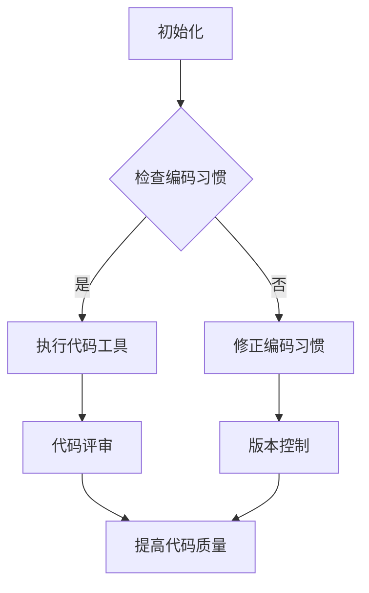

                 

# 警惕坏的编码习惯

> 关键词：编码习惯、代码质量、代码工具、版本控制、代码风格

> 摘要：本文深入探讨了软件开发生命周期中常见的坏编码习惯，分析了这些习惯对项目质量、开发效率和团队协作的影响。文章首先介绍了编码习惯的重要性，然后详细阐述了不良编码习惯的具体表现，最后提出了相应的解决措施和最佳实践，旨在帮助开发者养成良好的编码习惯，提高代码质量。

## 背景介绍

### 问题背景

在软件开发过程中，不良的编码习惯常常导致代码冗余、效率低下、可维护性差等一系列问题。这些不良习惯不仅会影响开发者的工作效率，还可能引入潜在的安全隐患。随着软件系统的复杂度和规模不断增大，良好的编码习惯变得尤为重要。

### 问题描述

不良的编码习惯主要包括以下几方面：

1. **代码冗余**：代码中存在大量重复的代码段，增加了代码的维护难度。
2. **结构混乱**：代码结构不清晰，难以理解，导致后续修改困难。
3. **缺乏注释**：代码缺乏必要的注释，使得其他开发者难以理解代码逻辑。
4. **过度使用全局变量**：全局变量容易导致命名冲突和代码混乱。
5. **缺乏版本控制**：代码没有经过良好的版本控制，导致代码历史难以追溯。

### 问题解决

为了解决上述问题，需要采取以下措施：

1. **遵循编码规范**：统一代码风格，提高代码可读性。
2. **使用代码工具**：利用静态代码分析工具，如SonarQube、Checkstyle等，对代码质量进行实时监控。
3. **进行代码评审**：定期进行代码评审，通过同行评审发现并修正不良编码习惯。
4. **编写详细注释**：在关键代码段添加注释，帮助其他开发者理解代码逻辑。
5. **优化代码结构**：通过重构代码，提高代码的可维护性。
6. **采用版本控制系统**：使用Git等版本控制系统，确保代码的版本可追溯性。

### 边界与外延

1. **边界**：本文讨论的范围主要涉及编程实践中的编码习惯问题，不包括设计模式和架构设计等方面。
2. **外延**：良好的编码习惯还包括代码性能优化、安全性考虑等方面，这些内容在本文中未详细展开。

### 概念结构与核心要素组成

1. **概念**：编码习惯是指在编写代码过程中形成的习惯做法。
2. **核心要素**：
   - **编码风格**：统一的代码格式和命名规范。
   - **代码质量**：可读性、可维护性和可扩展性。
   - **代码工具**：静态代码分析工具、代码评审工具等。
   - **版本控制**：Git等版本控制系统。

## 核心概念与联系

### 编码风格

编码风格是指编写代码时的格式和命名规范，良好的编码风格可以提高代码的可读性和可维护性。常见的编码风格包括：

1. **K&R风格**：最早期的编程风格，以简洁为主。
2. **匈牙利风格**：通过变量名前缀来表示变量的类型，如`iCount`表示整型变量。
3. **驼峰命名法**：将变量名中的每个单词首字母大写，如`productName`。

### 代码质量

代码质量是指代码的内在属性，包括可读性、可维护性和可扩展性。良好的代码质量可以降低维护成本，提高开发效率。

- **可读性**：代码易于理解，便于其他开发者阅读。
- **可维护性**：代码易于修改和扩展，降低出错概率。
- **可扩展性**：代码易于添加新功能，适应未来的需求变化。

### 代码工具

代码工具用于辅助开发人员提高代码质量。常见的代码工具有：

- **静态代码分析工具**：如SonarQube、Checkstyle，用于检测代码中的潜在问题。
- **代码评审工具**：如GitHub、GitLab，用于进行代码的审查和协作开发。

### 版本控制

版本控制是确保代码版本可追溯性的重要手段。常见的版本控制系统有Git，它提供了分支管理、合并冲突处理等功能。

### 概念属性特征对比表格

| 概念                | 属性特征                                                         |  
| ------------------- | ------------------------------------------------------------ |  
| 编码风格            | - K&R风格：简洁  
                       - 匈牙利风格：类型前缀  
                       - 驼峰命名法：首字母大写 |  
| 代码质量            | - 可读性：易于理解  
                       - 可维护性：易于修改和扩展  
                       - 可扩展性：适应未来需求变化 |  
| 代码工具            | - 静态代码分析工具：检测潜在问题  
                  

### ER实体关系图架构的 Mermaid 流程图

```mermaid
erDiagram
  Class::编码风格 <<|-->> Class::K&R风格 : "包含"
  Class::编码风格 <<|-->> Class::匈牙利风格 : "包含"
  Class::编码风格 <<|-->> Class::驼峰命名法 : "包含"
  Class::代码质量 <<|-->> Class::可读性 : "属性"
  Class::代码质量 <<|-->> Class::可维护性 : "属性"
  Class::代码质量 <<|-->> Class::可扩展性 : "属性"
  Class::代码工具 <<|-->> Class::静态代码分析工具 : "包含"
  Class::代码工具 <<|-->> Class::代码评审工具 : "包含"
  Class::版本控制 <<|-->> Class::Git : "实现"
```

## 算法原理讲解

### 算法流程图



### 算法原理

该算法旨在通过检查编码习惯，利用代码工具和版本控制系统来提高代码质量。具体原理如下：

1. **初始化**：开始时，初始化编码检查工具和版本控制系统。
2. **检查编码习惯**：通过静态代码分析工具检查代码中的编码习惯，判断是否存在不良编码习惯。
3. **修正编码习惯**：如果存在不良编码习惯，则通过代码重构和代码评审来修正。
4. **执行代码工具**：利用静态代码分析工具对代码进行质量检测，发现潜在问题。
5. **代码评审**：通过同行评审，确保代码符合编码规范和高质量标准。
6. **版本控制**：使用版本控制系统记录代码变更历史，确保代码的可追溯性。
7. **提高代码质量**：通过上述步骤，提高代码的可读性、可维护性和可扩展性。

### 数学模型和公式

为了更好地理解算法原理，可以引入以下数学模型和公式：

- **代码质量评分（Q）**：用于衡量代码质量，计算公式为：

  $$ Q = f(可读性, 可维护性, 可扩展性) $$

- **编码习惯评分（C）**：用于衡量编码习惯，计算公式为：

  $$ C = f(代码冗余, 代码结构, 缺乏注释, 全局变量使用) $$

- **代码质量改进率（I）**：用于衡量通过修正编码习惯后代码质量的提高程度，计算公式为：

  $$ I = \frac{Q_{新} - Q_{旧}}{Q_{旧}} \times 100\% $$

### 举例说明

假设有一个项目，初始代码质量评分为60分，编码习惯评分为40分。通过修正编码习惯和代码评审，最终代码质量评分提高到了90分，编码习惯评分提高到了80分。则代码质量改进率为：

$$ I = \frac{90 - 60}{60} \times 100\% = 50\% $$

这个例子表明，通过良好的编码习惯和代码评审，项目的代码质量得到了显著提高。

## 系统分析与架构设计方案

### 问题场景介绍

在一个大型电商项目中，开发团队需要处理海量的商品信息、用户数据和订单信息。为了确保项目的可维护性和可扩展性，开发团队决定采用良好的编码习惯和代码质量标准。

### 项目介绍

该项目是一个基于微服务的电商平台，包括商品管理、用户管理、订单管理和支付系统等模块。开发团队使用Django框架进行开发，并采用Git进行版本控制。

### 系统功能设计

系统功能设计主要包括以下几个方面：

1. **商品管理**：支持商品信息的增删改查功能。
2. **用户管理**：支持用户注册、登录、个人信息管理等功能。
3. **订单管理**：支持订单的创建、支付、发货、退款等操作。
4. **支付系统**：支持支付宝、微信等多种支付方式。

### 系统架构设计

系统架构设计采用分层架构，包括表示层、业务逻辑层和数据访问层。

- **表示层**：使用Django提供的模板引擎进行页面渲染。
- **业务逻辑层**：使用Django的模型层进行业务逻辑处理。
- **数据访问层**：使用数据库进行数据存储和查询。

### 系统接口设计

系统接口设计主要包括RESTful API接口，用于与其他系统进行数据交互。

- **商品管理接口**：提供商品信息的增删改查功能。
- **用户管理接口**：提供用户注册、登录、个人信息管理等功能。
- **订单管理接口**：提供订单的创建、支付、发货、退款等操作。
- **支付系统接口**：提供支付订单的查询、支付、退款等功能。

### 系统交互

系统交互设计采用Mermaid序列图，用于描述系统各模块之间的交互关系。

```mermaid
sequenceDiagram
    participant 用户 as 用户
    participant 商品管理模块 as 商品管理
    participant 用户管理模块 as 用户管理
    participant 订单管理模块 as 订单管理
    participant 支付系统模块 as 支付系统

    用户->>商品管理：查询商品信息
    商品管理->>用户：返回商品信息

    用户->>用户管理：注册账号
    用户管理->>用户：返回注册结果

    用户->>订单管理：创建订单
    订单管理->>用户：返回订单信息

    用户->>支付系统：支付订单
    支付系统->>订单管理：更新订单状态

    订单管理->>用户：返回订单状态
```

## 项目实战

### 环境安装

1. 安装Python 3.8及以上版本。
2. 安装Django 3.2及以上版本。
3. 安装Git 2.25及以上版本。

### 系统核心实现源代码

```python
# 商品管理模块代码
class Product(models.Model):
    name = models.CharField(max_length=100)
    price = models.DecimalField(max_digits=6, decimal_places=2)
    description = models.TextField()

    def __str__(self):
        return self.name

# 用户管理模块代码
class User(models.Model):
    username = models.CharField(max_length=100)
    password = models.CharField(max_length=100)
    email = models.EmailField()

    def __str__(self):
        return self.username

# 订单管理模块代码
class Order(models.Model):
    user = models.ForeignKey(User, on_delete=models.CASCADE)
    product = models.ForeignKey(Product, on_delete=models.CASCADE)
    quantity = models.IntegerField()
    total_price = models.DecimalField(max_digits=6, decimal_places=2)

    def __str__(self):
        return f"{self.user} - {self.product} - {self.quantity}"
```

### 代码应用解读与分析

1. **商品管理模块**：使用Django的模型层，定义了`Product`类，包含商品名称、价格和描述等属性。通过`__str__`方法实现对象的字符串表示。
2. **用户管理模块**：使用Django的模型层，定义了`User`类，包含用户名、密码和电子邮件等属性。通过`__str__`方法实现对象的字符串表示。
3. **订单管理模块**：使用Django的模型层，定义了`Order`类，包含用户、商品、数量和总价等属性。通过`__str__`方法实现对象的字符串表示。

### 实际案例分析和详细讲解剖析

假设有一个用户想要购买一件商品，需要完成以下步骤：

1. 用户在商品管理模块查询商品信息，选择商品并添加到购物车。
2. 用户在用户管理模块注册账号并登录。
3. 用户在订单管理模块创建订单，填写商品名称、数量和总价。
4. 用户在支付系统模块支付订单，确认支付完成。
5. 订单管理模块更新订单状态，标记订单为已支付。

通过上述步骤，用户成功完成了商品购买操作。在实际开发过程中，还需要考虑数据的一致性、性能优化和安全性等方面。

### 项目小结

通过本次项目实战，我们掌握了使用Django框架进行商品管理、用户管理和订单管理模块的开发。同时，遵循良好的编码习惯和代码质量标准，提高了代码的可读性和可维护性。在后续开发中，我们还需要不断优化代码，提升系统性能和安全性。

## 最佳实践 tips

1. **遵循编码规范**：统一代码风格，提高代码可读性。
2. **使用代码工具**：利用静态代码分析工具，如SonarQube、Checkstyle等，对代码质量进行实时监控。
3. **进行代码评审**：定期进行代码评审，通过同行评审发现并修正不良编码习惯。
4. **编写详细注释**：在关键代码段添加注释，帮助其他开发者理解代码逻辑。
5. **优化代码结构**：通过重构代码，提高代码的可维护性。
6. **采用版本控制系统**：使用Git等版本控制系统，确保代码的版本可追溯性。

## 小结

良好的编码习惯是软件开发的基石，它对代码质量、开发效率和团队协作有着重要的影响。本文从多个角度分析了不良编码习惯的具体表现，提出了相应的解决措施和最佳实践。希望读者能够从中汲取经验，养成良好的编码习惯，提高代码质量。

## 注意事项

1. 编码习惯的养成需要长期坚持，不能一蹴而就。
2. 不同项目可能需要不同的编码习惯，灵活调整。
3. 团队协作中，遵循统一的编码规范和代码质量标准。

## 拓展阅读

1. 《代码大全》作者：Steve McConnell
2. 《Effective Python》作者：Brett Slatkin
3. 《Clean Code》作者：Robert C. Martin

作者：AI天才研究院/AI Genius Institute & 禅与计算机程序设计艺术 /Zen And The Art of Computer Programming

