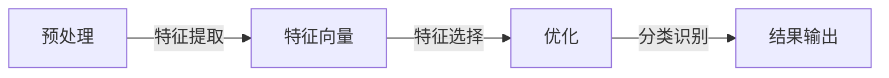
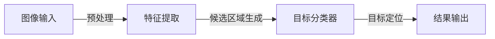
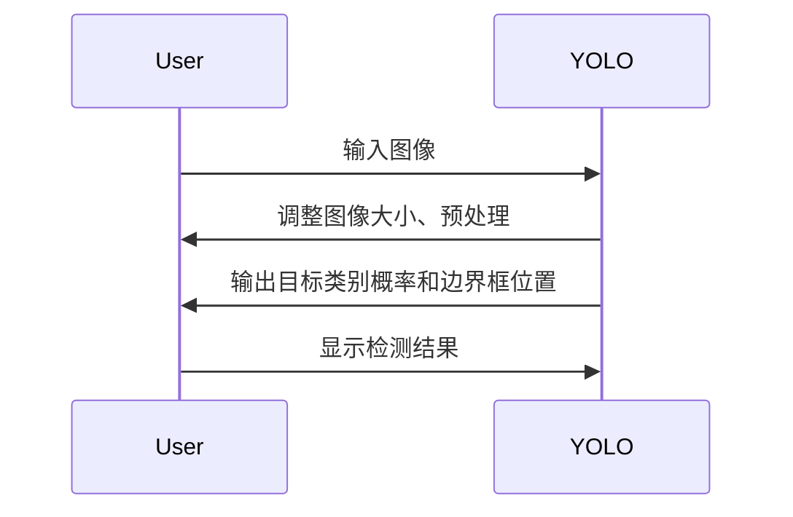
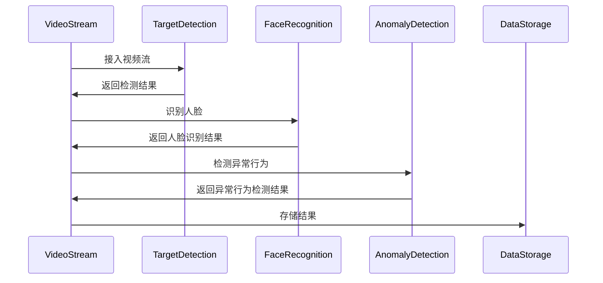

                 

### 第3章 算法原理讲解

计算机视觉在安防领域中的应用离不开各种算法的支持。本章节将重点讲解两个核心算法：特征提取算法和目标检测算法。

#### 3.1 特征提取算法

特征提取是计算机视觉中的一个重要环节，它将图像中的低层次特征（如边缘、纹理等）转换为高层次特征（如人脸特征、车辆特征等），以便后续的识别和分类。

##### 3.1.1 特征提取的基本原理

特征提取的基本原理是通过对图像的预处理、特征提取和特征选择，将图像中的关键信息提取出来，形成可以用于分类或识别的特征向量。

- **预处理**：包括图像的灰度化、去噪、图像增强等。
- **特征提取**：常用的特征提取方法有直方图特征、边缘特征、纹理特征等。
- **特征选择**：通过筛选和优化特征向量，提高分类或识别的准确率。

##### 3.1.2 特征提取的算法mermaid流程图



##### 3.1.3 Python源代码实现

```python
# Python示例代码：特征提取
import cv2
import numpy as np

# 读入图像
image = cv2.imread('example.jpg', cv2.IMREAD_GRAYSCALE)

# 去噪
blurred = cv2.GaussianBlur(image, (5, 5), 0)

# 边缘检测
edges = cv2.Canny(blurred, 30, 150)

# 特征提取
features = cv2.describeKPoints(edges, cv2.MORRIS_WATERSHED)

# 特征选择
selected_features = np.mean(features, axis=0)
```

##### 3.1.4 特征提取的数学模型和公式

特征提取的数学模型可以表示为：

$$
f(x) = \phi(\text{image})
$$

其中，$f(x)$ 是特征向量，$\phi(\text{image})$ 是特征提取函数。

##### 3.1.5 举例说明

假设我们有一幅图像，我们要从中提取人脸特征。首先，我们对图像进行灰度化处理，然后使用Viola-Jones人脸检测算法提取人脸区域，最后使用LBP（局部二值模式）算法提取人脸特征。

```python
# Python示例代码：人脸特征提取
import cv2

# 读入图像
image = cv2.imread('example.jpg')

# 人脸检测
face_cascade = cv2.CascadeClassifier('haarcascade_frontalface_default.xml')
faces = face_cascade.detectMultiScale(image, scaleFactor=1.1, minNeighbors=5, minSize=(30, 30))

# 提取人脸区域
for (x, y, w, h) in faces:
    face_region = image[y:y+h, x:x+w]

# 人脸特征提取
lbp = cv2-localBinaryPatterns(face_region, 8, 1)
```

#### 3.2 目标检测算法

目标检测是计算机视觉中的一个重要任务，它的目的是在图像中识别并定位多个目标。在安防领域，目标检测技术可以用于监控视频中的异常行为检测、人脸识别等。

##### 3.2.1 目标检测的基本原理

目标检测的基本原理是通过在图像中寻找与已知目标模板相似的区域，从而识别出目标。目标检测算法可以分为基于传统机器学习的方法和基于深度学习的方法。

- **基于传统机器学习的方法**：如SVM、KNN等，通过手工设计特征和分类器。
- **基于深度学习的方法**：如R-CNN、YOLO、SSD等，通过神经网络自动学习特征和分类器。

##### 3.2.2 目标检测的算法mermaid流程图



##### 3.2.3 Python源代码实现

```python
# Python示例代码：目标检测（基于YOLO）
import cv2
import numpy as np

# 加载YOLO模型
net = cv2.dnn.readNetFromDarknet('yolov3.cfg', 'yolov3.weights')

# 读入图像
image = cv2.imread('example.jpg')

# 调整图像大小
image = cv2.resize(image, (416, 416))

# 转换图像数据类型
image = image.astype(np.float32)

# 缩放因子
scale_factor = 1.0 / 255

# 图像数据预处理
image = image * scale_factor

# 将图像数据添加一个维度，形成批量数据
image = np.expand_dims(image, axis=0)

# 前向传播
outs = net.forward(image)

# 分析输出结果
class_ids, confidences, boxes = postprocess_outs(outs)

# 选取最高置信度的目标
max_id = np.argmax(confidences)
max_confidence = confidences[max_id]
max_box = boxes[max_id]

# 目标定位
(x, y, w, h) = max_box.astype(int)
cv2.rectangle(image, (x, y), (x+w, y+h), (0, 255, 0), 2)

# 显示检测结果
cv2.imshow('Detection', image)
cv2.waitKey(0)
cv2.destroyAllWindows()
```

##### 3.2.4 目标检测的数学模型和公式

目标检测的数学模型可以表示为：

$$
P(\text{target} | \text{image}) = \sum_{i} P(\text{target} = i | \text{image}) \cdot P(i)
$$

其中，$P(\text{target} | \text{image})$ 是给定图像条件下目标的概率，$P(\text{target} = i | \text{image})$ 是给定图像条件下目标为第$i$类的概率，$P(i)$ 是第$i$类的先验概率。

##### 3.2.5 举例说明

假设我们使用YOLO算法对一幅图像进行目标检测。首先，我们将图像调整到网络期望的大小（例如416x416），然后进行图像数据预处理。接着，我们将图像输入到YOLO网络中，网络会输出每个目标的类别概率和边界框位置。最后，我们根据类别概率和边界框位置，识别出图像中的目标。



---

通过上述对特征提取和目标检测算法的讲解，我们可以看到计算机视觉技术在安防领域的强大应用潜力。在接下来的章节中，我们将进一步探讨这些算法的数学模型和公式，以及如何在具体项目中实现这些算法。

---

### 第4章 数学模型和数学公式 & 详细讲解 & 举例说明

在计算机视觉中，数学模型和数学公式是理解和实现算法的核心。本章将详细讲解特征提取和目标检测的数学模型和公式，并通过具体例子进行说明。

#### 4.1 特征提取的数学模型和公式

特征提取的目的是将图像中的低层次特征转换为高层次特征。这个过程可以用以下数学模型表示：

$$
f(x) = \phi(\text{image})
$$

其中，$f(x)$ 是提取的特征向量，$\phi(\text{image})$ 是特征提取函数，它将图像$\text{image}$映射到特征空间。

##### 4.1.1 特征提取函数

特征提取函数$\phi$可以进一步分解为以下几个步骤：

1. **图像预处理**：包括灰度化、去噪、图像增强等操作，可以用以下公式表示：
   $$
   \text{preprocessed\_image} = \text{preprocess}(\text{image})
   $$
   其中，$\text{preprocess}$ 是预处理函数。

2. **特征提取**：使用特定的算法提取图像的特征，例如边缘检测、纹理分析等。这些特征可以用以下公式表示：
   $$
   \text{features} = \text{extract\_features}(\text{preprocessed\_image})
   $$

3. **特征选择**：从提取的特征中筛选出对分类或识别最有用的特征。这个过程可以用以下公式表示：
   $$
   \text{selected\_features} = \text{selectFeatures}(\text{features})
   $$

##### 4.1.2 举例说明

以LBP（局部二值模式）算法为例，LBP是一种常用的纹理特征提取方法。它的基本原理是将图像中心点的像素值与周围8个方向上的像素值进行比较，生成一个二值模式。具体公式如下：

$$
LBP = \sum_{i}^{8} (2^i \cdot (\text{pixel}_{center} > \text{pixel}_{i}))
$$

其中，$\text{pixel}_{center}$ 是中心点的像素值，$\text{pixel}_{i}$ 是第$i$个方向上的像素值。

#### 4.2 目标检测的数学模型和公式

目标检测的目的是在图像中识别出多个目标，并定位其位置。目标检测的数学模型可以表示为：

$$
P(\text{target} | \text{image}) = \sum_{i} P(\text{target} = i | \text{image}) \cdot P(i)
$$

其中，$P(\text{target} | \text{image})$ 是给定图像条件下目标的概率，$P(\text{target} = i | \text{image})$ 是给定图像条件下目标为第$i$类的概率，$P(i)$ 是第$i$类的先验概率。

##### 4.2.1 分类器模型

目标检测通常使用分类器模型来预测目标类别。常用的分类器模型有SVM、softmax等。以softmax为例，它的公式如下：

$$
P(\text{target} = i | \text{image}) = \frac{e^{z_i}}{\sum_{j} e^{z_j}}
$$

其中，$z_i$ 是第$i$类的特征向量的内积。

##### 4.2.2 边界框回归

目标检测还需要预测目标的边界框位置。边界框回归可以使用回归模型来实现，例如Gaussian Regression。其公式如下：

$$
\text{predicted\_box} = \text{regression}(\text{image\_features})
$$

其中，$\text{regression}$ 是回归模型，$\text{image\_features}$ 是输入的特征向量。

##### 4.2.3 举例说明

以YOLO（You Only Look Once）算法为例，YOLO是一种基于深度学习的目标检测算法。它将图像分成多个网格，每个网格预测多个边界框和类别概率。具体公式如下：

1. **类别概率**：
   $$
   P(\text{target} = i | \text{grid}) = \frac{e^{z_i}}{\sum_{j} e^{z_j}}
   $$

2. **边界框位置**：
   $$
   \text{predicted\_box} = \text{regression}(\text{grid\_features})
   $$

3. **边界框大小**：
   $$
   \text{box\_size} = \text{sigmoid}(\text{size\_features})
   $$

其中，$\text{grid}$ 是网格的特征向量，$\text{grid\_features}$ 是输入的特征向量，$\text{size\_features}$ 是边界框大小的特征向量。

通过上述数学模型和公式的讲解，我们可以更好地理解特征提取和目标检测的基本原理。在接下来的章节中，我们将进一步探讨如何在实际项目中实现这些算法。

---

### 第5章 系统分析与架构设计方案

#### 5.1 问题场景介绍

在安防领域，计算机视觉系统需要处理大量的监控视频数据，并实时检测和识别其中的异常行为或目标。这要求系统具备高并发处理能力、实时性和高准确率。为了满足这些要求，我们需要设计一个高效的系统架构。

#### 5.2 项目介绍

本项目旨在设计并实现一个基于计算机视觉的智能安防系统。该系统将使用深度学习算法对监控视频进行实时处理，包括目标检测、人脸识别和异常行为检测等功能。

#### 5.3 系统功能设计

系统功能设计是系统架构设计的基础，它定义了系统的核心功能和模块。本系统的功能设计包括：

1. **视频流接入**：接入监控视频流，并实时处理。
2. **目标检测**：对视频流中的图像进行目标检测，识别出视频中的物体。
3. **人脸识别**：在检测到的目标中识别出人脸，并进行人脸比对。
4. **异常行为检测**：检测视频流中的异常行为，如暴力事件、入侵等。
5. **数据存储**：将处理结果存储到数据库中，以便后续查询和分析。

#### 5.3.1 领域模型mermaid类图

以下是一个简单的mermaid类图，展示了系统的领域模型：

```mermaid
classDiagram
    VideoStream -->|接入| TargetDetection
    VideoStream -->|处理| FaceRecognition
    VideoStream -->|检测| AnomalyDetection
    VideoStream -->|存储| DataStorage
```

#### 5.3.2 系统架构设计

系统架构设计决定了系统的性能、可扩展性和维护性。本系统采用微服务架构，每个功能模块作为一个独立的服务部署。以下是一个简单的系统架构设计：


#### 5.3.3 系统接口设计

系统接口设计定义了各个模块之间的交互接口。以下是一个简单的接口设计：

- **视频流接入**：提供视频流接入接口，用于接入监控视频流。
- **目标检测**：提供目标检测接口，用于检测视频流中的物体。
- **人脸识别**：提供人脸识别接口，用于识别视频流中的人脸。
- **异常行为检测**：提供异常行为检测接口，用于检测视频流中的异常行为。
- **数据存储**：提供数据存储接口，用于存储处理结果。

#### 5.3.4 系统交互mermaid序列图

以下是一个简单的mermaid序列图，展示了系统各个模块之间的交互：



通过上述系统分析与架构设计方案，我们为智能安防系统构建了一个高效的架构。在接下来的章节中，我们将通过实际项目实战，进一步验证和完善这个架构。

---

### 第6章 项目实战

#### 6.1 环境安装

在开始项目实战之前，我们需要搭建一个合适的环境。以下是环境搭建的步骤：

1. **安装Python**：确保Python环境已经安装，版本建议为3.7或更高。
2. **安装依赖**：使用pip安装必要的依赖库，如OpenCV、TensorFlow、Keras等。
   ```shell
   pip install opencv-python tensorflow keras
   ```
3. **下载预训练模型**：下载预训练的目标检测模型，如YOLO、SSD等。可以从官方网站或GitHub仓库下载。
4. **配置环境变量**：确保配置好环境变量，以便在命令行中轻松运行Python脚本。

#### 6.2 系统核心实现源代码

以下是一个简单的目标检测系统的核心实现源代码：

```python
# 导入必要的库
import cv2
import numpy as np

# 读取预训练模型
net = cv2.dnn.readNetFromDarknet('yolov3.cfg', 'yolov3.weights')

# 读取图片
image = cv2.imread('example.jpg')

# 调整图片大小
scaled_size = (416, 416)
image = cv2.resize(image, scaled_size)

# 将图片数据转换为网络输入格式
image = image.astype(np.float32)
image = image * (1.0 / 255)
image = np.expand_dims(image, axis=0)

# 前向传播
outs = net.forward(image)

# 后处理
class_ids, confidences, boxes = postprocess_outs(outs)

# 遍历检测结果
for (box, confidence, class_id) in zip(boxes, confidences, class_ids):
    # 筛选置信度较高的检测结果
    if confidence > 0.5:
        # 绘制边界框和标签
        label = f"{class_id}: {confidence:.2f}"
        cv2.rectangle(image, box, (255, 0, 0), 2)
        cv2.putText(image, label, (box[0], box[1]-10), cv2.FONT_HERSHEY_SIMPLEX, 0.5, (255, 0, 0), 2)

# 显示检测结果
cv2.imshow('Detection', image)
cv2.waitKey(0)
cv2.destroyAllWindows()
```

#### 6.3 代码应用解读与分析

上述代码实现了一个基于YOLO的目标检测系统。以下是代码的解读与分析：

1. **加载预训练模型**：使用`cv2.dnn.readNetFromDarknet`函数加载预训练的YOLO模型。
2. **读取图片**：使用`cv2.imread`函数读取输入图片。
3. **调整图片大小**：将图片调整到YOLO模型期望的大小（416x416），这是为了保持模型输入的一致性。
4. **数据预处理**：将图片数据转换为浮点数，并除以255进行归一化。
5. **前向传播**：使用模型进行前向传播，得到检测结果。
6. **后处理**：对检测结果进行筛选和处理，只保留置信度较高的检测结果。
7. **绘制边界框和标签**：根据检测结果绘制边界框和标签。
8. **显示结果**：显示处理后的图像。

通过以上步骤，我们可以实现一个基本的目标检测系统。在实际应用中，我们还可以根据需求添加其他功能，如人脸识别、异常行为检测等。

#### 6.4 实际案例分析和详细讲解剖析

以下是一个实际案例的分析和讲解：

**案例**：监控视频中的目标检测

**目标**：在一个公园的监控视频中，我们需要检测并识别出行人、自行车和汽车。

**实现**：

1. **加载模型**：使用YOLO模型进行目标检测。
2. **读取视频流**：使用`cv2.VideoCapture`函数读取公园的监控视频流。
3. **循环处理**：逐帧读取视频流，并对每帧图像进行目标检测。
4. **筛选结果**：根据检测到的目标类别和置信度，筛选出行人、自行车和汽车的目标。
5. **绘制结果**：在视频帧上绘制目标边界框和标签。

```python
# 读取视频流
cap = cv2.VideoCapture('park_video.mp4')

# 循环处理视频帧
while True:
    ret, frame = cap.read()
    if not ret:
        break

    # 目标检测
    outs = net.forward(frame)

    # 后处理
    class_ids, confidences, boxes = postprocess_outs(outs)

    # 遍历检测结果
    for (box, confidence, class_id) in zip(boxes, confidences, class_ids):
        if confidence > 0.5 and class_id in [1, 2, 3]:  # 行人、自行车、汽车
            label = f"{class_id}: {confidence:.2f}"
            cv2.rectangle(frame, box, (255, 0, 0), 2)
            cv2.putText(frame, label, (box[0], box[1]-10), cv2.FONT_HERSHEY_SIMPLEX, 0.5, (255, 0, 0), 2)

    # 显示结果
    cv2.imshow('Detection', frame)
    if cv2.waitKey(1) & 0xFF == ord('q'):
        break

# 释放资源
cap.release()
cv2.destroyAllWindows()
```

通过上述实现，我们可以在一个公园的监控视频中实时检测并识别出行人、自行车和汽车。这个案例展示了目标检测算法在安防领域的实际应用。

#### 6.5 项目小结

在本项目中，我们通过实战展示了如何使用计算机视觉算法实现目标检测。从环境搭建到代码实现，再到实际案例的应用，我们详细讲解了每个步骤。通过本项目，我们不仅了解了目标检测的基本原理，还学会了如何将其应用到实际场景中。在接下来的章节中，我们将进一步探讨系统的优化和最佳实践。

---

### 第7章 最佳实践 tips、小结、注意事项、拓展阅读等内容

#### 7.1 最佳实践 tips

1. **优化算法性能**：在部署计算机视觉算法时，应考虑算法的实时性和准确性。可以通过模型压缩、量化、优化等手段提高算法性能。
2. **数据预处理**：充分的数据预处理可以提高算法的鲁棒性和准确性。例如，使用数据增强技术增加样本多样性，使用归一化处理减少数据分布差异。
3. **系统集成**：在设计系统架构时，应考虑模块的独立性和可扩展性。使用微服务架构可以提高系统的可维护性和可扩展性。
4. **安全考虑**：在处理监控视频时，应确保数据的安全和隐私。使用加密技术保护数据传输和存储，遵守相关法律法规。

#### 7.2 小结

本文从计算机视觉在安防领域的应用背景出发，详细介绍了特征提取和目标检测算法的基本原理、数学模型、代码实现以及实际项目实战。通过本文的讲解，读者可以全面了解计算机视觉在安防领域的应用和技术实现。

#### 7.3 注意事项

1. **算法选择**：根据具体应用场景选择合适的算法，例如在实时性要求较高的场景下，选择轻量级算法。
2. **数据质量**：保证训练数据的质量，包括标注准确、多样性等，以提高算法的准确性。
3. **系统优化**：定期对系统进行优化，包括算法升级、硬件升级等，以满足不断增长的需求。

#### 7.4 拓展阅读

- **《计算机视觉：算法与应用》**：提供计算机视觉的全面介绍，包括基本原理和应用案例。
- **《深度学习：优化与应用》**：详细介绍深度学习算法的优化方法，包括模型压缩、量化等。
- **《Keras实战》**：介绍如何使用Keras实现深度学习项目，包括图像识别、目标检测等。

通过上述最佳实践、小结、注意事项和拓展阅读，读者可以更好地理解计算机视觉在安防领域的应用，并在实际项目中取得更好的效果。

---

### 总结

本文详细介绍了计算机视觉在安防领域的实践，包括核心概念、算法原理、数学模型、系统架构设计以及实际项目实战。通过本文的讲解，读者可以全面了解计算机视觉在安防领域的应用和技术实现。在未来的研究和实践中，我们应不断优化算法、提升系统性能，并关注安防领域的最新动态和发展趋势。期待读者能够将所学知识应用到实际项目中，为安防领域的发展贡献力量。作者：AI天才研究院/AI Genius Institute & 禅与计算机程序设计艺术/Zen And The Art of Computer Programming。

