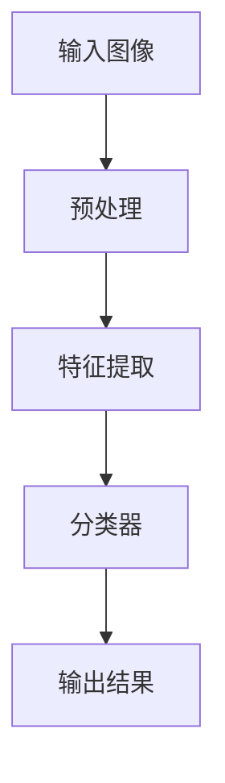

                 


### 1. 计算机视觉简介

#### 1.1 问题背景

计算机视觉是一门研究如何使计算机具备人类视觉能力的科学。它起源于20世纪60年代，随着计算机性能的提高和图像处理技术的发展而逐渐成熟。计算机视觉的定义可以概括为：通过计算机对图像或视频进行自动处理、分析、理解，以实现对现实世界的感知和理解。

计算机视觉的历史可以追溯到1970年代，当时的研究主要集中在图像识别和图像处理方面。然而，由于硬件和算法的限制，计算机视觉的应用范围相对有限。随着深度学习和大数据技术的发展，计算机视觉迎来了一个全新的时代。深度学习算法通过自动学习大量数据中的特征，使得计算机在图像识别、目标检测、人脸识别等方面取得了显著的突破。

#### 1.1.1 计算机视觉的定义与历史

计算机视觉（Computer Vision）是一门跨学科领域，涉及计算机科学、电子工程、心理学和认知科学等多个学科。其基本目标是使计算机能够像人类一样通过视觉感知和理解世界。

计算机视觉的发展历史可以划分为几个阶段：

1. **早期阶段（1960年代-1980年代）**：这个阶段的研究主要集中在图像处理和图像识别上，主要采用基于规则的方法。然而，由于缺乏有效的特征提取技术和庞大的计算资源，计算机视觉在实用性上受到了很大限制。

2. **发展阶段（1990年代）**：随着特征提取技术（如SIFT和SURF）的提出，计算机视觉开始逐渐应用于实际场景。同时，计算机硬件性能的提高和图像处理算法的优化，使得计算机视觉在特定领域（如医学图像分析）取得了重要成果。

3. **深度学习时代（2010年代至今）**：深度学习算法的崛起，尤其是卷积神经网络（CNN）的广泛应用，使得计算机视觉在图像分类、目标检测、人脸识别等方面取得了突破性的进展。

#### 1.1.2 计算机视觉的重要性

计算机视觉在现代社会的各个领域都有着广泛的应用，其重要性体现在以下几个方面：

1. **工业自动化**：计算机视觉技术可以实现对生产线的自动化监控和质量检测，提高生产效率和产品质量。

2. **医疗诊断**：计算机视觉技术可以辅助医生进行医学图像分析，提高诊断准确率，缩短诊断时间。

3. **自动驾驶**：计算机视觉是实现自动驾驶技术的重要技术手段，通过识别道路标志、车辆和行人等目标，保证车辆的安全行驶。

4. **安防监控**：计算机视觉技术可以实现对公共场所的实时监控，通过人脸识别等技术，提高安全防范能力。

5. **智能家居**：计算机视觉技术可以实现对家庭环境的智能监控和自动化管理，提高生活质量。

#### 1.1.3 计算机视觉的应用领域

计算机视觉的应用领域非常广泛，主要包括：

1. **工业自动化**：包括生产线的实时监控、缺陷检测、质量检测等。

2. **医疗诊断**：包括医学图像分析、病理图像识别、手术机器人等。

3. **自动驾驶**：包括车辆环境感知、目标检测、路径规划等。

4. **安防监控**：包括人脸识别、行为分析、异常检测等。

5. **虚拟现实**：包括三维物体识别、手势识别等。

6. **娱乐产业**：包括电影特效、游戏开发等。

### 1.2 问题描述

计算机视觉领域面临着一系列挑战和问题，主要包括：

#### 1.2.1 计算机视觉面临的挑战

1. **数据依赖性**：计算机视觉算法的性能很大程度上依赖于训练数据的质量和数量。在缺乏足够标注数据的情况下，算法的性能会受到影响。

2. **实时性要求**：许多应用场景要求计算机视觉算法具有实时性，例如自动驾驶和安防监控。然而，深度学习算法通常需要较长的计算时间，这使得实时性成为一大挑战。

3. **普适性问题**：计算机视觉算法通常在特定场景下表现良好，但在不同环境和光照条件下，其性能可能会显著下降。

4. **解释性不足**：深度学习算法通常被视为“黑盒子”，其内部决策过程难以解释。这在一些需要高可靠性和透明度的应用场景中成为了一个问题。

#### 1.2.2 计算机视觉解决的问题

计算机视觉技术解决了以下问题：

1. **图像识别**：通过自动识别图像中的物体、场景和特征，实现了对图像内容的理解和分析。

2. **目标检测**：通过在图像中检测和定位特定目标，实现了对场景中动态目标的监控和分析。

3. **人脸识别**：通过识别图像中的人脸，实现了对个体的身份验证和追踪。

4. **三维重建**：通过分析多张图像，实现了对场景的三维重建，为虚拟现实和增强现实提供了基础。

#### 1.2.3 计算机视觉的研究方向

计算机视觉领域的研究方向包括：

1. **算法优化**：通过改进算法，提高计算机视觉的性能和效率。

2. **数据增强**：通过数据增强技术，提高算法的泛化能力。

3. **实时处理**：研究如何提高计算机视觉算法的实时性，以满足实际应用的需求。

4. **跨域学习**：研究如何在不同领域之间共享知识和数据，以提高算法的普适性。

5. **可解释性**：研究如何提高深度学习算法的可解释性，使其在需要高可靠性和透明度的应用场景中得到更广泛的应用。

### 1.3 问题解决

为了解决计算机视觉领域面临的挑战和问题，研究人员和技术人员采取了以下策略：

#### 1.3.1 计算机视觉的基本流程

计算机视觉的基本流程可以概括为以下几个步骤：

1. **图像获取**：通过摄像头或其他传感器获取图像或视频数据。

2. **预处理**：对图像或视频数据进行预处理，包括去噪、增强、缩放等操作。

3. **特征提取**：从预处理后的图像或视频中提取关键特征，例如边缘、角点、纹理等。

4. **目标检测**：利用提取的特征，检测图像或视频中的目标对象。

5. **目标跟踪**：在视频序列中跟踪检测到的目标对象。

6. **结果输出**：将处理结果输出，例如标签、坐标、分类结果等。

#### 1.3.2 计算机视觉的关键技术

计算机视觉的关键技术包括：

1. **图像处理**：通过滤波、变换、增强等方法，对图像进行预处理。

2. **特征提取**：通过SIFT、SURF、HOG等方法，提取图像的关键特征。

3. **机器学习**：利用训练数据，训练分类器或回归模型，实现图像识别、目标检测等任务。

4. **深度学习**：利用神经网络，自动学习图像中的特征，实现更复杂的视觉任务。

5. **多模态学习**：结合不同类型的传感器数据，提高计算机视觉的准确性和鲁棒性。

#### 1.3.3 计算机视觉的发展趋势

计算机视觉的发展趋势包括：

1. **算法优化**：继续优化现有算法，提高计算效率和准确性。

2. **实时处理**：研究如何提高算法的实时性，以满足自动驾驶、实时监控等应用的需求。

3. **跨域学习**：研究如何在不同领域之间共享知识和数据，提高算法的普适性。

4. **可解释性**：提高深度学习算法的可解释性，使其在需要高可靠性和透明度的应用场景中得到更广泛的应用。

5. **硬件加速**：通过GPU、FPGA等硬件加速技术，提高计算机视觉的实时处理能力。

### 1.4 边界与外延

计算机视觉技术的发展和应用涉及多个领域，具有广泛的边界和外延：

#### 1.4.1 计算机视觉与其他领域的交叉

计算机视觉与其他领域的交叉包括：

1. **人工智能**：计算机视觉是人工智能的一个重要分支，与其他人工智能领域（如自然语言处理、强化学习等）相互促进。

2. **机器人技术**：计算机视觉技术可以用于机器人的视觉感知和导航，实现自主移动和任务执行。

3. **计算机图形学**：计算机视觉和计算机图形学共同研究图像的生成、处理和理解。

4. **神经科学**：计算机视觉技术的发展受到神经科学研究的启发，并试图模拟人脑的视觉处理机制。

#### 1.4.2 计算机视觉在工业中的应用边界

计算机视觉在工业中的应用边界包括：

1. **生产线自动化**：通过计算机视觉技术，实现生产线的自动化监控、质量检测和故障诊断。

2. **设备维护**：利用计算机视觉技术，实现设备的远程监控、故障预警和故障诊断。

3. **物流管理**：通过计算机视觉技术，实现仓库管理和物流配送的自动化。

4. **智能制造**：结合计算机视觉和其他先进技术，实现智能制造和工业4.0。

#### 1.4.3 计算机视觉的伦理问题

计算机视觉的伦理问题主要包括：

1. **隐私保护**：计算机视觉技术可以用于人脸识别和行踪追踪，需要妥善处理个人隐私问题。

2. **算法偏见**：算法训练数据的不公正可能导致算法的偏见，需要采取措施防止算法歧视。

3. **数据安全**：计算机视觉系统需要处理大量敏感数据，需要确保数据的安全和隐私。

4. **责任归属**：在自动驾驶等应用中，需要明确计算机视觉系统的责任归属，确保安全。

### 1.5 概念结构与核心要素组成

计算机视觉作为一个复杂的技术领域，其概念结构和核心要素组成如下：

#### 1.5.1 计算机视觉的基本概念

计算机视觉的基本概念包括：

1. **图像**：图像是计算机视觉的基本数据对象，可以是二维或三维的。

2. **特征**：特征是图像中具有代表性的信息，用于描述图像的内容。

3. **目标**：目标是指图像或视频中需要识别和检测的对象。

4. **场景**：场景是指图像或视频中包含的整个环境。

5. **感知**：感知是指计算机视觉系统对图像或视频内容的理解和分析。

#### 1.5.2 计算机视觉的技术栈

计算机视觉的技术栈包括：

1. **图像处理**：包括滤波、变换、增强等方法，用于预处理图像数据。

2. **机器学习**：包括监督学习、无监督学习和半监督学习等，用于训练分类器或回归模型。

3. **深度学习**：包括卷积神经网络（CNN）、循环神经网络（RNN）等，用于自动学习图像特征。

4. **目标检测**：包括区域提议、特征提取和分类等步骤，用于在图像中检测目标对象。

5. **目标跟踪**：包括目标检测、运动估计和预测等步骤，用于在视频序列中跟踪目标对象。

#### 1.5.3 计算机视觉的应用场景分类

计算机视觉的应用场景可以分为以下几类：

1. **静态图像分析**：包括图像识别、特征提取、图像分割等，常用于图像库管理和图像搜索引擎。

2. **动态图像分析**：包括目标检测、目标跟踪、行为分析等，常用于视频监控和自动驾驶。

3. **三维重建**：通过多张图像重建场景的三维模型，常用于虚拟现实和增强现实。

4. **医学图像分析**：包括医学图像的分割、识别和分类，常用于医学诊断和病理分析。

5. **工业自动化**：包括生产线的实时监控、缺陷检测和质量检测，常用于智能制造和工业4.0。

### 1.6 本章小结

本章介绍了计算机视觉的基本概念、问题背景、研究现状和发展趋势。通过对计算机视觉的基础知识和技术原理的讲解，读者可以初步了解计算机视觉的核心概念和技术栈，为后续章节的深入探讨打下基础。在接下来的章节中，我们将进一步分析计算机视觉的核心概念和联系，以及计算机视觉算法的原理和实现。希望读者能够通过本章的学习，对计算机视觉有一个全面而深入的理解。

### 第2章: 计算机视觉的核心概念与联系

在了解了计算机视觉的基本概念和问题背景后，我们将在本章深入探讨计算机视觉的核心概念，包括图像处理、机器学习和深度学习。通过对比分析这些概念，我们能够更好地理解它们在计算机视觉中的应用和联系。

#### 2.1 核心概念原理

计算机视觉的核心概念主要包括图像处理、机器学习和深度学习。每个概念都有其独特的原理和应用场景。

##### 2.1.1 图像处理

图像处理是计算机视觉的基础，它涉及对图像的预处理、增强、滤波、变换等操作。图像处理的主要目的是改善图像的质量，使其更适合后续的视觉分析。

1. **预处理**：包括去噪、对比度增强、灰度化等操作，以减少图像中的噪声，提高图像的视觉效果。
2. **增强**：通过调整图像的亮度和对比度，使重要特征更加突出。
3. **滤波**：利用不同的滤波器去除图像中的噪声，如高斯滤波、中值滤波等。
4. **变换**：包括傅里叶变换、小波变换等，用于分析图像的频率成分。

##### 2.1.2 机器学习

机器学习是计算机视觉中的一种重要技术，它通过学习大量的数据来发现数据中的模式和规律，从而实现对未知数据的预测和分类。

1. **监督学习**：有标注的数据集用于训练模型，然后模型对新的数据进行预测。常见的算法包括线性回归、决策树、支持向量机（SVM）等。
2. **无监督学习**：没有标注的数据集用于训练模型，模型发现数据中的结构或分布。常见的算法包括聚类、降维、异常检测等。
3. **半监督学习**：结合有标注和无标注的数据集进行训练，以提高模型的泛化能力。

##### 2.1.3 深度学习

深度学习是一种基于多层神经网络的机器学习技术，它在计算机视觉中取得了显著的成果。深度学习通过自动学习大量数据中的特征，实现了对复杂视觉任务的建模。

1. **卷积神经网络（CNN）**：CNN是一种专门用于处理图像数据的神经网络，通过卷积操作自动提取图像特征。
2. **循环神经网络（RNN）**：RNN适用于处理序列数据，如视频中的时间序列信息。
3. **生成对抗网络（GAN）**：GAN通过两个对抗网络（生成器和判别器）的竞争，实现生成高质量的数据。

#### 2.2 概念属性特征对比表格

为了更好地理解图像处理、机器学习和深度学习的区别和联系，我们可以通过一个对比表格来展示它们的属性特征。

| 概念 | 特征1 | 特征2 | 特征3 |
| --- | --- | --- | --- |
| 图像处理 | 空间域处理 | 低层次特征提取 | 实时性要求高 |
| 机器学习 | 数据驱动 | 模型学习 | 可解释性低 |
| 深度学习 | 神经网络 | 自动特征提取 | 计算资源要求高 |

#### 2.3 ER实体关系图架构

为了进一步理解计算机视觉中的核心概念和它们之间的关系，我们可以使用ER（实体关系）图来展示这些概念及其相互关系。

```mermaid
erDiagram
    Product ||--|{ Customer }| CustomerProduct
    Customer ||--|{ Order }| CustomerOrder
    Order ||--|{ Product }| ProductOrder
```

在这个ER图中，Product、Customer和Order是三个核心实体，它们之间的关系反映了计算机视觉中常见的应用场景，如订单处理和产品管理。

#### 2.4 本章小结

本章详细介绍了计算机视觉的核心概念，包括图像处理、机器学习和深度学习。通过对这些概念的对比分析和ER图展示，我们能够更清晰地理解它们在计算机视觉中的应用和联系。在下一章中，我们将进一步探讨计算机视觉算法的原理和实现，以深入理解计算机视觉技术的实际应用。

### 第3章: 计算机视觉算法原理讲解

在了解了计算机视觉的核心概念后，本章将深入探讨计算机视觉算法的原理，重点介绍传统计算机视觉算法和深度学习算法。通过详细讲解这些算法的基本流程、原理和实现，我们将帮助读者全面理解计算机视觉算法的工作机制。

#### 3.1 算法概述

计算机视觉算法可以分为传统算法和深度学习算法两大类。传统算法主要基于图像处理和机器学习技术，而深度学习算法则是近年来随着人工智能技术的发展而崭露头角的。

##### 3.1.1 传统计算机视觉算法

传统计算机视觉算法主要包括图像预处理、特征提取、目标检测和目标跟踪等步骤。

1. **图像预处理**：图像预处理是计算机视觉算法的第一步，它包括去噪、增强、滤波等操作。通过预处理，可以减少图像中的噪声，提高图像的质量，从而有助于后续的特征提取和目标检测。

2. **特征提取**：特征提取是计算机视觉算法的核心步骤，它从图像中提取具有代表性的特征，如边缘、角点、纹理等。特征提取的方法包括SIFT（尺度不变特征变换）、SURF（加速稳健特征）、HOG（方向梯度直方图）等。

3. **目标检测**：目标检测是在图像或视频中识别和定位特定目标的过程。传统目标检测算法包括基于滑窗的方法（如滑动窗口、滑动模板）和基于特征的方法（如HOG+SVM）。这些算法通过分析图像中的特征，确定目标的区域。

4. **目标跟踪**：目标跟踪是在视频序列中持续跟踪检测到的目标对象。目标跟踪算法通常基于目标检测的结果，通过跟踪目标的位置和运动轨迹，实现目标的长短期跟踪。

##### 3.1.2 深度学习在计算机视觉中的应用

深度学习在计算机视觉中的应用主要体现在卷积神经网络（CNN）、循环神经网络（RNN）和生成对抗网络（GAN）等模型上。

1. **卷积神经网络（CNN）**：CNN是一种专门用于图像处理和计算机视觉的神经网络模型。它通过卷积操作自动提取图像中的特征，具有强大的特征提取和分类能力。CNN被广泛应用于图像分类、目标检测和图像分割等领域。

2. **循环神经网络（RNN）**：RNN是一种适用于序列数据的神经网络模型，它可以处理时间序列信息，如视频中的连续帧。RNN在目标跟踪、视频分类和时间序列分析等领域具有广泛的应用。

3. **生成对抗网络（GAN）**：GAN是一种生成模型，由生成器和判别器两个神经网络组成。生成器尝试生成逼真的图像，而判别器则区分生成的图像和真实的图像。GAN在图像生成、风格迁移和数据增强等领域取得了显著成果。

##### 3.1.3 计算机视觉算法的分类

计算机视觉算法可以根据任务类型和实现方式分为以下几类：

1. **图像分类**：图像分类是将图像分类到预定义的类别中。常见的算法包括基于特征提取的分类算法（如SVM）和基于深度学习的分类算法（如CNN）。

2. **目标检测**：目标检测是在图像或视频中识别和定位特定目标。常见的算法包括基于滑窗的方法（如R-CNN、Fast R-CNN、Faster R-CNN）和基于特征的方法（如YOLO、SSD）。

3. **图像分割**：图像分割是将图像划分为不同的区域，每个区域表示不同的物体或场景。常见的算法包括基于区域的分割算法（如FCN、U-Net）和基于边界的分割算法（如Mask R-CNN）。

4. **目标跟踪**：目标跟踪是在视频序列中持续跟踪检测到的目标对象。常见的算法包括基于检测的跟踪算法（如KCF、TLD）和基于模型的跟踪算法（如Siamese网络）。

#### 3.2 算法流程图

为了更好地理解计算机视觉算法的基本流程，我们可以使用Mermaid图形化流程图来展示。



在这个流程图中，输入图像经过预处理后，提取特征并输入到分类器中进行分类，最终输出结果。

#### 3.3 算法原理详解

在本节中，我们将详细讲解计算机视觉算法的原理，包括图像预处理、特征提取、分类器和目标跟踪等步骤。

##### 3.3.1 图像预处理

图像预处理是计算机视觉算法的重要步骤，它包括去噪、增强、滤波和缩放等操作。

1. **去噪**：去噪是为了减少图像中的噪声，提高图像的质量。常见的方法包括高斯滤波、中值滤波和均值滤波等。高斯滤波通过计算图像每个像素点的邻域内像素的平均值来实现去噪，中值滤波通过取邻域内像素的中值来实现去噪。

   $$  
   S(i,j) = \frac{1}{k}\sum_{i'=i-r}^{i+r}\sum_{j'=j-r}^{j+r} I(i',j')  
   $$

   其中，$S(i,j)$表示去噪后的像素值，$I(i',j')$表示邻域内像素的值，$k$表示邻域的大小。

2. **增强**：增强是为了提高图像的视觉效果，使重要特征更加突出。常见的方法包括直方图均衡化和对比度增强等。直方图均衡化通过调整图像的亮度和对比度，使图像的灰度分布更加均匀。

   $$  
   L = 255 \\  
   M = 128 \\  
   S = \frac{L-1}{M-1} \cdot [I(i,j) - min(I)] + min(S)  
   $$

   其中，$L$表示增强后的最大灰度值，$M$表示增强后的中间灰度值，$I(i,j)$表示原始图像的像素值，$S(i,j)$表示增强后的像素值。

3. **滤波**：滤波是为了去除图像中的噪声，提高图像的质量。常见的方法包括高斯滤波、中值滤波和均值滤波等。高斯滤波通过计算图像每个像素点的邻域内像素的平均值来实现去噪，中值滤波通过取邻域内像素的中值来实现去噪。

   $$  
   S(i,j) = \frac{1}{k}\sum_{i'=i-r}^{i+r}\sum_{j'=j-r}^{j+r} I(i',j')  
   $$

   其中，$S(i,j)$表示滤波后的像素值，$I(i',j')$表示邻域内像素的值，$k$表示邻域的大小。

4. **缩放**：缩放是为了调整图像的大小，使其适合后续的处理。常见的方法包括放大和缩小等。放大是通过计算图像每个像素点的邻域内像素的平均值来实现，缩小是通过取邻域内像素的中值来实现。

   $$  
   O(i,j) = \frac{N-1}{M-1} \cdot [I(i,j) - max(I)] + max(O)  
   $$

   其中，$O(i,j)$表示缩放后的像素值，$I(i,j)$表示原始图像的像素值，$N$和$M$分别表示缩放后的图像宽度和高度。

##### 3.3.2 特征提取

特征提取是计算机视觉算法的核心步骤，它从图像中提取具有代表性的特征，如边缘、角点、纹理等。特征提取的方法包括SIFT（尺度不变特征变换）、SURF（加速稳健特征）、HOG（方向梯度直方图）等。

1. **SIFT算法**：SIFT算法是一种经典的特征提取算法，它通过在图像中检测和计算关键点，然后对关键点进行描述，从而实现特征提取。SIFT算法具有尺度不变性和旋转不变性，适用于各种场景。

   $$  
   det(H) = \sum_{i=1}^{n}\sum_{j=1}^{n} (H_{i,j} - \mu_{i} \mu_{j})  
   $$

   其中，$det(H)$表示特征矩阵的行列式，$H$表示特征矩阵，$\mu_{i}$和$\mu_{j}$分别表示特征矩阵的第$i$行和第$j$列的平均值。

2. **SURF算法**：SURF算法是一种基于SIFT算法的改进算法，它通过在图像中检测和计算关键点，然后对关键点进行描述，从而实现特征提取。SURF算法具有计算效率高、鲁棒性强等特点。

   $$  
   det(H) = \sum_{i=1}^{n}\sum_{j=1}^{n} (H_{i,j} - \mu_{i} \mu_{j})  
   $$

   其中，$det(H)$表示特征矩阵的行列式，$H$表示特征矩阵，$\mu_{i}$和$\mu_{j}$分别表示特征矩阵的第$i$行和第$j$列的平均值。

3. **HOG算法**：HOG算法是一种基于方向梯度的特征提取算法，它通过计算图像中每个像素点的方向梯度，然后生成方向梯度直方图，从而实现特征提取。HOG算法适用于行人检测和车辆检测等任务。

   $$  
   G(x,y) = \sum_{i=-r}^{r}\sum_{j=-r}^{r} \omega(i,j) \cdot \text{sign}(\nabla I(x+i,y+j))  
   $$

   其中，$G(x,y)$表示方向梯度直方图的值，$\omega(i,j)$表示权重，$\nabla I(x+i,y+j)$表示图像在$(x+i,y+j)$点的方向梯度。

##### 3.3.3 分类器

分类器是计算机视觉算法中的重要组件，它用于将提取的特征映射到预定义的类别中。常见的分类器包括支持向量机（SVM）、朴素贝叶斯分类器（NB）、决策树（DT）等。

1. **支持向量机（SVM）**：SVM是一种基于最大间隔的分类器，它通过寻找最优的超平面，将数据分类到不同的类别中。SVM的决策边界可以用以下公式表示：

   $$  
   \min_{\mathbf{w}, b} \frac{1}{2} ||\mathbf{w}||^2 + C \sum_{i=1}^{n} \xi_i  
   $$

   其中，$\mathbf{w}$表示权重向量，$b$表示偏置项，$C$表示惩罚参数，$\xi_i$表示错误分类项。

2. **朴素贝叶斯分类器（NB）**：NB是一种基于贝叶斯定理的分类器，它假设特征之间相互独立，通过计算特征的概率分布，预测新的数据的类别。NB的决策公式如下：

   $$  
   P(Y|X) = \frac{P(X|Y)P(Y)}{P(X)}  
   $$

   其中，$X$表示特征向量，$Y$表示类别，$P(X|Y)$表示在给定类别$Y$下特征$X$的概率，$P(Y)$表示类别$Y$的概率。

3. **决策树（DT）**：DT是一种基于特征的决策树分类器，它通过递归地将数据划分为不同的子集，直到满足停止条件。DT的决策过程可以用以下公式表示：

   $$  
   \text{分类}(\mathbf{x}) = \text{if}(\mathbf{x} \in \text{叶子节点}) \text{then} \text{类别}(\text{叶子节点}) \text{else} \text{决策树}(\mathbf{x})  
   $$

##### 3.3.4 目标跟踪

目标跟踪是在视频序列中持续跟踪检测到的目标对象。目标跟踪算法可以分为基于检测的跟踪算法和基于模型的跟踪算法。

1. **基于检测的跟踪算法**：基于检测的跟踪算法通过检测视频序列中的目标对象，然后对检测到的目标进行跟踪。常见的算法包括KCF、TLD等。KCF算法使用核函数计算目标对象的特征，然后通过粒子滤波进行跟踪。TLD算法使用在线学习的方法，自适应地更新跟踪模型。

2. **基于模型的跟踪算法**：基于模型的跟踪算法通过建立一个模型来描述目标对象，然后使用该模型进行跟踪。常见的算法包括Siamese网络等。Siamese网络通过训练两个共享权重的网络，对目标对象进行匹配和跟踪。

#### 3.4 算法举例说明

在本节中，我们将通过一个简单的图像预处理例子来说明计算机视觉算法的实现过程。

```python
import cv2
import numpy as np

# 读取图像
image = cv2.imread('image.jpg', cv2.IMREAD_GRAYSCALE)

# 图像增强
L = 255
M = 128
S = 32
S_min = 0
S_max = 255

S = (L - M) / (M - 1) * (image - S_min) + S_min

# 图像滤波
Gaussian_kernel = np.array([[1, 2, 1], [2, 4, 2], [1, 2, 1]]) / 4.0
Gaussian_filter = cv2.filter2D(image, -1, Gaussian_kernel)

# 图像缩放
scale_factor = 0.5
width = int(image.shape[1] * scale_factor)
height = int(image.shape[0] * scale_factor)
dim = (width, height)
resized = cv2.resize(image, dim, interpolation=cv2.INTER_AREA)

# 输出结果
cv2.imshow('Original', image)
cv2.imshow('Enhanced', S)
cv2.imshow('Filtered', Gaussian_filter)
cv2.imshow('Resized', resized)
cv2.waitKey(0)
cv2.destroyAllWindows()
```

在这个例子中，我们首先读取图像，然后进行图像增强、滤波和缩放等操作，最后将处理后的图像显示在窗口中。通过这个例子，我们可以直观地看到图像预处理的效果。

#### 3.5 本章小结

本章详细介绍了计算机视觉算法的基本原理和实现过程，包括图像预处理、特征提取、分类器和目标跟踪等步骤。通过这些算法的实现，我们能够更好地理解计算机视觉算法的工作机制和实际应用。在下一章中，我们将进一步探讨计算机视觉在工业中的应用，分析其在不同领域的具体应用案例。

---

**总结：计算机视觉在工业中的应用**

计算机视觉技术在工业领域的应用日益广泛，不仅提高了生产效率，还提升了产品的质量。以下是一些主要的应用场景和具体案例分析：

1. **生产线自动化**

   在生产线上，计算机视觉技术可以用于实时监控产品的制造过程，检测产品质量，及时发现缺陷。例如，汽车制造厂使用计算机视觉系统来检查车身表面的划痕、焊接点的质量等。

   - **案例**：某汽车制造厂引入了基于深度学习的计算机视觉系统，实现了对汽车车身的全自动检测。该系统通过训练卷积神经网络（CNN）模型，可以快速识别出车身上的微小缺陷，提高了检测的准确性和效率。

2. **自动化装配**

   在自动化装配过程中，计算机视觉技术可以用于识别和定位零部件，确保装配的准确性和一致性。例如，在电子制造领域，机器视觉系统可以识别电子元件的型号、位置，并将其准确地装配到电路板上。

   - **案例**：某电子制造企业使用了基于机器学习的计算机视觉系统，对电子元件进行识别和定位。该系统通过训练支持向量机（SVM）模型，能够快速准确地识别不同类型的电子元件，提高了装配的效率和质量。

3. **质量检测**

   计算机视觉技术可以用于自动化质量检测，识别产品中的缺陷。例如，在食品行业，机器视觉系统可以检测食品包装是否完好、食品是否新鲜等。

   - **案例**：某食品加工企业使用了基于深度学习的计算机视觉系统，对食品进行质量检测。该系统通过训练卷积神经网络（CNN）模型，可以识别出食品中的异物、破损等缺陷，提高了产品的质量。

4. **自动化仓库管理**

   计算机视觉技术可以用于自动化仓库管理，实现货物的分类、识别和自动分拣。例如，在物流中心，机器视觉系统可以识别货物的种类和位置，实现自动分拣和配送。

   - **案例**：某物流中心引入了基于深度学习的计算机视觉系统，对入库货物进行自动识别和分类。该系统通过训练卷积神经网络（CNN）模型，能够快速准确地识别出不同类型的货物，提高了仓库管理的效率。

5. **设备故障诊断**

   计算机视觉技术可以用于设备故障诊断，通过实时监测设备的工作状态，预测设备可能出现的问题。例如，在制造设备运行过程中，计算机视觉系统可以检测设备温度、振动等参数，及时发现潜在故障。

   - **案例**：某制造企业使用了基于机器学习的计算机视觉系统，对设备进行实时监测和故障诊断。该系统通过训练支持向量机（SVM）模型，能够分析设备的工作状态，预测设备可能出现的故障，提高了设备的运行稳定性和生产效率。

通过这些具体案例可以看出，计算机视觉技术在工业领域的应用已经取得了显著的成效。随着技术的不断进步，计算机视觉在工业中的应用将更加广泛，为工业生产带来更多的效益。

---

**最佳实践 tips**

在实际应用计算机视觉技术时，以下是一些最佳实践和注意事项：

1. **数据质量**：确保训练数据的质量和多样性，包括图像的清晰度、标签的准确性等。高质量的数据有助于提高算法的性能和泛化能力。

2. **硬件资源**：深度学习算法通常需要大量的计算资源，特别是在训练阶段。合理配置硬件资源，如使用GPU加速，可以提高算法的训练效率。

3. **实时性优化**：针对实时性要求较高的应用，如自动驾驶和工业自动化，需要优化算法的实时性。可以考虑使用轻量级的模型和高效的计算方法。

4. **模型解释性**：对于需要高解释性的应用，如医疗诊断和安防监控，需要选择具有较高解释性的模型或对深度学习模型进行可解释性增强。

5. **安全性**：确保数据安全和系统安全，特别是在处理敏感数据和涉及隐私的场景中。采取适当的安全措施，如数据加密、访问控制等。

6. **持续更新**：随着技术的不断进步和应用场景的变化，定期更新算法模型和应用系统，以保持其性能和适用性。

通过遵循这些最佳实践，可以更好地发挥计算机视觉技术在工业中的应用效果，提高生产效率和产品质量。

---

**本章小结**

在本章中，我们详细探讨了计算机视觉在工业中的应用，通过具体的案例展示了计算机视觉技术在生产线自动化、自动化装配、质量检测、自动化仓库管理和设备故障诊断等领域的应用效果。同时，我们提出了最佳实践和注意事项，以指导实际应用中的操作。

计算机视觉技术在工业领域的应用不仅提高了生产效率和产品质量，还推动了工业自动化和智能制造的发展。随着技术的不断进步，计算机视觉在工业中的应用前景将更加广阔，为工业生产带来更多的创新和变革。

**拓展阅读**

- 《计算机视觉：算法与应用》：详细介绍了计算机视觉的基本概念、算法和应用案例。
- 《深度学习：卷积神经网络》：介绍了卷积神经网络在计算机视觉中的应用和技术原理。
- 《机器学习实战》：提供了机器学习算法的实际应用案例和编程实现方法。

通过阅读这些资料，读者可以进一步深入了解计算机视觉技术的理论和实践，为实际应用提供更多的指导和支持。

