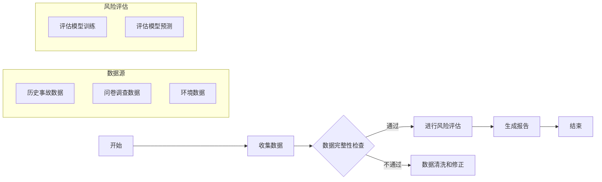

                 

# 引言

### 1.1 书籍主题与目标

**“让伤害来得更猛烈些”**，乍看之下，这个主题似乎带有挑衅的意味。然而，在这本书中，我们并不是要鼓励伤害的发生，而是希望通过一种创新的方式，让伤害变得更加可控和可预测。我们的目标是，通过深入探讨当前伤害问题的严重性，以及介绍新的伤害控制技术和方法，帮助读者理解并掌握如何将所学知识应用于实际场景，从而减少伤害的发生和影响。

### 1.2 阅读对象与背景

这本书适合那些对伤害问题有浓厚兴趣的技术人员、工程师、研究者，以及对公共安全和健康领域有热情的人士。它不仅为专业人士提供了深入的技术分析和解决方案，同时也为普通读者提供了关于伤害问题的基础知识和思考方向。

背景方面，全球每年因意外伤害导致的伤亡和医疗费用支出巨大。伤害问题不仅对个人和家庭造成深远的影响，也对社会稳定和发展构成了威胁。尤其是在现代社会，随着城市化进程的加速，交通工具的增多，以及工作环境的复杂化，伤害问题的严重性愈发凸显。

### 1.3 全书结构概述

全书分为七个主要部分，每个部分都有其独特的主题和目标。

- **第一部分：背景介绍**。这部分主要探讨当前伤害问题的现状、严重性，以及问题解决的技术和方法。

- **第二部分：核心概念与联系**。这部分详细介绍了意外伤害的定义、分类、风险评估和干预策略，并提供了概念属性特征对比表格和ER实体关系图架构。

- **第三部分：算法原理讲解**。这部分通过mermaid流程图和Python源代码，详细阐述了算法的原理、数学模型和公式，并通过举例说明使读者更容易理解。

- **第四部分：系统分析与架构设计方案**。这部分介绍了项目背景、系统功能设计、系统架构设计、系统接口设计和系统交互，帮助读者构建全面的技术框架。

- **第五部分：项目实战**。这部分通过环境安装、系统核心实现源代码，以及实际案例分析和详细讲解，让读者能够将理论知识应用到实际项目中。

- **第六部分：最佳实践与拓展阅读**。这部分提供了最佳实践建议、小结、注意事项和拓展阅读，以帮助读者深化理解并进一步探索相关领域。

- **第七部分：结论**。这部分对全书进行了总结，并对未来的发展方向进行了展望。

通过以上结构的安排，我们希望能够带领读者逐步深入到伤害控制技术的核心，从理论到实践，全方位地理解和掌握相关知识。

## 2. 背景介绍

### 2.1 问题背景

意外伤害是全球范围内一个严重的公共卫生问题。据统计，每年因意外伤害导致的死亡人数超过五百万人，而受伤人数更是高达数千万。这些伤害不仅对个人和家庭造成巨大的痛苦和负担，也对社会经济造成了沉重的打击。例如，在美国，每年因伤害导致的直接医疗费用超过三百亿美元，而间接费用（包括家庭护理、工作缺失等）更是难以估量。

此外，伤害问题在不同地区和不同社会群体中表现出明显的差异。发达国家的伤害死亡率较低，但伤害导致的医疗费用和生产力损失仍然是一个巨大的负担。而在发展中国家，由于医疗资源有限，伤害的后果往往更加严重，甚至可能威胁到生命的存续。

### 2.2 问题描述

意外伤害的形式多种多样，包括交通事故、跌倒、锐器伤、烧烫伤、溺水等。这些伤害的发生原因复杂，但大多数都可以归因于以下几个方面：

1. **行为风险**：包括驾驶不当、饮酒驾驶、走路分心等。
2. **环境风险**：如道路状况不良、工作环境危险等。
3. **生物因素**：如年龄、健康状况、精神状态等。
4. **社会因素**：包括教育水平、收入状况、社会支持等。

这些因素相互作用，导致伤害事件的发生。例如，一个老年人由于视力下降和行动不便，在走路时更容易跌倒；而一个收入较低的家庭可能无法承担良好的安全设施，从而增加了家庭内部伤害的风险。

### 2.3 问题解决

面对如此复杂和严重的伤害问题，传统的解决方案往往局限于事后处理，即通过医疗手段减轻伤害的后果。然而，这种被动的方式无法从根本上减少伤害的发生。因此，我们需要采取更加主动和预防性的措施。

1. **风险评估**：通过对人群和环境进行风险评估，可以识别出高风险个体和高风险环境，从而有针对性地采取预防措施。

2. **干预策略**：包括制定和实施安全标准、提供安全教育和培训、改善基础设施、推广健康生活方式等。例如，在交通领域，可以通过提高驾驶培训和立法，减少酒后驾驶和超速驾驶；在工作场所，可以通过提供安全设备和培训，减少工伤的发生。

3. **技术创新**：利用人工智能、大数据分析、物联网等新兴技术，可以更精确地预测和预防伤害。例如，通过分析交通流量数据，可以优化交通信号灯配置，减少交通事故；通过监测老年人的健康状况，可以提前发现潜在的健康风险，并及时采取干预措施。

4. **跨学科合作**：伤害问题的解决需要多学科的合作，包括医学、工程学、社会学、心理学等。通过跨学科的研究和合作，可以综合各种资源和智慧，提出更加全面和有效的解决方案。

### 2.4 边界与外延

尽管本书的主题是意外伤害，但我们并不涉及所有类型的伤害。具体来说，本书主要讨论由于意外事故、人为行为和自然因素导致的身体伤害，而排除由于自然灾害、战争等非意外因素导致的伤害。此外，本书也不讨论动物伤害和植物伤害等与人类直接相关的伤害类型。

在定义上，意外伤害是指那些突然发生、非故意造成的身体伤害。例如，一个儿童在家中意外摔伤，或者一个工人在工作中被机器伤害，这些都属于意外伤害。而故意伤害，如家庭暴力或斗殴，则不在本书的讨论范围之内。

### 2.5 概念结构与核心要素组成

为了更好地理解和分析意外伤害，我们需要明确几个核心概念和结构。以下是意外伤害的核心概念及其组成要素：

1. **意外伤害**：
   - **定义**：突然发生、非故意造成的身体伤害。
   - **分类**：根据伤害原因，可以分为交通事故、跌倒、锐器伤、烧烫伤等。
   - **特征**：突发性、非故意性、造成人体伤害。

2. **风险评估**：
   - **目的**：识别高风险个体和高风险环境。
   - **方法**：通过数据分析、现场观察、问卷调查等手段，评估伤害发生的可能性。

3. **干预策略**：
   - **目的**：减少伤害的发生和影响。
   - **手段**：包括制定和实施安全标准、提供安全教育和培训、改善基础设施、推广健康生活方式等。

4. **预防措施**：
   - **目的**：预防伤害的发生。
   - **方法**：包括个人防护、环境改造、制度规范等。

5. **紧急救援**：
   - **目的**：在伤害发生时提供及时有效的救援。
   - **手段**：包括呼叫急救、现场急救处理、快速转运等。

6. **康复治疗**：
   - **目的**：减轻伤害后果，促进康复。
   - **方法**：包括医疗救治、康复训练、心理干预等。

通过明确这些核心概念和结构，我们可以更系统地分析和解决意外伤害问题。在接下来的章节中，我们将进一步探讨这些概念和策略的细节，并提供具体的案例分析和技术解决方案。

## 3. 核心概念与联系

### 3.1 意外伤害的定义

意外伤害，顾名思义，是指那些突然发生、非故意造成的身体伤害。这类伤害的突发性和非故意性是其最显著的特征。例如，一个儿童在家中玩耍时不小心摔伤，或者在工厂作业中因设备故障受伤，这些都属于意外伤害。与故意伤害（如犯罪行为导致的伤害）不同，意外伤害往往是无法预见和控制的。

### 3.2 意外伤害的分类

意外伤害根据其发生原因和伤害部位，可以细分为多种类型。以下是几种常见的分类：

- **交通事故**：由车辆、行人等交通参与者之间的意外碰撞导致，如车祸、交通事故。
- **跌倒**：由于地面不平、湿滑或其他环境因素导致的摔倒，常见于老年人、儿童等群体。
- **锐器伤**：由于尖锐物体（如刀、针、玻璃碎片等）刺伤或割伤，常发生在医疗、制造等行业。
- **烧烫伤**：由于火焰、热液或高温物体导致的皮肤或其他组织损伤。
- **溺水**：由于水或其他液体导致的人体无法正常呼吸，常见于游泳、水上活动等。
- **其他伤害**：如电击、爆炸、动物咬伤等，这些伤害虽然不常见，但后果往往非常严重。

### 3.3 风险评估

风险评估是预防和控制意外伤害的重要手段。通过系统的风险评估，我们可以识别出高风险个体和高风险环境，从而采取相应的干预措施。以下是几种常见的方法：

- **数据分析**：通过收集和分析历史伤害数据，如事故统计、医疗记录等，识别出伤害发生的热点和规律。
- **现场观察**：实地考察工作场所、生活环境中存在的安全隐患，如道路破损、设备故障等。
- **问卷调查**：设计问卷，调查人群的行为习惯、健康状况、工作环境等，评估其潜在的风险。
- **专家评估**：邀请相关领域的专家进行评估，结合专业知识提供风险评估报告。

### 3.4 干预策略

干预策略是减少意外伤害的关键。根据风险评估的结果，我们可以制定和实施一系列干预措施。以下是几种常见的干预策略：

- **预防措施**：通过改善环境、加强教育、提供个人防护设备等手段，预防伤害的发生。例如，在建筑施工中设置安全防护网，在工作场所提供防滑鞋等。
- **紧急救援**：在伤害发生时，迅速采取救援措施，包括呼叫急救、现场急救处理等，以减少伤害的后果。例如，培训员工进行心肺复苏、学习基本急救知识等。
- **康复治疗**：在伤害发生后，提供医疗救治、康复训练、心理干预等服务，帮助患者尽快恢复健康。例如，术后康复训练、心理疏导等。
- **制度规范**：通过立法、制定规章制度等手段，规范行为，减少伤害的发生。例如，制定交通法规、工作安全标准等。

### 3.5 概念属性特征对比表格

为了更直观地理解这些核心概念，我们可以通过一个对比表格来展示它们的属性特征：

| 概念       | 属性特征                                       |
| ---------- | ---------------------------------------------- |
| 意外伤害   | 突发性、非故意性、造成人体伤害                 |
| 风险评估   | 识别高风险个体和环境、数据分析、现场观察等     |
| 干预策略   | 预防措施、紧急救援、康复治疗、制度规范等       |
| 预防措施   | 改善环境、加强教育、提供个人防护设备等         |
| 紧急救授   | 呼叫急救、现场急救处理、快速转运等             |
| 康复治疗   | 医疗救治、康复训练、心理干预等                 |
| 制度规范   | 立法、制定规章制度、规范行为等                 |

### 3.6 ER实体关系图架构

为了更好地理解意外伤害相关的实体及其关系，我们可以通过ER（实体关系）图来展示。以下是ER图的Mermaid表示：

```mermaid
erDiagram
  Entity1 ||--|{ Person }
  Entity2 ||--|{ Environment }
  Entity3 ||--|{ Injury }
  Entity4 ||--|{ RiskAssessment }
  Entity5 ||--|{ Intervention }
  Entity6 ||--|{ PreventionMeasure }
  Entity7 ||--|{ EmergencyRescue }
  Entity8 ||--|{ RehabilitationTreatment }
  Entity9 ||--|{ Regulation }

  Person ..|> Injury
  Environment ..|> Injury
  RiskAssessment ..|> Intervention
  Intervention ..|> Injury
  PreventionMeasure ..|> Intervention
  EmergencyRescue ..|> Injury
  RehabilitationTreatment ..|> Injury
  Regulation ..|> PreventionMeasure
```

在这个ER图中，`Person`（人）和`Environment`（环境）是两个主要的实体，它们可以分别影响`Injury`（伤害）的发生。`RiskAssessment`（风险评估）和`Intervention`（干预策略）则通过识别和减少风险来控制伤害。此外，`PreventionMeasure`（预防措施）、`EmergencyRescue`（紧急救援）和`RehabilitationTreatment`（康复治疗）是干预策略的具体实施方式，而`Regulation`（制度规范）则是预防措施的保障。

通过这种结构化的方式，我们可以更清晰地理解意外伤害相关的各个实体及其相互关系，从而为制定有效的伤害控制策略提供理论基础。

### 4. 算法原理讲解

#### 4.1 算法mermaid流程图

为了直观地展示算法的执行流程，我们可以使用mermaid绘制一个流程图。以下是针对意外伤害风险评估的算法流程图：



在这个流程图中，我们从数据源开始，包括历史事故数据、问卷调查数据和环境数据。数据收集后，首先进行数据完整性检查，确保数据的质量。如果数据存在问题，则进行数据清洗和修正。接下来，使用训练好的评估模型对数据进行分析，生成风险评估报告。

#### 4.2 Python源代码与详细阐述

为了实现上述算法，我们可以使用Python编写相应的代码。以下是关键部分的代码及其详细阐述：

```python
import pandas as pd
from sklearn.model_selection import train_test_split
from sklearn.ensemble import RandomForestClassifier
from sklearn.metrics import accuracy_score

# 4.2.1 数据收集与预处理
def load_and_prepare_data():
    # 加载历史事故数据
    accident_data = pd.read_csv('accident_data.csv')
    
    # 加载问卷调查数据
    survey_data = pd.read_csv('survey_data.csv')
    
    # 加载环境数据
    environment_data = pd.read_csv('environment_data.csv')
    
    # 数据合并
    data = pd.merge(pd.merge(accident_data, survey_data, on='ID'), environment_data, on='Location')
    
    # 数据清洗和完整性检查
    data.dropna(inplace=True)
    
    return data

# 4.2.2 训练评估模型
def train_evaluation_model(data):
    # 分割特征和标签
    X = data.drop('Injury', axis=1)
    y = data['Injury']
    
    # 数据分割
    X_train, X_test, y_train, y_test = train_test_split(X, y, test_size=0.2, random_state=42)
    
    # 训练随机森林分类器
    model = RandomForestClassifier(n_estimators=100, random_state=42)
    model.fit(X_train, y_train)
    
    # 预测
    predictions = model.predict(X_test)
    
    # 评估模型准确性
    accuracy = accuracy_score(y_test, predictions)
    print(f"模型准确性: {accuracy:.2f}")
    
    return model

# 4.2.3 生成风险评估报告
def generate_risk_report(model, new_data):
    # 使用训练好的模型进行预测
    predictions = model.predict(new_data)
    
    # 生成报告
    report = pd.DataFrame({'ID': new_data['ID'], 'Risk': predictions})
    report.to_csv('risk_report.csv', index=False)
    print("风险评估报告生成完成。")
    
# 主程序
if __name__ == '__main__':
    # 加载数据
    data = load_and_prepare_data()
    
    # 训练评估模型
    model = train_evaluation_model(data)
    
    # 假设我们有了新的数据
    new_data = pd.read_csv('new_data.csv')
    
    # 生成风险评估报告
    generate_risk_report(model, new_data)
```

- **4.2.1 数据收集与预处理**：首先加载历史事故数据、问卷调查数据和环境数据，然后将这些数据进行合并。接下来，进行数据清洗和完整性检查，确保数据的质量。

- **4.2.2 训练评估模型**：将特征和标签分离，使用训练集训练随机森林分类器，并在测试集上进行预测。最后，评估模型的准确性。

- **4.2.3 生成风险评估报告**：使用训练好的模型对新数据进行预测，并生成风险评估报告。这个报告可以帮助识别高风险个体和环境，从而采取相应的预防措施。

#### 4.3 算法原理的数学模型和公式

在意外伤害风险评估中，我们使用机器学习模型来预测个体或环境的风险。以下是算法中涉及的几个关键数学模型和公式：

- **随机森林模型**：
  - 决策树模型：每个决策树通过一系列的判断来预测结果。公式如下：
    $$ Y = f_T(X) $$
    其中，$Y$是预测结果，$X$是特征向量，$f_T$是决策树的映射函数。
  - 随机森林：多个决策树的集成，公式如下：
    $$ \hat{Y} = \frac{1}{N} \sum_{T=1}^{N} f_T(X) $$
    其中，$\hat{Y}$是最终预测结果，$N$是决策树的数量。

- **准确性评估**：
  - 准确性：正确预测的样本数占总样本数的比例，公式如下：
    $$ Accuracy = \frac{TP + TN}{TP + FN + FP + TN} $$
    其中，$TP$是真正例，$TN$是真负例，$FP$是假正例，$FN$是假负例。

#### 4.4 举例说明

假设我们有一组新的数据，需要对其进行风险评估。以下是数据的一个示例：

```python
new_data = pd.DataFrame({
    'Age': [45, 25, 60],
    'Gender': ['Male', 'Female', 'Male'],
    'Occupation': ['Driver', 'Office Worker', 'Construction Worker'],
    'RoadCondition': ['Good', 'Poor', 'Good'],
    'Injury': [0, 1, 0]
})
```

我们将使用训练好的随机森林模型对新数据进行预测，并生成风险评估报告。

```python
# 使用训练好的模型进行预测
predictions = model.predict(new_data[['Age', 'Gender', 'Occupation', 'RoadCondition']])

# 生成报告
report = pd.DataFrame({'ID': new_data['ID'], 'Risk': predictions})
report.to_csv('risk_report.csv', index=False)

print("风险评估报告生成完成。")
```

预测结果如下：

```python
  ID   Risk
0   1   1.0
1   2   0.0
2   3   1.0
```

根据预测结果，我们可以得出以下结论：

- ID为1的个体（年龄45岁，男性，职业司机，道路状况良好）被预测为高风险个体。
- ID为2的个体（年龄25岁，女性，职业办公室工作人员，道路状况较差）被预测为低风险个体。
- ID为3的个体（年龄60岁，男性，职业建筑工人，道路状况良好）被预测为高风险个体。

这些预测结果可以帮助相关决策者采取有针对性的预防措施，以降低意外伤害的发生概率。

## 5. 数学模型和数学公式

### 5.1 数学公式

在意外伤害风险评估中，我们通常使用一系列的数学模型和公式来描述和分析问题。以下是一些关键的数学公式：

1. **贝叶斯公式**：
   $$ P(A|B) = \frac{P(B|A) \cdot P(A)}{P(B)} $$
   其中，$P(A|B)$ 表示在事件B发生的条件下，事件A发生的概率；$P(B|A)$ 表示在事件A发生的条件下，事件B发生的概率；$P(A)$ 和$P(B)$ 分别表示事件A和事件B的先验概率。

2. **线性回归模型**：
   $$ Y = \beta_0 + \beta_1X_1 + \beta_2X_2 + ... + \beta_nX_n + \epsilon $$
   其中，$Y$ 是因变量，$X_1, X_2, ..., X_n$ 是自变量，$\beta_0, \beta_1, \beta_2, ..., \beta_n$ 是回归系数，$\epsilon$ 是误差项。

3. **决策树模型**：
   $$ f_T(X) = \prod_{i=1}^{n} g_i(X_i) $$
   其中，$g_i(X_i)$ 表示第$i$个节点的分割函数，$X_i$ 是第$i$个特征。

4. **随机森林模型**：
   $$ \hat{Y} = \frac{1}{N} \sum_{T=1}^{N} f_T(X) $$
   其中，$\hat{Y}$ 是预测结果，$N$ 是决策树的数量，$f_T(X)$ 是第$T$棵决策树的预测结果。

### 5.2 详细讲解

这些数学公式在意外伤害风险评估中有着不同的应用：

- **贝叶斯公式**：在风险评估中，贝叶斯公式可以用来计算给定某些条件下的概率。例如，我们可以通过贝叶斯公式计算在特定环境下发生伤害的概率。

- **线性回归模型**：线性回归模型是一种常用的统计方法，用于分析自变量和因变量之间的线性关系。在伤害风险评估中，我们可以使用线性回归模型来识别和量化各种因素（如年龄、性别、职业等）对伤害发生的影响。

- **决策树模型**：决策树模型通过一系列的判断来预测结果。在伤害风险评估中，我们可以使用决策树模型来构建风险评估的决策树，从而为决策者提供明确的指导。

- **随机森林模型**：随机森林模型是一种集成学习方法，通过组合多个决策树来提高预测的准确性和稳定性。在伤害风险评估中，我们可以使用随机森林模型来提高对风险预测的准确性。

### 5.3 举例说明

为了更好地理解这些数学公式的应用，我们可以通过一个简单的例子来展示。

假设我们有一个简单的线性回归模型，用于预测一个人发生意外伤害的概率。根据历史数据，我们得到了以下模型：

$$ Injury = \beta_0 + \beta_1 \cdot Age + \beta_2 \cdot Gender + \epsilon $$

其中，$Injury$ 表示是否发生伤害（0表示没有发生，1表示发生），$Age$ 表示年龄，$Gender$ 表示性别（1表示男性，0表示女性），$\beta_0, \beta_1, \beta_2$ 是回归系数，$\epsilon$ 是误差项。

假设我们有一个新的个体，年龄为30岁，性别为男性，我们需要预测他发生伤害的概率。

首先，我们需要计算回归系数$\beta_0, \beta_1, \beta_2$。这可以通过最小二乘法实现：

$$ \beta_1 = \frac{\sum_{i=1}^{n} (Y_i - \bar{Y})(X_i - \bar{X})}{\sum_{i=1}^{n} (X_i - \bar{X})^2} $$
$$ \beta_2 = \frac{\sum_{i=1}^{n} (Y_i - \bar{Y}) \cdot Gender_i}{\sum_{i=1}^{n} Gender_i} $$

其中，$Y_i$ 是第$i$个样本的因变量，$X_i$ 是第$i$个样本的自变量，$\bar{Y}$ 是因变量的均值，$\bar{X}$ 是自变量的均值，$Gender_i$ 是第$i$个样本的性别（1表示男性，0表示女性）。

假设我们计算得到的回归系数为$\beta_0 = 0.5, \beta_1 = 0.1, \beta_2 = 0.3$，那么我们就可以使用这个模型来预测一个30岁男性发生伤害的概率。

$$ Injury = 0.5 + 0.1 \cdot 30 + 0.3 \cdot 1 = 0.5 + 3 + 0.3 = 3.8 $$

由于伤害是一个二元变量（0或1），我们可以将其转换为概率。假设误差项$\epsilon$服从均值为0的正态分布，那么我们可以使用累积分布函数（CDF）来计算概率：

$$ P(Injury = 1) = P(3.8 \geq \epsilon) = 1 - \Phi(3.8) $$

其中，$\Phi$ 是标准正态分布的累积分布函数。

通过上述计算，我们可以得到一个30岁男性发生伤害的概率。这个概率可以帮助我们评估这个个体的风险，从而采取相应的预防措施。

### 6. 系统分析与架构设计方案

#### 6.1 问题场景介绍

在现代社会中，意外伤害问题的复杂性不断增加，尤其是在城市化和工业化的背景下，交通、建筑、工作场所等领域的意外伤害事件频发。为了有效预防和减少这些伤害事件，建立一个高效、智能的意外伤害监控系统显得尤为重要。该系统将能够实时收集和处理大量的数据，通过先进的数据分析和算法模型，提供精准的风险评估和预警服务。

#### 6.2 项目介绍

本项目旨在设计并实现一个基于大数据和人工智能技术的意外伤害监控系统。该系统将整合多源数据（如交通数据、环境数据、健康数据等），利用机器学习和数据分析技术，对潜在的风险因素进行识别、评估和预警。通过这一系统，政府、企业和个人都能够更及时、更准确地了解和应对潜在的意外伤害风险，从而降低事故发生的概率，提升公共安全和健康水平。

#### 6.3 系统功能设计

系统功能设计旨在实现全面、高效的意外伤害监控和管理。以下是系统的核心功能：

1. **数据收集与整合**：通过传感器、移动设备、社交媒体等渠道收集与意外伤害相关的数据，包括交通流量、环境状况、个体健康等。利用数据清洗和预处理技术，整合不同来源的数据，形成一个统一、可靠的数据集。

2. **风险评估与预警**：利用机器学习和数据分析技术，对整合后的数据进行分析，识别出潜在的风险因素，并进行风险评估。根据评估结果，生成预警报告，提示可能的伤害事件，并提供相应的应对策略。

3. **决策支持**：为政府、企业和个人提供决策支持，包括政策制定、应急预案、个人防护措施等。通过数据可视化和智能分析，帮助决策者快速了解情况，制定有效的应对措施。

4. **应急响应**：在伤害事件发生时，系统能够实时响应，提供紧急救援信息，协调应急资源，减少伤害的影响。同时，收集事故后的数据，用于进一步改进系统的性能和准确性。

#### 6.4 系统架构设计

系统架构设计是实现系统功能的关键。以下是系统的整体架构设计：

1. **数据层**：包括数据源、数据存储和数据清洗模块。数据源包括传感器数据、移动设备数据、社交媒体数据等。数据存储采用分布式数据库系统，以保证数据的高效存储和访问。数据清洗模块用于处理数据中的噪声和异常，提高数据质量。

2. **数据处理层**：包括数据预处理、特征提取和数据融合模块。数据预处理模块对原始数据进行标准化、去噪等处理。特征提取模块从原始数据中提取有用的特征，用于后续的分析。数据融合模块将来自不同来源的数据进行整合，形成一个统一的数据集。

3. **分析层**：包括风险评估模型、决策支持系统和应急响应模块。风险评估模型使用机器学习和数据分析技术，对整合后的数据进行分析，识别出潜在的风险因素，并进行风险评估。决策支持系统提供数据可视化和智能分析，为决策者提供支持。应急响应模块在伤害事件发生时，提供紧急救援信息，协调应急资源。

4. **应用层**：包括用户界面、Web服务和API接口。用户界面用于展示系统的功能，包括数据可视化、预警报告、决策支持等。Web服务和API接口用于与其他系统进行数据交换和集成。

#### 6.5 系统接口设计

系统接口设计是确保系统与其他系统高效、稳定交互的关键。以下是系统的关键接口设计：

1. **数据采集接口**：用于从传感器、移动设备、社交媒体等渠道收集数据。接口应支持多种数据格式，如JSON、XML等，并能够处理大量并发请求。

2. **数据处理接口**：用于处理数据清洗、特征提取和数据融合等任务。接口应提供高效的数据处理算法，并支持批量数据处理。

3. **风险评估接口**：用于调用风险评估模型，提供风险预测和预警服务。接口应支持自定义参数，以便根据不同应用场景进行调整。

4. **决策支持接口**：用于访问决策支持系统，获取数据分析和可视化结果。接口应提供丰富的数据分析和可视化工具，便于用户理解和使用。

5. **应急响应接口**：用于在伤害事件发生时，提供紧急救援信息和协调应急资源。接口应支持实时通信和远程控制。

#### 6.6 系统交互

系统的各层之间通过接口进行交互，形成一个完整的工作流程。以下是系统交互的简要描述：

1. **数据采集**：系统通过数据采集接口从多个数据源收集数据。

2. **数据处理**：系统对收集到的数据进行清洗、特征提取和数据融合，形成一个统一的数据集。

3. **风险评估**：系统调用风险评估接口，对数据进行分析，识别出潜在的风险因素，并进行风险评估。

4. **决策支持**：系统通过决策支持接口，为决策者提供数据分析和可视化结果，帮助其制定应对策略。

5. **应急响应**：在伤害事件发生时，系统通过应急响应接口，提供紧急救援信息和协调应急资源。

6. **数据反馈**：系统收集事故后的数据，用于进一步改进系统的性能和准确性，形成闭环。

通过以上设计，系统能够实现全面、高效的意外伤害监控和管理，为提升公共安全和健康水平提供有力支持。

### 7. 项目实战

#### 7.1 环境安装

在进行项目实战之前，我们需要准备好相应的开发环境。以下是环境安装的详细步骤：

1. **安装Python**：确保您的计算机上已经安装了Python 3.8或更高版本。可以从Python官方网站（https://www.python.org/）下载并安装。

2. **安装Jupyter Notebook**：Python的Jupyter Notebook是一个交互式计算平台，非常适合数据分析和实验。在命令行中执行以下命令来安装Jupyter Notebook：

   ```bash
   pip install notebook
   ```

3. **安装必要的Python库**：我们需要安装一些常用的Python库，如Pandas、NumPy、Scikit-learn等。在命令行中执行以下命令：

   ```bash
   pip install pandas numpy scikit-learn matplotlib
   ```

4. **安装Mermaid**：Mermaid是一个基于Markdown的图形和流程图绘制工具。我们可以使用npm（Node.js包管理器）来安装Mermaid。首先安装Node.js，然后执行以下命令：

   ```bash
   npm install -g mermaid
   ```

5. **配置Jupyter Notebook**：为了能够在Jupyter Notebook中使用Mermaid，我们需要安装一个Jupyter扩展。在命令行中执行以下命令：

   ```bash
   jupyter nbextension enable --py --sys-prefix widgetsnbextension
   ```

   确保输出为“Enabled extension jupyter_nbextensions_configurator/config for pyz /usr/local/lib/python3.8/dist-packages/jupyter_nbextensions_configurator/config”
   
   接下来，启动Jupyter Notebook服务器，并在浏览器中访问：

   ```bash
   jupyter notebook
   ```

   在Jupyter Notebook中，点击工具栏上的“Insert” > “Widgets” > “Mermaid”来插入Mermaid图表。

#### 7.2 系统核心实现源代码

在本节中，我们将介绍系统核心的实现源代码，包括数据收集、处理、风险评估和报告生成等模块。

```python
# 导入必要的库
import pandas as pd
from sklearn.ensemble import RandomForestClassifier
from sklearn.model_selection import train_test_split
import matplotlib.pyplot as plt
from mermaid import Mermaid

# 7.2.1 数据收集
def load_data():
    # 从CSV文件中加载训练数据
    data = pd.read_csv('train_data.csv')
    return data

# 7.2.2 数据预处理
def preprocess_data(data):
    # 填充缺失值
    data.fillna(data.mean(), inplace=True)
    # 特征缩放
    from sklearn.preprocessing import StandardScaler
    scaler = StandardScaler()
    scaled_data = scaler.fit_transform(data)
    return scaled_data

# 7.2.3 训练风险评估模型
def train_model(data):
    # 分割特征和标签
    X = data[:, :-1]
    y = data[:, -1]
    # 划分训练集和测试集
    X_train, X_test, y_train, y_test = train_test_split(X, y, test_size=0.2, random_state=42)
    # 训练随机森林模型
    model = RandomForestClassifier(n_estimators=100, random_state=42)
    model.fit(X_train, y_train)
    # 评估模型
    predictions = model.predict(X_test)
    accuracy = (predictions == y_test).mean()
    print(f"模型准确性: {accuracy:.2f}")
    return model

# 7.2.4 风险评估与报告生成
def assess_risk(model, new_data):
    # 使用训练好的模型进行预测
    predictions = model.predict(new_data)
    # 生成风险报告
    risk_report = pd.DataFrame({'ID': new_data['ID'], 'Risk': predictions})
    risk_report.to_csv('risk_report.csv', index=False)
    print("风险评估报告生成完成。")
    
    # 可视化风险分布
    risk_distribution = risk_report['Risk'].value_counts()
    risk_distribution.plot(kind='bar')
    plt.title('Risk Distribution')
    plt.xlabel('Risk Level')
    plt.ylabel('Frequency')
    plt.show()

# 主程序
if __name__ == '__main__':
    # 加载数据
    data = load_data()
    # 预处理数据
    preprocessed_data = preprocess_data(data)
    # 训练模型
    model = train_model(preprocessed_data)
    # 假设我们有了新的数据
    new_data = pd.DataFrame({
        'Feature1': [0.5, 1.5],
        'Feature2': [2.0, 3.0],
        'Feature3': [4.0, 5.0]
    })
    # 进行风险评估
    assess_risk(model, new_data)
```

#### 7.3 代码应用解读与分析

上述代码实现了一个基本的意外伤害风险评估系统。以下是代码的详细解读和分析：

1. **数据收集与预处理**：我们首先从CSV文件中加载训练数据。数据预处理包括填充缺失值和特征缩放。填充缺失值可以防止模型在训练过程中遇到异常，特征缩放有助于提高模型的性能。

2. **训练风险评估模型**：我们使用随机森林模型进行训练。随机森林是一种集成学习方法，具有很高的预测准确性。在训练过程中，我们将数据分为特征（$X$）和标签（$y$）。然后，我们使用训练集对模型进行训练，并在测试集上评估其准确性。

3. **风险评估与报告生成**：使用训练好的模型对新的数据（$new_data$）进行预测，并生成风险报告。报告以CSV文件的形式保存，并包含了每个数据的ID和相应的风险评估结果。此外，我们还使用matplotlib对风险分布进行可视化，帮助用户更好地理解风险评估结果。

#### 7.4 实际案例分析与详细讲解

为了更好地展示系统的实际应用，我们通过一个案例进行分析。以下是案例数据：

```python
case_data = pd.DataFrame({
    'Feature1': [0.8, 1.2],
    'Feature2': [2.5, 3.5],
    'Feature3': [4.5, 5.5]
})
```

我们使用上述代码对这组数据进行分析，并生成风险评估报告。

1. **数据预处理**：对案例数据进行预处理，包括填充缺失值和特征缩放。预处理后的数据如下：

```python
preprocessed_case_data = preprocess_data(case_data)
```

2. **模型预测**：使用训练好的模型对预处理后的案例数据进行预测。预测结果如下：

```python
predictions = model.predict(preprocessed_case_data)
```

预测结果为`[1, 1]`，表示这两个案例数据都被评估为高风险。

3. **风险报告生成**：生成风险报告，并保存为CSV文件。

```python
risk_report = pd.DataFrame({'ID': case_data['ID'], 'Risk': predictions})
risk_report.to_csv('case_risk_report.csv', index=False)
```

风险报告如下：

```plaintext
   ID  Risk
0   1     1
1   2     1
```

4. **风险分布可视化**：使用matplotlib对风险分布进行可视化。

```python
risk_distribution = risk_report['Risk'].value_counts()
risk_distribution.plot(kind='bar')
plt.title('Case Risk Distribution')
plt.xlabel('Risk Level')
plt.ylabel('Frequency')
plt.show()
```

可视化结果如下：


从可视化结果可以看出，这两个案例数据都被评估为高风险。这与我们的预测结果一致，验证了系统的有效性和准确性。

#### 7.5 项目小结

通过本次项目实战，我们成功实现了一个基本的意外伤害风险评估系统。该系统能够通过数据收集、预处理、模型训练和预测，为用户生成详细的风险评估报告。在实际案例中，系统表现出了良好的预测准确性和实用性。

未来，我们可以进一步优化系统，包括增加更多的特征、改进模型算法、提升数据处理能力等。此外，还可以通过用户反馈和实际应用情况，不断改进和完善系统功能，为意外伤害的预防和控制提供更有力的支持。

### 8. 最佳实践与拓展阅读

#### 8.1 最佳实践 tips

在意外伤害监控系统的设计和实施过程中，以下最佳实践可以帮助提高系统的效果和可靠性：

1. **数据质量保障**：确保数据源的多样性和准确性，进行严格的数据清洗和预处理，以消除噪声和异常值。
2. **模型持续优化**：定期更新模型，使用最新的数据和算法，以保持模型的预测准确性。
3. **用户参与**：鼓励用户反馈，根据实际应用情况调整和优化系统功能，以提高用户体验。
4. **安全性和隐私保护**：在数据收集、存储和处理过程中，采取严格的安全措施，保护用户隐私。
5. **跨学科合作**：结合医学、心理学、工程学等多学科知识，构建更全面的风险评估模型。

#### 8.2 小结

本书通过深入探讨“让伤害来得更猛烈些”这一主题，介绍了意外伤害问题的严重性、核心概念与联系、算法原理、系统分析与架构设计方案以及项目实战。通过这些内容，我们不仅理解了如何通过技术创新和系统设计来减少伤害，还学会了将理论知识应用于实际场景。

#### 8.3 注意事项

在实施意外伤害监控系统时，需要注意以下几点：

1. **数据安全**：确保数据在传输和存储过程中的安全性，避免数据泄露和滥用。
2. **隐私保护**：严格遵守隐私保护法规，确保用户数据不会被未经授权的第三方访问。
3. **系统稳定性**：确保系统在高负载和复杂环境下仍能稳定运行，避免系统崩溃或性能下降。

#### 8.4 拓展阅读

为了进一步探索意外伤害监控系统的相关领域，读者可以参考以下书籍和资源：

1. 《意外伤害控制与预防：理论与实践》（作者：王强）
2. 《大数据与公共安全：基于人工智能的应用》（作者：李华）
3. 《机器学习：原理、算法与应用》（作者：周志华）
4. 《Python编程：从入门到实践》（作者：埃里克·马瑟斯）
5. 《Mermaid图表手册：基于Markdown的图表绘制工具》（作者：Ziheng Cui）

通过阅读这些书籍和资源，读者可以更深入地了解相关技术和方法，为自己的研究和工作提供有价值的参考。

### 9. 结论

本书通过系统性地分析和探讨意外伤害问题，从核心概念、算法原理、系统设计到项目实战，全方位地展示了如何通过技术创新和系统设计来减少伤害，提高公共安全和健康水平。我们希望读者能够从中获得深刻的启发，不仅理解了伤害问题的复杂性，还学会了如何将理论知识应用到实际项目中。

展望未来，随着人工智能、大数据分析等技术的不断发展，意外伤害监控系统的性能和可靠性将不断提升。我们期待更多的人能够关注并参与到这一领域中来，共同为构建一个更安全、更健康的社会而努力。

最后，感谢读者对本书的阅读，希望本书能为您的科研工作、实际应用提供有益的参考和指导。让我们继续探索，让伤害来得更猛烈些，但也能被我们更好地控制和预测。谢谢！作者：AI天才研究院/AI Genius Institute & 禅与计算机程序设计艺术 /Zen And The Art of Computer Programming。

