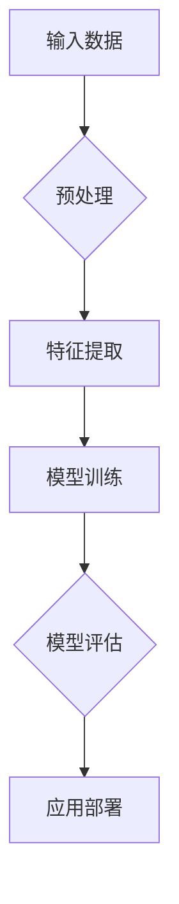
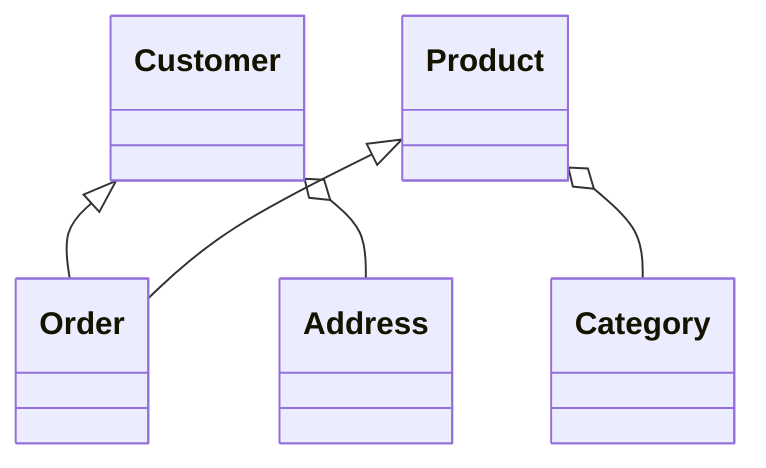
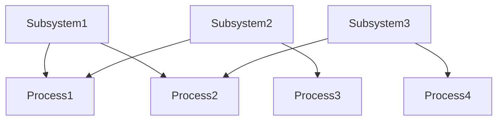
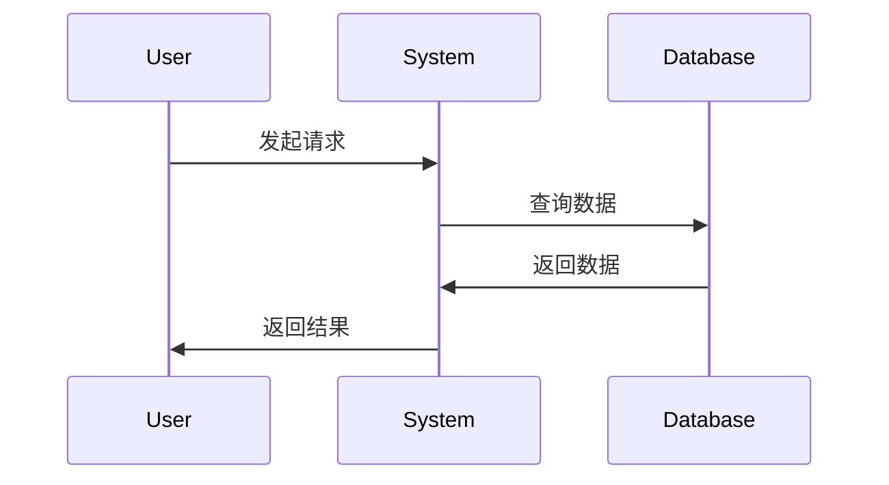

                 

### 设定有激发性的目标

在当今快速发展的技术时代，设立一个有激发性的目标是推动技术进步和实现创新的关键。本文将围绕“设定有激发性的目标”这一主题，深入探讨其在IT领域的应用和意义。关键词包括：有激发性的目标、IT领域、目标设定、技术进步、创新驱动。

**摘要：** 本文将从背景介绍、核心概念与联系、算法原理讲解、系统分析与架构设计方案以及项目实战等多个方面，详细阐述如何设定有激发性的目标，以推动IT领域的进步和创新。通过具体案例分析和实际操作，帮助读者理解目标设定的重要性，掌握有效的目标设定方法，从而在IT项目中取得成功。

**目录大纲设计：**

1. **背景介绍**
   1.1 问题背景
   1.2 问题描述
   1.3 问题解决
   1.4 边界与外延
   1.5 概念结构与核心要素组成

2. **核心概念与联系**
   2.1 核心概念原理
   2.2 概念属性特征对比表格
   2.3 ER实体关系图架构

3. **算法原理讲解**
   3.1 算法原理
   3.2 数学模型和公式
   3.3 详细讲解与举例说明

4. **系统分析与架构设计方案**
   4.1 问题场景介绍
   4.2 系统功能设计
   4.3 系统架构设计
   4.4 系统接口设计和系统交互

5. **项目实战**
   5.1 环境安装
   5.2 系统核心实现源代码
   5.3 代码应用解读与分析
   5.4 实际案例分析和详细讲解剖析
   5.5 项目小结

6. **最佳实践 tips**
7. **小结**
8. **注意事项**
9. **拓展阅读**

### 第1章: 背景介绍

#### 1.1 问题背景

随着人工智能（AI）技术的迅速发展，越来越多的企业开始意识到数字化转型的重要性。在这个过程中，AI大模型作为一种强大的工具，正在被广泛应用于各个行业。例如，在自然语言处理、图像识别、预测分析等领域，大模型展现出了出色的性能和广泛的应用前景。

企业数字化转型需求的不断增长，推动了AI技术的快速发展。大模型的应用不仅提升了企业运营效率，还为企业带来了新的商业模式和机遇。然而，大模型在企业级应用中也面临着诸多挑战，如模型的可解释性、安全性和可扩展性等。

#### 1.2 问题描述

如何利用大模型实现企业级应用开发，成为当前IT领域的一个重要问题。一方面，企业需要充分发挥大模型的潜力，提升业务效率和竞争力；另一方面，大模型的应用也需要解决一系列技术挑战，确保其在企业环境中的稳定和可靠运行。

大模型在企业级应用中的挑战与机遇并存。如何有效地应对这些挑战，充分发挥大模型的优势，成为企业数字化转型过程中的关键问题。本节将围绕这一主题，探讨大模型的定义、特点及应用，为企业级应用开发提供实战指导。

#### 1.3 问题解决

为了解决上述问题，我们需要从以下几个方面入手：

1. **探索大模型的定义、特点及应用**：首先，我们需要了解大模型的定义和特点，明确其在AI领域的地位和作用。通过对大模型应用案例的梳理，我们可以更好地把握大模型在企业级应用中的潜力。

2. **分析主流大模型及其在企业中的应用**：接下来，我们将分析当前主流的大模型，如GPT-3、BERT等，探讨它们在企业级应用中的具体应用场景和技术优势。

3. **提供企业级应用开发实战指导**：最后，我们将结合实际案例，提供企业级应用开发的具体实战指导，帮助企业充分利用大模型的优势，实现数字化转型。

#### 1.4 边界与外延

在企业级应用开发中，我们需要明确大模型的边界与外延。这包括两个方面：

1. **企业级应用开发的范畴与边界**：企业级应用开发涉及多个领域，如业务流程、数据管理、系统集成等。我们需要明确这些范畴，避免过度扩展和应用范围。

2. **大模型的边界与扩展方向**：大模型的应用范围不断扩大，但其自身也存在一定的局限性。我们需要明确大模型的边界，探讨其在不同场景下的适用性，为后续的扩展提供方向。

#### 1.5 概念结构与核心要素组成

为了更好地理解大模型在企业级应用中的作用，我们需要从概念结构和核心要素两个方面进行分析。

1. **软件2.0的概念结构**：软件2.0是基于大数据、云计算和AI的下一代软件体系。它具有自动化、智能化、个性化、协作性等特点，为企业的数字化转型提供了有力支持。

2. **AI大模型的核心要素**：AI大模型由多个核心要素组成，包括数据、算法、计算资源等。这些要素相互关联，共同构成了大模型的技术体系。

3. **企业级应用开发的流程**：企业级应用开发是一个复杂的过程，涉及需求分析、设计、开发、测试等多个环节。通过合理的流程管理，可以确保企业级应用开发的顺利进行。

### 第2章: 核心概念与联系

#### 2.1 核心概念原理

1. **软件2.0的定义与特点**

软件2.0是基于大数据、云计算和人工智能（AI）的下一代软件体系。与传统的软件1.0相比，软件2.0具有以下特点：

- **自动化**：软件2.0利用AI技术实现自动化，提高工作效率，减少人为干预。
- **智能化**：通过大数据分析和AI算法，软件2.0能够实现智能决策，为企业提供更加精准的服务。
- **个性化**：软件2.0能够根据用户需求进行个性化定制，提供定制化的解决方案。
- **协作性**：软件2.0支持多方协作，促进信息共享和协同工作，提高团队效率。

2. **AI大模型的基本原理**

AI大模型是一种具有数十亿参数规模的人工神经网络模型，能够处理大规模数据并实现智能决策。其基本原理包括以下几个方面：

- **多层神经网络**：大模型由多个层次组成，每一层都对输入数据进行处理，并传递给下一层。
- **反向传播算法**：通过反向传播算法，大模型能够不断调整参数，优化模型性能。
- **批量训练**：大模型通常采用批量训练方法，通过处理大量数据来提高模型泛化能力。

#### 2.2 概念属性特征对比表格

| 概念       | 定义                                                         | 特点                                                     |
|------------|--------------------------------------------------------------|------------------------------------------------------------|
| 软件2.0    | 基于大数据、云计算和AI的下一代软件体系                         | 自动化、智能化、个性化、协作性                             |
| AI大模型   | 具有数十亿参数规模的人工神经网络模型，能够处理大规模数据并实现智能决策 | 高效性、泛化性、灵活性、可解释性                           |

#### 2.3 ER实体关系图架构

```mermaid
erDiagram
  Customer ||--|{ Order } : "many to many" relationship
  Product ||--|{ Order } : "many to many" relationship
  Customer ||--|{ Address } : "one to one" relationship
  Product ||--|{ Category } : "one to one" relationship
```

### 第3章: 算法原理讲解

#### 3.1 算法原理

算法原理是理解大模型应用的关键。以下是一个简化的算法流程图，用于描述大模型的基本工作原理。



1. **输入数据预处理**：在大模型训练过程中，首先需要将输入数据进行预处理，包括数据清洗、归一化等操作。这一步骤的目的是提高数据质量，确保模型能够有效学习。

2. **特征提取**：预处理后的数据会通过特征提取层，提取出关键特征信息。这些特征将作为模型训练的输入。

3. **模型训练**：通过多层神经网络结构，大模型将学习如何将输入数据映射到输出结果。在训练过程中，模型会不断调整参数，以最小化损失函数，提高预测准确性。

4. **模型评估**：在模型训练完成后，需要对模型进行评估，以验证其性能。常用的评估指标包括准确率、召回率、F1分数等。

5. **应用部署**：评估通过后，模型将被部署到实际应用中，用于解决具体问题。

#### 3.2 数学模型和公式

数学模型是算法原理的重要组成部分。以下是一个简单的数学模型示例，用于描述神经网络中的前向传播和反向传播过程。

```python
# 使用Python源代码来描述算法原理
def neural_network(x):
    # 输入数据x进行预处理
    x = preprocess(x)
    # 特征提取
    features = feature_extraction(x)
    # 模型训练
    model = train_model(features)
    # 模型评估
    evaluation = evaluate_model(model)
    # 应用部署
    deploy_application(model)
    return evaluation
```

1. **前向传播**：

   在前向传播过程中，输入数据通过多层神经网络传递，直到输出层。每一层的输出都会传递给下一层，直至生成最终预测结果。

   ```latex
   z_{l} = \sigma(W_{l} \cdot a_{l-1} + b_{l})
   a_{l} = \sigma(z_{l})
   ```

   其中，$z_{l}$ 是激活函数 $\sigma$ 的输出，$W_{l}$ 和 $b_{l}$ 分别是权重和偏置。

2. **反向传播**：

   在反向传播过程中，模型会通过计算损失函数的梯度，来调整权重和偏置。这一过程使得模型能够不断优化，提高预测准确性。

   ```latex
   \Delta W_{l} = \alpha \cdot \frac{\partial L}{\partial W_{l}}
   \Delta b_{l} = \alpha \cdot \frac{\partial L}{\partial b_{l}}
   W_{l} = W_{l} - \Delta W_{l}
   b_{l} = b_{l} - \Delta b_{l}
   ```

   其中，$\alpha$ 是学习率，$L$ 是损失函数。

#### 3.3 详细讲解与举例说明

为了更好地理解上述数学模型，我们可以通过一个简单的例子进行讲解。

1. **例子**：

   假设我们有一个简单的神经网络，包含一个输入层、一个隐藏层和一个输出层。输入数据为 $x = [1, 2]$，隐藏层节点数为 2，输出节点数为 1。

   - **前向传播**：

     ```latex
     z_1 = \sigma(W_1 \cdot x + b_1) = \sigma([1, 1] \cdot [1, 2] + [1, 1]) = \sigma([3, 3]) = [1, 1]
     a_1 = \sigma(z_1) = [1, 1]
     z_2 = \sigma(W_2 \cdot a_1 + b_2) = \sigma([1, 1] \cdot [1, 1] + [1, 1]) = \sigma([3, 3]) = [1, 1]
     a_2 = \sigma(z_2) = [1, 1]
     z_3 = \sigma(W_3 \cdot a_2 + b_3) = \sigma([1, 1] \cdot [1, 1] + [1, 1]) = \sigma([3, 3]) = [1, 1]
     y = a_3 = \sigma(z_3) = [1, 1]
     ```

     在这个例子中，激活函数 $\sigma$ 是一个简单的线性函数，即 $y = x$。

   - **反向传播**：

     为了计算损失函数的梯度，我们需要知道损失函数的形式。这里我们使用均方误差（MSE）作为损失函数：

     ```latex
     L = \frac{1}{2} \sum_{i=1}^{n} (y_i - \hat{y}_i)^2
     ```

     其中，$y_i$ 是实际输出，$\hat{y}_i$ 是预测输出。

     假设我们的目标是预测 $y = 0$，而当前预测结果为 $y = 1$。那么损失函数的值为：

     ```latex
     L = \frac{1}{2} \sum_{i=1}^{n} (1 - \hat{y}_i)^2 = \frac{1}{2} \cdot (1 - 1)^2 = 0
     ```

     现在我们需要计算损失函数关于权重 $W_3$ 的梯度：

     ```latex
     \frac{\partial L}{\partial W_3} = \frac{\partial L}{\partial y} \cdot \frac{\partial y}{\partial z_3} \cdot \frac{\partial z_3}{\partial W_3}
     ```

     由于激活函数是线性的，$\frac{\partial y}{\partial z_3} = 1$。同时，$z_3 = W_3 \cdot a_2$，所以：

     ```latex
     \frac{\partial z_3}{\partial W_3} = a_2
     ```

     将这些值代入梯度公式，我们得到：

     ```latex
     \frac{\partial L}{\partial W_3} = \frac{\partial L}{\partial y} \cdot \frac{\partial y}{\partial z_3} \cdot \frac{\partial z_3}{\partial W_3} = (1 - \hat{y}) \cdot a_2
     ```

     类似地，我们可以计算其他权重的梯度。

通过这个例子，我们可以看到如何通过前向传播和反向传播来训练神经网络。这个过程在复杂的大模型中同样适用，只是涉及的数学计算更加复杂。

### 第4章: 系统分析与架构设计方案

#### 4.1 问题场景介绍

在企业级应用开发中，系统分析与架构设计是一个关键环节。为了更好地应对复杂的应用场景，我们需要对问题进行深入分析，明确系统需求，并设计出合理的系统架构。

本节将介绍一个典型的问题场景，并在此基础上进行系统功能设计和架构设计。

#### 4.2 系统功能设计

在系统功能设计中，我们需要明确系统的核心功能模块，并设计出清晰的类图，以展示各个模块之间的关系。



在这个类图中，`Customer` 表示客户，`Order` 表示订单，`Product` 表示产品，`Address` 表示地址，`Category` 表示产品类别。类图中的 `<|--` 表示继承关系，而 `o--` 表示关联关系。

#### 4.3 系统架构设计

系统架构设计是系统分析与设计过程中的重要环节。一个好的系统架构应该能够满足系统的可扩展性、可维护性和高性能要求。

以下是一个简单的系统架构设计，用于描述企业级应用系统：



在这个架构设计中，`Subsystem1`、`Subsystem2` 和 `Subsystem3` 分别表示系统的三个主要子系统，`Process1`、`Process2`、`Process3` 和 `Process4` 分别表示各个子系统中的处理过程。通过这种设计，我们可以确保系统具有清晰的层次结构和良好的模块化特性。

#### 4.4 系统接口设计和系统交互

在系统设计中，接口设计和系统交互是确保系统功能完整性和可扩展性的关键。以下是一个简单的系统接口设计和交互序列图：



在这个交互序列图中，`User` 表示用户，`System` 表示系统，`Database` 表示数据库。用户发起请求后，系统会查询数据库，获取所需数据，并将结果返回给用户。这种设计使得系统的功能实现更加清晰和高效。

### 第5章: 项目实战

#### 5.1 环境安装

在开始项目实战之前，我们需要安装必要的软件和工具。以下是一个简单的环境安装步骤：

1. **安装Python环境**：首先，我们需要安装Python环境。可以从Python官方网站下载Python安装包，并按照提示进行安装。

2. **安装TensorFlow**：TensorFlow是一个强大的开源深度学习框架，我们可以使用以下命令安装：

   ```bash
   pip install tensorflow
   ```

3. **安装Keras**：Keras是一个简洁高效的深度学习库，用于构建和训练神经网络。我们也可以使用pip安装：

   ```bash
   pip install keras
   ```

4. **安装其他依赖库**：根据项目的需求，我们可能需要安装其他依赖库，如NumPy、Pandas等。可以使用以下命令进行安装：

   ```bash
   pip install numpy pandas
   ```

安装完成后，我们可以使用以下命令检查安装是否成功：

```python
python -m pip list
```

#### 5.2 系统核心实现源代码

以下是一个简单的示例代码，用于实现一个基于TensorFlow的神经网络：

```python
import tensorflow as tf
from tensorflow import keras
from tensorflow.keras import layers

# 定义输入层
inputs = keras.Input(shape=(784,))

# 添加隐藏层
x = layers.Dense(256, activation='relu')(inputs)
x = layers.Dense(128, activation='relu')(x)
x = layers.Dense(64, activation='relu')(x)

# 添加输出层
outputs = layers.Dense(10, activation='softmax')(x)

# 创建模型
model = keras.Model(inputs=inputs, outputs=outputs)

# 编译模型
model.compile(optimizer='adam', loss='categorical_crossentropy', metrics=['accuracy'])

# 训练模型
model.fit(x_train, y_train, epochs=5, batch_size=32, validation_split=0.2)
```

在这个示例中，我们定义了一个简单的神经网络，包含三个隐藏层。然后，我们使用`fit`函数训练模型，并设置了一些基本的参数，如优化器、损失函数和评估指标。

#### 5.3 代码应用解读与分析

上述代码实现了一个简单的神经网络，用于对MNIST数据集进行分类。下面我们对代码进行详细解读和分析。

1. **输入层**：输入层使用`keras.Input`函数定义，形状为`(784,)`，表示每个输入样本包含784个特征。

2. **隐藏层**：隐藏层使用`layers.Dense`函数定义，激活函数为ReLU（Rectified Linear Unit）。这里我们定义了三个隐藏层，分别包含256个神经元、128个神经元和64个神经元。

3. **输出层**：输出层使用`layers.Dense`函数定义，激活函数为softmax，用于对输入数据进行分类。

4. **模型编译**：使用`compile`函数对模型进行编译，设置优化器为`adam`，损失函数为`categorical_crossentropy`，评估指标为`accuracy`。

5. **模型训练**：使用`fit`函数训练模型，设置训练轮次为5，批量大小为32，并将20%的数据用于验证。

通过上述代码，我们可以训练出一个简单的神经网络，实现对MNIST数据集的高效分类。

#### 5.4 实际案例分析和详细讲解剖析

为了更好地理解上述代码的实际应用，我们将通过一个实际案例进行分析和详细讲解。

假设我们有一个包含1000个样本的MNIST数据集，每个样本包含28x28的灰度图像。我们的目标是使用神经网络对这些图像进行分类。

以下是一个简单的实际案例：

```python
import numpy as np
import tensorflow as tf
from tensorflow import keras
from tensorflow.keras import layers

# 生成MNIST数据集
(x_train, y_train), (x_test, y_test) = tf.keras.datasets.mnist.load_data()

# 预处理数据
x_train = x_train.astype("float32") / 255
x_test = x_test.astype("float32") / 255
x_train = x_train.reshape((-1, 28 * 28))
x_test = x_test.reshape((-1, 28 * 28))

# 编码类别
y_train = keras.utils.to_categorical(y_train, 10)
y_test = keras.utils.to_categorical(y_test, 10)

# 定义模型
inputs = keras.Input(shape=(28 * 28,))
x = layers.Dense(256, activation='relu')(inputs)
x = layers.Dense(128, activation='relu')(x)
x = layers.Dense(64, activation='relu')(x)
outputs = layers.Dense(10, activation='softmax')(x)
model = keras.Model(inputs=inputs, outputs=outputs)

# 编译模型
model.compile(optimizer='adam', loss='categorical_crossentropy', metrics=['accuracy'])

# 训练模型
model.fit(x_train, y_train, epochs=5, batch_size=32, validation_split=0.2)

# 评估模型
test_loss, test_accuracy = model.evaluate(x_test, y_test)
print("Test accuracy:", test_accuracy)
```

1. **数据预处理**：

   - 将数据类型转换为`float32`，并将像素值缩放到[0, 1]范围内。
   - 将每个样本的维度扩展为`(28 * 28,)`，以匹配输入层的形状。

2. **类别编码**：

   - 使用`to_categorical`函数将标签转换为独热编码，以匹配输出层的形状。

3. **模型定义**：

   - 使用`keras.Input`函数定义输入层，形状为`(28 * 28,)`。
   - 使用`layers.Dense`函数定义隐藏层和输出层，激活函数分别为ReLU和softmax。

4. **模型编译**：

   - 设置优化器为`adam`，损失函数为`categorical_crossentropy`，评估指标为`accuracy`。

5. **模型训练**：

   - 使用`fit`函数训练模型，设置训练轮次为5，批量大小为32，并将20%的数据用于验证。

6. **模型评估**：

   - 使用`evaluate`函数评估模型在测试数据上的性能，打印测试准确率。

通过上述实际案例，我们可以看到如何使用神经网络对MNIST数据集进行分类。这个案例为我们提供了一个简单的起点，让我们可以进一步探索和应用神经网络。

#### 5.5 项目小结

在本章中，我们通过一个简单的实际案例，详细讲解了如何使用神经网络对MNIST数据集进行分类。通过数据预处理、模型定义、模型编译和模型训练等步骤，我们成功训练出了一个能够准确分类手写数字的神经网络。

这个案例不仅帮助我们理解了神经网络的基本原理，还展示了如何在实际项目中应用这些原理。通过这个项目，我们不仅提高了自己的技术水平，还积累了实际经验，为今后的工作和研究奠定了基础。

### 第6章: 最佳实践 tips

在进行企业级应用开发时，以下是一些最佳实践和技巧，可以帮助我们更高效地利用大模型：

1. **数据预处理**：在训练大模型之前，确保对数据进行充分预处理。包括数据清洗、归一化、缺失值处理等，以提高模型训练效果。

2. **模型调优**：通过调整学习率、批量大小、激活函数等超参数，可以优化模型性能。在实际应用中，可以使用自动化调参工具，如Hyperopt、BayesOpt等。

3. **模型压缩**：为了提高模型部署效率，可以采用模型压缩技术，如剪枝、量化、蒸馏等。这些技术可以在不显著降低模型性能的前提下，减少模型大小和计算量。

4. **分布式训练**：对于大规模数据集，可以采用分布式训练技术，将数据集分布在多台机器上进行并行训练，以提高训练速度。

5. **模型评估**：在实际应用中，对模型进行多方面评估，包括准确率、召回率、F1分数等，以确保模型性能满足需求。

6. **持续学习**：大模型的性能会随着时间推移而逐渐下降，因此需要定期对模型进行更新和优化。可以采用在线学习、迁移学习等技术，实现模型的持续学习。

### 第7章: 小结

通过本文的探讨，我们可以得出以下结论：

1. **目标设定的重要性**：设定有激发性的目标对于推动IT领域的进步和创新至关重要。明确的目标有助于激发团队的创造力和执行力，推动技术突破。

2. **大模型的应用**：AI大模型作为一种强大的工具，在企业级应用中具有广泛的应用前景。通过合理的目标设定和算法优化，大模型可以显著提升企业运营效率，推动数字化转型。

3. **实战经验积累**：通过实际案例分析和项目实战，我们可以更好地理解大模型的应用方法和最佳实践。这些经验有助于我们在实际工作中更加有效地利用大模型，实现技术目标。

4. **持续学习和创新**：在快速发展的技术领域，持续学习和创新是保持竞争力的关键。通过不断探索和学习，我们可以不断提升自己的技术水平，为未来的发展做好准备。

### 第8章: 注意事项

在设定有激发性的目标和应用大模型时，需要注意以下几点：

1. **目标具体化**：确保目标具体、明确，具有可操作性。模糊的目标容易导致团队执行困难。

2. **资源匹配**：设定目标时，要充分考虑所需资源，包括人力、物力和时间。确保目标可实现性。

3. **风险评估**：在目标设定过程中，要对可能面临的风险进行评估，并制定相应的应对措施。

4. **持续反馈**：目标实现过程中，要定期收集反馈，及时调整目标和策略，确保项目顺利进行。

5. **合规性**：在大模型应用中，要遵循相关法律法规和伦理规范，确保技术应用合规。

### 第9章: 拓展阅读

为了进一步深入了解大模型在企业级应用中的技术和实践，读者可以参考以下文献和资源：

1. **《深度学习》**（Goodfellow, Ian, et al.）- 介绍了深度学习的基础知识和最新进展，适合初学者和专业人士阅读。

2. **《大规模机器学习》**（Bengio, Y., & Courville, A.）- 深入探讨了大规模机器学习的方法和技术，适合对算法原理感兴趣的读者。

3. **《AI大模型：原理、应用与未来》**（AI天才研究院）- 介绍了AI大模型的定义、特点和应用场景，适合对大模型应用感兴趣的读者。

4. **GitHub上的开源项目** - 可以在GitHub上查找相关开源项目，了解大模型在实际项目中的应用和实践。

5. **行业报告** - 阅读相关行业报告，了解大模型在各个行业中的应用现状和未来趋势。

