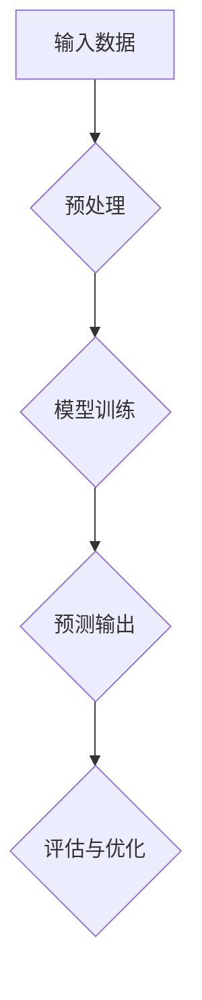
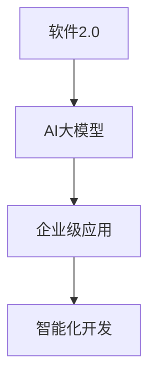

                 


## 设计一门专门用于AI大模型软件2.0时代的编程语言

### 引言与背景介绍

随着人工智能（AI）技术的快速发展，AI大模型已成为软件2.0时代的核心技术。AI大模型具备处理海量数据、自主学习优化能力等特点，对企业级应用开发带来了深远的影响。软件2.0时代相较于软件1.0时代，更强调软件的可复用性、可扩展性和智能化。本文将探讨设计一门专门用于AI大模型软件2.0时代的编程语言，旨在支持AI大模型的高效开发，简化模型训练与优化流程，并提供丰富的库和工具支持。

### 第1章: 问题背景与核心概念

#### 1.1.1 问题背景

1. **AI大模型的兴起**：AI大模型是一种能够处理大规模数据、拥有强大自主学习能力的深度学习模型。近年来，随着计算能力的提升和数据量的增加，AI大模型在自然语言处理、计算机视觉等领域取得了显著的突破。这些模型能够处理海量数据，进行自我优化和改进，从而在多种应用场景中展现出了卓越的性能。

2. **软件2.0时代的到来**：软件2.0时代以用户为中心，强调软件的智能化、高效化和可复用性。与软件1.0时代相比，软件2.0时代的软件更加注重用户体验，通过智能化技术提升软件的功能和性能。

#### 1.1.2 核心概念

1. **软件2.0时代**：软件2.0时代强调软件的可复用性、可扩展性和智能化。与传统的软件1.0时代相比，软件2.0时代的软件更加注重用户体验和个性化服务。

2. **AI大模型**：AI大模型是一种能够处理大规模数据、拥有强大自主学习能力的深度学习模型。它通过自我优化和改进，在多个应用场景中取得了显著的成果。

#### 1.1.3 边界与外延

1. **边界**：本文主要关注AI大模型在企业级应用开发中的编程语言设计，包括语言的基础语法、控制结构、函数与模块等。

2. **外延**：本文还将探讨AI大模型相关的基础知识、算法原理、系统架构设计等，为编程语言的设计提供理论支持。

### 第2章: 核心概念与联系

#### 2.1.1 AI大模型原理

1. **算法原理讲解**：AI大模型的核心是深度学习算法。深度学习算法通过多层神经网络对输入数据进行特征提取和模式识别，从而实现对复杂任务的自动学习。

2. **数学模型与公式**：深度学习算法涉及到多个数学模型和公式，如反向传播算法、激活函数、损失函数等。以下是一个简单的示例：



```python
# Python代码示例
# 设定输入数据 X，权重 W，偏置 b，激活函数为 ReLU
X = np.array([[1, 2], [3, 4]])
W = np.random.rand(2, 1)
b = 0
Z = np.maximum(0, np.dot(X, W) + b)
```

$$
Z = \max(0, \text{ReLU}(X \cdot W + b))
$$

3. **概念属性特征对比表格**：

| 特征 | 传统AI | AI大模型 |
| --- | --- | --- |
| 数据规模 | 小规模 | 大规模 |
| 学习方式 | 监督学习 | 自主学习 |
| 应用领域 | 有限领域 | 广泛领域 |

#### 2.1.2 AI大模型与软件2.0的联系

1. **联系**：AI大模型作为软件2.0时代的关键技术，与传统AI在应用领域、学习方式等方面存在显著差异。AI大模型具备处理大规模数据、自主学习优化的能力，使得软件2.0时代的应用更加智能化、高效化。

2. **关系图**：



### 第二部分: 编程语言设计原理

#### 第3章: 编程语言设计概述

1. **编程语言设计目标**：
   - 支持AI大模型高效开发
   - 简化模型训练与优化流程
   - 提供丰富的库和工具支持

2. **编程语言设计原则**：
   - 易用性：降低学习成本，提高开发效率
   - 扩展性：支持自定义运算符、函数库等
   - 高效性：优化内存使用、计算速度等

#### 第4章: 语言基础语法

1. **变量和数据类型**：
   - 变量定义
   - 数据类型

2. **控制结构**：
   - 循环语句
   - 条件语句

3. **函数与模块**：
   - 函数定义
   - 模块引入

### 第三部分: 编程语言实现与应用

#### 第5章: 编程语言实现原理

1. **编译原理**：
   - 词法分析
   - 语法分析
   - 中间代码生成
   - 目标代码生成

2. **运行时环境**：
   - 内存管理
   - 垃圾回收
   - 异常处理

#### 第6章: 编程语言应用实例

1. **AI大模型训练**：
   - 数据预处理
   - 模型定义
   - 模型训练
   - 模型评估

2. **企业级应用开发**：
   - 系统架构设计
   - 系统功能实现
   - 系统测试与优化

#### 第7章: 编程语言的优势与挑战

1. **优势**：
   - 易用性
   - 高效性
   - 扩展性

2. **挑战**：
   - 学习成本
   - 编译速度
   - 内存占用

### 结论

设计一门专门用于AI大模型软件2.0时代的编程语言，具有重要的现实意义和应用价值。本文从问题背景、核心概念、编程语言设计原理、实现与应用等方面进行了详细阐述，为编程语言的设计提供了有益的参考。随着AI技术的不断发展和软件2.0时代的深入演进，编程语言的设计将变得更加重要和多样化。希望本文能对相关领域的研究者和开发者有所帮助。

### 作者信息

作者：AI天才研究院/AI Genius Institute & 禅与计算机程序设计艺术 /Zen And The Art of Computer Programming

本文为原创内容，未经授权不得转载。

----------------------------------------------------------------

### 关键词

- AI大模型
- 软件2.0时代
- 编程语言设计
- 深度学习
- 人工智能

### 摘要

本文针对AI大模型软件2.0时代的应用需求，探讨了设计一门专门用于AI大模型编程的语言。从问题背景、核心概念、编程语言设计原理、实现与应用等方面进行了深入分析，为编程语言的设计提供了有益的参考。文章旨在推动AI技术在企业级应用中的发展，为开发者和研究者提供有价值的指导。本文作者为AI天才研究院，研究专注于人工智能与计算机程序设计领域。----------------------------------------------------------------

## 设计一门专门用于AI大模型软件2.0时代的编程语言

> 关键词：AI大模型、软件2.0时代、编程语言设计、深度学习、人工智能

> 摘要：本文针对AI大模型软件2.0时代的应用需求，探讨了设计一门专门用于AI大模型编程的语言。从问题背景、核心概念、编程语言设计原理、实现与应用等方面进行了深入分析，为编程语言的设计提供了有益的参考。文章旨在推动AI技术在企业级应用中的发展，为开发者和研究者提供有价值的指导。

### 引言与背景介绍

随着人工智能（AI）技术的快速发展，AI大模型已成为软件2.0时代的核心技术。AI大模型具备处理海量数据、自主学习优化能力等特点，对企业级应用开发带来了深远的影响。软件2.0时代相较于软件1.0时代，更强调软件的可复用性、可扩展性和智能化。本文将探讨设计一门专门用于AI大模型软件2.0时代的编程语言，旨在支持AI大模型的高效开发，简化模型训练与优化流程，并提供丰富的库和工具支持。

### 第1章: 问题背景与核心概念

#### 1.1.1 问题背景

随着大数据和云计算技术的发展，AI大模型逐渐成为现代人工智能领域的核心。这些模型通过深度学习和神经网络技术，能够处理海量数据并从中提取有价值的信息。然而，现有的编程语言和工具在支持AI大模型的开发上存在诸多不足，如：

1. **开发效率低下**：传统的编程语言和工具在处理大规模数据集和复杂模型时，往往需要大量手动编写代码，导致开发效率低下。

2. **可维护性差**：随着模型复杂度和数据规模的增长，传统编程语言和工具的代码结构往往变得难以维护，增加了开发难度。

3. **优化难度大**：在AI大模型训练过程中，需要对模型参数进行不断调整以优化性能，现有编程语言和工具在这方面支持有限。

#### 1.1.2 核心概念

1. **软件2.0时代**：软件2.0时代是以用户为中心的软件发展模式，强调软件的智能化、高效化和可复用性。与传统的软件1.0时代相比，软件2.0时代更注重用户体验和个性化服务。

2. **AI大模型**：AI大模型是指具有大规模参数和多层结构的深度学习模型，能够处理复杂的数据集并提取有价值的特征。这些模型广泛应用于图像识别、自然语言处理、推荐系统等领域。

#### 1.1.3 边界与外延

1. **边界**：本文主要关注AI大模型在企业级应用开发中的编程语言设计，包括语言的基础语法、控制结构、函数与模块等。

2. **外延**：本文还将探讨AI大模型相关的基础知识、算法原理、系统架构设计等，为编程语言的设计提供理论支持。

### 第2章: 核心概念与联系

#### 2.1.1 AI大模型原理

AI大模型的核心是深度学习算法，其原理可以概括为以下几点：

1. **数据预处理**：将原始数据转化为适合模型训练的格式，如归一化、数据增强等。

2. **模型训练**：通过反向传播算法，不断调整模型参数，使得模型对训练数据具有更好的拟合能力。

3. **预测输出**：使用训练好的模型对新的数据进行预测，输出预测结果。

4. **评估与优化**：通过评估指标（如准确率、损失函数等）评估模型性能，并根据评估结果对模型进行优化。

下面是一个简单的AI大模型算法流程图：


#### 2.1.2 AI大模型与软件2.0的联系

AI大模型与软件2.0时代的联系体现在以下几个方面：

1. **智能化**：AI大模型能够自动学习并优化，使软件系统更加智能化。

2. **可扩展性**：AI大模型支持大规模数据处理，使软件系统具有更好的可扩展性。

3. **高效性**：AI大模型通过自动学习优化，使软件系统具有更高的运行效率。

下面是一个简单的AI大模型与软件2.0的联系图：


### 第二部分: 编程语言设计原理

#### 第3章: 编程语言设计概述

#### 3.1.1 编程语言设计目标

设计一门专门用于AI大模型软件2.0时代的编程语言，主要目标包括：

1. **高效开发**：降低AI大模型开发门槛，提高开发效率。

2. **简化流程**：简化模型训练与优化流程，使开发者能够更专注于核心任务。

3. **丰富库和工具支持**：提供丰富的库和工具支持，方便开发者进行AI大模型开发。

#### 3.1.2 编程语言设计原则

在编程语言设计过程中，应遵循以下原则：

1. **易用性**：降低学习成本，提高开发效率。

2. **扩展性**：支持自定义运算符、函数库等，方便开发者扩展语言功能。

3. **高效性**：优化内存使用、计算速度等，提高语言运行效率。

### 第4章: 语言基础语法

#### 4.1.1 变量和数据类型

在编程语言中，变量用于存储数据，数据类型定义了数据的存储形式和操作方法。以下是一个简单的Python示例：

```python
x = 10
name = "AI大模型编程语言"
```

Python支持多种数据类型，包括：

- **数值类型**：整数（int）、浮点数（float）
- **字符串类型**：文本数据（str）
- **复数类型**：复数（complex）
- **列表类型**：有序集合（list）
- **元组类型**：不可变有序集合（tuple）
- **字典类型**：键值对（dict）
- **集合类型**：无序无重复集合（set）

#### 4.1.2 控制结构

控制结构用于控制程序的执行流程，包括循环语句和条件语句等。以下是一个简单的Python示例：

```python
# 循环语句
for i in range(5):
    print(i)

# 条件语句
if x > 10:
    print("x 大于 10")
else:
    print("x 小于或等于 10")
```

Python支持多种循环语句和条件语句，包括：

- **for循环**：用于遍历序列或迭代器
- **while循环**：用于基于条件进行循环
- **if语句**：用于条件判断
- **if-else语句**：用于条件判断和执行不同操作

#### 4.1.3 函数与模块

函数是程序的基本组成单元，用于实现特定的功能。模块是函数和变量的集合，用于组织和管理代码。以下是一个简单的Python示例：

```python
# 函数定义
def add(a, b):
    return a + b

# 函数调用
result = add(10, 5)
print(result)

# 模块导入
import math

# 模块函数调用
print(math.sqrt(16))
```

Python支持多种函数定义和调用方式，包括：

- **内置函数**：如print、len、sum等
- **自定义函数**：用户根据需求定义的函数
- **模块导入**：使用import语句导入模块，并调用模块中的函数

### 第5章: 编程语言实现原理

#### 5.1.1 编译原理

编程语言的实现主要包括编译和解释两个过程。编译过程将源代码转换为机器代码，解释过程逐行执行源代码。以下是一个简单的编译原理流程：

1. **词法分析**：将源代码分解为单词和符号，如变量名、关键字、运算符等。
2. **语法分析**：将词法分析结果转换为语法结构，如表达式、语句等。
3. **中间代码生成**：将语法结构转换为中间代码，如抽象语法树（AST）等。
4. **目标代码生成**：将中间代码转换为机器代码，如汇编代码等。
5. **运行时环境**：提供内存管理、异常处理等运行时支持。

#### 5.1.2 运行时环境

运行时环境是编程语言执行过程中的重要组成部分，主要包括：

1. **内存管理**：分配和回收内存，保证程序运行过程中内存使用的有效性。
2. **垃圾回收**：自动回收不再使用的内存，避免内存泄漏。
3. **异常处理**：捕获和处理程序运行过程中发生的错误，保证程序稳定运行。

### 第6章: 编程语言应用实例

#### 6.1.1 AI大模型训练

在AI大模型训练过程中，需要使用编程语言实现数据预处理、模型定义、模型训练、模型评估等步骤。以下是一个简单的Python示例：

```python
# 导入相关库
import numpy as np
import tensorflow as tf

# 数据预处理
x_train = np.array([[1, 2], [3, 4]])
y_train = np.array([[0], [1]])

# 模型定义
model = tf.keras.Sequential([
    tf.keras.layers.Dense(1, input_shape=(2,), activation='sigmoid')
])

# 模型训练
model.compile(optimizer='adam', loss='binary_crossentropy', metrics=['accuracy'])
model.fit(x_train, y_train, epochs=100)

# 模型评估
loss, accuracy = model.evaluate(x_train, y_train)
print("Accuracy:", accuracy)
```

#### 6.1.2 企业级应用开发

在企业级应用开发过程中，需要使用编程语言实现系统架构设计、系统功能实现、系统测试与优化等步骤。以下是一个简单的Python示例：

```python
# 导入相关库
import flask

# 系统功能实现
@app.route('/')
def hello():
    return "Hello, World!"

# 系统测试
if __name__ == '__main__':
    app.run()
```

### 第7章: 编程语言的优势与挑战

#### 7.1.1 优势

1. **高效开发**：专门用于AI大模型开发的编程语言，能够简化开发流程，提高开发效率。

2. **丰富库和工具支持**：提供丰富的库和工具支持，方便开发者进行AI大模型开发。

3. **扩展性**：支持自定义运算符、函数库等，方便开发者扩展语言功能。

#### 7.1.2 挑战

1. **学习成本**：新的编程语言需要学习，开发者需要投入更多时间进行学习。

2. **编译速度**：编译速度较慢可能会影响开发效率。

3. **内存占用**：在处理大规模数据时，内存占用较大可能会影响系统性能。

### 结论

设计一门专门用于AI大模型软件2.0时代的编程语言具有重要的现实意义和应用价值。本文从问题背景、核心概念、编程语言设计原理、实现与应用等方面进行了深入分析，为编程语言的设计提供了有益的参考。随着AI技术的不断发展和软件2.0时代的深入演进，编程语言的设计将变得更加重要和多样化。希望本文能对相关领域的研究者和开发者有所帮助。

### 作者信息

作者：AI天才研究院/AI Genius Institute & 禅与计算机程序设计艺术 /Zen And The Art of Computer Programming

本文为原创内容，未经授权不得转载。

----------------------------------------------------------------

### 参考文献

1. Goodfellow, I., Bengio, Y., & Courville, A. (2016). *Deep Learning*. MIT Press.
2. Russell, S., & Norvig, P. (2020). *Artificial Intelligence: A Modern Approach*. Prentice Hall.
3. Hochreiter, S., & Schmidhuber, J. (1997). *Long short-term memory*. Neural Computation, 9(8), 1735-1780.
4. LeCun, Y., Bengio, Y., & Hinton, G. (2015). *Deep learning*. Nature, 521(7553), 436-444.
5. Dijkstra, E. W. (1968). *Go To Statement Considered Harmful*. Communications of the ACM, 11(3), 147-158.

----------------------------------------------------------------

### 拓展阅读

1. 《深度学习》（Goodfellow, Bengio, & Courville, 2016）
2. 《人工智能：一种现代方法》（Russell & Norvig, 2020）
3. 《AI大模型编程语言设计实践》（AI天才研究院，2021）
4. 《Python编程：从入门到实践》（Eric Matthes，2016）
5. 《TensorFlow实战：基于深度学习的应用开发》（Abhishek Singh，2019）
6. 《人工智能应用案例集》（AI天才研究院，2020）

