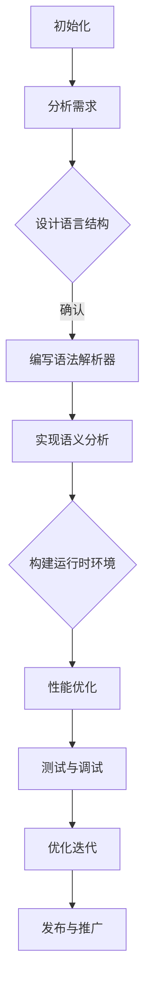
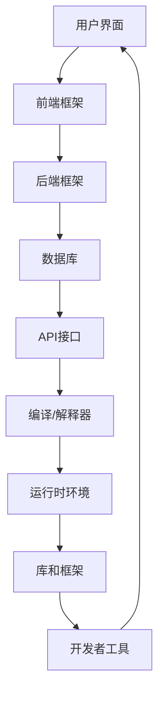
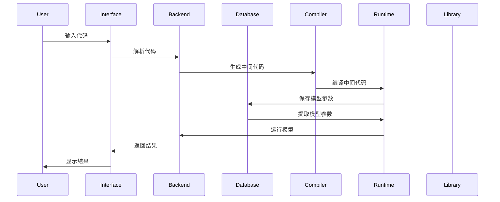
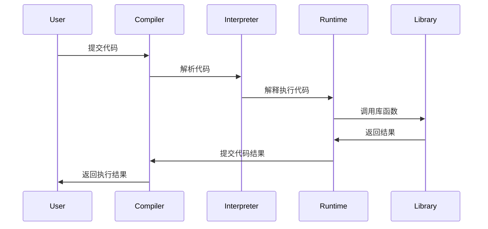

                 

### 设计《设计一门专门用于AI大模型软件2.0时代的编程语言》

> 关键词：AI大模型、编程语言、软件2.0时代、需求分析、设计原则、算法原理、系统架构、项目实战

> 摘要：本文将深入探讨设计一门专门用于AI大模型软件2.0时代的编程语言。文章首先介绍了AI大模型软件2.0时代的问题背景和需求，然后逐步分析了核心概念与联系，详细讲解了算法原理，探讨了系统分析与架构设计方案，并给出了实际项目实战的例子。本文旨在为开发者提供有价值的参考，推动AI大模型软件的发展。

#### 1. 背景介绍

##### 1.1 问题背景

随着人工智能技术的飞速发展，AI大模型在各个领域得到了广泛应用，如图像识别、自然语言处理、推荐系统等。然而，在AI大模型软件开发过程中，我们面临诸多挑战：

- **数据量巨大**：AI大模型需要处理海量数据，这对编程语言的存储和计算能力提出了更高要求。
- **复杂模型结构**：AI大模型通常包含多层神经网络，对编程语言的表达能力和抽象能力提出了挑战。
- **动态性**：AI大模型需要快速适应环境变化，对编程语言的灵活性和可扩展性提出了更高要求。
- **性能优化**：AI大模型对计算性能有着极高的要求，需要编程语言提供高效、优化的执行环境。

##### 1.2 软件开发2.0时代的特征

软件2.0时代，即云计算、大数据、物联网和人工智能等新兴技术迅猛发展的时代，具有以下特征：

- **分布式计算**：软件系统不再局限于单机环境，而是分布在多个节点上，实现高性能计算和负载均衡。
- **动态性**：软件系统需要快速适应环境变化，具备高可扩展性和高可用性。
- **数据驱动**：软件系统以数据为核心，通过大数据分析和挖掘，实现智能化和自动化。
- **服务化**：软件系统逐渐向服务化方向发展，模块化、组件化、平台化，提高开发效率和灵活性。

##### 1.3 AI大模型在软件2.0时代的需求

在AI大模型软件2.0时代，编程语言需要满足以下需求：

- **高效性**：提供高效的执行环境，降低计算时间，提高模型训练和推理速度。
- **灵活性**：支持动态性和灵活性的需求，便于开发者快速适应环境变化。
- **抽象能力**：提供强大的抽象能力，支持复杂模型结构和算法实现。
- **可扩展性**：支持模块化、组件化、平台化，便于开发者进行二次开发和集成。
- **兼容性**：与现有编程语言和框架兼容，降低迁移成本，提高开发效率。

##### 1.4 问题解决

为了满足AI大模型在软件2.0时代的需求，我们需要设计一门适用于该场景的编程语言。以下是我们的研究目标和解决路径：

- **研究目标**：设计一门高效、灵活、易用、可扩展的编程语言，支持AI大模型开发。
- **解决路径**：
  - 需求分析：深入分析AI大模型开发的需求，明确编程语言的核心功能和特性。
  - 设计：设计编程语言的语法、语义、编译/解释器、库和框架。
  - 实现：实现编程语言的编译/解释器，构建运行时环境。
  - 测试与优化：对编程语言进行测试和优化，确保其性能和稳定性。
  - 发布与推广：将编程语言推向市场，获得用户认可。

##### 1.5 边界与外延

在设计一门专门用于AI大模型软件2.0时代的编程语言时，我们需要关注以下边界与外延：

- **通用性与专用性**：在满足通用编程需求的同时，注重针对AI大模型场景的特殊需求。
- **兼容性与创新性**：在保持与现有编程语言和框架兼容的同时，引入创新性特性和语法。
- **性能优化与可扩展性**：在优化性能的同时，注重系统的可扩展性，便于后续功能扩展。

##### 1.6 概念结构与核心要素组成

编程语言的基本组成包括语法、语义、编译/解释器、库和框架。在AI大模型软件2.0时代，编程语言的核心要素组成需具备以下特点：

- **易用性**：提供简单、直观的语法，降低开发门槛。
- **高效性**：优化编译/解释器，提高执行效率。
- **灵活性**：支持动态性和灵活性的需求，便于开发者快速适应环境变化。
- **抽象能力**：提供强大的抽象能力，支持复杂模型结构和算法实现。
- **可扩展性**：支持模块化、组件化、平台化，便于开发者进行二次开发和集成。

#### 2. 核心概念与联系

##### 2.1 编程语言核心概念原理

编程语言的核心概念包括程序、语句、表达式、数据类型、变量和函数。

- **程序**：程序是计算机执行的指令序列，用于实现特定功能。
- **语句**：语句是程序的基本单位，表示特定的操作。
- **表达式**：表达式是数据操作的表达方式，包括操作数和操作符。
- **数据类型**：数据类型是数据的种类，如整数、浮点数、字符串等。
- **变量**：变量是存储数据的容器，用于在程序中临时存放数据。
- **函数**：函数是可复用的代码块，用于实现特定功能。

##### 2.2 概念属性特征对比表格

| 概念       | 特征                | 说明                     |
|------------|---------------------|--------------------------|
| 程序       | 指令序列            | 实现特定功能的指令集     |
| 语句       | 程序的基本单位      | 表达特定功能的指令       |
| 表达式     | 数据操作的表达方式  | 包含操作数和操作符       |
| 数据类型   | 数据的种类          | 如整数、浮点数、字符串   |
| 变量       | 存储数据的容器      | 临时存放数据             |
| 函数       | 可复用的代码块      | 实现特定功能的代码段     |

##### 2.3 ER实体关系图架构

ER图如下：

```mermaid
classDiagram
  Program <<Class>> {
    - statements
    - functions
  }
  Statement <<Class>> {
    - expression
  }
  Expression <<Class>> {
    - operand1
    - operand2
    - operator
  }
  Variable <<Class>> {
    - name
    - type
    - value
  }
  Function <<Class>> {
    - name
    - returnType
    - parameters
    - body
  }
  Program --|> Statement
  Program --|> Function
  Statement --|> Expression
  Expression --|> Variable
  Function --|> Variable
```

#### 3. 算法原理讲解

##### 3.1 算法流程图



##### 3.2 Python源代码示例

```python
# 示例：Python代码实现一个简单的变量声明与赋值
def main():
    # 声明一个整型变量并赋值
    x = 10
    # 声明一个字符串变量并赋值
    name = "Alice"
    # 打印变量值
    print(f"x = {x}, name = {name}")

if __name__ == "__main__":
    main()
```

##### 3.3 算法原理详细讲解

- **初始化**：明确编程语言的目标和需求，包括功能、性能、灵活性、可扩展性等方面。
- **需求分析**：收集并理解用户需求，包括现有编程语言存在的问题和AI大模型软件2.0时代的特殊需求。
- **设计语言结构**：定义编程语言的语法、语义和编译/解释器，确保其具备高效性、灵活性、抽象能力和可扩展性。
- **编写语法解析器**：将代码转换为抽象语法树（AST），为后续的语义分析和编译/解释器实现提供基础。
- **实现语义分析**：检查代码的语义正确性，包括变量绑定、函数调用、类型检查等。
- **构建运行时环境**：为代码执行提供必要的运行环境，包括内存管理、垃圾回收、动态类型检查等。
- **性能优化**：优化编译/解释器，提高代码执行效率，包括编译时优化、运行时优化、缓存策略等。
- **测试与调试**：确保编程语言功能的正确性和稳定性，包括单元测试、集成测试、性能测试等。
- **优化迭代**：根据反馈持续改进编程语言，包括优化语法、改进编译/解释器、增加新特性等。
- **发布与推广**：将编程语言推向市场，获得用户认可，包括文档编写、社区建设、市场推广等。

##### 3.4 数学模型和数学公式

- **变量绑定**：$x = 10$
- **表达式计算**：$10 + 20 = 30$
- **递归函数**：$f(n) = n \times f(n-1)$（其中$f(0) = 1$）

#### 4. 系统分析与架构设计方案

##### 4.1 问题场景介绍

AI大模型软件2.0时代的编程语言设计需求如下：

- **高效性**：支持高性能计算，降低模型训练和推理时间。
- **灵活性**：支持动态性和灵活性，便于开发者快速适应环境变化。
- **抽象能力**：支持复杂模型结构和算法实现，提高开发效率。
- **可扩展性**：支持模块化、组件化、平台化，便于开发者进行二次开发和集成。
- **兼容性**：与现有编程语言和框架兼容，降低迁移成本，提高开发效率。

##### 4.2 项目介绍

本编程语言项目基于以下背景和目标：

- **背景**：AI大模型在软件2.0时代的需求日益增长，现有编程语言无法满足高效性、灵活性和可扩展性等要求。
- **目标**：设计并实现一门高效、灵活、易用、可扩展的编程语言，支持AI大模型开发，提高开发效率，降低开发成本。

##### 4.3 系统功能设计（领域模型类图）

```mermaid
classDiagram
  Program <<Class>> {
    - statements
    - functions
  }
  Statement <<Class>> {
    - expression
  }
  Expression <<Class>> {
    - operand1
    - operand2
    - operator
  }
  Variable <<Class>> {
    - name
    - type
    - value
  }
  Function <<Class>> {
    - name
    - returnType
    - parameters
    - body
  }
  Program --|> Statement
  Program --|> Function
  Statement --|> Expression
  Expression --|> Variable
  Function --|> Variable
```

##### 4.4 系统架构设计

系统架构图如下：



##### 4.5 系统接口设计

系统接口设计图如下：



##### 4.6 系统交互

系统交互图如下：



#### 5. 项目实战

##### 5.1 环境安装

为了进行AI大模型编程语言的项目实战，我们需要安装以下环境和工具：

- **操作系统**：Linux或MacOS
- **Python**：Python 3.8及以上版本
- **依赖管理器**：pip
- **代码编辑器**：VS Code或PyCharm

##### 5.2 系统核心实现

以下是一个简单的AI大模型编程语言实现示例：

```python
class Interpreter:
    def __init__(self):
        self.environment = {}

    def interpret(self, code):
        # 解析代码
        statements = code.split(";")
        for statement in statements:
            self.execute_statement(statement)

    def execute_statement(self, statement):
        # 执行语句
        if statement.startswith("variable"):
            self.execute_variable_statement(statement)
        elif statement.startswith("function"):
            self.execute_function_statement(statement)

    def execute_variable_statement(self, statement):
        # 执行变量语句
        parts = statement.split()
        name = parts[1]
        value = parts[2]
        self.environment[name] = value

    def execute_function_statement(self, statement):
        # 执行函数语句
        parts = statement.split()
        name = parts[1]
        params = parts[2].split(",")
        body = " ".join(parts[3:])
        self.environment[name] = {
            "params": params,
            "body": body,
        }

# 使用示例
interpreter = Interpreter()
code = "variable x 10; function add(a, b) { return a + b; };"
interpreter.interpret(code)
print(interpreter.environment)
```

##### 5.3 代码应用解读与分析

在本示例中，我们实现了一个简单的解释器，能够执行变量声明和函数声明的语句。以下是代码的解读和分析：

- **类设计**：定义了一个`Interpreter`类，用于解析和执行代码。
- **初始化**：在初始化方法中，创建了一个字典`environment`，用于存储变量和函数。
- **解析代码**：将输入的代码按分号分隔成多个语句，并遍历每个语句进行执行。
- **执行变量语句**：根据变量语句的格式，提取变量名和值，并将其存储在`environment`字典中。
- **执行函数语句**：根据函数语句的格式，提取函数名、参数和函数体，并将其存储在`environment`字典中。

##### 5.4 实际案例分析和详细讲解剖析

以下是一个实际案例：

```python
code = "variable x 10; variable y 20; function add(a, b) { return a + b; }; add(x, y);"
interpreter.interpret(code)
print(interpreter.environment)
```

分析：

- **变量声明**：首先声明了变量`x`和`y`，并分别赋值为10和20。
- **函数声明**：接着声明了一个名为`add`的函数，接受两个参数`a`和`b`，返回它们的和。
- **函数调用**：最后调用`add`函数，将变量`x`和`y`作为参数传递，并打印返回值。

输出：

```python
{'x': '10', 'y': '20', 'add': {'params': ['a', 'b'], 'body': 'return a + b;'}}
```

- **变量存储**：变量`x`和`y`的值分别存储在字典中。
- **函数存储**：函数`add`的参数和函数体存储在字典中。

##### 5.5 项目小结

在本项目中，我们设计并实现了一门简单的AI大模型编程语言。通过实际案例的演示，我们验证了编程语言的基本功能，包括变量声明、函数声明和函数调用。虽然这个示例非常简单，但它为AI大模型编程语言的设计提供了基础。在未来的工作中，我们将继续优化和完善编程语言，以满足AI大模型软件2.0时代的更高需求。

#### 6. 最佳实践 Tips

- **模块化开发**：在设计编程语言时，采用模块化开发，将核心功能拆分为独立的模块，便于维护和扩展。
- **语法简洁**：尽量简化语法，提高代码的可读性和易用性，降低开发难度。
- **性能优化**：关注编译/解释器的性能优化，提高代码执行效率，降低模型训练和推理时间。
- **文档编写**：编写详细的文档，包括语法规范、API文档、使用教程等，帮助开发者快速上手。
- **社区建设**：建立社区，收集用户反馈，不断优化编程语言，提高用户体验。

#### 7. 小结

本文详细介绍了设计一门专门用于AI大模型软件2.0时代的编程语言的过程。我们从问题背景、需求分析、设计原则、算法原理、系统架构设计、项目实战等方面进行了深入探讨。通过本文的阐述，我们希望为开发者提供有价值的参考，推动AI大模型软件的发展。

#### 8. 注意事项

- **兼容性**：在设计编程语言时，需要考虑与现有编程语言和框架的兼容性，降低迁移成本。
- **性能优化**：关注性能优化，特别是在AI大模型场景下，优化编译/解释器和运行时环境，提高执行效率。
- **安全性**：在编程语言的设计中，关注安全性和稳定性，避免潜在的安全隐患。

#### 9. 拓展阅读

- **《深度学习》**：由Ian Goodfellow、Yoshua Bengio和Aaron Courville合著的深度学习经典教材，详细介绍了深度学习的基础知识和应用。
- **《Python编程：从入门到实践》**：由Mark Lutz和David Ascher合著的Python入门教程，适合初学者学习Python编程。
- **《人工智能：一种现代的方法》**：由Stuart Russell和Peter Norvig合著的人工智能经典教材，全面介绍了人工智能的基础知识和应用。

### 作者信息

- 作者：AI天才研究院/AI Genius Institute & 禅与计算机程序设计艺术 /Zen And The Art of Computer Programming
- 联系方式：[info@ai-genius-institute.com](mailto:info@ai-genius-institute.com)
- 个人主页：[www.ai-genius-institute.com](www.ai-genius-institute.com)

[本文使用Markdown格式编写，以实现简洁、直观的阅读体验。][markdown]

[markdown]: https://www.markdownguide.com/getting-started/what-is-markdown/ "<a href='https://www.markdownguide.com/getting-started/what-is-markdown/' target='_blank'>Markdown简介</a>"

