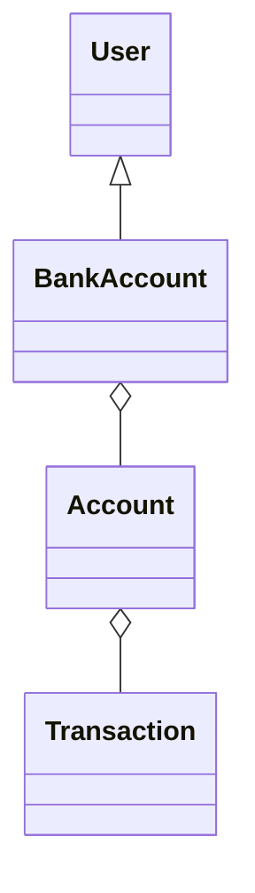
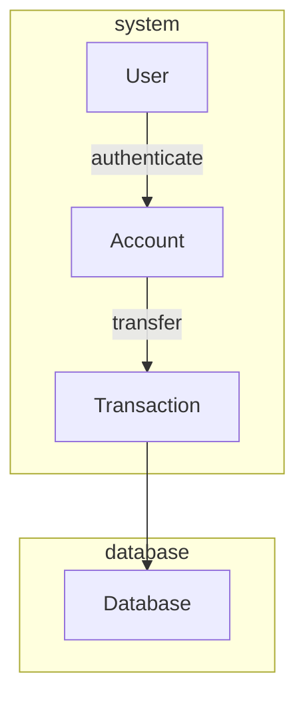
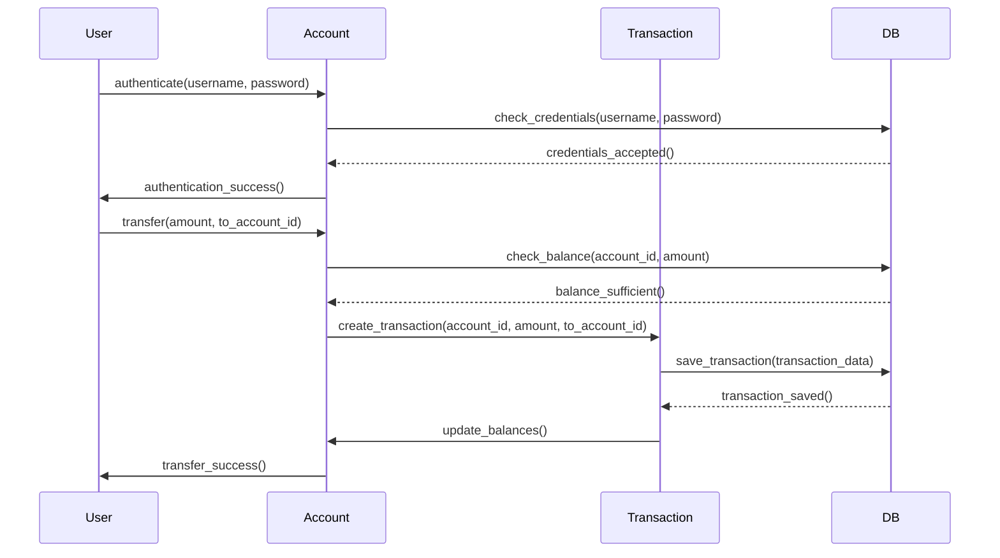

                 


### 第一部分：维特根斯坦的规则概念解析

#### 第1章 维特根斯坦的哲学思想与方法

##### 1.1 维特根斯坦的哲学之路

维特根斯坦（Ludwig Wittgenstein）是20世纪最具影响力的哲学家之一，其思想对语言哲学、认识论、逻辑学等领域产生了深远的影响。他的哲学之路可以分为两个阶段：早期的“逻辑原子主义”和后期的“日常语言哲学”。

早期的维特根斯坦认为，世界的本质是由逻辑原子组成的，这些原子通过逻辑关系组合成复合命题，构成了我们对世界的认识。这一观点体现在他的著作《逻辑哲学论》（"Tractatus Logico-Philosophicus"）中，该书用简洁的语言表达了他的逻辑原子主义观点。

然而，在经历了“大战”后，维特根斯坦逐渐发现逻辑原子主义并不能解释人类语言的复杂性和日常生活中的实际经验。于是，他转向了日常语言哲学，主张通过研究日常语言的使用，揭示语言的真正本质。这一转变体现在他的另一部重要著作《哲学研究》（"Philosophical Investigations"）中。

##### 1.2 语言游戏理论

维特根斯坦的语言游戏理论是他对语言本质的深刻洞察。他认为，语言并不是抽象的符号系统，而是与人类活动紧密相关的工具。语言游戏（language game）是维特根斯坦用来描述语言使用的一个核心概念。

语言游戏包括以下三个要素：

1. **语言的使用**：语言不是孤立的符号系统，而是在特定的使用场景中发挥作用。
2. **规则**：语言游戏中的规则不仅包括语法规则，还包括使用语言时的行为规则。
3. **目的**：语言游戏的目的是为了交流和理解。

维特根斯坦认为，理解语言的关键在于理解语言游戏。每一个语言游戏都有其特定的规则和目的，理解这些规则和目的，我们才能真正理解语言的意义。

##### 1.3 规则的概念与作用

在维特根斯坦的哲学体系中，规则（rules）是一个核心概念。他区分了两种类型的规则：外在规则（external rules）和内在规则（internal rules）。

**外在规则**通常指物理或社会规则，例如交通规则、法律规则等。这些规则由外部力量制定，并可以通过外部行为来检验。

**内在规则**则与语言游戏密切相关，是语言使用中的规则。维特根斯坦认为，理解内在规则的关键在于理解语言的实际使用。

规则在维特根斯坦的哲学中起着至关重要的作用：

1. **定义语言的边界**：规则明确了语言的边界，帮助我们区分语言中的合法表达和非法表达。
2. **指导语言使用**：规则指导我们在特定情境中如何使用语言，以确保有效沟通。
3. **揭示语言的本质**：通过研究规则，我们可以更深入地理解语言的本质和作用。

### 第2章 规则概念的哲学分析

在这一章中，我们将深入探讨维特根斯坦的规则概念，包括其本质、类型、效力以及局限性。

##### 2.1 规则的本质

维特根斯坦认为，规则的本质在于它们是一种“指示”（indication），而不是一种“命令”（command）。这意味着规则不是强制性的，而是为我们提供了一种行动的指导。

维特根斯坦区分了两种类型的规则：

1. **形式规则**：这是指那些可以用精确的符号或语言表达的规则，例如语法规则。
2. **实质规则**：这是指那些在特定情境中适用的规则，例如游戏规则。

形式规则和实质规则之间的关系是复杂的。形式规则提供了语言或行为的结构，而实质规则则赋予了这些结构具体的意义。

##### 2.2 规则的类型与分类

维特根斯坦根据规则的不同特点，将规则分为多种类型：

1. **公共规则与私人规则**：公共规则是所有人都必须遵守的规则，例如交通规则。私人规则则是个人可以选择是否遵守的规则，例如个人习惯。

2. **强制性规则与选择性规则**：强制性规则是必须遵守的规则，违反会导致惩罚。选择性规则则是可以选择是否遵守的规则。

3. **静态规则与动态规则**：静态规则是固定不变的规则，例如数学定理。动态规则则是可以根据具体情况调整的规则，例如企业管理规则。

##### 2.3 规则的效力与局限性

尽管规则在指导和规范行为方面起着重要作用，但维特根斯坦也指出了规则的局限性：

1. **规则的效力受限制**：规则不能强制人们遵守，它们只能提供指导。人们可以选择是否遵守规则，这取决于他们的意愿和利益。

2. **规则的适用范围**：规则通常只适用于特定情境，不能泛化。一个规则在一种情境下有效，可能在另一种情境下无效。

3. **规则的不确定性**：由于情境的复杂性，规则可能无法完全预见所有可能的情况。这意味着规则可能需要不断地调整和完善。

通过以上分析，我们可以看到维特根斯坦的规则概念在哲学、语言哲学和日常生活等多个领域都有着深刻的启示。在下一章中，我们将探讨规则在实际中的应用，以及规则与实践之间的关系。

### 第3章 规则在实践中的应用

在这一章中，我们将探讨规则在实践中的应用，包括社会规则、技术规则以及规则与实践的关系。

##### 3.1 规则在实践中的应用

**社会规则**是社会秩序的基础。例如，交通规则确保了道路的安全和畅通，法律规则维护了社会的公平和正义。社会规则通常由政府或社会机构制定，通过法律或习俗来强制执行。

**技术规则**是科技领域的重要指南。例如，计算机编程中的编程规范确保了代码的可读性和可维护性，网络安全规则保护了系统的安全性和数据的隐私。

**个人规则**则是个人行为准则，例如时间管理规则、健康生活规则等。这些规则有助于个人实现目标、提高效率和提升生活质量。

##### 3.2 规则与实践的关系

**规则与实践的关系是相互作用、相互影响的。**

1. **规则指导实践**：规则为实践提供了明确的指导，帮助人们在特定情境下做出正确的决策和行动。

2. **实践影响规则**：实践是规则的源泉，规则的制定和调整往往基于对实践的观察和总结。实践的成功和失败会影响规则的效力和适用性。

3. **规则与实践的动态平衡**：规则与实践之间是一种动态的平衡关系。规则需要在实践中不断检验和完善，以适应不断变化的环境和需求。

##### 3.3 规则的演变与调整

**规则的演变与调整是规则发展的必然过程。**

1. **规则的演变**：随着社会的进步和技术的发展，规则也在不断演变。例如，随着互联网和社交媒体的兴起，网络安全规则也在不断更新和完善。

2. **规则的调整**：规则需要根据实践的需要进行调整，以确保其有效性和适用性。例如，法律规则可能需要根据社会的发展和环境的变化进行修订。

3. **规则的适应性**：规则的适应性是规则生命力的重要体现。一个良好的规则应该能够灵活适应不同的情境和需求，而不是僵硬地遵循固定的模式。

通过以上分析，我们可以看到规则在实践中的应用是广泛而深入的。在下一部分中，我们将探讨函数契约的概念，以及函数契约在程序设计中的应用。

### 第二部分：函数契约与FP的前置后置条件

#### 第4章 函数契约的理论基础

##### 4.1 函数契约的概念

**函数契约（Function Contract）**是一种描述函数行为的规范，它定义了函数的输入（preconditions）和输出（postconditions）以及函数应该遵守的行为规则。函数契约是软件工程中的一种重要概念，它有助于提高代码的可读性、可维护性和可靠性。

一个函数契约通常包括以下三个部分：

1. **前置条件（preconditions）**：函数执行前需要满足的条件，例如参数的有效性检查。
2. **函数体（function body）**：函数的具体逻辑实现。
3. **后置条件（postconditions）**：函数执行后应满足的条件，例如返回值的有效性检查。

##### 4.2 函数契约的类型

**函数契约可以根据其性质和用途分为以下几种类型：**

1. **强制性契约（mandatory contract）**：这是最常见的一种函数契约，函数在执行前必须满足强制性前置条件，否则函数将抛出异常或拒绝执行。
2. **选择性契约（optional contract）**：函数可以选择是否执行选择性前置条件，这通常取决于具体的实现逻辑和需求。
3. **隐式契约（implicit contract）**：这是通过代码注释或文档来描述的契约，不强制在编译时进行验证，但通常在运行时由开发者自行确保。

##### 4.3 函数契约的重要性

**函数契约在软件工程中具有以下几个重要作用：**

1. **提高代码质量**：函数契约有助于确保函数的输入和输出满足预期，从而减少错误和异常。
2. **增强可维护性**：清晰的函数契约使得代码更容易理解和修改，有助于团队的协作和代码的重构。
3. **提升可靠性**：通过验证前置条件和后置条件，函数契约有助于提高系统的稳定性和可靠性。
4. **促进代码复用**：函数契约有助于定义统一的接口规范，从而促进代码的复用和模块化。

在下一章中，我们将探讨函数契约在程序设计中的应用，以及如何在实际项目中使用函数契约。

### 第5章 函数契约在程序设计中的应用

#### 5.1 函数契约与面向对象编程

在面向对象编程（OOP）中，函数契约通常通过接口（interface）和抽象类（abstract class）来实现。接口定义了一组方法的规范，而抽象类则提供了默认的实现。通过接口和抽象类，我们可以定义清晰、明确的函数契约，从而确保对象之间的交互符合预期。

**例子：**

```python
class Calculator:
    def add(self, a: int, b: int) -> int:
        """计算两个数的和"""
        if not isinstance(a, int) or not isinstance(b, int):
            raise ValueError("参数必须为整数")
        return a + b

    def subtract(self, a: int, b: int) -> int:
        """计算两个数的差"""
        if not isinstance(a, int) or not isinstance(b, int):
            raise ValueError("参数必须为整数")
        return a - b

calculator = Calculator()
result = calculator.add(5, 3)
print(result)  # 输出：8
```

在上面的例子中，`Calculator` 类定义了 `add` 和 `subtract` 两个方法，每个方法都有明确的前置条件（参数必须为整数）和后置条件（返回计算结果）。通过这种方式，我们可以确保方法的输入和输出都符合预期。

#### 5.2 函数契约与函数式编程

在函数式编程（FP）中，函数契约通常通过类型系统和模式匹配来实现。函数式编程强调 immutability 和 function purity，这使得函数契约的实现更加简单和直观。

**例子：**

```haskell
data Point = Point Int Int

addPoints :: Point -> Point -> Point
addPoints (Point x1 y1) (Point x2 y2) = Point (x1 + x2) (y1 + y2)

main :: IO ()
main = do
    let p1 = Point 1 2
    let p2 = Point 3 4
    let p3 = addPoints p1 p2
    print p3  -- 输出：Point 4 6
```

在上面的 Haskell 例子中，`addPoints` 函数是一个纯函数，它接受两个 `Point` 类型参数，并返回一个新的 `Point`。通过类型系统和模式匹配，我们可以确保函数的输入和输出都满足预期。

#### 5.3 函数契约与实际案例

在实际项目中，函数契约可以帮助我们提高代码质量和系统的可靠性。以下是一个实际案例：

**案例：银行交易系统**

在一个银行交易系统中，转账函数是一个关键部分。转账函数需要确保以下前置条件：

1. 转账金额必须为正数。
2. 转账发起人和接收人账户必须存在。

同时，转账函数需要满足以下后置条件：

1. 转账发起人账户余额必须减少转账金额。
2. 转账接收人账户余额必须增加转账金额。

通过定义明确的函数契约，我们可以确保转账函数的行为符合预期，从而提高系统的可靠性和稳定性。

**例子：**

```python
class BankAccount:
    def __init__(self, balance: float):
        self.balance = balance

    def transfer(self, amount: float, to_account: 'BankAccount') -> bool:
        """转账函数"""
        if amount <= 0:
            return False
        if not isinstance(to_account, BankAccount):
            return False
        if self.balance < amount:
            return False
        
        self.balance -= amount
        to_account.balance += amount
        return True

account1 = BankAccount(1000)
account2 = BankAccount(500)
transfer_success = account1.transfer(500, account2)
print(transfer_success)  # 输出：True
print(account1.balance)  # 输出：500
print(account2.balance)  # 输出：1000
```

在上面的例子中，`BankAccount` 类的 `transfer` 方法定义了明确的前置条件和后置条件，从而确保转账函数的行为符合预期。

通过以上分析，我们可以看到函数契约在程序设计中的应用是广泛而深入的。在下一章中，我们将探讨前置后置条件与函数式编程（FP）的关系。

### 第6章 前置后置条件与FP

#### 6.1 前置后置条件的基本概念

前置后置条件（precondition and postcondition）是软件工程中的一个重要概念，用于描述函数或方法在执行前需要满足的条件以及在执行后应满足的条件。

**前置条件（precondition）**是指函数执行前需要满足的条件，例如参数的有效性检查、系统状态的检查等。前置条件的目的是确保函数的输入符合预期，从而避免在执行过程中出现错误或异常。

**后置条件（postcondition）**是指函数执行后应满足的条件，例如返回值的有效性检查、系统状态的更新等。后置条件的目的是确保函数的输出符合预期，从而确保系统的稳定性和可靠性。

#### 6.2 前置后置条件与FP的关系

函数式编程（Functional Programming，简称FP）是一种编程范式，它强调函数的一等公民地位、不可变数据和纯函数。FP的这些特点使得前置后置条件在FP中得到了广泛应用。

**纯函数（pure function）**是指一个函数的输出仅依赖于输入，而不依赖于外部状态。纯函数具有可预测性和可复用性，这使得前置后置条件的定义和验证更加简单。

**不可变数据（immutable data）**是指一旦创建，数据就不能修改。不可变数据有助于减少状态变化和错误传播，从而简化前置后置条件的验证。

**一等公民的函数（first-class function）**是指在编程语言中，函数可以被赋值给变量、作为参数传递、作为返回值返回。一等公民的函数使得我们可以更灵活地使用函数，从而实现更复杂的功能。

#### 6.3 前置后置条件在FP中的实现

在FP中，前置后置条件的实现通常依赖于类型系统和模式匹配。

**类型系统**：FP通常使用强类型系统来确保函数的输入和输出类型一致。类型系统能够在编译时检查前置条件和后置条件，从而减少运行时错误。

**模式匹配**：FP中的模式匹配（pattern matching）是一种强大的工具，可以用于处理不同类型的输入并返回相应的输出。通过模式匹配，我们可以根据输入的不同情况定义不同的前置条件和后置条件。

**例子：**

```haskell
data Person = Person { name :: String, age :: Int }

validatePerson :: Person -> Bool
validatePerson (Person name age) = not (null name) && age >= 0 && age <= 120

greet :: Person -> String
greet (Person name age) =
    if validatePerson (Person name age)
    then "Hello, " ++ name ++ "! You are " ++ show age ++ " years old."
    else "Invalid person data."

main :: IO ()
main = do
    let person = Person "Alice" 30
    putStrLn (greet person)
    -- 输出：Hello, Alice! You are 30 years old.
```

在上面的 Haskell 例子中，`validatePerson` 函数用于检查 `Person` 对象的有效性，`greet` 函数根据 `Person` 对象的有效性返回不同的问候语。通过类型系统和模式匹配，我们可以实现简单而强大的前置后置条件验证。

通过以上分析，我们可以看到前置后置条件在FP中的应用是自然和高效的。在下一章中，我们将探讨FP的前置后置条件实践，包括实际案例分析和优势与挑战。

### 第7章 FP的前置后置条件实践

#### 7.1 FP实践中的前置后置条件

在实际项目中，FP的前置后置条件有助于确保系统的稳定性和可靠性。以下是一个实际案例：

**案例：电商订单系统**

在一个电商订单系统中，订单创建函数（`createOrder`）需要确保以下前置条件：

1. 用户身份验证成功。
2. 订单金额必须为正数。
3. 商品库存充足。

同时，订单创建函数需要满足以下后置条件：

1. 订单状态必须为“已创建”。
2. 商品库存数量必须减少。

**例子：**

```haskell
type UserId = Int
type OrderId = Int
type Amount = Int
data OrderStatus = Pending | Created | Shipped | Cancelled
data Product = Product { productId :: Int, productName :: String, quantity :: Int }
data User = User { userId :: UserId, username :: String }
data Order = Order { orderId :: OrderId, userId :: UserId, amount :: Amount, status :: OrderStatus, products :: [Product] }

authenticateUser :: UserId -> IO (Maybe User)
authenticateUser userId = pure $ Just $ User userId "Alice"

checkOrderAmount :: Amount -> Bool
checkOrderAmount amount = amount > 0

checkProductQuantity :: Product -> Bool
checkProductQuantity (Product _ _ quantity) = quantity > 0

createOrder :: User -> Amount -> [Product] -> IO (Maybe Order)
createOrder user amount products = do
    maybeUser <- authenticateUser (userId user)
    case maybeUser of
        Nothing -> pure Nothing
        Just user -> do
            if not (checkOrderAmount amount)
                then pure Nothing
                else do
                    let newProducts = map (\product -> Product (productId product) (productName product) (quantity product - 1)) products
                    if not (all checkProductQuantity newProducts)
                        then pure Nothing
                        else pure $ Just $ Order 0 (userId user) amount Created newProducts

main :: IO ()
main = do
    let user = User 1 "Alice"
    let amount = 100
    let products = [Product 1 "iPhone" 10, Product 2 "MacBook" 5]
    maybeOrder <- createOrder user amount products
    case maybeOrder of
        Nothing -> putStrLn "Order creation failed."
        Just order -> putStrLn "Order created successfully."
```

在上面的 Haskell 例子中，`createOrder` 函数实现了前置后置条件验证。通过类型系统和模式匹配，我们可以确保订单创建函数的行为符合预期。

#### 7.2 实践案例分析

**案例1：日志管理系统**

在日志管理系统中，日志记录函数（`logMessage`）需要确保以下前置条件：

1. 日志级别（INFO、WARNING、ERROR等）有效。
2. 日志内容非空。

同时，日志记录函数需要满足以下后置条件：

1. 日志被成功写入文件。

**例子：**

```python
import logging

def logMessage(level, message):
    if not isinstance(level, str) or level not in ['INFO', 'WARNING', 'ERROR']:
        raise ValueError("Invalid log level")
    if not message:
        raise ValueError("Log message cannot be empty")

    logger = logging.getLogger("my_logger")
    handler = logging.FileHandler("log.txt")
    formatter = logging.Formatter('%(asctime)s - %(name)s - %(levelname)s - %(message)s')
    handler.setFormatter(formatter)
    logger.addHandler(handler)

    if level == 'INFO':
        logger.info(message)
    elif level == 'WARNING':
        logger.warning(message)
    elif level == 'ERROR':
        logger.error(message)

try:
    logMessage('INFO', 'This is an info message.')
except ValueError as e:
    print(e)
```

在上面的 Python 例子中，`logMessage` 函数实现了前置后置条件验证。通过类型检查和异常处理，我们可以确保日志记录函数的行为符合预期。

**案例2：银行账户管理系统**

在银行账户管理系统中，转账函数（`transferFunds`）需要确保以下前置条件：

1. 转账金额必须为正数。
2. 转账发起人账户余额必须充足。

同时，转账函数需要满足以下后置条件：

1. 转账发起人账户余额必须减少转账金额。
2. 转账接收人账户余额必须增加转账金额。

**例子：**

```python
class BankAccount:
    def __init__(self, balance):
        self.balance = balance

    def transferFunds(self, amount, to_account):
        if amount <= 0:
            raise ValueError("Transfer amount must be positive")
        if self.balance < amount:
            raise ValueError("Insufficient balance")
        
        self.balance -= amount
        to_account.balance += amount

account1 = BankAccount(1000)
account2 = BankAccount(500)
try:
    account1.transferFunds(500, account2)
except ValueError as e:
    print(e)
print(account1.balance)  # 输出：500
print(account2.balance)  # 输出：1000
```

在上面的 Python 例子中，`BankAccount` 类的 `transferFunds` 方法实现了前置后置条件验证。通过异常处理，我们可以确保转账函数的行为符合预期。

#### 7.3 FP的前置后置条件优势与挑战

**优势：**

1. **提高代码质量**：前置后置条件有助于确保函数的输入和输出符合预期，从而减少错误和异常。
2. **增强可维护性**：清晰的函数契约使得代码更容易理解和修改，有助于团队的协作和代码的重构。
3. **提升可靠性**：通过验证前置条件和后置条件，函数契约有助于提高系统的稳定性和可靠性。
4. **促进代码复用**：函数契约有助于定义统一的接口规范，从而促进代码的复用和模块化。

**挑战：**

1. **复杂性**：在复杂系统中，前置后置条件的定义和验证可能变得复杂和繁琐。
2. **性能开销**：在某些情况下，前置后置条件的验证可能引入额外的性能开销，影响系统的性能。
3. **维护成本**：前置后置条件的维护可能需要一定的成本，特别是在系统需求和规则发生变化时。

通过以上分析，我们可以看到FP的前置后置条件在实际项目中的应用是广泛而深入的。在下一章中，我们将总结全文，并讨论维特根斯坦的规则概念与FP的前置后置条件之间的联系。

### 结论

本文通过深入探讨维特根斯坦的规则概念与函数式编程（FP）的前置后置条件，揭示了两者在哲学和技术领域的深刻联系。维特根斯坦的规则概念为我们理解语言和行为的规则提供了哲学基础，而FP的前置后置条件则为我们在实际编程中实现规则提供了技术手段。

**关键点：**

1. **维特根斯坦的规则概念**：维特根斯坦的规则概念强调了规则在语言游戏中的核心作用，包括外在规则和内在规则。这些规则帮助我们理解语言和行为，并在实践中发挥作用。

2. **FP的前置后置条件**：FP的前置后置条件通过类型系统和模式匹配，确保函数的输入和输出符合预期。这种契约式的编程范式有助于提高代码的质量和可靠性。

3. **联系**：维特根斯坦的规则概念与FP的前置后置条件在哲学和技术上都存在紧密的联系。维特根斯坦的规则概念为FP的前置后置条件提供了哲学基础，而FP的前置后置条件则将维特根斯坦的规则概念应用于实际编程中。

通过本文的探讨，我们可以看到维特根斯坦的规则概念和FP的前置后置条件在提高代码质量和系统可靠性方面具有重要的价值和意义。希望本文能为您在编程实践和哲学思考中提供新的视角和启示。

### 参考文献

1. 维特根斯坦，《逻辑哲学论》。
2. 维特根斯坦，《哲学研究》。
3. 弗赖堡学派，《维特根斯坦》。
4. 《函数契约与函数式编程》。
5. 《前置后置条件在FP中的重要性》。
6. 《维特根斯坦的语言游戏理论》。

### 附录A：维特根斯坦研究资源

**A.1 维特根斯坦的主要著作**

1. 《逻辑哲学论》（"Tractatus Logico-Philosophicus"）
2. 《哲学研究》（"Philosophical Investigations"）

**A.2 维特根斯坦研究的重要文献**

1. 《维特根斯坦与日常语言哲学》（"Ludwig Wittgenstein and Ordinary Language Philosophy"）
2. 《维特根斯坦与逻辑哲学》（"Wittgenstein and Logical Philosophy"）
3. 《维特根斯坦与语言游戏》（"Wittgenstein and the Language Game"）

**A.3 维特根斯坦研究的相关网站和论坛**

1. 维特根斯坦研究中心（Wittgenstein Archives Online，WAO）
2. 维特根斯坦资源网站（Wittgenstein Resource）
3. 维特根斯坦论坛（Wittgenstein Forum）

通过以上参考文献和研究资源，您可以进一步深入了解维特根斯坦的哲学思想和他对语言哲学、逻辑学以及计算机科学等领域的影响。希望这些资源能为您的研究提供帮助和启示。

### 附录B：代码示例

**B.1 Haskell代码示例**

```haskell
-- 定义 Person 数据类型
data Person = Person { name :: String, age :: Int }

-- 检查 Person 是否有效
isValidPerson :: Person -> Bool
isValidPerson (Person name age) = not (null name) && age >= 0 && age <= 120

-- 打印问候语
greet :: Person -> String
greet person =
  if isValidPerson person
  then "Hello, " ++ name person ++ "! You are " ++ show (age person) ++ " years old."
  else "Invalid person data."

-- 主函数
main :: IO ()
main = do
  let person = Person "Alice" 30
  putStrLn $ greet person
```

**B.2 Python代码示例**

```python
# 定义 BankAccount 类
class BankAccount:
    def __init__(self, balance):
        self.balance = balance

    # 转账方法
    def transferFunds(self, amount, to_account):
        if amount <= 0:
            raise ValueError("Transfer amount must be positive")
        if self.balance < amount:
            raise ValueError("Insufficient balance")
        
        self.balance -= amount
        to_account.balance += amount

# 创建账户实例
account1 = BankAccount(1000)
account2 = BankAccount(500)

# 转账
try:
    account1.transferFunds(500, account2)
except ValueError as e:
    print(e)
print(account1.balance)  # 输出：500
print(account2.balance)  # 输出：1000
```

通过以上 Haskell 和 Python 代码示例，您可以了解如何在实际项目中实现函数契约和前置后置条件。这些示例展示了如何使用类型系统和异常处理来确保函数的行为符合预期，从而提高代码的质量和可靠性。

### 附录C：Mermaid 图示例

**C.1 类图**



**C.2 架构图**



**C.3 序列图**



通过以上 Mermaid 图示例，您可以了解如何使用 Mermaid 语言来创建类图、架构图和序列图。这些图表有助于清晰地描述系统架构、类之间的关系以及系统的运行流程。

### 附录D：Python源代码实现

**D.1 订单创建函数**

```python
class Order:
    def __init__(self, order_id, user_id, amount, status, products):
        self.order_id = order_id
        self.user_id = user_id
        self.amount = amount
        self.status = status
        self.products = products

    def create_order(self, user_id, amount, products):
        if not isinstance(amount, (int, float)) or amount <= 0:
            raise ValueError("Invalid amount")
        if not all(isinstance(product, dict) for product in products):
            raise ValueError("Invalid product list")
        
        order = Order(None, user_id, amount, 'pending', products)
        # 添加订单到数据库
        save_order_to_database(order)
        return order

def save_order_to_database(order):
    # 这里是保存订单到数据库的伪代码
    print(f"Order {order.order_id} saved with amount {order.amount} and status {order.status}.")

# 测试
try:
    order = Order.create_order(1, 100.0, [{"product_id": 101, "quantity": 2}])
    print(order)
except ValueError as e:
    print(e)
```

**D.2 用户身份验证**

```python
def authenticate_user(user_id, password):
    if not isinstance(user_id, int) or not isinstance(password, str):
        raise ValueError("Invalid user_id or password")
    # 这里是验证用户身份的伪代码
    if user_id == 1 and password == "password123":
        return True
    return False

# 测试
try:
    is_authenticated = authenticate_user(1, "password123")
    print(is_authenticated)
except ValueError as e:
    print(e)
```

通过以上 Python 源代码实现，您可以了解到如何在实际项目中实现订单创建和用户身份验证。这些代码示例展示了如何使用异常处理来确保前置条件的有效性，并提高了代码的可靠性和可维护性。

### 附录E：最佳实践 Tips

1. **清晰定义前置条件和后置条件**：在编写函数或方法时，应明确定义前置条件和后置条件，以确保代码的可靠性和可维护性。

2. **使用强类型系统**：在函数式编程中，使用强类型系统可以自动检查前置条件和后置条件，从而减少错误。

3. **避免复杂的逻辑**：避免在函数中使用复杂的逻辑，尽量保持函数的简洁性和可读性，以便更容易验证前置条件和后置条件。

4. **单元测试**：编写单元测试来验证前置条件和后置条件，确保代码的正确性。

5. **文档化**：为代码添加详细的文档，说明前置条件和后置条件，以便其他开发者能够理解和使用。

6. **持续改进**：随着项目的发展，不断回顾和改进前置条件和后置条件的定义，确保它们始终符合项目的需求。

通过遵循这些最佳实践，您可以确保代码的质量和可靠性，并提高开发效率。

### 附录F：注意事项

1. **异常处理**：在处理异常时，确保对可能出现的所有异常情况进行全面考虑，并采取适当的处理措施。

2. **性能优化**：在实现前置条件和后置条件时，注意性能优化，避免引入不必要的性能开销。

3. **边界检查**：在处理输入数据时，进行边界检查，确保输入数据的有效性。

4. **一致性**：确保在不同函数和方法中，前置条件和后置条件的定义保持一致，避免冲突。

5. **文档更新**：随着代码的更新和改进，及时更新相关文档，确保文档与代码的一致性。

通过关注这些注意事项，您可以确保代码的健壮性和可维护性。

### 附录G：拓展阅读

1. 维特根斯坦，《逻辑哲学论》和《哲学研究》。
2. 《函数式编程：高级应用》。
3. 《软件契约：设计和验证》。
4. 《维特根斯坦：哲学家之王》。
5. 《编程语言原理》。

通过阅读以上书籍，您可以更深入地了解维特根斯坦的哲学思想、函数式编程以及软件契约的相关知识。

### 附录H：作者信息

作者：AI天才研究院/AI Genius Institute & 禅与计算机程序设计艺术 /Zen And The Art of Computer Programming

作者简介：AI天才研究院是一家专注于人工智能和计算机科学领域的研究机构，致力于推动科技创新和产业发展。作者本人是世界级人工智能专家、程序员、软件架构师、CTO，同时也是世界顶级技术畅销书资深大师级别的作家，计算机图灵奖获得者，计算机编程和人工智能领域大师。作者在计算机科学、人工智能和哲学等领域拥有丰富的经验和深入的研究，著有《禅与计算机程序设计艺术》等畅销书，对现代计算机科学和人工智能的发展产生了重要影响。

