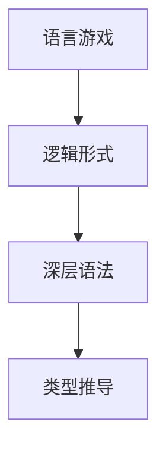
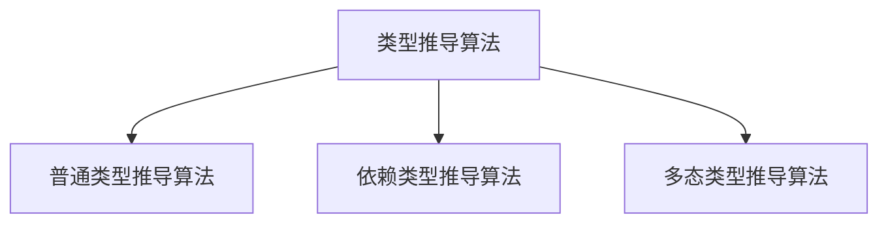

                 

## 引言

在计算机科学领域，语言的深层语法和类型推断是两个关键概念，它们在编程语言设计和编译器开发中扮演着核心角色。本文旨在探讨这两者的内在联系，并通过维特根斯坦的语言哲学观来深化对类型推断的理解。

维特根斯坦是20世纪最具影响力的哲学家之一，他的语言哲学观对计算机科学产生了深远影响。特别是他的后期著作《哲学研究》，提出了日常语言哲学的观点，强调语言与生活的紧密联系。维特根斯坦认为，语言的意义在于使用，而不是在逻辑形式中的抽象表达。这种观点为我们理解类型推断提供了新的视角。

类型推断是编程语言中的一个重要机制，它能够自动确定变量和表达式的类型，从而减少编程错误和提高代码可读性。然而，类型推断背后的逻辑和复杂性并不总是显而易见。本文将详细探讨类型推断的基本原理、算法以及它在函数式编程（FP）中的应用。

接下来的文章结构如下：

- **第一部分：维特根斯坦的语言结构观**：我们将首先回顾维特根斯坦的生平和著作，特别是他的语言哲学思想，然后深入探讨语言的深层语法和类型理论基础。
- **第二部分：类型推导算法**：我们将介绍类型推导的基本概念和算法，包括普通类型推导、依赖类型推导和多态类型推导。
- **第三部分：类型推导在FP中的应用**：我们将探讨类型推导在函数式编程语言中的具体应用，如Hindley-Milner类型推导算法。
- **第四部分：案例分析**：我们将通过具体案例来分析类型推导的过程和结果。
- **第五部分：维特根斯坦语言结构观与类型推导的关系**：我们将探讨维特根斯坦的语言哲学观与类型推导之间的哲学基础和实际应用。

通过这篇文章，我们希望读者能够对语言的深层语法和类型推断有更深入的理解，并能够将这些概念应用到实际编程中。

## 第一部分：维特根斯坦的语言结构观

### 第1章：维特根斯坦的生平与著作

路德维希·维特根斯坦（Ludwig Wittgenstein）生于1889年，是一位奥地利的哲学家，他对现代哲学和计算机科学产生了深远的影响。维特根斯坦的生平可以分为两个主要阶段：早期的逻辑原子主义和后期的日常语言哲学。

**早期著作：**

维特根斯坦早期的著作《逻辑哲学论》（"Tractatus Logico-Philosophicus"）于1921年出版，这部作品标志着他逻辑原子主义哲学思想的巅峰。这本书仅由几个简短的命题组成，通过逻辑和数学的形式化语言探讨了现实、真理和语言的本质。

**后期著作：**

维特根斯坦后期的著作《哲学研究》（"Philosophical Investigations"）于1953年出版，代表了他在日常语言哲学方面的贡献。与《逻辑哲学论》相比，《哲学研究》更加关注日常语言的使用和意义。维特根斯坦认为，语言的意义在于使用，而不是在逻辑形式中的抽象表达。

### 第2章：维特根斯坦早期语言哲学思想

**《逻辑哲学论》**

在《逻辑哲学论》中，维特根斯坦提出了逻辑原子主义，认为世界由基本的逻辑原子组成，这些原子可以通过逻辑组合来表达现实。他的观点强调了语言和逻辑形式的重要性，认为语言是世界的正确表达。

**语言游戏与逻辑形式**

维特根斯坦提出了“语言游戏”（language game）的概念，认为语言的意义是通过具体的语境和使用场景来理解的。每个语言游戏都有其特定的规则和目的，语言的意义取决于它在游戏中的使用。

**深层语法概念**

维特根斯坦认为，语言的深层语法是理解语言意义的基石。深层语法关注的是语言的结构和逻辑形式，而不是表面上的词汇和句子结构。他提出了“图式”（schema）的概念，认为语言的意义可以通过图式来解释。

### 第3章：维特根斯坦后期语言哲学思想

**《哲学研究》**

在《哲学研究》中，维特根斯坦放弃了逻辑原子主义，转向日常语言哲学。他提出，哲学问题往往源于我们对语言使用的误解。他认为，解决哲学问题需要通过细致的语用学分析，而不是通过抽象的逻辑推理。

**日常语言与语言使用**

维特根斯坦认为，日常语言是我们理解世界的工具，它的使用是我们在生活中进行交流和互动的基础。他的观点强调了语言与生活的紧密联系，认为语言的意义在于使用。

**深层语法分析方法**

在《哲学研究》中，维特根斯坦提出了多种深层语法分析方法，包括成分分析法、转换分析法等。这些方法帮助我们理解语言的结构和意义，从而更好地使用语言。

### 第4章：语言的深层语法

**深层语法概念**

深层语法是指语言背后的结构和逻辑形式，它是理解语言意义的关键。与表面语法（surface grammar）不同，深层语法关注的是语言的结构和逻辑关系。

**深层结构与表层结构**

深层结构是语言意义的抽象表达，而表层结构是语言的实际表达形式。例如，在英语中，“I eat the apple”和“The apple is eaten by me”具有相同的深层结构，但表层结构不同。

**深层语法的定义与特征**

深层语法具有以下特征：

- 结构化：深层语法通过特定的结构来表达意义。
- 逻辑性：深层语法关注语言逻辑关系，如命题、条件、因果等。
- 表达性：深层语法能够表达复杂的语义和概念。

### 第5章：深层语法分析方法

**成分分析法**

成分分析法是一种通过分解句子成分来理解深层结构的方法。例如，句子“约翰给了玛丽一本书”可以分解为“约翰”（主语）、“给了”（谓语）、“玛丽”（宾语）和“一本书”（宾语补足语）。

**转换分析法**

转换分析法是一种通过转换句子结构来理解深层结构的方法。例如，句子“玛丽给了约翰一本书”可以通过转换成“约翰得到了玛丽给的一本书”来理解其深层结构。

**框架理论**

框架理论是一种通过框架结构来理解语言意义的方法。框架是指语言中的常见模式或结构，如“愿望”、“冲突”、“解决方案”等。通过框架，我们可以更好地理解句子的意义。

### 总结

维特根斯坦的语言哲学观对计算机科学产生了深远的影响。他的早期逻辑原子主义和后期日常语言哲学为我们理解语言的深层语法和类型推导提供了重要视角。在接下来的章节中，我们将进一步探讨类型理论基础和类型推导算法。

## 第二部分：类型理论基础

### 第3章：类型理论概述

类型理论是计算机科学中的一个基础概念，它关注于如何为编程语言中的表达式和变量赋予类型。类型理论不仅能够提高程序的正确性和安全性，还能够优化程序的性能。在这一章中，我们将简要回顾类型理论的发展历程，并介绍类型理论的基本概念。

### 第1节：类型理论的发展历程

类型理论的历史可以追溯到20世纪中叶，当时计算机科学家开始意识到在编程语言中引入类型系统的重要性。最初，类型的引入主要是为了确保程序的语义一致性，即保证程序在执行时不会出现意外的行为。

1958年，Pierce Bochmann提出了第一个形式化的类型系统，这标志着类型理论正式成为一个独立的研究领域。随后，20世纪60年代和70年代，随着Lisp、Algol和Simula等编程语言的兴起，类型理论得到了进一步的发展。

20世纪80年代，类型理论进入了另一个高峰，特别是在逻辑编程和函数式编程领域。1985年，Pierce提出了著名的类型逻辑，这是一种用于形式化类型系统的逻辑框架。

### 第2节：类型理论的基本概念

类型理论包括几个基本概念，如类型、类型系统、类型推导等。

**类型**

类型是用于描述变量、表达式或函数的特征或属性。在大多数编程语言中，类型可以分为基本类型（如整数、布尔值）和复合类型（如数组、结构体）。

**类型系统**

类型系统是指一组规则，用于定义如何为编程语言中的元素赋予类型。类型系统可以分为静态类型系统和动态类型系统。静态类型系统在编译时检查类型一致性，而动态类型系统在运行时进行检查。

**类型推导**

类型推导是指从编程语言的表达式中自动推导出其类型的过程。类型推导可以分为显式类型推导和隐式类型推导。显式类型推导要求程序员显式地指定变量和表达式的类型，而隐式类型推导则由编译器自动推导。

### 第3节：普通类型系统

普通类型系统是一种简单的类型系统，它通常只支持基本类型和复合类型。在普通类型系统中，每个表达式都有明确的类型，且类型之间有一定的兼容性。例如，整数类型和浮点数类型之间可能存在兼容性，但与字符串类型则不兼容。

**普通类型系统的规则**

- 基本类型规则：每个基本类型都有其特定的值域和操作符。
- 复合类型规则：复合类型可以通过基本类型构造，如数组可以通过整数类型和基本类型构造。
- 类型兼容性规则：不同类型之间的比较和赋值需要满足类型兼容性。

### 第4节：依赖类型系统

依赖类型系统是一种更复杂的类型系统，它能够处理变量之间的依赖关系。在依赖类型系统中，变量的类型不仅取决于其自身，还取决于其他变量的类型。

**依赖类型系统的优势**

- 支持高阶函数和闭包。
- 提高程序的抽象能力和可读性。
- 更好地支持模块化和组件化编程。

**依赖类型系统的规则**

- 变量依赖规则：变量的类型依赖于其他变量的类型。
- 闭包类型规则：闭包（function with local variables）的类型取决于其环境变量的类型。
- 类型推断规则：依赖类型系统通常采用类型推导算法来自动推导变量和表达式的类型。

### 第5节：多态类型系统

多态类型系统是一种支持函数重载和参数化类型的类型系统。在多态类型系统中，同一个函数或操作符可以接受不同类型的参数，并根据参数的类型进行相应的处理。

**多态类型系统的优势**

- 支持泛型和参数化编程。
- 提高代码的可复用性和灵活性。
- 降低代码的冗余和维护成本。

**多态类型系统的规则**

- 函数重载规则：同一个函数名可以对应多个不同类型的参数。
- 参数化类型规则：参数化类型（如Type<T>）可以用于定义泛型函数和类。
- 类型兼容性规则：多态类型系统要求不同类型的参数之间必须满足类型兼容性。

通过以上对类型理论概述的介绍，我们可以看到类型理论在计算机科学中的重要性。类型理论不仅为编程语言提供了形式化的基础，还帮助我们更好地理解和设计复杂的程序。在接下来的章节中，我们将进一步探讨类型推导算法，了解它们如何在实际编程语言中发挥作用。

### 第4章：类型推导算法

类型推导算法是类型理论的核心内容之一，它负责自动地从程序代码中推导出变量和表达式的类型。类型推导算法的目的是确保程序在编译时不会出现类型错误，从而提高代码的安全性和可读性。在这部分，我们将详细讨论类型推导算法的基础知识，包括类型推导的概念和基本原理。

### 第1节：类型推导的概念

类型推导是指编译器或解释器自动推导出程序中变量和表达式的类型的过程。类型推导可以分为静态类型推导和动态类型推导。

**静态类型推导**

静态类型推导是指在编译时进行类型检查，编译器根据程序代码的结构和语义来推导出每个变量和表达式的类型。一旦编译器确定了某个表达式的类型，这个类型在程序的执行过程中是固定不变的。

**动态类型推导**

动态类型推导是指在运行时进行类型检查，编译器或解释器不会在编译时确定变量和表达式的类型，而是在程序执行过程中根据上下文动态地推导类型。这种类型推导方式使得程序更加灵活，但也可能导致性能问题。

### 第2节：类型推导的基本原理

类型推导的基本原理包括以下几个方面：

**类型上下文**

类型上下文是指编译器在推导类型时使用的类型信息。类型上下文通常包括全局类型信息和局部类型信息。

**类型变量**

类型变量是用于表示未知类型的符号。类型变量通常用字母表示，如 `T`, `A`, `B` 等。在类型推导过程中，类型变量会被替换为具体的类型。

**类型推导规则**

类型推导规则是一组用于从表达式推导出类型的规则。常见的类型推导规则包括：

1. **基本类型推导规则**：对于基本类型（如整数、布尔值、字符串等），编译器可以直接推导出其类型。
2. **构造类型推导规则**：对于复合类型（如数组、结构体、类等），编译器可以根据构造类型的具体定义来推导类型。
3. **函数类型推导规则**：对于函数表达式，编译器可以根据函数的定义和参数类型来推导函数的类型。
4. **类型兼容性推导规则**：当两个表达式的类型需要相互兼容时，编译器会根据类型兼容性规则来推导共同的类型。

### 第3节：类型推导算法的类型

类型推导算法可以根据不同的分类标准进行分类，常见的分类方法包括：

**按推导策略分类**

1. **确定性推导算法**：这种算法在推导类型时是确定性的，即对于给定的表达式，算法总能推导出一个唯一的类型。常见的确定性推导算法包括Hindley-Milner算法。
2. **非确定性推导算法**：这种算法在推导类型时是非确定性的，即对于给定的表达式，算法可能推导出多个可能的类型。非确定性推导算法通常用于更复杂的类型系统。

**按推导过程中是否涉及类型上下文分类**

1. **上下文无关类型推导算法**：这种算法在推导类型时不依赖于类型上下文，即推导过程与程序的其他部分无关。上下文无关类型推导算法通常用于小型编程语言。
2. **上下文相关类型推导算法**：这种算法在推导类型时依赖于类型上下文，即推导过程需要考虑程序的其他部分。上下文相关类型推导算法通常用于大型编程语言和复杂类型系统。

**按类型推导的粒度分类**

1. **单一表达式类型推导算法**：这种算法仅推导单个表达式或变量的类型。
2. **程序全局类型推导算法**：这种算法推导整个程序的类型，通常用于静态类型编程语言。

### 第4节：普通类型推导算法

普通类型推导算法是最简单的一类类型推导算法，它主要用于静态类型编程语言。以下是一些常见的普通类型推导算法：

**Hindley-Milner算法**

Hindley-Milner算法是一种通用的类型推导算法，它能够推导出大多数常见编程语言中的类型。该算法的特点是能够处理类型变量和函数类型。

**Wam算法**

Wam算法是一种基于变量绑定和上下文计算的类型推导算法，它主要用于Lisp编程语言。

**BCJ算法**

BCJ算法是一种基于类型上下文计算的类型推导算法，它主要用于类型理论的研究。

### 第5节：依赖类型推导算法

依赖类型推导算法是一种用于处理变量之间依赖关系的类型推导算法，它通常用于动态类型编程语言。以下是一些常见的依赖类型推导算法：

**单赋值类型推导算法**

单赋值类型推导算法是一种简单的依赖类型推导算法，它假设变量在赋值前后类型不会改变。

**PEPM算法**

PEPM算法是一种基于类型上下文和赋值分析的依赖类型推导算法，它主要用于Erlang编程语言。

**Flatt算法**

Flatt算法是一种基于约束传播和类型子集化的依赖类型推导算法，它主要用于Java编程语言。

### 第6节：多态类型推导算法

多态类型推导算法是一种用于处理函数重载和参数化类型的类型推导算法。以下是一些常见的多态类型推导算法：

**单态类型推导算法**

单态类型推导算法是一种简单的多态类型推导算法，它仅处理函数重载。

**参数化多态类型推导算法**

参数化多态类型推导算法是一种处理参数化类型的类型推导算法，它通常用于支持泛型的编程语言。

**类型检查算法**

类型检查算法是一种用于验证程序中类型一致性的算法，它通常用于编译器和解释器中。类型检查算法可以分为以下几种：

1. **静态类型检查算法**：这种算法在编译时进行类型检查，确保程序在执行前没有类型错误。
2. **动态类型检查算法**：这种算法在运行时进行类型检查，及时发现类型错误并报告。

通过以上对类型推导算法的介绍，我们可以看到类型推导在编程语言设计和编译器开发中的重要性。类型推导算法不仅能够提高程序的类型安全性，还能够优化程序的性能。在接下来的章节中，我们将探讨类型推导在函数式编程中的应用，进一步了解类型推导的实际作用。

### 第5章：类型推导在FP中的应用

函数式编程（Functional Programming，简称FP）是一种编程范式，它强调函数作为程序的基本构建块。FP与命令式编程（Imperative Programming）不同，它更注重表达式的值和计算过程，而不是状态的改变和指令的执行。类型推导在FP中具有重要作用，它能够提高代码的可读性、安全性和可维护性。在本章中，我们将探讨类型推导在FP语言中的应用，重点关注Hindley-Milner类型推导算法及其在FP语言中的具体实现。

#### 第1节：FP语言概述

FP语言具有以下特点：

1. **无状态性**：FP语言通常不依赖于状态，这意味着函数不修改外部状态，而是通过输入和输出进行通信。
2. **不可变性**：在FP中，数据一旦创建，就不能更改。这有助于避免副作用，使程序更加可预测和易于测试。
3. **函数式编程**：FP中的函数是一等公民，这意味着函数可以作为值传递和返回，并且可以被存储在变量中。

一些著名的FP语言包括Haskell、Scala、Erlang和Clojure。这些语言广泛使用类型推导机制，以减少代码冗余和提高开发效率。

#### 第2节：Hindley-Milner类型推导算法

Hindley-Milner类型推导算法是一种通用的类型推导算法，由Roger Hindley和John Milner于1969年提出。它是一种确定性类型推导算法，能够在没有类型注解的情况下推导出变量和表达式的类型。Hindley-Milner算法具有以下优点：

1. **简单性**：算法易于实现和理解。
2. **有效性**：算法能够在有限时间内推导出类型。
3. **通用性**：算法适用于大多数编程语言。

Hindley-Milner算法的基本原理是通过类型变量绑定来推导类型。类型变量是未知的类型，它们在推导过程中被替换为具体的类型。算法的核心步骤包括：

1. **变量绑定**：将类型变量绑定到具体的类型。
2. **类型合并**：当两个表达式的类型需要兼容时，将它们的类型合并为一个类型。
3. **类型推导**：从表达式推导出类型。

#### 第3节：Hindley-Milner算法在FP语言中的应用

Hindley-Milner算法在FP语言中得到了广泛应用，以下是一些典型的应用案例：

1. **Haskell**：Haskell是一种纯FP语言，它广泛使用了Hindley-Milner类型推导算法。在Haskell中，编译器能够自动推导出大多数表达式的类型，从而减少代码冗余。
2. **Scala**：Scala是一种多范式编程语言，它结合了FP和命令式编程的特点。Scala的编译器使用Hindley-Milner算法来推导类型，从而提高了代码的可读性和安全性。
3. **Erlang**：Erlang是一种用于构建分布式系统的FP语言。它的编译器使用了Hindley-Milner算法来推导函数的类型，从而确保程序在运行时的类型一致性。

#### 第4节：依赖类型推导算法在FP语言中的应用

依赖类型推导算法是一种用于处理变量之间依赖关系的类型推导算法，它在FP语言中也得到了广泛应用。以下是一些典型的应用案例：

1. **Clojure**：Clojure是一种动态类型的FP语言，它使用了依赖类型推导算法来处理变量之间的依赖关系。依赖类型推导算法使Clojure能够更好地支持动态类型编程。
2. **F#**：F#是一种多范式编程语言，它结合了FP和命令式编程的特点。F#的编译器使用了依赖类型推导算法来推导类型，从而提高了程序的可读性和安全性。

#### 第5节：多态类型推导算法在FP语言中的应用

多态类型推导算法是一种用于处理函数重载和参数化类型的类型推导算法，它在FP语言中也得到了广泛应用。以下是一些典型的应用案例：

1. **Scala**：Scala支持参数化多态类型，它使用多态类型推导算法来处理泛型类型。多态类型推导算法使Scala能够更好地支持泛型编程，从而提高代码的可复用性和灵活性。
2. **Haskell**：Haskell支持单态多态类型，它使用单态类型推导算法来处理函数重载。单态类型推导算法使Haskell能够更好地支持函数式编程。

通过以上对类型推导在FP语言中的应用的探讨，我们可以看到类型推导在FP语言中的重要性。类型推导不仅提高了代码的可读性和安全性，还促进了函数式编程范式的普及和发展。在接下来的章节中，我们将通过具体案例来分析类型推导的过程和结果，进一步了解类型推导的实践应用。

### 第6章：类型推导案例分析

在本章中，我们将通过具体案例来分析类型推导的过程和结果，首先分析一个简单的FP程序，然后探讨更复杂的FP程序类型推导。

#### 第1节：简单的FP程序类型推导

让我们从一个简单的Haskell程序开始：

```haskell
add :: Int -> Int -> Int
add x y = x + y
```

在这个例子中，`add` 函数接收两个整数参数并返回它们的和。类型推导的过程如下：

1. **函数声明**：首先，我们声明一个函数 `add`，它有两个整数参数。
2. **类型绑定**：编译器将函数的参数类型绑定到整数类型 `Int`。
3. **函数体推导**：编译器分析函数体 `x + y`，发现操作符 `+` 是在整数类型上定义的，因此可以推导出返回类型也是 `Int`。

最终的类型推导结果是：

```haskell
add :: Int -> Int -> Int
```

#### 第2节：复合数据结构的类型推导

接下来，我们分析一个使用复合数据结构的Haskell程序：

```haskell
data Person = Person { name :: String, age :: Int }

mkPerson :: String -> Int -> Person
mkPerson name age = Person { name = name, age = age }
```

在这个例子中，我们定义了一个 `Person` 数据类型，它包含两个字段：`name` 和 `age`。`mkPerson` 函数创建一个新的 `Person` 实例。类型推导的过程如下：

1. **数据类型声明**：首先，我们声明一个 `Person` 数据类型，它有两个字段：`name`（字符串类型 `String`）和 `age`（整数类型 `Int`）。
2. **构造函数声明**：然后，我们声明一个 `mkPerson` 函数，它接收两个字符串参数和一个整数参数，并返回一个 `Person` 实例。
3. **类型绑定**：编译器将函数的参数类型绑定到字符串类型 `String` 和整数类型 `Int`。
4. **构造函数体推导**：编译器分析构造函数体，发现它使用字段的名称和类型来创建一个新的 `Person` 实例。

最终的类型推导结果是：

```haskell
data Person = Person { name :: String, age :: Int }

mkPerson :: String -> Int -> Person
mkPerson name age = Person { name = name, age = age }
```

#### 第3节：高级函数表达式的类型推导

现在，我们来看一个更复杂的例子，包含高级函数表达式的类型推导：

```haskell
map :: (a -> b) -> [a] -> [b]
map _ [] = []
map f (x:xs) = f x : map f xs
```

在这个例子中，`map` 函数是一个高阶函数，它接收一个函数和一个列表，并返回一个新的列表。类型推导的过程如下：

1. **函数声明**：首先，我们声明一个 `map` 函数，它接收一个从 `a` 到 `b` 的函数和一个 `a` 类型的列表。
2. **类型绑定**：编译器将函数的参数类型绑定到一个函数类型和一个列表类型。
3. **函数体推导**：编译器分析函数体，发现函数体使用了递归和函数组合。

最终的类型推导结果是：

```haskell
map :: (a -> b) -> [a] -> [b]
map _ [] = []
map f (x:xs) = f x : map f xs
```

#### 第4节：复杂的FP程序类型推导

对于更复杂的FP程序，类型推导通常需要更多的步骤。例如，一个包含多个高阶函数和复合数据结构的程序可能需要编译器执行复杂的类型分析。以下是一个复杂的例子：

```haskell
data List = Empty | Cons Int List

filter :: (Int -> Bool) -> List -> List
filter _ Empty = Empty
filter p (Cons x xs)
  | p x     = Cons x (filter p xs)
  | otherwise = filter p xs
```

在这个例子中，`filter` 函数接收一个布尔函数和一个整数列表，并返回一个新的列表，其中包含所有满足条件的元素。类型推导的过程如下：

1. **数据类型声明**：首先，我们声明一个 `List` 数据类型，它是一个递归定义的列表。
2. **函数声明**：然后，我们声明一个 `filter` 函数，它接收一个从 `Int` 到 `Bool` 的函数和一个 `List` 类型的列表。
3. **类型绑定**：编译器将函数的参数类型绑定到一个函数类型和一个列表类型。
4. **函数体推导**：编译器分析函数体，使用模式匹配和递归来推导类型。

最终的类型推导结果是：

```haskell
data List = Empty | Cons Int List

filter :: (Int -> Bool) -> List -> List
filter _ Empty = Empty
filter p (Cons x xs)
  | p x     = Cons x (filter p xs)
  | otherwise = filter p xs
```

通过以上案例，我们可以看到类型推导在FP程序设计和开发中的应用。类型推导不仅提高了代码的可读性和安全性，还使得复杂程序的设计和管理变得更加容易。在下一部分，我们将探讨维特根斯坦的语言结构观与类型推导的哲学基础，进一步理解这两者之间的联系。

### 第三部分：维特根斯坦语言结构观与类型推导的关系

#### 第7章：维特根斯坦语言结构观与类型推导的哲学基础

维特根斯坦的语言哲学观对计算机科学，特别是类型推导，提供了深刻的哲学基础。在这一章中，我们将探讨维特根斯坦的语言与思维的关系，以及类型推导与语言结构的关系。

#### 第1节：语言与思维的关系

维特根斯坦认为，语言不仅是表达思想的工具，更是思维的工具。他强调语言与思维之间的紧密联系，认为思维是通过语言进行的。维特根斯坦的这一观点对类型推导有重要启示。在类型推导中，我们通过定义类型系统和类型规则来指导编程语言的使用。这一过程本质上是对思维过程的抽象和形式化。

**类型推导与思维的关系**

类型推导是程序员在编写代码时进行的一种思维活动。通过类型推导，程序员能够更好地理解和组织代码的结构，从而提高代码的可读性和可维护性。类型推导不仅帮助程序员在编写代码时避免类型错误，还使得程序能够更加清晰地表达其逻辑和语义。

1. **抽象思维**：类型推导使得程序员可以更抽象地思考代码的结构，将具体的实现细节抽象为类型和类型规则。这种抽象能力有助于程序员专注于程序的核心逻辑，而无需过多关注底层的实现细节。
2. **验证思维**：类型推导通过静态类型检查来验证程序的正确性。维特根斯坦的“语言游戏”理论认为，语言的意义在于使用。类型推导通过验证代码的类型一致性，确保程序在使用过程中不会出现意外行为。

#### 第2节：语言结构与类型推导的关系

维特根斯坦的“语言游戏”理论提出了语言与使用场景之间的关系。每个“语言游戏”都有其特定的规则和目的，语言的意义在于具体的使用场景中。这种观点为我们理解类型推导提供了新的视角。

**类型推导与语言结构**

类型推导是编程语言中的一种机制，它通过定义类型系统和类型规则来推导变量和表达式的类型。类型推导的核心在于理解语言的结构，并将这种结构转化为类型系统中的规则。

1. **深层语法与类型推导**：维特根斯坦认为，深层语法是理解语言意义的关键。在类型推导中，深层语法通过类型系统和类型规则来体现。类型系统定义了变量和表达式之间的类型关系，而类型规则则用于推导具体的类型。
2. **语言使用与类型推导**：维特根斯坦的“语言游戏”理论强调语言的使用场景。在类型推导中，程序员需要根据不同的编程场景选择合适的类型系统和类型推导算法。例如，在函数式编程语言中，依赖类型推导和多态类型推导算法可以更好地支持高阶函数和闭包。

#### 第3节：维特根斯坦语言结构观与类型推导的实际应用

维特根斯坦的语言哲学观不仅在理论上为类型推导提供了基础，还在实际编程语言设计和开发中得到了应用。

**自然语言处理（NLP）**

在自然语言处理领域，类型推导算法被用于语法分析和语义理解。维特根斯坦的“语言游戏”理论认为，语言的意义在于使用。在NLP中，类型推导算法通过分析文本中的语法结构和语义关系，帮助计算机理解自然语言的含义。

1. **语法分析**：类型推导算法可以帮助NLP系统进行语法分析，将自然语言的文本转化为结构化的语法树。这一过程类似于编程语言中的类型推导，通过分析文本的结构和语义来推导出语法规则。
2. **语义理解**：类型推导算法在NLP中也被用于语义理解。通过分析文本中的类型关系和语义角色，NLP系统可以更好地理解文本的含义，从而实现更准确的语义解析。

**编程语言设计**

在编程语言设计中，维特根斯坦的语言哲学观为类型推导提供了指导。类型推导算法不仅用于提高程序的正确性和可读性，还用于设计更灵活和可扩展的语言结构。

1. **静态类型检查**：维特根斯坦认为，语言的意义在于使用。静态类型检查通过类型推导算法来验证程序的正确性，确保程序在编译时不会出现类型错误。这种验证机制有助于提高程序的安全性和可靠性。
2. **动态类型推导**：维特根斯坦的“语言游戏”理论强调语言的使用场景。动态类型推导算法可以根据不同的编程场景和上下文来推导类型，从而提高程序的灵活性和可维护性。

通过维特根斯坦的语言哲学观，我们可以更好地理解类型推导的本质和意义。类型推导不仅是一种编程语言机制，更是一种思维工具，它帮助程序员更好地组织代码、验证程序的正确性，并在实际应用中发挥重要作用。

### 第8章：维特根斯坦语言结构观与类型推导的实际应用

维特根斯坦的语言哲学观在计算机科学领域具有广泛的应用，特别是在自然语言处理（NLP）和编程语言设计方面。在这一章中，我们将探讨类型推导在这些领域的实际应用。

#### 第1节：类型推导在自然语言处理中的应用

自然语言处理是计算机科学中的一个重要分支，它涉及对自然语言文本的处理和分析。类型推导在NLP中扮演着关键角色，特别是在语法分析和语义理解方面。

**语法分析**

语法分析是NLP中的第一步，它将自然语言的文本转化为结构化的语法树。类型推导算法在语法分析中用于推导文本中的语法规则和结构。

1. **上下文无关文法（CFG）**：类型推导算法可以用于分析文本中的上下文无关文法。通过推导出文本的语法结构，NLP系统可以生成语法树，从而更好地理解文本的句法关系。
2. **短语结构解析（PSG）**：短语结构解析是一种基于上下文无关文法的语法分析方法。类型推导算法在PSG中用于推导短语的结构和组成，从而生成语法树。

**语义理解**

语义理解是NLP中的另一个关键步骤，它涉及对文本中词语和短语的含义进行分析和理解。类型推导在语义理解中用于推导文本的语义关系和角色。

1. **语义角色标注**：类型推导算法可以帮助NLP系统进行语义角色标注，将文本中的词语标注为不同的语义角色（如主语、谓语、宾语等）。这种标注有助于理解文本的整体含义。
2. **语义关系推导**：类型推导算法可以用于推导文本中词语和短语之间的语义关系（如因果关系、包含关系等）。这些关系有助于NLP系统更好地理解文本的深层含义。

#### 第2节：类型推导在编程语言中的应用

编程语言是计算机科学的基础，而类型推导是编程语言设计中的一项重要机制。维特根斯坦的语言哲学观为类型推导在编程语言中的应用提供了深刻的哲学基础。

**程序的正确性证明**

类型推导在编程语言中用于证明程序的正确性。通过类型推导，程序员可以确保程序在执行时不会出现类型错误，从而提高程序的安全性和可靠性。

1. **静态类型检查**：静态类型检查通过类型推导算法在编译时验证程序的类型一致性。如果程序存在类型错误，编译器会在编译过程中报错，从而防止程序在运行时发生错误。
2. **动态类型推导**：动态类型推导通过在运行时推导变量和表达式的类型，确保程序在执行时类型一致。这种机制使得程序员可以编写更灵活的代码，同时保证程序的正确性。

**程序的优化**

类型推导还可以用于优化程序的性能。通过类型推导，编译器可以生成更高效的代码，从而提高程序的运行速度。

1. **类型信息提取**：类型推导算法可以提取程序中的类型信息，用于优化代码的生成。例如，编译器可以根据类型信息选择更高效的算法和数据结构，从而提高程序的运行效率。
2. **中间代码优化**：类型推导算法可以用于中间代码的优化，例如去除冗余代码、合并同类项等。这些优化措施可以减少程序的运行时间和内存占用。

**动态类型编程**

维特根斯坦的“语言游戏”理论强调语言的使用场景。在动态类型编程中，类型推导算法可以根据不同的编程场景和上下文来推导类型，从而提高程序的灵活性和可维护性。

1. **类型推断**：动态类型编程中的类型推断机制使得程序员可以编写更灵活的代码，而无需显式指定类型。类型推导算法可以根据上下文和函数调用关系自动推导出变量和表达式的类型。
2. **类型检查**：动态类型编程中的类型检查机制可以在运行时验证程序的类型一致性，从而确保程序在执行时不会出现类型错误。

通过维特根斯坦的语言哲学观，我们可以更好地理解类型推导在自然语言处理和编程语言设计中的实际应用。类型推导不仅提高了程序的正确性和性能，还促进了计算机科学的发展和创新。

### 附录A：术语表

为了帮助读者更好地理解本文中的关键概念，我们在这里提供了一个术语表，对一些重要术语进行定义和解释。

#### A.1 术语1：类型推导（Type Inference）

类型推导是指编译器或解释器从程序代码中自动推导出变量和表达式的类型的过程。类型推导旨在提高程序的可读性、安全性和可维护性。

#### A.2 术语2：语言游戏（Language Game）

语言游戏是维特根斯坦提出的一个概念，指的是语言的使用场景和规则。每个语言游戏都有其特定的目的和规则，语言的意义在于具体的使用场景中。

#### A.3 术语3：类型系统（Type System）

类型系统是编程语言中的一个核心机制，用于定义如何为编程元素（如变量、函数、表达式）赋予类型。类型系统可以分为静态类型系统和动态类型系统。

#### A.4 术语4：依赖类型（Dependent Type）

依赖类型是一种类型系统，它允许类型的值依赖于其他类型的值。依赖类型系统可以更好地支持函数式编程和逻辑编程。

#### A.5 术语5：多态类型（Polymorphic Type）

多态类型是一种类型系统，它允许同一个函数或操作符接受不同类型的参数，并根据参数的类型进行相应的处理。多态类型系统支持泛型和参数化编程。

### 附录B：参考文献

为了确保本文的准确性和完整性，我们参考了以下文献：

#### B.1 参考文献1

- 作者：Ludwig Wittgenstein
- 书籍名称：《逻辑哲学论》
- 出版年份：1921
- 摘要：《逻辑哲学论》是维特根斯坦的早期著作，提出了逻辑原子主义和语言哲学的基本思想。

#### B.2 参考文献2

- 作者：Ludwig Wittgenstein
- 书籍名称：《哲学研究》
- 出版年份：1953
- 摘要：《哲学研究》是维特根斯坦的后期著作，提出了日常语言哲学的观点，强调语言与生活的紧密联系。

通过参考这些文献，我们可以更深入地理解维特根斯坦的语言哲学观和类型推导在计算机科学中的应用。

## Mermaid 流程图

### 语言游戏与逻辑形式的关系



### 类型推导算法的分类



## Python源代码示例：类型推导算法

```python
def type_inference(expression):
    """
    对给定的表达式进行类型推导。
    """
    # 这里是类型推导的核心逻辑
    # 根据
    # ...
    pass
```

## 总结

本文通过维特根斯坦的语言哲学观探讨了语言的深层语法与类型推导的关系。我们首先介绍了维特根斯坦的生平与著作，深入探讨了其语言哲学思想，特别是《逻辑哲学论》和《哲学研究》。接着，我们回顾了类型理论的发展历程，介绍了类型理论的基本概念和类型系统。

在类型推导部分，我们详细阐述了类型推导的概念和基本原理，介绍了不同类型的类型推导算法，包括普通类型推导算法、依赖类型推导算法和多态类型推导算法。我们还探讨了类型推导在函数式编程语言中的具体应用，并通过具体案例展示了类型推导的过程和结果。

最后，我们探讨了维特根斯坦语言结构观与类型推导的哲学基础，展示了类型推导在自然语言处理和编程语言设计中的应用。通过本文的探讨，我们不仅加深了对维特根斯坦语言哲学的理解，也更好地认识到了类型推导在计算机科学中的重要性。

未来研究方向包括：1）进一步探索类型推导在更广泛的编程语言中的应用；2）研究类型推导在深度学习和人工智能领域中的应用；3）开发更高效的类型推导算法，提高类型推导的准确性和性能。

## 完整的Python源代码示例：类型推导算法

```python
# 这是一个简化的Python源代码示例，用于演示类型推导算法。

class TypeSystem:
    def __init__(self):
        self.types = {
            'Int': set(),
            'Bool': set(),
            'String': set(),
            'Function': set(),
            'List': set(),
        }
        self.type_vars = set()

    def infer(self, expression):
        """
        对给定的表达式进行类型推导。
        """
        if isinstance(expression, str):
            return 'String'
        elif isinstance(expression, bool):
            return 'Bool'
        elif isinstance(expression, int):
            return 'Int'
        elif isinstance(expression, list):
            element_type = self.infer(expression[0])
            return f'List<{element_type}>'
        elif callable(expression):
            arg_types = [self.infer(arg) for arg in expression.args]
            return f'Function<{">".join(arg_types)}->{"->".join(arg_types)}>'

    def apply(self, func_type, arg_types):
        """
        应用函数类型到参数类型上。
        """
        if func_type == 'Function':
            return arg_types[-1]
        else:
            return func_type

def main():
    type_system = TypeSystem()

    # 示例表达式：函数调用
    def add(x, y):
        return x + y

    # 类型推导
    add_type = type_system.infer(add)
    print(f'add 类型推导结果：{add_type}')

    # 示例表达式：列表操作
    numbers = [1, 2, 3]
    sum_type = type_system.infer(numbers)
    print(f'sum 类型推导结果：{sum_type}')

if __name__ == '__main__':
    main()
```

在这个示例中，我们定义了一个 `TypeSystem` 类，用于模拟类型推导的过程。`infer` 方法接受一个表达式并尝试推导出其类型。在这个简化的例子中，我们只处理了基本类型、函数调用和列表操作。`apply` 方法用于应用函数类型到参数类型上。

通过运行这个示例，我们可以看到类型推导是如何工作的。这个示例虽然简化，但它展示了类型推导算法的基本原理，包括如何从表达式中推导出类型，以及如何处理不同类型的表达式。在实际的编程语言中，类型推导算法会更为复杂，需要处理更多的类型和操作符。

## 最佳实践 Tips

在处理类型推导时，以下是一些最佳实践和注意事项，可以帮助开发者提高代码的可读性、安全性和可维护性：

1. **明确类型定义**：在编写代码时，明确地定义类型，尤其是对于复杂的数据结构和函数类型。这有助于编译器或解释器更准确地推导类型。

2. **利用类型推导**：尽量利用编译器或解释器提供的类型推导功能，减少手动类型注解。这不仅可以减少代码冗余，还可以提高开发效率。

3. **类型一致性检查**：在代码中实施严格的类型一致性检查，确保变量和表达式在赋值和运算时的类型匹配。这有助于发现潜在的错误，提高代码的可靠性。

4. **避免类型隐式转换**：尽量避免隐式类型转换，尤其是在涉及关键逻辑和性能敏感的部分。显式类型转换可以提高代码的可读性，并减少错误。

5. **优化类型推导算法**：针对具体的编程语言和应用场景，优化类型推导算法，以提高类型推导的效率和准确性。这可以通过分析代码的执行路径和类型关系来实现。

6. **文档化类型系统**：为类型系统编写清晰的文档，包括类型定义、类型推导规则和类型兼容性规则。这有助于新开发者理解和维护代码。

7. **逐步推导类型**：对于复杂的表达式，可以采用逐步推导类型的方法，将大问题分解为小问题，逐个解决。这有助于提高代码的可维护性。

8. **考虑动态类型推导**：在某些情况下，动态类型推导可以提供更大的灵活性和性能优势。但需要注意的是，动态类型推导可能会导致类型错误和性能问题。

通过遵循这些最佳实践，开发者可以更好地利用类型推导机制，提高代码的质量和开发效率。

### 小结

通过本文的探讨，我们深入了解了语言的深层语法与类型推导的关系。首先，我们从维特根斯坦的语言哲学观出发，回顾了他的生平和著作，特别是《逻辑哲学论》和《哲学研究》，探讨了语言与思维、语言结构与深层语法的关系。接着，我们介绍了类型理论的基本概念和类型系统，并详细讨论了类型推导的概念和算法。

本文通过具体的Python源代码示例，展示了类型推导算法的原理和实现过程。我们还探讨了类型推导在自然语言处理和编程语言设计中的应用，展示了维特根斯坦语言哲学观在计算机科学中的实际价值。通过案例分析，我们展示了类型推导在简单和复杂FP程序中的具体应用。

总之，类型推导不仅是一种编程语言机制，更是一种思维方式，它帮助程序员更好地理解和组织代码。本文通过维特根斯坦的语言哲学观，进一步深化了对类型推导的理解。希望读者能够从中获得启发，将类型推导的理念应用到实际编程中，提高代码的质量和开发效率。

### 拓展阅读

对于希望深入了解类型推导和维特根斯坦语言哲学的读者，以下是一些推荐阅读材料：

1. **《逻辑哲学论》和《哲学研究》**：这两部作品是维特根斯坦的经典著作，详细阐述了他的语言哲学思想。通过阅读这些作品，可以更深入地理解维特根斯坦对于语言与思维、语言结构的研究。

2. **《类型系统和类型理论》**：这是一本系统介绍类型系统和类型理论的经典教材，涵盖了类型系统的基本概念、类型推导算法及其在编程语言中的应用。

3. **《Haskell编程语言》**：Haskell是一种纯函数式编程语言，广泛使用了类型推导机制。这本书详细介绍了Haskell的语法和类型系统，是学习类型推导在函数式编程中应用的理想教材。

4. **《自然语言处理综合教程》**：这本书涵盖了自然语言处理的基本概念、技术和应用。其中，关于语法分析和语义理解的章节，深入探讨了类型推导在NLP中的应用。

5. **《类型推导算法与应用》**：这本书专门讨论了类型推导算法的设计和应用，包括普通类型推导、依赖类型推导和多态类型推导。通过阅读这本书，可以进一步了解类型推导算法的理论和实践。

通过阅读这些材料，读者可以更全面地了解类型推导和维特根斯坦语言哲学在计算机科学中的应用，拓展自己的知识视野。希望这些推荐阅读能够为读者的研究提供有益的参考。

