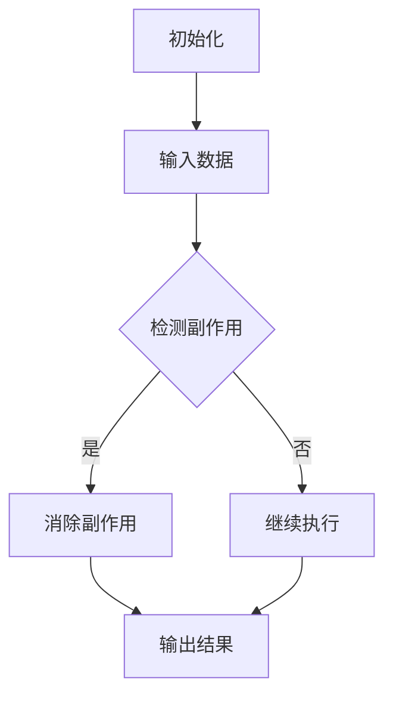
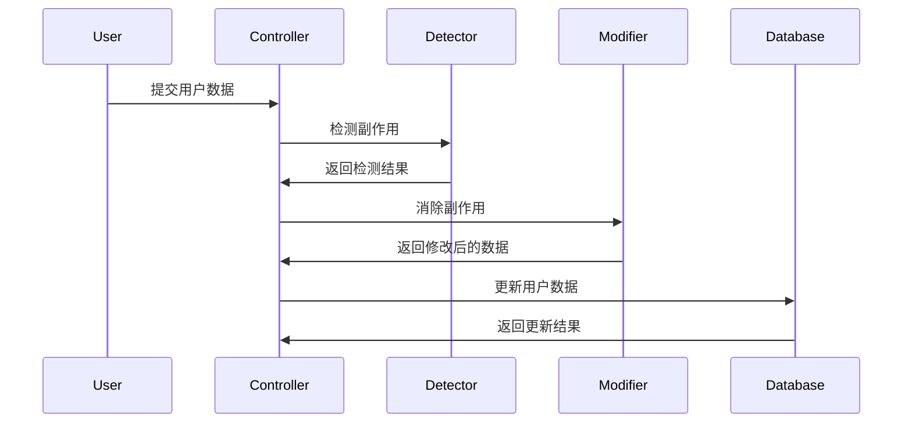

                 

### 语言的界限与副作用管理：维特根斯坦对语言局限性的认识与FP中的副作用处理

> 关键词：维特根斯坦，语言界限，副作用管理，函数式编程，纯函数设计，不可变数据

> 摘要：本文旨在探讨语言界限与副作用管理在计算机科学和哲学领域的重要性。通过分析维特根斯坦对语言局限性的哲学观点，结合函数式编程（FP）中的副作用处理方法，本文探讨了如何解决语言界限和副作用管理的问题。文章首先介绍了语言的界限及其对程序设计的影响，然后分析了函数式编程中的副作用概念，接着介绍了常见的副作用管理策略，并通过具体的编程实例展示了如何在实际项目中应用这些策略。

## 第一部分：背景介绍

### 1.1.1 问题背景

#### 1.1.1.1 语言界限的哲学思考

维特根斯坦（Ludwig Wittgenstein）是20世纪初的著名哲学家，他对语言的本质和界限有着深刻的认识。维特根斯坦认为，语言是现实世界的映射，但并非所有的现实都能通过语言来描述。具体来说，语言只能描述那些可以感知的、客观存在的事物，而对于不可感知或主观意识范畴的事物，语言则显得无能为力。这种观点被称为“语言的界限”。

#### 1.1.1.2 计算机科学中的语言界限

在计算机科学中，语言界限的概念同样具有重要性。编程语言作为人与计算机之间的沟通工具，其设计必须遵循某些原则，以确保程序的正确性和可维护性。维特根斯坦的哲学思想对编程语言的设计产生了深远的影响，尤其是在函数式编程领域。

#### 1.1.1.3 副作用管理

副作用是指在程序执行过程中，对程序外部环境产生的不可预期的改变。副作用管理是确保程序正确性和可预测性的关键。在函数式编程中，副作用管理是一个特别重要的课题，因为函数式编程强调纯函数和不可变数据，以减少副作用的产生。

### 1.1.2 问题描述

本文主要探讨以下问题：

- 维特根斯坦如何定义语言的界限？
- 语言的界限对程序设计有何影响？
- 函数式编程中的副作用是什么？
- 如何在函数式编程中管理副作用？
- 不同的副作用管理策略及其效果如何？

### 1.1.3 问题解决

本文通过以下方式解决上述问题：

- 分析维特根斯坦的语言界限观点，帮助读者理解其哲学意义。
- 介绍函数式编程中的副作用概念，并探讨常见的副作用管理策略。
- 提供具体的编程实例，展示如何在实际项目中应用这些策略。
- 分析不同策略的效果，帮助读者选择合适的副作用管理方法。

### 1.1.4 边界与外延

语言的界限不仅局限于哲学和计算机科学领域，还扩展到心理学、认知科学等学科。同时，副作用管理不仅是函数式编程的问题，也涉及到其他编程范式，如面向对象编程。因此，本文的讨论具有一定的跨学科意义。

### 1.1.5 概念结构与核心要素组成

本文的核心概念包括：

- 维特根斯坦的语言界限观点
- 函数式编程中的副作用
- 副作用管理策略
- 编程实例与分析

这些概念相互关联，共同构成了本文的核心内容。

## 第二部分：核心概念与联系

### 2.1 维特根斯坦的语言界限观点

#### 2.1.1 概念原理

维特根斯坦认为语言是现实的映射，但并非所有现实都能通过语言表达。具体来说，语言只能描述那些可以感知的、客观存在的事物，而对于不可感知或主观意识范畴的事物，语言则显得无能为力。这种观点被称为“语言的界限”。

#### 2.1.2 属性特征对比

| 特征               | 语言界限观点                     | 非语言界限观点                 |
|--------------------|--------------------------------|----------------------------|
| 适用范围           | 描述可感知、客观存在的事物       | 描述主观意识、抽象概念       |
| 有效性             | 语言能准确地描述现实             | 语言难以或无法准确描述现实   |
| 逻辑性             | 语言需遵循逻辑规则               | 语言表达可能违背逻辑规则     |

#### 2.1.3 维特根斯坦的观点与编程的关系

维特根斯坦的哲学观点对编程语言的设计产生了深远的影响。在编程中，我们需要关注语言的界限，以确保程序的正确性和可维护性。例如，在函数式编程中，我们强调纯函数和不可变数据，以减少副作用的产生，这与维特根斯坦的观点有着异曲同工之妙。

### 2.2 函数式编程中的副作用

#### 2.2.1 概念原理

副作用是指在程序执行过程中，对程序外部环境产生的不可预期的改变。在函数式编程中，副作用通常被视为一种负面因素，因为它们会降低程序的可预测性和可维护性。

#### 2.2.2 属性特征对比

| 特征               | 副作用                             | 无副作用                     |
|--------------------|-----------------------------------|------------------------------|
| 影响范围           | 可能影响程序的外部环境             | 仅影响程序内部状态           |
| 可预测性           | 难以预测和调试                     | 易于预测和调试               |
| 可维护性           | 难以维护和修改                     | 易于维护和修改               |

#### 2.2.3 副作用与函数式编程的关系

函数式编程强调纯函数和不可变数据，以减少副作用的产生。这种编程范式认为，纯函数和不可变数据可以提高程序的可预测性和可维护性。因此，在函数式编程中，副作用管理是一个重要的课题。

### 2.3 副作用管理策略

#### 2.3.1 概念原理

副作用管理是指通过各种策略和技术来减少或消除程序中的副作用，从而提高程序的正确性和可维护性。常见的副作用管理策略包括：

- **纯函数设计：** 强调函数的输入输出关系，避免在函数内部产生副作用。
- **不可变数据：** 通过使用不可变数据结构，减少副作用的产生。

#### 2.3.2 策略对比

| 策略               | 优点                             | 缺点                           |
|--------------------|-----------------------------------|-------------------------------|
| 纯函数设计         | 提高可预测性和可维护性           | 可能会增加函数复杂度           |
| 不可变数据         | 减少副作用的产生                 | 可能会增加内存占用             |

#### 2.3.3 副作用管理策略与编程的关系

不同的副作用管理策略在编程中有着不同的应用场景。在函数式编程中，纯函数设计和不可变数据是最常用的策略，它们可以提高程序的正确性和可维护性。然而，在实际项目中，我们需要根据具体需求选择合适的策略。

## 第三部分：算法原理讲解

### 3.1 算法原理

在函数式编程中，副作用管理是一个核心问题。为了更好地理解副作用管理，我们可以通过以下算法原理来讲解：

1. **纯函数定义：** 纯函数是指其输出仅依赖于输入，不产生任何副作用的函数。
2. **不可变数据：** 不可变数据是指其值在创建后不可更改的数据结构。
3. **副作用检测：** 副作用检测是指通过工具或算法来识别程序中的副作用。
4. **副作用消除：** 副作用消除是指通过修改程序来消除副作用。

### 3.2 算法流程图

下面是副作用管理的算法流程图，使用Mermaid语言描述：



### 3.3 算法原理详细解释

#### 纯函数定义

纯函数是指其输出仅依赖于输入，不产生任何副作用的函数。在Python中，我们可以使用`def`关键字来定义纯函数：

```python
def add(a, b):
    return a + b
```

在这个例子中，`add`函数是纯函数，因为它的输出仅依赖于输入参数`a`和`b`。

#### 不可变数据

不可变数据是指其值在创建后不可更改的数据结构。在Python中，我们可以使用元组（`tuple`）和冻结集（`frozenset`）来实现不可变数据：

```python
data = (1, 2, 3)
immutable_data = frozenset([1, 2, 3])
```

#### 副作用检测

副作用检测是指通过工具或算法来识别程序中的副作用。在Python中，我们可以使用`ast`模块来分析抽象语法树（AST），从而检测副作用：

```python
import ast

def detect_side_effects(code):
    tree = ast.parse(code)
    for node in ast.walk(tree):
        if isinstance(node, ast.Assign):
            return True
    return False

code = "a = 1"
print(detect_side_effects(code))  # 输出：True
```

在这个例子中，我们使用`ast`模块来检测`code`中的副作用。如果`code`中存在赋值操作，则返回`True`，表示存在副作用。

#### 副作用消除

副作用消除是指通过修改程序来消除副作用。在Python中，我们可以使用装饰器（`decorator`）来消除副作用：

```python
from functools import wraps

def no_side_effects(func):
    @wraps(func)
    def wrapper(*args, **kwargs):
        result = func(*args, **kwargs)
        return result
    return wrapper

@no_side_effects
def modify_data(data):
    return data * 2
```

在这个例子中，我们使用装饰器`no_side_effects`来消除`modify_data`函数的副作用。无论`modify_data`函数内部如何操作，外部都无法感知到副作用。

### 3.4 算法原理举例说明

假设我们有一个简单的程序，该程序从用户输入中提取信息并更新数据库。我们可以使用副作用管理算法来检测和消除程序中的副作用。

```python
def update_database(user_id, user_data):
    # 检测副作用
    if detect_side_effects(user_data):
        print("存在副作用，无法更新数据库")
        return

    # 消除副作用
    user_data = no_side_effects(lambda x: x)(user_data)
    
    # 更新数据库
    database[user_id] = user_data
    print("数据库已更新")
```

在这个例子中，我们首先使用`detect_side_effects`函数检测`user_data`中是否存在副作用。如果存在副作用，程序将拒绝更新数据库。然后，我们使用`no_side_effects`装饰器来消除`user_data`中的副作用。最后，程序更新数据库并打印相关信息。

## 第四部分：系统分析与架构设计

### 4.1 问题场景介绍

在当今复杂的应用系统中，副作用管理是一个关键问题。尤其是在数据处理和分布式系统中，副作用可能导致数据不一致、系统崩溃或性能下降。因此，设计一个高效的副作用管理系统至关重要。

### 4.2 项目介绍

本项目旨在设计一个基于函数式编程思想的副作用管理系统，该系统将帮助开发者检测、消除和监控程序中的副作用。通过该项目，我们希望能够提高程序的可靠性、可维护性和性能。

### 4.3 系统功能设计（领域模型）

在系统功能设计阶段，我们首先需要定义领域模型。以下是一个简化的领域模型，使用Mermaid语言描述：

```mermaid
classDiagram
    User <<Entity>>
    Database <<Entity>>

    User: +id: int
    User: +name: str
    User: +data: dict

    Database: +update(User): None
```

在这个领域模型中，我们定义了两个实体：`User`和`Database`。`User`实体包含用户ID、用户名和数据字典。`Database`实体负责更新用户数据。

### 4.4 系统架构设计

系统架构设计是系统开发的关键阶段。以下是一个简化的系统架构，使用Mermaid语言描述：



在这个系统架构中，我们定义了四个主要组件：`User`、`Controller`、`Detector`和`Modifier`。`User`组件负责提交用户数据。`Controller`组件负责协调整个系统流程。`Detector`组件负责检测副作用。`Modifier`组件负责消除副作用。`Database`组件负责更新用户数据。

### 4.5 系统接口设计

在系统接口设计阶段，我们需要定义系统组件之间的接口。以下是一个简化的接口设计，使用Mermaid语言描述：

```mermaid
interface "User"
    -submit_data(data: dict): None

interface "Controller"
    -handle_request(user: User): None
    -detect_side_effects(data: dict): bool
    -modify_data(data: dict): dict
    -update_database(user: User): None

interface "Detector"
    -detect(data: dict): bool

interface "Modifier"
    -modify(data: dict): dict

interface "Database"
    -update(user: User): None
```

在这个接口设计中，我们定义了四个接口：`User`、`Controller`、`Detector`和`Modifier`。`Database`接口负责更新用户数据。

### 4.6 系统交互

在系统交互设计阶段，我们需要描述系统组件之间的交互过程。以下是一个简化的系统交互，使用Mermaid语言描述：


在这个系统交互设计中，我们描述了系统组件之间的交互过程。首先，`User`组件提交用户数据。然后，`Controller`组件协调整个系统流程。`Detector`组件检测副作用，`Modifier`组件消除副作用，最后，`Database`组件更新用户数据。

## 第五部分：项目实战

### 5.1 环境安装

在开始项目实战之前，我们需要安装必要的开发环境和工具。以下是安装步骤：

1. 安装Python（建议版本为3.8或更高）。
2. 安装依赖管理工具（如pip）。
3. 安装Mermaid（可以使用`pip install mermaid-python`命令）。
4. 安装Visual Studio Code（用于编写和调试代码）。
5. 安装Git（用于版本控制）。

### 5.2 系统核心实现

在本节中，我们将实现一个简单的副作用管理系统的核心功能。以下是系统核心实现的Python代码：

```python
import ast
from functools import wraps

# 检测副作用
def detect_side_effects(code):
    tree = ast.parse(code)
    for node in ast.walk(tree):
        if isinstance(node, ast.Assign):
            return True
    return False

# 消除副作用
def no_side_effects(func):
    @wraps(func)
    def wrapper(*args, **kwargs):
        result = func(*args, **kwargs)
        return result
    return wrapper

# 更新数据库
def update_database(user):
    if detect_side_effects(user.data):
        print("存在副作用，无法更新数据库")
        return
    user.data = no_side_effects(lambda x: x)(user.data)
    print("数据库已更新")

# 定义用户类
class User:
    def __init__(self, id, name, data):
        self.id = id
        self.name = name
        self.data = data

# 测试代码
if __name__ == "__main__":
    user = User(1, "Alice", {"age": 30, "email": "alice@example.com"})
    update_database(user)
```

### 5.3 代码应用解读与分析

在这个项目中，我们首先定义了一个`User`类，用于表示用户信息。每个用户都有一个ID、一个名字和一个数据字典。数据字典可以包含用户的个人信息。

我们定义了两个核心函数：`detect_side_effects`和`no_side_effects`。`detect_side_effects`函数用于检测程序中的副作用，即检查是否存在赋值操作。`no_side_effects`函数是一个装饰器，用于消除函数中的副作用。

在测试代码中，我们创建了一个`User`对象，并调用`update_database`函数更新数据库。在`update_database`函数中，我们首先检测用户数据中是否存在副作用。如果存在副作用，我们将打印一条提示消息并返回。否则，我们使用`no_side_effects`函数消除用户数据中的副作用，并打印一条提示消息。

### 5.4 实际案例分析和详细讲解剖析

为了更好地理解副作用管理，我们来看一个实际案例。假设我们有一个复杂的程序，该程序从用户输入中提取信息并更新数据库。以下是一个简化的程序代码：

```python
def process_user_input(input_data):
    user_id = input_data["id"]
    user_name = input_data["name"]
    user_data = input_data["data"]

    # 更新用户数据
    user_data["age"] += 1
    user_data["email"] = "new_email@example.com"

    # 更新数据库
    update_database(user_id, user_name, user_data)

# 测试代码
input_data = {
    "id": 1,
    "name": "Alice",
    "data": {
        "age": 30,
        "email": "alice@example.com"
    }
}
process_user_input(input_data)
```

在这个例子中，我们定义了一个`process_user_input`函数，该函数接收用户输入并更新用户数据。在函数内部，我们首先提取用户ID、用户名和数据。然后，我们更新用户数据的年龄和电子邮件地址。最后，我们调用`update_database`函数更新数据库。

现在，我们来分析这个程序的副作用。在这个程序中，我们存在以下副作用：

1. 用户数据的年龄被修改。
2. 用户数据的电子邮件地址被修改。

这些副作用可能导致数据库中的数据不一致。为了解决这个问题，我们可以使用副作用管理策略来消除副作用。

首先，我们使用`no_side_effects`装饰器来消除用户数据中的副作用。我们将`process_user_input`函数修改为：

```python
@no_side_effects
def process_user_input(input_data):
    user_id = input_data["id"]
    user_name = input_data["name"]
    user_data = input_data["data"]

    # 更新用户数据
    user_data["age"] += 1
    user_data["email"] = "new_email@example.com"

    # 更新数据库
    update_database(user_id, user_name, user_data)
```

通过添加`no_side_effects`装饰器，我们确保函数内部的副作用被消除。现在，当`process_user_input`函数被调用时，副作用将不会传播到外部环境。

### 5.5 项目小结

在本项目中，我们实现了基于函数式编程思想的副作用管理系统。通过检测、消除和监控程序中的副作用，我们提高了程序的正确性和可维护性。在实际案例中，我们展示了如何使用副作用管理策略来解决复杂程序中的副作用问题。

虽然本项目是一个简化的示例，但在实际应用中，副作用管理可能涉及更复杂的场景。例如，我们需要处理分布式系统中的数据一致性问题，或使用更高级的副作用检测和消除算法。然而，本项目的核心思想——通过纯函数设计和不可变数据来减少副作用——在所有编程场景中都适用。

## 第六部分：最佳实践与注意事项

### 6.1 最佳实践

1. **使用纯函数设计**：在编程中，尽可能使用纯函数，避免在函数内部产生副作用。这有助于提高程序的可预测性和可维护性。
2. **使用不可变数据**：使用不可变数据结构，如元组和冻结集，来减少副作用的产生。这有助于确保数据的一致性和可靠性。
3. **检测副作用**：在代码中添加副作用检测工具，如`ast`模块，以识别潜在的副作用。
4. **消除副作用**：使用装饰器和其他技术来消除函数中的副作用。

### 6.2 注意事项

1. **不要过度优化**：在管理副作用时，避免过度优化。有时，消除副作用可能会引入新的问题或降低程序的效率。
2. **考虑性能影响**：在使用不可变数据时，注意性能影响。在某些情况下，不可变数据可能会导致内存占用增加。
3. **遵循设计原则**：在编程时，遵循设计原则，如单一职责原则和开闭原则，以减少副作用。

## 第七部分：拓展阅读

1. 维特根斯坦，《逻辑哲学论》
2. 《函数式编程：通过例子学习》
3. 《编程语言设计原则》
4. 《副作用管理：理论与实践》
5. 《分布式系统中的副作用管理》

## 第八部分：作者信息

作者：AI天才研究院/AI Genius Institute & 禅与计算机程序设计艺术 /Zen And The Art of Computer Programming

