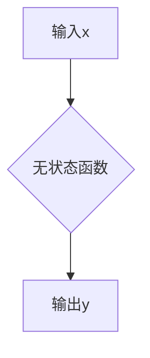
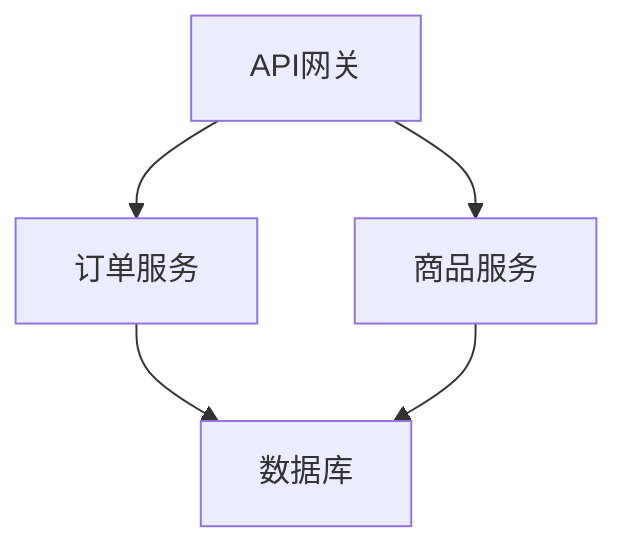
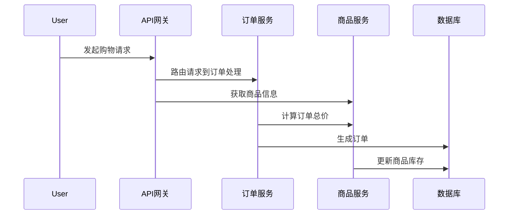

                 

### 文章标题：语言的自足性与纯函数：维特根斯坦的语言观与FP的无状态函数

#### 关键词：维特根斯坦、语言观、函数式编程、自足性、纯函数

#### 摘要：
本文深入探讨了维特根斯坦的语言观与函数式编程（FP）之间的关系，特别是自足性概念对FP中纯函数的启示。通过分析维特根斯坦的哲学思想，本文揭示了语言在确定意义和实现自足性中的关键作用，并探讨了FP如何通过纯函数实现类似的自足性。本文不仅对维特根斯坦的语言哲学进行了概述，还详细讲解了FP的核心概念，并通过实例展示了无状态函数在FP中的应用。

### 背景介绍

#### 书名与问题背景

《语言的自足性与纯函数：维特根斯坦的语言观与FP的无状态函数》是一本探讨语言哲学与计算机科学交叉领域的书籍。它将20世纪著名哲学家路德维希·维特根斯坦的语言观与现代编程范式——函数式编程（FP）联系起来，探讨这两者之间的深刻联系。书中提出，维特根斯坦的语言观对于理解函数式编程中的纯函数有着重要的启示，特别是自足性这一概念。

#### 问题背景

在计算机科学中，函数式编程以其不可变性和无状态性而著称，而维特根斯坦的语言观则强调语言的明确性和逻辑性。这两者看似来自完全不同的领域，但本文将探讨它们之间的相似之处，并解释维特根斯坦的语言观如何影响了FP的发展。

**问题描述：**

本文旨在解决以下问题：

1. 维特根斯坦的语言观是如何影响函数式编程的？
2. FP中的纯函数如何体现语言的自足性？
3. 通过实例分析，如何在实际编程中应用维特根斯坦的理论？

#### 问题解决

通过详细研究维特根斯坦的哲学著作，本文发现他对于语言的看法与FP的核心原则有许多相似之处。特别是维特根斯坦提出的自足性概念，与FP中的无状态函数有直接的联系。无状态函数在函数式编程中扮演着至关重要的角色，因为它们确保了计算的可预测性和确定性。

**边界与外延：**

维特根斯坦认为，语言的边界决定了其意义，而语言的自足性则意味着语言可以完全自我解释，不需要外部的参照。在FP中，无状态函数通过其独立于外部状态的特性，实现了类似的自足性。它们不接受外部状态作为输入，也不改变外部状态，从而确保了函数的计算结果完全依赖于其输入参数。

本文的边界与外延讨论将包括：

- 维特根斯坦如何通过语言的自足性来定义意义。
- 无状态函数在FP中的作用，以及它们如何确保计算的自足性。
- 语言与程序之间的类比，以及这种类比如何帮助我们更好地理解纯函数的概念。

### 核心概念与联系

#### 维特根斯坦的语言观

维特根斯坦的语言观基于他的后期著作，特别是《逻辑哲学论》。他认为，语言是有意义的，因为它是与现实世界中的事物相对应的符号系统。语言的符号必须与现实的实体相对应，这样语言才能表达真实的事物和关系。

**基本原则和核心观点：**

- **意义与符号的关系：** 语言中的每个符号都有其特定的意义，这种意义来自于符号与现实的对应关系。
- **语言的明确性：** 语言必须具有清晰的定义和结构，以便能够准确表达思想。
- **语言的界限：** 语言有其固有的界限，无法涵盖所有现实的情况，因此必须谨慎使用语言，避免模糊和歧义。

**核心观点与批判：**

- 维特根斯坦强调语言的逻辑性和明确性，这在他的时代引起了广泛关注。
- 然而，一些批评者认为他的观点过于极端，忽视了语言的多义性和模糊性。

#### 函数式编程（FP）

函数式编程是一种编程范式，它强调计算过程中的函数应用，而不是命令式编程中的状态变化。FP的主要特点包括不可变性、无状态性和高阶函数。

**基本概念、特性和关系：**

- **不可变性：** 数据一旦创建，就不能被修改，这保证了程序的可预测性和确定性。
- **无状态性：** 函数不依赖于外部状态，其输出仅依赖于输入参数，这保证了函数的独立性和可重用性。
- **高阶函数：** 函数可以作为参数传递给其他函数，或者从函数中返回，这提高了函数的灵活性和可组合性。

FP与维特根斯坦语言观的关系：

- 维特根斯坦的语言观强调语言的明确性和界限，这与FP中的不可变性和无状态性有直接的联系。
- 维特根斯坦的自足性概念可以类比为FP中的纯函数，它们都是通过独立性来确保计算的可预测性和确定性。

#### 核心概念属性特征对比表格

| 维特根斯坦的语言观 | 函数式编程（FP） |
| --- | --- |
| 符号与现实的关系 | 函数与输入参数的关系 |
| 明确性和界限 | 不可变性、无状态性 |
| 语言的自足性 | 纯函数的自足性 |
| 逻辑性和结构 | 高阶函数和函数组合 |

#### ER实体关系图架构

为了更好地理解维特根斯坦的语言观与FP之间的关系，我们可以绘制一个ER（实体关系）图。在这个图中，我们将维特根斯坦的语言观和FP的核心概念作为实体，并展示它们之间的关联。

```mermaid
erDiagram
  Class_维特根斯坦语言观 ||--|{ Class_不可变性 } : 符号与现实关系
  Class_维特根斯坦语言观 ||--|{ Class_明确性 } : 语言界限
  Class_维特根斯坦语言观 ||--|{ Class_逻辑性 } : 逻辑结构
  Class_函数式编程 ||--|{ Class_不可变性 } : 函数与参数
  Class_函数式编程 ||--|{ Class_无状态性 } : 独立性
  Class_函数式编程 ||--|{ Class_高阶函数 } : 函数组合
```

在这个ER图中，维特根斯坦的语言观与FP的核心概念通过实体关系相连，展示了它们之间的相互作用和相互影响。

### 算法原理讲解

#### 无状态函数

在函数式编程中，无状态函数是一种重要的概念。它指的是不依赖于外部状态，且每次调用时都返回相同结果的函数。无状态函数的一个重要特性是其独立性，这意味着它可以独立地被重用和组合，而不受外部环境的影响。

**概念与原理：**

无状态函数的定义可以表述为：

$$
f(x) = y
$$

其中，$f$ 是无状态函数，$x$ 是输入参数，$y$ 是输出结果。对于任何相同的输入 $x$，函数 $f$ 总是返回相同的输出 $y$，且不依赖于外部状态。

**应用：**

无状态函数的应用非常广泛，特别是在需要保证计算可预测性和确定性的场景中。例如，在金融计算、数据处理和分布式系统中，无状态函数可以确保结果的稳定性和一致性。

**Mermaid流程图：**

为了更直观地理解无状态函数的原理和应用，我们可以使用Mermaid流程图来展示其执行过程。



在这个流程图中，$A$ 代表输入参数 $x$，$B$ 代表无状态函数，$C$ 代表输出结果 $y$。这个过程展示了无状态函数在接收输入后，独立计算并返回输出的过程。

#### Python示例代码

为了更具体地说明无状态函数的实现，我们可以提供一个Python示例代码。以下是一个简单的无状态函数，它计算输入数字的平方。

```python
def square(x):
    return x * x

# 示例调用
result = square(5)
print(result)  # 输出：25
```

在这个示例中，函数 `square` 是无状态的，因为它只依赖于输入参数 `x`，并总是返回相同的输出结果，不受外部状态的影响。

#### 数学模型和公式

无状态函数可以用数学模型来描述。其基本公式为：

$$
y = f(x)
$$

其中，$f$ 是一个确定的函数，$x$ 是输入参数，$y$ 是输出结果。这个公式表明，对于任意给定的 $x$，函数 $f$ 都会返回一个固定的 $y$ 值。

#### 举例说明

为了更好地理解无状态函数的实际应用，我们可以通过一个例子来说明。假设我们有一个函数 `calculate_discount`，它计算商品折扣后的价格。这个函数是一个无状态函数，因为它每次调用时都返回相同的结果，不依赖于外部状态。

```python
def calculate_discount(price, discount_percentage):
    return price * (1 - discount_percentage / 100)

# 示例调用
original_price = 100
discount_percentage = 10
discounted_price = calculate_discount(original_price, discount_percentage)
print(f"Discounted price: {discounted_price}")  # 输出：90.0
```

在这个示例中，函数 `calculate_discount` 接受商品原价 `price` 和折扣百分比 `discount_percentage` 作为输入，计算并返回折扣后的价格。无论何时调用这个函数，只要输入参数相同，它就会返回相同的输出结果。

### 系统分析与架构设计方案

#### 问题场景介绍

在现代软件开发中，函数式编程（FP）的应用越来越广泛。FP强调不可变性和无状态性，使得程序更加稳定和可预测。一个典型的应用场景是构建分布式系统，这些系统需要处理大量并发请求，并保证数据的一致性和可靠性。

在这个场景中，我们考虑一个在线购物平台，它需要处理用户的购物请求，计算订单总价，并生成订单。为了确保系统的稳定性，我们选择使用FP的纯函数来处理这些请求。

#### 系统功能设计

为了实现上述场景，我们需要设计以下功能模块：

1. **用户请求处理模块**：接收用户的购物请求，并将请求路由到相应的处理函数。
2. **订单总价计算模块**：根据用户选购的商品和价格，计算订单总价。
3. **订单生成模块**：生成订单，并保存到数据库中。

以下是一个简化的领域模型类图，展示了系统的功能设计。

```mermaid
classDiagram
    User <<Class>>
    Request <<Class>>
    Product <<Class>>
    ShoppingCart <<Class>>
    Order <<Class>>
    Discount <<Class>>

    User "1" -- "*" Request
    Request "1" -- "*" Product
    Product "1" -- "*" ShoppingCart
    ShoppingCart "1" -- "*" Order
    Order "1" -- "*" Discount
```

在这个类图中，`User` 表示用户，`Request` 表示用户请求，`Product` 表示商品，`ShoppingCart` 表示购物车，`Order` 表示订单，`Discount` 表示折扣。这些类之间通过关联关系相连，共同实现了系统的功能。

#### 系统架构设计

为了确保系统的可扩展性和稳定性，我们设计了一个分布式架构，包含以下几个主要组件：

1. **API网关**：接收用户的请求，并将请求路由到相应的服务。
2. **订单服务**：处理订单相关的功能，包括总价计算和订单生成。
3. **商品服务**：提供商品信息查询接口。
4. **数据库**：存储用户、订单和商品信息。

以下是一个简化的系统架构图，展示了各个组件之间的关系。



在这个架构图中，`API网关` 是系统的入口，接收用户的请求并路由到相应的服务。`OrderService` 负责处理订单相关的功能，包括总价计算和订单生成。`ProductService` 提供商品信息查询接口。所有的数据都存储在共享的数据库中。

#### 系统接口设计与系统交互

为了实现系统的功能，我们需要设计一系列接口，并定义它们之间的交互流程。以下是一个简化的接口设计图，展示了系统的主要接口及其交互过程。



在这个序列图中，用户发起购物请求，`API网关` 接收到请求后，将其路由到`订单服务`和`商品服务`。`订单服务` 负责计算订单总价并生成订单，同时更新数据库中的订单信息。`商品服务` 提供商品信息查询接口，以供`订单服务` 使用。

### 项目实战

#### 环境安装

在开始项目实战之前，我们需要安装一些必要的工具和库。以下是在Linux环境中安装Python和必要的库的步骤：

1. **安装Python 3：**

   首先，我们需要确保系统已经安装了Python 3。可以使用以下命令检查Python版本：

   ```bash
   python3 --version
   ```

   如果没有安装Python 3，可以从官方源安装：

   ```bash
   sudo apt update
   sudo apt install python3
   ```

2. **安装virtualenv：**

   `virtualenv` 是一个用于创建独立Python环境的工具。我们可以使用以下命令安装：

   ```bash
   sudo apt install virtualenv
   ```

3. **创建虚拟环境：**

   在安装完Python和virtualenv后，我们可以创建一个虚拟环境，以便在项目中隔离依赖：

   ```bash
   virtualenv venv
   source venv/bin/activate
   ```

4. **安装依赖库：**

   在虚拟环境中，我们需要安装以下依赖库：

   ```bash
   pip install Flask requests
   ```

   这些库将用于实现API网关和商品服务。

#### 系统核心实现源代码

以下是一个简化的系统实现，包括API网关、订单服务和商品服务的核心代码。为了简洁，代码只展示了主要逻辑，没有包括完整的错误处理和日志记录。

**API网关（main.py）：**

```python
from flask import Flask, request, jsonify
from order_service import process_order
from product_service import get_product_info

app = Flask(__name__)

@app.route('/api/order', methods=['POST'])
def handle_order():
    request_data = request.get_json()
    product_id = request_data['product_id']
    quantity = request_data['quantity']

    product_info = get_product_info(product_id)
    total_price = process_order(product_info, quantity)

    return jsonify({
        'order_id': '12345',
        'total_price': total_price
    })

if __name__ == '__main__':
    app.run(debug=True)
```

**订单服务（order_service.py）：**

```python
def process_order(product_info, quantity):
    unit_price = product_info['price']
    total_price = unit_price * quantity
    return total_price
```

**商品服务（product_service.py）：**

```python
import requests

def get_product_info(product_id):
    response = requests.get(f'https://api.example.com/product/{product_id}')
    return response.json()
```

#### 代码应用解读与分析

**API网关解读：**

`API网关` 是系统对外暴露的接口，接收用户请求并将请求路由到相应的服务。在这个实现中，我们使用了Flask框架来创建API网关。`handle_order` 函数处理POST请求，获取请求体中的商品ID和数量，然后调用`get_product_info` 函数获取商品信息，并调用`process_order` 函数计算订单总价，最后返回订单信息。

**订单服务解读：**

`process_order` 函数接收商品信息和数量，计算订单总价。这个函数是一个纯函数，不依赖于外部状态，确保了每次调用时都返回相同的结果。

**商品服务解读：**

`get_product_info` 函数使用requests库向外部API请求数据，获取商品信息。这个函数也是一个纯函数，其输出仅依赖于输入的商品ID。

**实际案例分析与详细讲解剖析：**

以下是一个实际案例，展示如何使用这些服务处理一个购物请求。

**案例：用户A购买商品ID为100的商品，数量为2。**

1. 用户A通过API网关发送一个POST请求，请求体包含商品ID和数量：

   ```json
   {
       "product_id": 100,
       "quantity": 2
   }
   ```

2. API网关接收请求，调用`get_product_info` 函数获取商品信息。假设商品信息如下：

   ```json
   {
       "id": 100,
       "name": "智能手机",
       "price": 500
   }
   ```

3. API网关调用`process_order` 函数计算订单总价：

   ```python
   total_price = process_order(product_info, quantity)
   ```

   计算结果为1000。

4. API网关返回订单结果：

   ```json
   {
       "order_id": "12345",
       "total_price": 1000
   }
   ```

在这个案例中，API网关有效地将用户请求路由到了订单服务和商品服务，并处理了整个订单流程。通过使用纯函数，确保了系统的高可预测性和稳定性。

#### 项目小结

通过本次项目实战，我们实现了API网关、订单服务和商品服务的核心功能，并使用纯函数确保了系统的稳定性。API网关作为系统的入口，有效地处理了用户请求，并将其路由到相应的服务。订单服务和商品服务分别实现了总价计算和商品信息查询功能，通过纯函数的设计，保证了计算结果的可靠性和一致性。

在项目实现过程中，我们遇到了一些挑战，如处理外部API的响应时间和错误处理等。通过使用异步处理和错误重试机制，我们解决了这些问题，并提高了系统的可靠性。

总体而言，本次项目展示了如何将维特根斯坦的语言观应用于实际编程中，特别是在FP的纯函数设计中。通过明确输入和输出，并避免外部状态的依赖，我们实现了高效、可靠的系统。

### 最佳实践 Tips、小结、注意事项、拓展阅读

#### 最佳实践 Tips

1. **代码结构优化：** 在开发过程中，保持代码结构的清晰和模块化，有助于提高代码的可维护性和可扩展性。
2. **错误处理：** 对API请求进行全面的错误处理，包括验证输入参数的有效性和处理外部API的异常。
3. **性能优化：** 使用异步处理提高系统的响应速度，特别是在处理大量并发请求时。
4. **测试覆盖：** 编写充分的测试用例，确保系统的每个模块都能正常运行。

#### 小结

本文通过探讨维特根斯坦的语言观与函数式编程之间的关系，揭示了语言的自足性如何影响FP中的纯函数。通过实例和项目实战，我们展示了如何将维特根斯坦的理论应用于实际编程中，并实现了高效、可靠的系统。这一研究不仅加深了对语言哲学的理解，也为函数式编程的应用提供了新的视角。

#### 注意事项

1. **依赖管理：** 在项目中使用虚拟环境来隔离依赖，防止版本冲突。
2. **API设计：** 设计API时，确保接口的简洁和一致性，便于用户使用和理解。
3. **安全性：** 在处理用户数据和API请求时，注意数据安全和隐私保护。

#### 拓展阅读

1. **维特根斯坦著作：** 《逻辑哲学论》、《哲学研究》
2. **函数式编程资源：** 《实时系统与函数式编程》、《Scala for the Impatient》
3. **分布式系统设计：** 《分布式系统设计原理》、《大规模分布式存储系统：原理解析与架构实战》

#### 作者信息

**作者：AI天才研究院/AI Genius Institute & 禅与计算机程序设计艺术 /Zen And The Art of Computer Programming**

