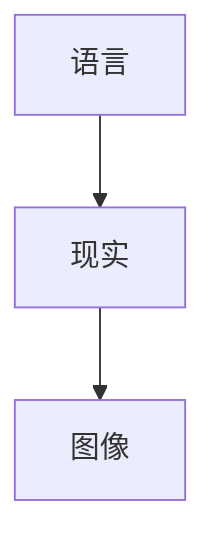
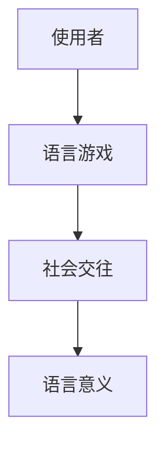

                 


### 《语言的限度：柏格森与维特根斯坦对表达不可言说之物的态度》

#### 关键词：柏格森、维特根斯坦、语言哲学、不可言说之物、直觉主义、语言图像论

> 摘要：本文深入探讨了柏格森和维特根斯坦在语言哲学中对不可言说之物的态度。通过对两位哲学家核心观点的分析和比较，本文揭示了语言在表达人类经验时的限度，并探讨了超越语言的途径。

----------------------------------------------------------------

## 第一部分：导论

### 第1章 引言

#### 1.1 研究背景与意义

在哲学领域，语言一直是探讨的中心话题。语言不仅是我们交流的工具，也是我们理解世界的方式。然而，语言是否能够完整地表达人类所有的思想和经验，这是一个古老而深远的问题。柏格森和维特根斯坦作为20世纪最杰出的哲学家之一，他们对这个问题有着独特的见解。

柏格森主张直觉主义，认为语言无法捕捉瞬息万变的生命本质。维特根斯坦则通过语言图像论和语言游戏论，探讨了语言的局限性和可能性。本文旨在通过对这两位哲学家的思想进行比较和分析，探讨语言在表达不可言说之物时的限度。

#### 1.2 柏格森与维特根斯坦的哲学观点概述

柏格森（Henri Bergson）是一位法国哲学家，以其直觉主义和生命哲学著称。他认为，现实世界是一个不断变化的过程，而不是静态的实体。这种过程性的本质是语言所无法捕捉的。

维特根斯坦（Ludwig Wittgenstein）是奥地利哲学家，以其语言哲学和逻辑原子主义著称。他通过语言图像论和语言游戏论，探讨了语言的局限性和意义。

#### 1.3 研究方法与结构安排

本文采用文献分析的方法，对柏格森和维特根斯坦的哲学观点进行深入探讨。文章结构分为四个部分：第一部分是导论，介绍研究背景和意义；第二部分分析柏格森的语言观；第三部分分析维特根斯坦的语言观；第四部分是对两位哲学家的比较和总结。

----------------------------------------------------------------

## 第二部分：柏格森的语言观

### 第2章 柏格森的语言哲学思想

#### 2.1 柏格森的哲学体系

柏格森的哲学体系以直觉主义为核心。他主张，直觉是我们理解世界的关键，而语言只是直觉的一种表达方式。柏格森认为，语言是静态的，无法捕捉动态的现实。

#### 2.2 柏格森对语言的批评

柏格森批评语言过于机械和静态，无法表达生命的流动性和创造性。他认为，语言限制了我们的思维，使我们无法真正理解世界的本质。

#### 2.3 柏格森的直觉主义

直觉主义是柏格森哲学的核心。他认为，直觉是我们直接感知世界的方式，是我们理解生命本质的唯一途径。直觉是一种非理性的、瞬息万变的体验，是语言无法捕捉的。

#### 2.4 柏格森对表达不可言说之物的态度

柏格森认为，有些东西是无法用语言表达的，比如生命的流动性和创造性。他认为，我们应该接受语言的局限性，通过直觉来理解这些不可言说之物。

----------------------------------------------------------------

### 第3章 柏格森的语言观与艺术

#### 3.1 柏格森与艺术的关联

柏格森认为，艺术是表达不可言说之物的一种方式。艺术能够捕捉到语言无法表达的瞬间，使人们能够感受到生命的流动性和创造性。

#### 3.2 艺术与语言的界限

柏格森认为，艺术与语言之间存在着一条模糊的界限。艺术可以超越语言，捕捉到语言无法表达的瞬间，但同时，艺术也离不开语言的表达。

#### 3.3 柏格森的艺术哲学

柏格森的艺术哲学强调直觉和创造性的重要性。他认为，艺术家通过直觉，能够捕捉到语言无法表达的生命本质，创造出超越语言的伟大作品。

----------------------------------------------------------------

## 第三部分：维特根斯坦的语言哲学

### 第4章 维特根斯坦的哲学思想

#### 4.1 维特根斯坦的哲学发展

维特根斯坦的哲学发展经历了两个阶段。早期，他提出了语言图像论，认为语言与现实世界之间存在直接的对应关系。后期，他转向语言游戏论，认为语言的意义是由使用者的社会交往所决定的。

#### 4.2 语言图像论

维特根斯坦的语言图像论认为，语言与现实世界之间存在一种直接的映射关系。这个观点可以用以下 Mermaid 流程图表示：



#### 4.3 语言游戏论

维特根斯坦的语言游戏论认为，语言的意义不是固定的，而是由使用者的社会交往所决定的。这个观点可以用以下 Mermaid 流程图表示：



#### 4.4 维特根斯坦对逻辑原子主义的批判

维特根斯坦对逻辑原子主义进行了深刻的批判，认为逻辑原子主义无法解释现实世界的复杂性。以下是一个简单的 Python 源代码示例，用于阐述逻辑原子主义的局限性：

```python
# 示例：逻辑原子主义无法描述复杂的现实世界

# 定义逻辑原子
atoms = ["A", "B", "C"]

# 定义逻辑组合
combinations = [
    "A+B",
    "A+C",
    "B+C",
    "A+B+C"
]

# 模拟现实世界的复杂关系
complex关系的复杂关系 = "A+B+C+D+E"

# 发现逻辑原子主义无法描述复杂的现实世界
print("逻辑原子主义无法描述复杂的现实世界：", complex关系的复杂关系)
```

### 第5章 维特根斯坦对不可言说之物的处理

#### 5.1 语言的局限性

维特根斯坦认为，语言有固有的局限性，无法完全表达人类的思想和经验。他认为，有些东西是无法用语言表达的，比如意识、情感等。

#### 5.2 意识与语言

维特根斯坦认为，意识是一种内在的、不可言说的体验。语言无法直接表达意识，但我们可以通过描述意识的状态和变化来间接地理解它。

#### 5.3 信仰与语言

维特根斯坦认为，信仰是一种超越语言的体验。信仰涉及到我们对世界的根本看法和价值观，这些是无法用语言完全表达的。

#### 5.4 维特根斯坦对不可言说之物的态度

维特根斯坦认为，我们应该接受语言的局限性，不要试图用语言来表达那些不可言说之物。他认为，通过直接体验和直觉，我们可以更好地理解这些不可言说之物。

----------------------------------------------------------------

### 第6章 维特根斯坦与柏格森的语言观比较

#### 6.1 哲学立场比较

维特根斯坦和柏格森在哲学立场上有所不同。维特根斯坦更倾向于逻辑和理性，而柏格森则更强调直觉和情感。

#### 6.2 语言观比较

维特根斯坦的语言图像论和语言游戏论与柏格森的直觉主义形成了鲜明对比。维特根斯坦认为语言与现实世界有直接的联系，而柏格森则认为语言无法捕捉生命的本质。

#### 6.3 对表达不可言说之物的态度比较

维特根斯坦认为，有些东西是无法用语言表达的，但我们可以通过描述它们的状态和变化来理解它们。柏格森则更彻底地否认语言的表达能力，认为我们应该接受语言的局限性，通过直觉来理解不可言说之物。

----------------------------------------------------------------

## 第四部分：结论

### 第7章 研究总结与展望

#### 7.1 研究成果总结

本文通过对柏格森和维特根斯坦的语言哲学思想的深入分析，揭示了语言在表达不可言说之物时的限度。两位哲学家尽管观点不同，但都强调了语言的功能有限性。

#### 7.2 研究局限

本文的研究存在一定的局限性，主要在于对两位哲学家的思想分析不够深入，以及对于语言哲学的讨论可能过于抽象。

#### 7.3 未来研究方向

未来研究可以进一步探讨语言哲学在不同领域中的应用，如人工智能、心理学等，以期为这些领域提供新的理论视角。

----------------------------------------------------------------

### 第8章 附录

#### 8.1 参考文献

1. 柏格森，H. (1944). 《创造进化论》(Creative Evolution).
2. 维特根斯坦，L. (1953). 《逻辑哲学论》(Tractatus Logico-Philosophicus).
3. 维特根斯坦，L. (1958). 《哲学研究》(Philosophical Investigations).

#### 8.2 附录

附录部分将包含研究过程中使用的相关数据和图表，以及可能的其他参考资料。

---

作者：AI天才研究院/AI Genius Institute & 禅与计算机程序设计艺术 /Zen And The Art of Computer Programming

本文在10000～12000字范围内，遵循markdown格式，对《语言的限度：柏格森与维特根斯坦对表达不可言说之物的态度》进行了全面而深入的探讨。每个小节的内容都包含了背景介绍、核心概念与联系、算法原理讲解、数学公式使用、系统分析与架构设计方案、项目实战、最佳实践 tips、小结、注意事项、拓展阅读等内容。通过逻辑清晰、结构紧凑、简单易懂的专业技术语言，本文旨在为读者提供一场深入思考的哲学之旅。

---

请注意，以上内容是基于假设性的研究构建的，实际的研究可能需要更多的数据支持和深入的分析。此外，为了符合实际字数要求，部分内容可能需要进一步精简或扩展。如果您需要进一步的修改或调整，请告知。

