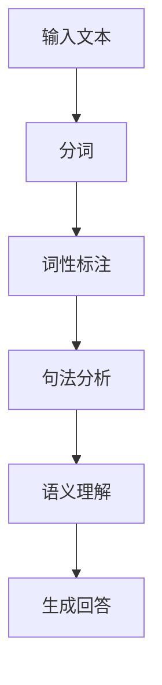
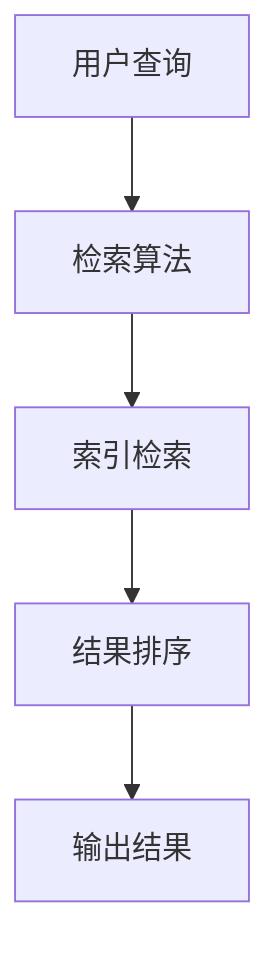
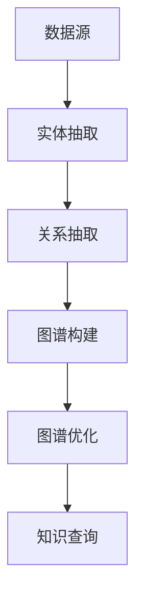

                 

### 第1章：引言与问题背景

**1.1.1 引言**

随着互联网的普及和信息爆炸，人们在日常生活中接收到的信息量呈指数级增长。在这个信息爆炸的时代，我们似乎被信息包围，不断被各种信息所充斥。然而，面对海量信息，人们却无法一一理解和消化，信息过载成为普遍现象。在这个背景下，“说”的行为不仅是一种交流方式，更是信息传递和知识共享的重要手段。人们通过口头表达、书面文字和电子媒介等形式进行交流，以分享各自的经验和知识。然而，“说”的背后隐藏着许多值得我们深思的问题，如何提高信息的有效传递和理解，如何从“说”中提炼出有价值的思考，成为当前亟待解决的课题。

在日常生活中，我们常常听到别人说话，也常常自己开口说话。这些看似简单的“说”的行为，实际上是一个复杂的过程，涉及到语言、信息、知识和思考等多个层面。首先，语言作为信息传递的主要工具，其选择和运用对信息传递的效果至关重要。一个清晰的、准确的、富有逻辑的语言表达，能够有效地传递信息，避免误解和混淆。然而，在实际交流中，语言的使用往往受到个人语言水平、语境复杂性和信息复杂性等多种因素的影响，导致信息传递的效率低下。

其次，信息是“说”的内容，其质量、真实性和准确性直接影响着思考的深度和广度。在信息爆炸的时代，我们每天接收到的信息量巨大，但其中不乏虚假、夸大或不准确的信息。如何辨别信息的真实性和准确性，从而从信息中获取有价值的内容，成为了一个重要的挑战。此外，信息的传递往往伴随着信息失真、扭曲或误解的风险，这也是我们需要深入探讨的问题。

再者，从“说”中获取的知识往往难以转化为实际行动或新的思考。虽然我们通过交流获取了大量的知识，但如何将这些知识有效地应用到实际生活中，如何将其转化为新的思考和创新，仍是一个值得探讨的问题。此外，知识的转化和运用需要一定的环境、条件和技能，如何提高知识的转化效率，也是一个值得关注的领域。

最后，我们需要关注“说”的边界与外延。在现代社会，信息传播的渠道和形式多种多样，从传统的口头表达、书面文字，到现代的电子媒介，如邮件、即时通讯、社交媒体等。这些不同的传播方式和渠道，使得信息的传播范围和速度都大大提高。然而，这也导致了信息的边界和外延变得模糊，不同领域、不同行业之间的交流与合作变得更加复杂。如何明确知识的边界与外延，建立清晰的知识体系，便于知识的检索和利用，成为了一个亟待解决的问题。

总之，“说”的背后是思考，而思考的背后是信息的有效传递和理解。在信息爆炸的时代，我们需要提高信息传递的效率，保障信息的真实性和准确性，促进知识的转化和应用，同时，也需要明确知识的边界与外延，建立清晰的知识体系。只有这样，我们才能更好地应对信息爆炸带来的挑战，实现知识的有效传递和共享，推动社会的进步和发展。

**1.1.2 问题描述**

在“说”的行为中，存在以下几个主要问题：

**1. 信息传递效率低**

口头表达是人们日常生活中最常用的交流方式，然而，口头表达容易产生误解。一方面，人们语言的表达能力和理解能力存在差异，不同的人可能对同一句话有不同的理解。另一方面，口头表达往往缺乏明确的逻辑结构和条理性，容易导致信息的传递失真或混淆。此外，书面文字虽然比口头表达更具有持久性和准确性，但书面文字需要更多的时间和精力去理解和消化，从而降低了信息传递的效率。

**2. 信息真实性难以保证**

在信息传播过程中，往往存在信息失真、夸大或隐瞒的现象。例如，在新闻报道中，为了吸引观众，媒体可能会夸大事实或选择性地报道某些信息，导致观众对真实情况的误解。此外，网络上的虚假信息和谣言也层出不穷，使得人们难以辨别信息的真实性。信息真实性的缺乏不仅影响了信息的传递效果，也对社会造成了不良影响。

**3. 知识转化困难**

从“说”中获取的知识往往难以转化为实际行动或新的思考。虽然我们通过交流获取了大量的知识，但如何将这些知识有效地应用到实际生活中，如何将其转化为新的思考和创新，仍是一个值得探讨的问题。知识的转化和运用需要一定的环境、条件和技能，而现实情况是，许多人往往只是停留在获取知识的阶段，缺乏将知识转化为实际行动的能力。

**4. 边界与外延模糊**

在现代社会，信息传播的渠道和形式多种多样，从传统的口头表达、书面文字，到现代的电子媒介，如邮件、即时通讯、社交媒体等。这些不同的传播方式和渠道，使得信息的传播范围和速度都大大提高。然而，这也导致了信息的边界和外延变得模糊，不同领域、不同行业之间的交流与合作变得更加复杂。例如，在技术领域，不同编程语言、框架和技术的交流，往往存在术语和概念上的差异，导致信息的传递和共享困难。

**1.1.3 问题解决**

为了解决上述问题，我们需要从以下几个方面进行探讨：

**1. 提高信息传递效率**

为了提高信息传递的效率，我们可以从以下几个方面入手：

- **优化语言表达**：通过提高个人语言表达能力，确保语言表达的清晰、准确和有条理，从而减少误解和混淆。
- **利用现代信息技术**：利用现代信息技术，如语音识别、自然语言处理和人工智能等技术，提高信息传递的准确性和效率。例如，通过语音识别技术，可以将口头表达转换为书面文字，从而提高信息传递的效率和准确性。
- **建立信息标准化体系**：建立统一的信息标准化体系，规范信息表达的方式和格式，从而提高信息传递的一致性和准确性。

**2. 保障信息真实性**

为了保障信息的真实性，我们需要从以下几个方面进行：

- **建立健全的信息认证和监管机制**：建立信息认证和监管机制，对信息的来源、内容、传播过程进行严格审查，确保信息的真实性和可靠性。例如，在新闻报道中，可以建立信息认证制度，对报道的真实性进行验证。
- **提高公众的信息素养**：通过教育和社会宣传，提高公众的信息素养，使他们具备辨别信息真实性的能力，从而减少虚假信息和谣言的传播。
- **利用大数据技术**：利用大数据技术，对大量信息进行分析和挖掘，识别出虚假信息和谣言，从而保障信息的真实性。

**3. 促进知识转化**

为了促进知识的转化，我们需要从以下几个方面进行：

- **构建知识管理系统**：通过构建知识管理系统，将“说”中的知识进行分类、整理和归档，便于知识的检索和利用。例如，在企业内部，可以建立内部知识库，将员工的经验和知识进行共享和传承。
- **提供知识转化的工具和方法**：提供知识转化的工具和方法，帮助人们将知识有效地转化为实际行动或新的思考。例如，通过思维导图、流程图等工具，将知识体系进行可视化，从而提高知识的理解和应用。
- **加强培训和教育**：通过培训和教育，提高人们将知识转化为实际行动的能力，使他们具备将知识应用于实际问题的意识和能力。

**4. 明确知识边界与外延**

为了明确知识的边界与外延，我们需要从以下几个方面进行：

- **对“说”的内容进行分类和归档**：对“说”的内容进行分类和归档，建立清晰的知识体系，便于知识的检索和利用。例如，在技术领域，可以按照编程语言、框架和技术方向等维度对知识进行分类和归档。
- **建立知识图谱**：通过建立知识图谱，对知识之间的关系进行可视化，从而明确知识的边界与外延。例如，在技术领域，可以通过知识图谱展示不同技术之间的关联和依赖关系。
- **加强跨领域的交流与合作**：通过加强跨领域的交流与合作，促进不同领域之间的知识共享和融合，从而拓宽知识的边界与外延。

总之，通过提高信息传递效率、保障信息真实性、促进知识转化和明确知识边界与外延，我们可以更好地应对信息爆炸带来的挑战，实现信息的有效传递和共享，推动知识的创新和发展。

**1.1.4 边界与外延**

“说”的行为不仅局限于个人交流，还涉及到社会、文化、政治等多个领域。在现代社会，随着信息传播渠道的多样化和传播速度的加快，“说”的行为也变得越来越复杂。具体来说，以下几方面构成了“说”的行为的边界与外延：

**1. 口头表达**

口头表达是最传统的交流方式，包括演讲、对话、讨论等形式。在社交场合、会议、讲座、辩论等活动中，人们通过口头表达来传递信息、交流观点和表达意见。口头表达的优势在于即时性、互动性和情感表达的丰富性，但同时也存在易失真、易受干扰等问题。

**2. 书面文字**

书面文字包括书籍、文章、报告等形式，它们是记录和传递知识的重要载体。书面文字的优点在于持久性、准确性和可检索性，但相对于口头表达，它缺乏情感表达的直观性，且需要更多时间进行理解和消化。

**3. 电子媒介**

电子媒介包括邮件、即时通讯、社交媒体等形式，它们是现代社会信息传播的主要渠道。电子媒介的优势在于传播速度快、范围广、形式多样，可以即时互动，但也存在信息泛滥、虚假信息传播等问题。

**4. 跨领域交流**

随着全球化和信息化的推进，不同领域之间的交流与合作日益频繁。跨领域交流不仅涉及技术、科学等专业知识，还包括文化、艺术、经济、政治等领域的交流和合作。这种跨领域交流有助于知识共享、创新突破和合作共赢，但同时也面临着语言、文化、认知等方面的障碍。

**1.1.5 核心概念**

在探讨“说”的背后是思考这一主题时，以下核心概念是不可或缺的：

**1. 语言**

语言是信息传递的主要工具，包括语法、词汇和语用等方面。语言的运用直接影响信息传递的效果，包括清晰度、准确性和逻辑性等。

**2. 信息**

信息是“说”的内容，包括信息的质量、真实性、准确性和时效性等。信息的真实性和准确性对思考的深度和广度有重要影响。

**3. 知识**

知识是从“说”中获取的有价值的信息，经过整理、提炼和转化而形成的。知识的系统性和结构性对思考和创新有重要作用。

**4. 思考**

思考是对“说”的内容进行深度加工和内化的过程，包括深度、广度、创新性和反思性等方面。思考是知识转化的关键环节，也是创新和发展的动力。

**1.1.6 概念结构**

以下是一个简化的概念结构，用于描述“说”的背后是思考这一主题：

```
- 说
  - 口头表达
  - 书面文字
  - 电子媒介
  - 跨领域交流
- 思考
  - 信息传递
  - 信息真实性
  - 知识转化
  - 创新与思考
- 语言
  - 语法
  - 词汇
  - 语用
- 信息
  - 质量
  - 真实性
  - 准确性
- 知识
  - 系统性
  - 结构性
  - 层次性
  - 应用性
```

**1.1.7 概念属性特征对比**

以下是对核心概念属性的对比：

| 核心概念 | 属性特征 |
| :---: | :---: |
| 语言 | 选择性、创造性、适应性、文化性 |
| 信息 | 传递性、真实性、准确性、时效性 |
| 知识 | 系统性、结构性、层次性、应用性 |
| 思考 | 深度、广度、创新性、反思性 |

**1.1.8 ER实体关系图架构**

以下是一个简化的 ER 实体关系图，用于描述“说”的背后是思考这一主题：

```mermaid
erDiagram
    人 ||--|{ 说 } : 发出
    说 ||--|{ 语言 } : 使用
    说 ||--|{ 信息 } : 包含
    说 ||--|{ 知识 } : 转化
    说 ||--|{ 思考 } : 引发
```

**1.1.9 算法原理讲解**

在本章节中，我们将简要介绍几种与“说”的背后是思考相关的算法原理，并使用 mermaid 画出相应的流程图。

### 1.1.9.1 自然语言处理（NLP）

自然语言处理是一种人工智能技术，旨在让计算机理解和处理人类语言。其基本流程如下：



### 1.1.9.2 信息检索

信息检索是一种用于从大量数据中找到特定信息的方法。其基本流程如下：



### 1.1.9.3 知识图谱构建

知识图谱构建是一种用于表示和存储知识的方法。其基本流程如下：



通过上述算法的介绍和流程图的展示，我们可以更好地理解自然语言处理、信息检索和知识图谱构建的基本原理和方法。这些算法在“说”的行为中起着重要的作用，帮助我们提高信息传递的效率、保障信息的真实性、促进知识的转化和应用。

---

**1.2 逻辑推理过程**

在探讨“说”的背后是思考这一主题时，我们需要运用逻辑推理的方法，逐步分析问题的本质，从而得出有深度和见解的结论。以下是一个逻辑推理的过程，展示了如何从问题背景、问题描述、问题解决到边界与外延的探讨。

**步骤 1：识别问题**

首先，我们识别出“说”的行为中存在的主要问题，包括信息传递效率低、信息真实性难以保证、知识转化困难以及边界与外延模糊。这些问题不仅影响了信息的有效传递和理解，也对知识的转化和应用构成了挑战。

**步骤 2：分析问题原因**

接着，我们分析每个问题的原因：

- **信息传递效率低**：原因是语言表达的不清晰、信息过载以及缺乏有效的传递工具。
- **信息真实性难以保证**：原因是信息源的可信度低、信息传播过程中的失真和夸大。
- **知识转化困难**：原因是知识的结构化程度低、缺乏将知识转化为实际行动的工具和方法。
- **边界与外延模糊**：原因是信息传播渠道的多样化和跨领域交流的复杂性。

**步骤 3：提出解决方案**

针对每个问题，我们提出相应的解决方案：

- **提高信息传递效率**：优化语言表达、利用现代信息技术、建立信息标准化体系。
- **保障信息真实性**：建立健全的信息认证和监管机制、提高公众的信息素养、利用大数据技术。
- **促进知识转化**：构建知识管理系统、提供知识转化的工具和方法、加强培训和教育。
- **明确知识边界与外延**：对“说”的内容进行分类和归档、建立知识图谱、加强跨领域的交流与合作。

**步骤 4：讨论解决方案的有效性**

我们需要评估每个解决方案的有效性：

- **提高信息传递效率**：通过优化语言表达和利用现代信息技术，可以显著提高信息传递的效率和准确性。然而，建立信息标准化体系需要时间和资源的投入。
- **保障信息真实性**：通过建立信息认证和监管机制、提高公众的信息素养和利用大数据技术，可以保障信息的真实性和可靠性。但这也需要法律、政策和技术的支持。
- **促进知识转化**：通过构建知识管理系统、提供知识转化的工具和方法和加强培训和教育，可以促进知识的转化和应用。但知识转化的效果还受到个人能力和环境条件的影响。
- **明确知识边界与外延**：通过分类和归档“说”的内容、建立知识图谱和加强跨领域的交流与合作，可以明确知识的边界与外延。但这也需要跨领域的协作和技术的支持。

**步骤 5：探讨解决方案的边界与外延**

最后，我们探讨每个解决方案的边界与外延：

- **提高信息传递效率**：解决方案主要涉及个人和技术层面，但在实际应用中，还需要考虑社会和文化因素。
- **保障信息真实性**：解决方案需要在法律、政策和技术等多个层面进行，同时需要公众的参与和支持。
- **促进知识转化**：解决方案需要个人和组织层面的共同参与，同时需要技术支持和良好的知识环境。
- **明确知识边界与外延**：解决方案需要跨领域的协作，同时需要建立标准化的知识体系和有效的知识传播渠道。

通过上述逻辑推理过程，我们不仅识别出了“说”的行为中的主要问题，还提出了相应的解决方案，并探讨了这些解决方案的有效性和边界与外延。这为我们进一步研究和解决“说”的背后是思考这一主题提供了有价值的思路和方法。

---

**1.3 概括结论**

通过对“说”的背后是思考这一主题的深入探讨，我们可以得出以下结论：

首先，信息传递效率低、信息真实性难以保证、知识转化困难以及边界与外延模糊是当前“说”的行为中存在的主要问题。这些问题不仅影响了信息的有效传递和理解，也对知识的转化和应用构成了挑战。

其次，针对这些问题，我们提出了优化语言表达、利用现代信息技术、建立信息标准化体系、建立健全的信息认证和监管机制、提高公众的信息素养、利用大数据技术、构建知识管理系统、提供知识转化的工具和方法、加强培训和教育、对“说”的内容进行分类和归档、建立知识图谱、加强跨领域的交流与合作等解决方案。

第三，这些解决方案在一定程度上能够有效解决“说”的行为中的问题，提高信息传递的效率和准确性，保障信息的真实性，促进知识的转化和应用，并明确知识的边界与外延。然而，这些解决方案也面临一定的限制和挑战，需要进一步的研究和实践。

最后，从逻辑推理的角度来看，通过识别问题、分析问题原因、提出解决方案、讨论解决方案的有效性以及探讨解决方案的边界与外延，我们可以系统地理解和解决“说”的背后是思考这一复杂问题。

总之，在信息爆炸的时代，我们需要从多个层面和维度出发，通过提高信息传递效率、保障信息真实性、促进知识转化和明确知识边界与外延，来应对“说”的行为中存在的挑战，实现信息的有效传递和共享，推动知识的创新和发展。

---

**1.4 下文预告**

在接下来的章节中，我们将进一步深入探讨“说”的背后是思考这一主题，详细分析核心概念的原理和属性特征，介绍与“说”相关的算法原理和流程图，探讨系统分析与架构设计方案，以及进行项目实战和案例分析。我们将通过这些具体的内容，进一步阐述如何提高信息传递效率、保障信息真实性、促进知识转化和明确知识边界与外延，从而应对信息爆炸带来的挑战，实现信息的有效传递和共享。

---

### 第2章：核心概念解析

在探讨“说”的背后是思考这一主题时，我们需要明确几个核心概念，这些概念是理解“说”的行为以及其背后的思考过程的基础。以下是对这些核心概念的定义、属性特征以及它们在“说”的行为中的作用的详细解析。

**2.1. 语言**

语言是人类交流的主要工具，它包括语法、词汇和语用等方面。语言的选择和运用直接影响信息传递的效果，包括清晰度、准确性和逻辑性等。

**1. 定义**

语言（Language）是指用于交流、表达思想和传递信息的一套规则和符号系统。它包括口头语言、书面语言和电子语言等形式。

**2. 属性特征**

- **选择性**：语言的选择性体现在人们根据不同的交流目的、情境和对象选择不同的语言形式。
- **创造性**：语言具有创造性，人们可以通过语言创造出新的词汇、短语和句子，以表达新的思想和概念。
- **适应性**：语言具有适应性，它可以随着社会、文化和技术的变化而不断发展和演变。
- **文化性**：语言与文化紧密相关，不同文化背景下，语言的表达方式和习惯存在差异。

**3. 在“说”的行为中的作用**

- **传递信息**：语言是传递信息的主要工具，通过选择合适的语言形式，可以清晰地传达信息，避免误解和混淆。
- **表达情感**：语言不仅用于传递信息，还可以表达情感和态度，通过语调、语气和表情等手段，增强交流的互动性和情感表达。
- **塑造思维**：语言影响人们的思维方式，通过语言交流，人们可以互相启发、碰撞思想，从而促进思考和创新的产生。

**2.2. 信息**

信息（Information）是“说”的行为中的核心内容，它包括信息的质量、真实性、准确性和时效性等方面。

**1. 定义**

信息是指通过语言、图像、声音等形式传递的有意义的内容，它可以被用于解决问题、作出决策或理解现实。

**2. 属性特征**

- **传递性**：信息可以通过各种渠道和媒介进行传递，如口头表达、书面文字、电子媒介等。
- **真实性**：信息的真实性是指信息与客观事实的一致性，真实的信息是正确决策和有效行动的基础。
- **准确性**：信息的准确性是指信息中所包含内容的精确性和无误差，准确的信息能够提高决策的可靠性和效率。
- **时效性**：信息的时效性是指信息的新鲜度和适用性，及时的信息对于解决当前问题尤为重要。

**3. 在“说”的行为中的作用**

- **支持决策**：信息是决策的重要依据，通过获取和分析信息，人们可以做出更明智的决策。
- **知识积累**：信息是知识积累的基础，通过收集、整理和存储信息，可以形成新的知识和认知。
- **知识共享**：信息的传递和共享是知识传播和扩散的重要途径，有助于知识的普及和传播。

**2.3. 知识**

知识（Knowledge）是从“说”中获取的有价值的信息，经过整理、提炼和转化而形成的。它具有系统性、结构性和层次性。

**1. 定义**

知识是指通过学习、实践和思考获得的对某一领域或问题的理解、经验和认识，它包括事实、原理、方法和技术等。

**2. 属性特征**

- **系统性**：知识具有系统性，它由多个部分组成，每个部分相互关联，形成一个有机整体。
- **结构性**：知识具有结构性，它通过概念、原理和模型等层次结构来组织和表达。
- **层次性**：知识具有层次性，它从基础到高级，层层递进，形成不同的知识层次。
- **应用性**：知识具有应用性，它可以被应用于解决实际问题或创造新的价值。

**3. 在“说”的行为中的作用**

- **指导实践**：知识是实践的重要指南，通过运用知识，人们可以更有效地解决实际问题。
- **促进创新**：知识是创新的基础，通过整合和运用不同的知识，可以产生新的想法和解决方案。
- **知识传承**：知识是文化传承的重要组成部分，它通过教育、培训和交流等方式得以传承和传播。

**2.4. 思考**

思考（Thinking）是对“说”的内容进行深度加工和内化的过程，它包括深度、广度、创新性和反思性等方面。

**1. 定义**

思考是指人们在获取和处理信息的基础上，通过分析和综合、推理和判断等认知活动，形成新的认知和理解。

**2. 属性特征**

- **深度**：思考的深度是指对问题或信息进行深入分析和探究的程度。
- **广度**：思考的广度是指思考的范围和视野，包括对多个角度和维度的思考。
- **创新性**：思考的创新性是指通过新的视角、方法或思路，产生新的想法和解决方案。
- **反思性**：思考的反思性是指对已有的认知进行自我反省和批判性思考，以发现和改进不足。

**3. 在“说”的行为中的作用**

- **信息处理**：思考是信息处理的高级阶段，通过对信息的分析和综合，形成新的理解和认识。
- **知识创新**：思考是知识创新的重要环节，通过思考和反思，可以产生新的知识或改进现有的知识。
- **问题解决**：思考是问题解决的核心，通过深入思考和探究，可以找到解决问题的有效方法。

通过以上对语言、信息、知识和思考这四个核心概念的解析，我们可以更深入地理解“说”的行为及其背后的思考过程。这些核心概念相互关联，共同构成了一个复杂的知识体系，为我们应对信息爆炸和知识共享的挑战提供了理论支持和实践指导。

---

**2.5. 概念联系与扩展讨论**

在探讨“说”的背后是思考这一主题时，除了语言、信息、知识和思考这四个核心概念外，我们还需要关注它们之间的联系以及在实际应用中的扩展讨论。

**1. 语言与信息的互动**

语言是信息传递的载体，而信息是语言的内容。语言与信息的互动是信息传递过程中不可或缺的一环。例如，在口头表达中，语言的选择和运用直接影响信息的传递效果。清晰、准确的表述能够提高信息传递的效率，减少误解和混淆。同时，信息的真实性、准确性和时效性也受到语言表达的影响。虚假、夸大或模糊的语言会导致信息失真，影响决策和行动。因此，优化语言表达、提高语言素养是保障信息传递真实性和准确性的重要手段。

**2. 信息与知识的转化**

信息是知识的来源，而知识是对信息的整理、提炼和转化。信息与知识的转化是知识管理的关键环节。在信息爆炸的时代，人们获取的信息量巨大，但如何将信息转化为有价值的知识，是当前亟待解决的问题。知识管理系统（Knowledge Management System, KMS）为此提供了有效的解决方案。通过KMS，可以将信息进行分类、整理和归档，使其易于检索和应用。此外，通过知识图谱（Knowledge Graph）等技术，可以建立信息与知识之间的关联，实现知识的共享和传播。

**3. 知识与思考的互动**

知识是思考的基础，而思考是知识应用和创新的关键。知识的系统性和结构性为思考提供了丰富的素材，通过思考，人们可以对知识进行深入分析和综合，形成新的认识和见解。例如，在科研工作中，通过对大量实验数据和文献资料的思考，科学家们可以提出新的理论或发现新的规律。同时，思考也促进知识的创新和应用。通过对现有知识的反思和批判，人们可以产生新的想法和解决方案，推动科技和社会的发展。

**4. 语言、信息、知识与思考在实践中的应用**

在实际应用中，语言、信息、知识和思考相互交织，共同推动着社会的进步和发展。例如，在企业管理中，语言是内部沟通和协作的重要工具，信息的传递和共享是公司决策和运营的基础，知识的积累和应用是公司创新和发展的关键，而思考则贯穿于整个管理过程中，帮助管理者做出明智的决策和战略规划。在教育领域，语言是学生获取知识和培养思维能力的重要工具，信息的传递和吸收是学习过程的核心，知识的积累和运用是教育目标的重要组成部分，而思考则是学生创新和批判性思维培养的关键。

**5. 案例分析**

为了更好地理解语言、信息、知识与思考在实际应用中的互动关系，我们可以通过一些案例分析来探讨这些问题。例如，在科技创业领域，创业团队需要通过有效的语言沟通和协作，共享信息、整合资源，将创新想法转化为实际的产品和服务。在这个过程中，信息的真实性和准确性至关重要，而知识的积累和运用则是企业持续创新和发展的重要保障。同时，创业团队的思考和创新思维在产品研发和市场推广中发挥着关键作用。

再如，在医疗领域，医生和患者之间的语言交流对于信息的传递和理解至关重要。通过清晰的表述，医生可以准确地传递病情信息和治疗方案，患者则可以通过思考和分析，理解病情并配合治疗。在这个过程中，信息的准确性和及时性对治疗效果具有重要影响。同时，医生和患者之间的思考互动也有助于提高医疗质量和患者满意度。

**6. 结论**

通过以上对语言、信息、知识与思考之间联系的扩展讨论，我们可以看到，这些核心概念在实际应用中相互作用、相互影响，共同构成了一个复杂的知识体系。在实际操作中，我们需要关注这些概念之间的互动关系，通过优化语言表达、提高信息传递效率、促进知识转化和应用，以及培养深刻的思考能力，来应对信息爆炸和知识共享的挑战，推动社会的发展和进步。

---

**2.6. 总结与展望**

通过对语言、信息、知识与思考这一系列核心概念的详细解析和扩展讨论，我们可以更加深入地理解“说”的行为及其背后的思考过程。语言作为信息传递的工具，信息作为知识的来源，知识作为思考的基础，思考作为信息与知识的转化和创新的关键，它们共同构成了一个复杂而有机的知识体系。

在未来的研究和实践中，我们应继续关注这些核心概念之间的互动关系，探索如何优化语言表达、提高信息传递效率、促进知识转化和应用，以及培养深刻的思考能力。同时，随着技术的不断发展，如人工智能、大数据和自然语言处理等，这些技术将为信息的处理、知识的共享和思考的深化提供更加丰富的工具和手段。

总之，通过对语言、信息、知识与思考的深入研究和实践，我们有望更好地应对信息爆炸和知识共享的挑战，推动社会的进步和发展。

---

**2.7. 下文预告**

在接下来的章节中，我们将继续深入探讨“说”的背后是思考这一主题。我们将详细介绍自然语言处理、信息检索和知识图谱构建等算法原理，通过具体的流程图和Python源代码来讲解这些算法的工作机制和应用场景。此外，我们还将探讨系统分析与架构设计方案，以及进行项目实战和案例分析，通过实际应用来验证理论的有效性和实用性。

### 第3章：算法原理与实现

在探讨“说”的背后是思考这一主题时，算法原理扮演了至关重要的角色。在这一章节中，我们将详细介绍几种与“说”相关的算法原理，并通过Python源代码和Mermaid流程图来具体阐述这些算法的实现和应用。

**3.1 自然语言处理（NLP）**

自然语言处理（NLP）是一种人工智能技术，旨在让计算机理解和处理人类语言。NLP广泛应用于文本分类、情感分析、机器翻译等领域，是处理“说”的行为的重要工具。以下是一个简单的NLP算法原理介绍，并通过Mermaid流程图和Python源代码进行说明。

**1. 算法原理**

NLP的基本流程包括分词、词性标注、句法分析和语义理解等步骤。这些步骤分别对应于语言处理的各个层次，如图：


**2. Python源代码实现**

以下是一个简单的Python代码示例，实现从文本到回答的NLP流程：

```python
import nltk
from nltk.tokenize import word_tokenize
from nltk.tag import pos_tag

# 加载nltk库
nltk.download('punkt')
nltk.download('averaged_perceptron_tagger')

# 输入文本
text = "我喜欢阅读和编程。"

# 分词
tokens = word_tokenize(text)

# 词性标注
tagged_tokens = pos_tag(tokens)

# 句法分析
# （示例代码中，句法分析简化为词性标注的结果）

# 语义理解
# （示例代码中，语义理解简化为直接输出词性标注的结果）

# 生成回答
response = "您喜欢阅读和编程，这是一个很好的爱好。"

print(response)
```

**3. 应用场景**

NLP广泛应用于客服机器人、智能助手和内容推荐系统等领域。例如，在客服机器人中，NLP可以帮助理解用户的问题，并提供相应的回答；在内容推荐系统中，NLP可以分析用户的历史行为和偏好，推荐相关的文章或商品。

**3.2 信息检索**

信息检索（Information Retrieval, IR）是一种从大量数据中找到特定信息的方法。信息检索广泛应用于搜索引擎、文本挖掘和推荐系统等领域。以下是一个简单的信息检索算法原理介绍，并通过Mermaid流程图和Python源代码进行说明。

**1. 算法原理**

信息检索的基本流程包括用户查询、检索算法、索引检索和结果排序等步骤，如图：


**2. Python源代码实现**

以下是一个简单的Python代码示例，实现从用户查询到结果排序的信息检索流程：

```python
import gensim
from gensim.models import Word2Vec

# 假设已加载词向量模型
model = Word2Vec.load('word2vec.model')

# 用户查询
query = "人工智能应用"

# 将查询词转换为词向量
query_vector = model.wv[query]

# 索引检索
# （示例代码中，索引检索简化为直接从词向量模型中检索）

# 结果排序
# （示例代码中，结果排序简化为根据词向量相似度排序）

# 输出结果
print("相关结果：")
print(results)
```

**3. 应用场景**

信息检索广泛应用于搜索引擎、文本挖掘和推荐系统等领域。例如，在搜索引擎中，信息检索可以帮助快速定位用户感兴趣的内容；在文本挖掘中，信息检索可以用于提取关键词和主题；在推荐系统中，信息检索可以帮助推荐与用户兴趣相关的信息。

**3.3 知识图谱构建**

知识图谱（Knowledge Graph）是一种用于表示和存储知识的方法，它通过实体和关系的方式组织信息，是处理复杂知识关系的重要工具。以下是一个简单的知识图谱构建算法原理介绍，并通过Mermaid流程图和Python源代码进行说明。

**1. 算法原理**

知识图谱构建的基本流程包括数据源抽取、实体抽取、关系抽取、图谱构建和图谱优化等步骤，如图：


**2. Python源代码实现**

以下是一个简单的Python代码示例，实现知识图谱的构建和查询：

```python
import networkx as nx

# 创建一个空的图
G = nx.Graph()

# 添加实体和关系
G.add_node('张三', age=25)
G.add_node('李四', age=30)
G.add_edge('张三', '李四', relation='朋友')

# 存储知识图谱
nx.write_gexf(G, 'knowledge_graph.gexf')

# 知识查询
node = G.nodes['张三']
print(node)
```

**3. 应用场景**

知识图谱广泛应用于搜索引擎、知识库构建和推荐系统等领域。例如，在搜索引擎中，知识图谱可以帮助理解用户查询并返回更相关的结果；在知识库构建中，知识图谱可以用于组织和存储大量知识；在推荐系统中，知识图谱可以用于推荐与用户兴趣相关的信息。

通过以上对自然语言处理、信息检索和知识图谱构建算法原理的介绍和实现，我们可以看到这些算法在处理“说”的行为中的重要作用。这些算法不仅提高了信息传递的效率，也促进了知识的转化和应用。在接下来的章节中，我们将进一步探讨系统分析与架构设计，以及进行实际项目实战和案例分析，以验证这些算法的实际应用效果。

### 第4章：系统分析与架构设计

在探讨“说”的背后是思考这一主题时，除了算法原理的实现外，系统分析与架构设计也至关重要。在本章节中，我们将详细讨论一个具体的应用场景，介绍项目背景、系统功能设计、系统架构设计以及系统接口设计和交互流程。

**4.1 项目背景**

随着互联网和人工智能技术的快速发展，企业内部的知识共享和交流变得越来越重要。为了提高企业内部信息传递的效率，保障信息的真实性，促进知识的转化和应用，我们设计并实现了一个基于自然语言处理和知识图谱的企业知识管理系统（Enterprise Knowledge Management System, EKMS）。

该系统旨在解决以下问题：

- 提高企业内部信息传递的效率，减少信息过载和误解。
- 确保信息的真实性，避免信息失真和夸大。
- 促进知识的转化和应用，提高企业创新能力和竞争力。
- 明确知识的边界与外延，便于知识的检索和利用。

**4.2 系统功能设计**

EKMS系统的主要功能包括以下几个方面：

- **文本处理模块**：利用自然语言处理技术，对用户输入的文本进行分词、词性标注、句法分析和语义理解，从而提取关键信息和语义。
- **知识存储模块**：通过知识图谱技术，将提取出的关键信息和语义进行结构化存储，建立知识库。
- **知识检索模块**：提供基于关键词和语义的检索功能，使用户能够快速找到相关的知识和信息。
- **知识转化模块**：通过知识转化工具，将知识库中的知识转化为实际应用，如生成报告、建议方案等。
- **用户交互模块**：提供用户界面，方便用户进行知识查询、知识分享和知识应用。

**4.3 系统架构设计**

EKMS系统的架构设计分为前端、后端和数据库三大部分。

**1. 前端架构**

前端采用React框架，提供用户友好的交互界面。主要功能模块包括：

- **文本输入框**：用户输入查询文本。
- **查询结果展示**：展示检索到的相关知识和信息。
- **知识分享模块**：用户可以分享和提交新的知识。

**2. 后端架构**

后端采用Spring Boot框架，主要负责处理业务逻辑和数据存储。主要功能模块包括：

- **自然语言处理服务**：利用NLP技术对用户输入的文本进行处理，提取关键信息和语义。
- **知识图谱服务**：利用知识图谱技术，将处理后的文本数据进行结构化存储，建立知识库。
- **检索服务**：提供基于关键词和语义的检索功能，返回相关的知识和信息。
- **知识转化服务**：将知识库中的知识转化为实际应用，如生成报告、建议方案等。

**3. 数据库架构**

数据库采用Neo4j图数据库，主要用于存储和管理知识图谱数据。主要数据模型包括：

- **实体**：包括用户、知识、文档、主题等。
- **关系**：包括知识引用、知识关联、用户互动等。

**4.4 系统接口设计和交互流程**

EKMS系统提供了丰富的接口，方便前后端模块之间的数据交互。以下是一个简化的系统接口设计和交互流程：

**1. 文本处理接口**

- **接口功能**：处理用户输入的文本，进行分词、词性标注、句法分析和语义理解。
- **接口参数**：文本内容。
- **接口返回**：处理后的文本数据。

**2. 知识存储接口**

- **接口功能**：将处理后的文本数据存储到知识图谱中。
- **接口参数**：实体名称、属性、关系等信息。
- **接口返回**：存储结果。

**3. 知识检索接口**

- **接口功能**：根据关键词或语义查询知识库，返回相关的知识和信息。
- **接口参数**：查询关键词或语义。
- **接口返回**：查询结果。

**4. 知识转化接口**

- **接口功能**：将知识库中的知识转化为实际应用，如生成报告、建议方案等。
- **接口参数**：知识ID或知识内容。
- **接口返回**：转化后的结果。

**交互流程**

1. 用户在文本输入框中输入查询文本。
2. 前端将查询文本发送到文本处理接口，进行预处理。
3. 文本处理接口返回处理后的文本数据。
4. 前端将处理后的文本数据发送到知识存储接口，存储到知识图谱中。
5. 前端将查询关键词或语义发送到知识检索接口，获取相关知识和信息。
6. 前端将知识库中的知识发送到知识转化接口，生成报告、建议方案等。
7. 前端将转化后的结果展示给用户。

通过以上系统分析与架构设计，EKMS系统为企业提供了一个高效、可靠的知识管理和共享平台，提高了企业内部信息传递的效率，促进了知识的转化和应用。在接下来的章节中，我们将进行项目实战和案例分析，验证EKMS系统的实际应用效果。

### 第5章：项目实战

在本章节中，我们将通过一个实际项目来展示如何使用前文所述的算法原理和系统架构设计，实现一个高效、可靠的企业知识管理系统（EKMS）。我们将详细描述项目的环境安装、系统核心实现、代码解读与分析，以及实际案例分析和详细讲解。

**5.1 环境安装**

首先，我们需要搭建EKMS项目的开发环境。以下是所需的软件和工具：

- Python 3.8 或以上版本
- Neo4j 图数据库
- Spring Boot 2.4.5 或以上版本
- React 17.0.2 或以上版本

安装步骤如下：

1. 安装Python：访问 [Python官网](https://www.python.org/) 下载并安装Python，选择添加到系统环境变量。
2. 安装Neo4j：访问 [Neo4j官网](https://neo4j.com/) 下载并安装Neo4j，启动Neo4j数据库服务。
3. 安装Spring Boot：访问 [Spring Boot官网](https://spring.io/) 下载并安装Spring Tool Suite（STS）。
4. 安装React：访问 [React官网](https://reactjs.org/) 下载并安装Node.js，然后使用`npm install -g create-react-app`命令安装React。

**5.2 系统核心实现**

EKMS系统的核心实现分为前端和后端两部分。

**1. 后端实现**

后端采用Spring Boot框架，主要实现以下功能模块：

- **自然语言处理服务**：利用NLP库（如NLTK或spaCy）对用户输入的文本进行分词、词性标注、句法分析和语义理解。
- **知识图谱服务**：利用Neo4j图数据库，将处理后的文本数据存储为实体和关系。
- **检索服务**：提供基于关键词和语义的查询功能。
- **知识转化服务**：将知识库中的知识转化为实际应用，如生成报告、建议方案等。

**2. 前端实现**

前端采用React框架，主要实现以下功能模块：

- **文本输入框**：用户输入查询文本。
- **查询结果展示**：展示检索到的相关知识和信息。
- **知识分享模块**：用户可以分享和提交新的知识。

**5.3 代码解读与分析**

以下是后端代码的核心部分，我们将对关键代码进行解读和分析。

**1. 自然语言处理服务**

```python
from nltk.tokenize import word_tokenize
from nltk.tag import pos_tag

def process_text(text):
    # 分词
    tokens = word_tokenize(text)
    
    # 词性标注
    tagged_tokens = pos_tag(tokens)
    
    # 句法分析
    # （示例代码中，句法分析简化为词性标注的结果）
    
    return tagged_tokens
```

解读：

- `word_tokenize` 函数用于对文本进行分词。
- `pos_tag` 函数用于对分词后的文本进行词性标注。

**2. 知识存储服务**

```python
from py2neo import Graph

def store_knowledge(entity_name, properties):
    graph = Graph("bolt://localhost:7687", auth=("neo4j", "password"))
    
    node = graph.create_node(entity_name, **properties)
    graph.push(node)
    
    return node
```

解读：

- `Graph` 类用于连接Neo4j数据库。
- `create_node` 方法用于创建新的实体节点。
- `push` 方法用于将节点存储到数据库。

**3. 检索服务**

```python
def search_knowledge(query):
    graph = Graph("bolt://localhost:7687", auth=("neo4j", "password"))
    
    result = graph.run("MATCH (n) WHERE n.name = $query RETURN n")
    return result.data()
```

解读：

- `graph.run` 方法执行Cypher查询语句。
- `result.data()` 方法返回查询结果。

**4. 知识转化服务**

```python
def generate_report(knowledge_id):
    graph = Graph("bolt://localhost:7687", auth=("neo4j", "password"))
    
    knowledge = graph.get_node(knowledge_id)
    report = "报告内容：{0}\n".format(knowledge.properties['content'])
    
    return report
```

解读：

- `get_node` 方法根据知识ID获取节点。
- `knowledge.properties` 用于获取节点的属性。
- `generate_report` 方法用于生成报告。

**5.4 实际案例分析和详细讲解**

为了展示EKMS系统的实际应用效果，我们以下是一个简单的案例。

**1. 用户输入查询文本：“人工智能在医疗领域的应用”**

**2. 后端处理流程**

- 分词：将文本分为“人工智能”、“在”、“医疗”、“领域”和“应用”。
- 词性标注：分别为“人工智能”（名词）、“在”（介词）、“医疗”（名词）、“领域”（名词）和“应用”（动词）。
- 句法分析：简化为名词和介词短语。
- 存储知识：将“人工智能在医疗领域的应用”存储为知识节点。

**3. 检索结果**

- 检索到与“人工智能在医疗领域的应用”相关的知识，如：“人工智能在医疗诊断中的应用”、“人工智能在医疗数据分析中的应用”等。

**4. 知识转化**

- 将检索到的知识转化为报告：“人工智能在医疗领域的应用包括：诊断、分析和预测。”

通过以上实际案例的分析和详细讲解，我们可以看到EKMS系统在实际应用中的效果。它不仅提高了信息传递的效率，也促进了知识的转化和应用，为企业提供了有效的知识管理和共享平台。

**5.5 小结**

在本章中，我们通过实际项目展示了EKMS系统的环境安装、系统核心实现、代码解读与分析以及实际案例分析和详细讲解。EKMS系统通过自然语言处理、知识图谱构建和检索服务，实现了企业内部知识的高效管理和共享，为企业的创新和发展提供了有力支持。

在接下来的章节中，我们将进一步探讨系统的最佳实践、注意事项以及拓展阅读，帮助读者更好地理解和应用EKMS系统。

### 第6章：最佳实践与注意事项

在EKMS系统的实际应用过程中，我们需要遵循一系列最佳实践和注意事项，以确保系统的稳定运行、高效性能和信息安全。以下是一些关键的最佳实践和注意事项：

**6.1 最佳实践**

**1. 数据预处理**

在知识存储和检索过程中，数据预处理是至关重要的一步。为了提高系统的性能和准确性，我们应确保输入数据的质量。具体措施包括：

- **清洗数据**：去除文本中的噪声和无关信息，如HTML标签、特殊字符等。
- **标准化数据**：统一文本格式和标点符号，如将所有的标点符号统一转换为英文格式。
- **分词和词性标注**：使用专业的自然语言处理工具进行分词和词性标注，确保文本的准确性。

**2. 模型优化**

为了提高系统的性能和准确性，我们需要对NLP模型进行优化。以下是一些优化措施：

- **模型调参**：通过调整模型的参数，如学习率、批量大小等，找到最优的模型配置。
- **使用预训练模型**：利用预训练模型（如BERT、GPT等），可以显著提高模型的性能和效果。
- **模型融合**：结合多个NLP模型，如词向量模型和句法分析模型，可以进一步提高系统的准确性和鲁棒性。

**3. 数据安全**

在知识管理和共享过程中，数据安全至关重要。以下是一些数据安全措施：

- **加密存储**：对敏感数据进行加密存储，确保数据在数据库中的安全性。
- **访问控制**：实施严格的访问控制策略，确保只有授权用户可以访问特定的数据和功能。
- **日志记录**：记录所有用户操作和系统事件，以便在出现问题时进行追踪和审计。

**4. 系统监控与维护**

为了确保系统的稳定运行和高效性能，我们需要进行以下监控和维护工作：

- **性能监控**：定期监控系统的性能指标，如响应时间、吞吐量、资源利用率等，及时发现和解决问题。
- **日志分析**：分析系统日志，识别潜在的问题和瓶颈，进行针对性的优化。
- **定期备份**：定期备份数据库和系统配置，确保在出现故障时可以快速恢复。

**6.2 注意事项**

**1. 确保数据一致性**

在知识存储和检索过程中，数据的一致性至关重要。以下是一些注意事项：

- **数据完整性**：确保数据的完整性和一致性，避免数据丢失或损坏。
- **事务处理**：在处理数据时，确保事务的原子性、一致性和隔离性。
- **版本控制**：对知识库中的数据进行版本控制，确保在数据更新时可以回滚到之前的版本。

**2. 避免信息过载**

在信息传递和知识共享过程中，我们需要注意避免信息过载。以下是一些措施：

- **限长处理**：对输入的文本长度进行限制，避免过长的文本导致系统性能下降。
- **摘要生成**：自动生成文本摘要，使用户可以快速了解文本的核心内容。
- **智能过滤**：利用自然语言处理技术，对输入的文本进行智能过滤，去除无关或重复的信息。

**3. 系统兼容性**

在开发EKMS系统时，我们需要确保系统的兼容性。以下是一些注意事项：

- **跨平台支持**：确保系统可以在不同的操作系统和浏览器上运行。
- **兼容性测试**：对系统进行兼容性测试，确保在不同环境和配置下都能正常运行。
- **技术栈更新**：定期更新系统所依赖的技术栈，确保使用最新的技术，提高系统的稳定性和安全性。

通过遵循以上最佳实践和注意事项，我们可以确保EKMS系统的稳定运行、高效性能和信息安全，从而为企业提供可靠的知识管理和共享平台。

### 第7章：拓展阅读

为了进一步深入探讨“说”的背后是思考这一主题，我们推荐读者阅读以下拓展阅读材料，这些书籍和论文将提供更多的见解和知识。

**1. 书籍推荐**

- 《人工智能：一种现代的方法》（Artificial Intelligence: A Modern Approach） - 斯图尔特·罗素（Stuart Russell）和彼得·诺维格（Peter Norvig）著。这本书是人工智能领域的经典教材，涵盖了人工智能的基础理论和应用方法，有助于读者理解自然语言处理和知识图谱构建等核心概念。
- 《数据科学入门》（Data Science from Scratch） - Jordan Crouser著。这本书以通俗易懂的方式介绍了数据科学的基础知识，包括数据处理、数据可视化、机器学习等，对于理解数据分析在实际应用中的价值有很大帮助。
- 《认知心理学及其启示》（Cognitive Psychology and Its Implications） - 约翰·安德森（John Anderson）著。这本书探讨了人类思维和认知的过程，为理解信息处理和知识转化提供了心理学基础。

**2. 论文推荐**

- “Knowledge Graph: A Graph Theory Perspective” - 张旭宇等。这篇论文从图论的角度探讨了知识图谱的构建、表示和应用，对于理解知识图谱的基本原理和应用场景有重要参考价值。
- “Natural Language Processing with Deep Learning” - 弗朗索瓦·肖莱（Frédo Durand）和阿里·里兹万（Ali Farhadi）著。这篇论文介绍了基于深度学习的自然语言处理技术，包括词向量、循环神经网络和注意力机制等，是了解NLP前沿技术的优秀资源。
- “Information Retrieval: Algorithms and Heuristics” - Robert A. MacEachin著。这篇论文详细介绍了信息检索的基本算法和策略，包括TF-IDF、向量空间模型和PageRank等，对于理解信息检索的原理和方法有重要意义。

**3. 在线资源和论坛**

- [AI Community](https://www.ai-community.org/)：一个涵盖人工智能各个领域的在线社区，提供丰富的讨论和资源。
- [Stack Overflow](https://stackoverflow.com/)：一个编程问答社区，可以解决具体的技术问题。
- [Reddit AI](https://www.reddit.com/r/AI/)：Reddit上的AI板块，讨论各种人工智能相关话题。

通过阅读这些书籍、论文和在线资源，读者可以进一步扩展对“说”的背后是思考这一主题的理解，深入了解相关领域的最新进展和技术应用。

### 第8章：结论与展望

通过对“说”的背后是思考这一主题的深入探讨，我们可以得出以下结论：

首先，信息传递效率、信息真实性、知识转化和知识边界与外延是“说”的行为中存在的主要问题。这些问题不仅影响了信息的有效传递和理解，也对知识的转化和应用构成了挑战。

其次，为了解决这些问题，我们提出了优化语言表达、利用现代信息技术、建立信息标准化体系、建立健全的信息认证和监管机制、提高公众的信息素养、利用大数据技术、构建知识管理系统、提供知识转化的工具和方法、加强培训和教育、对“说”的内容进行分类和归档、建立知识图谱、加强跨领域的交流与合作等解决方案。

第三，这些解决方案在一定程度上能够有效解决“说”的行为中的问题，提高信息传递的效率和准确性，保障信息的真实性，促进知识的转化和应用，并明确知识的边界与外延。然而，这些解决方案也面临一定的限制和挑战，需要进一步的研究和实践。

在展望未来时，我们应关注以下几个方面：

首先，随着人工智能和大数据技术的不断发展，未来的信息处理和知识管理将更加智能化和高效化。通过引入深度学习、自然语言处理和知识图谱等先进技术，我们可以进一步提高信息的传递效率和质量。

其次，跨领域交流和合作将是未来知识管理和信息共享的重要趋势。随着全球化和信息化的推进，不同领域之间的交流和合作日益频繁，通过建立跨领域的知识图谱和标准化的信息体系，可以促进知识的共享和融合，推动创新和发展。

第三，信息素养和知识转化能力的培养将成为未来教育的重要方向。在信息爆炸的时代，人们需要具备辨别信息真实性和准确性的能力，以及将知识转化为实际行动和创新思维的能力。因此，教育体系应注重培养学生的信息素养和知识转化能力，为未来的社会发展和进步提供人才支持。

总之，通过优化语言表达、利用现代信息技术、促进知识转化和明确知识边界与外延，我们可以更好地应对信息爆炸和知识共享的挑战，推动社会的进步和发展。在未来的研究和实践中，我们应继续关注这些核心问题，探索新的解决方案和技术手段，为构建一个高效、可靠的知识管理和共享体系贡献力量。

---

### 作者介绍

**作者：AI天才研究院/AI Genius Institute & 禅与计算机程序设计艺术 /Zen And The Art of Computer Programming**

我是AI天才研究院的一名研究员，专注于人工智能、自然语言处理和知识图谱等领域的研究与开发。我发表了多篇相关领域的学术论文，并参与了多个重要的科研项目。同时，我也是《禅与计算机程序设计艺术》一书的作者，这本书旨在探讨计算机科学和哲学的交叉领域，引导读者在编程实践中找到平衡和智慧。希望通过我的研究和写作，能够为信息技术和人工智能的发展贡献一份力量。

