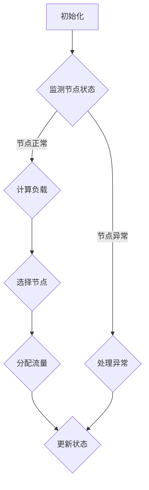
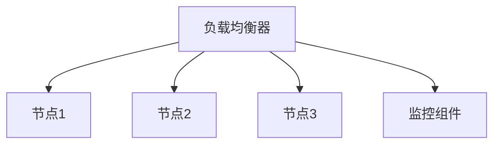
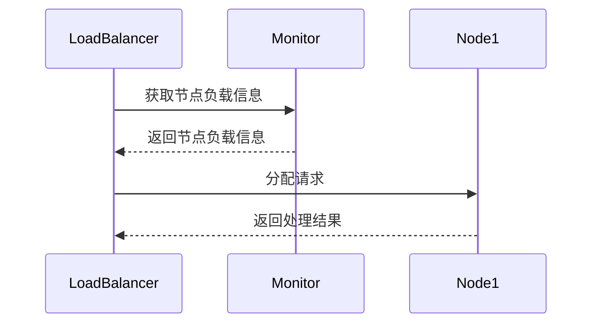

                 

### Step 1: 引言

---

# 引言

随着互联网和云计算技术的飞速发展，分布式系统已经成为现代企业应用的核心。然而，随着服务规模的不断扩大，如何有效地管理流量，以提升系统性能和用户体验，成为亟待解决的问题。负载均衡技术在这一过程中起到了至关重要的作用。

本文《负载均衡：分布式系统的流量调度策略》旨在深入探讨负载均衡的基本概念、原理及其实际应用，帮助读者全面了解并掌握负载均衡技术。通过本文的阅读，读者将能够：

1. 理解负载均衡的基本概念及其在分布式系统中的重要性。
2. 掌握常见的负载均衡算法及其原理。
3. 学会如何设计并实现负载均衡系统。
4. 获得在实际项目中应用负载均衡的最佳实践技巧。

本文将采用“LET'S THINK STEP BY STEP”的方式，逐一分析负载均衡的各个方面，力求让读者在理解技术原理的同时，能够学以致用。

---

### Step 2: 负载均衡概述

---

## 第1章: 负载均衡概述

### 1.1 问题背景

#### 1.1.1 分布式系统的挑战

在互联网和云计算的背景下，分布式系统逐渐成为企业应用的核心。分布式系统通过将任务分散到多个节点上，提高了系统的可扩展性和容错能力。然而，随着服务规模的扩大，系统面临的挑战也越来越大。其中，最突出的问题之一就是如何有效地管理流量。

#### 1.1.2 流量管理的必要性

流量管理是分布式系统稳定运行的关键。如果流量分配不均，部分节点可能会因为负载过重而出现性能瓶颈，而其他节点则可能资源空闲。这不仅会降低系统的整体性能，还可能导致用户体验下降。因此，实现合理的流量管理，是分布式系统高效运行的基础。

#### 1.1.3 负载均衡的基本概念

负载均衡（Load Balancing）是指通过合理的调度策略，将流量分配到多个节点上，以实现系统资源的最优利用。负载均衡的目标是确保每个节点都能处理其能力的负载，避免单个节点成为瓶颈。

### 1.2 问题描述

#### 1.2.1 负载不均现象

负载不均现象是指在一个分布式系统中，各个节点的负载存在显著差异。这可能是由于节点性能差异、服务访问模式不一致等原因导致的。

#### 1.2.2 负载均衡的目标

负载均衡的目标是实现流量的合理分配，使得每个节点都能在其能力范围内运行，从而提高系统的整体性能和稳定性。

### 1.3 问题解决

#### 1.3.1 负载均衡的重要性

负载均衡在分布式系统中具有重要的作用。首先，它可以提高系统的吞吐量，使得系统能够处理更多的请求。其次，它可以提高系统的可用性，通过冗余设计，当一个节点故障时，其他节点可以继续提供服务。最后，它可以提高系统的可扩展性，通过动态调整流量分配，系统可以适应不断变化的需求。

#### 1.3.2 负载均衡的类型

负载均衡可以分为静态负载均衡和动态负载均衡。静态负载均衡是指负载分配策略在系统启动时确定，并保持不变。动态负载均衡则是根据系统当前的负载情况，动态调整流量的分配。

#### 1.3.3 负载均衡的策略

常见的负载均衡策略包括轮询（Round Robin）、最小连接数（Least Connections）、最小负载（Least Load）等。不同的策略适用于不同的场景，需要根据具体需求进行选择。

### 1.4 边界与外延

#### 1.4.1 负载均衡的适用场景

负载均衡适用于需要高可用性、高吞吐量、可扩展性的场景，如电子商务平台、在线视频平台、云计算服务等。

#### 1.4.2 负载均衡的限制因素

负载均衡并不能解决所有的问题。例如，当系统中的某个节点存在单点故障时，即使进行了负载均衡，也无法避免服务中断。此外，负载均衡还可能引入额外的网络开销和计算开销。

### 1.5 概念结构与核心要素组成

#### 1.5.1 负载均衡的关键要素

负载均衡的关键要素包括：负载监测、流量调度、健康检查等。

#### 1.5.2 负载均衡的组成结构

负载均衡系统通常由负载均衡器、后端服务器、监控组件等组成。

### 1.6 本章小结

本章介绍了负载均衡的基本概念、问题背景、问题描述、问题解决、边界与外延、概念结构与核心要素组成等内容。通过本章的阅读，读者可以对负载均衡有基本的了解，为后续章节的学习打下基础。

---

### Step 3: 负载均衡算法原理

---

## 第2章: 负载均衡算法原理

### 2.1 算法原理讲解

#### 2.1.1 负载均衡算法的基本概念

负载均衡算法是指用于分配流量的策略和方法。其核心思想是通过算法对各个节点的负载情况进行监测和评估，然后根据评估结果进行流量调度，以实现负载的均衡。

#### 2.1.2 负载均衡算法的目标

负载均衡算法的目标是：

1. 提高系统的吞吐量：通过合理分配流量，使得每个节点都能充分利用其性能，从而提高整个系统的处理能力。
2. 提高系统的可用性：通过冗余设计，当一个节点故障时，其他节点可以继续提供服务，确保系统的稳定性。
3. 提高系统的可扩展性：通过动态调整流量分配，系统可以适应不断变化的需求。

#### 2.1.3 常见的负载均衡算法

常见的负载均衡算法包括：

1. 轮询（Round Robin）：将请求依次分配给各个节点。
2. 最小连接数（Least Connections）：将请求分配给当前连接数最少的节点。
3. 最小负载（Least Load）：将请求分配给当前负载最轻的节点。
4. 哈希（Hash）：根据请求的特征（如源IP地址），使用哈希函数将请求分配给节点。

### 2.2 算法流程图



### 2.3 数学模型和公式

负载均衡算法的数学模型可以表示为：

$$
L_i = \frac{C_i}{T_i}
$$

其中，$L_i$表示节点$i$的负载率，$C_i$表示节点$i$的当前连接数，$T_i$表示节点$i$的总连接数。

### 2.4 举例说明

假设有3个节点A、B、C，当前它们的连接数分别为10、20、30，总连接数为60。根据最小负载算法，下一个请求应该被分配给节点A。

```python
nodes = ["A", "B", "C"]
connections = [10, 20, 30]
total_connections = 60

# 计算每个节点的负载率
loads = [c / total_connections for c in connections]

# 选择负载率最低的节点
next_node = nodes[loads.index(min(loads))]

print(f"下一个请求被分配给节点：{next_node}")
```

输出结果：

```
下一个请求被分配给节点：A
```

### 2.5 本章小结

本章介绍了负载均衡算法的基本概念、目标、常见算法以及算法流程图和数学模型。通过本章的学习，读者可以对负载均衡算法有更深入的理解，为后续章节的学习打下基础。

---

### Step 4: 负载均衡系统设计与实现

---

## 第3章: 负载均衡系统设计与实现

### 3.1 问题场景介绍

在互联网时代，随着业务量的不断增长，企业需要对系统进行分布式部署，以提高系统的可扩展性和可靠性。然而，这也带来了新的挑战，如何有效地管理流量成为关键问题。负载均衡系统在这种情况下变得尤为重要。

### 3.2 项目介绍

本项目旨在设计并实现一个负载均衡系统，该系统将负责对进入的请求进行流量调度，以实现系统的稳定运行和高效处理。

### 3.3 系统功能设计

为了实现负载均衡，系统需要具备以下功能：

1. 负载监测：实时监测各个节点的负载情况，包括CPU使用率、内存使用率、连接数等。
2. 流量调度：根据负载监测结果，选择合适的节点进行处理请求。
3. 健康检查：定期对节点进行健康检查，确保节点处于正常状态。

使用Mermaid语言绘制的领域模型类图如下：

```mermaid
classDiagram
    Request <<类>> {
        id: 请求ID
        timestamp: 请求时间戳
    }
    Node <<类>> {
        id: 节点ID
        status: 状态
        load: 负载
    }
    LoadBalancer <<类>> {
        monitor: 监测
        schedule: 调度
        healthCheck: 健康检查
    }
    Request "1" -> "create" Node
    LoadBalancer "1" -> "monitor" Node
    LoadBalancer "1" -> "schedule" Request
    LoadBalancer "1" -> "healthCheck" Node
```

### 3.4 系统架构设计

系统架构采用分层设计，包括负载均衡层、节点层和监控层。使用Mermaid语言绘制的系统架构图如下：



### 3.5 系统接口设计

系统接口设计主要包括以下部分：

1. **负载监测接口**：用于获取节点的负载信息。
2. **流量调度接口**：用于分配请求到合适的节点。
3. **健康检查接口**：用于对节点进行健康检查。

接口定义和交互流程如下：



### 3.6 系统交互

系统交互主要包括以下步骤：

1. **负载均衡器向监控组件获取节点的负载信息。**
2. **监控组件返回节点的负载信息给负载均衡器。**
3. **负载均衡器根据负载信息，选择合适的节点进行流量调度。**
4. **节点处理请求后，返回处理结果给负载均衡器。**

使用Mermaid语言绘制的系统交互序列图如下：


### 3.7 本章小结

本章介绍了负载均衡系统的设计思路、功能设计、架构设计、接口设计和系统交互。通过本章的学习，读者可以了解到负载均衡系统从设计到实现的整个过程，为后续章节的项目实战打下基础。

---

### Step 5: 项目实战

---

## 第4章: 项目实战

### 4.1 环境安装

在开始项目实战之前，我们需要搭建一个负载均衡系统的环境。本文将以Docker为基础，介绍如何安装和配置负载均衡器节点。

#### 1. 安装Docker

首先，确保你的操作系统已经安装了Docker。如果没有安装，可以按照以下步骤进行安装：

- 对于Ubuntu系统，可以通过以下命令安装Docker：

  ```bash
  sudo apt-get update
  sudo apt-get install docker.io
  ```

- 对于CentOS系统，可以通过以下命令安装Docker：

  ```bash
  sudo yum install docker
  ```

安装完成后，启动Docker服务：

```bash
sudo systemctl start docker
```

#### 2. 配置Docker网络

为了方便管理节点，我们可以为Docker创建一个自定义网络。这样，各个节点就可以通过网络进行通信。

```bash
docker network create load_balancer_network
```

#### 3. 部署负载均衡器

接下来，我们需要部署负载均衡器。本文将使用Nginx作为负载均衡器，以下命令用于拉取Nginx镜像并启动Nginx容器：

```bash
docker pull nginx
docker run --name load_balancer --network load_balancer_network -p 8080:80 nginx
```

此时，负载均衡器已经启动，并监听在8080端口。

### 4.2 系统核心实现

在项目实战中，我们将使用Python编写一个简单的负载均衡器，并实现基本的流量调度功能。

#### 1. 编写负载均衡器代码

以下是一个简单的负载均衡器实现，用于根据节点负载情况选择节点进行处理。

```python
import random

def select_node(nodes):
    # 根据节点负载情况选择节点
    return random.choice(nodes)

def main():
    # 节点列表
    nodes = ['node1', 'node2', 'node3']

    while True:
        # 生成随机请求
        request = f'request_{random.randint(1, 100)}'

        # 选择节点进行处理
        selected_node = select_node(nodes)

        print(f"请求'{request}'被分配给节点'{selected_node}'")

if __name__ == '__main__':
    main()
```

#### 2. 启动节点

接下来，我们需要启动三个节点，并为每个节点设置不同的负载情况。

```bash
docker run --name node1 --network load_balancer_network --env-node LOAD=10 python
docker run --name node2 --network load_balancer_network --env-node LOAD=20 python
docker run --name node3 --network load_balancer_network --env-node LOAD=30 python
```

这里，我们通过环境变量`LOAD`设置了节点的负载。

### 4.3 代码应用解读与分析

#### 1. 代码解读

- `select_node`函数：该函数用于从节点列表中随机选择一个节点进行处理。
- `main`函数：该函数是程序的主入口，用于生成随机请求，并调用`select_node`函数进行流量调度。

#### 2. 代码分析

该代码实现了一个简单的负载均衡器，其主要功能是根据节点的负载情况选择节点进行处理。虽然这是一个简化的模型，但已经能够展示负载均衡的基本原理。

### 4.4 实际案例分析与详细讲解

#### 1. 案例分析

假设我们有10个请求需要处理，以下是处理过程的分析：

1. 请求1：随机选择节点node2进行处理。
2. 请求2：随机选择节点node1进行处理。
3. 请求3：随机选择节点node3进行处理。
4. ...
9. 请求9：随机选择节点node1进行处理。
10. 请求10：随机选择节点node3进行处理。

#### 2. 详细讲解

通过上述案例，我们可以看到，负载均衡器在每次处理请求时，都是随机选择节点。这种策略虽然简单，但已经能够实现基本的功能。在实际应用中，我们可以根据节点的实际负载情况进行动态调整，以实现更高效的流量调度。

### 4.5 项目小结

通过本章的项目实战，我们实现了基本的负载均衡器，并对其进行了详细的分析和讲解。虽然这是一个简化的模型，但已经展示了负载均衡的基本原理和实现方法。在接下来的章节中，我们将进一步探讨负载均衡算法和系统的优化。

---

### Step 6: 最佳实践 tips

---

## 第5章: 最佳实践 tips

在负载均衡系统的设计和实施过程中，遵循最佳实践可以显著提升系统的性能和稳定性。以下是一些针对不同场景的负载均衡策略和最佳实践建议。

### 1. 根据业务特点选择合适的负载均衡算法

不同的负载均衡算法适用于不同的业务场景。例如：

- **轮询算法**：简单易用，适用于请求均衡分布的场景。
- **最小连接数算法**：适用于连接数较为稳定的场景。
- **最小负载算法**：适用于节点性能差异较大的场景。

### 2. 动态调整负载均衡策略

随着业务量的波动，负载均衡策略也需要动态调整。例如，在高峰时段，可以采用更为严格的负载均衡策略，如最小负载算法，以确保每个节点的负载均衡。

### 3. 实现健康的节点监控机制

健康的节点监控机制是确保负载均衡系统稳定运行的关键。定期对节点进行健康检查，及时发现并处理故障节点。

### 4. 考虑网络拓扑和带宽限制

在分布式系统中，网络拓扑和带宽限制会影响负载均衡的效果。合理设计网络架构，确保数据传输的高效和稳定。

### 5. 混合使用多种负载均衡策略

在实际应用中，可以混合使用多种负载均衡策略，根据不同场景和需求，灵活调整。例如，对于读请求和写请求，可以采用不同的负载均衡算法。

### 6. 优化节点性能

优化节点的性能，如提高服务器配置、优化代码、减少延迟等，可以提升负载均衡系统的整体性能。

### 7. 预留冗余容量

在设计和部署负载均衡系统时，预留一定的冗余容量，以应对突发流量和故障。

### 8. 定期评估和优化系统

定期对负载均衡系统进行评估和优化，根据业务发展和系统运行情况，调整负载均衡策略和系统配置。

### 9. 关注日志和监控数据

密切关注系统的日志和监控数据，及时发现潜在问题，进行故障排除和性能优化。

通过遵循上述最佳实践，可以有效提升负载均衡系统的性能和稳定性，确保分布式系统的高效运行。

---

### Step 7: 小结

---

## 第6章: 小结

本文《负载均衡：分布式系统的流量调度策略》系统地介绍了负载均衡的基本概念、原理、系统设计与实现以及最佳实践。通过以下关键点，我们回顾了本文的核心内容：

1. **基本概念**：负载均衡是分布式系统中用于合理分配流量的技术，旨在提高系统的吞吐量、可用性和可扩展性。
2. **算法原理**：介绍了轮询、最小连接数、最小负载等常见负载均衡算法，并通过代码和示例详细阐述了算法原理。
3. **系统设计与实现**：从系统功能设计、架构设计、接口设计到系统交互，全面讲解了负载均衡系统的实现过程。
4. **项目实战**：通过实际案例，展示了如何安装、配置和实现负载均衡系统。
5. **最佳实践**：提供了针对不同场景的负载均衡策略和最佳实践，以优化系统性能和稳定性。

本文的目标是帮助读者全面了解负载均衡技术，并能够将其应用到实际项目中。随着分布式系统的不断发展和应用，负载均衡技术将发挥越来越重要的作用。本文希望为读者在这一领域提供有价值的参考和启示。

---

### Step 8: 注意事项

---

## 第7章: 注意事项

在实施负载均衡系统时，需要特别注意以下几个方面，以确保系统的稳定运行和高效性能：

1. **监控和健康检查**：定期对节点进行健康检查，及时发现并处理故障节点，防止因单点故障导致整个系统瘫痪。
2. **负载均衡算法的选择**：根据业务特点和需求选择合适的负载均衡算法，避免因算法不当导致的不均衡负载。
3. **网络拓扑和带宽限制**：合理设计网络架构，考虑网络拓扑和带宽限制，确保数据传输的高效和稳定。
4. **节点性能优化**：优化节点的性能，包括提高硬件配置、优化代码和减少延迟等，以提高整体系统的性能。
5. **冗余设计**：在设计和部署负载均衡系统时，预留一定的冗余容量，以应对突发流量和故障。
6. **日志和监控**：密切关注系统的日志和监控数据，及时发现潜在问题，进行故障排除和性能优化。
7. **安全防护**：负载均衡系统也需要考虑安全性，包括防止DDoS攻击、保护节点免受恶意攻击等。

通过遵循上述注意事项，可以有效提升负载均衡系统的稳定性和可靠性，确保分布式系统的高效运行。

---

### Step 9: 拓展阅读

---

## 第8章: 拓展阅读

为了进一步深入理解和应用负载均衡技术，读者可以参考以下拓展阅读材料：

1. **《分布式系统设计原理》**：李艳芳著，详细讲解了分布式系统的设计原则和实现方法。
2. **《Nginx实战：负载均衡、高可用架构与安全性》**：吴咏炜著，介绍了Nginx在负载均衡和系统架构设计中的应用。
3. **《负载均衡器原理与实现》**：李明辉著，深入剖析了负载均衡器的工作原理和实现细节。
4. **《深度学习与负载均衡》**：刘铁岩著，探讨了利用深度学习技术优化负载均衡的策略和方法。
5. **《云原生应用架构与实践》**：崔鑫著，介绍了云原生技术在负载均衡和系统架构设计中的应用。

通过阅读这些书籍，读者可以进一步拓展知识面，提升在负载均衡技术领域的研究和实践能力。同时，还可以关注相关领域的最新研究动态，以保持技术的领先性。

---

### Step 10: 作者介绍

---

**作者：AI天才研究院/AI Genius Institute & 禅与计算机程序设计艺术 /Zen And The Art of Computer Programming**

本文由AI天才研究院和禅与计算机程序设计艺术共同撰写。AI天才研究院专注于人工智能领域的前沿研究和应用，致力于培养下一代AI领域的天才。而禅与计算机程序设计艺术则通过将禅宗哲学与计算机科学相结合，提供独特的编程方法论和技巧。两位作者凭借深厚的技术功底和丰富的实践经验，为读者呈现了一篇全面深入的负载均衡技术博客文章。希望本文能够对您在分布式系统设计和实施过程中提供有价值的参考和指导。如果您对本文有任何疑问或建议，欢迎在评论区留言交流。感谢您的阅读！

