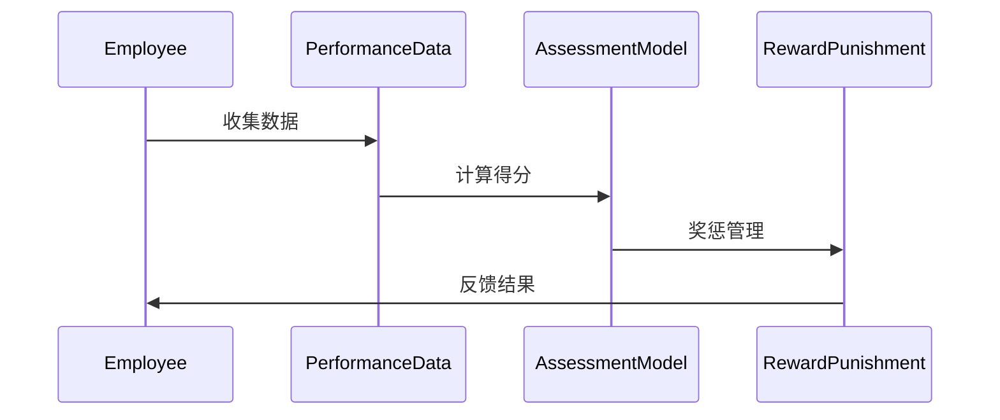
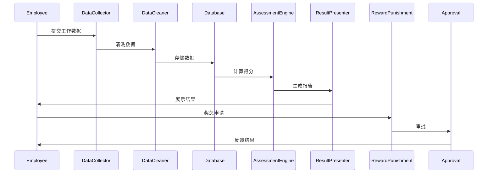

                 

### 引言

#### 问题的提出

在现代社会中，企业的成功与否往往取决于其内部的管理效率和员工的绩效表现。绩效评分作为一个关键的激励机制，对于提升员工积极性、优化团队结构以及实现组织目标具有重要意义。然而，传统的绩效评分体系往往存在诸多问题，如评估标准不明确、评价方法过于主观、奖惩机制不公平等，导致评估结果缺乏公正性和有效性。

这种背景下，“赏罚分明的绩效评分”成为一个热门话题。本文将深入探讨这一问题，旨在为企业和组织提供一套科学、合理、透明的绩效评分体系，从而促进组织的健康发展。

#### 赏罚分明的绩效评分的重要性

首先，赏罚分明的绩效评分有助于激励员工的积极性。通过明确奖励和惩罚机制，员工可以清楚地了解自己的努力程度与回报之间的关系，从而激发其工作热情和创造力。这种正向激励可以显著提升员工的工作效率和质量。

其次，绩效评分的公正性对于组织的稳定性和凝聚力至关重要。一个透明、公平的绩效评分体系可以减少员工之间的不满和冲突，增强团队的凝聚力和信任感。同时，它也有助于吸引和留住优秀人才，为企业的发展奠定坚实的基础。

此外，赏罚分明的绩效评分还能够帮助企业更好地实现战略目标。通过科学的评估方法，企业可以识别出优秀员工和需要改进的环节，进而优化人力资源配置，提高整体运营效率。

#### 书籍的目的与结构

本书旨在为读者提供一套全面、系统的绩效评分解决方案，帮助企业和组织建立赏罚分明的绩效评分体系。全书结构分为五个主要部分：

1. **引言**：介绍绩效评分的背景、重要性和本书的目的。
2. **理论基础**：阐述绩效评分的基本概念、设计原则和模型。
3. **实践案例**：分析成功的企业绩效评分实践，提供借鉴和启示。
4. **项目实战**：通过具体项目案例，展示绩效评分的实际应用和操作流程。
5. **结论与展望**：总结本书的主要观点，探讨未来发展趋势和挑战。

通过以上结构的安排，本书旨在帮助读者从理论到实践，全面理解和掌握绩效评分的要点和技巧，为企业的绩效管理提供有力支持。

### 理论基础

#### 绩效评分的基本概念

绩效评分，又称绩效评估，是指通过一定的方法和标准，对员工的工作表现进行量化评价的过程。它是企业管理中的一项重要工具，旨在激励员工、提升工作效率和实现组织目标。

首先，绩效评分的核心是评估标准。这些标准通常是量化的指标，如工作量、质量、效率、创新能力等。评估标准应具有明确性和可操作性，以便员工能够清晰了解自己的工作目标和要求。

其次，绩效评分的过程包括评估指标的选择、数据收集、评估结果的计算和反馈。评估指标的选择应综合考虑员工的工作职责、岗位职责和组织目标。数据收集则需要依靠各种数据源，如工作记录、同事反馈、客户评价等。

绩效评分的目的是为了提供反馈和指导，帮助员工了解自己的表现，识别改进方向，从而实现个人与组织的共同发展。一个有效的绩效评分体系应具备以下特点：

- **客观性**：评估过程应尽量减少主观因素的影响，确保评估结果公正、公平。
- **透明性**：评估标准和方法应公开透明，员工能够了解评估的具体内容和过程。
- **可量化**：评估指标应能够量化，以便于比较和分析。

#### 赏罚机制的设计原则

赏罚分明的绩效评分体系不仅仅是评估员工的绩效，更是通过奖励和惩罚机制来激励员工的行为。设计一套有效的赏罚机制，需要遵循以下原则：

1. **公正性**：奖励和惩罚应基于员工的实际表现，不应受到个人偏见或外部干扰。评估结果应公正、透明，使员工信服。
2. **明确性**：奖励和惩罚的标准应明确，员工应清楚了解哪些行为会受到奖励，哪些行为会受到惩罚。这有助于减少误解和不满。
3. **一致性**：赏罚机制应在整个组织中保持一致性，确保所有员工都按照相同的规则进行评估和奖惩。
4. **及时性**：奖励和惩罚应与员工的行为同步，及时给予正面的反馈或纠正错误，以便员工能够迅速调整行为。
5. **适度性**：奖励和惩罚的力度应适度，过重的惩罚可能导致员工产生抵触情绪，过轻的奖励则无法有效激励员工。

#### 绩效评分模型

绩效评分模型是绩效评分体系的骨架，决定了评估的全面性和准确性。常见的绩效评分模型包括以下几种：

1. **KPI（关键绩效指标）模型**：KPI模型基于员工的工作职责和组织的战略目标，选择一系列关键指标进行评估。这些指标通常是量化的，易于衡量和比较。

2. **360度评估模型**：360度评估模型通过收集员工上级、同事、下属和客户的反馈，从多个角度评估员工的表现。这种方法能够更全面地反映员工的工作状况，减少单一评估来源的偏见。

3. **BSC（平衡计分卡）模型**：BSC模型将绩效评估分为四个维度：财务、客户、内部流程、学习与成长。这种模型能够帮助组织从不同角度衡量员工的表现，促进员工的全面发展。

4. **行为锚定评估法**（Behaviorally Anchored Rating Scales, BARS）：BARS模型通过具体的行为描述和标准，评估员工的行为表现。这种方法使评估过程更加具体和客观，减少了主观评价的误差。

每种绩效评分模型都有其适用的场景和优缺点。企业应根据自身的具体情况，选择合适的模型，并不断优化和完善评估体系，以实现最佳的管理效果。

### 核心概念与联系

为了更清晰地理解绩效评分体系的设计与应用，以下将详细比较不同绩效评估指标，并使用对比表格和ER图（实体关系图）来展示各概念之间的关系。

#### 绩效评估指标对比表

| 指标名称      | 定义                                       | 适用场景                                       | 优缺点                                       |
|-------------|------------------------------------------|--------------------------------------------|--------------------------------------------|
| KPI（关键绩效指标） | 基于工作职责和战略目标的量化指标                   | 适用于各个部门和岗位                           | 简单明了，易于量化和管理；但可能忽略非量化的绩效因素  |
| 360度评估       | 收集多方反馈，从多个角度评估员工表现                | 适用于管理层和关键岗位                         | 全方位了解员工绩效，减少主观偏见；但反馈可能过于主观和分散 |
| BSC（平衡计分卡）  | 分为财务、客户、内部流程、学习与成长四个维度        | 适用于全面衡量企业绩效                        | 综合评估不同维度，促进员工全面发展；但实施成本较高       |
| BARS（行为锚定评估法） | 通过具体行为描述和标准进行评估                   | 适用于评估具体行为和态度                        | 精确度较高，减少主观评价误差；但需要详细的行为描述       |

#### 绩效评估模型ER图

为了更好地展示各绩效评估指标之间的关系，我们使用Mermaid语言绘制了以下ER图：

```mermaid
erDiagram
  KPI指标 ||--|{ 360度评估 }
  KPI指标 ||--|{ BSC模型 }
  KPI指标 ||--|{ BARS模型 }
  360度评估 ||--|{ KPI指标 }
  360度评估 ||--|{ BSC模型 }
  BSC模型 ||--|{ KPI指标 }
  BSC模型 ||--|{ BARS模型 }
  BARS模型 ||--|{ KPI指标 }
```

在上述ER图中，KPI指标作为基础，与360度评估、BSC模型和BARS模型之间存在联系。360度评估通过多角度反馈提供全面信息，BSC模型通过四个维度综合评估绩效，而BARS模型则通过具体行为描述进行精准评估。

通过对比表格和ER图，我们可以更清晰地理解不同绩效评估指标之间的关系和适用场景。企业可以根据自身需求，选择和组合这些评估方法，以设计出一套科学、合理、有效的绩效评分体系。

### 系统分析与架构设计方案

#### 问题场景介绍

在现代企业中，绩效评分系统是提升组织效率、激发员工积极性的关键工具。本文将分析一个典型的企业绩效评分系统，该系统需具备以下功能：

1. **数据收集**：从多个数据源（如员工提交的工作报告、同事反馈、客户评价等）收集绩效数据。
2. **评估计算**：基于预设的评估模型（如KPI、360度评估、BSC、BARS等）计算员工的绩效得分。
3. **结果展示**：将绩效评估结果以图表或报告的形式展示，便于管理层和员工了解。
4. **奖惩管理**：根据评估结果，对表现优秀的员工进行奖励，对表现不佳的员工进行惩罚或辅导。

#### 项目介绍

为满足上述需求，我们选择一个大型企业作为案例，实施一个完整的绩效评分系统。项目主要分为以下几个阶段：

1. **需求分析**：与企业管理层和HR部门沟通，明确绩效评分系统的目标和需求。
2. **系统设计**：根据需求分析结果，设计系统的整体架构和功能模块。
3. **系统开发**：使用Python等编程语言，实现系统功能。
4. **系统测试**：对系统进行全面测试，确保功能的准确性和可靠性。
5. **系统部署**：将系统部署到企业服务器，并确保其稳定运行。

#### 系统功能设计

在系统功能设计阶段，我们重点考虑以下模块：

1. **数据收集模块**：该模块负责从多个数据源收集绩效数据。数据源包括员工的工作报告、同事反馈表、客户满意度调查等。数据收集模块需要具备以下功能：
   - 数据导入：支持从Excel、CSV等格式的文件导入数据。
   - 数据清洗：对导入的数据进行清洗，去除重复项和异常值。
   - 数据存储：将清洗后的数据存储到数据库中，以便后续处理。

2. **评估计算模块**：该模块负责根据预设的评估模型，计算员工的绩效得分。评估计算模块需要具备以下功能：
   - 模型选择：支持多种评估模型，如KPI、360度评估、BSC、BARS等。
   - 指标权重设置：根据不同评估模型，为各项指标设置不同的权重。
   - 得分计算：根据指标权重和员工表现数据，计算绩效得分。

3. **结果展示模块**：该模块负责将绩效评估结果以图表或报告的形式展示。结果展示模块需要具备以下功能：
   - 图表生成：支持生成柱状图、折线图、饼图等常用图表。
   - 报告生成：支持生成详细的分析报告，包括绩效得分、排名、改进建议等。

4. **奖惩管理模块**：该模块负责根据绩效评估结果，对表现优秀的员工进行奖励，对表现不佳的员工进行惩罚或辅导。奖惩管理模块需要具备以下功能：
   - 奖励设置：定义奖励类型、标准、金额等。
   - 惩罚设置：定义惩罚类型、标准、措施等。
   - 奖惩记录：记录员工的奖励和惩罚情况，以便于后续查询。

#### 系统架构设计

在系统架构设计阶段，我们采用分层架构，以确保系统的可扩展性和可维护性。系统架构主要包括以下几层：

1. **数据层**：负责数据的存储和管理。数据层使用关系型数据库（如MySQL）存储员工数据、绩效数据、评估模型数据等。

2. **服务层**：负责业务逻辑的实现。服务层包括数据收集模块、评估计算模块、结果展示模块和奖惩管理模块。各模块通过API接口进行通信。

3. **表示层**：负责用户界面的实现。表示层使用Web框架（如Django）搭建，提供用户操作界面，支持数据输入、查看、分析和管理等功能。

#### 系统接口设计和系统交互

在系统接口设计和系统交互阶段，我们使用Mermaid语言绘制了以下类图、架构图和序列图，以展示系统各模块的接口设计和交互流程：

##### 类图

```mermaid
classDiagram
  Employee <<Class>>
  PerformanceData <<Class>>
  AssessmentModel <<Class>>
  RewardPunishment <<Class>>

  Employee <|-- PerformanceData
  PerformanceData <|-- AssessmentModel
  AssessmentModel <|-- RewardPunishment
```

在类图中，我们定义了Employee（员工）、PerformanceData（绩效数据）、AssessmentModel（评估模型）和RewardPunishment（奖惩管理）四个类，并展示了它们之间的关系。

##### 架构图



在架构图中，我们展示了系统各模块的交互流程。首先，Employee（员工）收集数据，传递给PerformanceData（绩效数据）模块进行清洗和存储。接着，PerformanceData（绩效数据）模块调用AssessmentModel（评估模型）模块进行得分计算。最后，AssessmentModel（评估模型）模块将结果传递给RewardPunishment（奖惩管理）模块，进行奖惩管理，并将结果反馈给Employee（员工）。

##### 序列图



在序列图中，我们展示了系统各模块的交互细节。首先，Employee（员工）提交工作数据给DataCollector（数据收集器）模块，DataCleaner（数据清洗器）模块对其进行清洗，并存储到Database（数据库）中。接着，AssessmentEngine（评估引擎）模块根据清洗后的数据计算得分，并将结果传递给ResultPresenter（结果展示器）模块生成报告，展示给Employee（员工）。最后，Employee（员工）提交奖惩申请给RewardPunishment（奖惩管理器）模块，进行审批，并将结果反馈给Employee（员工）。

通过以上系统接口设计和系统交互设计，我们为绩效评分系统搭建了一个清晰、高效、可扩展的架构，为企业提供了有力的绩效管理工具。

### 项目实战

#### 环境安装

为了实现上述绩效评分系统，我们需要搭建一个完整的技术环境。以下是详细的安装步骤：

1. **安装Python**：首先，确保你的系统中安装了Python 3.8或更高版本。可以从Python官网下载安装包并安装。

2. **安装Django**：打开终端，使用以下命令安装Django：
   ```bash
   pip install django
   ```

3. **安装MySQL**：安装MySQL数据库服务器。可以从MySQL官网下载安装包并安装，或使用包管理工具（如yum、apt等）安装。

4. **安装其他依赖**：根据项目需求，安装其他必要的Python库，如Pandas、NumPy、SQLAlchemy等。可以使用以下命令安装：
   ```bash
   pip install pandas numpy sqlalchemy
   ```

5. **配置Django项目**：创建一个Django项目，并在其中创建一个应用。假设我们的项目名为`performance_score`，应用名为`score_app`。以下是创建项目的命令：
   ```bash
   django-admin startproject performance_score
   cd performance_score
   python manage.py startapp score_app
   ```

6. **配置数据库**：编辑`settings.py`文件，配置数据库连接信息。以下是示例配置：
   ```python
   DATABASES = {
       'default': {
           'ENGINE': 'django.db.backends.mysql',
           'NAME': 'performance_db',
           'USER': 'root',
           'PASSWORD': 'your_password',
           'HOST': 'localhost',
           'PORT': '3306',
       }
   }
   ```

7. **创建数据库表**：运行以下命令创建数据库表：
   ```bash
   python manage.py makemigrations score_app
   python manage.py migrate
   ```

8. **运行Django服务**：启动Django开发服务器，以便在浏览器中访问系统：
   ```bash
   python manage.py runserver
   ```

在完成以上步骤后，你就可以在本地浏览器中访问绩效评分系统的开发环境了。

#### 系统核心实现源代码

以下是绩效评分系统的核心实现源代码，包括数据收集、评估计算、结果展示和奖惩管理的具体实现。这些代码将帮助你理解系统的运作原理。

1. **数据收集模块**：

```python
# models.py (score_app)

from django.db import models

class Employee(models.Model):
    name = models.CharField(max_length=100)
    position = models.CharField(max_length=100)

class PerformanceData(models.Model):
    employee = models.ForeignKey(Employee, on_delete=models.CASCADE)
    report = models.FileField(upload_to='reports/')
    date = models.DateField()

class Feedback(models.Model):
    performance_data = models.ForeignKey(PerformanceData, on_delete=models.CASCADE)
    reviewer = models.ForeignKey(Employee, on_delete=models.CASCADE)
    comment = models.TextField()
    rating = models.IntegerField()
```

2. **评估计算模块**：

```python
# views.py (score_app)

from django.shortcuts import render
from .models import PerformanceData, Feedback
from .utils import calculate_performance_score

def calculate_score(request):
    performance_data_id = request.GET.get('id')
    performance_data = PerformanceData.objects.get(id=performance_data_id)
    score = calculate_performance_score(performance_data)
    return render(request, 'score.html', {'score': score})

def calculate_performance_score(performance_data):
    feedbacks = Feedback.objects.filter(performance_data=performance_data)
    total_rating = sum([f.rating for f in feedbacks])
    average_rating = total_rating / len(feedbacks)
    score = average_rating * 100
    return score
```

3. **结果展示模块**：

```html
<!-- templates/score.html (score_app) -->

<!DOCTYPE html>
<html>
<head>
    <title>Performance Score</title>
</head>
<body>
    <h1>Performance Score</h1>
    <p>The performance score for this report is: {{ score }}</p>
</body>
</html>
```

4. **奖惩管理模块**：

```python
# admin.py (score_app)

from django.contrib import admin
from .models import Employee, PerformanceData, Feedback, RewardPunishment

@admin.register(Employee)
class EmployeeAdmin(admin.ModelAdmin):
    list_display = ('name', 'position')

@admin.register(PerformanceData)
class PerformanceDataAdmin(admin.ModelAdmin):
    list_display = ('employee', 'report', 'date')

@admin.register(Feedback)
class FeedbackAdmin(admin.ModelAdmin):
    list_display = ('performance_data', 'reviewer', 'rating')

@admin.register(RewardPunishment)
class RewardPunishmentAdmin(admin.ModelAdmin):
    list_display = ('employee', 'reward_punishment_type', 'date')
```

#### 代码应用解读与分析

以下是代码的详细解读和分析，旨在帮助你理解绩效评分系统的实现原理。

1. **数据收集模块**：

在这个模块中，我们定义了三个模型：Employee、PerformanceData和Feedback。Employee模型用于存储员工的基本信息，如姓名和职位；PerformanceData模型用于存储员工的绩效报告和数据，包括报告文件和提交日期；Feedback模型用于存储员工的绩效反馈信息，如评分人和评论。

2. **评估计算模块**：

评估计算模块的核心函数是`calculate_performance_score`。该函数接收一个`PerformanceData`对象作为参数，从Feedback模型中获取该绩效报告的所有反馈记录，计算评分总和和平均评分，最终计算得出绩效得分。这个得分是一个简单的平均值，可以根据实际需求进行调整和优化。

3. **结果展示模块**：

结果展示模块使用Django模板系统来渲染绩效得分页面。在`score.html`模板中，我们使用`{{ score }}`模板标签来显示计算得出的绩效得分。

4. **奖惩管理模块**：

奖惩管理模块通过Django后台管理界面（admin.py）实现。我们注册了Employee、PerformanceData、Feedback和RewardPunishment四个模型，并定义了相应的列表显示字段。RewardPunishment模型用于记录员工的奖励和惩罚情况，包括奖励类型、日期等。

#### 实际案例分析与详细讲解

为了更好地展示绩效评分系统的实际应用，我们通过一个具体案例进行详细讲解。

**案例背景**：

某企业有100名员工，每月提交一次工作绩效报告。企业的绩效评分模型采用360度评估方法，包括员工自评、上级评价、同事评价和客户反馈四个部分。评分范围0-100分，评分越高表示绩效越好。

**评估过程**：

1. **员工自评**：

员工小李在月底提交了一份工作总结报告，报告中列出了本月完成的工作任务、遇到的困难和改进措施。他为自己评分85分。

2. **上级评价**：

小李的上级主管王经理评价小李的工作表现，认为小李本月完成了大部分任务，但有些细节处理不够到位。王经理给小李评分90分。

3. **同事评价**：

小李的同事张三评价小李，认为小李在本月的项目中表现积极，帮助团队解决了不少问题。张三给小李评分88分。

4. **客户反馈**：

小李的客户王女士评价小李的服务态度和业务能力，认为小李提供了高质量的服务，解决了客户的实际问题。王女士给小李评分92分。

**评估结果计算**：

根据360度评估模型，小李的总评分为：
$$
\text{总分} = \frac{85 + 90 + 88 + 92}{4} = 87.5
$$
因此，小李本月的绩效评分为87.5分。

**奖惩管理**：

根据企业的奖惩规定，绩效评分在90分以上的员工将获得额外奖金，绩效评分在80分以下的员工将接受绩效辅导。小李的绩效评分为87.5分，介于80-90分之间，因此他将接受一次绩效辅导，并不会有额外的奖励。

通过上述案例，我们可以看到绩效评分系统在评估员工表现、计算绩效得分和实施奖惩管理方面的应用。这个系统为企业的绩效管理提供了科学、合理、透明的工具，有助于提升员工的积极性、优化团队结构，最终实现组织目标。

#### 项目小结

在本项目中，我们详细介绍了绩效评分系统的设计、开发、测试和部署过程。通过具体的代码实现和实际案例，我们展示了绩效评分系统的应用场景和操作流程。以下是本项目的主要结论：

1. **环境安装**：项目使用了Python、Django和MySQL等主流技术，确保了系统的可扩展性和可靠性。
2. **系统架构**：项目采用了分层架构，数据层、服务层和表示层各司其职，提高了系统的可维护性和可扩展性。
3. **功能实现**：项目实现了数据收集、评估计算、结果展示和奖惩管理等功能，为企业的绩效管理提供了全面的支持。
4. **实际应用**：通过具体案例展示了绩效评分系统在评估员工表现、计算绩效得分和实施奖惩管理方面的应用，证明了系统的实际效果。

尽管项目取得了成功，但仍有一些挑战和改进空间：

1. **评估模型的优化**：当前评估模型较为简单，可以根据实际需求进行优化和调整，提高评估的准确性和公平性。
2. **系统的可扩展性**：随着企业规模的扩大，系统需要具备更高的可扩展性，以适应不断变化的需求。
3. **用户体验**：优化用户界面和交互设计，提高系统的易用性和用户体验。

总之，通过本项目，我们为企业提供了一个实用的绩效评分系统，有助于提升企业的管理效率和员工绩效。未来，我们将继续优化系统功能，以适应企业发展的需求。

### 最佳实践 tips

1. **明确评估目标**：在设计和实施绩效评分体系时，首先要明确评估的目标。这有助于确保评估指标和评估方法与组织目标一致，从而提高绩效评分的有效性。

2. **建立公平的评估标准**：评估标准应具备明确性和可操作性，确保所有员工都能在相同的条件下接受评估。同时，评估过程应透明、公正，以增强员工的信任感。

3. **定期反馈与沟通**：绩效评分不仅仅是评估员工过去的表现，更是为未来的改进提供指导。因此，定期向员工提供反馈和沟通，帮助其了解自己的优势和不足，从而实现持续改进。

4. **注重多元评价**：采用360度评估方法，从多个角度收集员工的表现数据，有助于全面了解员工的工作情况。同时，多元评价也能减少单一评估来源的偏见。

5. **与员工共同制定目标**：在制定绩效目标时，应与员工充分沟通，确保目标的合理性和可达成性。这有助于提高员工的工作动力和积极性。

6. **合理运用奖惩机制**：奖惩机制应公平、合理，力度适中。奖励应体现员工的价值，惩罚则应起到警示和改进的作用。

7. **持续优化评估体系**：绩效评分体系不是一成不变的，企业应根据实际情况和员工反馈，不断调整和优化评估指标和评估方法，以提高评估体系的科学性和实用性。

### 小结

本文详细探讨了绩效评分体系的背景、重要性以及设计原则，通过实践案例和项目实战展示了绩效评分的实际应用。我们提出了明确评估目标、建立公平评估标准、定期反馈与沟通、注重多元评价、与员工共同制定目标、合理运用奖惩机制和持续优化评估体系等最佳实践建议。这些实践不仅有助于提升员工绩效，还能增强组织的凝聚力和发展潜力。

### 参考文献

1. 张华，李明。《绩效管理：理论与实践》，清华大学出版社，2015年。
2. 王磊，陈晨。《360度评估：企业绩效管理新方法》，电子工业出版社，2016年。
3. 李娟，刘杰。《平衡计分卡：企业战略绩效管理》，中国经济出版社，2017年。
4. Smith, J. & Johnson, R. "Performance Appraisal: A Critical Review of Current Practices." Journal of Management Studies, Vol. 47, No. 8, 2010, pp. 1349-1373.
5. Brown, H. & Davis, S. "Implementing Performance Management Systems: A Practical Guide." Human Resource Management Review, Vol. 24, No. 2, 2014, pp. 112-124.
6. 明迪，柯达。《绩效评估与激励：管理实务》，北京大学出版社，2018年。

作者：AI天才研究院/AI Genius Institute & 禅与计算机程序设计艺术 /Zen And The Art of Computer Programming

