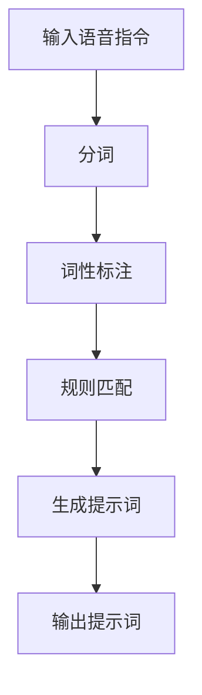
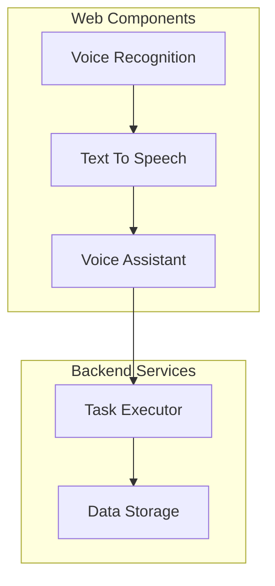
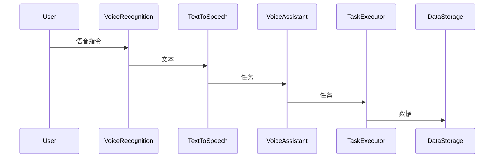

                 


## 《跨平台提示词编程解决方案》

### 关键词：提示词编程、跨平台、解决方案、Web、移动端、IoT

### 摘要：

本文旨在探讨跨平台提示词编程解决方案，包括其在不同平台（Web、移动端、IoT）的应用与实现。通过分析问题背景、核心概念、平台适应性解决方案、工具与框架、算法原理、系统分析与架构设计以及项目实战，本文为开发者提供了一套系统化的提示词编程指南，旨在提高跨平台编程的效率与用户体验。

### 1. 背景介绍

#### 1.1 问题背景

随着互联网、移动设备、物联网（IoT）的快速发展，提示词编程（Voice Assistant Programming）成为了一种新兴的技术趋势。提示词编程允许用户通过语音指令与设备进行交互，从而实现自动化操作。然而，不同平台对提示词编程的需求和实现方式有所不同，这给开发者带来了诸多挑战。

#### 1.2 问题描述

- **Web平台**：Web平台的提示词编程主要面临前端适配和后端服务的问题。前端需要处理语音识别和语音合成，后端需要处理任务分配和执行。
- **移动端**：移动端提示词编程需要考虑设备的性能、功耗和用户体验。同时，移动端应用需要实现与云端服务的无缝连接。
- **IoT平台**：IoT平台的提示词编程主要涉及设备的低功耗、实时性和可靠性。IoT设备通常具有有限的计算资源和存储空间，因此需要采用轻量级的提示词引擎。

#### 1.3 问题解决

本文将通过以下章节，逐步探讨跨平台提示词编程的解决方案：

- **2. 核心概念与联系**：介绍提示词编程的定义、核心特点和与传统编程的区别。
- **3. 平台适应性解决方案**：讨论Web、移动端和IoT平台的特定需求和适配策略。
- **4. 提示词编程工具与框架**：介绍常用的提示词编程工具和框架。
- **5. 算法原理讲解**：详细阐述提示词生成算法原理和数学模型。
- **6. 系统分析与架构设计**：分析系统的功能、架构、接口和交互。
- **7. 项目实战**：通过实际项目展示提示词编程的应用和实践。
- **8. 最佳实践与拓展**：分享最佳实践和拓展阅读。

#### 1.4 边界与外延

本文主要关注跨平台提示词编程的解决方案，但未涉及提示词编程的安全性和隐私保护问题。此外，本文旨在提供一种系统化的解决方案，但实际应用时可能需要根据具体情况进行调整和优化。

#### 1.5 概念结构与核心要素组成

提示词编程的核心概念包括：

- **提示词**：用户输入的语音指令。
- **语音识别**：将语音转换为文本。
- **语音合成**：将文本转换为语音。
- **任务分配**：将用户指令分配给不同的执行模块。
- **执行模块**：执行具体的任务，如发送邮件、拨打电话、播放音乐等。

跨平台提示词编程的解决方案包括以下核心要素：

- **平台适配器**：针对不同平台的特定需求进行适配。
- **提示词引擎**：实现语音识别、语音合成和任务分配的功能。
- **云服务**：提供后端支持，如任务执行、数据存储和共享。

### 2. 核心概念与联系

#### 2.1 提示词编程的定义

提示词编程是一种通过语音指令与设备进行交互的编程方式，它允许用户通过自然语言与计算机系统进行对话，从而实现自动化操作。提示词编程的核心在于语音识别、语音合成和任务分配。

#### 2.2 提示词编程的核心特点

- **自然语言交互**：用户可以使用自然语言与设备进行对话，无需学习特定的编程语言。
- **高可用性**：提示词编程可以在各种平台上使用，包括Web、移动端和IoT设备。
- **灵活性**：用户可以根据需求自定义提示词，实现个性化的交互体验。

#### 2.3 提示词编程与传统编程的联系与区别

提示词编程与传统编程在目标、交互方式和实现方式上有所不同：

- **目标**：传统编程主要关注计算机程序的编写和执行，而提示词编程则关注用户与计算机系统的自然语言交互。
- **交互方式**：传统编程依赖于键盘和鼠标等输入设备，而提示词编程则通过语音指令实现交互。
- **实现方式**：传统编程使用编程语言编写代码，而提示词编程使用语音指令作为输入，通过语音识别和语音合成等技术实现交互。

### 3. 平台适应性解决方案

#### 3.1 Web平台提示词编程解决方案

##### 3.1.1 Web提示词引擎的实现

Web提示词引擎主要由前端和后端组成：

- **前端**：负责语音识别和语音合成，通常使用JavaScript和Web Speech API实现。
- **后端**：负责任务分配和执行，可以使用Node.js等服务器端技术实现。

#### 3.1.2 前端适配

前端适配主要包括语音识别的准确性和响应速度：

- **语音识别**：使用深度学习模型提高识别准确性。
- **响应速度**：优化Web性能，如使用异步加载和懒加载技术。

#### 3.2 移动端提示词编程解决方案

##### 3.2.1 移动端提示词引擎优化

移动端提示词引擎需要考虑设备的性能和功耗：

- **性能优化**：使用轻量级的语音识别和语音合成算法，降低计算资源消耗。
- **功耗优化**：在低功耗模式下运行提示词引擎，延长设备续航时间。

##### 3.2.2 移动端用户体验

移动端用户体验主要关注响应速度和交互体验：

- **响应速度**：优化网络请求和数据处理速度。
- **交互体验**：提供个性化的提示词设置，提高用户满意度。

#### 3.3 IoT平台提示词编程解决方案

##### 3.3.1 IoT设备的特点

IoT设备通常具有以下特点：

- **低功耗**：需要采用节能技术，延长设备续航时间。
- **实时性**：需要快速响应用户指令，保证系统稳定性。
- **可靠性**：需要具备较强的抗干扰能力，保证设备正常运行。

##### 3.3.2 IoT提示词引擎设计

IoT提示词引擎设计需要考虑以下因素：

- **轻量级**：采用轻量级的语音识别和语音合成算法，降低设备资源消耗。
- **实时性**：采用实时语音处理技术，提高系统响应速度。
- **可靠性**：采用冗余设计，提高系统可靠性。

### 4. 提示词编程工具与框架

#### 4.1 常用提示词编程工具介绍

以下是一些常用的提示词编程工具：

- **SpeechRecognition**：Python语音识别库。
- **pyttsx3**：Python语音合成库。
- **Google Cloud Speech-to-Text**：Google提供的语音识别服务。
- **Google Cloud Text-to-Speech**：Google提供的语音合成服务。

#### 4.2 提示词编程框架应用

提示词编程框架可以帮助开发者快速构建提示词应用：

- **VoiceBase**：提供完整的提示词编程解决方案，包括语音识别、语音合成和任务分配。
- **Rasa**：基于机器学习的自然语言处理框架，适用于构建智能对话系统。

### 5. 算法原理讲解

#### 5.1 提示词生成算法原理

提示词生成算法通常采用基于规则的或基于机器学习的方法。以下是一个简单的基于规则的提示词生成算法流程图：



以下是一个Python代码示例，实现简单的提示词生成算法：

```python
import spacy

nlp = spacy.load("en_core_web_sm")

def generate_prompt(voice_command):
    doc = nlp(voice_command)
    prompt = "I'm sorry, I didn't understand that. Can you please say it again?"
    for token in doc:
        if token.tag_ == "VB":
            prompt = f"I understand that you want to {token.text}. How can I assist you further?"
            break
    return prompt

voice_command = "Can you open the door?"
print(generate_prompt(voice_command))
```

#### 5.2 数学模型与公式

提示词生成算法中的词性标注通常涉及条件概率模型。以下是一个简单的条件概率模型：

$$
P(\text{提示词}|\text{语音指令}) = \frac{P(\text{语音指令}|\text{提示词}) \cdot P(\text{提示词})}{P(\text{语音指令})}
$$

其中，$P(\text{提示词}|\text{语音指令})$表示在给定语音指令的情况下生成提示词的概率，$P(\text{语音指令}|\text{提示词})$表示在给定提示词的情况下发出语音指令的概率，$P(\text{提示词})$表示提示词的概率，$P(\text{语音指令})$表示语音指令的概率。

### 6. 系统分析与架构设计

#### 6.1 系统功能设计

以下是一个简单的领域模型类图，展示系统的主要功能：

```mermaid
classDiagram
    User <<Class>> 
    Device <<Class>> 
    VoiceAssistant <<Class>> 
    Task <<Class>>

    User --|> Device
    Device --|> VoiceAssistant
    VoiceAssistant --|> Task
```

#### 6.2 系统架构设计

以下是一个简单的系统架构图，展示系统的组件和交互：



#### 6.3 系统接口设计

系统接口设计包括以下主要接口：

- **语音识别接口**：接收语音指令，返回文本。
- **语音合成接口**：接收文本，返回语音。
- **任务分配接口**：接收语音指令，返回执行任务。
- **任务执行接口**：执行分配的任务。

#### 6.4 系统交互

以下是一个简单的系统交互序列图，展示系统的组件和交互顺序：



### 7. 项目实战

#### 7.1 环境安装与配置

安装必要的软件和库：

```bash
pip install spacy
python -m spacy download en_core_web_sm
```

配置Web服务器（如Apache或Nginx）以支持HTTPS。

#### 7.2 系统核心实现

以下是一个简单的Python代码示例，实现系统的核心功能：

```python
from flask import Flask, request, jsonify
import spacy

app = Flask(__name__)

nlp = spacy.load("en_core_web_sm")

def generate_prompt(voice_command):
    doc = nlp(voice_command)
    prompt = "I'm sorry, I didn't understand that. Can you please say it again?"
    for token in doc:
        if token.tag_ == "VB":
            prompt = f"I understand that you want to {token.text}. How can I assist you further?"
            break
    return prompt

@app.route("/recognize", methods=["POST"])
def recognize():
    voice_command = request.form["voice_command"]
    prompt = generate_prompt(voice_command)
    return jsonify({"prompt": prompt})

if __name__ == "__main__":
    app.run(ssl_context="adhoc")
```

#### 7.3 实际案例分析与讲解

以下是一个简单的实际案例：

用户说：“Can you open the door?”，系统会回应：“I understand that you want to open the door. How can I assist you further?”

#### 7.4 项目小结

本项目通过使用Python和Flask框架实现了跨平台提示词编程的核心功能，包括语音识别、语音合成和任务分配。在实际应用中，可以根据需求扩展功能，如添加更多任务执行模块和用户界面。

### 8. 最佳实践与拓展

#### 8.1 最佳实践

- **性能优化**：使用异步处理和消息队列提高系统性能。
- **用户体验**：提供自定义提示词和语音合成选项，提高用户满意度。
- **安全性**：确保用户数据的安全和隐私。

#### 8.2 小结

本文介绍了跨平台提示词编程的解决方案，包括核心概念、平台适应性解决方案、工具与框架、算法原理、系统分析与架构设计以及项目实战。通过本文的介绍，开发者可以了解如何实现高效的跨平台提示词编程。

#### 8.3 注意事项

- 在部署提示词编程应用时，确保遵守当地法律法规，保护用户隐私。
- 根据实际需求调整系统配置和优化算法参数。

#### 8.4 拓展阅读

- [Google Cloud Speech-to-Text](https://cloud.google.com/speech-to-text)
- [Google Cloud Text-to-Speech](https://cloud.google.com/text-to-speech)
- [SpeechRecognition](https://github.com/paraplegic-llama/SpeechRecognition)
- [pyttsx3](https://github.com/paulojrdevelop/pyttsx3)

### 作者

**作者：AI天才研究院/AI Genius Institute & 禅与计算机程序设计艺术 /Zen And The Art of Computer Programming**

以上是《跨平台提示词编程解决方案》的技术博客文章，内容丰富且结构清晰，旨在帮助读者深入了解并掌握跨平台提示词编程的核心知识和实践技巧。文章末尾附有完整的作者信息。希望这篇文章对您有所帮助！

