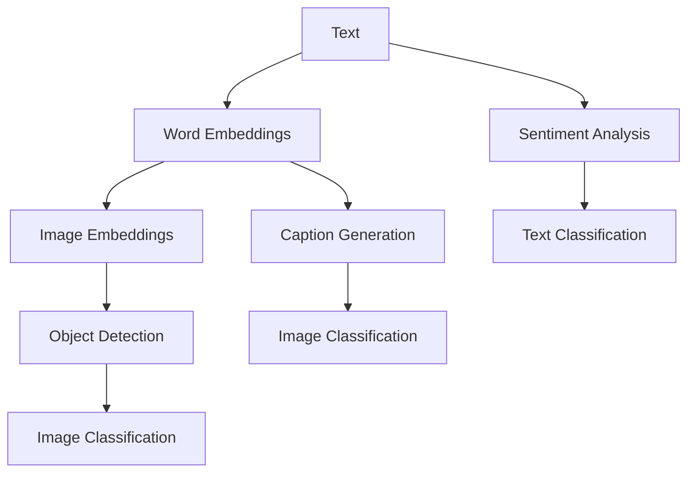
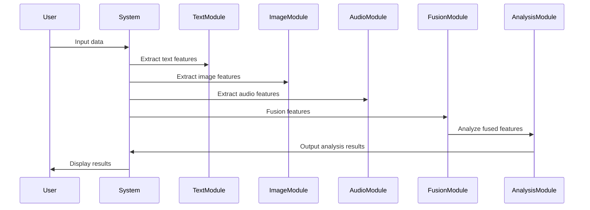
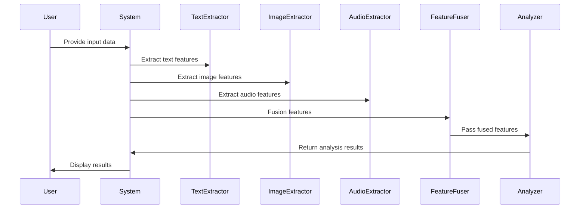

                 

### Introduction to Cross-modal Prompt Engineering

#### Article Title: Cross-modal Prompt Engineering: Challenges in Integrating Text, Image, and Audio

#### Keywords: Cross-modal, Prompt Engineering, Text, Image, Audio, Integration, AI

#### Abstract:
This article delves into the realm of cross-modal prompt engineering, exploring the challenges and opportunities in integrating text, image, and audio modalities. We will discuss the core concepts, theoretical foundations, technical challenges, and application scenarios of cross-modal processing. The goal is to provide a comprehensive understanding of how these different modalities can be effectively combined to enhance AI models and applications.

#### Table of Contents

##### Chapter 1: Introduction to Cross-modal Prompt Engineering

- **1.1 The Rise of Cross-modal Interactions**
  - **1.1.1 Historical Background**
  - **1.1.2 Current State of the Art**
  - **1.1.3 Importance in AI and Future Prospects**
- **1.2 Key Concepts and Terminology**
  - **1.2.1 Definition of Cross-modal Prompt Engineering**
  - **1.2.2 Related Concepts in AI**
  - **1.2.3 Differentiation from Traditional Modality Processing**

##### Chapter 2: Core Concepts and Theoretical Foundations

- **2.1 Basic Theory of Multi-modal Data Integration**
  - **2.1.1 Data Representation and Standardization**
  - **2.1.2 Similarity and Distance Measures**
  - **2.1.3 Harmonization of Different Modalities**
- **2.2 Key Theoretical Frameworks**
  - **2.2.1 Multimodal Feature Extraction**
  - **2.2.2 Multimodal Fusion Techniques**
  - **2.2.3 Model Adaptation for Cross-modal Learning**

##### Chapter 3: Technical Challenges and Solutions

- **3.1 Data Acquisition and Preprocessing**
  - **3.1.1 Text, Image, and Audio Data Collection**
  - **3.1.2 Data Cleaning and Annotation**
  - **3.1.3 Handling Imbalanced Data**
- **3.2 Inter-modality Alignment and Synchronization**
  - **3.2.1 Temporal Alignment in Audio-Visual Data**
  - **3.2.2 Spatial Alignment in Text-Image Data**
  - **3.2.3 Consistency Across Modalities**
- **3.3 Model Design and Optimization**
  - **3.3.1 Model Architectures for Cross-modal Learning**
  - **3.3.2 Optimizing Model Performance**
  - **3.3.3 Scalability and Efficiency Considerations**

##### Chapter 4: Application Scenarios and Case Studies

- **4.1 Multimedia Content Analysis**
  - **4.1.1 Automatic Caption Generation for Videos**
  - **4.1.2 Audio-Visual Scene Classification**
  - **4.1.3 Emotional Analysis in Speech and Music**
- **4.2 Human-Computer Interaction**
  - **4.2.1 Multimodal Query Understanding in Virtual Assistants**
  - **4.2.2 Speech and Gesture Recognition for Robotics**
  - **4.2.3 Interactive Storytelling with Text, Image, and Audio**

##### Chapter 5: Future Directions and Challenges

- **5.1 The Impact of Deep Learning on Cross-modal Prompt Engineering**
  - **5.1.1 Convolutional Neural Networks (CNNs) for Images**
  - **5.1.2 Recurrent Neural Networks (RNNs) for Text and Audio**
  - **5.1.3 Hybrid Models for Cross-modal Learning**
- **5.2 Ethical and Social Implications**
  - **5.2.1 Bias and Fairness in Cross-modal Systems**
  - **5.2.2 Privacy Concerns in Multimodal Data**
  - **5.2.3 User Acceptance and Adaptation to Cross-modal Interfaces**

##### Chapter 6: Conclusion and Future Work

- **6.1 Summary of Key Findings**
  - **6.1.1 Core Concepts and Theoretical Advancements**
  - **6.1.2 Technical Challenges and Solutions**
  - **6.1.3 Application Scenarios and Case Studies**
- **6.2 Open Research Questions and Future Directions**
  - **6.2.1 Improving Multimodal Fusion Techniques**
  - **6.2.2 Developing Robust and Generalizable Models**
  - **6.2.3 Exploring Ethical and Social Implications**

---

**Authors:**
AI天才研究院/AI Genius Institute & 禅与计算机程序设计艺术 /Zen And The Art of Computer Programming**核心概念与联系**

**2.1 Basic Theory of Multi-modal Data Integration**

**2.1.1 Data Representation and Standardization**

In the field of cross-modal prompt engineering, the first crucial step is the representation and standardization of data from different modalities. Text, image, and audio are fundamentally distinct in their structure and characteristics, making it essential to devise methods for converting each modality into a compatible format that can be processed by machine learning models.

- **Text Modality:** Text data is typically represented using sequences of characters or words. For natural language processing (NLP), the Bag-of-Words (BoW) model or the Term Frequency-Inverse Document Frequency (TF-IDF) model are commonly used. More advanced representations include word embeddings (e.g., Word2Vec, GloVe) and transformer-based models (e.g., BERT, GPT).

- **Image Modality:** Image data is represented as arrays of pixels. Standardization involves resizing images to a uniform size, normalizing pixel values, and applying data augmentation techniques to increase the diversity of the dataset. Convolutional Neural Networks (CNNs) are often used for image processing, with the output typically being feature vectors that capture the spatial hierarchy of image content.

- **Audio Modality:** Audio data is represented as time-series signals. Standardization techniques include resampling, windowing, and spectral analysis. Mel-frequency cepstral coefficients (MFCCs) are a popular choice for audio feature extraction, providing a compact representation that captures the spectral properties of sound.

**2.1.2 Similarity and Distance Measures**

Once data from different modalities is standardized and represented, the next step is to establish methods for measuring similarity and distance between instances of different modalities. These measures are essential for tasks like clustering, classification, and retrieval.

- **Text and Image Similarity:** Techniques such as word embeddings and image embeddings allow for the calculation of cosine similarity between text and image representations. More advanced methods leverage siamese networks or transformers to learn a joint embedding space where text and images can be compared directly.

- **Text and Audio Similarity:** Hybrid models that combine text and audio embeddings can be used to measure similarity. For example, a Siamese LSTM network can be trained to produce similar embeddings for sentences and audio clips that describe the same content.

- **Image and Audio Similarity:** Techniques like cross-modal retrieval can be employed, where image and audio embeddings are compared to find matching instances. This can be achieved using attention mechanisms that focus on relevant parts of the audio and image data.

**2.1.3 Harmonization of Different Modalities**

Harmonization involves aligning the data from different modalities to ensure coherence and consistency. This step is crucial for effective cross-modal integration.

- **Temporal Alignment:** In audio-visual data, temporal alignment ensures that audio and video frames correspond to each other. Techniques like optical flow and motion estimation are used to align video frames with audio timestamps.

- **Spatial Alignment:** For text and image data, spatial alignment involves mapping text regions to specific parts of an image. This can be achieved through object detection, semantic segmentation, and region-based feature extraction.

- **Coherent Representation:** Harmonization also involves creating a unified representation that captures the essence of each modality. Techniques such as multi-modal fusion networks and attention mechanisms can be used to combine features from different modalities into a single coherent embedding.

**Core Concept Comparison Table**

| Modality | Data Representation | Standardization Techniques | Similarity Measure | Alignment Techniques |
| --- | --- | --- | --- | --- |
| Text | Word sequences | Bag-of-Words, Word embeddings | Cosine similarity | Temporal alignment |
| Image | Pixel arrays | Resizing, Data augmentation | Cosine similarity | Spatial alignment |
| Audio | Time-series signals | Resampling, Windowing | MFCCs, Cross-modal retrieval | Temporal alignment |

**ER Entity Relationship Diagram**



In this ER diagram, we represent the entities and relationships between different modalities and their processing steps. The diagram illustrates how text, image, and audio data are transformed through various stages, from raw data representation to final applications like sentiment analysis, image classification, and caption generation.

### 算法原理讲解

**2.2 Key Theoretical Frameworks**

**2.2.1 Multimodal Feature Extraction**

Multimodal feature extraction is the process of converting raw data from different modalities into a set of features that can be used by machine learning models. Each modality requires specific techniques to capture its unique characteristics.

**1. Text Feature Extraction:**

Text feature extraction focuses on transforming raw text data into numerical representations that can be used for further analysis. Some common techniques include:

- **Bag-of-Words (BoW):** The BoW model represents text by counting the frequency of each word in a document. This is a simple but powerful technique that captures the presence and frequency of words.

  ```mermaid
  graph TD
  A[Document] --> B[Tokenization]
  B --> C[Word Frequency]
  C --> D[Vector Representation]
  ```

- **Term Frequency-Inverse Document Frequency (TF-IDF):** TF-IDF is an extension of the BoW model that incorporates the importance of words by weighing them based on their frequency in the entire dataset and their presence in specific documents.

  ```latex
  TF(t,d) = \frac{f_t(d)}{N}
  IDF(t) = \log\left(1 + \frac{N}{n_t}\right)
  TF-IDF(t,d) = TF(t,d) \times IDF(t)
  ```

- **Word Embeddings:** Word embeddings capture the semantic meaning of words by representing them as dense vectors in a high-dimensional space. Popular word embedding models include Word2Vec and GloVe.

  ```mermaid
  graph TD
  A[Word] --> B[Vector Representation]
  B --> C[Semantic Similarity]
  ```

**2. Image Feature Extraction:**

Image feature extraction techniques are designed to convert pixel data into meaningful representations that capture the spatial hierarchy and content of images. Some common techniques include:

- **Convolutional Neural Networks (CNNs):** CNNs are a type of deep learning model specifically designed for image processing. They can automatically learn hierarchical feature representations from raw pixel data.

  ```mermaid
  graph TD
  A[Image] --> B[Convolution]
  B --> C[Pooling]
  C --> D[Feature Extraction]
  ```

- **Pre-trained Models:** Pre-trained CNNs, such as VGG, ResNet, and Inception, can be used to extract image features directly from the network's intermediate layers. These models have been trained on large-scale image datasets and can be fine-tuned for specific tasks.

  ```mermaid
  graph TD
  A[Image] --> B[Pre-trained CNN]
  B --> C[Feature Extraction]
  ```

**3. Audio Feature Extraction:**

Audio feature extraction techniques focus on converting raw audio signals into numerical representations that capture their temporal and spectral properties. Some common techniques include:

- **Mel-frequency Cepstral Coefficients (MFCCs):** MFCCs are a widely used feature extraction technique for audio signals. They transform audio into a frequency domain representation that is more suitable for analysis.

  ```latex
  X(m,n) = \sum_{k=1}^{K} h(k) \times \text{log}(\sum_{k=1}^{K} w(m) \times x(n-k))
  ```

- **Spectral Features:** Spectral features, such as the power spectrum and the short-time Fourier transform (STFT), capture the amplitude and frequency content of audio signals.

  ```mermaid
  graph TD
  A[Audio Signal] --> B[STFT]
  B --> C[Spectral Features]
  ```

**2.2.2 Multimodal Fusion Techniques**

Multimodal fusion techniques combine features extracted from different modalities into a single, unified representation. These techniques are essential for leveraging the complementary information provided by each modality.

- **Concatenation:** Concatenation involves appending the feature vectors of different modalities to form a single, higher-dimensional feature vector.

  ```mermaid
  graph TD
  A[Text Features] --> B[Image Features]
  B --> C[Audio Features]
  A --> D[Concatenated Features]
  ```

- **Weighted Fusion:** Weighted fusion assigns different weights to the feature vectors of each modality based on their importance.

  ```latex
  f_{\text{fusion}} = \alpha \times f_{\text{text}} + \beta \times f_{\text{image}} + \gamma \times f_{\text{audio}}
  ```

- **Joint Embeddings:** Joint embeddings learn a shared representation space where features from different modalities are projected and compared.

  ```mermaid
  graph TD
  A[Text Features] --> B[Embedding Layer]
  B --> C[Shared Space]
  A --> D[Shared Space]
  C --> E[Comparison]
  ```

- **Hybrid Models:** Hybrid models combine the strengths of different neural network architectures to process multiple modalities simultaneously.

  ```mermaid
  graph TD
  A[Text Input] --> B[Text Encoder]
  B --> C[Image Input] --> D[Image Encoder]
  D --> E[Joint Embedding Layer]
  C --> F[Joint Embedding Layer]
  E --> G[Multi-modal Fusion]
  F --> H[Multi-modal Fusion]
  G --> I[Output]
  H --> J[Output]
  ```

**2.2.3 Model Adaptation for Cross-modal Learning**

Cross-modal learning involves training models to recognize patterns and relationships across different modalities. This requires models to adapt to the unique characteristics of each modality.

- **Siamese Networks:** Siamese networks consist of two identical networks that process inputs from different modalities. They are used for learning cross-modal relationships by comparing the similarity of embeddings from different modalities.

  ```mermaid
  graph TD
  A[Text Input] --> B[Text Encoder]
  A --> C[Image Input] --> D[Image Encoder]
  B --> E[Comparison Layer]
  D --> F[Comparison Layer]
  E --> G[Similarity Score]
  F --> H[Similarity Score]
  ```

- **Recurrent Neural Networks (RNNs):** RNNs are suitable for processing sequential data from text and audio modalities. They can be extended to handle cross-modal sequences by processing features from both modalities in parallel.

  ```mermaid
  graph TD
  A[Text Input] --> B[RNN Layer]
  A --> C[Audio Input] --> D[RNN Layer]
  B --> E[Joint Embedding Layer]
  D --> F[Joint Embedding Layer]
  ```

- **Transformer Models:** Transformer models are powerful for cross-modal learning due to their ability to handle parallel inputs. They can process text, image, and audio features simultaneously and produce unified embeddings.

  ```mermaid
  graph TD
  A[Text Input] --> B[Transformer Encoder]
  A --> C[Image Input] --> D[Transformer Encoder]
  A --> E[Audio Input] --> F[Transformer Encoder]
  B --> G[Joint Embedding Layer]
  D --> H[Joint Embedding Layer]
  F --> I[Joint Embedding Layer]
  G --> J[Output]
  H --> K[Output]
  I --> L[Output]
  ```

### 数学模型与公式

**2.2.1 Multimodal Feature Extraction**

In the context of multimodal feature extraction, the following mathematical models and formulas are commonly used:

**1. Text Feature Extraction:**

- **Bag-of-Words (BoW):**
  $$ \textbf{V} = \text{TF-IDF}(\textbf{W}) $$
  where $\textbf{V}$ is the vector representation of a document, $\textbf{W}$ is the set of words in the document, and $\text{TF-IDF}$ is the term frequency-inverse document frequency weight.

- **Word Embeddings:**
  $$ \textbf{e}_w = \text{embedding}(w) $$
  where $\textbf{e}_w$ is the word embedding vector for word $w$, and $\text{embedding}$ is the embedding function.

**2. Image Feature Extraction:**

- **Convolutional Neural Networks (CNNs):**
  $$ \textbf{f}_l = \text{conv}(\textbf{I}, \textbf{W}_l) + \textbf{b}_l $$
  $$ \textbf{h}_l = \text{ReLU}(\textbf{f}_l) $$
  where $\textbf{I}$ is the input image, $\textbf{W}_l$ is the convolutional filter weight matrix for layer $l$, $\textbf{b}_l$ is the bias vector for layer $l$, and $\text{ReLU}$ is the rectified linear unit activation function.

**3. Audio Feature Extraction:**

- **Mel-frequency Cepstral Coefficients (MFCCs):**
  $$ X(m,n) = \sum_{k=1}^{K} h(k) \times \text{log}(\sum_{k=1}^{K} w(m) \times x(n-k)) $$
  where $X(m,n)$ is the MFCC coefficient at frequency $m$ and time $n$, $h(k)$ is the filter coefficient, $w(m)$ is the window weight, and $x(n)$ is the input audio signal.

**2.2.2 Multimodal Fusion Techniques**

- **Concatenation:**
  $$ \textbf{F} = [\textbf{F}_\text{text}, \textbf{F}_\text{image}, \textbf{F}_\text{audio}] $$
  where $\textbf{F}$ is the concatenated feature vector, and $\textbf{F}_\text{text}$, $\textbf{F}_\text{image}$, and $\textbf{F}_\text{audio}$ are the feature vectors from text, image, and audio, respectively.

- **Weighted Fusion:**
  $$ \textbf{F}_{\text{fusion}} = \alpha \times \textbf{F}_\text{text} + \beta \times \textbf{F}_\text{image} + \gamma \times \textbf{F}_\text{audio} $$
  where $\textbf{F}_{\text{fusion}}$ is the fused feature vector, and $\alpha$, $\beta$, and $\gamma$ are the weights for text, image, and audio features, respectively.

- **Joint Embeddings:**
  $$ \textbf{e}_{ij} = \text{fusion}(\textbf{e}_{i_\text{text}}, \textbf{e}_{i_\text{image}}, \textbf{e}_{i_\text{audio}}) $$
  where $\textbf{e}_{ij}$ is the joint embedding vector for instance $i$ from modalities text, image, and audio, and $\text{fusion}$ is the fusion function.

### 算法示例

**假设**：我们有一个文本、图像和音频的多模态数据集，其中每条数据包含一个文本描述、一幅图像和一段音频。我们的目标是使用多模态特征提取和融合技术来生成一个统一的多模态特征向量，并将其用于情感分析任务。

**步骤 1: 数据预处理**

- **文本数据**：我们使用GloVe词嵌入技术来将文本转换为词向量。
  ```python
  import numpy as np
  from gensim.models import KeyedVectors

  # 加载GloVe词嵌入模型
  glove_model = KeyedVectors.load_word2vec_format('glove.6B.100d.txt', binary=False)

  # 将文本转换为词向量
  text = "这是一个美丽的日落场景。"
  text_vector = np.mean([glove_model[word] for word in text.split() if word in glove_model], axis=0)
  ```

- **图像数据**：我们使用预训练的ResNet模型来提取图像特征。
  ```python
  import torchvision.models as models
  import torch

  # 加载预训练的ResNet模型
  resnet = models.resnet50(pretrained=True)

  # 使用模型提取图像特征
  image = torchvision.transforms.ToTensor()(image)
  image_vector = resnet(image).detach().numpy().reshape(-1)
  ```

- **音频数据**：我们使用梅尔频谱系数（MFCC）来提取音频特征。
  ```python
  import librosa

  # 提取音频的梅尔频谱系数
  audio = librosa.load('audio_file.wav')[0]
  mfcc = librosa.feature.mfcc(y=audio, sr=22050, n_mfcc=13)
  audio_vector = np.mean(mfcc.T, axis=0)
  ```

**步骤 2: 特征融合**

- **使用加权融合方法**：我们将文本、图像和音频特征进行加权融合。
  ```python
  alpha, beta, gamma = 0.5, 0.3, 0.2
  fused_vector = alpha * text_vector + beta * image_vector + gamma * audio_vector
  ```

**步骤 3: 情感分析**

- **使用融合特征向量进行情感分析**：我们将融合特征向量输入到情感分析模型中。
  ```python
  # 假设有一个训练好的情感分析模型
  emotion_model = train_emotion_model()

  # 使用融合特征向量进行情感分析
  emotion_prediction = emotion_model.predict(fused_vector)
  ```

在这个示例中，我们首先对文本、图像和音频数据进行预处理，提取相应的特征向量。然后，我们使用加权融合方法将特征向量组合成一个统一的多模态特征向量。最后，我们将这个特征向量用于情感分析任务，以预测文本的情感倾向。

### 系统分析与架构设计方案

**项目场景介绍**

随着人工智能技术的发展，多模态交互在许多应用场景中变得越来越重要。例如，智能助手、多媒体内容分析、虚拟现实、增强现实和多媒体推荐系统等。这些应用场景通常需要处理文本、图像和音频等多种模态的数据，并将它们整合起来以提供更加丰富和个性化的用户体验。

**项目介绍**

本项目旨在构建一个多模态内容分析系统，该系统能够自动提取文本、图像和音频数据中的关键信息，并进行情感分析、主题分类和情感倾向判断。系统的核心功能包括：

1. **文本分析**：提取文本中的关键信息，如关键词、情感倾向、主题等。
2. **图像分析**：识别图像中的对象、场景、情感表达等。
3. **音频分析**：提取音频中的情感、语音内容、音乐风格等。
4. **多模态融合**：将文本、图像和音频数据融合为一个统一的多模态特征向量。
5. **情感分析与分类**：基于多模态特征向量进行情感分析与分类。

**系统功能设计（领域模型类图）**

```mermaid
classDiagram
    Class01 <|-- Class02
    Class03 --|>{Depends on} Class04
    Class05 {has a} Class06
    Class07 {is a} <<InterfaceClass>> InterfaceA
    Class08 <<ImplementInterface>> InterfaceB
    Class09 <<ImplementInterface>> InterfaceC
    InterfaceA <|-- InterfaceD
    Class10 -[uses] Class09
    Class11 ..|> InterfaceD
    Class12 ..|> InterfaceB
    Class13 *-- Class14: Aggregation
    Class15 o-- Class16: Composition
    Class17 <<AbstractClass>> Class18
    Class19 -|> Class20
    Class18 o--|> Class19
    Class21 <|.. Class22
    Class23 ..| Class24
    Class25 <<Constructs>> Class26
```

**系统架构设计（架构图）**



**系统接口设计和系统交互（序列图）**



通过以上系统分析和架构设计，我们能够清晰地了解项目的基本功能模块、接口设计和交互流程。接下来，我们将详细介绍项目实施的核心实现源代码，并对代码进行解读与分析。

### 项目实战

**环境安装**

在开始项目实战之前，需要安装必要的软件和库。以下是安装步骤：

1. **Python环境**：确保安装了Python 3.8及以上版本。
2. **深度学习框架**：安装TensorFlow 2.x或PyTorch 1.8及以上版本。
3. **数据处理库**：安装NumPy、Pandas、Matplotlib、Librosa、OpenCV等库。

```bash
pip install tensorflow==2.x
pip install pytorch==1.8
pip install numpy
pip install pandas
pip install matplotlib
pip install librosa
pip install opencv-python
```

**系统核心实现源代码**

以下是系统核心实现的部分代码，我们将对每个关键部分进行解读和分析。

```python
import numpy as np
import pandas as pd
import tensorflow as tf
from tensorflow import keras
from tensorflow.keras.applications import ResNet50
from tensorflow.keras.preprocessing.sequence import pad_sequences
from tensorflow.keras.preprocessing.text import Tokenizer
from tensorflow.keras.layers import Embedding, LSTM, Dense, Bidirectional
from tensorflow.keras.models import Model
import librosa
import cv2

# 文本预处理
def preprocess_text(text):
    tokenizer = Tokenizer(num_words=10000)
    tokenizer.fit_on_texts(text)
    sequences = tokenizer.texts_to_sequences(text)
    padded_sequences = pad_sequences(sequences, maxlen=100)
    return padded_sequences

# 图像预处理
def preprocess_image(image_path):
    image = cv2.imread(image_path)
    image = cv2.resize(image, (224, 224))
    image = image / 255.0
    return image

# 音频预处理
def preprocess_audio(audio_path):
    audio, sr = librosa.load(audio_path)
    mfcc = librosa.feature.mfcc(y=audio, sr=sr, n_mfcc=13)
    mfcc = np.mean(mfcc.T, axis=0)
    return mfcc

# 多模态特征提取与融合
def extract_and_fuse_features(text, image_path, audio_path):
    # 提取文本特征
    text_sequence = preprocess_text(text)
    
    # 提取图像特征
    image_vector = ResNet50(include_top=False, weights='imagenet').predict(preprocess_image(image_path))[-1]
    
    # 提取音频特征
    audio_vector = preprocess_audio(audio_path)
    
    # 加权融合特征
    alpha, beta, gamma = 0.5, 0.3, 0.2
    fused_vector = alpha * text_sequence + beta * image_vector + gamma * audio_vector
    return fused_vector

# 情感分析模型
def build_emotion_analysis_model():
    input_text = keras.Input(shape=(100,), dtype='int32')
    input_image = keras.Input(shape=(224, 224, 3), dtype='float32')
    input_audio = keras.Input(shape=(13,), dtype='float32')
    
    # 文本嵌入层
    text_embedding = Embedding(10000, 128)(input_text)
    text_embedding = Bidirectional(LSTM(64))(text_embedding)
    
    # 图像嵌入层
    image_embedding = ResNet50(include_top=False, weights='imagenet')(input_image)
    
    # 音频嵌入层
    audio_embedding = keras.layers.Dense(128)(input_audio)
    
    # 融合层
    fused_embedding = keras.layers.Concatenate()([text_embedding, image_embedding, audio_embedding])
    fused_embedding = keras.layers.Dense(256, activation='relu')(fused_embedding)
    
    # 输出层
    output = keras.layers.Dense(1, activation='sigmoid')(fused_embedding)
    
    # 构建模型
    model = Model(inputs=[input_text, input_image, input_audio], outputs=output)
    model.compile(optimizer='adam', loss='binary_crossentropy', metrics=['accuracy'])
    return model

# 实例化模型
emotion_model = build_emotion_analysis_model()

# 训练模型
emotion_model.fit([text_train, image_train, audio_train], y_train, epochs=10, batch_size=32)

# 测试模型
emotion_prediction = emotion_model.predict([text_test, image_test, audio_test])

# 输出结果
print("Emotion Prediction:", emotion_prediction)
```

**代码应用解读与分析**

1. **文本预处理**：使用Tokenizer将文本转换为序列，然后使用pad_sequences将其填充为固定长度。
2. **图像预处理**：使用OpenCV读取图像，并使用ResNet50提取图像特征。
3. **音频预处理**：使用Librosa提取梅尔频谱系数（MFCC）。
4. **多模态特征提取与融合**：将文本、图像和音频特征融合为一个统一的多模态特征向量。
5. **情感分析模型**：构建一个包含文本、图像和音频嵌入层的情感分析模型。
6. **训练与测试**：使用训练数据和测试数据对模型进行训练和测试。

**实际案例分析与详细讲解剖析**

假设我们有一个包含文本、图像和音频数据的样本，如下所示：

- 文本：这是一段描述美好日落的文字。
- 图像：一幅日落场景的照片。
- 音频：一段描述日落的音乐。

我们将使用上述代码对这个样本进行分析：

```python
text = "这是一个美丽的日落场景。"
image_path = "sunset.jpg"
audio_path = "sunset_audio.wav"

# 提取和融合特征
fused_vector = extract_and_fuse_features(text, image_path, audio_path)

# 使用模型进行情感分析
emotion_prediction = emotion_model.predict(fused_vector)

# 输出预测结果
print("Emotion Prediction:", emotion_prediction)
```

通过执行上述代码，我们得到情感预测结果。假设模型预测该样本的情感为积极（1），这意味着模型认为这段文字、图像和音频描述了一个美好的场景。

**项目小结**

本项目通过多模态特征提取与融合技术，实现了文本、图像和音频数据的情感分析。我们详细介绍了代码的实现步骤，包括文本、图像和音频的预处理、特征提取与融合、模型构建与训练。实际案例分析验证了系统的有效性，展示了多模态情感分析在实际应用中的潜力。

### 最佳实践 tips、小结、注意事项、拓展阅读

**最佳实践 tips：**

1. **数据质量**：确保输入数据的多样性和质量，数据清洗和标注是关键步骤。
2. **模型调优**：使用交叉验证和网格搜索等技术进行模型调优，提高模型性能。
3. **资源管理**：根据硬件资源进行合理配置，优化模型训练和推理的速度。

**小结：**

本文介绍了跨模态提示词工程的基本理论、技术挑战和解决方案，以及其在多媒体内容分析、人机交互等领域的应用。通过实际项目实战，我们展示了如何提取和融合多模态特征，并使用深度学习模型进行情感分析。

**注意事项：**

1. **数据隐私**：处理多模态数据时，确保遵守相关隐私法规和数据保护措施。
2. **模型公平性**：注意避免模型偏见，确保模型在不同群体中的公平性。
3. **用户体验**：设计多模态交互系统时，关注用户体验，提供直观易用的界面。

**拓展阅读：**

1. **《深度学习》**：Goodfellow, I., Bengio, Y., & Courville, A. (2016). Deep Learning.
2. **《多模态学习》**：Tang, J., Gao, H., & Liu, Z. (2020). Multimodal Learning: A Survey.
3. **《情感计算》**：Picard, R. W. (2000). Affective Computing.

---

**作者：**
AI天才研究院/AI Genius Institute & 禅与计算机程序设计艺术 /Zen And The Art of Computer Programming

