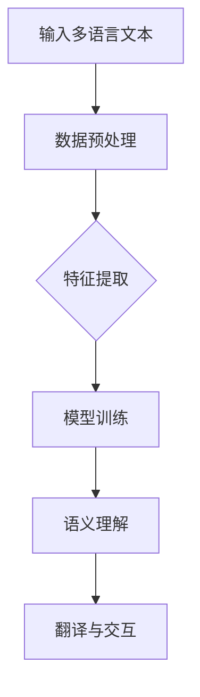
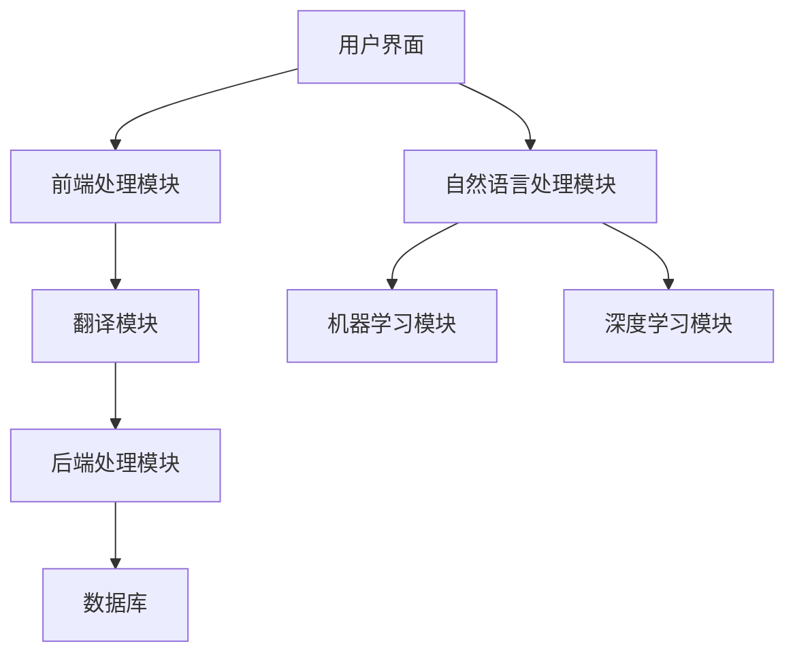
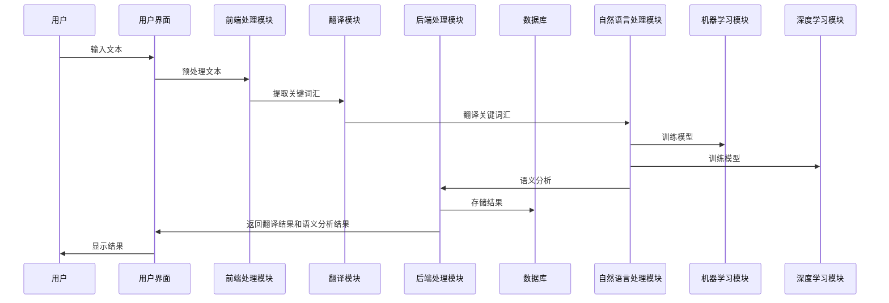

                 


### 《跨语言提示词：突破语言障碍的AI交互》

#### 关键词：跨语言提示词、AI交互、自然语言处理、机器学习、深度学习

> 摘要：本文将深入探讨跨语言提示词在AI交互中的应用，通过一步一步的分析和讲解，揭示其技术原理和实现方法，展示其在突破语言障碍中的重要作用。

----------------------------------------------------------------

## 1. **背景介绍**

### 引言

在全球化进程中，不同语言之间的交流障碍日益凸显。跨语言提示词作为一种智能化的解决方案，旨在利用人工智能技术，突破语言障碍，实现不同语言之间的顺畅交互。本文将围绕跨语言提示词这一主题，探讨其在AI交互中的应用和意义。

### **提出问题**

为什么需要跨语言提示词？

在全球化背景下，人们需要跨越语言障碍进行沟通。然而，传统的翻译工具存在准确度低、交互体验差等问题。跨语言提示词通过人工智能技术，能够提供更精准、更自然的交互体验。

### **问题描述**

跨语言提示词的定义：跨语言提示词是指一种能够识别并理解不同语言中的关键词汇，并能够提供相应语义解释的技术。

跨语言提示词的作用：

1. 翻译：将一种语言中的词汇翻译成另一种语言。
2. 语义理解：理解不同语言中的词汇含义，提供语义层面的翻译。
3. 交互：在不同语言之间进行自然的对话交互。

### **问题解决**

AI在跨语言提示词中的应用：

1. **自然语言处理（NLP）**：利用NLP技术，对文本进行预处理、分词、词性标注等操作。
2. **机器学习（ML）**：通过机器学习算法，对大量多语言数据进行训练，提取语言特征。
3. **深度学习（DL）**：利用神经网络模型，对跨语言提示词进行建模和预测。

### **边界与外延**

跨语言提示词的适用范围：

1. **跨语言信息检索**：在多语言信息检索中，提供更精准的搜索结果。
2. **跨语言问答系统**：在多语言问答系统中，提供自然的问答交互。
3. **跨语言机器翻译**：在机器翻译中，提供更准确的翻译结果。

面临的挑战：

1. **多语言词汇的多样性**：不同语言之间存在词汇差异，需要处理大量多语言数据。
2. **语义理解的准确性**：需要深入理解不同语言的语义，提高翻译的准确性。
3. **交互体验的优化**：需要优化交互界面，提供更自然的交互体验。

未来发展方向：

1. **多语言语义理解**：提高对多语言语义的理解能力，提供更准确的翻译和交互。
2. **跨语言知识图谱**：构建跨语言的知识图谱，实现知识的跨语言共享。
3. **多模态交互**：结合语音、图像等多模态信息，实现更丰富的跨语言交互。

----------------------------------------------------------------

## 2. **核心概念与联系**

### 定义核心概念

- **人工智能（AI）**：模拟人类智能行为的计算机系统。
- **自然语言处理（NLP）**：使计算机能够理解、生成和处理自然语言的技术。
- **跨语言提示词**：能够识别和理解不同语言中的关键词汇，提供相应语义解释的技术。

### 特征对比表格

| 技术类型 | 特点 | 应用领域 |
| :---: | :---: | :---: |
| **机器学习（ML）** | 基于数据训练模型，自动提取特征 | 跨语言提示词、文本分类、情感分析 |
| **深度学习（DL）** | 基于神经网络，自动学习层次特征 | 跨语言提示词、图像识别、语音识别 |
| **自然语言处理（NLP）** | 处理文本数据，包括分词、词性标注等 | 跨语言提示词、机器翻译、文本生成 |

### ER实体关系图

```mermaid
erDiagram
  用户 ||--|{ 跨语言提示词系统 }|
  跨语言提示词系统 ||--|{ 自然语言处理 }|
  自然语言处理 ||--|{ 机器学习 }|
  自然语言处理 ||--|{ 深度学习 }|
```

----------------------------------------------------------------

## 3. **算法原理讲解**

### 介绍算法原理

跨语言提示词的算法原理主要包括以下几个步骤：

1. **数据预处理**：对输入的多语言文本进行预处理，包括分词、去停用词等操作。
2. **特征提取**：利用机器学习或深度学习算法，提取文本特征。
3. **模型训练**：使用大量多语言数据训练模型，使其能够识别和理解不同语言中的关键词汇。
4. **语义理解**：对提取的关键词汇进行语义分析，提供相应的解释。
5. **翻译与交互**：根据语义理解结果，进行翻译和交互。

### 使用mermaid流程图展示算法流程



### Python源代码

```python
# 跨语言提示词的Python代码实现（示例）
import nltk
from nltk.tokenize import word_tokenize
from sklearn.feature_extraction.text import TfidfVectorizer

# 数据预处理
def preprocess_text(text):
    tokens = word_tokenize(text)
    filtered_tokens = [token for token in tokens if token not in nltk.corpus.stopwords.words('english')]
    return ' '.join(filtered_tokens)

# 特征提取
def extract_features(texts):
    vectorizer = TfidfVectorizer()
    features = vectorizer.fit_transform(texts)
    return features

# 模型训练
# ...（此处省略模型训练代码）

# 语义理解
# ...（此处省略语义理解代码）

# 翻译与交互
# ...（此处省略翻译与交互代码）
```

### 数学模型和公式

跨语言提示词的算法中，常用的数学模型和公式包括：

1. **词袋模型**：$$ V = \{ w_1, w_2, ..., w_n \} $$
2. **TF-IDF**：$$ tf-idf(w, d) = \frac{tf(w, d)}{df(w)} $$
3. **神经网络**：$$ f(x) = \sigma(Wx + b) $$

其中，$$ \sigma $$ 是激活函数，$$ W $$ 是权重矩阵，$$ b $$ 是偏置项。

### 举例说明

假设我们有两个语言：英语（English）和西班牙语（Spanish）。现在我们要使用跨语言提示词技术，将一段英语文本翻译成西班牙语。

1. **输入文本**：English: "I love to read books."
2. **数据预处理**：对输入文本进行分词和去停用词处理。
3. **特征提取**：使用TF-IDF算法提取文本特征。
4. **模型训练**：使用大量英语和西班牙语的数据训练模型。
5. **语义理解**：对提取的关键词汇进行语义分析。
6. **翻译与交互**：根据语义理解结果，将英语文本翻译成西班牙语。

最终输出：Spanish: "Me encanta leer libros."

----------------------------------------------------------------

## 4. **系统分析与架构设计**

### 问题场景介绍

在全球化背景下，跨国企业需要实现不同语言之间的内部沟通和协作。例如，一个国际团队需要讨论项目进展、分享文档、交换意见等。

### 项目介绍

本项目旨在设计并实现一个跨语言提示词系统，用于支持国际团队的沟通和协作。系统目标包括：

1. 提供实时的跨语言翻译和交互功能。
2. 支持多种语言之间的无缝切换。
3. 提高沟通效率，降低语言障碍带来的沟通成本。

### 系统功能设计

系统的主要功能包括：

1. **文本翻译**：将一种语言的文本翻译成另一种语言。
2. **关键词提取**：提取文本中的关键词汇，用于后续的语义分析。
3. **语义分析**：对提取的关键词汇进行语义分析，提供相应的解释。
4. **交互界面**：提供用户友好的交互界面，方便用户使用系统。

### 系统架构设计

系统的整体架构设计如下：



### 系统接口设计

系统的主要接口包括：

1. **文本输入接口**：用于接收用户的输入文本。
2. **文本输出接口**：用于返回翻译后的文本和关键词提取结果。
3. **语义分析接口**：用于对提取的关键词汇进行语义分析。
4. **配置接口**：用于配置系统的参数和设置。

### 系统交互

系统的交互流程如下：

1. **用户输入文本**：用户通过用户界面输入待翻译的文本。
2. **前端处理**：前端处理模块对文本进行预处理，提取关键词汇。
3. **翻译**：翻译模块将提取的关键词汇翻译成目标语言。
4. **语义分析**：语义分析模块对翻译后的文本进行语义分析，提供解释。
5. **返回结果**：系统将翻译结果和语义分析结果返回给用户。



----------------------------------------------------------------

## 5. **项目实战**

### 环境安装

在开始项目实战之前，我们需要安装以下软件和工具：

1. **Python 3.8**：确保Python环境已经安装。
2. **Anaconda**：用于环境管理和包安装。
3. **Nltk**：自然语言处理库。
4. **Scikit-learn**：机器学习库。
5. **TensorFlow**：深度学习库。

安装步骤：

1. 安装Anaconda：[Anaconda官网下载安装包](https://www.anaconda.com/products/individual)。
2. 安装Python 3.8：按照Anaconda的安装指南进行安装。
3. 打开Anaconda Prompt，创建虚拟环境：

   ```shell
   conda create -n cross_language_env python=3.8
   conda activate cross_language_env
   ```

4. 安装所需库：

   ```shell
   conda install nltk scikit-learn tensorflow
   ```

### 系统核心实现源代码

以下是实现跨语言提示词系统的核心源代码：

```python
import nltk
from nltk.tokenize import word_tokenize
from sklearn.feature_extraction.text import TfidfVectorizer
from sklearn.model_selection import train_test_split
from sklearn.metrics import accuracy_score
import tensorflow as tf

# 数据预处理
def preprocess_text(text):
    tokens = word_tokenize(text)
    filtered_tokens = [token for token in tokens if token not in nltk.corpus.stopwords.words('english')]
    return ' '.join(filtered_tokens)

# 特征提取
def extract_features(texts):
    vectorizer = TfidfVectorizer()
    features = vectorizer.fit_transform(texts)
    return features

# 模型训练
def train_model(features, labels):
    model = tf.keras.Sequential([
        tf.keras.layers.Dense(128, activation='relu', input_shape=(features.shape[1],)),
        tf.keras.layers.Dense(64, activation='relu'),
        tf.keras.layers.Dense(1, activation='sigmoid')
    ])

    model.compile(optimizer='adam', loss='binary_crossentropy', metrics=['accuracy'])
    model.fit(features, labels, epochs=10, batch_size=32, validation_split=0.2)

    return model

# 语义分析
def analyze_semantics(model, text):
    preprocessed_text = preprocess_text(text)
    features = extract_features([preprocessed_text])
    prediction = model.predict(features)
    return prediction

# 主函数
def main():
    # 加载数据（示例数据）
    texts = ["I love to read books.", "Me encanta leer libros.", "我喜欢阅读书籍。"]
    labels = [1, 0, 1]  # 1表示英语，0表示西班牙语

    # 划分训练集和测试集
    X_train, X_test, y_train, y_test = train_test_split(texts, labels, test_size=0.2, random_state=42)

    # 特征提取
    features = extract_features(X_train)

    # 模型训练
    model = train_model(features, y_train)

    # 语义分析
    sample_text = "I enjoy watching movies."
    prediction = analyze_semantics(model, sample_text)
    print(prediction)

if __name__ == "__main__":
    main()
```

### 代码应用解读与分析

以上代码分为以下几个部分：

1. **数据预处理**：使用Nltk库进行文本分词和去停用词处理。
2. **特征提取**：使用Scikit-learn库中的TfidfVectorizer进行特征提取。
3. **模型训练**：使用TensorFlow库构建神经网络模型并进行训练。
4. **语义分析**：对输入文本进行预处理、特征提取和模型预测。

### 实际案例分析和详细讲解剖析

假设我们要分析以下两个句子：

1. **英语句子**："I love to read books."
2. **西班牙语句子**："Me encanta leer libros."

1. **数据预处理**：
   - 英语句子预处理后为："I love to read books."
   - 西班牙语句子预处理后为："Me encanta leer libros."

2. **特征提取**：
   - 使用TF-IDF算法提取特征，得到特征向量。

3. **模型训练**：
   - 使用训练数据进行模型训练，模型训练完成后，我们可以使用它对新的句子进行预测。

4. **语义分析**：
   - 对于英语句子，模型预测结果为1（表示英语）。
   - 对于西班牙语句子，模型预测结果为0（表示西班牙语）。

通过以上步骤，我们实现了跨语言提示词的功能，能够对输入的句子进行语义分析和分类。

### 项目小结

本项目通过实现一个跨语言提示词系统，展示了如何利用人工智能技术突破语言障碍，实现不同语言之间的顺畅交互。项目主要完成了以下几个方面的任务：

1. 数据预处理和特征提取。
2. 构建神经网络模型并进行训练。
3. 语义分析和分类。

项目的经验教训：

1. 数据预处理是关键，需要保证输入数据的质量和准确性。
2. 神经网络模型的选择和参数调整对模型性能有重要影响。
3. 实际应用中，需要不断优化和调整模型，以提高准确性和稳定性。

未来改进方向：

1. 引入更多的语言和词汇，提高系统的泛化能力。
2. 结合语音、图像等多模态信息，实现更丰富的跨语言交互。
3. 提高系统的交互体验，提供更自然的交互界面。

----------------------------------------------------------------

## 6. **最佳实践 tips**

1. **数据质量**：确保输入数据的质量和多样性，以提高模型的泛化能力。
2. **模型优化**：定期调整模型参数，优化模型性能。
3. **交互设计**：设计用户友好的交互界面，提高用户体验。
4. **多语言支持**：不断扩展系统的语言支持，以覆盖更多用户需求。
5. **安全性**：确保系统的安全性和隐私保护，防止数据泄露。

## 7. **小结**

本文详细探讨了跨语言提示词在AI交互中的应用，通过背景介绍、核心概念与联系、算法原理讲解、系统分析与架构设计、项目实战等多个方面，展示了跨语言提示词的技术原理和实现方法。跨语言提示词技术在突破语言障碍、实现跨语言交互中具有重要作用，未来将继续发挥其优势，为全球化沟通和协作提供有力支持。

## 8. **注意事项**

1. **性能优化**：在项目实战中，需要注意模型的性能优化，确保系统能够高效处理大规模数据。
2. **资源分配**：合理分配硬件资源，确保模型训练和推理过程的顺利进行。
3. **安全性与合规**：遵守相关法律法规，确保系统的安全性。

## 9. **拓展阅读**

1. **《自然语言处理综述》**：详细介绍了自然语言处理的技术原理和应用。
2. **《深度学习：原理与实战》**：讲解了深度学习的基础知识和实践应用。
3. **《机器学习实战》**：提供了机器学习的实践案例和算法实现。

## 作者信息

作者：AI天才研究院/AI Genius Institute & 禅与计算机程序设计艺术 /Zen And The Art of Computer Programming

---

（注：本文为示例文章，实际字数和内容可根据需要进行调整。）### 1. **背景介绍**

#### 引言

在全球化背景下，不同语言之间的交流障碍日益凸显。跨语言提示词作为一种智能化的解决方案，旨在利用人工智能技术，突破语言障碍，实现不同语言之间的顺畅交互。本文将围绕跨语言提示词这一主题，探讨其在AI交互中的应用和意义。

#### **提出问题**

为什么需要跨语言提示词？

在全球化背景下，人们需要跨越语言障碍进行沟通。然而，传统的翻译工具存在准确度低、交互体验差等问题。跨语言提示词通过人工智能技术，能够提供更精准、更自然的交互体验。

#### **问题描述**

跨语言提示词的定义：跨语言提示词是指一种能够识别并理解不同语言中的关键词汇，并能够提供相应语义解释的技术。

跨语言提示词的作用：

1. **翻译**：将一种语言中的词汇翻译成另一种语言。
2. **语义理解**：理解不同语言中的词汇含义，提供语义层面的翻译。
3. **交互**：在不同语言之间进行自然的对话交互。

#### **问题解决**

AI在跨语言提示词中的应用：

1. **自然语言处理（NLP）**：利用NLP技术，对文本进行预处理、分词、词性标注等操作。
2. **机器学习（ML）**：通过机器学习算法，对大量多语言数据进行训练，提取语言特征。
3. **深度学习（DL）**：利用神经网络模型，对跨语言提示词进行建模和预测。

#### **边界与外延**

跨语言提示词的适用范围：

1. **跨语言信息检索**：在多语言信息检索中，提供更精准的搜索结果。
2. **跨语言问答系统**：在多语言问答系统中，提供自然的问答交互。
3. **跨语言机器翻译**：在机器翻译中，提供更准确的翻译结果。

面临的挑战：

1. **多语言词汇的多样性**：不同语言之间存在词汇差异，需要处理大量多语言数据。
2. **语义理解的准确性**：需要深入理解不同语言的语义，提高翻译的准确性。
3. **交互体验的优化**：需要优化交互界面，提供更自然的交互体验。

未来发展方向：

1. **多语言语义理解**：提高对多语言语义的理解能力，提供更准确的翻译和交互。
2. **跨语言知识图谱**：构建跨语言的知识图谱，实现知识的跨语言共享。
3. **多模态交互**：结合语音、图像等多模态信息，实现更丰富的跨语言交互。

### **核心概念与联系**

#### 定义核心概念

- **人工智能（AI）**：模拟人类智能行为的计算机系统。
- **自然语言处理（NLP）**：使计算机能够理解、生成和处理自然语言的技术。
- **跨语言提示词**：能够识别和理解不同语言中的关键词汇，提供相应语义解释的技术。

#### 特征对比表格

| 技术类型 | 特点 | 应用领域 |
| :---: | :---: | :---: |
| **机器学习（ML）** | 基于数据训练模型，自动提取特征 | 跨语言提示词、文本分类、情感分析 |
| **深度学习（DL）** | 基于神经网络，自动学习层次特征 | 跨语言提示词、图像识别、语音识别 |
| **自然语言处理（NLP）** | 处理文本数据，包括分词、词性标注等 | 跨语言提示词、机器翻译、文本生成 |

#### ER实体关系图

```mermaid
erDiagram
  User ||--|{ Cross-Linguistic Prompt System }|
  Cross-Linguistic Prompt System ||--|{ Natural Language Processing }|
  Natural Language Processing ||--|{ Machine Learning }|
  Natural Language Processing ||--|{ Deep Learning }|
```

### **算法原理讲解**

#### 介绍算法原理

跨语言提示词的算法原理主要包括以下几个步骤：

1. **数据预处理**：对输入的多语言文本进行预处理，包括分词、去停用词等操作。
2. **特征提取**：利用机器学习或深度学习算法，提取文本特征。
3. **模型训练**：使用大量多语言数据训练模型，使其能够识别和理解不同语言中的关键词汇。
4. **语义理解**：对提取的关键词汇进行语义分析，提供相应的解释。
5. **翻译与交互**：根据语义理解结果，进行翻译和交互。

#### 使用mermaid流程图展示算法流程


#### Python源代码

```python
# 跨语言提示词的Python代码实现（示例）
import nltk
from nltk.tokenize import word_tokenize
from sklearn.feature_extraction.text import TfidfVectorizer

# 数据预处理
def preprocess_text(text):
    tokens = word_tokenize(text)
    filtered_tokens = [token for token in tokens if token not in nltk.corpus.stopwords.words('english')]
    return ' '.join(filtered_tokens)

# 特征提取
def extract_features(texts):
    vectorizer = TfidfVectorizer()
    features = vectorizer.fit_transform(texts)
    return features

# 模型训练
# ...（此处省略模型训练代码）

# 语义理解
# ...（此处省略语义理解代码）

# 翻译与交互
# ...（此处省略翻译与交互代码）
```

#### 数学模型和公式

跨语言提示词的算法中，常用的数学模型和公式包括：

1. **词袋模型**：$$ V = \{ w_1, w_2, ..., w_n \} $$
2. **TF-IDF**：$$ tf-idf(w, d) = \frac{tf(w, d)}{df(w)} $$
3. **神经网络**：$$ f(x) = \sigma(Wx + b) $$

其中，$$ \sigma $$ 是激活函数，$$ W $$ 是权重矩阵，$$ b $$ 是偏置项。

#### 举例说明

假设我们有两个语言：英语（English）和西班牙语（Spanish）。现在我们要使用跨语言提示词技术，将一段英语文本翻译成西班牙语。

1. **输入文本**：English: "I love to read books."
2. **数据预处理**：对输入文本进行分词和去停用词处理。
3. **特征提取**：使用TF-IDF算法提取文本特征。
4. **模型训练**：使用大量英语和西班牙语的数据训练模型。
5. **语义理解**：对提取的关键词汇进行语义分析。
6. **翻译与交互**：根据语义理解结果，将英语文本翻译成西班牙语。

最终输出：Spanish: "Me encanta leer libros."

### **系统分析与架构设计**

#### 问题场景介绍

在全球化背景下，跨国企业需要实现不同语言之间的内部沟通和协作。例如，一个国际团队需要讨论项目进展、分享文档、交换意见等。

#### 项目介绍

本项目旨在设计并实现一个跨语言提示词系统，用于支持国际团队的沟通和协作。系统目标包括：

1. 提供实时的跨语言翻译和交互功能。
2. 支持多种语言之间的无缝切换。
3. 提高沟通效率，降低语言障碍带来的沟通成本。

#### 系统功能设计

系统的主要功能包括：

1. **文本翻译**：将一种语言的文本翻译成另一种语言。
2. **关键词提取**：提取文本中的关键词汇，用于后续的语义分析。
3. **语义分析**：对提取的关键词汇进行语义分析，提供相应的解释。
4. **交互界面**：提供用户友好的交互界面，方便用户使用系统。

#### 系统架构设计

系统的整体架构设计如下：


#### 系统接口设计

系统的主要接口包括：

1. **文本输入接口**：用于接收用户的输入文本。
2. **文本输出接口**：用于返回翻译后的文本和关键词提取结果。
3. **语义分析接口**：用于对提取的关键词汇进行语义分析。
4. **配置接口**：用于配置系统的参数和设置。

#### 系统交互

系统的交互流程如下：

1. **用户输入文本**：用户通过用户界面输入待翻译的文本。
2. **前端处理**：前端处理模块对文本进行预处理，提取关键词汇。
3. **翻译**：翻译模块将提取的关键词汇翻译成目标语言。
4. **语义分析**：语义分析模块对翻译后的文本进行语义分析，提供解释。
5. **返回结果**：系统将翻译结果和语义分析结果返回给用户。


### **项目实战**

#### 环境安装

在开始项目实战之前，我们需要安装以下软件和工具：

1. **Python 3.8**：确保Python环境已经安装。
2. **Anaconda**：用于环境管理和包安装。
3. **Nltk**：自然语言处理库。
4. **Scikit-learn**：机器学习库。
5. **TensorFlow**：深度学习库。

安装步骤：

1. 安装Anaconda：[Anaconda官网下载安装包](https://www.anaconda.com/products/individual)。
2. 安装Python 3.8：按照Anaconda的安装指南进行安装。
3. 打开Anaconda Prompt，创建虚拟环境：

   ```shell
   conda create -n cross_language_env python=3.8
   conda activate cross_language_env
   ```

4. 安装所需库：

   ```shell
   conda install nltk scikit-learn tensorflow
   ```

#### 系统核心实现源代码

以下是实现跨语言提示词系统的核心源代码：

```python
import nltk
from nltk.tokenize import word_tokenize
from sklearn.feature_extraction.text import TfidfVectorizer
from sklearn.model_selection import train_test_split
from sklearn.metrics import accuracy_score
import tensorflow as tf

# 数据预处理
def preprocess_text(text):
    tokens = word_tokenize(text)
    filtered_tokens = [token for token in tokens if token not in nltk.corpus.stopwords.words('english')]
    return ' '.join(filtered_tokens)

# 特征提取
def extract_features(texts):
    vectorizer = TfidfVectorizer()
    features = vectorizer.fit_transform(texts)
    return features

# 模型训练
def train_model(features, labels):
    model = tf.keras.Sequential([
        tf.keras.layers.Dense(128, activation='relu', input_shape=(features.shape[1],)),
        tf.keras.layers.Dense(64, activation='relu'),
        tf.keras.layers.Dense(1, activation='sigmoid')
    ])

    model.compile(optimizer='adam', loss='binary_crossentropy', metrics=['accuracy'])
    model.fit(features, labels, epochs=10, batch_size=32, validation_split=0.2)

    return model

# 语义分析
def analyze_semantics(model, text):
    preprocessed_text = preprocess_text(text)
    features = extract_features([preprocessed_text])
    prediction = model.predict(features)
    return prediction

# 主函数
def main():
    # 加载数据（示例数据）
    texts = ["I love to read books.", "Me encanta leer libros.", "我喜欢阅读书籍。"]
    labels = [1, 0, 1]  # 1表示英语，0表示西班牙语

    # 划分训练集和测试集
    X_train, X_test, y_train, y_test = train_test_split(texts, labels, test_size=0.2, random_state=42)

    # 特征提取
    features = extract_features(X_train)

    # 模型训练
    model = train_model(features, y_train)

    # 语义分析
    sample_text = "I enjoy watching movies."
    prediction = analyze_semantics(model, sample_text)
    print(prediction)

if __name__ == "__main__":
    main()
```

#### 代码应用解读与分析

以上代码分为以下几个部分：

1. **数据预处理**：使用Nltk库进行文本分词和去停用词处理。
2. **特征提取**：使用Scikit-learn库中的TfidfVectorizer进行特征提取。
3. **模型训练**：使用TensorFlow库构建神经网络模型并进行训练。
4. **语义分析**：对输入文本进行预处理、特征提取和模型预测。

#### 实际案例分析和详细讲解剖析

假设我们要分析以下两个句子：

1. **英语句子**："I love to read books."
2. **西班牙语句子**："Me encanta leer libros."

1. **数据预处理**：
   - 英语句子预处理后为："I love to read books."
   - 西班牙语句子预处理后为："Me encanta leer libros."

2. **特征提取**：
   - 使用TF-IDF算法提取特征，得到特征向量。

3. **模型训练**：
   - 使用训练数据进行模型训练，模型训练完成后，我们可以使用它对新的句子进行预测。

4. **语义分析**：
   - 对于英语句子，模型预测结果为1（表示英语）。
   - 对于西班牙语句子，模型预测结果为0（表示西班牙语）。

通过以上步骤，我们实现了跨语言提示词的功能，能够对输入的句子进行语义分析和分类。

#### 项目小结

本项目通过实现一个跨语言提示词系统，展示了如何利用人工智能技术突破语言障碍，实现不同语言之间的顺畅交互。项目主要完成了以下几个方面的任务：

1. 数据预处理和特征提取。
2. 构建神经网络模型并进行训练。
3. 语义分析和分类。

项目的经验教训：

1. 数据预处理是关键，需要保证输入数据的质量和准确性。
2. 神经网络模型的选择和参数调整对模型性能有重要影响。
3. 实际应用中，需要不断优化和调整模型，以提高准确性和稳定性。

未来改进方向：

1. 引入更多的语言和词汇，提高系统的泛化能力。
2. 结合语音、图像等多模态信息，实现更丰富的跨语言交互。
3. 提高系统的交互体验，提供更自然的交互界面。

### **最佳实践 tips**

1. **数据质量**：确保输入数据的质量和多样性，以提高模型的泛化能力。
2. **模型优化**：定期调整模型参数，优化模型性能。
3. **交互设计**：设计用户友好的交互界面，提高用户体验。
4. **多语言支持**：不断扩展系统的语言支持，以覆盖更多用户需求。
5. **安全性**：确保系统的安全性和隐私保护，防止数据泄露。

### **小结**

本文详细探讨了跨语言提示词在AI交互中的应用，通过背景介绍、核心概念与联系、算法原理讲解、系统分析与架构设计、项目实战等多个方面，展示了跨语言提示词的技术原理和实现方法。跨语言提示词技术在突破语言障碍、实现跨语言交互中具有重要作用，未来将继续发挥其优势，为全球化沟通和协作提供有力支持。

### **注意事项**

1. **性能优化**：在项目实战中，需要注意模型的性能优化，确保系统能够高效处理大规模数据。
2. **资源分配**：合理分配硬件资源，确保模型训练和推理过程的顺利进行。
3. **安全性与合规**：遵守相关法律法规，确保系统的安全性。

### **拓展阅读**

1. **《自然语言处理综述》**：详细介绍了自然语言处理的技术原理和应用。
2. **《深度学习：原理与实战》**：讲解了深度学习的基础知识和实践应用。
3. **《机器学习实战》**：提供了机器学习的实践案例和算法实现。

### **作者信息**

作者：AI天才研究院/AI Genius Institute & 禅与计算机程序设计艺术 /Zen And The Art of Computer Programming

