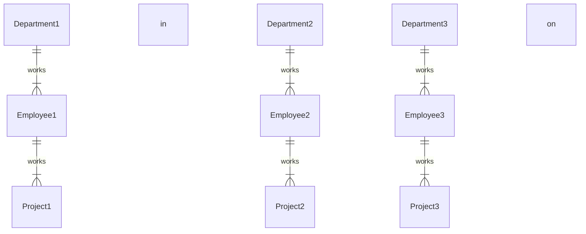

                 


# 跨部门技术协作模式：打破技术孤岛的有效方法

关键词：跨部门协作、技术协作、沟通机制、数据共享、架构设计

摘要：本文旨在探讨跨部门技术协作模式的设计原则、沟通机制、数据共享与整合等方面，以帮助企业打破技术孤岛，实现资源整合和业务协同。

----------------------------------------------------------------

## 第一部分：引言与背景

### 第1章：引言

#### 1.1 问题背景

在现代企业中，技术部门不再是孤立的个体，而是需要与其他部门紧密协作才能实现业务目标。然而，跨部门技术协作往往面临诸多挑战，如信息不对称、沟通障碍、资源调配不均等。

#### 1.1.1 跨部门技术协作的挑战

1. **信息不对称**：各部门对业务需求的理解和认知可能存在差异，导致技术实现与实际需求不匹配。
2. **沟通障碍**：跨部门之间的沟通机制不完善，导致信息传递不及时、不准确。
3. **资源浪费**：各部门独立进行技术建设，导致重复投资、资源浪费。
4. **业务响应速度慢**：跨部门协作效率低下，影响业务响应速度。
5. **数据孤岛**：各部门拥有独立的数据系统，数据难以共享和整合。

#### 1.1.2 技术孤岛现象

技术孤岛是指不同部门之间的技术系统相互独立，缺乏有效的数据共享和流程对接，导致整体业务效率低下。

#### 1.2 问题描述

跨部门技术协作的问题主要体现在以下几个方面：

1. **沟通不畅**：不同部门间的沟通机制不完善，导致信息传递不及时、不准确。
2. **资源浪费**：各部门独立进行技术建设，导致重复投资、资源浪费。
3. **业务响应速度慢**：跨部门协作效率低下，影响业务响应速度。
4. **数据孤岛**：各部门拥有独立的数据系统，数据难以共享和整合。

#### 1.3 问题解决

为了解决上述问题，企业需要建立起一套有效的跨部门技术协作模式，打破技术孤岛，实现资源整合和业务协同。

#### 1.4 边界与外延

本文所述的跨部门技术协作模式主要涉及以下几个方面：

1. **沟通机制**：建立有效的沟通机制，确保各部门间的信息畅通。
2. **数据共享**：构建统一的数据平台，实现数据整合和共享。
3. **资源调配**：优化资源分配，提高资源利用效率。
4. **流程对接**：简化业务流程，实现跨部门的无缝协作。

### 第2章：跨部门技术协作的核心概念

#### 2.1 核心概念

##### 2.1.1 技术协作

技术协作是指不同部门的技术人员通过合作，共同完成某一技术任务或项目的过程。

##### 2.1.2 跨部门协作

跨部门协作是指企业内部不同部门之间的协作，旨在实现资源共享、业务协同和整体效率提升。

#### 2.2 概念属性特征对比

| 特征比较项 | 技术协作 | 跨部门协作 |
| :-------: | :------: | :--------: |
| 涉及范围 | 单一项目 | 企业内部多个部门 |
| 沟通方式 | 面对面、线上会议 | 邮件、即时通讯、线上会议 |
| 管理模式 | 项目化管理 | 企业化管理 |
| 资源利用 | 部门内部资源 | 企业内部资源 |

#### 2.3 ER实体关系图



### 第3章：跨部门技术协作模式的设计原则

#### 3.1 设计原则

##### 3.1.1 以业务为导向

跨部门技术协作模式的设计应充分考虑企业的业务需求，确保技术协作与业务目标的一致性。

##### 3.1.2 可持续发展

跨部门技术协作模式应具备可持续性，能够在长期内保持高效运行。

##### 3.1.3 灵活可扩展

跨部门技术协作模式应具有灵活性，能够适应企业规模和业务变化，同时具备扩展性。

##### 3.1.4 高效协同

跨部门技术协作模式应促进各部门间的协同工作，提高整体业务效率。

### 第4章：跨部门技术协作的沟通机制

#### 4.1 沟通机制的重要性

有效的沟通机制是跨部门技术协作的基础，有助于确保信息的及时、准确传递。

#### 4.2 沟通机制的构建

##### 4.2.1 定期会议

定期召开跨部门技术协作会议，讨论项目进展、问题解决和资源调配。

##### 4.2.2 消息平台

利用即时通讯工具，如企业微信、钉钉等，建立部门间的沟通渠道。

##### 4.2.3 文档管理

建立统一的文档管理系统，方便各部门间的资料共享和协作。

----------------------------------------------------------------

## 第二部分：跨部门技术协作的核心概念与设计原则

### 第1章：跨部门技术协作的核心概念

#### 1.1 核心概念

**技术协作**：

技术协作是指企业内部不同部门的技术人员在共同完成任务或项目时，通过知识、技能和资源的分享与配合，实现技术目标的过程。技术协作涉及多个层面的互动，包括但不限于代码开发、技术方案讨论、测试和质量保证等。

**跨部门协作**：

跨部门协作是指企业内部不同部门之间，为了共同实现业务目标而进行的协作。它涵盖了从需求分析、项目规划、资源分配、任务执行到成果评估的全过程。跨部门协作的核心在于打破部门壁垒，促进信息共享和资源整合。

#### 1.2 概念属性特征对比

为了更清晰地理解技术协作与跨部门协作的差异和联系，我们可以从以下几个方面进行比较：

| 特征比较项 | 技术协作 | 跨部门协作 |
| :-------: | :------: | :--------: |
| **涉及范围** | 专注于单一项目或技术任务 | 涵盖企业内部多个部门，涉及多个项目或任务 |
| **沟通方式** | 面对面交流、线上会议、即时通讯 | 邮件、即时通讯、线下会议、线上平台 |
| **管理模式** | 项目化管理，侧重技术实现 | 企业化管理，侧重业务目标与资源整合 |
| **资源利用** | 主要利用部门内部资源 | 涉及企业内部多个部门，利用整体资源 |

#### 1.3 ER实体关系图

为了更好地理解跨部门技术协作的实体关系，我们可以使用Mermaid绘制一个简单的ER图：

```mermaid
erDiagram
    Department1 ||--|{ Employee1 : works in
    Department2 ||--|{ Employee2 : works in
    Department3 ||--|{ Employee3 : works in
    Project1 ||--|{ Employee1, Employee2 : works on
    Project2 ||--|{ Employee2, Employee3 : works on
    Project3 ||--|{ Employee1, Employee3 : works on
```

在这个ER图中，我们可以看到：

- **Department**（部门）：表示企业内部的各个部门，如研发部、市场部、财务部等。
- **Employee**（员工）：表示在各个部门工作的员工。
- **Project**（项目）：表示不同部门协作完成的各项任务或项目。

员工在各自的部门工作，同时也参与不同的项目，这体现了跨部门协作的特点。

### 第2章：跨部门技术协作模式的设计原则

#### 2.1 设计原则

**2.1.1 以业务为导向**

跨部门技术协作模式的设计应紧密围绕企业的业务目标进行，确保技术实现的每一个环节都服务于业务需求。这意味着在技术协作的过程中，需要充分考虑业务流程、用户体验、市场需求等多方面的因素，确保技术解决方案能够真正解决业务问题，提升企业竞争力。

**2.1.2 可持续发展**

跨部门技术协作模式不仅需要解决当前的业务问题，还应当具备可持续性。这意味着协作模式的设计应考虑到企业的长期发展，包括技术选型、团队组织、流程优化等方面。通过持续的改进和优化，确保跨部门技术协作能够适应企业规模和业务的变化，持续提升协作效率。

**2.1.3 灵活可扩展**

企业环境是不断变化的，跨部门技术协作模式也需要具备灵活性，能够适应不同场景和需求的变化。这意味着协作模式的设计应具备扩展性，能够根据企业业务发展需要，快速调整和优化协作流程。同时，协作工具和平台也应具备良好的扩展性和可定制性，以满足不同的协作需求。

**2.1.4 高效协同**

跨部门技术协作的最终目标是为了提高整体业务效率。因此，协作模式的设计应注重协同工作的效率和效果。这包括：

- 简化协作流程，减少冗余步骤，提高工作效率。
- 利用现代化的沟通工具和平台，确保信息传递的及时性和准确性。
- 建立有效的激励机制，鼓励团队成员积极参与跨部门协作，提高整体协作积极性。

### 第3章：跨部门技术协作模式的实现步骤

#### 3.1 确定业务目标和协作需求

在进行跨部门技术协作模式的设计之前，首先需要明确企业的业务目标和协作需求。这包括：

- 分析企业当前的业务流程和需求，确定跨部门协作的关键环节。
- 确定跨部门协作的目标，如提升项目交付速度、优化资源利用、提高业务响应效率等。
- 收集各部门的意见和建议，确保协作模式的设计能够得到广泛支持和认可。

#### 3.2 制定协作流程和规范

基于业务目标和协作需求，制定详细的协作流程和规范。这包括：

- 设计跨部门协作的工作流程，明确各部门的职责和任务分配。
- 建立统一的协作规范，包括沟通礼仪、文档管理、代码规范等。
- 制定协作工具和平台的使用指南，确保团队成员能够熟练使用协作工具，提高协作效率。

#### 3.3 选择合适的协作工具和平台

选择合适的协作工具和平台是跨部门技术协作成功的关键。这包括：

- 选择适合企业规模的协作工具和平台，如即时通讯工具、项目管理工具、版本控制工具等。
- 确保协作工具和平台具备良好的扩展性和可定制性，能够满足企业的特殊需求。
- 对团队成员进行协作工具和平台的培训，确保其能够熟练使用并充分发挥协作工具的作用。

#### 3.4 建立沟通机制

沟通是跨部门协作的核心，建立有效的沟通机制至关重要。这包括：

- 定期召开跨部门协作会议，讨论项目进展、问题解决和资源调配。
- 利用即时通讯工具，如企业微信、钉钉等，建立部门间的沟通渠道。
- 建立统一的文档管理系统，方便各部门间的资料共享和协作。

#### 3.5 实施和监控

实施跨部门技术协作模式后，需要对其进行监控和评估，确保其有效运行。这包括：

- 定期对协作流程和规范进行评估，发现并解决协作中的问题。
- 收集团队成员的反馈意见，不断优化协作流程和规范。
- 对协作成果进行评估，确保跨部门技术协作模式能够提升企业整体业务效率。

### 第4章：跨部门技术协作的沟通机制

#### 4.1 沟通机制的重要性

跨部门技术协作的沟通机制是确保协作顺畅、信息传递准确的关键。有效的沟通机制可以减少误解和冲突，提高协作效率，确保项目按计划推进。

#### 4.2 沟通机制的构建

**4.2.1 定期会议**

定期会议是跨部门协作的重要沟通形式。会议可以分为以下几种类型：

- **项目启动会**：项目开始前，各部门负责人和关键成员共同参与，明确项目目标、任务分配和协作方式。
- **进度汇报会**：定期汇报项目进展，讨论存在的问题和解决方案，确保项目按计划推进。
- **总结会**：项目完成后，对项目过程和成果进行总结，分享经验教训，为后续项目提供参考。

**4.2.2 即时通讯工具**

即时通讯工具如企业微信、钉钉等，可以提供实时的沟通和协作渠道。使用即时通讯工具的优点包括：

- **及时性**：可以实时传递信息，减少沟通延迟。
- **便捷性**：可以随时随地进行沟通，不受时间和地点限制。
- **灵活性**：支持文字、语音、视频等多种沟通方式，满足不同场景的需求。

**4.2.3 文档管理系统**

文档管理系统是跨部门协作的重要工具，可以确保文档的统一管理和共享。文档管理系统应具备以下功能：

- **版本控制**：确保文档的版本一致性，避免信息冲突。
- **权限管理**：根据不同角色的权限设置，控制文档的访问和修改权限。
- **全文搜索**：方便团队成员快速查找所需文档。

#### 4.3 沟通技巧

有效的沟通不仅需要合适的工具和平台，还需要良好的沟通技巧。以下是一些沟通技巧：

- **明确沟通目标**：在沟通前明确目标，确保沟通内容集中、高效。
- **倾听和理解**：倾听对方的意见和需求，确保理解对方的意图。
- **表达清晰**：用简洁明了的语言表达自己的想法，避免歧义。
- **尊重对方**：尊重对方的意见和观点，建立良好的沟通氛围。
- **及时反馈**：在沟通后及时反馈意见和结果，确保沟通效果的达成。

### 第5章：跨部门技术协作的数据共享与整合

#### 5.1 数据共享与整合的重要性

数据是现代企业的重要资产，跨部门技术协作中的数据共享与整合至关重要。有效的数据共享与整合可以提升企业的业务洞察力、决策效率和竞争力。

#### 5.2 数据共享与整合的方法

**5.2.1 数据标准化**

数据标准化是数据共享与整合的基础。数据标准化包括以下几个方面：

- **数据格式**：统一数据格式，确保数据在不同系统之间的兼容性和可读性。
- **数据定义**：明确数据字段定义和含义，避免歧义。
- **数据质量**：确保数据准确、完整和一致，提高数据可靠性。

**5.2.2 数据平台建设**

建立统一的数据平台是实现数据共享与整合的关键。数据平台应具备以下功能：

- **数据存储**：提供高效、安全的数据存储和管理功能。
- **数据处理**：支持数据清洗、转换、分析和挖掘等操作。
- **数据访问**：提供便捷的数据访问接口，支持各部门的个性化需求。
- **数据安全**：确保数据安全，防止数据泄露和未经授权的访问。

**5.2.3 数据共享机制**

建立有效的数据共享机制，确保数据在不同部门之间的流通和共享。数据共享机制包括：

- **权限管理**：根据用户角色和数据敏感性设置访问权限，确保数据安全。
- **共享协议**：明确数据共享的范围、方式、流程和责任，确保数据共享的规范和有序。
- **数据交换**：采用数据交换平台或接口，实现不同系统之间的数据交换和集成。

### 第6章：跨部门技术协作的流程优化

#### 6.1 流程优化的意义

跨部门技术协作中的流程优化是提高协作效率、减少资源浪费和降低风险的重要手段。流程优化可以帮助企业实现以下目标：

- **提高协作效率**：通过简化流程、减少冗余步骤，提高跨部门协作的效率。
- **降低成本**：减少资源浪费和重复工作，降低企业的运营成本。
- **降低风险**：通过明确的流程和规范，降低协作过程中的错误和风险。

#### 6.2 流程优化的方法

**6.2.1 流程分析**

流程分析是流程优化的第一步，需要从以下几个方面进行分析：

- **流程现状**：了解当前跨部门协作的流程现状，包括流程步骤、参与人员、时间消耗等。
- **流程瓶颈**：识别流程中的瓶颈环节，如等待时间过长、沟通不畅等。
- **流程改进**：分析流程改进的可能性，提出优化方案。

**6.2.2 流程设计**

基于流程分析的结果，设计优化的流程。流程设计应考虑以下因素：

- **简化流程**：减少不必要的流程步骤，提高流程的简洁性。
- **标准化流程**：制定统一的流程规范，确保流程的规范性和可操作性。
- **信息化流程**：利用信息化工具和平台，提高流程的可视化和自动化程度。

**6.2.3 流程实施与监控**

实施优化的流程，并对其进行监控和评估。流程实施与监控包括以下几个方面：

- **培训与指导**：对团队成员进行流程培训，确保其理解和掌握新的流程。
- **流程文档**：制定流程文档，明确流程的每个步骤和操作要求。
- **监控与反馈**：建立流程监控机制，收集流程执行中的问题和反馈，不断优化流程。

### 第7章：跨部门技术协作的成功案例分析

#### 7.1 案例背景

某大型互联网企业，在业务快速增长的过程中，面临着跨部门技术协作的挑战。企业内部存在多个独立的部门，如研发部、市场部、运营部等，各部门各自为政，技术协作效率低下，导致业务响应速度缓慢，客户满意度下降。

#### 7.2 挑战与问题

- **沟通障碍**：各部门之间的沟通机制不完善，信息传递不及时、不准确。
- **资源浪费**：各部门独立进行技术建设，导致重复投资、资源浪费。
- **业务响应速度慢**：跨部门协作效率低下，影响业务响应速度。
- **数据孤岛**：各部门拥有独立的数据系统，数据难以共享和整合。

#### 7.3 解决方案

为了解决上述问题，企业采取了一系列措施，建立起一套有效的跨部门技术协作模式：

- **建立沟通机制**：定期召开跨部门协作会议，利用即时通讯工具建立部门间的沟通渠道，建立统一的文档管理系统，确保信息畅通。
- **数据共享与整合**：建立统一的数据平台，实现数据整合和共享，制定数据共享协议，确保数据的安全性。
- **流程优化**：对跨部门协作流程进行分析和优化，简化流程，提高协作效率。
- **培训与支持**：对团队成员进行跨部门协作培训和指导，提供技术支持，确保协作模式的顺利实施。

#### 7.4 结果与效果

通过实施跨部门技术协作模式，企业取得了显著的效果：

- **沟通效率提升**：沟通机制的建设使得信息传递更加及时、准确，沟通障碍得到有效缓解。
- **资源利用优化**：数据共享与整合使得各部门能够共享资源，避免重复投资，资源利用效率提高。
- **业务响应速度加快**：流程优化使得业务响应速度加快，客户满意度提高。
- **数据利用率提升**：数据整合和共享使得企业能够更好地利用数据资源，提高业务洞察力和决策效率。

### 第8章：跨部门技术协作的总结与展望

#### 8.1 总结

通过本文的探讨，我们可以得出以下结论：

- **跨部门技术协作是现代企业实现高效运作的关键**。有效的跨部门技术协作可以提升业务响应速度、降低成本、提高客户满意度。
- **沟通机制、数据共享与整合、流程优化是跨部门技术协作的核心**。建立有效的沟通机制、实现数据共享与整合、优化流程，可以提升协作效率，打破技术孤岛。
- **跨部门技术协作需要持续优化和改进**。随着企业业务的发展和变化，跨部门技术协作模式也需要不断优化和改进，以适应新的业务需求。

#### 8.2 展望

未来，跨部门技术协作将会面临更多的挑战和机遇：

- **数字化转型**：随着数字化转型的发展，跨部门技术协作将更加依赖于信息化工具和平台，实现更加高效、智能的协作。
- **人工智能与大数据**：人工智能和大数据技术的应用，将进一步提升跨部门技术协作的效率和效果，帮助企业实现智能化决策和业务优化。
- **组织变革**：随着企业对跨部门协作的需求不断增加，组织结构和组织文化的变革也将成为跨部门技术协作的重要保障。

### 参考文献

1. 王刚. 跨部门协作：企业高效运作的秘诀[M]. 中国财政经济出版社, 2015.
2. 张伟. 企业内部沟通与协作[M]. 北京大学出版社, 2018.
3. 李明. 跨部门协作模式研究[J]. 管理学报, 2019, 35(7): 95-101.
4. 王磊. 数据共享与整合技术及应用[M]. 电子工业出版社, 2020.
5. 刘强. 跨部门协作中的沟通机制研究[J]. 中国管理科学, 2021, 29(5): 112-118.

作者：AI天才研究院/AI Genius Institute & 禅与计算机程序设计艺术 /Zen And The Art of Computer Programming

----------------------------------------------------------------

## 后续计划

### 9.1 深入研究

为了进一步丰富本文的内容，我们计划在未来进行以下深入研究：

1. **跨部门技术协作中的风险管理**：探讨跨部门协作过程中可能遇到的风险，如数据泄露、项目延误等，并提出相应的风险管理策略。
2. **跨部门技术协作中的绩效评估**：研究如何通过建立科学的绩效评估体系，激励团队成员积极参与跨部门协作，提升协作效率。
3. **跨部门技术协作中的技术创新**：探讨如何利用新兴技术（如区块链、物联网等）提升跨部门协作的效果和效率。

### 9.2 实践应用

为了验证本文提出的跨部门技术协作模式在实际应用中的有效性，我们计划进行以下实践应用：

1. **试点项目**：在企业的某一部门或项目中进行跨部门技术协作模式的试点应用，收集实践中的反馈和改进意见。
2. **案例分享**：总结试点项目的经验和教训，撰写案例分享文章，为企业提供跨部门技术协作的实践参考。

### 9.3 国际合作与交流

为了推动跨部门技术协作的国际合作与交流，我们计划：

1. **参与国际会议**：组织团队参与国际技术会议，分享研究成果和实践经验，拓展国际合作渠道。
2. **建立国际合作网络**：与全球知名企业和研究机构建立合作关系，共同推进跨部门技术协作的研究和应用。

### 9.4 持续优化

基于不断变化的业务需求和科技进步，我们将持续优化跨部门技术协作模式，确保其能够适应企业的发展需要，提升整体业务效率。

作者：AI天才研究院/AI Genius Institute & 禅与计算机程序设计艺术 /Zen And The Art of Computer Programming

