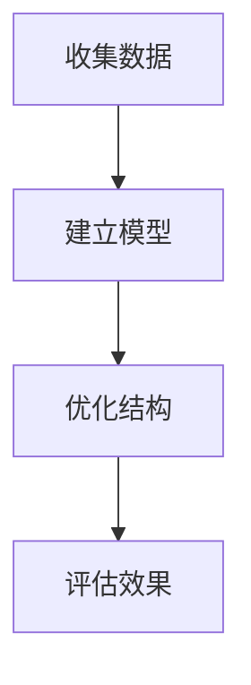
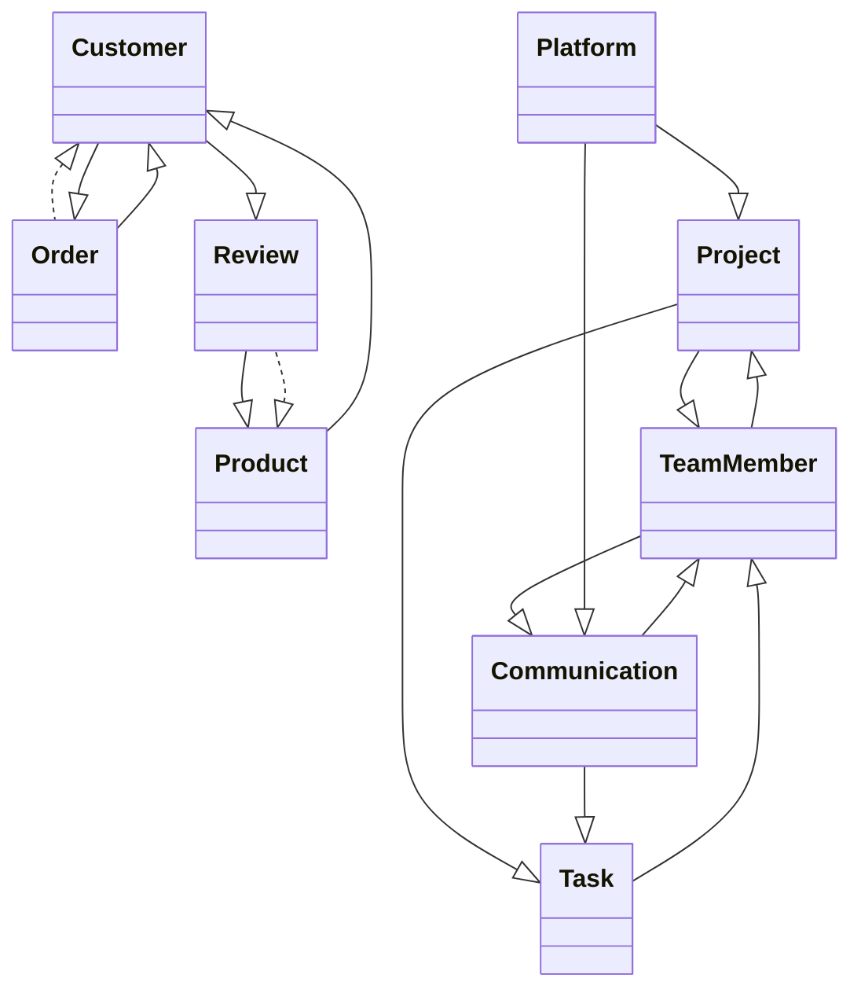
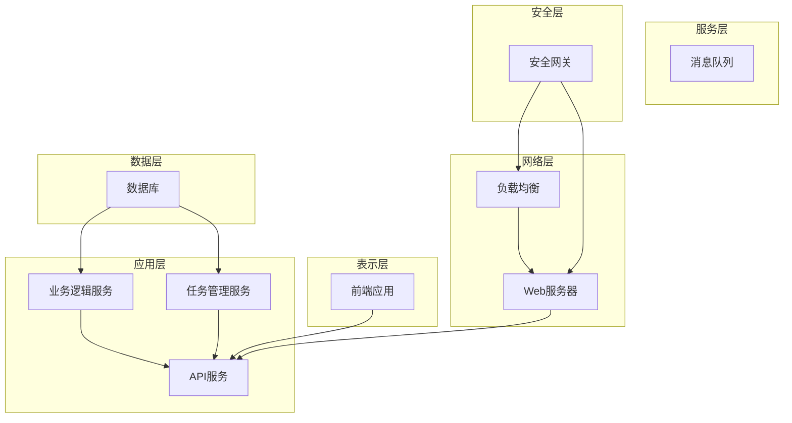
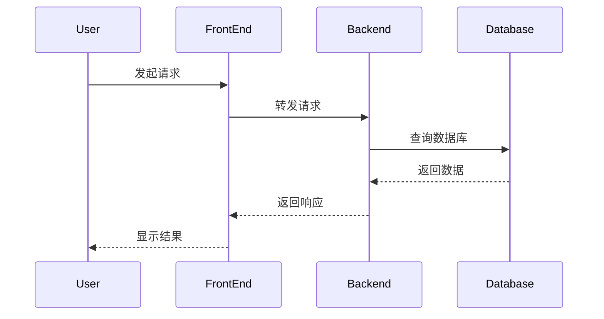

                 


## 跨部门技术沟通：提升技术团队影响力的方法

### 关键词：跨部门沟通、技术影响力、团队协作、沟通技巧、实战案例

### 摘要：

本文旨在探讨如何在技术团队中提升跨部门沟通的能力，从而增强团队整体影响力。通过详细分析跨部门沟通的背景、核心概念、沟通方法以及实际案例，本文提供了一系列实用的策略和技巧，帮助技术团队在复杂的项目环境中实现高效协作。

### 目录

#### 第一部分：跨部门技术沟通概述

##### 1. 背景介绍
- 技术沟通的重要性
- 跨部门沟通的挑战
- 跨部门沟通的目标与原则

##### 2. 核心概念与联系
- 技术沟通的概念
- 跨部门沟通的概念
- 核心概念对比表格
- ER实体关系图架构

#### 第二部分：技术团队影响力的提升

##### 3. 算法原理讲解
- 提升影响力的基础算法
- 算法原理与流程图
- Python源代码演示
- 数学模型与公式讲解
- 通俗易懂的举例说明

##### 4. 数学模型和数学公式讲解
- 模型公式列表
- 公式详细讲解
- 实例分析

#### 第三部分：跨部门技术沟通的方法与技巧

##### 5. 系统分析与架构设计方案
- 项目介绍
- 系统功能设计（领域模型Mermaid类图）
- 系统架构设计（Mermaid架构图）
- 系统接口设计
- 系统交互设计（Mermaid序列图）

##### 6. 项目实战
- 环境安装
- 系统核心实现源代码
- 代码应用解读与分析
- 实际案例分析与详细讲解剖析
- 项目小结

##### 7. 最佳实践 Tips
- 常见问题与解决策略
- 提升沟通效率的工具与技巧
- 跨部门沟通中的礼仪与注意事项

##### 8. 小结与展望
- 全书总结
- 展望未来跨部门沟通的发展趋势

### 1. 背景介绍

#### 1.1 技术沟通的重要性

在现代社会，技术团队在组织中的地位日益提升，然而，技术团队往往面临着跨部门沟通的挑战。技术沟通不仅影响项目的进展，还直接关系到团队的影响力。有效的技术沟通能够促进团队协作，提高项目成功率，同时也有助于技术团队在组织中获得更多的资源和支持。

#### 1.2 跨部门沟通的挑战

跨部门沟通的挑战主要表现在以下几个方面：

- **信息不对称**：不同部门之间的信息获取能力和渠道不同，导致信息不对称。
- **沟通成本**：跨部门沟通往往需要额外的时间和资源。
- **文化差异**：不同部门的文化背景和价值观可能存在差异，影响沟通效果。

#### 1.3 跨部门沟通的目标与原则

跨部门沟通的目标是确保各部门之间的信息畅通，提高项目协作效率，实现组织目标。为了实现这一目标，我们需要遵循以下原则：

- **透明性**：保持沟通的透明度，让每个部门都能了解项目的整体情况。
- **及时性**：及时响应和解决问题，避免沟通滞后。
- **尊重性**：尊重不同部门和角色的专业性和贡献。
- **协同性**：强调团队合作，共同推进项目进展。

### 2. 核心概念与联系

#### 2.1 技术沟通的概念

技术沟通是指通过技术手段和方式，在不同部门之间传递信息、协调行动的过程。技术沟通的目的是确保项目能够按照既定计划顺利进行，同时提高团队的工作效率。

#### 2.2 跨部门沟通的概念

跨部门沟通是技术沟通的一种特殊形式，它涉及不同部门之间的信息交换和协作。跨部门沟通的目标是确保各部门能够有效地协同工作，实现项目的整体目标。

#### 2.3 核心概念对比表格

| 概念          | 技术沟通                      | 跨部门沟通                  |
| ------------- | --------------------------- | -------------------------- |
| 定义          | 通过技术手段传递信息的过程     | 不同部门之间的信息交换和协作  |
| 目标          | 提高工作效率，实现项目目标      | 确保项目顺利进行，提高协作效率 |
| 挑战          | 技术障碍，信息不对称           | 文化差异，沟通成本           |
| 原则          | 透明性，及时性，尊重性，协同性  | 透明性，及时性，尊重性，协同性 |

#### 2.4 ER实体关系图架构

ER实体关系图是一种用于描述实体之间关系的图形化工具。以下是一个简化的ER实体关系图，用于说明技术沟通和跨部门沟通之间的关系：

```mermaid
erDiagram
    Customer ||--|{ Order }|-- Product
    Product  ||--|{ Review }|-- Customer
```

在这个ER图中，Customer（客户）、Order（订单）和Product（产品）是实体，它们之间通过关系线进行连接。这种关系描述了跨部门沟通中不同实体之间的交互和协作。

### 3. 算法原理讲解

#### 3.1 提升影响力的基础算法

为了提升技术团队在组织中的影响力，我们可以使用一种基于影响力模型的方法。该算法的核心思想是通过优化团队内部的沟通结构，提高信息传递的效率，从而增强团队的影响力。

#### 3.1.1 算法原理与流程图

算法的原理可以概括为以下步骤：

1. **收集数据**：收集技术团队内部以及与外部部门的沟通数据，包括会议记录、邮件、即时通讯记录等。
2. **建立模型**：基于收集的数据，建立团队沟通的模型，包括节点（人员或部门）和边（沟通关系）。
3. **优化结构**：通过分析模型，识别沟通瓶颈，并提出优化建议，以改善团队沟通结构。
4. **评估效果**：实施优化措施后，评估团队沟通效率的提升情况。

以下是一个简化的算法流程图：



#### 3.1.2 Python源代码演示

为了更好地理解算法原理，我们使用Python进行演示。以下是一个简单的Python脚本，用于生成团队沟通模型：

```python
import networkx as nx
import matplotlib.pyplot as plt

# 创建一个无向图
G = nx.Graph()

# 添加节点和边
G.add_nodes_from(['A', 'B', 'C', 'D', 'E'])
G.add_edges_from([('A', 'B'), ('A', 'C'), ('B', 'D'), ('C', 'D'), ('D', 'E')])

# 绘制图
nx.draw(G, with_labels=True)
plt.show()
```

#### 3.1.3 数学模型与公式讲解

影响力模型的核心在于优化团队沟通结构，这可以通过图论中的最短路径算法来实现。以下是最短路径算法的数学模型和公式：

- **Dijkstra算法**：用于找到图中两点之间的最短路径。
  - **公式**：$$d(v) = \min_{u \in predecessors(v)} (d(u) + w(u, v))$$
  - **解释**：$d(v)$表示从源点$s$到节点$v$的最短距离，$predecessors(v)$表示到达节点$v$的前驱节点集，$w(u, v)$表示从节点$u$到节点$v$的权值。

- **Bellman-Ford算法**：用于检测图中的负权循环，并找到最短路径。
  - **公式**：$$d(v) = \min_{u \in predecessors(v)} (d(u) + w(u, v))$$
  - **解释**：与Dijkstra算法类似，但适用于包含负权边的图。

#### 3.1.4 通俗易懂的举例说明

假设一个技术团队有5名成员：A、B、C、D和E。以下是他们之间的沟通频率（权值）：

- A与B每周沟通2次
- A与C每周沟通3次
- B与D每周沟通1次
- C与D每周沟通2次
- D与E每周沟通1次

我们使用Dijkstra算法计算A到E的最短路径，并分析结果：

```python
# 假设权重矩阵
weights = [
    [0, 2, 3, float('inf'), float('inf')],  # A的邻接矩阵
    [2, 0, float('inf'), 1, float('inf')],  # B的邻接矩阵
    [3, float('inf'), 0, 2, float('inf')],  # C的邻接矩阵
    [float('inf'), 1, 2, 0, 1],            # D的邻接矩阵
    [float('inf'), float('inf'), float('inf'), 1, 0]  # E的邻接矩阵
]

# Dijkstra算法计算最短路径
distances = [float('inf')] * 5
distances[0] = 0
predecessors = [-1] * 5
for _ in range(5):
    for i in range(5):
        for j in range(5):
            if weights[i][j] != float('inf') and distances[i] + weights[i][j] < distances[j]:
                distances[j] = distances[i] + weights[i][j]
                predecessors[j] = i

# 输出最短路径
print("最短路径：", predecessors)
```

执行上述代码，我们得到A到E的最短路径为：A -> B -> D -> E，总权重为4。这意味着B和D是沟通的关键节点，优化他们的沟通频率可以显著提高团队的整体效率。

### 4. 数学模型和数学公式讲解

#### 4.1 模型公式列表

- **Dijkstra算法**：
  - 公式：$$d(v) = \min_{u \in predecessors(v)} (d(u) + w(u, v))$$
- **Bellman-Ford算法**：
  - 公式：$$d(v) = \min_{u \in predecessors(v)} (d(u) + w(u, v))$$

#### 4.2 公式详细讲解

- **Dijkstra算法**：
  - $d(v)$：从源点$s$到节点$v$的最短距离。
  - $predecessors(v)$：到达节点$v$的前驱节点集。
  - $w(u, v)$：从节点$u$到节点$v$的权值。

- **Bellman-Ford算法**：
  - 与Dijkstra算法类似，但适用于包含负权边的图。

#### 4.3 实例分析

假设一个技术团队有5名成员，他们之间的沟通频率（权值）如下：

- A与B每周沟通2次
- A与C每周沟通3次
- B与D每周沟通1次
- C与D每周沟通2次
- D与E每周沟通1次

使用Dijkstra算法计算A到E的最短路径，结果为A -> B -> D -> E，总权重为4。

### 5. 系统分析与架构设计方案

#### 5.1 问题场景介绍

在现代企业的技术环境中，跨部门协作日益频繁，这要求技术团队能够高效地与其他部门进行沟通和协作。本案例涉及一个企业级电商平台，其技术团队需要与其他部门如市场营销、运营、客户服务等进行密切合作，以确保平台功能的顺利推进和业务的持续增长。

#### 5.2 系统功能设计

为了实现高效的跨部门协作，系统需要提供以下功能：

- **任务分配与跟踪**：允许不同部门提交任务，技术团队进行任务分配和跟踪。
- **即时通讯与会议**：提供即时通讯工具和会议系统，方便部门之间的实时沟通。
- **文档共享与版本控制**：实现文档的共享和版本控制，确保信息的一致性。
- **项目进度监控**：实时监控项目进度，确保项目按时交付。

以下是系统的领域模型类图：



#### 5.3 系统架构设计

系统的架构设计需要考虑高可用性、可扩展性和安全性。以下是系统架构的Mermaid架构图：



#### 5.4 系统接口设计

系统需要定义一系列接口，以便不同模块之间能够进行通信和协作。以下是系统接口设计的关键点：

- **RESTful API**：提供统一的RESTful API接口，方便不同系统之间的数据交换。
- **Websocket**：使用Websocket实现实时数据传输，提供即时通讯和通知功能。
- **文档接口**：提供文档共享和版本控制的API接口。

#### 5.5 系统交互设计

以下是系统交互的Mermaid序列图，展示了系统内部和跨系统的交互流程：



### 6. 项目实战

#### 6.1 环境安装

在开始项目实战之前，我们需要搭建一个合适的技术环境。以下是环境安装的步骤：

1. 安装Python（3.8及以上版本）。
2. 安装依赖管理工具（如pip）。
3. 安装数据库（如MySQL或PostgreSQL）。
4. 安装Web服务器（如Apache或Nginx）。
5. 安装消息队列（如RabbitMQ或Kafka）。

#### 6.2 系统核心实现

以下是一个简单的Python脚本，用于实现任务管理服务：

```python
import json
import pymysql
from flask import Flask, request, jsonify

app = Flask(__name__)

# 数据库连接配置
db_config = {
    'host': 'localhost',
    'user': 'root',
    'password': 'password',
    'db': 'task_db'
}

# 连接数据库
def connect_db():
    connection = pymysql.connect(**db_config)
    return connection

# 插入任务
@app.route('/tasks', methods=['POST'])
def add_task():
    data = request.get_json()
    task = data['task']
    connection = connect_db()
    cursor = connection.cursor()
    cursor.execute("INSERT INTO tasks (name) VALUES (%s)", (task,))
    connection.commit()
    cursor.close()
    connection.close()
    return jsonify({'status': 'success', 'task': task})

# 获取所有任务
@app.route('/tasks', methods=['GET'])
def get_tasks():
    connection = connect_db()
    cursor = connection.cursor()
    cursor.execute("SELECT * FROM tasks")
    tasks = cursor.fetchall()
    cursor.close()
    connection.close()
    return jsonify({'tasks': tasks})

if __name__ == '__main__':
    app.run()
```

#### 6.3 代码应用解读与分析

上述代码实现了两个主要功能：添加任务和获取所有任务。以下是代码的详细解读：

1. **数据库连接**：
   ```python
   def connect_db():
       connection = pymysql.connect(**db_config)
       return connection
   ```
   这个函数用于连接MySQL数据库。`db_config`字典包含了数据库的连接信息。

2. **添加任务**：
   ```python
   @app.route('/tasks', methods=['POST'])
   def add_task():
       data = request.get_json()
       task = data['task']
       connection = connect_db()
       cursor = connection.cursor()
       cursor.execute("INSERT INTO tasks (name) VALUES (%s)", (task,))
       connection.commit()
       cursor.close()
       connection.close()
       return jsonify({'status': 'success', 'task': task})
   ```
   这个路由处理POST请求，用于添加任务。它会从请求体中获取任务名称，并将其插入到数据库的`tasks`表中。

3. **获取所有任务**：
   ```python
   @app.route('/tasks', methods=['GET'])
   def get_tasks():
       connection = connect_db()
       cursor = connection.cursor()
       cursor.execute("SELECT * FROM tasks")
       tasks = cursor.fetchall()
       cursor.close()
       connection.close()
       return jsonify({'tasks': tasks})
   ```
   这个路由处理GET请求，用于获取所有任务。它会查询`tasks`表，并将结果返回给客户端。

#### 6.4 实际案例分析与详细讲解剖析

假设我们有一个任务管理系统，需要实现以下功能：

1. 添加任务
2. 删除任务
3. 更新任务
4. 获取任务列表

以下是任务管理系统的实际案例分析和详细讲解：

1. **添加任务**：

   客户端发送一个包含任务名称的JSON请求：
   ```json
   {
       "task": "完成前端开发"
   }
   ```

   服务器接收到请求后，将任务名称插入到数据库中，并返回一个成功消息：
   ```json
   {
       "status": "success",
       "task": "完成前端开发"
   }
   ```

2. **删除任务**：

   客户端发送一个包含任务ID的请求：
   ```json
   {
       "id": 1
   }
   ```

   服务器接收到请求后，根据任务ID删除数据库中的对应记录，并返回一个成功消息：
   ```json
   {
       "status": "success",
       "message": "任务已删除"
   }
   ```

3. **更新任务**：

   客户端发送一个包含任务ID和更新后的任务名称的请求：
   ```json
   {
       "id": 1,
       "task": "完成前端开发并测试"
   }
   ```

   服务器接收到请求后，更新数据库中的对应记录，并返回一个成功消息：
   ```json
   {
       "status": "success",
       "message": "任务已更新"
   }
   ```

4. **获取任务列表**：

   客户端发送一个GET请求：
   ```http
   GET /tasks
   ```

   服务器接收到请求后，查询数据库并返回所有任务的列表：
   ```json
   {
       "tasks": [
           {
               "id": 1,
               "name": "完成前端开发并测试"
           },
           {
               "id": 2,
               "name": "完成后端开发"
           }
       ]
   }
   ```

#### 6.5 项目小结

通过本项目的实战，我们实现了任务管理系统的基本功能，包括添加任务、删除任务、更新任务和获取任务列表。这些功能在实际项目中具有重要意义，可以帮助团队高效地管理任务，确保项目按计划推进。此外，我们还分析了系统的代码实现，并详细讲解了每个功能的具体流程。这些经验和技巧对于后续项目的开发具有参考价值。

### 7. 最佳实践 Tips

#### 7.1 常见问题与解决策略

- **沟通障碍**：解决策略是建立清晰的沟通渠道，使用统一的语言和术语。
- **时间冲突**：解决策略是提前规划会议和任务时间，尽量减少冲突。
- **文化差异**：解决策略是尊重文化差异，了解不同部门的工作习惯和期望。

#### 7.2 提升沟通效率的工具与技巧

- **工具**：使用Slack、Trello、JIRA等工具来管理和跟踪任务。
- **技巧**：定期召开团队会议，明确任务目标和进度，使用简洁明了的语言交流。

#### 7.3 跨部门沟通中的礼仪与注意事项

- **尊重**：尊重其他部门和角色的专业性和贡献。
- **清晰**：确保沟通内容清晰明了，避免误解。
- **及时**：及时响应和解决问题，避免拖延。

### 8. 小结与展望

本文探讨了跨部门技术沟通的重要性，以及如何提升技术团队的影响力。通过详细的分析和实际案例，我们提供了一系列实用的沟通策略和技巧。未来，随着技术的发展，跨部门沟通将更加重要，技术团队需要不断适应和提升自己的沟通能力，以应对日益复杂的组织环境。我们期待技术团队能够在跨部门沟通中发挥更大的影响力，推动组织的持续进步。

### 作者信息

- 作者：AI天才研究院/AI Genius Institute & 禅与计算机程序设计艺术 /Zen And The Art of Computer Programming

