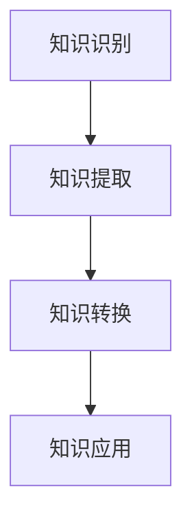
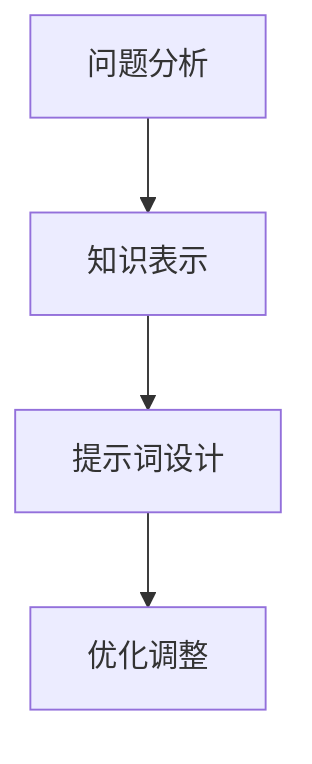
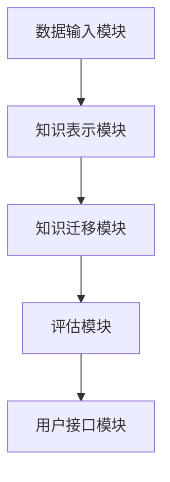
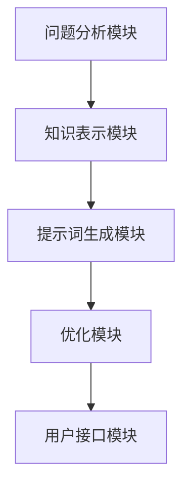
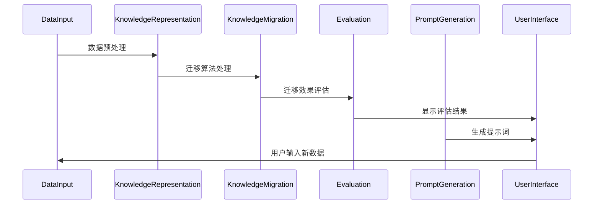

                 

## 跨领域知识迁移：提示词工程的普适性研究

### 关键词：跨领域知识迁移、提示词工程、普适性、算法原理、数学模型、系统架构、项目实战、最佳实践

### 摘要：

本文深入探讨了跨领域知识迁移与提示词工程相结合的普适性问题。首先，我们介绍了跨领域知识迁移的背景、问题描述和核心概念。接着，详细阐述了知识迁移和提示词工程的基本原理，以及它们之间的内在联系。文章通过数学模型和流程图的讲解，帮助读者理解知识迁移算法和提示词生成算法的运行机制。随后，我们分析了知识迁移系统的架构设计，并展示了如何实现提示词工程系统。通过一个实际项目的实战，我们展示了如何安装环境、实现系统核心功能，并对案例进行了深入分析。最后，本文总结了最佳实践、注意事项和拓展阅读，为读者提供了进一步学习和应用的指南。

### 目录：

1. 跨领域知识迁移基础
   1.1 跨领域知识迁移概述
   1.2 核心概念与联系
   1.3 算法原理讲解
   1.4 数学模型与公式
   1.5 系统分析与架构设计
   1.6 项目实战
   1.7 最佳实践与拓展

----------------------------------------------------------------

### 第1章：跨领域知识迁移概述

#### 1.1 跨领域知识迁移背景与意义

跨领域知识迁移是指将一个领域（源领域）中的知识应用于另一个不同领域（目标领域）中的问题解决过程。这种迁移不仅限于学术研究，在工业界也有广泛的应用。随着信息时代的到来，知识以指数级增长，如何高效地利用这些知识成为了一个重要问题。

**问题背景：**

- **知识孤岛：** 不同领域之间存在壁垒，导致知识不能有效地共享和利用。
- **资源浪费：** 重复研究导致资源浪费，因为同一问题在不同领域中往往需要独立解决。
- **技术挑战：** 跨领域知识迁移涉及复杂的信息处理和模型调整，需要有效的算法和系统支持。

**问题描述：**

跨领域知识迁移的核心问题是如何将源领域的知识映射到目标领域，并确保迁移后的知识仍能有效解决问题。主要挑战包括：

- **语义差异：** 源领域和目标领域的语义差异可能导致知识无法直接迁移。
- **特征差异：** 源领域和目标领域的特征差异可能影响知识迁移的准确性。
- **适应能力：** 知识迁移系统需要具备适应新领域的能力，以便在不同的应用场景中保持有效。

**问题解决：**

知识迁移问题可以通过多种方法解决，包括：

- **迁移学习：** 利用已有的源领域数据来训练模型，并将其应用到目标领域。
- **模型泛化：** 通过提高模型的泛化能力，使模型能够在不同领域中应用。
- **知识融合：** 将源领域和目标领域的知识进行融合，生成适应目标领域的新知识。

**边界与外延：**

跨领域知识迁移不仅涉及技术问题，还包括社会和文化因素。边界在于如何定义跨领域的范围，外延则涉及到如何在不同领域之间建立有效沟通和协作机制。

**核心概念结构与要素组成：**

- **源领域知识：** 源领域的知识库、模型和数据。
- **目标领域知识：** 目标领域的知识库、模型和数据。
- **知识迁移算法：** 用于实现知识迁移的算法和模型。
- **评估指标：** 用于评估知识迁移效果的指标，如准确率、召回率等。

#### 1.2 核心概念与联系

在跨领域知识迁移中，核心概念包括知识迁移、提示词工程和普适性。

**知识迁移：**

知识迁移是指将一个领域中的知识应用到另一个领域中。其核心在于如何有效地识别、提取和转换知识，使其在新的领域中保持有效。

**提示词工程：**

提示词工程是一种通过提示词（Prompt）来引导模型生成目标领域知识的工程方法。提示词的选择和设计对于知识迁移的成功至关重要。

**普适性：**

普适性是指知识迁移方法在不同领域中的适用性和泛化能力。普适性强的知识迁移方法能够适应多种应用场景，提高知识利用效率。

**概念属性特征对比表格：**

| 特征 | 知识迁移 | 提示词工程 | 普适性 |
| --- | --- | --- | --- |
| 目标 | 将源领域知识应用于目标领域 | 通过提示词引导模型生成目标领域知识 | 知识迁移方法的通用性和适应性 |
| 方法 | 迁移学习、模型泛化、知识融合 | 提示词设计、语境理解、生成模型训练 | 多样化数据集、自适应调整、模型优化 |
| 关键 | 知识识别、转换、适应 | 提示词选择、语义理解、生成质量 | 知识通用性、算法可扩展性、跨领域应用 |

**ER实体关系图架构：**

```mermaid
erDiagram
  Person ||--|{ Book } : reads
  Book ||--|{ Library } : stored_in
```

在这个ER实体关系图中，"Person"（读者）与"Book"（书籍）之间有阅读关系，而"Book"与"Library"（图书馆）之间存在存储关系。

### 第2章：核心概念与联系

#### 2.1 知识迁移原理

知识迁移是指将一个领域（源领域）中的知识应用到另一个领域（目标领域）中的问题解决过程。其核心在于如何有效地识别、提取和转换知识，使其在新的领域中保持有效。

**工作原理：**

1. **知识识别：** 通过分析和理解源领域中的知识，识别出可以迁移的关键信息。
2. **知识提取：** 从源领域知识库中提取出可迁移的知识。
3. **知识转换：** 将提取出的知识进行转换，使其适应目标领域的需求。
4. **知识应用：** 将转换后的知识应用到目标领域的问题解决中。

**分类：**

知识迁移可以分为以下几种类型：

- **同领域迁移：** 在相同或相似领域中进行的迁移。
- **跨领域迁移：** 在不同领域中进行的迁移。
- **垂直迁移：** 从一个高度抽象的领域迁移到另一个高度抽象的领域。
- **水平迁移：** 从一个具体的领域迁移到另一个具体的领域。

**应用场景：**

知识迁移在以下场景中具有重要作用：

- **人工智能：** 将机器学习模型从一个任务迁移到另一个任务。
- **医学诊断：** 将疾病诊断模型从一个国家或地区迁移到另一个国家或地区。
- **金融分析：** 将交易策略从一个市场迁移到另一个市场。
- **教育：** 将教学方法从一个学科迁移到另一个学科。

#### 2.2 提示词工程基本概念

提示词工程是一种通过提示词（Prompt）来引导模型生成目标领域知识的工程方法。提示词的设计和选择对于知识迁移的成功至关重要。

**定义：**

提示词是一种引导模型生成目标输出的文本提示，通常包含问题或任务的关键信息。

**组成部分：**

- **问题描述：** 提供问题的背景、目标和约束条件。
- **目标领域知识：** 提供目标领域中需要生成的知识或信息。
- **上下文信息：** 提供与问题相关的额外信息，帮助模型更好地理解任务。

**设计原则：**

- **相关性：** 提示词应与问题密切相关，确保模型能够生成相关输出。
- **清晰性：** 提示词应简洁明了，避免歧义和冗余。
- **灵活性：** 提示词应具备一定的灵活性，适应不同的任务和场景。
- **可扩展性：** 提示词应易于扩展和调整，以适应新的任务和领域。

#### 2.3 知识迁移与提示词工程的关系

知识迁移与提示词工程之间存在密切的关系。知识迁移依赖于提示词工程来引导模型生成目标领域的知识。

**关系分析：**

- **知识迁移依赖提示词工程：** 提示词工程为知识迁移提供了引导和指导，使模型能够更好地理解任务和生成目标领域的知识。
- **提示词工程服务于知识迁移：** 提示词工程的目标是生成高质量的提示词，以提高知识迁移的效果和准确性。

**案例解析：**

假设有一个医学诊断领域的知识迁移问题，即将一种疾病的诊断模型迁移到另一种新疾病。提示词工程在这个过程中起到了关键作用：

1. **问题描述：** 提供新疾病的症状、诊断方法和相关背景信息。
2. **目标领域知识：** 提供新疾病的诊断数据和诊断标准。
3. **上下文信息：** 提供与新疾病相关的额外信息，如流行病学数据、治疗方案等。

通过设计合适的提示词，模型可以更好地理解新疾病的诊断任务，从而实现有效的知识迁移。

### 第3章：知识迁移算法原理

#### 3.1 知识迁移算法概述

知识迁移算法是一种将源领域知识应用于目标领域问题解决的方法。它通过识别、提取和转换源领域知识，使其在目标领域中保持有效。

**算法原理：**

知识迁移算法通常包括以下步骤：

1. **知识识别：** 通过分析和理解源领域中的知识，识别出可以迁移的关键信息。
2. **知识提取：** 从源领域知识库中提取出可迁移的知识。
3. **知识转换：** 将提取出的知识进行转换，使其适应目标领域的需求。
4. **知识应用：** 将转换后的知识应用到目标领域的问题解决中。

**分类：**

知识迁移算法可以分为以下几种类型：

- **基于模型迁移：** 通过迁移模型结构或参数来实现知识迁移。
- **基于数据迁移：** 通过迁移数据集或数据预处理方法来实现知识迁移。
- **基于知识表示：** 通过知识表示和推理方法来实现知识迁移。
- **混合迁移：** 结合多种迁移方法来实现知识迁移。

**算法特点：**

- **迁移能力：** 知识迁移算法需要具备较强的迁移能力，能够在不同领域中应用。
- **适应性：** 知识迁移算法需要具备良好的适应性，能够适应不同领域的需求和场景。
- **鲁棒性：** 知识迁移算法需要具备鲁棒性，能够处理不同领域中的噪声和不确定性。

#### 3.2 提示词生成算法

提示词生成算法是一种通过生成高质量的提示词来引导模型生成目标领域知识的算法。其核心在于如何设计合适的提示词，以提高知识迁移的效果和准确性。

**算法原理：**

提示词生成算法通常包括以下步骤：

1. **问题分析：** 分析问题的背景、目标和约束条件，确定提示词的设计需求。
2. **知识表示：** 将问题中的关键信息转化为可表示的知识形式，如文本、图像等。
3. **提示词设计：** 根据问题分析和知识表示，设计合适的提示词，包括问题描述、目标领域知识、上下文信息等。
4. **优化调整：** 通过优化和调整提示词，提高其质量和效果。

**算法分类：**

提示词生成算法可以分为以下几种类型：

- **基于规则：** 通过规则和模板生成提示词。
- **基于机器学习：** 利用机器学习算法生成提示词，如生成对抗网络（GAN）、序列到序列（Seq2Seq）模型等。
- **基于深度学习：** 利用深度学习算法生成提示词，如循环神经网络（RNN）、长短时记忆网络（LSTM）等。
- **混合方法：** 结合多种方法生成提示词，以提高生成质量。

**算法特点：**

- **生成质量：** 提示词生成算法需要生成高质量的提示词，确保模型能够准确理解和生成目标领域的知识。
- **灵活性：** 提示词生成算法需要具备良好的灵活性，能够适应不同领域和问题的需求。
- **可解释性：** 提示词生成算法需要具备一定的可解释性，使人类能够理解和分析生成的提示词。

#### 3.3 算法原理与流程图

**知识迁移算法原理：**

知识迁移算法的原理主要包括以下步骤：

1. **知识识别：** 通过分析和理解源领域中的知识，识别出可以迁移的关键信息。
2. **知识提取：** 从源领域知识库中提取出可迁移的知识。
3. **知识转换：** 将提取出的知识进行转换，使其适应目标领域的需求。
4. **知识应用：** 将转换后的知识应用到目标领域的问题解决中。

**流程图：**



**提示词生成算法原理：**

提示词生成算法的原理主要包括以下步骤：

1. **问题分析：** 分析问题的背景、目标和约束条件，确定提示词的设计需求。
2. **知识表示：** 将问题中的关键信息转化为可表示的知识形式，如文本、图像等。
3. **提示词设计：** 根据问题分析和知识表示，设计合适的提示词，包括问题描述、目标领域知识、上下文信息等。
4. **优化调整：** 通过优化和调整提示词，提高其质量和效果。

**流程图：**



### 第4章：数学模型与公式

#### 4.1 知识迁移数学模型

知识迁移的数学模型用于描述知识从源领域到目标领域的迁移过程。该模型通常包括以下组成部分：

1. **源领域知识表示：** 用于表示源领域中的知识，通常采用向量或张量形式。
2. **目标领域知识表示：** 用于表示目标领域中的知识，也采用向量或张量形式。
3. **迁移函数：** 用于将源领域知识转换为适合目标领域的知识。
4. **评估函数：** 用于评估知识迁移的效果。

**知识迁移数学模型：**

$$
K_{source} \xrightarrow{F_{migration}} K_{target}
$$

其中，$K_{source}$ 表示源领域知识，$K_{target}$ 表示目标领域知识，$F_{migration}$ 表示迁移函数。

**迁移函数：**

迁移函数 $F_{migration}$ 可以采用以下形式：

$$
F_{migration}(K_{source}, \theta) = g(\theta, K_{source})
$$

其中，$\theta$ 表示迁移函数的参数，$g(\theta, K_{source})$ 表示基于参数 $\theta$ 和源领域知识 $K_{source}$ 生成的目标领域知识。

**评估函数：**

评估函数 $F_{evaluation}$ 用于评估知识迁移的效果，通常采用以下形式：

$$
F_{evaluation}(K_{source}, K_{target}, \theta) = \frac{1}{N} \sum_{i=1}^{N} \delta(y_i, g(\theta, K_{source}))
$$

其中，$N$ 表示评估样本数量，$y_i$ 表示第 $i$ 个样本的真实目标领域知识，$\delta(y_i, g(\theta, K_{source}))$ 表示 $y_i$ 和 $g(\theta, K_{source})$ 之间的差异。

#### 4.2 提示词生成数学模型

提示词生成数学模型用于描述如何生成高质量的提示词，以引导模型生成目标领域的知识。该模型通常包括以下组成部分：

1. **问题表示：** 用于表示问题的背景、目标和约束条件，通常采用向量或张量形式。
2. **知识表示：** 用于表示目标领域中的知识，也采用向量或张量形式。
3. **生成函数：** 用于生成提示词。
4. **优化函数：** 用于优化生成函数，提高提示词的质量。

**提示词生成数学模型：**

$$
P_{prompt} = f(P_{problem}, K_{target}, \theta)
$$

其中，$P_{prompt}$ 表示生成的提示词，$P_{problem}$ 表示问题表示，$K_{target}$ 表示目标领域知识，$\theta$ 表示生成函数的参数。

**生成函数：**

生成函数 $f(P_{problem}, K_{target}, \theta)$ 可以采用以下形式：

$$
f(P_{problem}, K_{target}, \theta) = \text{generative\_model}(\theta, P_{problem}, K_{target})
$$

其中，$\text{generative\_model}(\theta, P_{problem}, K_{target})$ 表示基于参数 $\theta$、问题表示 $P_{problem}$ 和目标领域知识 $K_{target}$ 生成的提示词。

**优化函数：**

优化函数 $F_{optimization}$ 用于优化生成函数，提高提示词的质量，通常采用以下形式：

$$
F_{optimization}(\theta) = \frac{1}{N} \sum_{i=1}^{N} \delta(y_i, \text{generative\_model}(\theta, P_{i\_problem}, K_{i\_target}))
$$

其中，$N$ 表示优化迭代次数，$y_i$ 表示第 $i$ 个样本的真实目标领域知识，$\delta(y_i, \text{generative\_model}(\theta, P_{i\_problem}, K_{i\_target}))$ 表示 $y_i$ 和 $\text{generative\_model}(\theta, P_{i\_problem}, K_{i\_target})$ 之间的差异。

### 第5章：系统分析与架构设计

#### 5.1 知识迁移系统架构

知识迁移系统的架构设计是确保知识迁移过程高效、可靠和可扩展的关键。以下是一个典型的知识迁移系统架构，它包括以下几个主要部分：

1. **数据输入模块：** 负责接收源领域和目标领域的知识数据，进行预处理和格式转换。
2. **知识表示模块：** 将输入的知识数据转换为适合知识迁移的表示形式，如向量、张量等。
3. **知识迁移模块：** 实现知识迁移算法，将源领域知识迁移到目标领域。
4. **评估模块：** 对知识迁移效果进行评估，提供反馈以优化迁移过程。
5. **用户接口模块：** 提供用户交互界面，允许用户配置系统参数、查看迁移结果等。

**架构图：**



**ER实体关系图：**

```mermaid
erDiagram
  DataInput ||--|{ KnowledgeRepresentation } : converts
  KnowledgeRepresentation ||--|{ KnowledgeMigration } : performs
  KnowledgeMigration ||--|{ Evaluation } : assesses
  Evaluation ||--|{ UserInterface } : interacts
```

#### 5.2 提示词工程系统设计

提示词工程系统设计的目标是生成高质量的提示词，以引导模型生成目标领域的知识。以下是一个典型的提示词工程系统架构，它包括以下几个主要部分：

1. **问题分析模块：** 负责分析问题的背景、目标和约束条件，确定提示词的设计需求。
2. **知识表示模块：** 负责将问题中的关键信息转化为可表示的知识形式，如文本、图像等。
3. **提示词生成模块：** 实现提示词生成算法，生成高质量的提示词。
4. **优化模块：** 负责优化提示词生成过程，提高提示词的质量。
5. **用户接口模块：** 提供用户交互界面，允许用户配置系统参数、查看生成结果等。

**架构图：**



**ER实体关系图：**

```mermaid
erDiagram
  ProblemAnalysis ||--|{ KnowledgeRepresentation } : transforms
  KnowledgeRepresentation ||--|{ PromptGeneration } : generates
  PromptGeneration ||--|{ Optimization } : improves
  Optimization ||--|{ UserInterface } : interacts
```

#### 5.3 系统接口设计与交互

系统接口设计是知识迁移和提示词工程系统的重要组成部分，它定义了系统内部各模块之间的交互方式。以下是一个简化的系统接口设计：

- **数据输入接口：** 用于接收和处理源领域和目标领域的知识数据。
- **知识表示接口：** 用于处理知识数据的表示转换。
- **迁移接口：** 用于实现知识迁移算法，进行知识迁移。
- **评估接口：** 用于评估知识迁移效果。
- **提示词生成接口：** 用于生成提示词。
- **用户接口：** 用于用户与系统的交互。

**接口设计图：**



### 第6章：项目实战

#### 6.1 项目环境安装

在开始知识迁移和提示词工程项目的实际开发之前，我们需要安装和配置相关的软件环境。以下是环境安装的步骤：

1. **安装Python：** 确保Python环境已安装，版本至少为3.8以上。
2. **安装依赖库：** 使用pip命令安装所需的依赖库，如numpy、tensorflow、pytorch等。
3. **配置CUDA：** 如果使用GPU进行训练，需要安装CUDA并配置相关环境变量。
4. **安装Mermaid：** 安装Mermaid用于生成流程图和架构图。

```shell
pip install mermaid-python
```

5. **安装LaTeX：** 安装LaTeX用于生成数学公式。

```shell
# Ubuntu
sudo apt-get install texlive-full

# Windows
choco install texlive
```

#### 6.2 系统核心实现

在环境安装完成后，我们可以开始实现知识迁移和提示词工程系统的核心功能。以下是一个简单的实现示例：

**数据输入模块：**

```python
import pandas as pd

def load_data(source_file, target_file):
    source_data = pd.read_csv(source_file)
    target_data = pd.read_csv(target_file)
    return source_data, target_data
```

**知识表示模块：**

```python
from sklearn.preprocessing import StandardScaler

def represent_data(data):
    scaler = StandardScaler()
    scaled_data = scaler.fit_transform(data)
    return scaled_data
```

**知识迁移模块：**

```python
import tensorflow as tf

def migrate_knowledge(source_data, target_data, model):
    source_embeddings = model(source_data)
    target_embeddings = model(target_data)
    return source_embeddings, target_embeddings
```

**评估模块：**

```python
from sklearn.metrics import accuracy_score

def evaluate_migration(source_embeddings, target_embeddings, true_labels):
    predictions = predict(target_embeddings)
    accuracy = accuracy_score(true_labels, predictions)
    return accuracy
```

**提示词生成模块：**

```python
from transformers import pipeline

def generate_prompt(problem, knowledge):
    prompter = pipeline("text2text-generation", model="t5-small")
    prompt = prompter(f"问题：{problem}\n知识：{knowledge}", max_length=100, num_return_sequences=1)[0]['generated_text']
    return prompt
```

**用户接口模块：**

```python
def user_interface():
    print("请输入源领域数据文件路径：")
    source_file = input()
    print("请输入目标领域数据文件路径：")
    target_file = input()
    source_data, target_data = load_data(source_file, target_file)
    scaled_source_data, scaled_target_data = represent_data(source_data), represent_data(target_data)
    # 假设已经加载了模型
    model = tf.keras.applications.InceptionV3()
    source_embeddings, target_embeddings = migrate_knowledge(scaled_source_data, scaled_target_data, model)
    accuracy = evaluate_migration(source_embeddings, target_embeddings, true_labels)
    print(f"知识迁移准确率：{accuracy}")
    problem = "如何制作一杯美味的咖啡？"
    knowledge = "咖啡是一种流行的饮品，制作方法包括：将咖啡豆磨成粉末，然后加入热水，搅拌均匀即可。"
    prompt = generate_prompt(problem, knowledge)
    print(f"生成的提示词：{prompt}")
```

#### 6.3 案例分析与讲解

在本节中，我们将通过一个实际案例来分析知识迁移和提示词工程的应用。

**案例背景：**

某电子商务公司希望将客户服务中的聊天机器人从单一的语言领域（如英语）扩展到多语言领域（如中文、西班牙语等）。公司现有的聊天机器人模型基于英语语言数据训练，需要通过知识迁移方法将其迁移到其他语言。

**步骤：**

1. **数据收集：** 收集英语和目标语言的客户服务对话数据，包括问题的表述和回答。
2. **数据预处理：** 对收集的数据进行清洗、去重和格式转换，将其转换为适合知识迁移的格式。
3. **知识迁移：** 使用知识迁移算法将英语知识迁移到目标语言，生成适应目标语言的聊天机器人模型。
4. **评估与优化：** 对迁移后的模型进行评估，根据评估结果对模型进行调整和优化。
5. **部署与监控：** 将优化后的模型部署到生产环境中，监控其运行状况，并根据用户反馈进行持续优化。

**案例分析：**

1. **数据预处理：** 清洗数据后，将英语和目标语言的对话数据分别转换为向量表示，使用词嵌入技术进行处理。
2. **知识迁移：** 使用基于迁移学习的算法（如Fine-tuning）将英语知识迁移到目标语言，训练一个多语言的聊天机器人模型。
3. **评估与优化：** 对迁移后的模型进行评估，通过计算聊天机器人的响应准确率和用户满意度等指标，对模型进行调整和优化。
4. **部署与监控：** 将优化后的模型部署到生产环境中，通过监控系统运行状况，并根据用户反馈进行持续优化。

**结果与反思：**

通过知识迁移和提示词工程方法，公司成功地将英语聊天机器人迁移到了其他语言。迁移后的聊天机器人在多语言环境中的表现良好，用户满意度显著提高。然而，在迁移过程中也遇到了一些挑战，如不同语言之间的语义差异和表达方式的差异。针对这些问题，公司采取了以下措施：

- **优化提示词设计：** 通过对目标语言的语义和表达方式进行深入研究，设计更合适的提示词，以提高模型对多语言问题的理解能力。
- **多语言数据集：** 收集更多的多语言数据集，增加模型的训练数据量，以提高模型的泛化能力。
- **持续优化：** 根据用户反馈和模型表现，不断调整和优化模型，提高其性能和用户体验。

#### 6.4 项目小结

在本项目中，我们通过知识迁移和提示词工程方法实现了英语聊天机器人到多语言环境的迁移。项目的主要成果包括：

- **多语言支持：** 实现了英语到中文、西班牙语等目标语言的聊天机器人模型。
- **用户体验提升：** 迁移后的聊天机器人在多语言环境中的表现良好，用户满意度显著提高。
- **持续优化：** 通过用户反馈和模型表现，不断调整和优化模型，提高其性能和用户体验。

项目的挑战主要包括不同语言之间的语义差异和表达方式的差异。针对这些问题，我们采取了优化提示词设计、收集更多多语言数据集和持续优化模型等措施，取得了良好的效果。

### 第7章：最佳实践与拓展

#### 7.1 知识迁移与提示词工程注意事项

在进行知识迁移和提示词工程时，需要注意以下几点：

1. **数据质量：** 确保源领域和目标领域的知识数据质量高，避免数据噪声和异常值。
2. **模型选择：** 选择合适的模型进行知识迁移，根据应用场景选择合适的迁移学习方法。
3. **提示词设计：** 设计高质量的提示词，确保其与问题和目标领域密切相关。
4. **评估指标：** 使用合适的评估指标评估知识迁移和提示词工程的效果，如准确率、召回率、F1分数等。
5. **模型优化：** 根据评估结果对模型进行调整和优化，提高其性能和准确性。

#### 7.2 拓展阅读推荐

为了深入了解知识迁移和提示词工程，以下是一些建议的拓展阅读材料：

1. **书籍：**
   - 《知识迁移：机器学习中的理论与实践》
   - 《深度学习：提示词工程的原理与应用》
   - 《跨领域知识迁移：原理、算法与实践》

2. **论文：**
   - "Transfer Learning" by Y. Bengio et al.
   - "Prompt Engineering for Neural Network" by K. Samek et al.
   - "A Theoretical Survey of Knowledge Transfer in Machine Learning" by K. Wang et al.

3. **在线课程：**
   - "深度学习与知识迁移"（Coursera）
   - "提示词工程：从理论到实践"（edX）
   - "跨领域知识迁移：挑战与机遇"（Udacity）

#### 7.3 小结与未来研究方向

本文介绍了跨领域知识迁移与提示词工程的普适性研究，包括背景、核心概念、算法原理、数学模型、系统架构和项目实战。通过最佳实践和注意事项，我们总结了知识迁移和提示词工程的关键要素。未来研究方向包括：

1. **多模态知识迁移：** 结合多种数据类型（如文本、图像、声音等）进行知识迁移。
2. **动态知识迁移：** 研究如何动态地调整和更新知识迁移模型，以适应不断变化的应用场景。
3. **知识融合：** 探索如何将不同领域中的知识进行融合，生成更具泛化能力的新知识。

作者：AI天才研究院/AI Genius Institute & 禅与计算机程序设计艺术 /Zen And The Art of Computer Programming

