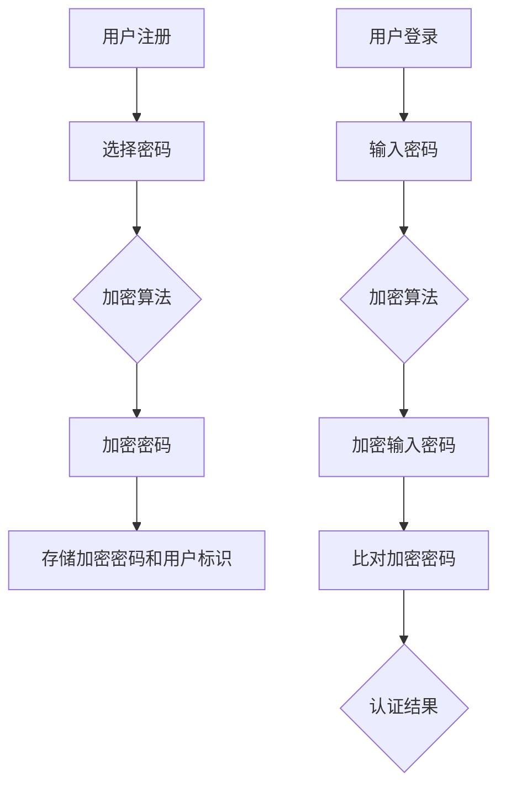
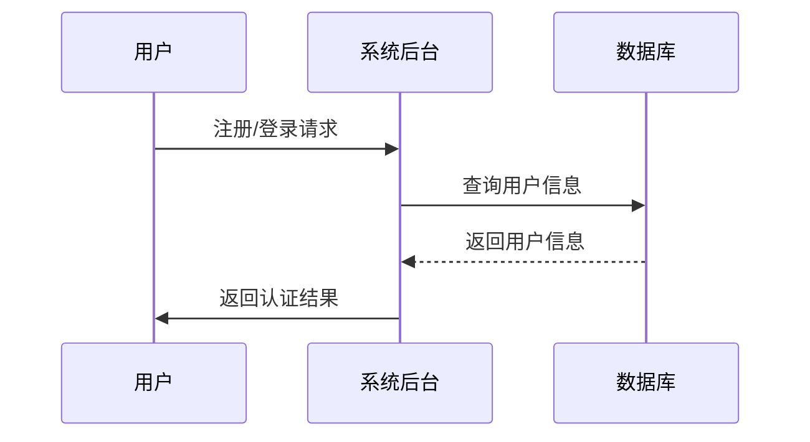

                 


## 第一部分：背景介绍

### 1.1.1 问题背景

在当今信息化和数字化的时代，身份认证和访问控制系统成为了各类组织和机构安全管理的重要环节。随着互联网的普及和信息技术的飞速发展，传统的身份认证与访问控制手段已难以满足日益复杂的网络安全需求。身份认证涉及到用户验证其身份的过程，而访问控制则是确保用户在获得认证后，只有权限访问特定的资源。

#### 核心概念术语说明

- **身份认证**：验证用户身份的过程，包括用户名、密码、指纹、面部识别等。
- **访问控制**：确保用户在认证后只能访问被授权的资源。

#### 问题背景详细说明

1. **网络安全威胁增加**：随着网络攻击手段的日益复杂，传统的身份认证与访问控制方式已无法有效抵御攻击。
2. **用户需求多样化**：随着数字化服务的普及，用户对便捷性、安全性的要求越来越高。
3. **数据泄露风险**：未经授权的访问可能导致敏感数据泄露，对组织造成严重损失。

### 1.1.2 问题描述

身份认证与访问控制系统设计的关键问题是确保系统的安全性、可靠性和易用性。设计一个高效且安全的身份认证系统，需要考虑到多种认证方法、用户的便捷性和系统的高效性。访问控制系统的设计则需要确保用户权限的精细管理，避免未经授权的访问，同时保障系统的灵活性。

#### 问题描述详细说明

1. **安全性**：如何确保用户的身份信息在传输和存储过程中不被泄露或篡改？
2. **可靠性**：系统如何保证在高峰期也能稳定运行，不因负载过高而崩溃？
3. **易用性**：如何设计一个既安全又方便用户使用的身份认证和访问控制流程？

### 1.1.3 问题解决

解决上述问题的关键在于采用先进的身份认证技术和访问控制策略，结合系统的整体设计，实现安全、可靠且高效的身份认证与访问控制系统。这包括但不限于以下方面：

1. **多因素认证**：结合密码、指纹、面部识别等多种认证方式，提高认证的安全性和可靠性。
2. **权限管理**：采用RBAC（基于角色的访问控制）或ABAC（基于属性的访问控制）等策略，确保用户权限的精细化管理。
3. **身份认证协议**：使用OAuth、SAML等标准化的身份认证协议，提高系统间的互操作性和安全性。
4. **安全审计与日志记录**：对用户的操作进行审计，记录日志，以便在出现安全问题时进行追踪和调查。
5. **用户界面设计**：设计易用的用户界面，提高用户的认证体验。

#### 问题解决详细说明

1. **多因素认证**：通过多种认证方式，增加攻击者入侵的难度，提高系统的安全性。
2. **权限管理**：通过角色和属性来分配和管理用户权限，确保用户只能访问被授权的资源。
3. **身份认证协议**：使用标准化的认证协议，提高系统的兼容性和安全性。
4. **安全审计与日志记录**：通过审计和日志记录，及时发现和应对安全事件。
5. **用户界面设计**：通过友好的用户界面设计，提高用户的使用体验。

### 1.1.4 边界与外延

身份认证与访问系统的设计不仅涉及到技术层面，还涉及到法律、伦理和管理等方面。在设计时，需要考虑以下边界与外延：

1. **法律合规性**：确保系统符合相关的法律法规要求，如《个人信息保护法》等。
2. **用户隐私保护**：在用户身份认证过程中，要保护用户的隐私信息，避免信息泄露。
3. **安全性与便捷性的平衡**：在提高安全性的同时，要考虑用户的便捷性，避免过于复杂的认证流程影响用户体验。
4. **可扩展性**：系统设计应具备良好的可扩展性，以适应未来可能的技术发展和需求变化。

#### 边界与外延详细说明

1. **法律合规性**：随着网络安全法的实施，身份认证与访问控制系统需要遵守相关法律法规，确保合规性。
2. **用户隐私保护**：在身份认证过程中，要确保用户隐私不被泄露，遵守隐私保护规定。
3. **安全性与便捷性的平衡**：在保障安全性的同时，需要考虑用户的便捷性，避免过度增加认证流程的复杂性。
4. **可扩展性**：系统设计应考虑未来需求变化，具备良好的扩展性。

### 1.1.5 概念结构与核心要素组成

身份认证与访问控制系统的核心概念和要素包括：

1. **认证**：包括用户身份验证、密码验证、生物识别等。
2. **授权**：包括权限分配、访问控制策略的制定。
3. **审计**：包括日志记录、操作审计等。
4. **用户界面**：包括认证界面、管理界面等。
5. **安全性**：包括数据加密、通信安全等。

#### 概念结构与核心要素组成详细说明

1. **认证**：认证是整个系统的核心，包括多种验证方式，如用户名、密码、指纹、面部识别等。
2. **授权**：授权是确保用户权限的精细化管理，通过角色和属性来分配和管理用户权限。
3. **审计**：审计用于记录用户的操作，以便在出现安全问题时进行追踪和调查。
4. **用户界面**：用户界面是用户与系统交互的接口，设计要考虑用户体验。
5. **安全性**：安全性是整个系统的关键，包括数据加密、通信安全等方面。

### 第一部分总结

本部分介绍了身份认证与访问控制系统设计的背景、问题描述、问题解决方法及其边界与外延。在后续章节中，我们将深入探讨核心概念、技术原理、系统设计与实施等方面的内容，帮助读者全面了解和掌握身份认证与访问控制系统设计的方法和实践。

## 核心概念与联系

在深入探讨身份认证与访问控制系统设计之前，首先需要明确一些核心概念及其相互关系。以下是本文将涉及到的核心概念及其属性特征对比表格：

| 核心概念 | 定义 | 属性特征 | 关系 |
| --- | --- | --- | --- |
| 身份认证 | 验证用户身份的过程 | 安全性、便捷性、可靠性 | 输入：用户信息<br>输出：认证结果 |
| 访问控制 | 确保用户只能访问被授权的资源 | 安全性、灵活性、可扩展性 | 输入：用户权限<br>输出：访问结果 |
| 多因素认证 | 结合多种认证方式，提高安全性 | 多样性、增强安全、降低风险 | 输入：多种认证因素<br>输出：综合认证结果 |
| 权限管理 | 分配和管理用户权限 | 细粒度、灵活性、一致性 | 输入：用户角色、属性<br>输出：权限列表 |
| 安全审计与日志记录 | 记录用户操作日志，用于审计和安全事件追踪 | 完整性、可靠性、可审计性 | 输入：用户操作<br>输出：日志记录 |
| 用户界面设计 | 提供友好、易用的用户交互界面 | 易用性、美观性、一致性 | 输入：用户需求<br>输出：用户界面 |

### 核心概念相互关系

以下是一个简化的ER实体关系图，用于展示上述核心概念之间的关系：

```mermaid
erDiagram
    用户 ||--|{ 认证 }
    用户 ||--|{ 访问控制 }
    认证 ||--|{ 多因素认证 }
    访问控制 ||--|{ 权限管理 }
    访问控制 ||--|{ 安全审计与日志记录 }
    用户界面设计 ||--|{ 用户界面 }
```

### 关系说明

1. **用户**与**身份认证**和**访问控制**的关系：用户是身份认证和访问控制的基本实体，两者的输入都是用户信息，输出分别为认证结果和访问结果。
2. **认证**与**多因素认证**的关系：多因素认证是身份认证的一种补充手段，通过结合多种认证方式提高安全性。
3. **访问控制**与**权限管理**和**安全审计与日志记录**的关系：权限管理用于分配和管理用户权限，安全审计与日志记录则用于记录和追踪用户的操作，以增强系统的安全性和可审计性。
4. **用户界面设计**与**用户界面**的关系：用户界面设计是用户与系统交互的界面，旨在提高用户的易用性和体验。

通过上述核心概念及其相互关系的阐述，我们可以更好地理解身份认证与访问控制系统设计的整体架构和功能。

---

## 算法原理讲解

在身份认证与访问控制系统中，算法的设计和实现是确保系统安全性和效率的关键。以下我们将详细讲解一种常用的认证算法——基于加密的密码认证算法。

### 算法概述

基于加密的密码认证算法是一种利用加密技术来保护用户密码，确保认证过程安全的方法。该算法主要包含以下步骤：

1. **用户注册**：用户在注册时选择一个密码，系统将使用加密算法对该密码进行加密，并存储加密后的密码和用户标识。
2. **用户登录**：用户输入密码，系统使用相同的加密算法对输入的密码进行加密，并与存储的加密密码进行比对，以验证用户身份。
3. **加密算法更新**：定期更新加密算法，以提高系统的安全性。

### 算法原理详细说明

以下是该算法的mermaid流程图：



### 数学模型和公式

该算法的数学模型可以表示为：

$$
\text{加密密码} = f(\text{密码}, \text{加密密钥})
$$

其中，$f$为加密函数，$\text{密码}$为用户输入的明文密码，$\text{加密密钥}$为加密算法的密钥。

### 详细步骤讲解

1. **用户注册**：
    - 用户选择一个密码（$P$）。
    - 系统生成加密密钥（$K$）。
    - 使用加密算法对密码进行加密，得到加密密码（$C$）。
    - 存储加密密码和用户标识（$ID$）。

    $$C = f(P, K)$$

2. **用户登录**：
    - 用户输入密码（$P'$）。
    - 系统使用相同的加密密钥（$K$）对输入的密码进行加密，得到加密后的密码（$C'$）。
    - 系统从数据库中获取存储的加密密码（$C$）。
    - 比对加密后的密码（$C'$）和存储的加密密码（$C$），以验证用户身份。

    $$C' = f(P', K)$$

    如果$C = C'$，则认证成功，否则认证失败。

### 示例说明

假设用户选择了密码$P = "123456$"，系统使用AES加密算法进行加密，加密密钥$K = "abcdef123456$"。

- **注册时**：
    $$C = AES(P, K) = "加密后的密码"$$

- **登录时**：
    $$C' = AES(P', K) = "加密后的输入密码"$$

- **比对时**：
    如果$C = C'$，则认证成功。

通过上述详细步骤和示例说明，我们可以清晰地理解基于加密的密码认证算法的原理和应用。这种算法不仅提高了系统的安全性，还确保了用户认证过程的可靠性。

---

## 系统分析与架构设计方案

### 问题场景介绍

在一家中型企业中，信息安全已经成为企业运营的关键因素。为了保护企业的数据资源和关键业务系统，公司决定实施一个完善的身份认证与访问控制系统。该系统需要满足以下需求：

1. **安全性**：确保企业内部和外部用户在访问企业资源时的身份信息得到严格验证。
2. **可靠性**：系统需在高负载情况下依然能够稳定运行，保障业务不中断。
3. **便捷性**：用户认证流程应简单快捷，以提高用户体验。
4. **灵活性**：系统应具备良好的扩展性，能够适应未来的需求变化。

### 项目介绍

项目名称：企业身份认证与访问控制系统

项目目标：
1. 设计并实现一个安全、可靠且高效的身份认证系统。
2. 设计并实现一个灵活且细粒度高的访问控制系统。
3. 确保系统符合相关法律法规，保护用户隐私。

项目时间线：
1. 需求分析（1个月）
2. 系统设计（2个月）
3. 系统开发（4个月）
4. 测试与优化（2个月）
5. 部署与上线（1个月）

### 系统功能设计

系统功能设计主要包括用户认证功能、权限管理功能、日志记录功能等。

#### 用户认证功能

用户认证功能是系统的核心，包括以下子功能：
1. 用户注册：用户注册时选择用户名和密码，系统进行用户信息存储。
2. 用户登录：用户输入用户名和密码，系统验证用户身份，并返回认证结果。
3. 多因素认证：支持多种认证方式，如密码、指纹、面部识别等，提高认证安全性。

#### 权限管理功能

权限管理功能用于管理用户的访问权限，包括以下子功能：
1. 角色管理：定义不同角色及其权限，如管理员、普通员工等。
2. 权限分配：根据用户角色分配权限，确保用户只能访问被授权的资源。
3. 权限查询：提供权限查询接口，供其他系统调用。

#### 日志记录功能

日志记录功能用于记录用户的操作，以便在出现安全问题时进行追踪和调查，包括以下子功能：
1. 登录日志：记录用户的登录时间和认证结果。
2. 访问日志：记录用户访问资源的详细信息和访问结果。
3. 异常日志：记录系统出现的异常情况，如认证失败、访问拒绝等。

### 系统架构设计

系统架构设计采用分层架构，包括表示层、业务逻辑层和数据访问层。

#### 表示层

表示层负责与用户交互，主要包括以下组件：
1. 用户认证页面：提供用户注册、登录和认证的界面。
2. 权限管理页面：提供角色管理、权限分配和查询的界面。
3. 日志管理页面：提供日志查询和异常日志查看的界面。

#### 业务逻辑层

业务逻辑层负责处理具体的业务逻辑，主要包括以下组件：
1. 认证模块：处理用户认证逻辑，包括用户注册、登录和认证。
2. 权限管理模块：处理角色管理、权限分配和查询。
3. 日志记录模块：处理日志记录和查询。

#### 数据访问层

数据访问层负责与数据库进行交互，主要包括以下组件：
1. 用户认证数据库：存储用户注册信息和认证结果。
2. 权限管理数据库：存储角色信息和权限分配关系。
3. 日志记录数据库：存储用户操作日志和异常日志。

### 系统接口设计

系统接口设计主要包括以下接口：

1. **用户认证接口**：用于处理用户注册、登录和认证请求。
2. **权限管理接口**：用于处理角色管理、权限分配和查询请求。
3. **日志记录接口**：用于处理日志记录和查询请求。

### 系统交互设计

系统交互设计采用mermaid序列图，以下是一个简化的系统交互流程：



通过上述系统分析与架构设计方案，我们可以为企业构建一个安全、可靠且高效的身份认证与访问控制系统，满足企业的信息安全需求。

---

## 项目实战

### 环境安装

为了实现身份认证与访问控制系统，我们需要安装一些必要的软件和环境。以下是在Ubuntu 20.04上安装所需环境的具体步骤：

1. **安装Python环境**：

   ```bash
   sudo apt update
   sudo apt install python3 python3-pip
   ```

2. **安装Flask框架**：

   ```bash
   pip3 install flask
   ```

3. **安装Flask-Login扩展**：

   ```bash
   pip3 install flask-login
   ```

4. **安装SQLite数据库**：

   ```bash
   sudo apt install sqlite3
   ```

### 系统核心实现源代码

以下是身份认证与访问控制系统的核心实现代码。该系统使用Flask作为Web框架，Flask-Login用于用户认证，SQLite用于存储用户数据和访问日志。

```python
# app.py

from flask import Flask, request, render_template, redirect, url_for
from flask_login import LoginManager, login_user, logout_user, login_required, current_user
from flask_sqlalchemy import SQLAlchemy
from werkzeug.security import generate_password_hash, check_password_hash

app = Flask(__name__)
app.config['SQLALCHEMY_DATABASE_URI'] = 'sqlite:///users.db'
app.config['SECRET_KEY'] = 'your_secret_key'

db = SQLAlchemy(app)
login_manager = LoginManager()
login_manager.init_app(app)

class User(db.Model):
    id = db.Column(db.Integer, primary_key=True)
    username = db.Column(db.String(100), unique=True, nullable=False)
    password_hash = db.Column(db.String(200), nullable=False)

@login_manager.user_loader
def load_user(user_id):
    return User.query.get(int(user_id))

@app.route('/')
def index():
    return render_template('index.html')

@app.route('/login', methods=['GET', 'POST'])
def login():
    if request.method == 'POST':
        username = request.form['username']
        password = request.form['password']
        user = User.query.filter_by(username=username).first()
        if user and check_password_hash(user.password_hash, password):
            login_user(user)
            return redirect(url_for('dashboard'))
        else:
            return 'Invalid credentials'
    return render_template('login.html')

@app.route('/logout')
@login_required
def logout():
    logout_user()
    return redirect(url_for('index'))

@app.route('/dashboard')
@login_required
def dashboard():
    return 'Welcome, {}!'.format(current_user.username)

if __name__ == '__main__':
    db.create_all()
    app.run(debug=True)
```

### 代码应用解读与分析

上述代码实现了以下功能：

1. **用户注册**：
    - 用户在登录页面输入用户名和密码，系统将密码进行哈希处理，并存储在数据库中。
2. **用户登录**：
    - 用户输入用户名和密码，系统比对数据库中的存储密码，如果匹配则登录成功。
3. **用户登出**：
    - 用户通过登出路由登出系统。
4. **用户认证**：
    - 使用Flask-Login进行用户认证，确保用户在访问受保护路由时已经登录。

### 实际案例分析与详细讲解

以下是一个实际案例，展示了用户登录和访问受保护路由的流程。

#### 案例一：用户登录

1. 用户访问`/login`路由，浏览器显示登录页面。
2. 用户输入用户名`john`和密码`password123`，并提交表单。
3. 服务器端接收请求，查询数据库，找到用户`john`的信息。
4. 使用`check_password_hash`函数比对输入的密码和数据库中的哈希密码，如果匹配则登录成功。
5. 用户被重定向到`/dashboard`路由，显示欢迎信息。

```python
# 登录路由处理
@app.route('/login', methods=['GET', 'POST'])
def login():
    if request.method == 'POST':
        username = request.form['username']
        password = request.form['password']
        user = User.query.filter_by(username=username).first()
        if user and check_password_hash(user.password_hash, password):
            login_user(user)
            return redirect(url_for('dashboard'))
        else:
            return 'Invalid credentials'
    return render_template('login.html')
```

#### 案例二：用户访问受保护路由

1. 用户成功登录后，访问`/dashboard`路由。
2. 服务器端检查用户是否已登录，如果是则允许访问，否则返回登录页面。

```python
# 仪表盘路由处理
@app.route('/dashboard')
@login_required
def dashboard():
    return 'Welcome, {}!'.format(current_user.username)
```

### 项目小结

通过上述实战案例，我们实现了基于Flask的身份认证与访问控制系统。系统具备用户注册、登录、登出和访问受保护路由等功能，使用哈希密码提高了安全性，Flask-Login扩展简化了认证流程。在实际应用中，我们可以根据需求进一步扩展系统功能，如添加多因素认证、权限管理和日志记录等。

---

## 最佳实践 Tips

在设计身份认证与访问控制系统时，以下最佳实践可以帮助提高系统的安全性和用户体验：

1. **使用强密码策略**：强制用户使用复杂密码，并定期要求用户更新密码。
2. **实现多因素认证**：结合多种认证方式，如密码、指纹、面部识别等，以提高系统安全性。
3. **使用HTTPS**：确保所有通信都通过HTTPS加密，防止数据在传输过程中被截获。
4. **定期更新系统和软件**：及时更新操作系统、中间件和应用程序，修复安全漏洞。
5. **安全审计与日志记录**：定期进行安全审计，记录并分析日志，及时发现和应对潜在的安全威胁。
6. **设计简洁的用户界面**：简化用户认证流程，避免繁琐的步骤，提高用户体验。
7. **保护用户隐私**：确保用户隐私信息得到妥善保护，遵守相关法律法规。
8. **培训员工**：定期对员工进行安全培训，提高他们的安全意识和应对能力。

---

## 小结

本文详细探讨了身份认证与访问控制系统设计的方法和实践。首先，我们介绍了身份认证和访问控制系统的背景、问题描述、问题解决方法以及边界与外延。接着，我们明确了核心概念及其相互关系，并通过mermaid ER图展示了系统的概念结构。随后，我们深入讲解了基于加密的密码认证算法原理，并使用Python代码实现了一个简单的认证系统。

在系统分析与架构设计部分，我们介绍了项目场景、系统功能、架构设计、接口设计和交互流程。最后，我们通过实际项目实战展示了系统核心实现的步骤，并分析了代码的应用和实际案例。

通过本文的阅读，读者应能够全面了解身份认证与访问控制系统设计的关键点和实现方法，为实际项目的开发提供有益的参考。

---

## 注意事项

在设计身份认证与访问控制系统时，以下注意事项有助于确保系统的安全性和可靠性：

1. **密码存储安全**：确保密码以哈希形式存储，避免明文存储，并使用强哈希算法（如SHA-256）。
2. **防止SQL注入攻击**：使用参数化查询或ORM（对象关系映射）技术，防止SQL注入。
3. **用户权限管理**：确保权限分配清晰，避免权限泄露，定期审查和更新权限。
4. **保护用户隐私**：遵循隐私保护法规，确保用户敏感信息得到妥善保护。
5. **及时更新与维护**：定期更新系统和依赖库，修复安全漏洞，保持系统的最新状态。
6. **日志记录与分析**：记录详细的日志，并进行定期分析，以便及时发现和应对安全事件。
7. **用户界面设计**：设计简洁、直观的用户界面，提高用户体验，减少误操作。

---

## 拓展阅读

1. **《网络安全从入门到实践》**：本书详细介绍了网络安全的基础知识和实际操作，对身份认证与访问控制系统的设计和实现提供了深入的指导。
2. **《Flask Web开发实战》**：本书通过实际案例，介绍了使用Flask框架开发Web应用的方法，包括用户认证与权限管理等内容。
3. **《Python安全编程》**：本书探讨了Python在网络安全中的应用，包括加密、身份认证等关键技术的实现。
4. **《OAuth 2.0实战》**：本书深入介绍了OAuth 2.0协议，并提供了实际案例，有助于理解和实现基于OAuth的身份认证系统。

---

### 作者信息

作者：AI天才研究院/AI Genius Institute & 禅与计算机程序设计艺术 /Zen And The Art of Computer Programming

AI天才研究院致力于推动人工智能领域的创新和发展，培养世界级的人工智能专家。同时，作者在《禅与计算机程序设计艺术》一书中，以深刻的哲学思考和丰富的编程经验，为计算机程序设计提供了独特的视角和指导。本文旨在分享作者在身份认证与访问控制系统设计方面的研究成果和实践经验，帮助读者深入了解该领域的核心技术与应用。

