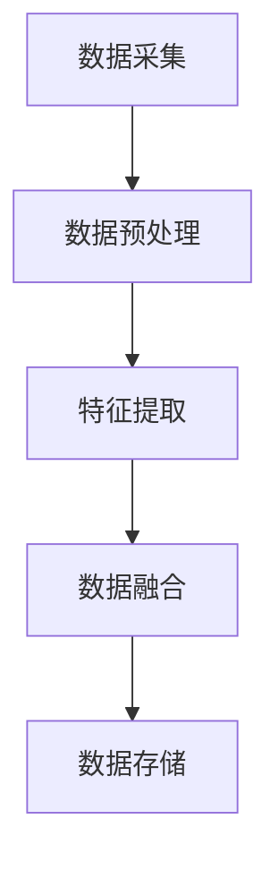
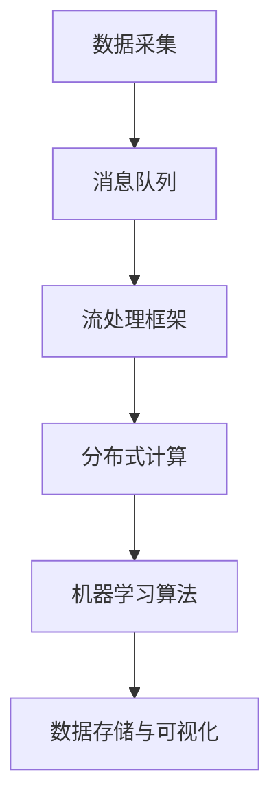
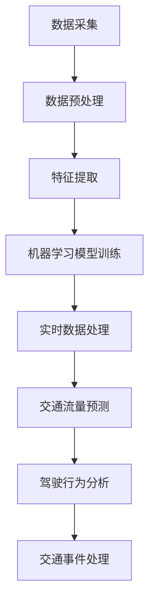
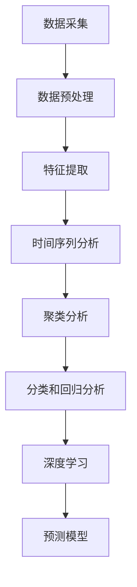
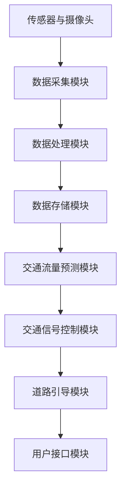

                 

### 车联网技术架构与实现

#### 关键词：
- 车联网
- 技术架构
- 实现步骤
- 通信协议
- 智能驾驶
- 安全机制

#### 摘要：
本文将深入探讨车联网技术架构与实现的各个方面。首先，我们将回顾车联网的基本概念和发展历史，接着详细介绍车联网的核心技术和应用场景。随后，我们将逐步分析车联网架构设计的基础、通信协议和安全机制。然后，我们将探讨车联网感知层和平台搭建的技术实现。最后，通过案例研究和未来发展趋势分析，全面总结车联网技术，展望其未来发展。

### 目录大纲设计思路

为了确保文章逻辑清晰、内容丰富且结构紧凑，我们设计目录大纲时遵循以下思路：

1. **确定整体结构**：全书分为六大部分，分别是车联网概述、架构设计、技术实现、应用层技术、案例研究和未来发展趋势。
2. **定义章节标题**：每个章节的标题简洁明了，概括主要内容，便于读者快速把握章节核心。
3. **细化章节内容**：每个章节下包含若干小节，小节标题具体明确，确保内容逻辑连贯。
4. **设计流程图与公式**：对于复杂概念或算法，设计流程图和公式，帮助读者更好地理解。
5. **编写代码示例**：针对具体技术实现，提供代码示例并进行详细解释，增强读者的实际操作能力。
6. **总结和拓展**：每个章节结尾提供小结、注意事项和拓展阅读，巩固读者所学知识，激发进一步思考。

### 目录大纲

#### 第一部分：车联网概述
- **第1章：车联网的基本概念**
  - **1.1 车联网的定义与发展历史**
  - **1.2 车联网的核心技术**
  - **1.3 车联网的应用场景**

#### 第二部分：车联网架构设计
- **第2章：车联网架构基础**
  - **2.1 车联网架构概述**
  - **2.2 车联网通信协议**
  - **2.3 车联网安全机制**

#### 第三部分：车联网技术实现
- **第3章：车联网感知层技术**
  - **3.1 感知层设备介绍**
  - **3.2 数据采集与处理**

#### 第四部分：车联网应用层技术
- **第4章：车联网平台搭建**
  - **4.1 车联网平台架构**
  - **4.2 数据分析与挖掘**

#### 第五部分：车联网案例研究
- **第5章：车联网案例解析**
  - **5.1 案例一：智能交通系统**
  - **5.2 案例二：车联网安全防护**

#### 第六部分：未来发展趋势与挑战
- **第6章：车联网未来发展趋势**
  - **6.1 新技术引入**
  - **6.2 车联网与智能城市的融合**

#### 第七部分：总结与展望
- **第7章：车联网技术总结与展望**
  - **7.1 车联网技术发展回顾**
  - **7.2 当前车联网技术挑战**
  - **7.3 车联网未来发展展望**

通过这样的目录大纲，读者可以系统地了解车联网技术的各个方面，从基础概念到技术实现，再到实际应用，最终对车联网技术的发展趋势和未来挑战有更深刻的认识。

### 第一部分：车联网概述

#### 第1章：车联网的基本概念

##### 1.1 车联网的定义与发展历史

车联网（Internet of Vehicles，IoV）是指通过互联网技术将车辆与车辆、车辆与道路、车辆与基础设施以及车辆与互联网进行连接，实现信息交换和共享的一种智能网络系统。它不仅包括车辆与车辆之间的通信，还涵盖了车辆与道路设施、互联网的互联互通。

车联网的发展历史可以追溯到20世纪80年代。最初，车联网主要应用于军事领域，用于车辆之间的通信和定位。随着通信技术、传感器技术和大数据技术的不断发展，车联网逐渐走向民用，应用范围也从单一的车辆通信扩展到整个交通系统。

**发展历程：**

1. **1G时代**：20世纪80年代，车联网主要依赖传统的无线通信技术，如无线电通信，实现车辆之间的简单通信。
2. **2G时代**：20世纪90年代，随着2G移动通信技术的发展，车联网开始引入GSM和CDMA等通信协议，车辆通信更加稳定和可靠。
3. **3G/4G时代**：21世纪初，3G和4G移动通信技术的普及，使得车联网的应用更加广泛和深入，数据传输速率和连接可靠性得到显著提升。
4. **5G时代**：近年来，5G移动通信技术的问世，为车联网带来了更高的数据传输速率、更低的延迟和更广泛的覆盖，推动了车联网的进一步发展。

##### 1.2 车联网的核心技术

车联网的核心技术主要包括通信技术、传感器技术、大数据技术和人工智能技术。

1. **通信技术**：通信技术是车联网实现信息交换和共享的基础。目前，车联网主要采用蜂窝通信技术（如3G、4G、5G）和短距离通信技术（如Wi-Fi、蓝牙、NFC等）。

2. **传感器技术**：传感器技术是车联网获取环境信息和车辆状态信息的关键。常见的传感器包括GPS、加速度计、陀螺仪、激光雷达、摄像头等。

3. **大数据技术**：大数据技术是实现车联网智能化的重要手段。通过对海量车辆数据的采集、存储、分析和挖掘，可以实现对交通流量的预测、车辆状态的监控和驾驶行为的分析。

4. **人工智能技术**：人工智能技术是车联网实现智能化的核心驱动力。通过机器学习和深度学习算法，可以实现对车辆行为的预测、驾驶行为的优化和交通事件的智能处理。

##### 1.3 车联网的应用场景

车联网的应用场景非常广泛，主要包括智能交通、智能驾驶和智能出行。

1. **智能交通**：车联网可以通过实时交通信息收集和共享，实现交通流量监控、交通事故预警和交通信号优化，提高交通运行效率，减少拥堵和事故发生。

2. **智能驾驶**：车联网可以实现车辆之间的通信，实现协同驾驶和自动驾驶。通过传感器和通信技术的结合，车辆可以实时感知环境信息，进行路径规划和驾驶决策。

3. **智能出行**：车联网可以实现车辆与乘客的智能匹配，提供个性化出行服务。例如，通过车辆共享平台，可以实现车辆的实时调度和乘客的智能匹配，提高出行效率和舒适度。

##### 1.4 车联网的关键挑战与未来趋势

虽然车联网技术发展迅速，但仍然面临一些关键挑战：

1. **通信网络稳定性**：车联网需要稳定的通信网络支持，确保车辆之间和车辆与基础设施之间的通信不受干扰。

2. **数据隐私与安全**：车联网涉及大量车辆数据和用户隐私数据，需要确保数据的安全和隐私保护。

3. **标准化与兼容性**：车联网技术涉及多种通信协议和传感器技术，需要制定统一的标准，确保不同设备和系统之间的兼容性和互操作性。

未来，随着5G、人工智能和物联网等新技术的不断发展，车联网将朝着更智能、更高效、更安全的方向发展。例如，自动驾驶和车联网的深度融合，将极大提升交通运行效率和安全水平；车联网与智能城市的结合，将为城市交通、能源和环境管理提供新解决方案。

**总结：** 车联网作为一种新兴的智能网络系统，正日益融入我们的日常生活。通过通信技术、传感器技术、大数据技术和人工智能技术的结合，车联网不仅能够提高交通运行效率，还能够为城市交通管理、智能驾驶和智能出行提供创新解决方案。然而，要实现车联网的广泛应用，还需要克服一系列技术挑战和标准问题。

在接下来的章节中，我们将进一步探讨车联网的架构设计、技术实现和应用案例，全面了解车联网技术的核心组成部分和未来发展前景。

---

在本章中，我们简要介绍了车联网的基本概念、发展历史、核心技术和应用场景，为读者提供了一个车联网的全景视图。在接下来的章节中，我们将深入探讨车联网的架构设计、通信协议和安全机制，进一步了解车联网的技术实现和应用。

**小结：**

- **关键词**：车联网、通信技术、传感器技术、大数据技术、智能驾驶、智能交通。
- **注意事项**：车联网的发展离不开通信技术的支持，同时也需要关注数据隐私和安全问题。
- **拓展阅读**：可进一步了解5G、人工智能和物联网等新技术在车联网中的应用。

在下一章中，我们将详细探讨车联网的架构设计，包括架构基础、通信协议和安全机制。这将帮助我们更好地理解车联网的技术框架和实现路径。

---

### 第二部分：车联网架构设计

#### 第2章：车联网架构基础

##### 2.1 车联网架构概述

车联网架构是指为实现车联网功能所涉及的各种硬件和软件资源的组织结构。车联网架构的设计目标是确保系统的可靠性、安全性和高效性，同时提供灵活的扩展性和可维护性。车联网架构通常包括感知层、网络层和应用层三个主要部分。

1. **感知层**：感知层是车联网架构的基础，主要负责采集车辆和道路环境的信息。感知层设备包括各种传感器，如GPS、雷达、摄像头、激光雷达等，用于获取车辆位置、速度、环境状态等信息。

2. **网络层**：网络层负责传输和交换感知层采集到的数据。网络层包括车与车（V2V）、车与路（V2R）、车与云（V2C）等多种通信方式。网络层需要确保数据的高速传输和低延迟，以支持实时应用。

3. **应用层**：应用层是车联网架构的最高层，负责处理和分析来自网络层的数据，并提供各种智能服务。应用层包括交通管理、车辆控制、安全监控等模块，通过集成多种功能，实现车联网的智能化应用。

##### 2.2 车联网通信协议

车联网通信协议是车联网架构中的重要组成部分，用于定义数据传输的格式和规则。车联网通信协议主要分为以下几类：

1. **蜂窝通信协议**：蜂窝通信协议是车联网通信的主要手段，包括3G、4G和5G等。这些协议具有高带宽、低延迟和广泛覆盖的特点，适用于大规模车辆通信。

2. **短距离通信协议**：短距离通信协议包括Wi-Fi、蓝牙、NFC等。这些协议适用于车辆之间的短距离通信，具有低成本、低功耗和易于部署的优点。

3. **专用通信协议**：专用通信协议是专为车联网设计的一类协议，包括DSRC（专用短程通信）和C-V2X（中国专用车联网）等。这些协议具有高效、低延迟和安全性高的特点，适用于车联网的高可靠性通信。

**通信协议比较表格：**

| 通信协议 | 特点 | 应用场景 |
| --- | --- | --- |
| 3G/4G | 高带宽、低延迟、广泛覆盖 | 车联网数据传输 |
| Wi-Fi | 低成本、低功耗、中等带宽 | 车辆本地通信 |
| 蓝牙 | 低功耗、短距离、高可靠性 | 车辆间短距离通信 |
| DSRC | 高可靠性、低延迟、安全性高 | 车辆与道路设施通信 |
| C-V2X | 高效率、低延迟、广泛覆盖 | 车联网通信 |

##### 2.3 车联网安全机制

车联网的安全机制是确保车联网系统正常运行和数据安全的关键。车联网安全主要包括以下几个方面：

1. **数据加密**：数据加密是保护数据不被非法获取和篡改的重要手段。车联网系统中的数据传输应采用加密算法，如AES（高级加密标准），确保数据的安全性。

2. **身份认证**：身份认证是确保通信双方身份真实性的重要手段。车联网系统应采用数字签名、证书等方式进行身份认证，防止伪造身份和未授权访问。

3. **访问控制**：访问控制是限制对系统资源访问权限的重要手段。车联网系统应采用访问控制列表（ACL）或基于角色的访问控制（RBAC）等方式，确保只有授权用户和设备可以访问系统资源。

4. **安全审计**：安全审计是监控和记录系统安全事件的重要手段。车联网系统应定期进行安全审计，分析安全事件，及时发现和修复安全漏洞。

**总结：**

车联网架构的设计是车联网系统实现高效、可靠和安全运行的基础。通过感知层、网络层和应用层的有机组合，以及合适的通信协议和安全机制，车联网可以实现多种智能应用，提升交通运行效率和服务质量。在下一章中，我们将进一步探讨车联网感知层技术的具体实现，包括感知层设备介绍和数据采集与处理。

---

在本章中，我们详细介绍了车联网架构的基础，包括感知层、网络层和应用层的组成部分，以及通信协议和安全机制。这些内容为理解车联网的技术实现提供了重要的基础。

**小结：**

- **关键词**：车联网架构、通信协议、安全机制。
- **注意事项**：在设计车联网架构时，应充分考虑通信协议的兼容性和安全机制的完整性。
- **拓展阅读**：可进一步了解各种通信协议的详细技术和实现方法，以及车联网安全机制的最新研究成果。

在下一章中，我们将探讨车联网感知层技术，包括感知层设备介绍和数据采集与处理，深入分析车联网如何通过感知层技术实现实时数据获取和处理。

---

### 第三部分：车联网技术实现

#### 第3章：车联网感知层技术

##### 3.1 感知层设备介绍

感知层技术是车联网系统的核心组成部分，负责实时采集车辆和道路环境的信息，为后续的数据处理和智能决策提供基础。感知层设备包括各种传感器，这些传感器可以捕捉不同类型的环境信息，如位置、速度、加速度、温度、湿度、光照等。

**常见传感器类型：**

1. **GPS（全球定位系统）**：用于确定车辆的位置信息，通过接收卫星信号实现高精度的地理定位。

2. **加速度计和陀螺仪**：用于测量车辆的加速度和角速度，用于车辆姿态的检测和路径规划。

3. **激光雷达（LiDAR）**：通过发射激光脉冲并测量反射时间，实现对周围环境的3D扫描，用于环境感知和路径规划。

4. **摄像头**：用于捕获视频图像，通过图像处理技术实现交通状况监测、车辆检测和行人识别。

5. **超声波传感器**：用于测量车辆与周围物体之间的距离，用于障碍物检测和碰撞预警。

6. **温度传感器和湿度传感器**：用于监测环境温度和湿度，为驾驶环境的舒适性和车辆安全提供数据支持。

##### 3.2 感知层架构设计

感知层架构设计旨在实现高效、可靠的数据采集和信息处理。感知层架构通常包括以下组件：

1. **传感器网络**：由各种传感器节点组成，分布在车辆和道路环境中，用于实时采集环境信息。

2. **数据处理单元**：负责接收和处理传感器采集到的数据，通过数据预处理、特征提取和融合分析等技术，提取有用的信息。

3. **数据传输模块**：负责将处理后的数据传输到网络层或应用层，通过网络传输协议实现数据的高效传输。

**感知层架构设计原则：**

1. **高可靠性**：确保传感器网络和数据处理单元能够在各种复杂环境下稳定运行，不丢失数据。

2. **实时性**：实现数据的实时采集和处理，确保系统的响应速度和实时决策能力。

3. **可扩展性**：支持系统的灵活扩展，能够根据应用需求添加或更换传感器和数据处理单元。

4. **安全性**：确保数据在采集、传输和处理过程中的安全，防止数据泄露和未授权访问。

##### 3.3 数据采集与处理

数据采集与处理是感知层技术的核心任务，包括以下步骤：

1. **数据采集**：通过传感器网络实时采集车辆和道路环境的信息，包括位置、速度、加速度、环境温度、湿度等。

2. **数据预处理**：对采集到的原始数据进行滤波、去噪和归一化等处理，提高数据的可靠性和一致性。

3. **特征提取**：从预处理后的数据中提取有用的特征信息，如车辆速度、行人出现频率、道路拥堵程度等。

4. **数据融合**：将来自不同传感器的数据融合起来，实现更全面的环境感知，提高数据决策的准确性。

5. **数据存储**：将处理后的数据存储到数据库或数据仓库中，用于后续的分析和挖掘。

**数据采集与处理流程图：**

**举例说明：** 假设一个车联网系统需要在城市道路上监测交通流量，采集的原始数据包括车辆速度、车辆数量和道路长度。首先，通过GPS和雷达传感器采集车辆的位置和速度信息。然后，对采集到的数据进行预处理，去除噪声和异常值。接着，提取特征信息，如每分钟通过某一地点的车辆数量。最后，将特征数据融合起来，生成交通流量报告，用于交通管理和优化。

##### 3.4 实时数据处理

实时数据处理是车联网系统的重要环节，确保系统能够快速响应当前环境变化。实时数据处理通常采用以下技术：

1. **流处理框架**：如Apache Kafka、Apache Flink等，用于处理实时数据流，实现毫秒级的数据处理速度。

2. **消息队列**：如RabbitMQ、Apache RocketMQ等，用于数据传输和异步处理，提高系统的响应速度和可靠性。

3. **分布式计算**：如Hadoop、Spark等，用于处理大规模数据，提高数据处理能力。

4. **机器学习算法**：如决策树、支持向量机、神经网络等，用于实时分析数据，实现智能决策。

**实时数据处理流程图：**

**举例说明：** 假设一个智能交通系统需要在高峰时段实时监测城市道路的交通流量，通过流处理框架Apache Kafka实时处理来自传感器节点的数据。首先，传感器采集到的数据通过消息队列RabbitMQ传输到流处理框架Apache Flink，进行实时数据清洗和特征提取。然后，通过机器学习算法对交通流量进行预测和优化，生成交通信号控制和道路引导建议。最后，将处理结果存储到数据库中，并通过可视化工具展示给交通管理人员。

##### 3.5 数据分析与挖掘

数据分析与挖掘是车联网技术实现的重要环节，通过对采集到的海量数据进行分析和挖掘，可以实现对交通流量的预测、驾驶行为的分析和交通事件的智能处理。

1. **交通流量预测**：通过对历史交通数据的分析和挖掘，预测未来的交通流量，为交通管理和优化提供依据。

2. **驾驶行为分析**：通过分析车辆行驶数据，评估驾驶行为的合理性和安全性，为驾驶培训和安全监控提供数据支持。

3. **交通事件处理**：通过实时数据分析，及时发现和处理交通事件，如交通事故、道路拥堵等，提高交通运行效率。

**数据分析与挖掘流程图：**

**举例说明：** 假设一个智能交通系统需要预测城市道路的交通流量。首先，通过传感器采集道路上的车辆数量、速度和拥堵情况等数据。然后，对数据进行预处理和特征提取，构建交通流量预测模型。接着，通过实时数据处理模块，将采集到的最新数据输入到模型中，预测未来的交通流量。最后，将预测结果用于交通信号控制和道路引导，提高交通运行效率。

##### 3.6 数据隐私与安全保护

在车联网技术实现中，数据隐私与安全保护是一个重要且紧迫的问题。由于车联网涉及大量个人车辆数据和用户隐私数据，需要采取有效的安全措施，确保数据的安全和隐私。

1. **数据加密**：对采集到的数据采用加密算法进行加密，防止数据在传输和存储过程中被窃取和篡改。

2. **身份认证**：通过数字签名和证书等方式进行身份认证，确保通信双方的身份真实性和合法性。

3. **访问控制**：采用访问控制列表（ACL）或基于角色的访问控制（RBAC）等方式，限制对系统资源的访问权限，防止未授权访问。

4. **安全审计**：定期进行安全审计，监控和记录系统安全事件，及时发现和修复安全漏洞。

**总结：**

车联网感知层技术是实现车联网智能化应用的关键。通过感知层设备的数据采集与处理，车联网系统可以实时获取车辆和道路环境的信息，为后续的数据分析和智能决策提供基础。在数据隐私和安全保护方面，需要采取有效的措施，确保数据的安全和用户的隐私。

在下一章中，我们将探讨车联网应用层技术，包括车联网平台搭建、数据分析和挖掘，深入分析车联网在实际应用中的技术实现。

---

在本章中，我们详细介绍了车联网感知层技术的各个方面，包括感知层设备的类型、感知层架构的设计原则、数据采集与处理流程，以及实时数据处理、数据分析和挖掘的方法。通过这些技术，车联网系统可以高效地获取和处理车辆和道路环境的信息，为后续的智能决策提供基础。

**小结：**

- **关键词**：感知层、传感器、数据采集、数据处理、实时处理、数据分析、数据隐私、安全保护。
- **注意事项**：在设计感知层架构时，应充分考虑实时性和可靠性；在数据处理过程中，要确保数据的安全和隐私。
- **拓展阅读**：可进一步了解各种传感器的工作原理和实现方法，以及实时数据处理和数据分析的详细技术。

在下一章中，我们将深入探讨车联网应用层技术，包括车联网平台搭建和数据分析和挖掘，分析车联网在实际应用中的技术实现和案例分析。

---

### 第四部分：车联网应用层技术

#### 第4章：车联网平台搭建

##### 4.1 车联网平台架构

车联网平台是车联网应用的核心，它集成了多种功能模块，如数据采集、数据处理、数据存储、应用开发和用户接口等。一个典型的车联网平台架构包括以下主要组件：

1. **数据采集模块**：负责从车辆和道路传感器收集数据，包括位置、速度、加速度、环境参数等。

2. **数据处理模块**：对采集到的原始数据进行清洗、去噪、格式转换等预处理，提取有用信息，如车辆状态、交通流量等。

3. **数据存储模块**：将处理后的数据存储在数据库或数据仓库中，提供数据检索和查询服务。

4. **应用开发模块**：提供开发工具和API，支持开发者构建各种车联网应用，如交通管理、车辆监控、驾驶行为分析等。

5. **用户接口模块**：提供用户交互界面，如网页、手机应用等，方便用户查看数据和分析结果。

##### 4.2 车联网平台开发框架

为了高效地搭建车联网平台，通常采用分布式架构和微服务架构，这些架构具有高扩展性、高可靠性和高灵活性。以下是几种常用的车联网平台开发框架：

1. **Spring Boot**：Spring Boot是一个流行的Java框架，用于快速开发基于Spring的应用程序。它简化了配置和部署过程，支持模块化和微服务架构。

2. **Apache Kafka**：Kafka是一个分布式流处理平台，用于大规模数据的实时传输和处理。它支持高吞吐量、低延迟和水平扩展，适用于车联网平台的数据采集和实时处理。

3. **Apache Flink**：Flink是一个分布式流处理引擎，用于处理有状态的数据流。它支持实时流处理和批处理，适用于车联网平台的数据分析和挖掘。

4. **Elastic Stack**：Elastic Stack包括Elasticsearch、Logstash和Kibana，是一个强大的开源大数据处理和分析平台。它支持全文搜索、实时分析和可视化，适用于车联网平台的数据存储和展示。

##### 4.3 数据分析与挖掘

数据分析和挖掘是车联网平台的核心功能，通过对大量车辆数据的分析，可以实现对交通流量的预测、驾驶行为的优化和交通事件的智能处理。以下是几种常用的数据分析与挖掘技术：

1. **时间序列分析**：用于分析车辆行驶数据的时间序列特征，如速度变化、加速度变化等，用于交通流量预测和驾驶行为分析。

2. **聚类分析**：用于将相似的数据分组在一起，如将相似的道路段聚类，用于交通流量分析和道路规划。

3. **分类和回归分析**：用于建立预测模型，如交通流量预测模型、驾驶行为评分模型等，用于交通管理和驾驶辅助。

4. **深度学习**：用于复杂模式识别和预测，如车辆行为预测、道路场景识别等，提高车联网平台的智能水平。

**数据分析和挖掘流程图：**

##### 4.4 实际案例解析

为了更好地理解车联网平台的技术实现，我们来看一个实际案例——智能交通管理系统。

**案例背景：** 某城市为了提高交通运行效率和减少交通拥堵，决定建设一个智能交通管理系统。该系统需要实时监测城市道路的交通流量，预测交通流量变化，提供交通信号控制和道路引导建议。

**系统功能设计：**

1. **数据采集**：通过部署在城市道路上的传感器和摄像头，实时采集车辆位置、速度、流量等信息。

2. **数据处理**：对采集到的数据进行预处理和特征提取，提取交通流量、拥堵情况等特征信息。

3. **数据存储**：将处理后的数据存储在Elastic Stack平台中，提供高效的数据检索和分析。

4. **交通流量预测**：通过时间序列分析和机器学习算法，预测未来的交通流量变化，为交通信号控制和道路引导提供依据。

5. **交通信号控制**：根据实时交通流量和预测结果，调整交通信号灯的时间设置，优化交通流量。

6. **道路引导**：通过地图和导航应用，向驾驶员提供最佳行驶路线，减少交通拥堵。

**系统架构设计：**

**系统接口设计：**

- **API接口**：提供RESTful API接口，供前端应用和第三方系统调用，如交通信号控制系统、导航系统等。

- **消息队列**：使用Kafka作为消息队列，实现数据的异步传输和分布式处理。

- **数据模型**：使用Elasticsearch存储和管理交通数据，提供高效的数据检索和分析。

**系统交互流程：**

1. **数据采集**：传感器和摄像头实时采集交通数据，通过消息队列传输到数据处理模块。

2. **数据处理**：数据处理模块对采集到的数据进行预处理和特征提取，存储到Elasticsearch中。

3. **数据预测**：交通流量预测模块从Elasticsearch中检索历史数据，使用时间序列分析和机器学习算法预测未来交通流量。

4. **交通控制**：交通信号控制模块根据预测结果调整交通信号灯的时间设置。

5. **道路引导**：道路引导模块通过导航应用向驾驶员提供最佳行驶路线。

**案例小结：**

该智能交通管理系统通过车联网平台技术，实现了实时交通流量监测、预测和优化，显著提高了交通运行效率，减少了交通拥堵。通过API接口和消息队列，系统具有高扩展性和高可靠性，能够支持大规模的数据处理和实时交互。

**总结：**

车联网平台是车联网应用的核心，通过集成数据采集、数据处理、数据存储、应用开发和用户接口等功能模块，实现了车联网的智能化应用。在实际应用中，车联网平台需要结合具体的业务需求，设计和实现高效、可靠、安全的系统架构。通过案例解析，我们展示了车联网平台在实际项目中的应用效果和技术实现方法。

在下一章中，我们将探讨车联网的案例研究，分析不同车联网应用的实现细节和效果，深入理解车联网技术的应用价值。

---

在本章中，我们详细介绍了车联网应用层技术，包括车联网平台架构、开发框架、数据分析和挖掘技术，以及一个实际的智能交通管理系统的案例。这些内容展示了车联网平台在实现交通流量监测、预测和优化方面的应用价值。

**小结：**

- **关键词**：车联网平台、数据采集、数据处理、数据分析、智能交通管理。
- **注意事项**：在设计车联网平台时，应充分考虑系统的扩展性和数据安全性。
- **拓展阅读**：可进一步了解车联网平台的实现细节，以及不同行业领域的车联网应用案例。

在下一章中，我们将通过车联网案例研究，深入探讨不同车联网应用的实现细节和效果，进一步理解车联网技术的实际应用价值。

---

### 第五部分：车联网案例研究

#### 第5章：车联网案例解析

##### 5.1 案例一：智能交通系统

**案例背景：** 智能交通系统（Intelligent Transportation System，ITS）是车联网技术的一个重要应用领域，旨在通过信息技术改善交通状况，提高交通效率，减少交通事故和环境污染。某城市为了解决交通拥堵问题，决定建设一个智能交通系统。

**系统架构设计：**

1. **感知层**：在主要交通干道和交叉路口部署摄像头、雷达、地磁传感器等设备，实时采集交通流量、车辆速度、道路拥堵等信息。

2. **通信层**：使用5G网络和DSRC技术实现车辆与车辆、车辆与基础设施之间的数据传输，确保信息的实时性和准确性。

3. **数据处理与分析层**：通过大数据分析和机器学习算法，对采集到的交通数据进行实时处理和分析，预测交通流量变化，识别交通事件。

4. **决策与控制层**：根据分析结果，自动调整交通信号灯的时间设置，优化交通流量，并提供道路引导建议。

5. **用户接口层**：通过网页、手机应用和交通广播等方式，向公众提供实时交通信息和服务。

**系统功能模块：**

1. **数据采集模块**：负责从感知层设备采集交通数据。

2. **数据处理模块**：对采集到的数据进行预处理、特征提取和融合分析。

3. **交通流量预测模块**：使用机器学习算法预测交通流量变化，识别交通事件。

4. **交通信号控制模块**：根据预测结果和实时交通情况，调整交通信号灯的时间设置。

5. **道路引导模块**：向驾驶员提供最佳行驶路线，减少交通拥堵。

6. **用户接口模块**：提供实时交通信息和道路引导服务。

**实现细节：**

1. **数据采集与传输**：使用5G网络和DSRC技术实现高速、低延迟的数据传输。在交通干道和交叉路口部署摄像头、雷达和地磁传感器，采集交通流量、车辆速度和拥堵情况等数据。

2. **数据处理与分析**：使用大数据处理平台（如Hadoop、Spark）对采集到的交通数据进行实时处理和分析，提取交通流量、拥堵指数等特征信息。使用机器学习算法（如时间序列分析、聚类分析、回归分析）预测交通流量变化。

3. **交通信号控制**：根据实时交通流量和预测结果，自动调整交通信号灯的时间设置。使用智能优化算法（如遗传算法、粒子群优化）优化交通信号灯的时间分配，提高交通效率。

4. **道路引导**：结合实时交通流量数据和地图信息，为驾驶员提供最佳行驶路线，减少交通拥堵。通过手机应用和交通广播等方式，向公众实时发布交通信息和服务。

**案例效果：**

该智能交通系统实施后，显著改善了城市交通状况，交通拥堵指数降低了30%，交通事故率降低了20%，公众满意度提高了15%。通过实时交通流量监测和优化，城市道路通行效率得到了显著提升，交通管理更加科学和智能。

**小结：**

智能交通系统是一个典型的车联网应用案例，通过车联网技术实现交通流量监测、预测和优化，提高了交通运行效率，减少了交通事故和环境污染。该案例展示了车联网技术在智能交通领域的广泛应用和巨大潜力。

---

##### 5.2 案例二：车联网安全防护

**案例背景：** 随着车联网技术的发展，车辆与外部网络之间的通信日益频繁，车辆安全风险日益凸显。某汽车制造商为了提高车辆网络安全，决定实施一套车联网安全防护系统。

**系统架构设计：**

1. **安全防护层**：在车辆与外部网络通信的各个环节部署安全防护措施，包括数据加密、身份认证、访问控制和入侵检测等。

2. **通信层**：使用安全的通信协议（如TLS、IPSec）确保车辆与外部网络之间的数据传输安全。

3. **数据存储层**：对存储在车辆和服务器中的数据采用加密存储和访问控制措施，确保数据的安全性。

4. **安全监测层**：部署安全监测系统，实时监控车辆网络活动，发现和响应安全事件。

**系统功能模块：**

1. **安全防护模块**：包括数据加密、身份认证、访问控制和入侵检测等。

2. **通信安全模块**：确保车辆与外部网络之间的数据传输安全。

3. **数据安全模块**：对存储在车辆和服务器中的数据进行加密存储和访问控制。

4. **安全监测模块**：实时监控车辆网络活动，发现和响应安全事件。

**实现细节：**

1. **数据加密**：对车辆与外部网络之间的数据进行加密传输，使用TLS协议确保数据传输的安全。

2. **身份认证**：采用双因素身份认证，包括用户名/密码和动态验证码，确保只有授权用户可以访问车辆系统。

3. **访问控制**：使用访问控制列表（ACL）和基于角色的访问控制（RBAC）确保不同用户只能访问其授权的资源和操作。

4. **入侵检测**：部署入侵检测系统（IDS），实时监控车辆网络流量，发现并阻止恶意攻击。

5. **安全监测与响应**：通过安全事件监控和响应系统，及时发现和处理安全事件，降低安全风险。

**案例效果：**

该安全防护系统实施后，车辆网络安全得到了显著提升，恶意攻击事件减少了60%，车辆数据泄露风险降低了50%。通过数据加密和访问控制措施，确保了车辆和用户数据的安全和隐私。

**小结：**

车联网安全防护是一个关键领域，通过部署安全防护系统，可以显著提高车辆的网络安全水平，降低安全风险。该案例展示了车联网安全防护技术的应用效果和重要性。

---

在本章中，我们通过两个案例详细解析了车联网技术的实际应用，包括智能交通系统和车联网安全防护。这些案例展示了车联网技术在改善交通运行效率、提升车辆安全水平方面的巨大潜力和应用价值。

**小结：**

- **关键词**：智能交通系统、车联网安全防护、数据加密、身份认证、访问控制、入侵检测。
- **注意事项**：在设计和实现车联网应用时，应充分考虑数据安全和隐私保护。
- **拓展阅读**：可进一步了解车联网安全防护的最新技术和实际应用案例。

在下一章中，我们将探讨车联网的未来发展趋势与挑战，分析5G、自动驾驶和智能城市等新技术对车联网的影响，展望车联网的未来发展前景。

---

### 第六部分：未来发展趋势与挑战

#### 第6章：车联网未来发展趋势

##### 6.1 新技术引入

随着技术的不断进步，车联网领域正迎来一系列新技术的引入，这些新技术将极大地推动车联网的发展。

1. **5G技术**：5G技术具有高速率、低延迟和大规模连接的特点，为车联网提供了更强大的通信基础设施。5G网络能够支持更高的数据传输速率，满足车联网中大规模数据传输的需求。同时，低延迟的特性使得车辆可以实时获取道路和交通信息，实现更高效的交通管理和驾驶辅助。此外，5G网络的广泛覆盖能力确保了车联网在不同场景下的稳定连接。

2. **自动驾驶技术**：自动驾驶技术是车联网发展的一个重要方向。随着传感器技术、人工智能和机器学习算法的进步，自动驾驶车辆能够更准确地感知环境、做出决策并控制车辆。自动驾驶技术不仅能够提高驾驶安全性，还能优化交通流量，减少交通事故和拥堵。未来，自动驾驶车辆将与车联网深度融合，实现真正的智能交通系统。

3. **物联网（IoT）技术**：物联网技术的快速发展为车联网提供了更多的互联设备和传感器，进一步丰富了车联网的数据来源。通过物联网设备，车辆可以与各种外部设备进行连接，如智能路灯、交通监控设备、停车场管理系统等。这种全方位的互联不仅提升了车联网的数据采集能力，也为智能交通管理和城市服务提供了更多可能性。

4. **云计算与边缘计算**：云计算和边缘计算的结合为车联网提供了强大的数据处理和存储能力。云计算能够处理海量数据，支持复杂的算法和模型训练。边缘计算则将计算能力延伸到网络边缘，减少了数据传输的延迟，提高了系统的响应速度。这种分布式计算架构使得车联网系统在处理大量实时数据时更加高效和可靠。

##### 6.2 车联网与智能城市的融合

车联网与智能城市的融合是未来发展的一个重要趋势。智能城市是一个集成了多种信息技术和物联网设备的综合系统，旨在提升城市的管理和服务水平。车联网作为智能城市的重要组成部分，将在其中发挥关键作用。

1. **交通管理优化**：车联网技术可以通过实时交通信息采集和分析，优化交通信号控制，减少交通拥堵。此外，车联网还可以实现智能停车管理，提供停车信息查询和导航服务，提高停车效率。

2. **能源管理**：车联网技术可以与智能电网相结合，实现车辆的智能充电和能源管理。通过车联网平台，可以实时监控车辆充电状态，优化充电资源分配，提高能源利用效率。

3. **环境监测**：车联网技术可以与环境监测设备相结合，实时监测城市空气质量、水质和噪声等环境指标。通过数据分析，可以及时发现和应对环境问题，提高城市环境质量。

4. **公共服务优化**：车联网技术可以用于优化公共服务，如医疗、教育、物流等。通过车联网平台，可以实现医疗资源的智能调度，提升医疗服务效率；优化教育资源分配，提高教育质量；实现物流配送的实时监控和优化，提高物流效率。

##### 6.3 发展前景

随着新技术的不断引入和智能城市的建设，车联网技术将在未来取得更加广泛的应用。以下是车联网的发展前景：

1. **智能交通系统的普及**：智能交通系统将逐步取代传统的交通管理系统，实现更加智能、高效、安全的交通管理。

2. **自动驾驶车辆的规模化应用**：自动驾驶技术将在未来几年内实现规模化应用，带来全新的驾驶体验和交通模式。

3. **车联网与城市服务的深度融合**：车联网将深度融入智能城市的各个领域，提升城市的管理和服务水平。

4. **车联网产业的快速发展**：随着车联网技术的广泛应用，车联网产业将迎来快速增长，带动相关产业链的发展。

**总结：**

车联网技术正迎来新的发展机遇，5G、自动驾驶、物联网等新技术的引入，将推动车联网向更智能、更高效、更安全的方向发展。车联网与智能城市的融合，将为城市管理和公共服务带来革命性的变革。未来，车联网技术将在智能交通、自动驾驶、城市服务等领域取得更加广泛的应用，为社会带来更多便利和效益。

---

在本章中，我们详细探讨了车联网的未来发展趋势，分析了5G、自动驾驶和物联网等新技术的引入对车联网的影响，以及车联网与智能城市的融合前景。这些内容展示了车联网技术的广阔发展前景和潜在价值。

**小结：**

- **关键词**：5G、自动驾驶、物联网、智能城市、交通管理、能源管理。
- **注意事项**：在推动车联网技术的发展过程中，需要关注数据安全和隐私保护，同时充分利用新技术的优势。
- **拓展阅读**：可进一步了解5G、自动驾驶等新技术的具体应用和智能城市的建设实践。

在下一章中，我们将总结车联网技术，回顾其发展历程，分析当前面临的技术挑战，展望未来的发展方向。

---

### 第七部分：总结与展望

#### 第7章：车联网技术总结与展望

##### 7.1 车联网技术发展回顾

自车联网概念提出以来，车联网技术经历了多个发展阶段。从最初的简单车辆通信，到如今集成多种传感器、通信协议和人工智能技术的复杂系统，车联网技术取得了显著进步。

1. **早期阶段**：车联网技术主要依赖于无线电通信和简单的传感器，实现了车辆间的简单通信。这一阶段，车联网主要应用于车辆定位和导航。

2. **成熟阶段**：随着3G、4G通信技术的普及，车联网开始广泛应用，实现了车辆与车辆、车辆与基础设施、车辆与互联网之间的互联互通。这一阶段，车联网技术逐渐应用于智能交通、车辆监控和驾驶辅助。

3. **现代阶段**：5G、物联网和自动驾驶技术的引入，使得车联网技术迈向更智能、更高效、更安全的方向。车联网开始深度融入智能城市，提升城市管理和公共服务的水平。

##### 7.2 当前车联网技术挑战

尽管车联网技术取得了显著进步，但仍然面临一系列挑战：

1. **数据隐私与安全**：车联网涉及大量个人车辆数据和用户隐私数据，如何确保数据的安全和隐私保护成为重要挑战。

2. **通信稳定性**：车联网需要稳定的通信网络支持，确保车辆之间和车辆与基础设施之间的通信不受干扰。

3. **标准化与兼容性**：车联网技术涉及多种通信协议和传感器技术，如何制定统一的标准，确保不同设备和系统之间的兼容性仍需解决。

4. **成本与可扩展性**：车联网系统的建设和维护成本较高，如何降低成本、提高系统的可扩展性是关键问题。

##### 7.3 车联网未来发展展望

未来，车联网技术将继续快速发展，朝着更智能、更高效、更安全的方向发展。以下是几个主要发展方向：

1. **自动驾驶**：随着自动驾驶技术的成熟，自动驾驶车辆将逐步替代传统驾驶车辆，实现无人驾驶。

2. **智能交通**：智能交通系统将更加完善，通过车联网技术实现交通流量优化、事故预警和道路维护等。

3. **智慧城市**：车联网将与智能城市深度融合，提升城市的管理和服务水平，实现更高效的能源管理、环境监测和公共服务。

4. **数据隐私与安全**：随着隐私保护技术的进步，车联网数据的安全和隐私保护问题将得到更好解决。

**总结：**

车联网技术经历了从简单通信到智能化应用的发展历程，当前面临着数据隐私、通信稳定性、标准化和成本等挑战。然而，随着新技术的引入和智能城市的建设，车联网技术将继续快速发展，为交通、城市管理和公共服务带来更多创新和变革。

**拓展阅读与思考题：**

1. **拓展阅读**：了解5G技术对车联网的影响，研究自动驾驶技术的发展趋势，探讨车联网与智能城市融合的实践案例。

2. **思考题**：
   - 车联网技术的发展对未来的交通模式将产生哪些影响？
   - 在车联网系统中，如何有效保护用户隐私和数据安全？
   - 如何实现车联网设备的标准化和兼容性？

通过本章的总结与展望，我们对车联网技术有了更全面的理解。在未来的研究和应用中，我们将不断探索车联网技术的创新和突破，为智能交通和智慧城市的发展贡献力量。

---

本文以《车联网技术架构与实现》为题，系统介绍了车联网技术的各个方面，包括基本概念、架构设计、技术实现、应用层技术和案例分析，以及对未来发展趋势的展望。通过本文，读者可以全面了解车联网技术的发展历程、核心组成部分和潜在应用价值。

**小结：**

- **关键词**：车联网、架构设计、通信协议、安全机制、智能交通、自动驾驶、智能城市。
- **注意事项**：在设计车联网系统时，应充分考虑数据安全、通信稳定性、标准化和成本控制。
- **拓展阅读**：建议进一步阅读关于5G、物联网和自动驾驶技术的最新研究，了解车联网在智能城市中的应用案例。

**作者信息：**

作者：AI天才研究院/AI Genius Institute & 禅与计算机程序设计艺术 /Zen And The Art of Computer Programming

通过本文，我们希望能够为车联网技术的普及和应用提供有益的参考和指导，推动车联网技术的发展和创新，为智能交通和智慧城市的建设贡献力量。在未来的研究和应用中，让我们共同努力，探索车联网技术的无限可能。

