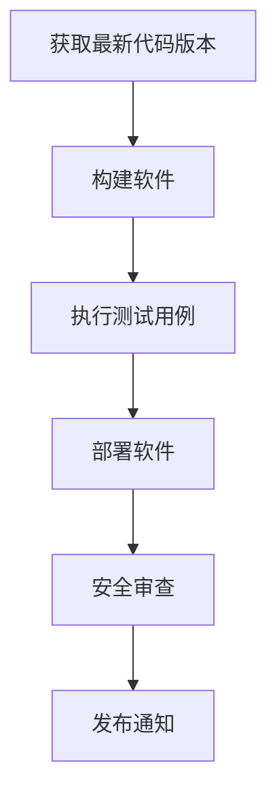
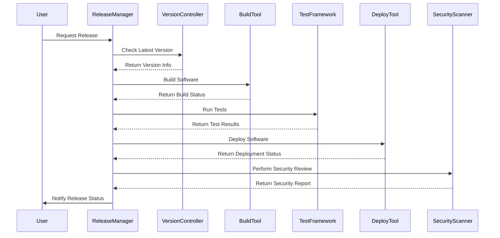
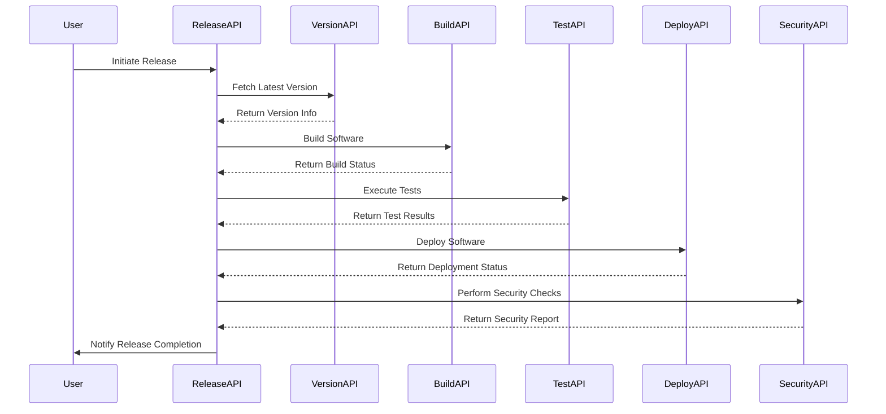

                 

 

# 软件发布管理：从开发到生产的流程优化

## 关键词

软件发布管理，开发流程，生产环境，版本控制，测试，部署，安全性

## 摘要

本文深入探讨了软件发布管理的过程，从开发到生产的全流程优化。通过详细分析核心概念、算法原理，并提供实际项目实战案例，旨在为开发者提供一套完整、实用的软件发布管理策略。

## 引言与背景介绍

### 问题背景

在现代软件开发中，软件发布管理是一个至关重要的环节。它不仅仅是将代码部署到生产环境那么简单，而是涉及从代码开发、测试到最终发布的一系列复杂过程。随着软件项目规模的扩大和复杂度的增加，如何高效、安全地管理软件发布成为软件开发团队面临的一大挑战。

### 问题描述

软件发布管理中常见的挑战包括：

- **版本控制混乱**：多个版本的软件在发布过程中可能产生冲突，导致质量问题。
- **部署失败**：错误的部署操作可能导致系统崩溃，影响用户体验。
- **测试不足**：在发布前未能充分测试，可能导致潜在的问题未被发现。
- **安全漏洞**：发布时未能及时修复已知的安全漏洞，可能引发安全事件。

### 问题解决

要解决这些发布管理中的问题，我们需要：

- **完善版本控制机制**：确保各个版本的软件都能正确标记和隔离。
- **制定部署流程**：明确部署的步骤和操作规范，减少部署失败的可能性。
- **加强测试**：在发布前进行全面的测试，确保软件质量。
- **安全审查**：在发布前进行安全审查，确保软件不存在已知漏洞。

### 边界与外延

软件发布管理不仅包括内部团队的协作和操作，还涉及到与客户的沟通和反馈。此外，随着云计算、容器化技术的发展，软件发布的方式也在不断演变。

### 概念结构与核心要素组成

软件发布管理的主要概念和核心要素包括：

- **版本控制**：如Git、SVN等。
- **部署工具**：如Jenkins、Docker等。
- **测试框架**：如JUnit、Selenium等。
- **安全工具**：如OWASP ZAP、SonarQube等。

## 核心概念与联系

### 软件发布管理

**定义**：软件发布管理是确保软件在从开发到生产的整个生命周期中能够安全、可靠、高效地发布的过程。

**属性特征**：

| 特征         | 说明                                       |
| ------------ | ------------------------------------------ |
| 版本控制     | 确保不同版本之间的隔离和跟踪。                 |
| 部署流程     | 规范部署步骤，减少部署错误。                   |
| 测试         | 确保软件质量，减少发布后的问题。               |
| 安全性       | 确保软件没有安全漏洞，保护用户数据。           |

### 核心要素组成

**版本控制**：使用Git等工具进行版本控制，确保代码的版本和变更历史清晰。

**部署工具**：如Jenkins、Docker等，用于自动化部署和容器化。

**测试框架**：如JUnit、Selenium等，用于编写和执行测试用例。

**安全工具**：如OWASP ZAP、SonarQube等，用于安全审查和漏洞检测。

### ER实体关系图架构

```mermaid
erDiagram
  User ||--o { Release } : 发布
  Developer ||--o { Release } : 开发
  Tester ||--o { Release } : 测试
  Security ||--o { Release } : 安全审查
```

## 算法原理讲解

### 软件发布流程的算法

**算法名称**：软件发布管理算法

**算法描述**：

1. **获取最新代码版本**：从版本控制系统获取最新的代码版本。
2. **构建软件**：使用构建工具（如Maven、Gradle）构建软件。
3. **执行测试用例**：运行自动化测试用例，确保软件质量。
4. **部署软件**：使用部署工具（如Jenkins、Docker）将软件部署到生产环境。
5. **安全审查**：使用安全工具（如OWASP ZAP、SonarQube）进行安全检查。
6. **发布通知**：向相关人员发送发布通知。

### Mermaid 流程图



### Python 源代码

```python
import git
import subprocess
import unittest

def get_latest_version():
    """
    获取最新代码版本
    """
    repo = git.Repo('.')
    return repo.head.object.commit.hexsha

def build_software():
    """
    使用构建工具构建软件
    """
    subprocess.run(['mvn', 'clean', 'compile'])

def run_tests():
    """
    运行自动化测试用例
    """
    suite = unittest.TestSuite()
    suite.addTest(MyTestCase('test_method'))
    runner = unittest.TextTestRunner()
    runner.run(suite)

def deploy_software():
    """
    使用部署工具部署软件
    """
    subprocess.run(['docker', 'build', '-t', 'myapp', '.'])

def perform_security_review():
    """
    进行安全审查
    """
    subprocess.run(['zap', 'start'])

def send_release_notification():
    """
    向相关人员发送发布通知
    """
    print("发布成功，新版本已上线。")

# 主程序
if __name__ == '__main__':
    latest_version = get_latest_version()
    print(f"最新版本：{latest_version}")
    build_software()
    run_tests()
    deploy_software()
    perform_security_review()
    send_release_notification()
```

## 系统分析与架构设计方案

### 问题场景介绍

在现代企业环境中，软件开发项目通常需要高效、稳定的发布流程来确保软件质量的持续提升。然而，传统的发布管理流程往往存在手动操作多、流程不透明、错误率高的问题，这限制了软件开发的速度和效率。因此，我们需要一个自动化、可扩展的软件发布管理方案来优化整个流程。

### 项目介绍

为了解决上述问题，我们开发了一个名为“SmartRelease”的软件发布管理系统。该系统旨在提供一站式的软件发布管理解决方案，涵盖版本控制、构建、测试、部署和安全审查等关键环节。

### 系统功能设计

**领域模型Mermaid类图**

```mermaid
classDiagram
    Class01 <|-- Class02
    Class03 --|> Class04
    Class05 : <<interface>> Interface
    Class06 : <<entity>> Entity
    Class07 : <<value>> Value
    Class01 {
        +attribute1 : Type1
        +method1():void
    }
    Class02 {
        +attribute2 : Type2
        +method2():void
    }
    Class03 {
        +field1 : Type3
        +field2 : Type4
    }
    Class04 {
        +property1 : Type5
        +property2 : Type6
    }
    Class05 {
        +getValue():Value
    }
    Class06 {
        +getAttribute():Type1
    }
    Class07 {
        +createValue():Value
    }
```

### 系统架构设计

**系统架构Mermaid架构图**



### 系统接口设计和系统交互

**系统接口设计Mermaid序列图**



## 项目实战

### 环境安装

要在本地环境中搭建SmartRelease系统，你需要安装以下工具和软件：

- Git
- Maven 或 Gradle
- Docker
- Jenkins
- JUnit
- Selenium
- OWASP ZAP
- SonarQube

安装步骤请参考每个工具的官方文档。

### 系统核心实现源代码

以下是SmartRelease系统核心实现的一部分源代码：

**版本控制**

```python
import git

def check_version():
    repo = git.Repo('.')
    latest_commit = repo.head.object
    return latest_commit.hexsha
```

**构建**

```python
import subprocess

def build_project():
    subprocess.run(['mvn', 'clean', 'install'])
```

**测试**

```python
import unittest

class MyTest(unittest.TestCase):
    def test_method(self):
        self.assertEqual(1 + 1, 2)

if __name__ == '__main__':
    unittest.main()
```

**部署**

```python
import subprocess

def deploy():
    subprocess.run(['docker', 'build', '-t', 'myapp', '.'])
    subprocess.run(['docker', 'push', 'myapp'])
```

**安全审查**

```python
import subprocess

def scan_for_vulnerabilities():
    subprocess.run(['zap', 'start'])
    # 等待ZAP完成扫描
    subprocess.run(['zap', 'report', 'html'])
```

### 代码应用解读与分析

在SmartRelease系统中，每个模块都有明确的职责和接口。版本控制模块负责获取最新的代码版本，构建模块使用Maven或Gradle进行编译和打包，测试模块运行自动化测试用例，部署模块将构建的软件部署到Docker容器中，安全审查模块使用OWASP ZAP进行安全漏洞扫描。

这些模块通过清晰的接口进行通信，确保整个发布流程的自动化和高效性。例如，当用户请求发布新版本时，ReleaseManager会依次调用VersionController、BuildTool、TestFramework、DeployTool和SecurityScanner，每个工具都会返回处理结果，最终ReleaseManager将发布状态通知给用户。

### 实际案例分析和详细讲解剖析

假设一个电商网站需要进行新版本的发布，以下是SmartRelease系统的实际案例流程：

1. 用户通过Jenkins触发发布流程。
2. VersionController获取最新代码版本，并返回给ReleaseManager。
3. ReleaseManager调用BuildTool构建软件，并检查构建结果。
4. ReleaseManager调用TestFramework运行测试用例，确保软件质量。
5. ReleaseManager调用DeployTool部署软件到生产环境。
6. ReleaseManager调用SecurityScanner进行安全审查，确保没有安全漏洞。
7. ReleaseManager向用户发送发布完成的通知。

通过这个案例，我们可以看到SmartRelease系统如何自动化、高效地处理软件发布流程中的各个环节，确保新版本的软件能够顺利、安全地上线。

### 项目小结

SmartRelease系统通过整合版本控制、构建、测试、部署和安全审查等模块，提供了一套完整、高效的软件发布管理解决方案。它不仅简化了发布流程，提高了发布效率，还增强了软件质量和安全性。未来，我们将继续优化系统，引入更多先进的技术，如持续集成和持续部署（CI/CD），以进一步推动软件发布管理的自动化和智能化。

## 最佳实践 tips

1. **版本控制**：确保使用合适的版本控制工具，如Git，并进行定期备份。
2. **自动化测试**：编写和执行自动化测试用例，减少手动测试的工作量。
3. **安全审查**：定期进行安全审查，确保软件发布前不存在安全漏洞。
4. **文档管理**：维护详尽的发布文档，包括版本记录、部署指南等。

## 小结

软件发布管理是软件开发过程中不可或缺的一环。通过本文的探讨，我们了解到了软件发布管理的关键概念、算法原理和实际应用。优化发布流程不仅能够提高软件质量和安全性，还能显著提升开发效率。未来，随着技术的不断进步，软件发布管理将朝着更加自动化、智能化的方向发展。

## 注意事项

- **版本控制**：版本控制是软件发布管理的基石，必须确保版本信息的准确性和一致性。
- **安全性**：安全漏洞可能会对企业和用户造成严重损失，必须高度重视并采取有效的安全措施。
- **文档管理**：详尽的文档有助于团队成员理解和执行发布流程，减少误解和错误。

## 拓展阅读

1. 《持续集成与持续部署：构建高效软件发布流程》
2. 《软件工程：实践者的研究方法》
3. 《容器化与微服务：企业级架构设计与实践》

## 作者信息

作者：AI天才研究院/AI Genius Institute & 禅与计算机程序设计艺术 /Zen And The Art of Computer Programming

