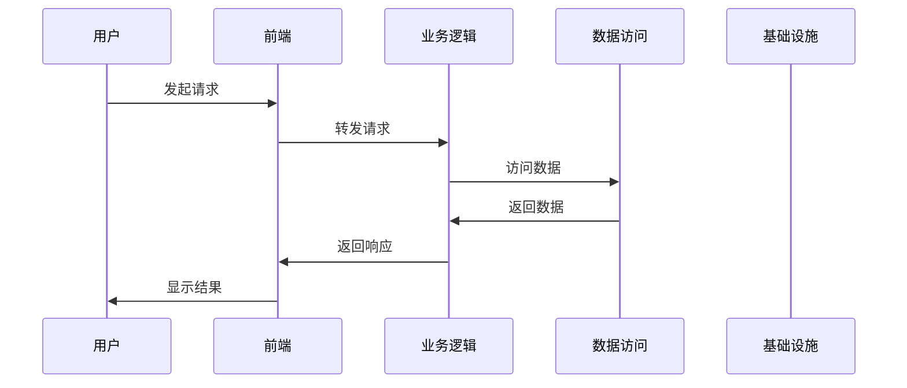
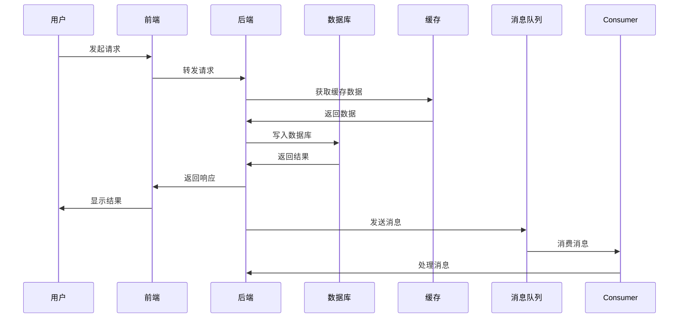

                 

# 软件可扩展性设计：应对增长的架构策略

## 关键词
- 软件可扩展性
- 架构策略
- 扩展性设计
- 系统性能
- 分布式系统
- 云原生架构

## 摘要
本文旨在探讨软件系统的可扩展性设计，特别是在系统规模不断增长的情况下，如何有效地应对扩展性需求。我们将从基本原理、架构策略、实践应用三个层面进行深入分析，介绍可扩展性设计的关键概念、策略和具体实施方法。通过案例分析，我们将展示如何在真实项目中实现软件系统的可扩展性设计，并总结最佳实践和注意事项。

## 引言与背景

### 1.1 问题背景

随着互联网和大数据技术的迅猛发展，软件系统的规模和复杂度日益增加。企业对软件系统提出了更高的要求，不仅希望系统能够处理海量数据，还期望系统具备良好的可扩展性，以应对未来的业务增长和变化。然而，传统的软件架构往往在应对扩展性需求时面临着诸多挑战。

#### 1.1.1 软件系统规模的增长

软件系统规模的增长主要表现在以下几个方面：

1. **数据量增加**：随着用户数量的增多和数据积累，数据库的存储和查询需求急剧上升。
2. **并发用户数增加**：随着用户访问量的增加，系统需要支持更多的并发用户，对系统的处理能力提出了更高要求。
3. **功能复杂性增加**：为了满足业务需求，系统需要不断地增加新的功能模块，导致系统复杂性增加。

#### 1.1.2 扩展性需求的重要性

软件系统的可扩展性是指系统能够在资源有限的情况下，通过增加或优化资源来提升系统性能和处理能力。扩展性需求的重要性体现在以下几个方面：

1. **业务适应性**：良好的可扩展性设计使系统能够适应业务变化，保持业务的连续性和稳定性。
2. **成本控制**：通过合理的扩展性设计，可以在不增加过多成本的情况下，提升系统性能和扩展能力。
3. **用户体验**：良好的扩展性设计能够确保系统在高并发、大数据场景下依然保持良好的用户体验。

#### 1.1.3 可扩展性设计的关键性

可扩展性设计是软件系统架构的核心组成部分，其关键性体现在：

1. **系统性能**：通过合理的设计，系统能够在高并发、大数据场景下保持高性能。
2. **资源利用率**：通过优化设计，提高资源利用率，降低系统运行成本。
3. **系统弹性**：良好的可扩展性设计使系统具备一定的弹性，能够快速响应业务变化。

### 1.2 问题描述

在软件系统规模不断增长的情况下，扩展性设计面临以下挑战：

1. **性能瓶颈**：随着数据量和并发用户数的增加，系统可能会出现性能瓶颈，导致响应时间变长。
2. **资源浪费**：在扩展性设计不足的情况下，系统可能会过度使用资源，导致资源浪费。
3. **系统复杂性**：扩展性设计不当可能导致系统复杂性增加，增加维护成本。
4. **业务中断**：扩展性设计不足可能导致系统无法适应业务增长，引发业务中断。

### 1.3 问题解决

为了应对扩展性设计面临的挑战，可以采取以下解决方案：

1. **分层架构**：通过分层架构设计，实现模块化、可扩展的系统结构。
2. **分布式系统**：通过分布式架构，实现数据的分布存储和处理。
3. **云原生架构**：利用云原生技术，实现系统的弹性扩展和自动化管理。
4. **面向服务的架构（SOA）**：通过服务化设计，实现系统的灵活组合和扩展。

### 1.4 核心概念与联系

在讨论扩展性设计时，需要了解以下几个核心概念：

1. **可扩展性**：系统能够在资源有限的情况下，通过增加或优化资源来提升性能和处理能力。
2. **扩展性设计**：在系统设计阶段，通过架构设计和技术选型，确保系统具备良好的可扩展性。
3. **系统性能**：系统在处理数据和处理请求时的效率和质量。
4. **资源利用率**：系统对硬件和软件资源的利用程度。

这些概念之间有着紧密的联系：

- **可扩展性与系统性能**：良好的可扩展性设计能够提高系统性能，确保系统在高并发、大数据场景下保持良好性能。
- **扩展性设计与资源利用率**：合理的扩展性设计可以提高资源利用率，降低系统运行成本。

### 1.5 本章小结

本章介绍了软件系统可扩展性设计的重要性、面临的挑战以及解决方案。在接下来的章节中，我们将深入探讨可扩展性设计的基本原理、架构策略和实践应用，帮助读者理解并掌握如何设计出具有良好扩展性的软件系统。

## 可扩展性设计的基本原理

### 2.1 核心概念原理

可扩展性设计是指通过架构设计和技术选型，使软件系统能够在资源有限的情况下，通过增加或优化资源来提升性能和处理能力。以下是可扩展性设计的核心概念原理：

#### 2.1.1 系统分解

系统分解是将复杂的系统分解为更小的、可管理的模块，以降低系统的复杂度和提高可扩展性。系统分解的关键在于模块的独立性和可替换性。

- **模块独立性**：模块应能够独立运行，不依赖于其他模块，从而便于单独开发和扩展。
- **模块可替换性**：模块应具有可替换性，以便在需要时可以替换或更新模块，而不会影响整个系统的运行。

#### 2.1.2 模块化设计

模块化设计是将系统划分为多个模块，每个模块负责特定的功能，并通过接口进行通信。模块化设计的优点包括：

- **可维护性**：模块化设计使得系统的维护更加方便，每个模块都可以独立进行维护。
- **可扩展性**：通过添加或替换模块，可以轻松实现系统的扩展。
- **复用性**：模块可以独立开发，并在多个项目中复用。

#### 2.1.3 分布式系统

分布式系统是指通过计算机网络将多个计算机节点连接起来，共同完成任务的系统。分布式系统具有以下优点：

- **可扩展性**：分布式系统可以轻松扩展，只需增加节点即可提高系统性能。
- **容错性**：分布式系统具有较高的容错性，当一个节点发生故障时，其他节点可以继续运行。
- **负载均衡**：分布式系统可以实现负载均衡，确保系统资源得到充分利用。

### 2.2 概念属性特征对比

#### 2.2.1 单机系统与分布式系统的对比

**单机系统**是指所有的计算和处理都在单个计算机上完成。**分布式系统**则是通过计算机网络将多个计算机节点连接起来，共同完成任务。以下是单机系统与分布式系统的对比：

| 特性               | 单机系统                                                   | 分布式系统                                                   |
|--------------------|-----------------------------------------------------------|-----------------------------------------------------------|
| **资源利用**       | 依赖单台计算机资源，资源利用率较低                         | 多台计算机协同工作，资源利用率较高                         |
| **扩展性**         | 扩展性较差，性能受限于单台计算机性能                       | 扩展性良好，可以通过增加节点提高性能                       |
| **容错性**         | 容错性较低，一旦单台计算机发生故障，整个系统将无法运行     | 容错性较高，多个节点相互备份，一个节点的故障不会影响整个系统 |
| **负载均衡**       | 负载集中在单台计算机上，可能导致性能瓶颈                   | 负载均衡分布在多个节点上，提高系统性能                     |

#### 2.2.2 扩展性与性能的平衡

在可扩展性设计中，需要平衡扩展性与性能之间的关系：

- **过度扩展**：如果系统过度扩展，可能导致资源浪费，系统性能下降。
- **不足扩展**：如果系统扩展性不足，可能在高并发、大数据场景下出现性能瓶颈。

因此，设计者需要在扩展性和性能之间找到合适的平衡点，通过合理的架构设计和性能优化策略，实现系统的良好扩展性。

#### 2.2.3 灵活性与可扩展性的权衡

灵活性是指系统能够快速适应业务变化的能力。在可扩展性设计中，需要权衡灵活性与可扩展性之间的关系：

- **高灵活性**：系统可以快速适应业务变化，但可能导致扩展性降低。
- **高可扩展性**：系统具备良好的扩展性，但可能牺牲一定的灵活性。

因此，设计者需要在灵活性和可扩展性之间找到合适的平衡点，以满足业务需求。

### 2.3 ER实体关系图架构

实体关系图（Entity-Relationship Diagram，ER图）是一种用于描述实体及其关系的图形化方法。在可扩展性设计中，ER图可以帮助我们理解系统的数据结构和关系，从而设计出更好的扩展性架构。

#### 2.3.1 实体识别

实体是系统中的核心数据元素，可以是人、物、事件等。在ER图中，实体用矩形表示，实体的属性用椭圆表示，实体的属性与实体之间用线连接。

例如，在一个电商系统中，用户（User）、订单（Order）、商品（Product）等都可以作为实体。

#### 2.3.2 关系识别

关系描述了实体之间的关联。在ER图中，关系用菱形表示，关系与实体之间用线连接。关系分为一对一（1:1）、一对多（1:N）和多对多（M:N）三种。

例如，在一个电商系统中，用户可以下单购买商品，这里用户与订单之间是一对多（1:N）的关系，订单与商品之间也是一对多（1:N）的关系。

#### 2.3.3 关系图构建与解释

以下是一个简单的电商系统ER图：

```mermaid
erDiagram
    User ||--|{ Order } : 下单
    Order ||--|{ Product } : 购买
```

在这个ER图中，用户（User）与订单（Order）之间是一对多（1:N）的关系，订单（Order）与商品（Product）之间也是一对多（1:N）的关系。通过ER图，我们可以清晰地理解系统的数据结构和关系，为扩展性设计提供指导。

### 2.4 本章小结

本章介绍了可扩展性设计的基本原理，包括系统分解、模块化设计、分布式系统等核心概念。通过对比单机系统与分布式系统，分析了扩展性与性能、灵活性的关系。此外，通过ER图示例，展示了如何构建和理解系统的数据结构。在接下来的章节中，我们将探讨具体的架构策略和实践应用。

## 分层架构策略

### 3.1 分层架构简介

分层架构是一种常见的系统设计模式，通过将系统划分为多个层次，每个层次负责特定的功能，从而实现模块化、高内聚、低耦合的系统结构。以下是分层架构的基本概念和特点：

#### 3.1.1 分层架构的基本概念

分层架构通常包括以下几层：

1. **表示层（Presentation Layer）**：负责与用户交互，处理用户输入和输出。
2. **业务逻辑层（Business Logic Layer）**：包含系统的核心业务逻辑，处理业务规则和流程。
3. **数据访问层（Data Access Layer）**：负责与数据库或其他数据源进行交互，处理数据存储和检索。
4. **基础设施层（Infrastructure Layer）**：提供系统运行所需的底层支持，如日志、配置管理等。

#### 3.1.2 分层架构的优势

分层架构具有以下优势：

1. **模块化**：每个层次独立开发、测试和维护，提高系统的可维护性。
2. **高内聚、低耦合**：层次之间通过定义良好的接口进行通信，降低模块之间的依赖关系。
3. **可扩展性**：通过增加或替换层次，可以轻松实现系统的扩展。
4. **可重用性**：各个层次可以独立开发和部署，提高代码的重用性。

#### 3.1.3 分层架构的挑战

尽管分层架构具有许多优势，但在实际应用中也面临一些挑战：

1. **复杂性**：多层架构可能导致系统复杂性增加，增加开发和维护成本。
2. **性能开销**：多层通信可能引入额外的性能开销，影响系统性能。
3. **接口定义**：层次之间的接口定义需要严格，否则可能导致系统不兼容或功能缺失。

### 3.2 分层架构设计原则

为了设计出高效、可扩展的分层架构，需要遵循以下设计原则：

#### 3.2.1 层间通信规则

层间通信规则是指不同层次之间如何进行数据交换和功能调用。以下是几个关键点：

1. **单向通信**：尽量实现单向通信，避免层次之间的循环调用，降低系统的复杂性。
2. **定义接口**：为每个层次定义明确的接口，确保层次之间可以独立开发和部署。
3. **标准化数据格式**：使用统一的、标准化的数据格式（如JSON、XML等），简化数据交换和处理。

#### 3.2.2 各层职责划分

为了提高系统的可扩展性和可维护性，需要明确各层的职责：

1. **表示层**：负责与用户交互，处理用户输入和输出。可以包括前端界面、API接口等。
2. **业务逻辑层**：包含系统的核心业务逻辑，处理业务规则和流程。可以包括业务服务、业务控制器等。
3. **数据访问层**：负责与数据库或其他数据源进行交互，处理数据存储和检索。可以包括数据访问对象、数据持久化组件等。
4. **基础设施层**：提供系统运行所需的底层支持，如日志、配置管理等。可以包括日志服务、配置管理组件等。

#### 3.2.3 可扩展性设计要点

在分层架构中，可扩展性设计至关重要。以下是几个可扩展性设计要点：

1. **模块化设计**：将系统划分为独立的模块，每个模块负责特定的功能，便于单独扩展。
2. **服务化**：通过服务化设计，实现系统的灵活组合和扩展。可以使用微服务架构，将业务功能划分为独立的微服务。
3. **负载均衡**：在关键层次（如业务逻辑层和数据访问层）使用负载均衡技术，实现分布式系统的性能优化。
4. **弹性伸缩**：使用云原生技术（如容器化、自动化部署等），实现系统的弹性伸缩。

### 3.3 分层架构实现

在实现分层架构时，需要考虑以下关键步骤：

#### 3.3.1 系统模块划分

根据系统需求，将系统划分为多个模块，每个模块负责特定的功能。例如，可以将系统划分为表示层模块、业务逻辑层模块、数据访问层模块等。

#### 3.3.2 服务部署与配置

将各个模块部署到不同的服务器或容器中，确保模块之间可以独立运行。同时，需要合理配置模块的依赖关系和通信方式。

#### 3.3.3 性能优化策略

在实现分层架构时，需要考虑以下性能优化策略：

1. **缓存**：使用缓存技术（如Redis、Memcached等），减少数据库访问次数，提高系统性能。
2. **数据库优化**：对数据库进行索引、分库分表等优化，提高数据库查询效率。
3. **负载均衡**：使用负载均衡器（如Nginx、HAProxy等），实现分布式系统的负载均衡。

### 3.4 本章小结

本章介绍了分层架构的基本概念、设计原则和实现方法。通过分层架构，可以设计出模块化、可扩展、高性能的软件系统。在分层架构中，需要遵循层间通信规则、明确各层职责、注重可扩展性设计要点。在实现分层架构时，需要考虑系统模块划分、服务部署与配置、性能优化策略等关键步骤。在接下来的章节中，我们将继续探讨面向服务的架构（SOA）和云原生架构策略。

## 面向服务的架构（SOA）

### 4.1 SOA基本概念

面向服务的架构（Service-Oriented Architecture，SOA）是一种软件架构设计模式，旨在通过将系统功能划分为独立的、可复用的服务，实现系统的灵活组合和扩展。以下是SOA的基本概念：

#### 4.1.1 服务与服务化

**服务** 是一种抽象的、独立的、可复用的功能单元，可以独立部署和运行。服务通常具有以下特征：

1. **独立性**：服务可以独立开发和部署，不依赖于其他服务。
2. **可复用性**：服务可以在多个应用场景中复用，提高开发效率。
3. **互操作性**：服务可以通过标准化的接口进行通信，实现不同系统之间的互操作。

**服务化** 是将系统功能划分为服务的过程。服务化的目标是通过服务化设计，提高系统的灵活性和可扩展性。

#### 4.1.2 服务组件与契约

SOA中的服务组件包括：

1. **服务提供者**：提供服务功能的应用程序或模块。
2. **服务消费者**：使用服务功能的应用程序或模块。
3. **服务注册中心**：用于存储和管理服务信息的中心化组件。

**契约** 是描述服务功能、接口和通信协议的文档。契约分为：

1. **服务描述语言（WSDL）**：用于描述服务的接口和通信协议。
2. **服务契约（Service Contract）**：用于描述服务的功能、输入和输出。

#### 4.1.3 服务交互与编排

SOA中的服务交互与服务编排是关键概念：

1. **服务交互**：服务消费者通过调用服务提供者的接口，实现功能调用。
2. **服务编排**：通过定义服务之间的逻辑关系和执行顺序，实现复杂的业务流程。

### 4.2 SOA设计原则

为了设计出高效、可扩展的SOA系统，需要遵循以下设计原则：

#### 4.2.1 服务抽象与封装

**服务抽象** 是将具体的业务功能抽象为服务的过程。服务抽象的原则包括：

1. **高内聚、低耦合**：确保服务功能单一、明确，减少服务之间的依赖关系。
2. **独立性和可复用性**：确保服务可以独立开发和部署，提高服务的复用性。

**服务封装** 是将服务实现细节隐藏，仅暴露标准化的接口。服务封装的原则包括：

1. **接口标准化**：使用统一的服务描述语言（如WSDL）定义服务接口。
2. **协议标准化**：使用统一的服务通信协议（如SOAP、REST等）进行服务通信。

#### 4.2.2 服务发现与注册

**服务发现** 是指服务消费者通过某种机制发现服务提供者的过程。服务发现的原则包括：

1. **动态性**：服务消费者在运行时可以动态发现和调用服务。
2. **一致性**：服务消费者和服务提供者之间的信息保持一致性。

**服务注册** 是指服务提供者将服务信息注册到服务注册中心的过程。服务注册的原则包括：

1. **自动化**：服务注册和更新过程自动化，减少人工干预。
2. **可靠性**：确保服务注册信息的可靠性和完整性。

#### 4.2.3 服务组合与重用

**服务组合** 是将多个服务按照一定的逻辑关系和执行顺序组合成一个新的业务流程的过程。服务组合的原则包括：

1. **灵活性和可扩展性**：服务组合应具备灵活性和可扩展性，以适应业务变化。
2. **重用性**：服务组合应尽量重用已有的服务，减少重复开发。

**服务重用** 是将已有服务在新的业务场景中复用的过程。服务重用的原则包括：

1. **模块化**：确保服务具有模块化设计，便于在多个应用场景中复用。
2. **标准化**：确保服务接口和通信协议的标准化，提高服务重用性。

### 4.3 SOA实现与优化

在实现SOA系统时，需要考虑以下关键步骤：

#### 4.3.1 服务治理

**服务治理** 是确保服务正常运行、可靠性和可扩展性的过程。服务治理的关键步骤包括：

1. **服务监控**：实时监控服务性能和状态，确保服务正常运行。
2. **服务优化**：根据监控数据，对服务进行性能优化和调整。
3. **服务安全**：确保服务安全，防止恶意攻击和数据泄露。

#### 4.3.2 服务性能调优

**服务性能调优** 是提高服务响应速度和系统吞吐量的过程。服务性能调优的关键点包括：

1. **缓存**：使用缓存技术（如Redis、Memcached等）减少数据库访问次数。
2. **数据库优化**：对数据库进行索引、分库分表等优化，提高数据库查询效率。
3. **负载均衡**：使用负载均衡器（如Nginx、HAProxy等）实现分布式系统的负载均衡。

#### 4.3.3 服务安全性设计

**服务安全性设计** 是确保服务安全、防止恶意攻击和数据泄露的过程。服务安全性设计的关键点包括：

1. **身份认证**：确保服务访问者具有合法的身份认证。
2. **访问控制**：根据用户权限，控制对服务的访问权限。
3. **数据加密**：对敏感数据进行加密，确保数据传输和存储的安全性。

### 4.4 本章小结

本章介绍了面向服务的架构（SOA）的基本概念、设计原则和实现方法。通过SOA，可以设计出灵活、可扩展、高内聚、低耦合的软件系统。在SOA设计中，需要遵循服务抽象与封装、服务发现与注册、服务组合与重用等设计原则。在实现SOA系统时，需要考虑服务治理、服务性能调优、服务安全性设计等关键步骤。在接下来的章节中，我们将探讨云原生架构策略。

## 云原生架构策略

### 5.1 云原生架构简介

云原生（Cloud Native）架构是一种基于云的软件架构设计模式，旨在利用云计算和容器化技术，实现软件系统的弹性扩展、自动化管理和高性能。以下是云原生架构的基本概念和特点：

#### 5.1.1 容器与容器化

**容器** 是一种轻量级、可移植的运行时环境，用于封装应用程序及其依赖项。容器具有以下特点：

1. **轻量级**：容器比虚拟机更轻量，运行时资源消耗较低。
2. **可移植性**：容器可以在不同的操作系统和硬件平台上运行，具有良好的可移植性。
3. **独立性**：容器独立运行，不依赖宿主机的操作系统和软件环境。

**容器化** 是将应用程序及其依赖项封装到容器中的过程。容器化使应用程序具备以下优势：

1. **标准化**：通过容器化，可以实现应用程序的标准化部署和运行。
2. **可复用性**：容器可以在多个环境中复用，提高开发效率。
3. **弹性伸缩**：容器可以根据需求动态扩展和收缩，实现弹性伸缩。

#### 5.1.2 微服务架构

**微服务架构** 是一种基于云原生架构的设计模式，通过将应用程序划分为多个独立的、可复用的微服务，实现系统的灵活组合和扩展。微服务具有以下特点：

1. **独立性**：每个微服务独立部署和运行，不依赖于其他微服务。
2. **可扩展性**：通过增加或减少微服务实例，可以动态调整系统性能。
3. **模块化**：微服务模块化设计，便于开发和维护。

#### 5.1.3 自动化部署与扩展

云原生架构强调自动化部署与扩展，通过自动化工具和平台，实现以下功能：

1. **自动化部署**：使用自动化工具（如Kubernetes）进行应用程序的部署和管理。
2. **自动化扩展**：根据负载情况，自动增加或减少容器实例，实现弹性伸缩。
3. **自动化监控**：实时监控系统性能和状态，确保系统正常运行。

### 5.2 云原生设计原则

为了设计出高效、可扩展的云原生架构，需要遵循以下设计原则：

#### 5.2.1 灵活性与可扩展性

**灵活性** 是云原生架构的核心原则之一，体现在以下几个方面：

1. **动态伸缩**：根据负载情况，动态增加或减少容器实例，实现弹性伸缩。
2. **模块化**：将应用程序划分为多个独立的模块，便于单独扩展和部署。
3. **服务化**：将应用程序功能划分为服务，实现系统的灵活组合和扩展。

**可扩展性** 是云原生架构的重要原则，体现在以下几个方面：

1. **水平扩展**：通过增加容器实例，提高系统性能和吞吐量。
2. **垂直扩展**：通过增加硬件资源（如CPU、内存等），提高系统性能。
3. **分布式**：通过分布式架构，实现数据的分布存储和处理。

#### 5.2.2 弹性伸缩策略

**弹性伸缩策略** 是云原生架构的关键原则之一，体现在以下几个方面：

1. **自动伸缩**：根据系统负载，自动增加或减少容器实例，实现弹性伸缩。
2. **阈值管理**：设置合适的负载阈值，触发自动伸缩操作。
3. **预热策略**：在高峰期前，提前增加容器实例，确保系统性能。

#### 5.2.3 服务间通信

**服务间通信** 是云原生架构的重要方面，体现在以下几个方面：

1. **去中心化**：通过去中心化通信，实现服务之间的直接通信，降低系统复杂度。
2. **服务网格**：使用服务网格（如Istio、Linkerd等）实现服务间的通信和安全。
3. **标准化协议**：使用标准化的通信协议（如HTTP/2、gRPC等），简化服务间通信。

### 5.3 云原生实施与部署

在实施云原生架构时，需要考虑以下关键步骤：

#### 5.3.1 容器编排与运维

**容器编排** 是云原生架构的核心环节，通过容器编排工具（如Kubernetes）实现以下功能：

1. **部署管理**：自动化部署和管理应用程序容器。
2. **资源管理**：动态分配和管理容器资源，实现负载均衡。
3. **监控与告警**：实时监控容器状态和系统性能，触发告警和故障恢复。

**运维** 是云原生架构的关键环节，体现在以下几个方面：

1. **自动化运维**：通过自动化工具（如Ansible、Puppet等）实现运维流程的自动化。
2. **持续集成与持续部署（CI/CD）**：实现应用程序的自动化测试、构建和部署。
3. **日志管理**：统一收集、存储和分析容器日志，实现故障诊断和性能优化。

#### 5.3.2 服务网格技术

**服务网格** 是云原生架构的重要组成部分，通过服务网格（如Istio、Linkerd等）实现以下功能：

1. **服务发现与注册**：动态发现和注册服务，实现服务间通信。
2. **服务间通信**：通过服务网格实现服务间的高效、安全的通信。
3. **流量管理**：根据流量策略，管理服务间的流量路由和负载均衡。

#### 5.3.3 监控与日志管理

**监控与日志管理** 是云原生架构的关键环节，通过监控和日志管理实现以下功能：

1. **性能监控**：实时监控系统性能指标（如CPU、内存、网络等）。
2. **日志收集**：统一收集容器日志，实现故障诊断和性能优化。
3. **告警与通知**：根据监控数据，触发告警和通知，确保系统正常运行。

### 5.4 本章小结

本章介绍了云原生架构的基本概念、设计原则和实施方法。通过云原生架构，可以设计出高效、可扩展、灵活的软件系统。在云原生架构中，需要遵循灵活性、可扩展性和弹性伸缩等设计原则。在实施云原生架构时，需要考虑容器编排与运维、服务网格技术、监控与日志管理等关键步骤。在下一章节中，我们将探讨软件可扩展性设计案例研究，通过实际案例展示如何实现软件系统的可扩展性设计。

## 软件可扩展性设计案例研究

### 6.1 案例一：电商平台扩展性设计

#### 6.1.1 案例背景

随着电商平台的用户数量和交易量的不断增长，系统面临着巨大的扩展性挑战。如何设计一个可扩展的架构，以应对海量用户和高并发交易，成为电商平台持续发展的关键。

#### 6.1.2 系统功能设计

电商平台的核心功能包括用户注册与登录、商品浏览与搜索、购物车管理、订单处理、支付和物流管理等。为了确保系统的可扩展性，需要将各个功能模块化，并通过分布式架构实现。

- **用户模块**：包括用户注册、登录、个人信息管理等，使用分布式服务实现。
- **商品模块**：包括商品信息管理、商品搜索等，使用分布式缓存和数据库实现。
- **购物车模块**：包括商品添加、删除、更新等，使用分布式缓存实现。
- **订单模块**：包括订单创建、处理、支付等，使用分布式事务管理实现。
- **支付模块**：包括支付方式选择、支付确认等，使用分布式支付服务实现。
- **物流模块**：包括物流信息管理、物流跟踪等，使用分布式日志和消息队列实现。

#### 6.1.3 架构设计

为了实现电商平台的可扩展性，采用分层架构和微服务架构，具体架构设计如下：

1. **表示层**：包括前端界面和API接口，使用分布式架构实现。
2. **业务逻辑层**：包含各个业务模块的核心逻辑，使用微服务架构实现。
3. **数据访问层**：包括数据库、缓存和消息队列等，使用分布式架构实现。
4. **基础设施层**：包括日志、配置管理等，使用云原生架构实现。

架构图中，各层次通过定义良好的接口进行通信，确保系统的高内聚、低耦合。



#### 6.1.4 扩展性实现与优化

为了实现电商平台的可扩展性，采取以下扩展性实现和优化策略：

1. **负载均衡**：使用Nginx等负载均衡器，实现请求的负载均衡，提高系统性能。
2. **缓存**：使用Redis等缓存技术，减少数据库访问次数，提高系统响应速度。
3. **数据库分库分表**：根据数据量和访问模式，对数据库进行分库分表，提高数据库查询效率。
4. **分布式事务管理**：使用分布式事务管理框架（如Seata），确保订单处理等关键业务流程的原子性。
5. **服务网格**：使用Istio等服务网格技术，实现服务间的高效、安全的通信。
6. **自动化运维**：使用Ansible等自动化工具，实现平台的自动化部署、监控和运维。

通过以上扩展性实现和优化策略，电商平台在处理海量用户和高并发交易时，能够保持良好的性能和稳定性。

### 6.2 案例二：社交网络平台扩展性优化

#### 6.2.1 案例背景

随着社交网络平台的用户数量的不断增加，系统面临着数据存储、处理和传输等扩展性挑战。如何优化平台架构，提升系统的扩展性，成为平台持续发展的关键。

#### 6.2.2 系统需求分析

社交网络平台的核心需求包括：

1. **海量数据存储**：需要支持海量用户数据存储，包括用户信息、社交关系、内容等。
2. **高效数据处理**：需要支持高效的内容生成、推送、检索等数据处理操作。
3. **高并发访问**：需要支持海量用户的高并发访问，确保系统稳定运行。

#### 6.2.3 架构调整与优化

为了提升社交网络平台的扩展性，采取以下架构调整与优化策略：

1. **分布式数据库**：采用分布式数据库架构，将数据存储在多个节点上，提高数据存储和查询效率。
2. **消息队列**：使用消息队列（如Kafka、RabbitMQ等）实现数据的异步处理，降低系统同步压力。
3. **缓存**：使用分布式缓存（如Redis、Memcached等）缓存热点数据，减少数据库访问次数。
4. **分布式文件存储**：采用分布式文件存储（如HDFS、Ceph等）存储用户上传的文件，提高文件存储和访问效率。
5. **负载均衡**：使用负载均衡器（如Nginx、HAProxy等）实现请求的负载均衡，提高系统性能。
6. **微服务架构**：将平台功能模块化为多个微服务，通过分布式架构实现各服务的独立部署和扩展。

架构调整后，社交网络平台的架构图如下：



#### 6.2.4 扩展性效果评估

通过架构调整和优化，社交网络平台在处理海量用户和高并发访问时，表现出以下效果：

1. **数据存储和处理效率提升**：分布式数据库和消息队列提高了数据存储和处理效率，降低了系统同步压力。
2. **系统性能和稳定性提升**：负载均衡和微服务架构实现了系统性能和稳定性的提升。
3. **扩展性增强**：平台可以轻松扩展，以满足不断增长的用户需求和数据量。

通过以上优化策略，社交网络平台在扩展性方面取得了显著提升，为平台的持续发展奠定了基础。

### 6.3 案例三：金融行业分布式系统设计

#### 6.3.1 案例背景

金融行业对系统的可靠性和性能要求极高，随着金融业务的不断增长，如何设计一个高可靠、高性能、可扩展的分布式系统，成为金融行业面临的重要挑战。

#### 6.3.2 系统架构设计

金融行业分布式系统采用以下架构设计：

1. **表示层**：包括前端界面和API接口，使用分布式架构实现。
2. **业务逻辑层**：包括交易处理、风险管理、报表生成等核心业务模块，使用微服务架构实现。
3. **数据访问层**：包括关系数据库、NoSQL数据库、大数据处理平台等，使用分布式架构实现。
4. **基础设施层**：包括日志、监控、配置管理等，使用云原生架构实现。

架构图中，各层次通过定义良好的接口进行通信，确保系统的高内聚、低耦合。


#### 6.3.3 扩展性实现与优化

为了实现金融行业分布式系统的可扩展性，采取以下扩展性实现和优化策略：

1. **负载均衡**：使用负载均衡器（如Nginx、HAProxy等）实现请求的负载均衡，提高系统性能。
2. **分布式数据库**：采用分布式数据库架构，提高数据存储和查询效率，支持海量数据存储。
3. **缓存**：使用分布式缓存（如Redis、Memcached等）缓存热点数据，减少数据库访问次数。
4. **分布式消息队列**：使用分布式消息队列（如Kafka、RabbitMQ等）实现异步处理，降低系统同步压力。
5. **分布式文件存储**：采用分布式文件存储（如HDFS、Ceph等）存储用户上传的文件，提高文件存储和访问效率。
6. **服务网格**：使用服务网格（如Istio、Linkerd等）实现服务间的高效、安全的通信。
7. **自动化运维**：使用Ansible等自动化工具，实现平台的自动化部署、监控和运维。

通过以上扩展性实现和优化策略，金融行业分布式系统在处理海量数据和交易时，能够保持良好的性能和稳定性，为金融业务的持续发展提供有力支持。

### 6.4 本章小结

通过以上案例研究，我们展示了在电商、社交网络和金融行业等领域，如何通过可扩展性设计实现软件系统的性能提升和业务扩展。在电商平台上，采用分层架构和微服务架构，实现了模块化和分布式部署，通过负载均衡、缓存、分布式数据库等策略，提高了系统的扩展性和性能。在社交网络平台上，通过分布式数据库、消息队列、缓存等优化策略，提升了系统的数据处理效率和扩展性。在金融行业中，采用分布式架构和微服务架构，实现了高可靠、高性能、可扩展的分布式系统。通过这些案例，我们可以看到，合理的可扩展性设计在软件系统中的应用，对于应对业务增长和性能挑战具有重要意义。

## 总结

本文从基本原理、架构策略和实践应用三个方面，深入探讨了软件系统的可扩展性设计。首先，介绍了可扩展性的核心概念、系统分解、模块化设计、分布式系统等基本原理，并通过ER图示例展示了系统的数据结构和关系。接着，分析了分层架构、面向服务的架构（SOA）和云原生架构等策略，阐述了各自的设计原则和实现方法。最后，通过电商、社交网络和金融行业的案例研究，展示了如何在实际项目中实现软件系统的可扩展性设计。

可扩展性设计在软件系统开发中具有重要意义。它不仅能够应对业务增长和性能挑战，提高系统性能和用户体验，还能够降低开发成本和维护难度。然而，可扩展性设计并非一蹴而就，需要设计者具备深厚的系统架构能力和实践经验。

## 最佳实践 Tips

1. **需求分析与规划**：在系统设计初期，进行详细的需求分析和规划，明确系统的扩展性需求和预期目标。
2. **模块化设计**：采用模块化设计，将系统划分为独立的模块，提高系统的可维护性和可扩展性。
3. **分布式架构**：采用分布式架构，实现数据的分布存储和处理，提高系统的性能和可扩展性。
4. **服务化设计**：通过服务化设计，实现系统的灵活组合和扩展，提高系统的模块化和可重用性。
5. **性能优化**：在系统设计过程中，注重性能优化，采用缓存、数据库分库分表、负载均衡等技术，提高系统性能。
6. **自动化部署与运维**：采用自动化部署和运维工具，实现系统的自动化部署、监控和运维，降低人力成本。

## 注意事项

1. **平衡扩展性与性能**：在可扩展性设计中，需要平衡扩展性与性能之间的关系，避免过度扩展导致资源浪费和性能下降。
2. **安全性**：在分布式系统中，要注重安全性设计，确保系统的安全稳定运行。
3. **容错性**：在分布式系统中，要考虑容错性设计，确保系统在节点故障时能够正常运行。

## 拓展阅读

- 《大型分布式系统设计与实践》
- 《微服务设计》
- 《云原生应用架构》
- 《分布式系统原理与范型》

## 作者信息

作者：AI天才研究院/AI Genius Institute & 禅与计算机程序设计艺术 /Zen And The Art of Computer Programming

在结束本文前，让我们再次回顾软件可扩展性设计的重要性。合理的可扩展性设计不仅能够提高系统的性能和用户体验，还能够降低开发成本和维护难度。希望本文能为您提供有益的启示和指导，帮助您在设计软件系统时，更好地应对扩展性挑战。

